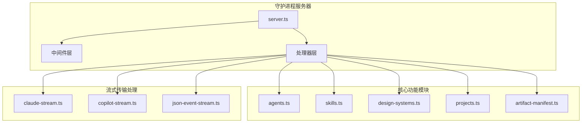
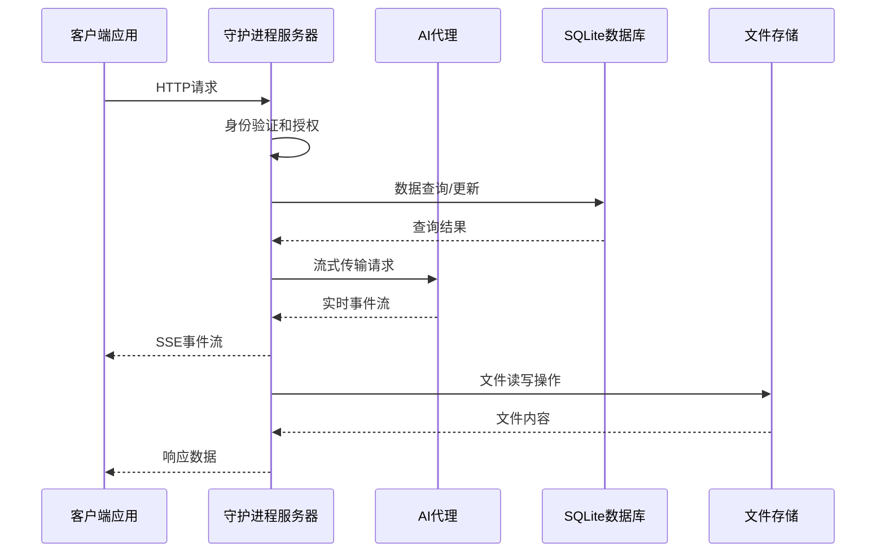
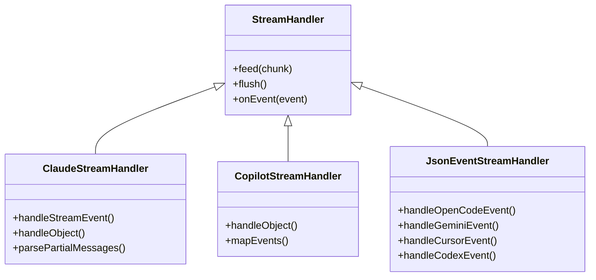

# API 参考文档

<cite>
**本文档引用的文件**
- [server.ts](file://apps/daemon/src/server.ts)
- [agents.ts](file://apps/daemon/src/agents.ts)
- [skills.ts](file://apps/daemon/src/skills.ts)
- [design-systems.ts](file://apps/daemon/src/design-systems.ts)
- [claude-stream.ts](file://apps/daemon/src/claude-stream.ts)
- [copilot-stream.ts](file://apps/daemon/src/copilot-stream.ts)
- [json-event-stream.ts](file://apps/daemon/src/json-event-stream.ts)
- [projects.ts](file://apps/daemon/src/projects.ts)
- [artifact-manifest.ts](file://apps/daemon/src/artifact-manifest.ts)
- [package.json](file://apps/daemon/package.json)
</cite>

## 目录
1. [简介](#简介)
2. [项目结构](#项目结构)
3. [核心组件](#核心组件)
4. [架构概览](#架构概览)
5. [详细组件分析](#详细组件分析)
6. [依赖关系分析](#依赖关系分析)
7. [性能考虑](#性能考虑)
8. [故障排除指南](#故障排除指南)
9. [结论](#结论)
10. [附录](#附录)

## 简介

Open Design 守护进程 API 是一个功能完整的 REST API 服务，为设计系统、AI 代理集成和项目管理提供统一的接口。该 API 支持多种 AI 代理（Claude、Codex、GitHub Copilot 等），提供流式传输支持，管理设计系统和技能，以及完整的项目生命周期管理。

## 项目结构

应用程序采用模块化架构，主要组件包括：



**图表来源**
- [server.ts:1-800](file://apps/daemon/src/server.ts#L1-800)
- [agents.ts:1-800](file://apps/daemon/src/agents.ts#L1-800)
- [skills.ts:1-304](file://apps/daemon/src/skills.ts#L1-304)

**章节来源**
- [server.ts:1-800](file://apps/daemon/src/server.ts#L1-800)
- [package.json:1-57](file://apps/daemon/package.json#L1-57)

## 核心组件

### 服务器配置

守护进程服务器基于 Express.js 构建，提供以下核心功能：

- **跨域安全策略**：严格限制浏览器来源访问
- **静态文件服务**：提供前端构建产物和媒体资源
- **健康检查端点**：监控服务状态
- **版本管理**：API 版本控制和兼容性

### 数据模型

系统使用 SQLite 数据库进行数据持久化，主要实体包括：

- **项目**：用户的工作空间和文件集合
- **对话**：与 AI 代理的交互历史
- **消息**：具体的聊天记录
- **设计系统**：UI 设计规范和样式指南
- **技能**：预定义的设计工作流程模板

**章节来源**
- [server.ts:828-846](file://apps/daemon/src/server.ts#L828-846)
- [projects.ts:1-395](file://apps/daemon/src/projects.ts#L1-395)

## 架构概览



**图表来源**
- [server.ts:781-846](file://apps/daemon/src/server.ts#L781-846)
- [claude-stream.ts:23-208](file://apps/daemon/src/claude-stream.ts#L23-208)

## 详细组件分析

### 代理检测和管理 API

#### 端点：GET /api/agents

**功能描述**：检测并列出可用的 AI 代理，包括 Claude Code、Codex、GitHub Copilot 等。

**请求参数**：
- 无

**响应数据**：
```json
{
  "agents": [
    {
      "id": "string",
      "name": "string",
      "available": "boolean",
      "path": "string",
      "version": "string",
      "models": ["string"],
      "streamFormat": "string"
    }
  ]
}
```

**错误处理**：
- 500：代理检测失败
- 404：代理未找到

**章节来源**
- [server.ts:2226-2233](file://apps/daemon/src/server.ts#L2226-2233)
- [agents.ts:799-884](file://apps/daemon/src/agents.ts#L799-884)

#### 代理流式传输处理

系统支持多种代理格式的流式传输：



**图表来源**
- [claude-stream.ts:23-208](file://apps/daemon/src/claude-stream.ts#L23-208)
- [copilot-stream.ts:25-122](file://apps/daemon/src/copilot-stream.ts#L25-122)
- [json-event-stream.ts:287-332](file://apps/daemon/src/json-event-stream.ts#L287-332)

### 技能列表和详情 API

#### 端点：GET /api/skills

**功能描述**：获取所有可用技能的列表。

**请求参数**：
- 无

**响应数据**：
```json
{
  "skills": [
    {
      "id": "string",
      "name": "string",
      "description": "string",
      "triggers": ["string"],
      "mode": "string",
      "surface": "string",
      "hasBody": "boolean"
    }
  ]
}
```

#### 端点：GET /api/skills/:id

**功能描述**：获取特定技能的详细信息。

**路径参数**：
- `id`: 技能唯一标识符

**响应数据**：
```json
{
  "id": "string",
  "name": "string",
  "description": "string",
  "triggers": ["string"],
  "mode": "string",
  "surface": "string",
  "craftRequires": ["string"],
  "platform": "string",
  "scenario": "string",
  "previewType": "string",
  "designSystemRequired": "boolean",
  "defaultFor": ["string"],
  "featured": "number",
  "body": "string"
}
```

**章节来源**
- [server.ts:2235-2261](file://apps/daemon/src/server.ts#L2235-2261)
- [skills.ts:41-98](file://apps/daemon/src/skills.ts#L41-98)

### 设计系统管理 API

#### 端点：GET /api/design-systems

**功能描述**：获取所有设计系统的列表。

**请求参数**：
- 无

**响应数据**：
```json
{
  "designSystems": [
    {
      "id": "string",
      "title": "string",
      "category": "string",
      "summary": "string",
      "swatches": ["string"],
      "surface": "string"
    }
  ]
}
```

#### 端点：GET /api/design-systems/:id

**功能描述**：获取特定设计系统的详细内容。

**路径参数**：
- `id`: 设计系统唯一标识符

**响应数据**：
```json
{
  "id": "string",
  "body": "string"
}
```

#### 端点：GET /api/design-systems/:id/preview

**功能描述**：获取设计系统的预览页面。

**路径参数**：
- `id`: 设计系统唯一标识符

**响应**：HTML 内容

**章节来源**
- [server.ts:2337-2357](file://apps/daemon/src/server.ts#L2337-2357)
- [design-systems.ts:10-50](file://apps/daemon/src/design-systems.ts#L10-50)

### 聊天和流式传输 API

#### 端点：POST /api/chat

**功能描述**：启动与 AI 代理的聊天会话。

**请求体**：
```json
{
  "agentId": "string",
  "model": "string",
  "reasoning": "string",
  "message": "string",
  "attachments": ["string"]
}
```

**响应数据**：
```json
{
  "sessionId": "string",
  "messages": ["string"]
}
```

**流式传输事件**：
- `text_delta`: 文本增量
- `thinking_delta`: 思考内容增量
- `tool_use`: 工具调用开始
- `tool_result`: 工具执行结果
- `usage`: 使用统计信息

**章节来源**
- [server.ts:1721-1782](file://apps/daemon/src/server.ts#L1721-1782)
- [claude-stream.ts:72-158](file://apps/daemon/src/claude-stream.ts#L72-158)

### BYOK 代理代理 API

#### 端点：POST /api/proxy/{provider}/stream

**功能描述**：为第三方提供商创建代理流式传输。

**路径参数**：
- `provider`: 提供商标识符（如 `openai`、`anthropic`）

**请求体**：
```json
{
  "model": "string",
  "messages": ["object"],
  "stream": "boolean"
}
```

**响应**：SSE 流式响应

**章节来源**
- [server.ts:1721-1782](file://apps/daemon/src/server.ts#L1721-1782)

### 项目管理 API

#### 端点：GET /api/projects

**功能描述**：获取所有项目的列表。

**请求参数**：
- 无

**响应数据**：
```json
{
  "projects": [
    {
      "id": "string",
      "name": "string",
      "skillId": "string",
      "designSystemId": "string",
      "status": "string",
      "createdAt": "number",
      "updatedAt": "number"
    }
  ]
}
```

#### 端点：POST /api/projects

**功能描述**：创建新项目。

**请求体**：
```json
{
  "id": "string",
  "name": "string",
  "skillId": "string",
  "designSystemId": "string",
  "metadata": "object"
}
```

**响应数据**：
```json
{
  "project": "object",
  "conversationId": "string"
}
```

#### 端点：GET /api/projects/:id

**功能描述**：获取特定项目的信息。

**路径参数**：
- `id`: 项目唯一标识符

**响应数据**：
```json
{
  "project": "object"
}
```

#### 端点：PATCH /api/projects/:id

**功能描述**：更新项目信息。

**路径参数**：
- `id`: 项目唯一标识符

**请求体**：
```json
{
  "name": "string",
  "skillId": "string",
  "designSystemId": "string"
}
```

**响应数据**：
```json
{
  "project": "object"
}
```

#### 端点：DELETE /api/projects/:id

**功能描述**：删除项目。

**路径参数**：
- `id`: 项目唯一标识符

**响应数据**：
```json
{
  "ok": "boolean"
}
```

**章节来源**
- [server.ts:855-1080](file://apps/daemon/src/server.ts#L855-1080)
- [projects.ts:26-327](file://apps/daemon/src/projects.ts#L26-327)

### 工件处理 API

#### 端点：POST /api/artifacts/save

**功能描述**：保存生成的工件到磁盘。

**请求体**：
```json
{
  "identifier": "string",
  "title": "string",
  "html": "string"
}
```

**响应数据**：
```json
{
  "path": "string",
  "url": "string",
  "lint": "object"
}
```

#### 端点：POST /api/artifacts/lint

**功能描述**：对 HTML 进行代码质量检查。

**请求体**：
```json
{
  "html": "string"
}
```

**响应数据**：
```json
{
  "findings": "array",
  "agentMessage": "string"
}
```

**章节来源**
- [server.ts:2536-2576](file://apps/daemon/src/server.ts#L2536-2576)
- [artifact-manifest.ts:72-200](file://apps/daemon/src/artifact-manifest.ts#L72-200)

## 依赖关系分析

```mermaid
graph TD
subgraph "外部依赖"
Express[Express.js]
BetterSqlite[better-sqlite3]
Multer[multer]
JSZip[jszip]
end
subgraph "内部模块"
Contracts[@open-design/contracts]
Platform[@open-design/platform]
Sidecar[@open-design/sidecar]
end
subgraph "守护进程核心"
Server[server.ts]
Agents[agents.ts]
Skills[skills.ts]
Projects[projects.ts]
end
Express --> Server
BetterSqlite --> Server
Multer --> Server
JSZip --> Server
Contracts --> Server
Platform --> Server
Sidecar --> Server
Server --> Agents
Server --> Skills
Server --> Projects
```

**图表来源**
- [package.json:34-52](file://apps/daemon/package.json#L34-52)
- [server.ts:1-50](file://apps/daemon/src/server.ts#L1-50)

**章节来源**
- [package.json:1-57](file://apps/daemon/package.json#L1-57)

## 性能考虑

### 流式传输优化

系统采用多种策略优化流式传输性能：

- **SSE 心跳机制**：每 25 秒发送一次心跳包，防止代理超时
- **缓冲区管理**：智能缓冲区大小控制，平衡延迟和内存使用
- **并发限制**：限制同时运行的代理数量，避免资源争用

### 文件上传优化

- **分块上传**：支持大文件分块上传，避免内存溢出
- **文件类型验证**：严格的文件类型和大小验证
- **临时文件清理**：自动清理上传过程中的临时文件

### 缓存策略

- **代理能力探测缓存**：缓存代理能力探测结果，减少重复探测
- **技能列表缓存**：技能列表在短时间内缓存，减少文件系统访问
- **设计系统缓存**：设计系统内容按需加载和缓存

## 故障排除指南

### 常见错误类型

| 错误码 | 错误类型 | 描述 | 解决方案 |
|--------|----------|------|----------|
| 400 | BAD_REQUEST | 请求参数无效 | 检查请求体格式和必需字段 |
| 401 | UNAUTHORIZED | 认证失败 | 验证访问令牌和权限 |
| 403 | FORBIDDEN | 权限不足 | 检查用户权限和资源访问控制 |
| 404 | NOT_FOUND | 资源不存在 | 验证资源 ID 和路径 |
| 413 | PAYLOAD_TOO_LARGE | 请求体过大 | 减少文件大小或分块上传 |
| 500 | INTERNAL_ERROR | 服务器内部错误 | 检查日志和系统资源 |

### 代理连接问题

**问题症状**：
- 代理无法启动
- 流式传输中断
- 超时错误

**诊断步骤**：
1. 检查代理可执行文件是否存在
2. 验证代理版本兼容性
3. 确认网络连接和代理配置
4. 查看代理日志输出

**章节来源**
- [server.ts:541-545](file://apps/daemon/src/server.ts#L541-545)
- [agents.ts:733-775](file://apps/daemon/src/agents.ts#L733-775)

## 结论

Open Design 守护进程 API 提供了一个功能完整、性能优化的 REST API 服务，支持多种 AI 代理集成、流式传输处理和完整的项目管理功能。通过模块化架构设计和严格的错误处理机制，该 API 能够满足复杂的设计系统开发需求。

## 附录

### API 版本控制

系统使用语义化版本控制，当前版本为 0.3.0。版本控制遵循以下规则：

- **主版本号**：重大架构变更
- **次版本号**：新增功能但向后兼容
- **修订号**：错误修复和小改进

### 迁移指南

从旧版本迁移到新版本时需要注意：

1. **代理 API 变更**：检查代理配置和参数映射
2. **流式传输格式**：更新客户端以处理新的事件格式
3. **文件路径变更**：确认项目文件存储路径更新
4. **错误处理**：适配新的错误响应格式

### 安全注意事项

- **跨域访问控制**：严格限制浏览器来源访问
- **文件上传安全**：验证文件类型和内容
- **路径遍历防护**：确保文件操作的安全性
- **代理权限管理**：限制代理的文件系统访问权限