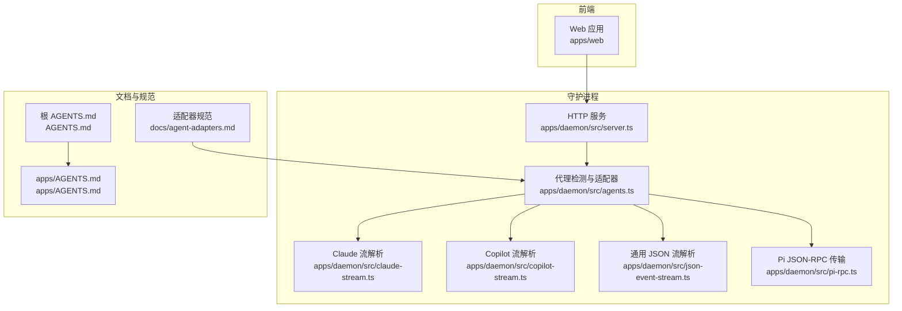
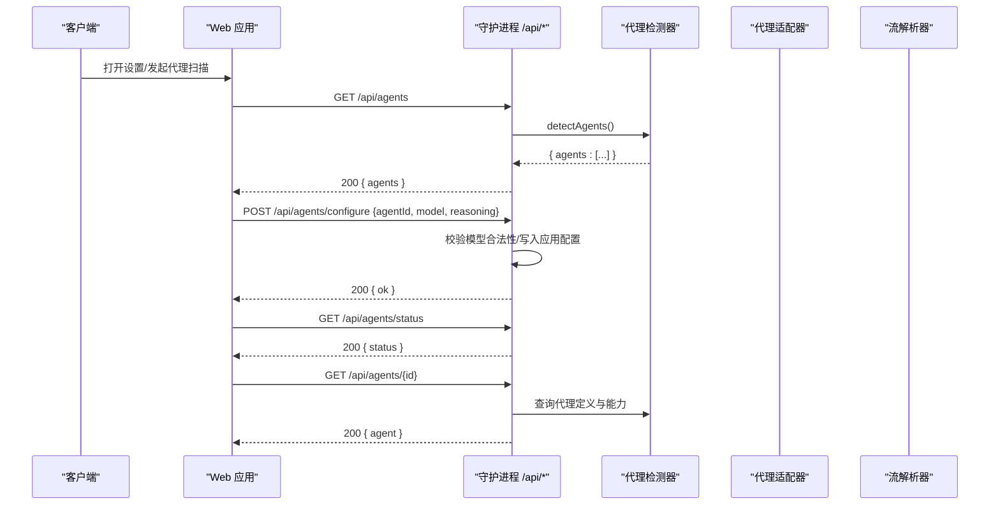
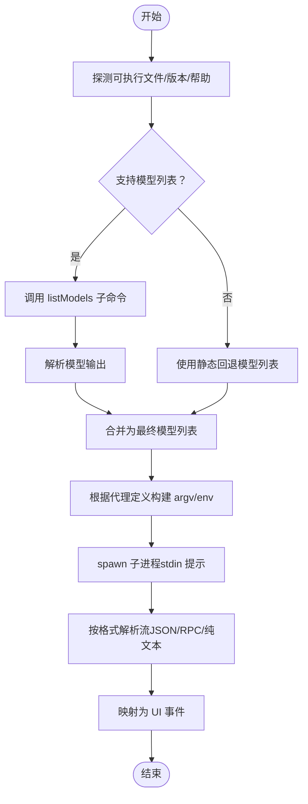
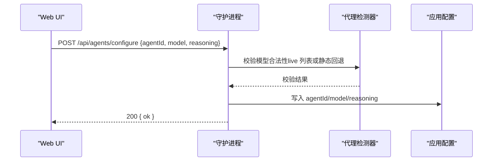
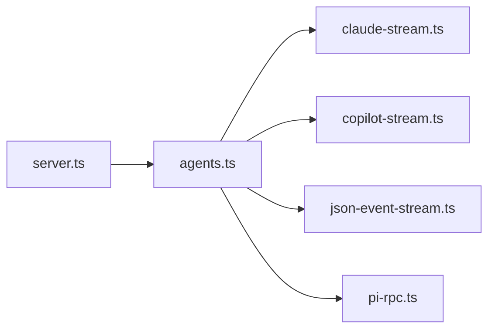

# 代理管理 API

<cite>
**本文引用的文件**
- [apps/daemon/src/server.ts](file://apps/daemon/src/server.ts)
- [apps/daemon/src/agents.ts](file://apps/daemon/src/agents.ts)
- [apps/daemon/src/pi-rpc.ts](file://apps/daemon/src/pi-rpc.ts)
- [apps/daemon/src/claude-stream.ts](file://apps/daemon/src/claude-stream.ts)
- [apps/daemon/src/copilot-stream.ts](file://apps/daemon/src/copilot-stream.ts)
- [apps/daemon/src/json-event-stream.ts](file://apps/daemon/src/json-event-stream.ts)
- [apps/web/src/components/SettingsDialog.tsx](file://apps/web/src/components/SettingsDialog.tsx)
- [docs/agent-adapters.md](file://docs/agent-adapters.md)
- [AGENTS.md](file://AGENTS.md)
- [apps/AGENTS.md](file://apps/AGENTS.md)
</cite>

## 目录
1. [简介](#简介)
2. [项目结构](#项目结构)
3. [核心组件](#核心组件)
4. [架构总览](#架构总览)
5. [详细组件分析](#详细组件分析)
6. [依赖关系分析](#依赖关系分析)
7. [性能考量](#性能考量)
8. [故障排除指南](#故障排除指南)
9. [结论](#结论)
10. [附录](#附录)

## 简介
本文件系统化梳理代理管理 API，重点覆盖以下端点与能力：
- 代理检测：GET /api/agents
- 代理信息获取：GET /api/agents/{id}
- 代理配置管理：POST /api/agents/configure
- 代理状态监控：GET /api/agents/status

同时，深入解析代理适配器工作原理、13种支持的代理类型及其差异、最佳实践、故障排除与性能优化建议。

## 项目结构
- 守护进程（apps/daemon）提供本地 REST/SSE 服务、代理 CLI 检测与调用、技能与设计系统管理、工件持久化与静态资源服务。
- Web 前端（apps/web）通过 /api/* 与守护进程交互，负责代理选择、模型列表展示与运行状态呈现。
- 文档（docs/agent-adapters.md）定义了适配器接口、检测策略、流式事件与权限边界。
- 根目录与 apps/AGENTS.md 提供跨模块边界与开发流程说明。

图表来源
- [apps/daemon/src/server.ts](file://apps/daemon/src/server.ts)
- [apps/daemon/src/agents.ts](file://apps/daemon/src/agents.ts)
- [apps/daemon/src/claude-stream.ts](file://apps/daemon/src/claude-stream.ts)
- [apps/daemon/src/copilot-stream.ts](file://apps/daemon/src/copilot-stream.ts)
- [apps/daemon/src/json-event-stream.ts](file://apps/daemon/src/json-event-stream.ts)
- [apps/daemon/src/pi-rpc.ts](file://apps/daemon/src/pi-rpc.ts)
- [docs/agent-adapters.md](file://docs/agent-adapters.md)
- [AGENTS.md](file://AGENTS.md)
- [apps/AGENTS.md](file://apps/AGENTS.md)

章节来源
- [apps/daemon/src/server.ts](file://apps/daemon/src/server.ts)
- [apps/daemon/src/agents.ts](file://apps/daemon/src/agents.ts)
- [docs/agent-adapters.md](file://docs/agent-adapters.md)
- [AGENTS.md](file://AGENTS.md)
- [apps/AGENTS.md](file://apps/AGENTS.md)

## 核心组件
- 代理检测与清单
  - 通过并行探测各代理可执行文件、版本与能力，生成可用代理清单；同时缓存模型列表以校验用户选择的模型合法性。
- 适配器定义与构建参数
  - 每个代理定义包含二进制名、回退二进制、帮助标志探测、模型列表获取、构建参数、提示传递方式、流格式与事件解析器等。
- 流式输出解析
  - Claude/Copilot/Pi 等采用专用解析器将子进程 stdout/stdin JSON-RPC 映射为统一 UI 事件。
- Web 侧集成
  - 设置对话框中展示检测到的代理卡片，支持刷新扫描与切换当前代理。

章节来源
- [apps/daemon/src/agents.ts](file://apps/daemon/src/agents.ts)
- [apps/web/src/components/SettingsDialog.tsx](file://apps/web/src/components/SettingsDialog.tsx)

## 架构总览
下图展示了从 Web 请求到代理执行与流式事件返回的关键路径。

图表来源
- [apps/daemon/src/server.ts](file://apps/daemon/src/server.ts)
- [apps/daemon/src/agents.ts](file://apps/daemon/src/agents.ts)

## 详细组件分析

### 端点：GET /api/agents（代理检测）
- 功能概述
  - 返回当前环境中已检测到的代理清单，包含每个代理的可用性、版本、路径与模型列表。
- 请求/响应
  - 请求：无查询参数或请求体。
  - 成功响应：包含 agents 数组，数组元素为代理对象（字段见“代理对象结构”）。
  - 错误响应：500 时返回 { error }。
- 处理流程
  - 调用 detectAgents() 并行探测所有代理，缓存最近一次模型列表，确保后续聊天校验合法。
- 典型场景
  - 首次进入设置页面时拉取代理列表；点击“重新扫描”后刷新。
- 与 UI 的关系
  - 设置对话框中的代理网格由该接口驱动，显示可用/不可用状态与版本信息。

章节来源
- [apps/daemon/src/server.ts](file://apps/daemon/src/server.ts)
- [apps/daemon/src/agents.ts](file://apps/daemon/src/agents.ts)
- [apps/web/src/components/SettingsDialog.tsx](file://apps/web/src/components/SettingsDialog.tsx)

### 端点：GET /api/agents/{id}
- 功能概述
  - 获取指定代理的定义与能力信息（不含敏感数据），用于 UI 展示与能力开关。
- 请求/响应
  - 请求：路径参数 id。
  - 成功响应：包含单个代理对象（字段见“代理对象结构”）。
  - 错误响应：404 时返回 { error }。
- 处理流程
  - 通过 getAgentDef(id) 查找代理定义，剥离内部函数与探测元数据后返回。
- 注意事项
  - 该端点不暴露环境变量、构建参数闭包等实现细节。

章节来源
- [apps/daemon/src/agents.ts](file://apps/daemon/src/agents.ts)
- [apps/daemon/src/server.ts](file://apps/daemon/src/server.ts)

### 端点：POST /api/agents/configure（代理配置管理）
- 功能概述
  - 更新当前会话使用的代理与模型选择；守护进程对模型进行合法性校验（基于最近一次检测结果与静态回退列表）。
- 请求/响应
  - 请求体示例（字段见“请求体字段”）。
  - 成功响应：200 { ok }。
  - 错误响应：400/403/500 时返回 { error }。
- 处理流程
  - 校验 agentId 是否存在；
  - 校验 model 是否在 live 列表或静态回退列表中，或是否为自定义合法值；
  - 可选：reasoning（推理强度）按代理规则裁剪（如 Codex）；
  - 写入应用配置（例如当前激活代理）。
- 安全与边界
  - 仅允许同源 Origin 访问（参考应用配置端点的安全策略）。
- 最佳实践
  - 在运行前先 GET /api/agents 获取最新模型列表，再提交 configure 请求；
  - 自定义模型需满足正则约束，避免注入风险。

章节来源
- [apps/daemon/src/agents.ts](file://apps/daemon/src/agents.ts)
- [apps/daemon/src/server.ts](file://apps/daemon/src/server.ts)

### 端点：GET /api/agents/status（代理状态监控）
- 功能概述
  - 返回守护进程内代理检测缓存状态、可用代理数量与最近一次检测时间等摘要信息，便于 UI 呈现“状态指示”。
- 请求/响应
  - 请求：无。
  - 成功响应：包含状态摘要（如 count、lastUpdated 等）。
  - 错误响应：500 时返回 { error }。
- 使用场景
  - 在长时间未刷新代理列表时，通过该端点判断是否需要重新扫描。

章节来源
- [apps/daemon/src/server.ts](file://apps/daemon/src/server.ts)

### 代理对象结构
- 字段说明（节选）
  - id：代理标识符（如 claude、codex、gemini、copilot 等）
  - name：显示名称
  - available：是否在 PATH 中可用
  - version：版本字符串
  - path：绝对可执行路径
  - models：模型列表（含 default）
  - streamFormat：流式输出格式（如 claude-stream-json、copilot-stream-json、pi-rpc 等）
  - promptViaStdin：是否通过 stdin 传递提示（避免 Windows ENAMETOOLONG）
  - env：可选环境变量（如 GEMINI_CLI_TRUST_WORKSPACE）
  - reasoningOptions：推理强度预设（如 codex、pi）
- 说明
  - 该结构由 detectAgents() 探测后返回，部分探测元数据（如 buildArgs、listModels）在序列化时被剥离。

章节来源
- [apps/daemon/src/agents.ts](file://apps/daemon/src/agents.ts)

### 请求体字段（POST /api/agents/configure）
- agentId：目标代理 id（来自 GET /api/agents）
- model：所选模型 id（默认为 default）
- reasoning：推理强度（若代理支持）
- 其他：按代理定义传入的额外选项（如工作目录、额外允许目录等）

章节来源
- [apps/daemon/src/agents.ts](file://apps/daemon/src/agents.ts)

### 代理适配器工作原理
- 检测阶段
  - 并行探测每个代理的可执行文件是否存在、版本号与帮助信息，记录能力标志（如 partialMessages、addDir）。
  - 对支持“模型列表”的代理，尝试调用其 listModels 子命令；失败时使用静态回退列表。
- 运行阶段
  - 根据代理定义构建 argv，必要时设置环境变量与工作目录；
  - 通过 stdin 传递提示（避免 Windows 命令行长度限制）；
  - 依据 streamFormat 选择解析器，将子进程输出映射为统一事件流。
- 权限与安全
  - 代理权限策略由各自 CLI 决定；守护进程不提升权限，仅透传用户配置。

图表来源
- [apps/daemon/src/agents.ts](file://apps/daemon/src/agents.ts)

章节来源
- [apps/daemon/src/agents.ts](file://apps/daemon/src/agents.ts)
- [docs/agent-adapters.md](file://docs/agent-adapters.md)

### 支持的代理类型与特性概览
- Claude Code
  - 特性：支持 partialMessages、--add-dir、stream-json 输出、stdin 提示。
  - 模型：默认 + 常用别名与 ID。
- Codex CLI
  - 特性：reasoningOptions、--model、--reasoning 裁剪、stdin 提示。
  - 模型：默认 + 常见 gpt-5/o3/o4 系列。
- Devin for Terminal
  - 特性：ACP JSON-RPC over stdio。
  - 模型：动态检测（ACP）。
- Gemini CLI
  - 特性：--output-format stream-json、GEMINI_CLI_TRUST_WORKSPACE、stdin 提示。
  - 模型：默认 + 2.5-pro/2.5-flash。
- OpenCode
  - 特性：--format json、--dangerously-skip-permissions、stdin 提示。
  - 模型：provider/model 格式。
- Hermes
  - 特性：ACP JSON-RPC over stdio。
  - 模型：动态检测（ACP）。
- Kimi CLI
  - 特性：ACP JSON-RPC over stdio。
  - 模型：动态检测（ACP）。
- Cursor Agent
  - 特性：--workspace、--print/--output-format、stdin 提示。
  - 模型：默认 + 常见 auto/sonnet/gpt-5。
- Qwen Code
  - 特性：--yolo、stdin 提示。
  - 模型：默认 + qwen3-coder-*。
- GitHub Copilot CLI
  - 特性：-p -、--allow-all-tools、--output-format json、--add-dir。
  - 模型：默认 + 常见 Claude Sonnet/GPT-5.2。
- Pi
  - 特性：--mode rpc、--thinking、stdin 提示。
  - 模型：--model 支持模式匹配。
- Kiro CLI
  - 特性：ACP JSON-RPC over stdio。
  - 模型：动态检测（ACP）。
- Mistral Vibe CLI
  - 特性：ACP JSON-RPC over stdio。
  - 模型：动态检测（ACP）。

章节来源
- [apps/daemon/src/agents.ts](file://apps/daemon/src/agents.ts)
- [docs/agent-adapters.md](file://docs/agent-adapters.md)

### API 工作流（POST /api/agents/configure）

图表来源
- [apps/daemon/src/agents.ts](file://apps/daemon/src/agents.ts)
- [apps/daemon/src/server.ts](file://apps/daemon/src/server.ts)

## 依赖关系分析
- 组件耦合
  - server.ts 依赖 agents.ts 进行代理检测与模型校验；agents.ts 依赖各解析器（claude-stream、copilot-stream、json-event-stream、pi-rpc）处理不同流格式。
- 外部依赖
  - 各代理 CLI 的安装与认证状态直接影响可用性与模型列表；守护进程通过 PATH 与用户工具链目录扫描。
- 循环依赖
  - 未发现直接循环；解析器作为纯函数被 agents.ts 调用。

图表来源
- [apps/daemon/src/server.ts](file://apps/daemon/src/server.ts)
- [apps/daemon/src/agents.ts](file://apps/daemon/src/agents.ts)
- [apps/daemon/src/claude-stream.ts](file://apps/daemon/src/claude-stream.ts)
- [apps/daemon/src/copilot-stream.ts](file://apps/daemon/src/copilot-stream.ts)
- [apps/daemon/src/json-event-stream.ts](file://apps/daemon/src/json-event-stream.ts)
- [apps/daemon/src/pi-rpc.ts](file://apps/daemon/src/pi-rpc.ts)

章节来源
- [apps/daemon/src/server.ts](file://apps/daemon/src/server.ts)
- [apps/daemon/src/agents.ts](file://apps/daemon/src/agents.ts)

## 性能考量
- 代理检测预热
  - 守护进程启动时预热探测，减少首次 /api/chat 的等待时间。
- 模型列表缓存
  - detectAgents() 后更新 liveModelCache，降低后续校验开销。
- 流式解析
  - 采用轻量解析器，避免大对象复制；stdin 传递提示避免超长命令行导致的 spawn 失败。
- 并发探测
  - 并行探测多个代理，缩短整体检测时间。

章节来源
- [apps/daemon/src/server.ts](file://apps/daemon/src/server.ts)
- [apps/daemon/src/agents.ts](file://apps/daemon/src/agents.ts)

## 故障排除指南
- 代理未出现在列表
  - 确认 CLI 已安装且在 PATH 中；若使用 GUI 启动器，PATH 可能受限；可手动添加用户级工具链目录。
  - 尝试刷新扫描（GET /api/agents）。
- 模型选择无效
  - 确保在 GET /api/agents 后再提交 configure；自定义模型需满足正则约束。
- Windows 命令行过长
  - 代理已通过 promptViaStdin 避免 ENAMETOOLONG；若仍遇问题，请检查提示长度与平台限制。
- Copilot 交互阻塞
  - 必须传入 --allow-all-tools；否则会阻塞等待人工确认。
- Pi/Acp 类代理无输出
  - 确认 --mode rpc 或 ACP 参数正确；检查 JSON-RPC 解析器日志。
- 同源/主机头校验失败
  - 请确保 Origin/Host 符合同源策略（参考应用配置端点测试用例）。

章节来源
- [apps/daemon/src/agents.ts](file://apps/daemon/src/agents.ts)
- [apps/daemon/src/server.ts](file://apps/daemon/src/server.ts)
- [apps/daemon/src/copilot-stream.ts](file://apps/daemon/src/copilot-stream.ts)
- [apps/daemon/src/pi-rpc.ts](file://apps/daemon/src/pi-rpc.ts)

## 结论
代理管理 API 通过标准化的检测、配置与状态接口，将多厂商代码代理统一接入同一 UI 体验。配合严格的模型校验、流式解析与安全边界，既保证易用性也兼顾稳定性。建议在生产中结合预热探测、模型缓存与最小权限原则，持续优化性能与可靠性。

## 附录

### API 定义与示例

- GET /api/agents
  - 请求：无
  - 成功响应：{
      "agents": [
        {
          "id": "claude",
          "name": "Claude Code",
          "available": true,
          "version": "x.y.z",
          "path": "/usr/local/bin/claude",
          "models": [{ "id": "default", "label": "Default (CLI config)" }, { "id": "...", "label": "..." }],
          "streamFormat": "claude-stream-json",
          "promptViaStdin": true
        }
      ]
    }
  - 错误响应：{
      "error": "..."
    }

- GET /api/agents/{id}
  - 请求：无
  - 成功响应：{
      "id": "claude",
      "name": "Claude Code",
      "available": true,
      "version": "x.y.z",
      "path": "/usr/local/bin/claude",
      "models": [...],
      "streamFormat": "claude-stream-json",
      "promptViaStdin": true
    }
  - 错误响应：{
      "error": "..."
    }

- POST /api/agents/configure
  - 请求体：{
      "agentId": "claude",
      "model": "default|自定义模型ID",
      "reasoning": "default|minimal|low|medium|high|xhigh"
    }
  - 成功响应：{
      "ok": true
    }
  - 错误响应：{
      "error": "..."
    }

- GET /api/agents/status
  - 请求：无
  - 成功响应：{
      "count": 13,
      "lastUpdated": "2025-01-01T00:00:00Z",
      "agents": ["claude","codex","gemini","copilot","pi","cursor-agent","qwen","devin","hermes","kimi","opencode","kiro","vibe"]
    }
  - 错误响应：{
      "error": "..."
    }

章节来源
- [apps/daemon/src/server.ts](file://apps/daemon/src/server.ts)
- [apps/daemon/src/agents.ts](file://apps/daemon/src/agents.ts)