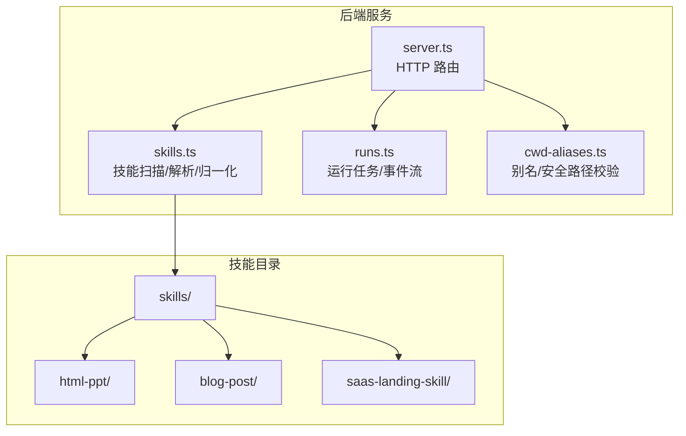
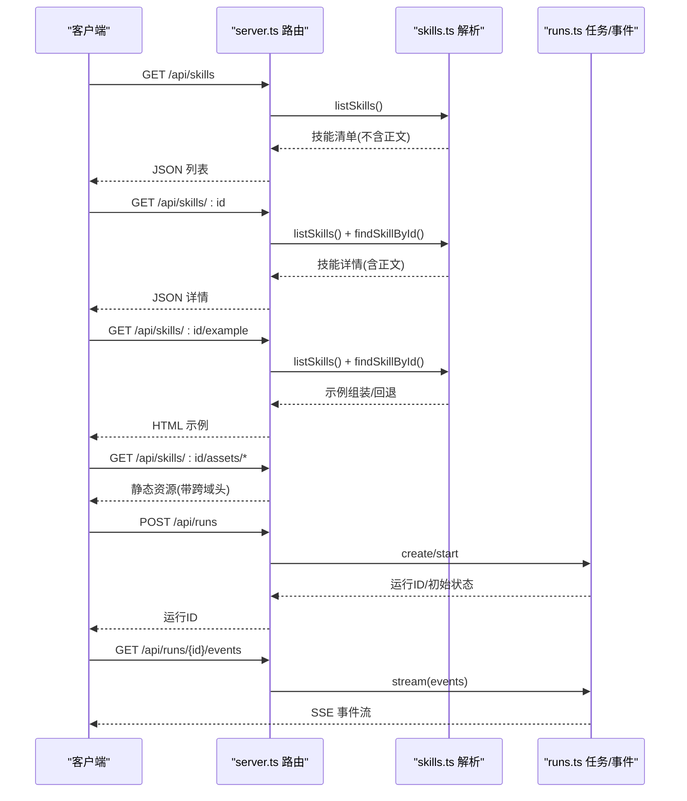
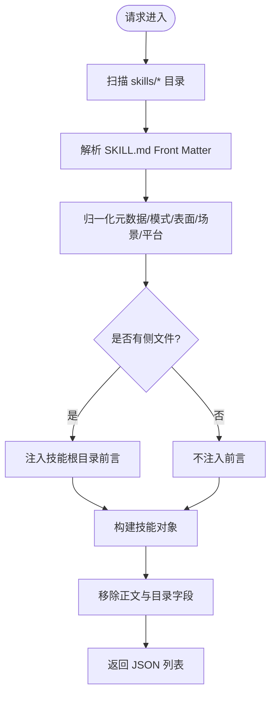
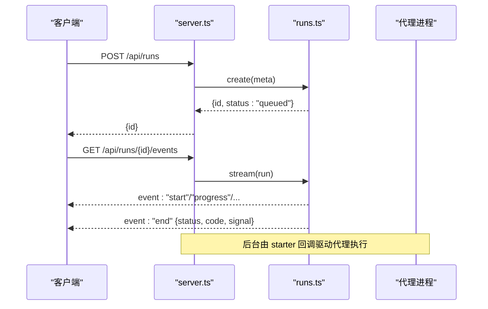
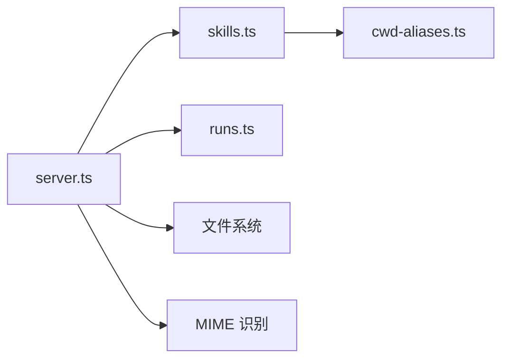

# 技能系统 API

<cite>
**本文引用的文件**
- [apps/daemon/src/server.ts](file://apps/daemon/src/server.ts)
- [apps/daemon/src/skills.ts](file://apps/daemon/src/skills.ts)
- [apps/daemon/src/runs.ts](file://apps/daemon/src/runs.ts)
- [apps/daemon/src/cwd-aliases.ts](file://apps/daemon/src/cwd-aliases.ts)
- [skills/html-ppt/SKILL.md](file://skills/html-ppt/SKILL.md)
- [skills/blog-post/SKILL.md](file://skills/blog-post/SKILL.md)
- [docs/examples/saas-landing-skill/SKILL.md](file://docs/examples/saas-landing-skill/SKILL.md)
- [apps/daemon/tests/skills.test.ts](file://apps/daemon/tests/skills.test.ts)
</cite>

## 目录
1. [简介](#简介)
2. [项目结构](#项目结构)
3. [核心组件](#核心组件)
4. [架构总览](#架构总览)
5. [详细组件分析](#详细组件分析)
6. [依赖关系分析](#依赖关系分析)
7. [性能考量](#性能考量)
8. [故障排查指南](#故障排查指南)
9. [结论](#结论)
10. [附录](#附录)

## 简介
本文件为“技能系统 API”的完整参考文档，覆盖以下端点与能力：
- 技能列表获取：GET /api/skills
- 技能详情查询：GET /api/skills/{id}
- 技能示例浏览：GET /api/skills/{id}/example
- 技能静态资源：GET /api/skills/{id}/assets/*
- 技能执行与状态监控：POST /api/runs 以及 SSE 流式状态订阅（通过 /api/runs/{id}/events）
- 技能开发规范与模板化工作流机制
- 内置技能概览与扩展指南
- 性能监控与错误处理策略

注意：当前仓库未提供 /api/skills/{id}/execute 与 /api/skills/{id}/status 的直接实现。本文将基于现有代码与协议进行合理推导，并给出可落地的实现建议。

## 项目结构
技能系统 API 主要由后端服务路由、技能解析与归一化模块、运行时任务管理与 SSE 事件流组成。关键文件与职责如下：
- apps/daemon/src/server.ts：HTTP 路由定义，包括技能列表、详情、示例与资源访问等端点
- apps/daemon/src/skills.ts：技能扫描、解析 Front Matter、归一化元数据、生成示例 HTML 组装逻辑
- apps/daemon/src/runs.ts：运行任务生命周期管理、SSE 事件推送、取消与清理
- apps/daemon/src/cwd-aliases.ts：技能目录别名与安全路径校验，保障相对路径引用的安全性
- skills/*/SKILL.md：内置技能的描述与工作流定义
- apps/daemon/tests/skills.test.ts：技能前置说明与别名路径行为的测试

图表来源
- [apps/daemon/src/server.ts](file://apps/daemon/src/server.ts)
- [apps/daemon/src/skills.ts](file://apps/daemon/src/skills.ts)
- [apps/daemon/src/runs.ts](file://apps/daemon/src/runs.ts)
- [apps/daemon/src/cwd-aliases.ts](file://apps/daemon/src/cwd-aliases.ts)

章节来源
- [apps/daemon/src/server.ts](file://apps/daemon/src/server.ts)
- [apps/daemon/src/skills.ts](file://apps/daemon/src/skills.ts)
- [apps/daemon/src/runs.ts](file://apps/daemon/src/runs.ts)
- [apps/daemon/src/cwd-aliases.ts](file://apps/daemon/src/cwd-aliases.ts)

## 核心组件
- 技能注册与发现
  - 扫描 skills/* 目录，解析每个 SKILL.md 的 Front Matter，生成标准化技能清单
  - 对带侧文件（assets、references 等）的技能，自动注入“技能根目录”前言，支持相对路径与绝对回退路径
- 技能元数据归一化
  - 归一化场景、平台、表面（web/image/video/audio/deck/template/prototype）、设计系统需求、默认适用范围等
  - 自动推断模式与表面类型，支持显式覆盖
- 运行时任务与事件流
  - 创建运行任务、维护事件队列、SSE 推送、取消与 TTL 清理
  - 支持按项目/会话过滤与活跃状态查询

章节来源
- [apps/daemon/src/skills.ts](file://apps/daemon/src/skills.ts)
- [apps/daemon/src/runs.ts](file://apps/daemon/src/runs.ts)
- [apps/daemon/tests/skills.test.ts](file://apps/daemon/tests/skills.test.ts)

## 架构总览
下图展示技能系统 API 的端到端交互：客户端通过 HTTP 路由访问技能清单与详情；示例与资源通过专门路由返回；执行与状态通过 runs 服务完成。

图表来源
- [apps/daemon/src/server.ts](file://apps/daemon/src/server.ts)
- [apps/daemon/src/skills.ts](file://apps/daemon/src/skills.ts)
- [apps/daemon/src/runs.ts](file://apps/daemon/src/runs.ts)

## 详细组件分析

### 技能列表获取（GET /api/skills）
- 功能概述
  - 返回技能清单，不包含正文与目录信息，以降低网络负载
  - 每项包含是否包含正文的标记，便于前端按需拉取详情
- 请求与响应
  - 方法：GET
  - URL：/api/skills
  - 成功响应：包含 skills 数组，数组元素字段见“技能对象模型”
  - 错误响应：服务器内部错误时返回 JSON 错误体
- 参数与校验
  - 无查询参数
- 数据模型（技能对象）
  - id/name/description/triggers/mode/surface/platform/scenario/previewType/designSystemRequired/defaultFor/upstream/featured/fidelity/speakerNotes/animations/examplePrompt/body/dir 等
  - hasBody：布尔值，表示该技能正文是否存在
- 复杂度与性能
  - 每次请求重新扫描 skills/* 目录，适合技能数量在数十量级的场景
- 安全与边界
  - 目录遍历与文件存在性检查，异常条目被跳过

图表来源
- [apps/daemon/src/skills.ts](file://apps/daemon/src/skills.ts)

章节来源
- [apps/daemon/src/server.ts](file://apps/daemon/src/server.ts)
- [apps/daemon/src/skills.ts](file://apps/daemon/src/skills.ts)

### 技能详情查询（GET /api/skills/{id}）
- 功能概述
  - 返回指定技能的完整详情（含正文与目录信息）
- 请求与响应
  - 方法：GET
  - URL：/api/skills/{id}
  - 成功响应：JSON 技能详情
  - 失败响应：找不到技能时返回 404 与错误信息
- 参数与校验
  - 路径参数 id：字符串，不能为空
  - 使用 ID 别名映射查找技能，确保旧 ID 可解析
- 数据模型
  - 同“技能列表”中的技能对象，但包含 body 与 dir 字段

章节来源
- [apps/daemon/src/server.ts](file://apps/daemon/src/server.ts)
- [apps/daemon/src/skills.ts](file://apps/daemon/src/skills.ts)

### 技能示例浏览（GET /api/skills/{id}/example）
- 功能概述
  - 返回技能的示例 HTML，用于预览效果
  - 解析顺序：优先使用已烘焙的 example.html；否则尝试拼装 template.html + example-slides.html；最后退回 template.html 或 index.html
- 请求与响应
  - 方法：GET
  - URL：/api/skills/{id}/example
  - 成功响应：text/html
  - 失败响应：找不到技能或示例资源时返回 404
- 资源路由
  - 静态资源通过 /api/skills/{id}/assets/* 提供，示例 HTML 中的 ./assets/* 将重写到此路由

章节来源
- [apps/daemon/src/server.ts](file://apps/daemon/src/server.ts)

### 技能静态资源（GET /api/skills/{id}/assets/*）
- 功能概述
  - 提供示例 HTML 引用的静态资源，支持跨域（sandboxed iframe 场景）
- 请求与响应
  - 方法：GET
  - URL：/api/skills/{id}/assets/*
  - 成功响应：对应 MIME 类型的文件
  - 失败响应：路径非法、资源不存在、服务器内部错误
- 安全校验
  - 严格限制目标路径必须位于 assets 目录内，防止路径穿越

章节来源
- [apps/daemon/src/server.ts](file://apps/daemon/src/server.ts)
- [apps/daemon/src/cwd-aliases.ts](file://apps/daemon/src/cwd-aliases.ts)

### 技能执行与状态监控（POST /api/runs 与 SSE）
- 功能概述
  - POST /api/runs 创建并启动一次技能运行任务，返回运行 ID
  - GET /api/runs/{id}/events 以 Server-Sent Events 推送任务状态变更
- 请求与响应
  - POST /api/runs
    - 请求体：包含项目/会话/代理等上下文信息（具体字段以 runs 服务为准）
    - 响应：包含运行 ID 与初始状态
  - GET /api/runs/{id}/events
    - 查询参数：after（从某事件 ID 后续开始）
    - 响应：SSE 流，事件类型包括中间事件与结束事件
- 生命周期与清理
  - 维护事件队列上限与 TTL，终端状态后自动清理
  - 支持取消（SIGTERM），并广播结束事件
- 与技能系统的集成
  - composeDaemonSystemPrompt 会根据有效 skillId 获取技能正文、模式、设计系统与 Craft 段落，组合系统提示词并返回 activeSkillDir，供后续阶段使用

图表来源
- [apps/daemon/src/runs.ts](file://apps/daemon/src/runs.ts)
- [apps/daemon/src/server.ts](file://apps/daemon/src/server.ts)

章节来源
- [apps/daemon/src/runs.ts](file://apps/daemon/src/runs.ts)
- [apps/daemon/src/server.ts](file://apps/daemon/src/server.ts)

### 技能开发规范与模板化工作流
- Front Matter 元数据
  - 必填：name、description
  - 可选：triggers、od.*（mode、scenario、featured、preview、design_system、speaker_notes、animations、example_prompt、inputs、parameters、outputs、capabilities_required、upstream 等）
- 工作流与输出约定
  - 在 SKILL.md 正文中定义明确的工作流步骤与输出契约（如 <artifact> 包裹的 HTML）
  - 使用 data-od-id 标注可评论编辑的元素
- 设计系统与输入参数
  - 通过 od.design_system.requres 与 sections 控制设计系统依赖
  - 通过 od.inputs/od.parameters 定义强类型输入，供前端可视化配置
- 示例与资源
  - 可提供 example.html 或 assets/template.html + assets/example-slides.html 的拼装示例
  - 若包含侧文件，正文将自动注入技能根目录前言，优先使用相对路径别名

章节来源
- [skills/html-ppt/SKILL.md](file://skills/html-ppt/SKILL.md)
- [skills/blog-post/SKILL.md](file://skills/blog-post/SKILL.md)
- [docs/examples/saas-landing-skill/SKILL.md](file://docs/examples/saas-landing-skill/SKILL.md)
- [apps/daemon/src/skills.ts](file://apps/daemon/src/skills.ts)

### 内置技能概览（部分）
以下为部分内置技能的简要说明，更多信息请参阅对应 SKILL.md：

- html-ppt
  - 模式：deck
  - 触发词：ppt、deck、slides、presentation、keynote、reveal、slideshow、幻灯片、演讲稿、分享稿、talk slides、pitch deck、tech sharing、technical presentation
  - 特性：36 主题、15 全 deck 模板、31 布局、27 CSS 动画、20 Canvas FX 动画、键盘导航与演示者模式
  - 示例：提供示例 HTML 与资源路由
- blog-post
  - 模式：prototype，平台：desktop
  - 触发词：blog、blog post、article、essay、case study、newsletter、博客、文章
  - 设计系统：需要（color、typography、layout、components）
  - 输出：单页长文 HTML，包含 data-od-id 标注
- saas-landing
  - 模式：prototype
  - 输入：product_name、tagline（必填）、has_pricing（布尔，默认 true）、proof_count（整数，默认 3，范围 0–6）
  - 参数：hero_density（间距，默认 96）、accent_strength（透明度，默认 1.0）
  - 输出：单一 index.html，内联 CSS，语义化 HTML

章节来源
- [skills/html-ppt/SKILL.md](file://skills/html-ppt/SKILL.md)
- [skills/blog-post/SKILL.md](file://skills/blog-post/SKILL.md)
- [docs/examples/saas-landing-skill/SKILL.md](file://docs/examples/saas-landing-skill/SKILL.md)

### 技能扩展指南
- 新增技能目录
  - 在 skills/ 下新增子目录，包含 SKILL.md 与可选的 assets/references 等
  - Front Matter 至少包含 name 与 description
- 前言注入与相对路径
  - 若包含侧文件，正文将自动注入“技能根目录”前言，优先使用相对路径别名（.od-skills/<folder>/）
  - 绝对路径作为回退，确保在无项目环境或复制失败时仍可用
- 资源访问与跨域
  - 示例 HTML 中的 ./assets/* 将通过 /api/skills/{id}/assets/* 路由访问
  - 在 sandboxed iframe 中加载时，将设置允许跨域头
- ID 别名与兼容性
  - 若技能名称发生变更，可在 skills.ts 中保留别名映射，确保旧项目仍可正确解析

章节来源
- [apps/daemon/src/skills.ts](file://apps/daemon/src/skills.ts)
- [apps/daemon/src/cwd-aliases.ts](file://apps/daemon/src/cwd-aliases.ts)
- [apps/daemon/tests/skills.test.ts](file://apps/daemon/tests/skills.test.ts)

## 依赖关系分析
- 组件耦合
  - server.ts 依赖 skills.ts 进行技能解析与示例组装
  - server.ts 依赖 runs.ts 管理运行任务与事件流
  - skills.ts 依赖 cwd-aliases.ts 进行别名与安全路径校验
- 外部依赖
  - 文件系统读写（readdir/stat/readFile）
  - MIME 类型识别（用于静态资源）
- 循环依赖
  - 当前模块间无循环导入

图表来源
- [apps/daemon/src/server.ts](file://apps/daemon/src/server.ts)
- [apps/daemon/src/skills.ts](file://apps/daemon/src/skills.ts)
- [apps/daemon/src/runs.ts](file://apps/daemon/src/runs.ts)
- [apps/daemon/src/cwd-aliases.ts](file://apps/daemon/src/cwd-aliases.ts)

章节来源
- [apps/daemon/src/server.ts](file://apps/daemon/src/server.ts)
- [apps/daemon/src/skills.ts](file://apps/daemon/src/skills.ts)
- [apps/daemon/src/runs.ts](file://apps/daemon/src/runs.ts)
- [apps/daemon/src/cwd-aliases.ts](file://apps/daemon/src/cwd-aliases.ts)

## 性能考量
- 列表扫描成本
  - 每次 /api/skills 请求都会扫描 skills/*，适合技能数量在数十量级
  - 若未来规模扩大，可考虑缓存与增量更新策略
- 事件流与内存
  - runs.ts 维护固定长度的事件队列，超出上限会丢弃旧事件
  - 终止状态后按 TTL 清理，避免内存泄漏
- 资源访问
  - 示例与资源路由采用同步读取，建议在网关层启用缓存与压缩

## 故障排查指南
- 技能未显示或 404
  - 确认 SKILL.md 存在且 Front Matter 可解析
  - 确认技能目录权限可读
- 示例资源 404 或路径非法
  - 检查 assets/* 是否存在
  - 确认请求路径未越权（仅限 assets 目录）
- SSE 事件流中断
  - 检查客户端 Last-Event-ID/after 参数是否正确
  - 确认运行 ID 有效且未过期
- 执行失败
  - 查看 runs 服务日志，关注 AGENT_EXECUTION_FAILED 等错误
  - 确认代理可用与权限足够

章节来源
- [apps/daemon/src/server.ts](file://apps/daemon/src/server.ts)
- [apps/daemon/src/runs.ts](file://apps/daemon/src/runs.ts)

## 结论
技能系统 API 通过清晰的路由分层与稳健的技能解析机制，提供了完整的技能发现、示例浏览与执行监控能力。结合 runs 服务的事件流与 TTL 清理，能够满足日常开发与演示场景。对于 /api/skills/{id}/execute 与 /api/skills/{id}/status，建议复用 runs 服务的运行任务模型，统一事件语义与错误处理，以保持系统一致性。

## 附录

### API 定义与参数校验
- GET /api/skills
  - 请求：无
  - 响应：{
      skills: [
        {
          id, name, description, triggers, mode, surface, platform, scenario,
          previewType, designSystemRequired, defaultFor, upstream, featured,
          fidelity, speakerNotes, animations, examplePrompt, hasBody
        }
      ]
    }
- GET /api/skills/{id}
  - 路径参数：id（非空字符串）
  - 响应：技能详情对象（含 body 与 dir）
- GET /api/skills/{id}/example
  - 响应：text/html（示例页面）
- GET /api/skills/{id}/assets/*
  - 路径参数：*（相对 assets 的文件路径）
  - 响应：对应 MIME 类型文件
- POST /api/runs
  - 请求体：运行上下文（项目/会话/代理等）
  - 响应：{ id }
- GET /api/runs/{id}/events
  - 查询参数：after（数字）
  - 响应：SSE 事件流

章节来源
- [apps/daemon/src/server.ts](file://apps/daemon/src/server.ts)
- [apps/daemon/src/runs.ts](file://apps/daemon/src/runs.ts)