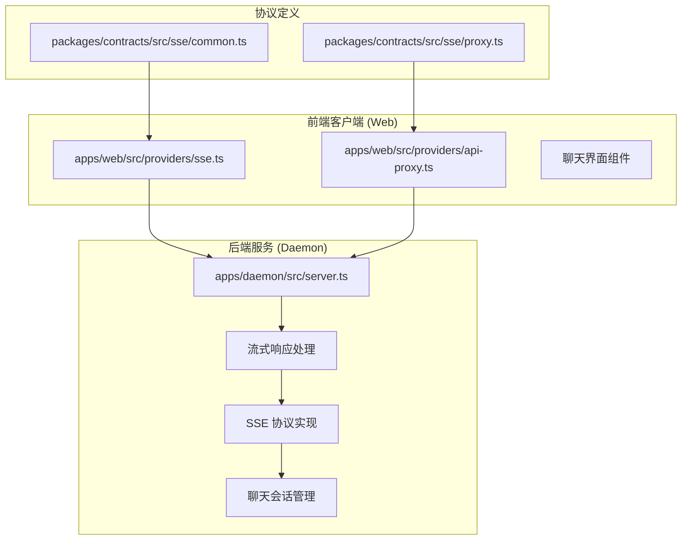
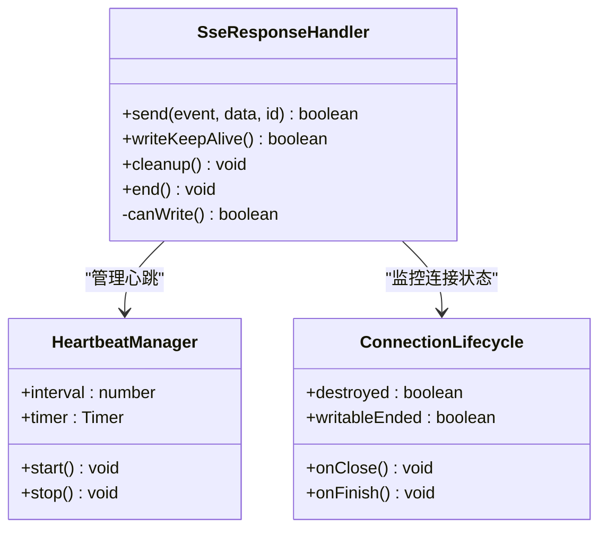
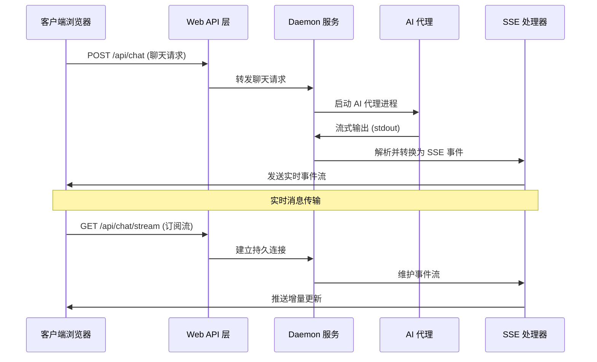
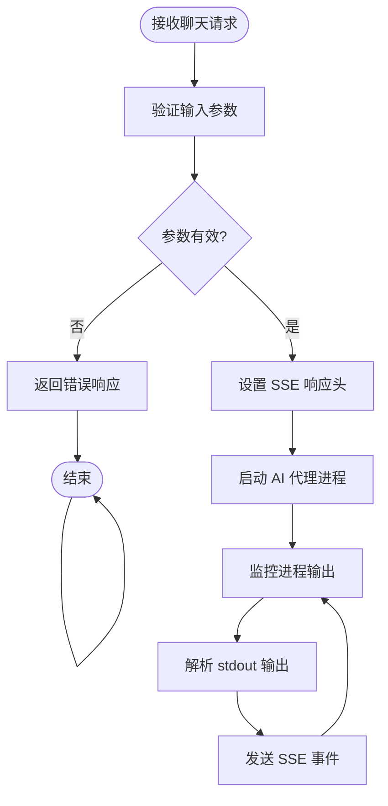
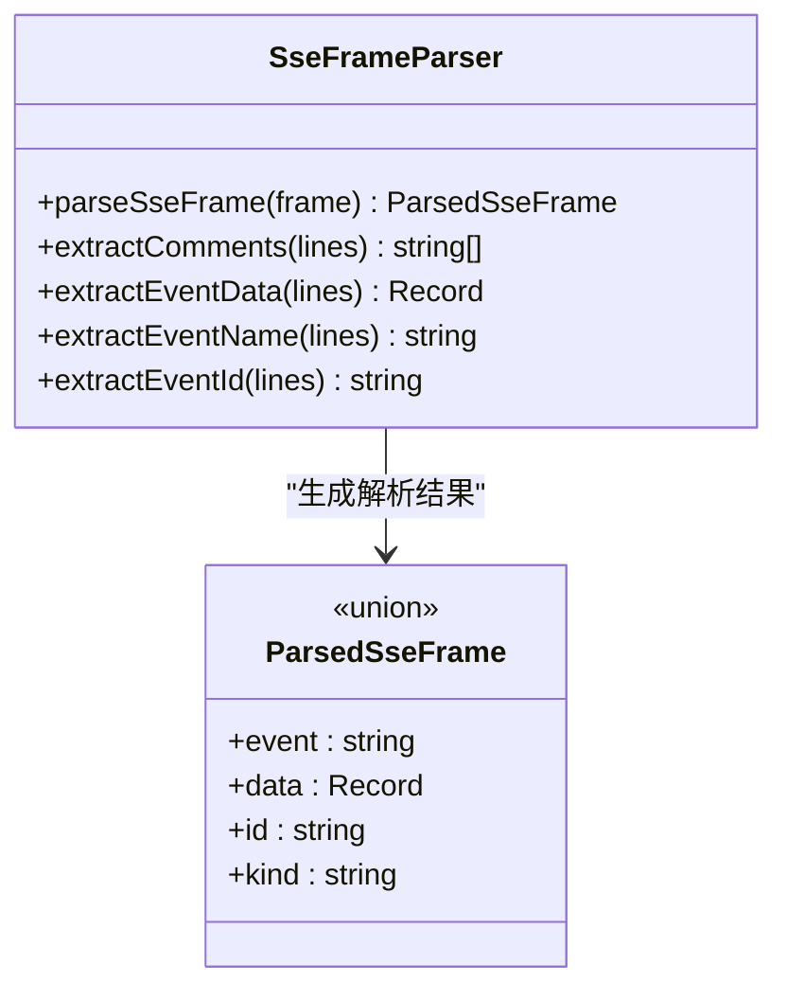
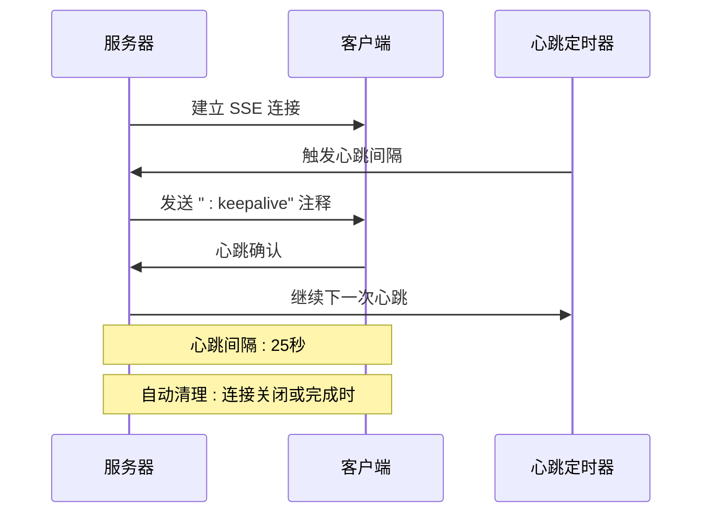
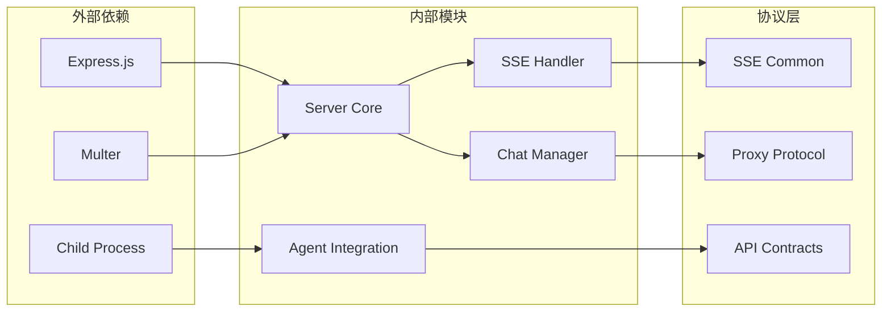

# 聊天流式传输 API

<cite>
**本文档引用的文件**
- [apps/daemon/src/server.ts](file://apps/daemon/src/server.ts)
- [apps/web/src/providers/sse.ts](file://apps/web/src/providers/sse.ts)
- [apps/web/src/providers/api-proxy.ts](file://apps/web/src/providers/api-proxy.ts)
- [packages/contracts/src/sse/common.ts](file://packages/contracts/src/sse/common.ts)
- [packages/contracts/src/sse/proxy.ts](file://packages/contracts/src/sse/proxy.ts)
- [apps/daemon/tests/sse-response.test.ts](file://apps/daemon/tests/sse-response.test.ts)
</cite>

## 目录
1. [简介](#简介)
2. [项目结构](#项目结构)
3. [核心组件](#核心组件)
4. [架构概览](#架构概览)
5. [详细组件分析](#详细组件分析)
6. [依赖关系分析](#依赖关系分析)
7. [性能考虑](#性能考虑)
8. [故障排除指南](#故障排除指南)
9. [结论](#结论)

## 简介

本文档详细说明了聊天流式传输 API 的完整实现，包括三个核心端点：

- **POST /api/chat** - 创建聊天会话并启动流式响应
- **GET /api/chat/stream** - SSE 流式响应端点
- **GET /api/chat/history** - 获取聊天历史记录
- **POST /api/chat/messages** - 发送新消息到现有会话

该系统基于 Server-Sent Events (SSE) 协议，实现了高效的实时消息传输，支持心跳机制、错误处理和连接管理。

## 项目结构

聊天流式传输功能分布在以下模块中：

**图表来源**
- [apps/daemon/src/server.ts:726-779](file://apps/daemon/src/server.ts#L726-L779)
- [apps/web/src/providers/sse.ts:1-39](file://apps/web/src/providers/sse.ts#L1-L39)
- [packages/contracts/src/sse/common.ts:1-12](file://packages/contracts/src/sse/common.ts#L1-L12)

**章节来源**
- [apps/daemon/src/server.ts:1-800](file://apps/daemon/src/server.ts#L1-L800)
- [apps/web/src/providers/sse.ts:1-39](file://apps/web/src/providers/sse.ts#L1-L39)
- [packages/contracts/src/sse/common.ts:1-12](file://packages/contracts/src/sse/common.ts#L1-L12)

## 核心组件

### SSE 响应处理器

系统的核心是 `createSseResponse` 函数，它提供了完整的 SSE 连接管理：

**图表来源**
- [apps/daemon/src/server.ts:726-779](file://apps/daemon/src/server.ts#L726-L779)

### 事件格式定义

系统支持多种事件类型，通过统一的事件结构进行传输：

| 事件类型 | 数据负载 | 用途 | 示例场景 |
|---------|---------|------|----------|
| `start` | `ProxyStreamStartPayload` | 流开始通知 | 代理流启动 |
| `delta` | `ProxyStreamDeltaPayload` | 实时增量数据 | 消息片段传输 |
| `error` | `SseErrorPayload` | 错误状态报告 | API 调用失败 |
| `end` | `ProxyStreamEndPayload` | 流结束信号 | 处理完成 |

**章节来源**
- [packages/contracts/src/sse/proxy.ts:7-11](file://packages/contracts/src/sse/proxy.ts#L7-L11)
- [packages/contracts/src/sse/common.ts:1-12](file://packages/contracts/src/sse/common.ts#L1-L12)

## 架构概览

聊天流式传输系统的整体架构如下：

**图表来源**
- [apps/daemon/src/server.ts:3915-4000](file://apps/daemon/src/server.ts#L3915-L4000)
- [apps/web/src/providers/api-proxy.ts:6-87](file://apps/web/src/providers/api-proxy.ts#L6-L87)

## 详细组件分析

### POST /api/chat - 会话创建

此端点负责创建新的聊天会话并启动流式响应：

**图表来源**
- [apps/daemon/src/server.ts:3915-4000](file://apps/daemon/src/server.ts#L3915-L4000)

### SSE 事件解析器

前端使用 `parseSseFrame` 函数解析传入的 SSE 事件：

**图表来源**
- [apps/web/src/providers/sse.ts:6-38](file://apps/web/src/providers/sse.ts#L6-L38)

### 心跳机制和连接管理

系统实现了智能的心跳机制来维持长连接的活跃状态：

**图表来源**
- [apps/daemon/src/server.ts:726-779](file://apps/daemon/src/server.ts#L726-L779)
- [apps/daemon/tests/sse-response.test.ts:37-57](file://apps/daemon/tests/sse-response.test.ts#L37-L57)

**章节来源**
- [apps/daemon/src/server.ts:726-779](file://apps/daemon/src/server.ts#L726-L779)
- [apps/web/src/providers/sse.ts:6-38](file://apps/web/src/providers/sse.ts#L6-L38)
- [apps/daemon/tests/sse-response.test.ts:11-70](file://apps/daemon/tests/sse-response.test.ts#L11-L70)

### 错误处理和重试机制

系统提供了完善的错误处理和重试策略：

| 错误类型 | 处理方式 | 用户反馈 |
|---------|---------|----------|
| 网络中断 | 自动重连 | 显示重连状态 |
| API 超时 | 重试请求 | 提示超时信息 |
| 代理错误 | 返回标准错误 | 显示错误详情 |
| 连接断开 | 断线重连 | 自动恢复会话 |

**章节来源**
- [apps/web/src/providers/api-proxy.ts:83-87](file://apps/web/src/providers/api-proxy.ts#L83-L87)
- [apps/daemon/src/server.ts:566-568](file://apps/daemon/src/server.ts#L566-L568)

## 依赖关系分析

**图表来源**
- [apps/daemon/src/server.ts:1-50](file://apps/daemon/src/server.ts#L1-L50)
- [packages/contracts/src/sse/common.ts:1-12](file://packages/contracts/src/sse/common.ts#L1-L12)
- [packages/contracts/src/sse/proxy.ts:1-12](file://packages/contracts/src/sse/proxy.ts#L1-L12)

**章节来源**
- [apps/daemon/src/server.ts:1-113](file://apps/daemon/src/server.ts#L1-L113)
- [packages/contracts/src/sse/common.ts:1-12](file://packages/contracts/src/sse/common.ts#L1-L12)
- [packages/contracts/src/sse/proxy.ts:1-12](file://packages/contracts/src/sse/proxy.ts#L1-L12)

## 性能考虑

### 连接优化策略

1. **心跳间隔调优**: 默认 25 秒的心跳间隔平衡了连接保持和资源消耗
2. **缓冲区管理**: 使用流式读取避免大消息内存占用
3. **连接复用**: 支持多个客户端共享同一代理进程
4. **压缩传输**: SSE 事件自动压缩传输内容

### 内存管理

- **流式处理**: 避免将整个消息加载到内存
- **垃圾回收**: 及时清理已完成的连接和任务
- **超时控制**: 防止僵尸连接占用系统资源

### 网络优化

- **HTTP/2 支持**: 利用多路复用减少连接开销
- **缓存策略**: 对静态资源实施适当的缓存
- **CDN 集成**: 支持静态资源 CDN 加速

## 故障排除指南

### 常见问题诊断

| 问题症状 | 可能原因 | 解决方案 |
|---------|---------|----------|
| 无法建立连接 | CORS 配置错误 | 检查跨域设置 |
| 流中断 | 心跳超时 | 调整心跳间隔 |
| 内存泄漏 | 连接未正确清理 | 检查清理逻辑 |
| 性能下降 | 缓冲区过大 | 优化缓冲策略 |

### 调试工具使用

1. **浏览器开发者工具**: 监控 SSE 连接状态
2. **网络面板**: 分析事件传输延迟
3. **控制台日志**: 查看错误堆栈信息
4. **服务器日志**: 追踪连接生命周期

### 日志分析要点

- **连接建立时间**: 从请求到响应的时间
- **事件传输延迟**: 从产生到接收的延迟
- **错误发生频率**: 统计错误类型和频率
- **资源使用情况**: 监控内存和 CPU 使用

**章节来源**
- [apps/daemon/tests/sse-response.test.ts:72-80](file://apps/daemon/tests/sse-response.test.ts#L72-L80)
- [apps/web/src/providers/api-proxy.ts:83-87](file://apps/web/src/providers/api-proxy.ts#L83-L87)

## 结论

聊天流式传输 API 提供了一个高效、可靠的实时通信解决方案。通过合理的架构设计和完善的错误处理机制，系统能够支持大规模并发连接和高吞吐量的数据传输。

关键优势包括：
- **低延迟**: 基于 SSE 的实时推送
- **可靠性**: 完善的心跳和重连机制
- **可扩展性**: 支持水平扩展和负载均衡
- **易用性**: 简洁的 API 设计和丰富的客户端支持

该系统为构建现代聊天应用提供了坚实的技术基础，支持从简单对话到复杂协作场景的各种需求。