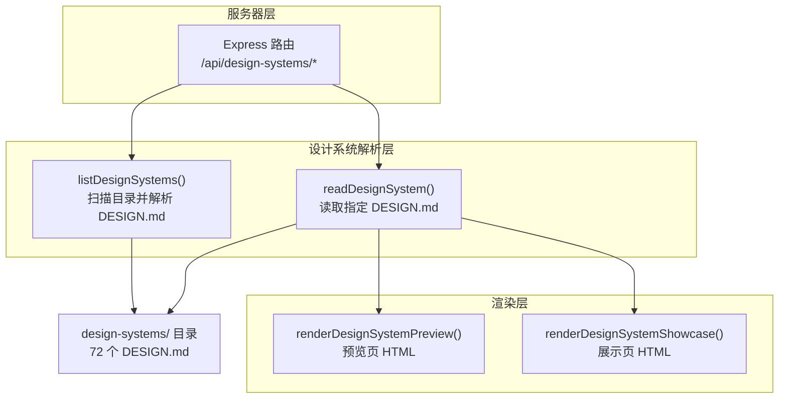
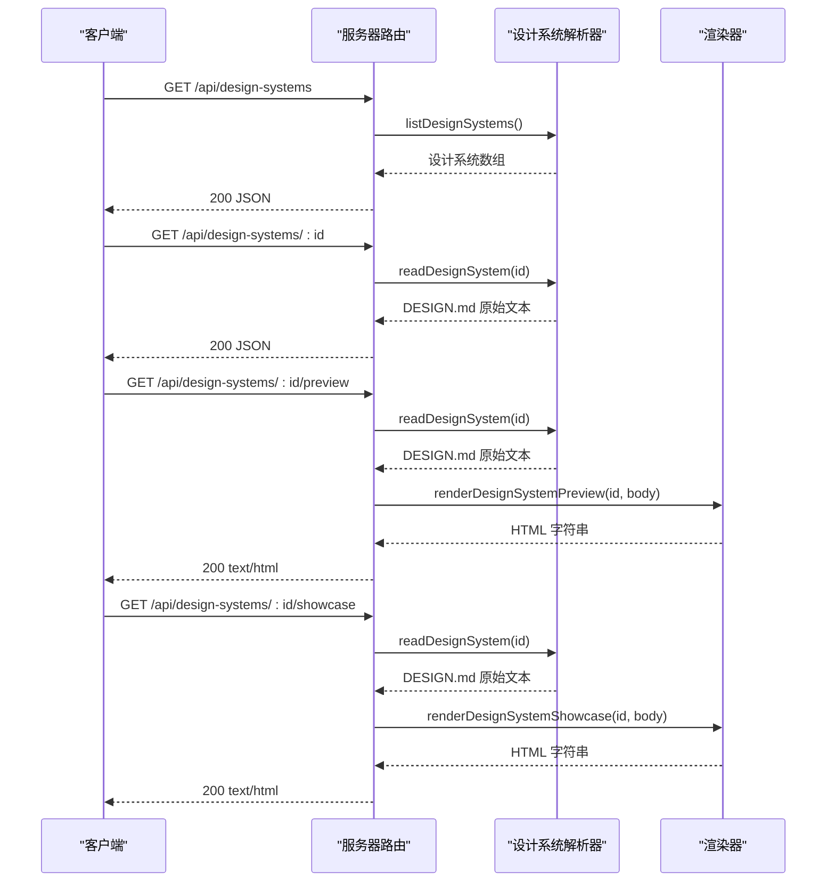
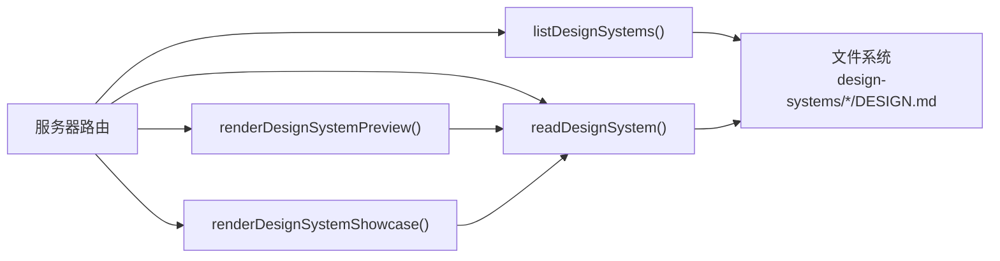

# 设计系统 API

<cite>
**本文档引用的文件**
- [apps/daemon/src/design-systems.ts](file://apps/daemon/src/design-systems.ts)
- [apps/daemon/src/design-system-preview.ts](file://apps/daemon/src/design-system-preview.ts)
- [apps/daemon/src/design-system-showcase.ts](file://apps/daemon/src/design-system-showcase.ts)
- [apps/daemon/src/server.ts](file://apps/daemon/src/server.ts)
- [design-systems/README.md](file://design-systems/README.md)
- [design-systems/default/DESIGN.md](file://design-systems/default/DESIGN.md)
- [design-systems/claude/DESIGN.md](file://design-systems/claude/DESIGN.md)
- [docs/spec.md](file://docs/spec.md)
- [docs/examples/DESIGN.sample.md](file://docs/examples/DESIGN.sample.md)
</cite>

## 目录
1. [简介](#简介)
2. [项目结构](#项目结构)
3. [核心组件](#核心组件)
4. [架构总览](#架构总览)
5. [详细组件分析](#详细组件分析)
6. [依赖关系分析](#依赖关系分析)
7. [性能考虑](#性能考虑)
8. [故障排除指南](#故障排除指南)
9. [结论](#结论)
10. [附录](#附录)

## 简介
本文件面向设计系统 API 的使用者与维护者，系统化说明 /api/design-systems 端点的功能与规范，包括：
- 设计系统列表（GET /api/design-systems）
- 设计系统详情（GET /api/design-systems/{id}）
- 设计系统预览（GET /api/design-systems/{id}/preview）
- 设计系统展示（GET /api/design-systems/{id}/showcase）

同时提供完整请求/响应示例、参数说明、数据格式规范；覆盖 72 个品牌级设计系统的组织方式与 DESIGN.md 标准；给出扩展与定制最佳实践。

## 项目结构
设计系统 API 的实现由三部分组成：
- 服务器路由层：在 daemon 服务中注册 /api/design-systems 相关路由，负责鉴权、参数校验与错误处理。
- 设计系统解析器：从磁盘扫描 DESIGN.md 文件，提取标题、分类、摘要、配色与字体等元数据。
- 预览/展示渲染器：基于 DESIGN.md 内容动态生成预览页与展示页 HTML。



图表来源
- [apps/daemon/src/server.ts:2338-2400](file://apps/daemon/src/server.ts#L2338-L2400)
- [apps/daemon/src/design-systems.ts:10-50](file://apps/daemon/src/design-systems.ts#L10-L50)
- [apps/daemon/src/design-system-preview.ts:14-298](file://apps/daemon/src/design-system-preview.ts#L14-L298)
- [apps/daemon/src/design-system-showcase.ts:13-547](file://apps/daemon/src/design-system-showcase.ts#L13-L547)

章节来源
- [apps/daemon/src/server.ts:2338-2400](file://apps/daemon/src/server.ts#L2338-L2400)
- [apps/daemon/src/design-systems.ts:10-50](file://apps/daemon/src/design-systems.ts#L10-L50)
- [design-systems/README.md:1-98](file://design-systems/README.md#L1-L98)

## 核心组件
- 设计系统解析器（listDesignSystems/readDesignSystem）
  - 扫描 design-systems/ 目录，读取每个子目录下的 DESIGN.md
  - 提取标题、分类、摘要、配色样本、表面类型等字段
  - 输出结构化列表与原始 Markdown 文本
- 预览渲染器（renderDesignSystemPreview）
  - 将 DESIGN.md 渲染为可浏览的预览页，包含配色板、字体示例、组件示意与完整正文
- 展示渲染器（renderDesignSystemShowcase）
  - 生成完整的落地页 HTML，体现系统在产品中的实际应用

章节来源
- [apps/daemon/src/design-systems.ts:10-168](file://apps/daemon/src/design-systems.ts#L10-L168)
- [apps/daemon/src/design-system-preview.ts:14-298](file://apps/daemon/src/design-system-preview.ts#L14-L298)
- [apps/daemon/src/design-system-showcase.ts:13-547](file://apps/daemon/src/design-system-showcase.ts#L13-L547)

## 架构总览
设计系统 API 的调用链路如下：



图表来源
- [apps/daemon/src/server.ts:2338-2400](file://apps/daemon/src/server.ts#L2338-L2400)
- [apps/daemon/src/design-systems.ts:10-50](file://apps/daemon/src/design-systems.ts#L10-L50)
- [apps/daemon/src/design-system-preview.ts:14-298](file://apps/daemon/src/design-system-preview.ts#L14-L298)
- [apps/daemon/src/design-system-showcase.ts:13-547](file://apps/daemon/src/design-system-showcase.ts#L13-L547)

## 详细组件分析

### 设计系统列表（GET /api/design-systems）
- 功能描述
  - 返回所有可用设计系统的基本信息列表，不包含 DESIGN.md 原文内容
- 请求
  - 方法：GET
  - 路径：/api/design-systems
  - 查询参数：无
- 响应
  - 成功：200 OK，JSON 对象包含 designSystems 数组
  - 失败：500 Internal Server Error，JSON 错误对象
- 数据模型
  - designSystems[].id: 字符串，设计系统目录名（ASCII slug）
  - designSystems[].title: 字符串，设计系统标题（去除前缀“Design System Inspired by/for”后的人类可读名称）
  - designSystems[].category: 字符串，分类（默认“Uncategorized”）
  - designSystems[].summary: 字符串，首段摘要（最多 240 字）
  - designSystems[].swatches: 字符串数组，最多 4 个代表色（十六进制），顺序为背景/支持/前景/强调
  - designSystems[].surface: 字符串，适用表面类型（web/image/video/audio，默认 web）
  - designSystems[].body: 字符串，保留字段（用于 /api/design-systems/:id 返回原文）
- 示例
  - 请求：GET /api/design-systems
  - 响应体：
    ```json
    {
      "designSystems": [
        {
          "id": "default",
          "title": "Neutral Modern",
          "category": "Starter",
          "summary": "Calm, functional, quietly confident...",
          "swatches": ["#FAFAFA", "#6B6B6B", "#111111", "#2F6FEB"],
          "surface": "web"
        }
      ]
    }
    ```

章节来源
- [apps/daemon/src/server.ts:2338-2347](file://apps/daemon/src/server.ts#L2338-L2347)
- [apps/daemon/src/design-systems.ts:10-50](file://apps/daemon/src/design-systems.ts#L10-L50)
- [design-systems/README.md:1-98](file://design-systems/README.md#L1-L98)

### 设计系统详情（GET /api/design-systems/{id}）
- 功能描述
  - 返回指定设计系统的原始 DESIGN.md 文本
- 请求
  - 方法：GET
  - 路径：/api/design-systems/{id}
  - 路径参数：id（字符串，设计系统目录名）
- 响应
  - 成功：200 OK，JSON 对象包含 id 与 body
  - 未找到：404 Not Found，JSON 错误对象
  - 其他错误：500 Internal Server Error，JSON 错误对象
- 数据模型
  - id: 字符串，与路径参数一致
  - body: 字符串，完整 DESIGN.md 原始文本
- 示例
  - 请求：GET /api/design-systems/default
  - 响应体：
    ```json
    {
      "id": "default",
      "body": "# Neutral Modern\n\n> Category: Starter\n> A clean, product-oriented default..."
    }
    ```

章节来源
- [apps/daemon/src/server.ts:2349-2358](file://apps/daemon/src/server.ts#L2349-L2358)
- [apps/daemon/src/design-systems.ts:43-50](file://apps/daemon/src/design-systems.ts#L43-L50)

### 设计系统预览（GET /api/design-systems/{id}/preview）
- 功能描述
  - 返回针对指定设计系统的预览页面 HTML，包含配色、字体与组件示意
- 请求
  - 方法：GET
  - 路径：/api/design-systems/{id}/preview
  - 路径参数：id（字符串）
- 响应
  - 成功：200 OK，text/html
  - 未找到：404 Not Found，text/plain
  - 其他错误：500 Internal Server Error，text/plain
- 渲染逻辑
  - 从磁盘读取 DESIGN.md
  - 解析颜色、字体、副标题等元数据
  - 生成内联样式与组件示意（卡片、按钮等）
  - 渲染完整 DESIGN.md 正文为 HTML
- 示例
  - 请求：GET /api/design-systems/default/preview
  - 响应：text/html（包含预览页面）

章节来源
- [apps/daemon/src/server.ts:2390-2400](file://apps/daemon/src/server.ts#L2390-L2400)
- [apps/daemon/src/design-system-preview.ts:14-298](file://apps/daemon/src/design-system-preview.ts#L14-L298)

### 设计系统展示（GET /api/design-systems/{id}/showcase）
- 功能描述
  - 返回针对指定设计系统的完整产品页 HTML，展示系统在真实产品中的应用
- 请求
  - 方法：GET
  - 路径：/api/design-systems/{id}/showcase
  - 路径参数：id（字符串）
- 响应
  - 成功：200 OK，text/html
  - 未找到：404 Not Found，text/plain
  - 其他错误：500 Internal Server Error，text/plain
- 渲染逻辑
  - 从磁盘读取 DESIGN.md
  - 解析颜色、字体、副标题等元数据
  - 生成完整产品页（导航、英雄区、特性网格、工作区预览、定价、客户评价、FAQ、CTA、页脚）
  - 使用系统令牌驱动样式与布局
- 示例
  - 请求：GET /api/design-systems/claude/showcase
  - 响应：text/html（包含展示页面）

章节来源
- [apps/daemon/src/server.ts:2390-2400](file://apps/daemon/src/server.ts#L2390-L2400)
- [apps/daemon/src/design-system-showcase.ts:13-547](file://apps/daemon/src/design-system-showcase.ts#L13-L547)

### 设计令牌与 DESIGN.md 组织结构
- DESIGN.md 结构
  - 第一 H1 作为标题
  - 分类元数据：> Category: <name>
  - 摘要：H1 下的第一个段落（去除分类元数据行）
  - 配色：通过多种标记形式抽取颜色，形成配色板
  - 字体：显示/标题、正文字体、等宽字体
  - 组件样式：按钮、卡片、输入框等约定
  - 布局原则：网格、间距、断点
  - 深度与层级：平面、容器、环形阴影、轻量阴影等
  - 响应式行为：断点与交互策略
  - 代理提示：如何在生成中遵循该系统
- 示例参考
  - 默认系统：[design-systems/default/DESIGN.md:1-63](file://design-systems/default/DESIGN.md#L1-L63)
  - Claude 系统：[design-systems/claude/DESIGN.md:1-316](file://design-systems/claude/DESIGN.md#L1-L316)
  - 示例模板：[docs/examples/DESIGN.sample.md:1-65](file://docs/examples/DESIGN.sample.md#L1-L65)
- 设计系统目录
  - 72 个品牌级系统来自上游包，按类别分组，目录名为 ASCII slug
  - 支持通过添加新的 DESIGN.md 快速扩展

章节来源
- [design-systems/README.md:1-98](file://design-systems/README.md#L1-L98)
- [docs/spec.md:1-143](file://docs/spec.md#L1-L143)
- [docs/examples/DESIGN.sample.md:1-65](file://docs/examples/DESIGN.sample.md#L1-L65)
- [design-systems/default/DESIGN.md:1-63](file://design-systems/default/DESIGN.md#L1-L63)
- [design-systems/claude/DESIGN.md:1-316](file://design-systems/claude/DESIGN.md#L1-L316)

### 设计系统扩展方法与最佳实践
- 新增设计系统
  - 在 design-systems/ 下新增目录，包含 DESIGN.md
  - 使用 > Category: <group> 将其归类到现有分组或自定义分组
  - 刷新后即可在列表中看到新系统
- 设计令牌组织建议
  - 明确主色、强调色、中性色与语义色的职责
  - 为深浅模式分别提供配色与对比度
  - 保持字体栈简洁，避免过多字重与字族
  - 为组件约定统一的半径、间距与阴影
- 最佳实践
  - 以 DESIGN.md 作为唯一真源，避免将令牌散落在提示词中
  - 为每个系统提供清晰的摘要与配色样本，便于选择
  - 在展示页中模拟真实产品场景，帮助决策与评审
  - 保持 DESIGN.md 的版本化与可审查性

章节来源
- [design-systems/README.md:65-98](file://design-systems/README.md#L65-L98)
- [docs/spec.md:1-143](file://docs/spec.md#L1-L143)

## 依赖关系分析
- 服务器路由依赖设计系统解析器与渲染器
- 解析器依赖文件系统读取 DESIGN.md
- 渲染器依赖解析器产出的颜色、字体与元数据
- 设计系统目录结构影响解析结果与前端选择体验



图表来源
- [apps/daemon/src/server.ts:2338-2400](file://apps/daemon/src/server.ts#L2338-L2400)
- [apps/daemon/src/design-systems.ts:10-50](file://apps/daemon/src/design-systems.ts#L10-L50)
- [apps/daemon/src/design-system-preview.ts:14-298](file://apps/daemon/src/design-system-preview.ts#L14-L298)
- [apps/daemon/src/design-system-showcase.ts:13-547](file://apps/daemon/src/design-system-showcase.ts#L13-L547)

章节来源
- [apps/daemon/src/server.ts:2338-2400](file://apps/daemon/src/server.ts#L2338-L2400)
- [apps/daemon/src/design-systems.ts:10-50](file://apps/daemon/src/design-systems.ts#L10-L50)

## 性能考虑
- 列表接口仅解析必要元数据，避免加载全文，适合高频调用
- 预览与展示接口按需渲染，适合低频访问
- DESIGN.md 文件体积较大时，建议缓存渲染结果或延迟加载
- 目录扫描在启动或刷新时进行，避免在热路径上重复扫描

## 故障排除指南
- 404 设计系统不存在
  - 检查 id 是否正确，确认 design-systems/ 下存在对应目录
- 500 服务器内部错误
  - 查看服务器日志，确认文件读取与渲染过程是否抛出异常
- 预览/展示空白或样式缺失
  - 确认 DESIGN.md 中颜色、字体等令牌是否符合预期格式
  - 检查渲染器对令牌的解析与回退逻辑

章节来源
- [apps/daemon/src/server.ts:2338-2400](file://apps/daemon/src/server.ts#L2338-L2400)
- [apps/daemon/src/design-systems.ts:10-50](file://apps/daemon/src/design-systems.ts#L10-L50)

## 结论
设计系统 API 通过简洁的四个端点，实现了从系统发现、详情查看到预览与展示的完整闭环。结合 DESIGN.md 的标准化组织，开发者可以快速扩展与定制设计系统，并将其无缝集成到各类生成流程中。

## 附录

### API 定义与示例

- 设计系统列表（GET /api/design-systems）
  - 请求：GET /api/design-systems
  - 响应：200 OK，JSON 包含 designSystems 数组
  - 示例响应：
    ```json
    {
      "designSystems": [
        {
          "id": "default",
          "title": "Neutral Modern",
          "category": "Starter",
          "summary": "Calm, functional, quietly confident...",
          "swatches": ["#FAFAFA", "#6B6B6B", "#111111", "#2F6FEB"],
          "surface": "web"
        }
      ]
    }
    ```

- 设计系统详情（GET /api/design-systems/{id}）
  - 请求：GET /api/design-systems/default
  - 响应：200 OK，JSON 包含 id 与 body
  - 示例响应：
    ```json
    {
      "id": "default",
      "body": "# Neutral Modern\n\n> Category: Starter\n> A clean, product-oriented default..."
    }
    ```

- 设计系统预览（GET /api/design-systems/{id}/preview）
  - 请求：GET /api/design-systems/default/preview
  - 响应：200 OK，text/html

- 设计系统展示（GET /api/design-systems/{id}/showcase）
  - 请求：GET /api/design-systems/claude/showcase
  - 响应：200 OK，text/html

章节来源
- [apps/daemon/src/server.ts:2338-2400](file://apps/daemon/src/server.ts#L2338-L2400)
- [apps/daemon/src/design-systems.ts:10-50](file://apps/daemon/src/design-systems.ts#L10-L50)
- [apps/daemon/src/design-system-preview.ts:14-298](file://apps/daemon/src/design-system-preview.ts#L14-L298)
- [apps/daemon/src/design-system-showcase.ts:13-547](file://apps/daemon/src/design-system-showcase.ts#L13-L547)