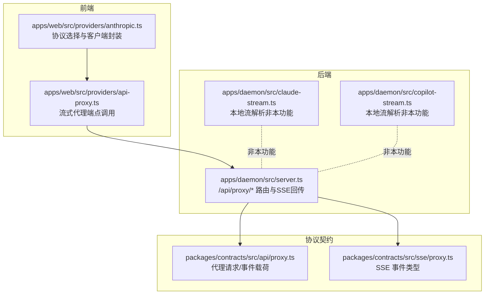
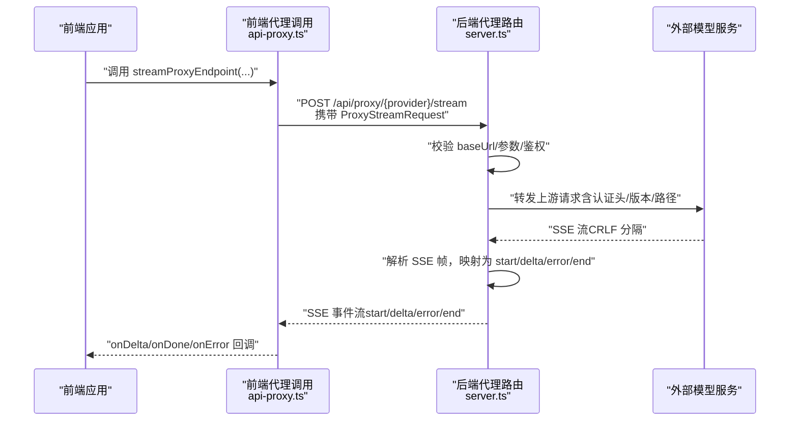
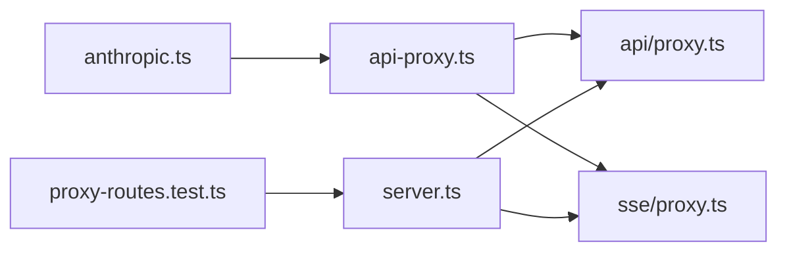

# BYOK 代理代理

<cite>
**本文引用的文件**
- [apps/web/src/providers/api-proxy.ts](file://apps/web/src/providers/api-proxy.ts)
- [packages/contracts/src/api/proxy.ts](file://packages/contracts/src/api/proxy.ts)
- [packages/contracts/src/sse/proxy.ts](file://packages/contracts/src/sse/proxy.ts)
- [apps/daemon/src/server.ts](file://apps/daemon/src/server.ts)
- [apps/daemon/tests/proxy-routes.test.ts](file://apps/daemon/tests/proxy-routes.test.ts)
- [apps/web/src/providers/anthropic.ts](file://apps/web/src/providers/anthropic.ts)
- [apps/daemon/src/claude-stream.ts](file://apps/daemon/src/claude-stream.ts)
- [apps/daemon/src/copilot-stream.ts](file://apps/daemon/src/copilot-stream.ts)
</cite>

## 目录
1. [简介](#简介)
2. [项目结构](#项目结构)
3. [核心组件](#核心组件)
4. [架构总览](#架构总览)
5. [详细组件分析](#详细组件分析)
6. [依赖关系分析](#依赖关系分析)
7. [性能考量](#性能考量)
8. [故障排查指南](#故障排查指南)
9. [结论](#结论)
10. [附录：新代理提供商集成指南](#附录新代理提供商集成指南)

## 简介
本文件面向 Open Design 的 BYOK（Bring Your Own Keys）代理代理系统，聚焦于通过统一的 /api/proxy/{provider}/stream 接口对接外部代理提供商，覆盖 Anthropic、OpenAI、Google、Azure 等云服务。文档从架构、数据流、处理逻辑、错误处理、流式传输与 SSE 管理、到新提供商接入与兼容性要求进行系统化说明，并给出性能优化建议与故障排查要点。

## 项目结构
- 前端侧负责将用户配置与消息体封装后调用代理接口，并以 SSE 方式接收增量文本与结束事件。
- 后端守护进程提供多供应商代理路由，校验上游地址、转发请求并回传标准化的 SSE 事件。
- 协议契约定义了代理请求体、SSE 事件类型与负载结构，确保前后端一致。

图表来源
- [apps/web/src/providers/api-proxy.ts:1-97](file://apps/web/src/providers/api-proxy.ts#L1-L97)
- [apps/web/src/providers/anthropic.ts:1-89](file://apps/web/src/providers/anthropic.ts#L1-L89)
- [apps/daemon/src/server.ts:4082-4465](file://apps/daemon/src/server.ts#L4082-L4465)
- [packages/contracts/src/api/proxy.ts:1-32](file://packages/contracts/src/api/proxy.ts#L1-L32)
- [packages/contracts/src/sse/proxy.ts:1-12](file://packages/contracts/src/sse/proxy.ts#L1-L12)

章节来源
- [apps/web/src/providers/api-proxy.ts:1-97](file://apps/web/src/providers/api-proxy.ts#L1-L97)
- [apps/daemon/src/server.ts:4082-4465](file://apps/daemon/src/server.ts#L4082-L4465)
- [packages/contracts/src/api/proxy.ts:1-32](file://packages/contracts/src/api/proxy.ts#L1-L32)
- [packages/contracts/src/sse/proxy.ts:1-12](file://packages/contracts/src/sse/proxy.ts#L1-L12)

## 核心组件
- 代理请求契约
  - 请求体包含 baseUrl、apiKey、model、可选 systemPrompt、messages、maxTokens、Azure 专用 apiVersion。
  - 定义 start/delta/error/end 四类 SSE 事件及对应载荷。
- 前端代理调用
  - 统一的 streamProxyEndpoint 封装 fetch，读取响应体的二进制流，按 CRLF 分隔切片，解析为 SSE 事件帧，分发 delta/end/error。
- 后端代理路由
  - 按 provider 提供独立路由：/api/proxy/anthropic/stream、/api/proxy/openai/stream、/api/proxy/azure/stream、/api/proxy/google/stream。
  - 对上游 baseUrl 进行白名单/私网限制校验；构造上游请求头与路径；转发并回传标准化 SSE。
- SSE 工具
  - createSseResponse 实现标准 SSE 头、心跳与关闭清理；sendProxyError 输出统一错误格式。

章节来源
- [packages/contracts/src/api/proxy.ts:1-32](file://packages/contracts/src/api/proxy.ts#L1-L32)
- [packages/contracts/src/sse/proxy.ts:1-12](file://packages/contracts/src/sse/proxy.ts#L1-L12)
- [apps/web/src/providers/api-proxy.ts:6-97](file://apps/web/src/providers/api-proxy.ts#L6-L97)
- [apps/daemon/src/server.ts:4082-4465](file://apps/daemon/src/server.ts#L4082-L4465)

## 架构总览
下图展示从前端发起代理请求到后端转发上游并回传 SSE 的整体流程。

图表来源
- [apps/web/src/providers/api-proxy.ts:6-97](file://apps/web/src/providers/api-proxy.ts#L6-L97)
- [apps/daemon/src/server.ts:4082-4465](file://apps/daemon/src/server.ts#L4082-L4465)
- [packages/contracts/src/sse/proxy.ts:1-12](file://packages/contracts/src/sse/proxy.ts#L1-L12)

## 详细组件分析

### 前端代理调用与流式解析
- 关键职责
  - 参数校验：若缺少 apiKey，直接触发 onError。
  - 发起 POST 请求，将 ProxyStreamRequest 序列化为请求体。
  - 读取响应体二进制流，按 CRLF 分隔切片，解析为 SSE 事件帧。
  - 分发 delta（增量文本）、end（完成）、error（上游错误）至上层处理器。
- 错误处理
  - 非 2xx 或无响应体时，读取文本并触发 onError。
  - 读取异常（如 AbortError）不视为错误，直接返回。
- 可靠性
  - 使用 AbortSignal 支持取消。
  - 文本累积用于 onDone 回调，保证最终结果完整。

章节来源
- [apps/web/src/providers/api-proxy.ts:6-97](file://apps/web/src/providers/api-proxy.ts#L6-L97)

### 后端代理路由与上游转发
- 通用校验
  - 必填字段：baseUrl、apiKey、model（部分提供方有额外要求）。
  - 上游地址校验：禁止内部网络地址（环回/私网），防止内网探测与 SSRF。
- 路由与适配
  - Anthropic：使用 /messages，头部带 x-api-key 与版本头，映射 content_block_delta/message_stop 为 delta/end。
  - OpenAI：使用 /chat/completions，Authorization: Bearer，映射 choices[].delta.content 为 delta，[DONE] 为 end。
  - Azure：使用部署路径与 api-version 查询参数，头部 api-key，其余与 OpenAI 兼容。
  - Google：使用 /v1beta/models/{model}:streamGenerateContent?alt=sse，头部 x-goog-api-key，映射候选文本为 delta，安全拦截映射为 error。
- 错误映射
  - 上游非 2xx：构造可重试标记与详情，发送 error 事件。
  - 上游流内错误：提取 provider-specific 错误信息，发送 error 事件。
  - 未显式结束：在结束前发送 end 事件，保证客户端状态机收敛。

章节来源
- [apps/daemon/src/server.ts:4082-4465](file://apps/daemon/src/server.ts#L4082-L4465)
- [apps/daemon/tests/proxy-routes.test.ts:1-222](file://apps/daemon/tests/proxy-routes.test.ts#L1-L222)

### SSE 协议与事件映射
- 协议版本
  - PROXY_SSE_PROTOCOL_VERSION = 1，事件类型：start/delta/error/end。
- 事件载荷
  - start：可选 model。
  - delta：包含增量文本。
  - error：包含 message 与可选错误详情。
  - end：可选 code。
- 前端解析
  - 以 CRLF 分隔的 SSE 帧为单位，识别 event/data，过滤非事件帧，仅对 delta/end/error 分发。

章节来源
- [packages/contracts/src/sse/proxy.ts:1-12](file://packages/contracts/src/sse/proxy.ts#L1-L12)
- [packages/contracts/src/api/proxy.ts:21-32](file://packages/contracts/src/api/proxy.ts#L21-L32)
- [apps/web/src/providers/api-proxy.ts:58-79](file://apps/web/src/providers/api-proxy.ts#L58-L79)

### 协议选择与浏览器直连
- 协议选择
  - 若设置为 azure/google/openai 或基于模型/基础地址判断为 OpenAI 兼容，则走对应兼容路径。
  - 否则默认走 Anthropic 本地直连（浏览器允许危险模式）。
- 兼容性
  - 通过 apiProtocol 与模型/基础地址启发式共同决定。
- BYOK 场景
  - 当 baseUrl 非官方域时，自动降级为通过本地代理路由转发，避免浏览器直连密钥外泄。

章节来源
- [apps/web/src/providers/anthropic.ts:35-89](file://apps/web/src/providers/anthropic.ts#L35-L89)

### 本地流解析（非本功能）
- Claude 与 Copilot 的本地流解析器用于内部工具链，与代理功能解耦，不参与上游转发与 SSE 映射。

章节来源
- [apps/daemon/src/claude-stream.ts:1-219](file://apps/daemon/src/claude-stream.ts#L1-L219)
- [apps/daemon/src/copilot-stream.ts:1-131](file://apps/daemon/src/copilot-stream.ts#L1-L131)

## 依赖关系分析
- 前端依赖
  - api-proxy.ts 依赖 SSE 解析工具与代理契约。
  - anthropic.ts 作为协议选择入口，根据配置选择直连或代理。
- 后端依赖
  - server.ts 依赖协议契约定义的事件类型与请求体结构，依赖通用 SSE 工具与错误构造函数。
- 测试验证
  - proxy-routes.test.ts 对各 provider 的行为进行端到端验证，包括 CRLF SSE 转换、私网地址拦截、Azure 部署路径与 api-version、Gemini 安全拦截等。

图表来源
- [apps/web/src/providers/api-proxy.ts:1-97](file://apps/web/src/providers/api-proxy.ts#L1-L97)
- [apps/web/src/providers/anthropic.ts:1-89](file://apps/web/src/providers/anthropic.ts#L1-L89)
- [apps/daemon/src/server.ts:4082-4465](file://apps/daemon/src/server.ts#L4082-L4465)
- [packages/contracts/src/api/proxy.ts:1-32](file://packages/contracts/src/api/proxy.ts#L1-L32)
- [packages/contracts/src/sse/proxy.ts:1-12](file://packages/contracts/src/sse/proxy.ts#L1-L12)
- [apps/daemon/tests/proxy-routes.test.ts:1-222](file://apps/daemon/tests/proxy-routes.test.ts#L1-L222)

章节来源
- [apps/web/src/providers/api-proxy.ts:1-97](file://apps/web/src/providers/api-proxy.ts#L1-L97)
- [apps/web/src/providers/anthropic.ts:1-89](file://apps/web/src/providers/anthropic.ts#L1-L89)
- [apps/daemon/src/server.ts:4082-4465](file://apps/daemon/src/server.ts#L4082-L4465)
- [packages/contracts/src/api/proxy.ts:1-32](file://packages/contracts/src/api/proxy.ts#L1-L32)
- [packages/contracts/src/sse/proxy.ts:1-12](file://packages/contracts/src/sse/proxy.ts#L1-L12)
- [apps/daemon/tests/proxy-routes.test.ts:1-222](file://apps/daemon/tests/proxy-routes.test.ts#L1-L222)

## 性能考量
- 流式读取与解码
  - 使用 ReadableStream reader 与 TextDecoder 流式解码，避免一次性缓冲大块数据。
- SSE 心跳
  - 后端启用定期心跳，降低代理超时与中间设备断开风险。
- 最大输出长度
  - maxTokens 默认值与按需传入，控制上游生成上限，平衡延迟与吞吐。
- 并发与连接复用
  - 建议上游服务端支持长连接与并发复用，减少握手开销。
- 网络与鉴权
  - 优先使用就近地域与稳定网络；鉴权头最小暴露面，避免在日志中记录敏感信息。

## 故障排查指南
- 常见错误与定位
  - 缺少必填参数：检查 baseUrl/apiKey/model 是否正确传入。
  - 私网地址被拦截：确认 baseUrl 非 127.0.0.1/192.168.x.x/::1 等私网地址。
  - 上游非 2xx：查看 error 事件中的 details 与可重试标记。
  - SSE 解析失败：确认上游是否使用 CRLF 分隔的 SSE，前端按帧解析 delta/end/error。
- 调试建议
  - 打开后端日志，观察 [proxy:*] 记录的主机名与模型信息。
  - 在测试用例中参考 proxy-routes.test.ts 的断言，快速复现问题场景。
- 客户端处理
  - 对 AbortError 不做错误上报；对 error 事件统一提示并允许重试；对 end 事件完成收尾。

章节来源
- [apps/daemon/src/server.ts:4082-4465](file://apps/daemon/src/server.ts#L4082-L4465)
- [apps/web/src/providers/api-proxy.ts:37-86](file://apps/web/src/providers/api-proxy.ts#L37-L86)
- [apps/daemon/tests/proxy-routes.test.ts:91-130](file://apps/daemon/tests/proxy-routes.test.ts#L91-L130)

## 结论
BYOK 代理代理系统通过统一的代理路由与标准化的 SSE 事件，实现了对多家外部模型服务的一致接入。前端负责参数封装与流式解析，后端负责上游校验、转发与事件映射。该设计在保障密钥安全（BYOK）的同时，提供了良好的兼容性与可观测性。后续扩展新提供商只需遵循契约与现有路由模式，即可快速集成。

## 附录：新代理提供商集成指南
- 契约与协议
  - 请求体：遵循 ProxyStreamRequest，确保包含 baseUrl、apiKey、model、messages、maxTokens 等。
  - SSE 事件：至少支持 start/delta/error/end，必要时扩展自定义事件并保持向后兼容。
- 路由与适配
  - 新增路由：/api/proxy/{your-provider}/stream
  - 参数校验：必填项与私网地址校验同现有 provider。
  - 上游适配：构造正确的上游 URL、认证头与消息体；将上游 SSE 映射为 delta/end/error。
- 兼容性要求
  - SSE 分隔：确保上游返回 CRLF 分隔的 SSE 帧，便于前端按帧解析。
  - 错误语义：将上游错误映射为 error 事件，包含可读 message 与可选 details。
  - Azure 风格：若为部署型服务，遵循部署路径与 api-version 规范。
- 测试与验证
  - 参考 proxy-routes.test.ts 的断言风格，覆盖 CRLF 转换、私网拦截、错误映射、特殊行为（如 Gemini 安全拦截）等。
  - 提供最小可运行示例，验证 end 事件与增量文本顺序一致性。

章节来源
- [packages/contracts/src/api/proxy.ts:1-32](file://packages/contracts/src/api/proxy.ts#L1-L32)
- [packages/contracts/src/sse/proxy.ts:1-12](file://packages/contracts/src/sse/proxy.ts#L1-L12)
- [apps/daemon/src/server.ts:4082-4465](file://apps/daemon/src/server.ts#L4082-L4465)
- [apps/daemon/tests/proxy-routes.test.ts:1-222](file://apps/daemon/tests/proxy-routes.test.ts#L1-L222)