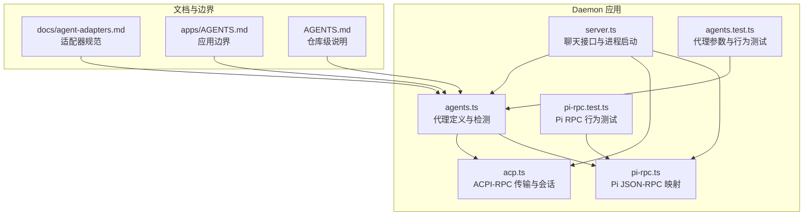
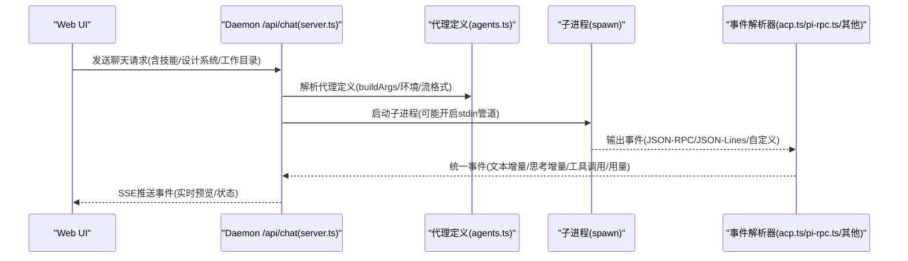
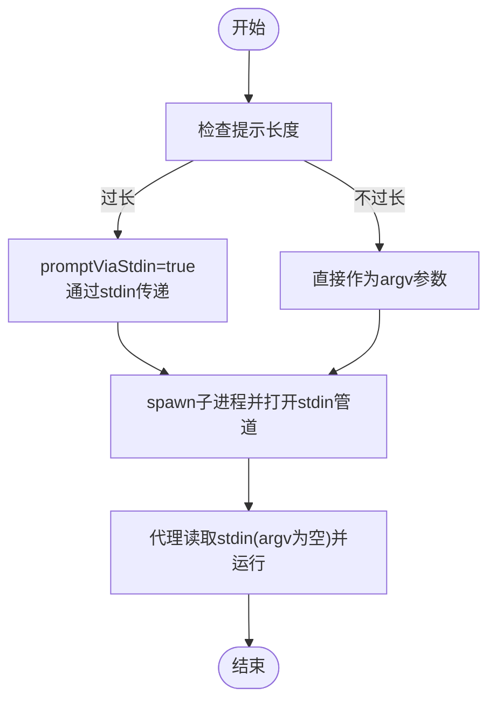
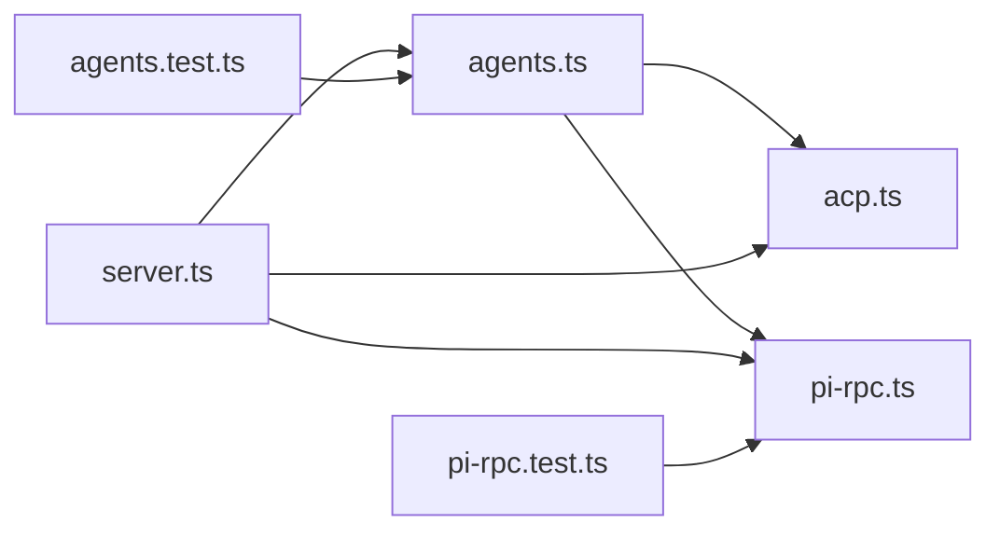

# 代理客户端实现

<cite>
**本文引用的文件**
- [apps/daemon/src/agents.ts](file://apps/daemon/src/agents.ts)
- [apps/daemon/src/acp.ts](file://apps/daemon/src/acp.ts)
- [apps/daemon/src/pi-rpc.ts](file://apps/daemon/src/pi-rpc.ts)
- [apps/daemon/tests/agents.test.ts](file://apps/daemon/tests/agents.test.ts)
- [apps/daemon/tests/pi-rpc.test.ts](file://apps/daemon/tests/pi-rpc.test.ts)
- [apps/daemon/src/server.ts](file://apps/daemon/src/server.ts)
- [docs/agent-adapters.md](file://docs/agent-adapters.md)
- [apps/AGENTS.md](file://apps/AGENTS.md)
- [AGENTS.md](file://AGENTS.md)
</cite>

## 目录
1. [简介](#简介)
2. [项目结构](#项目结构)
3. [核心组件](#核心组件)
4. [架构总览](#架构总览)
5. [详细组件分析](#详细组件分析)
6. [依赖关系分析](#依赖关系分析)
7. [性能考量](#性能考量)
8. [故障排除指南](#故障排除指南)
9. [结论](#结论)
10. [附录](#附录)

## 简介
本文件面向 Open Design 的代理客户端实现，系统化梳理并解释 13 种支持的编码代理 CLI 适配器（Claude Code、Codex、GitHub Copilot、Cursor Agent、Qwen Code、Pi、Devin for Terminal、Hermes、Kimi、OpenCode、Gemini、Kiro、Mistral Vibe）的适配器实现细节。重点覆盖以下方面：
- 每个代理的参数构建策略、环境变量注入、权限模式配置
- 特殊平台限制与兼容性处理（尤其是 Windows 命令行长度限制）
- promptViaStdin 机制：如何通过 stdin 传递提示以规避参数长度上限
- 模型列表获取策略：静态回退与动态探测
- 运行时事件流解析：ACPI-RPC、JSON-RPC、JSON Line Stream 等
- 故障排除与最佳实践

## 项目结构
Open Design 的代理适配层位于 daemon 应用中，核心文件为 agents.ts，负责代理发现、参数构建、进程启动与事件解析；另有通用的 ACP JSON-RPC 传输层（acp.ts）与 Pi 的专用 RPC 映射（pi-rpc.ts）。测试文件 agents.test.ts 与 pi-rpc.test.ts 覆盖关键行为。

**图表来源**
- [apps/daemon/src/agents.ts:119-604](file://apps/daemon/src/agents.ts#L119-L604)
- [apps/daemon/src/acp.ts:110-209](file://apps/daemon/src/acp.ts#L110-L209)
- [apps/daemon/src/pi-rpc.ts:210-297](file://apps/daemon/src/pi-rpc.ts#L210-L297)
- [apps/daemon/src/server.ts:3658-3754](file://apps/daemon/src/server.ts#L3658-L3754)
- [docs/agent-adapters.md:1-294](file://docs/agent-adapters.md#L1-L294)
- [apps/AGENTS.md:1-45](file://apps/AGENTS.md#L1-L45)
- [AGENTS.md:1-196](file://AGENTS.md#L1-L196)

**章节来源**
- [apps/daemon/src/agents.ts:119-604](file://apps/daemon/src/agents.ts#L119-L604)
- [apps/daemon/src/acp.ts:110-209](file://apps/daemon/src/acp.ts#L110-L209)
- [apps/daemon/src/pi-rpc.ts:210-297](file://apps/daemon/src/pi-rpc.ts#L210-L297)
- [apps/daemon/src/server.ts:3658-3754](file://apps/daemon/src/server.ts#L3658-L3754)
- [docs/agent-adapters.md:1-294](file://docs/agent-adapters.md#L1-L294)
- [apps/AGENTS.md:1-45](file://apps/AGENTS.md#L1-L45)
- [AGENTS.md:1-196](file://AGENTS.md#L1-L196)

## 核心组件
- 代理定义与检测：在 AGENT_DEFS 中集中声明各代理的可执行文件名、版本/帮助参数、能力标志、模型列表策略、参数构建函数、stdin 提示开关、流格式与事件解析器等。
- ACP JSON-RPC 传输：统一处理基于 JSON-RPC 的代理（Devin、Hermes、Kimi、Kiro、Mistral Vibe），负责初始化、会话建立、权限自动批准、事件映射与超时控制。
- Pi JSON-RPC 映射：针对 Pi 的专用协议映射，将扩展 UI 请求自动应答，将消息增量、思考增量、工具调用与结果转换为统一事件。
- 进程启动与事件流：server.ts 在聊天接口中解析代理定义、构建 argv、注入环境变量、按 promptViaStdin 决定 stdin 管道策略，并根据流格式选择解析器。
- 测试保障：agents.test.ts 与 pi-rpc.test.ts 验证参数顺序、stdin 传递、环境变量清理、RPC ID 序列等关键行为。

**章节来源**
- [apps/daemon/src/agents.ts:119-604](file://apps/daemon/src/agents.ts#L119-L604)
- [apps/daemon/src/acp.ts:211-423](file://apps/daemon/src/acp.ts#L211-L423)
- [apps/daemon/src/pi-rpc.ts:210-297](file://apps/daemon/src/pi-rpc.ts#L210-L297)
- [apps/daemon/src/server.ts:3658-3754](file://apps/daemon/src/server.ts#L3658-L3754)
- [apps/daemon/tests/agents.test.ts:1-484](file://apps/daemon/tests/agents.test.ts#L1-L484)
- [apps/daemon/tests/pi-rpc.test.ts:367-410](file://apps/daemon/tests/pi-rpc.test.ts#L367-L410)

## 架构总览
下图展示从 Web UI 到各代理 CLI 的调用链路与事件流：

**图表来源**
- [apps/daemon/src/server.ts:3658-3754](file://apps/daemon/src/server.ts#L3658-L3754)
- [apps/daemon/src/agents.ts:733-775](file://apps/daemon/src/agents.ts#L733-L775)
- [apps/daemon/src/acp.ts:211-423](file://apps/daemon/src/acp.ts#L211-L423)
- [apps/daemon/src/pi-rpc.ts:210-297](file://apps/daemon/src/pi-rpc.ts#L210-L297)

## 详细组件分析

### 通用适配器框架与参数构建
- 代理定义字段
  - id/name/bin/versionArgs/helpArgs/capabilityFlags/fallbackBins：用于检测与定位可执行文件。
  - listModels/fetchModels：动态获取模型列表或自定义探测逻辑。
  - buildArgs：根据 prompt、图片路径、额外允许目录、用户选项（模型/推理强度）、运行时上下文（如 cwd）生成 argv。
  - promptViaStdin：是否通过 stdin 传递提示，避免 Windows/Linux 参数长度限制。
  - streamFormat/eventParser/env：指定输出流格式与事件解析器，以及必要的环境变量。
  - reasoningOptions：推理强度预设（如 Codex）。
  - extraAllowedDirs：为某些代理（如 Copilot、Claude Code）扩展沙箱可见目录。
- 能力探测与缓存：首次探测后记录 capabilityFlags，后续 buildArgs 参考该缓存，确保只传入已声明的标志。
- 模型列表策略：优先使用 fetchModels/listModels 的动态探测，失败则回退到静态 fallbackModels。

**章节来源**
- [apps/daemon/src/agents.ts:119-604](file://apps/daemon/src/agents.ts#L119-L604)
- [apps/daemon/src/agents.ts:703-731](file://apps/daemon/src/agents.ts#L703-L731)
- [apps/daemon/src/agents.ts:733-775](file://apps/daemon/src/agents.ts#L733-L775)

### Claude Code（参考实现）
- 参数构建要点
  - 使用 -p 读取 stdin，配合 --output-format stream-json 输出结构化事件。
  - 条件添加 --include-partial-messages（由 capabilityFlags 决定）。
  - 支持 --add-dir 扩展额外目录，配合 extraAllowedDirs。
  - 强制 --permission-mode bypassPermissions，避免交互式授权阻塞。
- promptViaStdin：启用，避免 Linux MAX_ARG_STRLEN 与 Windows CreateProcess 限制。
- 流格式：claude-stream-json，由专用解析器映射为 UI 事件。

**章节来源**
- [apps/daemon/src/agents.ts:120-187](file://apps/daemon/src/agents.ts#L120-L187)
- [apps/daemon/tests/agents.test.ts:272-294](file://apps/daemon/tests/agents.test.ts#L272-L294)

### Codex
- 参数构建要点
  - 子命令 exec，启用 --json、--skip-git-repo-check、--full-auto，以及网络访问沙箱配置。
  - 支持通过 -c model_reasoning_effort="<clamp>" 设置推理强度，内部 clampCodexReasoning 将用户输入映射到模型支持范围。
  - 可选禁用插件：当 OD_CODEX_DISABLE_PLUGINS=1 时追加 --disable plugins。
  - 支持 -C 指定工作目录。
- promptViaStdin：启用，但不附加 '-' 作为 stdin 信号（避免新版本 CLI 报错）。
- 流格式：json-event-stream，事件解析器标识为 codex。

**章节来源**
- [apps/daemon/src/agents.ts:188-245](file://apps/daemon/src/agents.ts#L188-L245)
- [apps/daemon/src/agents.ts:82-99](file://apps/daemon/src/agents.ts#L82-L99)
- [apps/daemon/tests/agents.test.ts:45-99](file://apps/daemon/tests/agents.test.ts#L45-L99)

### GitHub Copilot
- 参数构建要点
  - 固定前缀 -p - --allow-all-tools --output-format json，确保非交互模式与结构化输出。
  - 支持 --model 与多次 --add-dir（extraAllowedDirs 过滤空值后拼接）。
- promptViaStdin：启用，stdin 由守护进程打开为管道。
- 流格式：copilot-stream-json，映射到统一事件集合。

**章节来源**
- [apps/daemon/src/agents.ts:448-504](file://apps/daemon/src/agents.ts#L448-L504)
- [apps/daemon/tests/agents.test.ts:116-169](file://apps/daemon/tests/agents.test.ts#L116-L169)

### Cursor Agent
- 参数构建要点
  - --print --output-format stream-json --stream-partial-output --force --trust 控制输出与信任。
  - 支持 --workspace 指定工作目录。
  - 不使用 '-' 作为 stdin 信号（避免被解释为纯文本提示）。
- promptViaStdin：启用。
- 流格式：json-event-stream，事件解析器标识为 cursor-agent。

**章节来源**
- [apps/daemon/src/agents.ts:381-422](file://apps/daemon/src/agents.ts#L381-L422)
- [apps/daemon/tests/agents.test.ts:101-114](file://apps/daemon/tests/agents.test.ts#L101-L114)

### Qwen Code
- 参数构建要点
  - --yolo 非交互模式，--model 指定模型，最后追加 '-' 触发 stdin 读取。
- promptViaStdin：启用。
- 流格式：plain（原始文本流）。

**章节来源**
- [apps/daemon/src/agents.ts:424-446](file://apps/daemon/src/agents.ts#L424-L446)

### Pi
- 参数构建要点
  - --mode rpc --no-session，可选 --model 与 --thinking（reasoningOptions）。
  - prompt 通过 RPC 命令发送，不在 argv 中。
- promptViaStdin：启用（stdin 用于 RPC）。
- 流格式：pi-rpc，使用专用映射器将扩展 UI 请求自动应答，消息增量/思考增量/工具调用/结果映射为统一事件。
- 模型列表：自定义 fetchModels 从 stderr 解析 TSV 表格。

**章节来源**
- [apps/daemon/src/agents.ts:506-567](file://apps/daemon/src/agents.ts#L506-L567)
- [apps/daemon/src/pi-rpc.ts:210-297](file://apps/daemon/src/pi-rpc.ts#L210-L297)
- [apps/daemon/tests/pi-rpc.test.ts:367-410](file://apps/daemon/tests/pi-rpc.test.ts#L367-L410)

### Devin for Terminal
- 参数构建要点
  - --permission-mode dangerous --respect-workspace-trust false acp，启用 ACP 并放宽权限与信任。
- 流格式：acp-json-rpc，使用 detectAcpModels 获取模型列表，attachAcpSession 处理生命周期与权限自动批准。

**章节来源**
- [apps/daemon/src/agents.ts:247-274](file://apps/daemon/src/agents.ts#L247-L274)
- [apps/daemon/src/acp.ts:110-209](file://apps/daemon/src/acp.ts#L110-L209)
- [apps/daemon/src/acp.ts:211-423](file://apps/daemon/src/acp.ts#L211-L423)

### Hermes
- 参数构建要点
  - acp 子命令，--accept-hooks，配合 detectAcpModels 与 attachAcpSession。
- 流格式：acp-json-rpc。

**章节来源**
- [apps/daemon/src/agents.ts:336-358](file://apps/daemon/src/agents.ts#L336-L358)
- [apps/daemon/src/acp.ts:110-209](file://apps/daemon/src/acp.ts#L110-L209)
- [apps/daemon/src/acp.ts:211-423](file://apps/daemon/src/acp.ts#L211-L423)

### Kimi
- 参数构建要点
  - acp 子命令，detectAcpModels 与 attachAcpSession。
- 流格式：acp-json-rpc。

**章节来源**
- [apps/daemon/src/agents.ts:360-379](file://apps/daemon/src/agents.ts#L360-L379)
- [apps/daemon/src/acp.ts:110-209](file://apps/daemon/src/acp.ts#L110-L209)
- [apps/daemon/src/acp.ts:211-423](file://apps/daemon/src/acp.ts#L211-L423)

### OpenCode
- 参数构建要点
  - opencode run --format json --dangerously-skip-permissions -，通过 stdin 传递提示。
  - --model 指定模型。
- promptViaStdin：启用。
- 流格式：json-event-stream，事件解析器标识为 opencode。

**章节来源**
- [apps/daemon/src/agents.ts:305-334](file://apps/daemon/src/agents.ts#L305-L334)

### Gemini
- 参数构建要点
  - --output-format stream-json --yolo，--model 指定模型。
  - env 注入 GEMINI_CLI_TRUST_WORKSPACE=true，避免版本脆弱的 --skip-trust 标志。
- promptViaStdin：启用（stdin 管道触发 headless 模式）。
- 流格式：json-event-stream，事件解析器标识为 gemini。

**章节来源**
- [apps/daemon/src/agents.ts:276-303](file://apps/daemon/src/agents.ts#L276-L303)

### Kiro
- 参数构建要点
  - acp 子命令，detectAcpModels 与 attachAcpSession。
- 流格式：acp-json-rpc。

**章节来源**
- [apps/daemon/src/agents.ts:569-585](file://apps/daemon/src/agents.ts#L569-L585)
- [apps/daemon/src/acp.ts:110-209](file://apps/daemon/src/acp.ts#L110-L209)
- [apps/daemon/src/acp.ts:211-423](file://apps/daemon/src/acp.ts#L211-L423)

### Mistral Vibe
- 参数构建要点
  - vibe-acp（无参数数组），detectAcpModels 与 attachAcpSession。
- 流格式：acp-json-rpc。

**章节来源**
- [apps/daemon/src/agents.ts:587-603](file://apps/daemon/src/agents.ts#L587-L603)
- [apps/daemon/src/acp.ts:110-209](file://apps/daemon/src/acp.ts#L110-L209)
- [apps/daemon/src/acp.ts:211-423](file://apps/daemon/src/acp.ts#L211-L423)

### promptViaStdin 机制与跨平台兼容
- 机制说明
  - 对于长提示（系统提示 + 设计系统 + 技能正文 + 用户消息），直接作为 argv 传递在 Linux 上可能超过 MAX_ARG_STRLEN，在 Windows 上可能超过 CreateProcess 的命令行限制。
  - 通过 promptViaStdin 标记，daemon 在 /api/chat 中将提示写入 child.stdin 管道，而非 argv。
- 兼容性策略
  - Claude Code、Codex、Cursor Agent、Qwen Code、Gemini、OpenCode、Pi 等均采用此策略。
  - 对于 Copilot，固定使用 -p - 以进入非交互模式并读取 stdin。

**图表来源**
- [apps/daemon/src/agents.ts:150-187](file://apps/daemon/src/agents.ts#L150-L187)
- [apps/daemon/src/agents.ts:285-303](file://apps/daemon/src/agents.ts#L285-L303)
- [apps/daemon/src/agents.ts:448-504](file://apps/daemon/src/agents.ts#L448-L504)
- [apps/daemon/src/agents.ts:506-567](file://apps/daemon/src/agents.ts#L506-L567)

**章节来源**
- [apps/daemon/src/agents.ts:150-187](file://apps/daemon/src/agents.ts#L150-L187)
- [apps/daemon/src/agents.ts:285-303](file://apps/daemon/src/agents.ts#L285-L303)
- [apps/daemon/src/agents.ts:448-504](file://apps/daemon/src/agents.ts#L448-L504)
- [apps/daemon/src/agents.ts:506-567](file://apps/daemon/src/agents.ts#L506-L567)
- [apps/daemon/tests/agents.test.ts:272-294](file://apps/daemon/tests/agents.test.ts#L272-L294)

### 环境变量与权限模式配置
- 通用规则
  - spawnEnvForAgent 仅对 claude 适配器删除 ANTHROPIC_API_KEY，避免 CLI 自身凭据被覆盖。
  - 其他代理保留 ANTHROPIC_API_KEY，以确保其自有认证链路正常工作。
  - Gemini 通过环境变量 GEMINI_CLI_TRUST_WORKSPACE=true 提供工作区信任，避免版本脆弱的命令行标志。
- 代理特例
  - Codex：OD_CODEX_DISABLE_PLUGINS=1 时追加 --disable plugins。
  - Copilot：--allow-all-tools 必须显式传入以避免交互式工具调用阻塞。
  - Claude Code：--permission-mode bypassPermissions 强制绕过交互式权限确认。
  - Devin/Kimi/Hermes/Kiro/Vibe：--permission-mode dangerous 与 --respect-workspace-trust false 或等效策略，确保在无头模式下顺畅运行。

**章节来源**
- [apps/daemon/src/agents.ts:824-844](file://apps/daemon/src/agents.ts#L824-L844)
- [apps/daemon/src/agents.ts:292-292](file://apps/daemon/src/agents.ts#L292-L292)
- [apps/daemon/src/agents.ts:462-467](file://apps/daemon/src/agents.ts#L462-L467)
- [apps/daemon/src/agents.ts:182-182](file://apps/daemon/src/agents.ts#L182-L182)
- [apps/daemon/src/agents.ts:272-272](file://apps/daemon/src/agents.ts#L272-L272)
- [apps/daemon/src/agents.ts:549-562](file://apps/daemon/src/agents.ts#L549-L562)

### 模型列表获取与验证
- 动态探测
  - detectAcpModels：通过 ACP initialize/session/new 等 RPC 协议获取可用模型列表，normalize 后返回。
  - parsePiModels：解析 Pi 的 TSV 模型表，生成统一模型选项。
  - parseLineSeparatedModels：将换行分隔的模型 ID 列表转为统一格式。
- 静态回退
  - 若动态探测失败或为空，回退到 AGENT_DEFS 中的 fallbackModels。
- 运行时校验
  - isKnownModel：结合 liveModelCache 与 fallbackModels，拒绝可疑自定义模型 ID。

**章节来源**
- [apps/daemon/src/acp.ts:110-209](file://apps/daemon/src/acp.ts#L110-L209)
- [apps/daemon/src/agents.ts:309-317](file://apps/daemon/src/agents.ts#L309-L317)
- [apps/daemon/src/agents.ts:512-524](file://apps/daemon/src/agents.ts#L512-L524)
- [apps/daemon/src/agents.ts:101-117](file://apps/daemon/src/agents.ts#L101-L117)
- [apps/daemon/src/agents.ts:861-869](file://apps/daemon/src/agents.ts#L861-L869)

### 运行时事件流与错误处理
- ACP JSON-RPC
  - attachAcpSession：初始化、建立会话、自动批准权限请求、映射思考/消息增量、工具调用/结果、用量统计与超时控制。
- Pi JSON-RPC
  - attachPiRpcSession：发送 prompt 命令，自动应答扩展 UI 请求，映射消息增量/思考增量/工具调用/结果/用量与成本。
- 统一事件
  - 文本增量、思考增量、工具调用、工具结果、用量、错误、完成等事件类型在各解析器中被标准化。

**章节来源**
- [apps/daemon/src/acp.ts:211-423](file://apps/daemon/src/acp.ts#L211-L423)
- [apps/daemon/src/pi-rpc.ts:210-297](file://apps/daemon/src/pi-rpc.ts#L210-L297)

## 依赖关系分析
- 代理定义与检测：agents.ts 为核心，依赖 PATH 扫描与帮助输出解析，动态探测模型列表。
- ACP 传输：acp.ts 为 Devin/Hermes/Kimi/Kiro/Vibe 的通用传输层，提供 RPC 生命周期管理与权限自动批准。
- Pi 映射：pi-rpc.ts 专用于 Pi 的协议映射与扩展 UI 自动应答。
- 进程启动：server.ts 负责最终的进程启动、stdin 管道策略、环境变量注入与事件流转发。

**图表来源**
- [apps/daemon/src/agents.ts:119-604](file://apps/daemon/src/agents.ts#L119-L604)
- [apps/daemon/src/acp.ts:110-209](file://apps/daemon/src/acp.ts#L110-L209)
- [apps/daemon/src/pi-rpc.ts:210-297](file://apps/daemon/src/pi-rpc.ts#L210-L297)
- [apps/daemon/src/server.ts:3658-3754](file://apps/daemon/src/server.ts#L3658-L3754)
- [apps/daemon/tests/agents.test.ts:1-484](file://apps/daemon/tests/agents.test.ts#L1-L484)
- [apps/daemon/tests/pi-rpc.test.ts:367-410](file://apps/daemon/tests/pi-rpc.test.ts#L367-L410)

**章节来源**
- [apps/daemon/src/agents.ts:119-604](file://apps/daemon/src/agents.ts#L119-L604)
- [apps/daemon/src/acp.ts:110-209](file://apps/daemon/src/acp.ts#L110-L209)
- [apps/daemon/src/pi-rpc.ts:210-297](file://apps/daemon/src/pi-rpc.ts#L210-L297)
- [apps/daemon/src/server.ts:3658-3754](file://apps/daemon/src/server.ts#L3658-L3754)
- [apps/daemon/tests/agents.test.ts:1-484](file://apps/daemon/tests/agents.test.ts#L1-L484)
- [apps/daemon/tests/pi-rpc.test.ts:367-410](file://apps/daemon/tests/pi-rpc.test.ts#L367-L410)

## 性能考量
- 参数长度限制：通过 promptViaStdin 避免 argv 过长导致的系统限制与性能问题。
- 模型列表探测：合理设置超时与缓冲区大小，避免长时间阻塞与内存占用过高。
- ACP RPC：设置阶段超时与整体超时，防止代理卡死影响用户体验。
- 环境变量最小化：仅注入必要项，减少子进程启动开销。

## 故障排除指南
- 代理不可用
  - 现象：/api/chat 返回“代理未安装或不在 PATH”。
  - 排查：确认代理可执行文件在 PATH 中，或使用 resolveAgentBin 指定绝对路径。
  - 参考：server.ts 中的错误构造与返回。
- Windows 命令行过长
  - 现象：spawn ENAMETOOLONG。
  - 解决：确保 promptViaStdin=true，提示通过 stdin 传递。
  - 参考：各代理定义中的 promptViaStdin 与相关注释。
- Copilot 非交互模式失败
  - 现象：提示过多参数或等待交互确认。
  - 解决：确保 -p - 与 --allow-all-tools 已正确前置与传入。
  - 参考：agents.test.ts 中的断言与注释。
- Claude Code 权限阻塞
  - 现象：交互式权限弹窗导致无头运行失败。
  - 解决：使用 --permission-mode bypassPermissions。
  - 参考：agents.ts 中的构建参数与测试。
- Codex 插件问题
  - 现象：插件导致运行异常。
  - 解决：设置 OD_CODEX_DISABLE_PLUGINS=1 以禁用插件。
  - 参考：agents.test.ts 中的断言。
- Pi 扩展 UI 阻塞
  - 现象：代理等待 UI 选择/确认。
  - 解决：自动应答扩展 UI 请求，保持协议畅通。
  - 参考：pi-rpc.ts 中的自动应答逻辑。
- ACP 权限与超时
  - 现象：代理请求权限或长时间无响应。
  - 解决：自动批准权限请求，设置阶段超时与整体超时。
  - 参考：acp.ts 中的权限处理与超时控制。

**章节来源**
- [apps/daemon/src/server.ts:3707-3719](file://apps/daemon/src/server.ts#L3707-L3719)
- [apps/daemon/src/agents.ts:150-187](file://apps/daemon/src/agents.ts#L150-L187)
- [apps/daemon/src/agents.ts:462-467](file://apps/daemon/src/agents.ts#L462-L467)
- [apps/daemon/src/agents.ts:182-182](file://apps/daemon/src/agents.ts#L182-L182)
- [apps/daemon/tests/agents.test.ts:45-99](file://apps/daemon/tests/agents.test.ts#L45-L99)
- [apps/daemon/src/pi-rpc.ts:210-297](file://apps/daemon/src/pi-rpc.ts#L210-L297)
- [apps/daemon/src/acp.ts:211-423](file://apps/daemon/src/acp.ts#L211-L423)

## 结论
Open Design 的代理适配层通过统一的代理定义与检测机制，结合 ACP 与专用 RPC 映射，实现了对多厂商代码代理 CLI 的一致接入。关键优化点包括：
- promptViaStdin 机制有效规避跨平台参数长度限制；
- 动态模型探测与静态回退相结合，保证 UI 体验；
- 严格的权限与环境变量策略，兼顾安全与兼容；
- 完备的测试覆盖，确保参数顺序、stdin 传递、RPC 行为等关键路径稳定可靠。

## 附录
- 相关文档与边界
  - 适配器规范与能力矩阵：docs/agent-adapters.md
  - 应用边界与模块职责：apps/AGENTS.md
  - 仓库级说明与分支策略：AGENTS.md

**章节来源**
- [docs/agent-adapters.md:1-294](file://docs/agent-adapters.md#L1-L294)
- [apps/AGENTS.md:1-45](file://apps/AGENTS.md#L1-L45)
- [AGENTS.md:1-196](file://AGENTS.md#L1-L196)