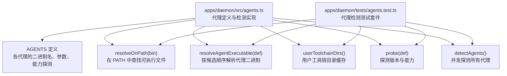
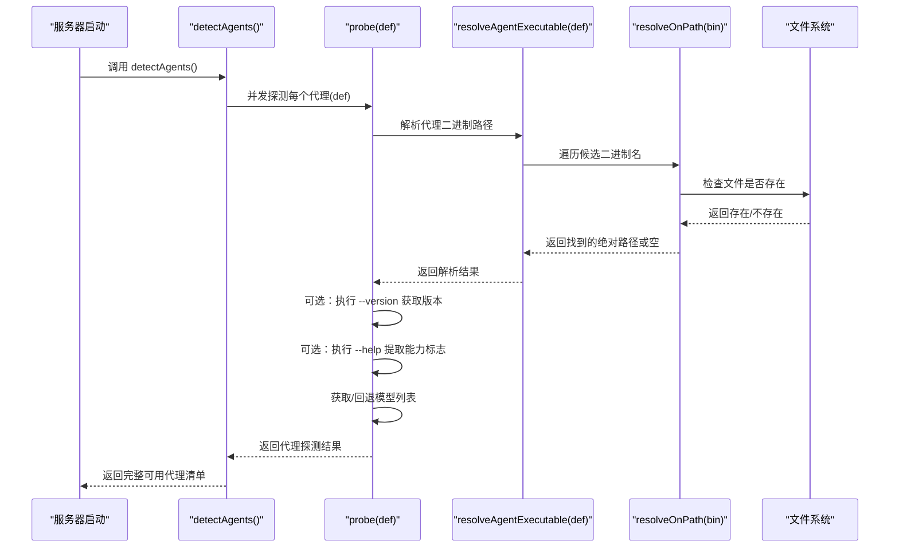
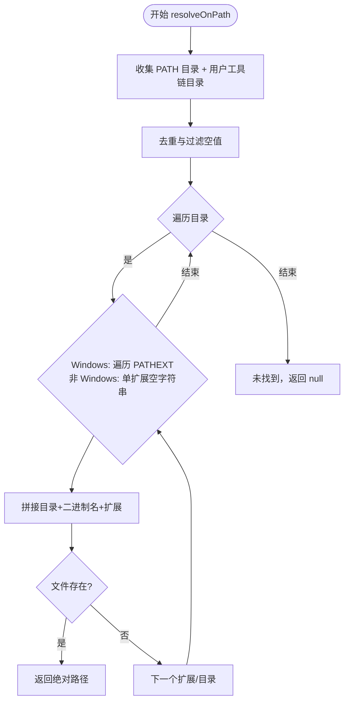
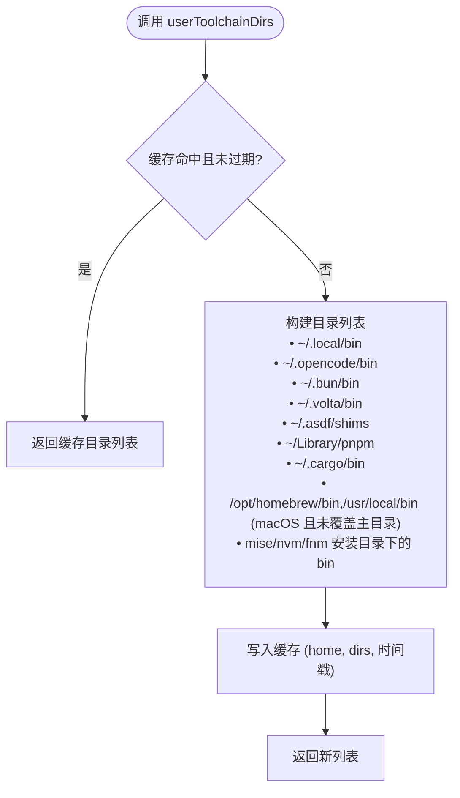
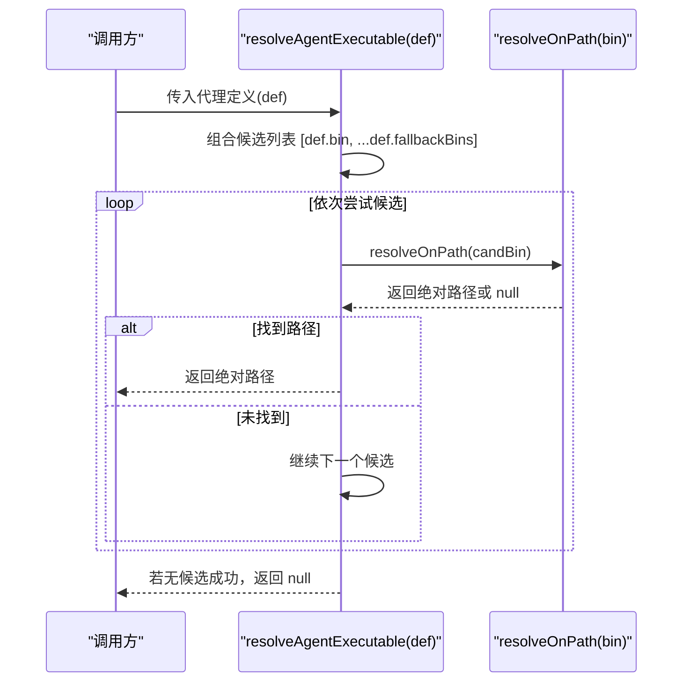
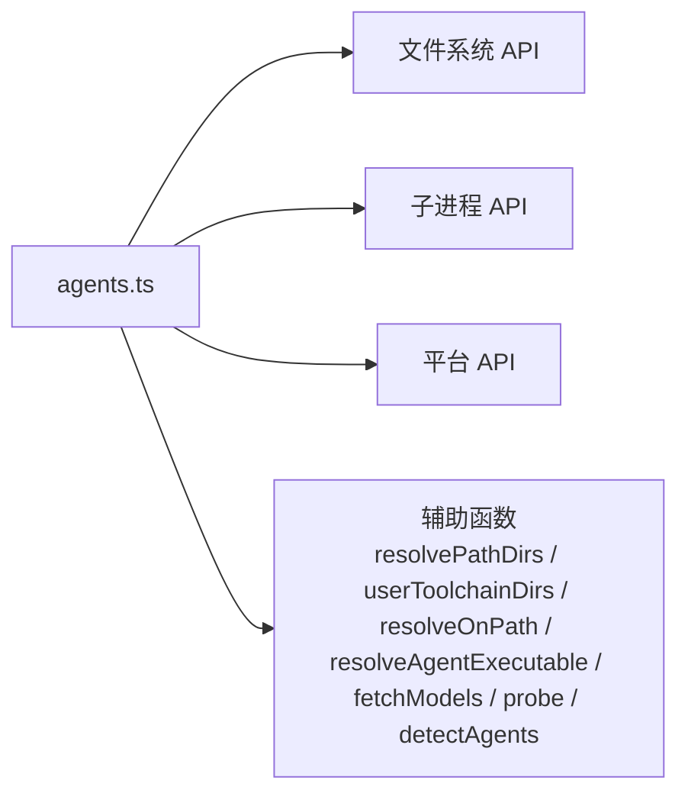

# 代理检测机制

<cite>
**本文档引用的文件**
- [apps/daemon/src/agents.ts](file://apps/daemon/src/agents.ts)
- [apps/daemon/tests/agents.test.ts](file://apps/daemon/tests/agents.test.ts)
</cite>

## 目录
1. [简介](#简介)
2. [项目结构](#项目结构)
3. [核心组件](#核心组件)
4. [架构概览](#架构概览)
5. [详细组件分析](#详细组件分析)
6. [依赖关系分析](#依赖关系分析)
7. [性能考虑](#性能考虑)
8. [故障排除指南](#故障排除指南)
9. [结论](#结论)

## 简介
本文件详细阐述 Open Design 代理检测机制的设计与实现，重点覆盖以下方面：
- PATH 扫描算法与平台差异（Windows 的 PATHEXT 处理、macOS/Linux 的多架构支持）
- 用户工具链目录缓存机制（减少重复扫描开销）
- 代理可执行文件解析流程（resolveOnPath 与 resolveAgentExecutable 的协作）
- 代理备用二进制名称支持（如 Claude Code 的 OpenClaude 兼容）
- 故障排除指南与性能优化建议

该机制的核心目标是在启动时自动发现并验证可用的本地代理（如 Claude Code、Codex、Gemini、Qwen、Copilot 等），确保后续聊天与任务执行能够直接调用这些本地 CLI，避免网络依赖或权限问题。

## 项目结构
代理检测逻辑集中于守护进程应用的 agents 模块中，测试用例覆盖了关键行为与边界条件。下图展示了与代理检测相关的主要文件与职责：

图表来源
- [apps/daemon/src/agents.ts:119-604](file://apps/daemon/src/agents.ts#L119-L604)
- [apps/daemon/src/agents.ts:627-654](file://apps/daemon/src/agents.ts#L627-L654)
- [apps/daemon/src/agents.ts:673-701](file://apps/daemon/src/agents.ts#L673-L701)
- [apps/daemon/src/agents.ts:733-775](file://apps/daemon/src/agents.ts#L733-L775)
- [apps/daemon/src/agents.ts:799-808](file://apps/daemon/src/agents.ts#L799-L808)
- [apps/daemon/tests/agents.test.ts:1-484](file://apps/daemon/tests/agents.test.ts#L1-L484)

章节来源
- [apps/daemon/src/agents.ts:119-604](file://apps/daemon/src/agents.ts#L119-L604)
- [apps/daemon/tests/agents.test.ts:1-484](file://apps/daemon/tests/agents.test.ts#L1-L484)

## 核心组件
- 代理定义集合（AGENT_DEFS）：声明每个代理的二进制名、备用二进制列表、版本参数、帮助参数、能力标志映射、模型列表策略等。
- PATH 解析器（resolveOnPath）：跨平台扫描 PATH 与用户工具链目录，支持 Windows 的 PATHEXT 扩展名匹配。
- 代理解析器（resolveAgentExecutable）：按优先级尝试主二进制与备用二进制，返回首个存在的绝对路径。
- 用户工具链目录缓存（userToolchainDirs）：缓存用户级工具链安装目录，降低重复扫描成本。
- 探测器（probe/detectAgents）：并发探测各代理的可用性、版本与能力，并维护模型列表。

章节来源
- [apps/daemon/src/agents.ts:119-604](file://apps/daemon/src/agents.ts#L119-L604)
- [apps/daemon/src/agents.ts:627-654](file://apps/daemon/src/agents.ts#L627-L654)
- [apps/daemon/src/agents.ts:673-701](file://apps/daemon/src/agents.ts#L673-L701)
- [apps/daemon/src/agents.ts:733-775](file://apps/daemon/src/agents.ts#L733-L775)
- [apps/daemon/src/agents.ts:799-808](file://apps/daemon/src/agents.ts#L799-L808)

## 架构概览
下图展示了代理检测的整体流程：从加载代理定义到最终输出可用代理清单。

图表来源
- [apps/daemon/src/agents.ts:799-808](file://apps/daemon/src/agents.ts#L799-L808)
- [apps/daemon/src/agents.ts:733-775](file://apps/daemon/src/agents.ts#L733-L775)
- [apps/daemon/src/agents.ts:693-701](file://apps/daemon/src/agents.ts#L693-L701)
- [apps/daemon/src/agents.ts:673-686](file://apps/daemon/src/agents.ts#L673-L686)

## 详细组件分析

### PATH 扫描算法与平台差异
- 基本流程
  - 收集 PATH 分隔符分割后的目录列表。
  - 追加用户工具链目录（见“用户工具链目录缓存”）。
  - 去重后逐个目录检查候选二进制名。
- Windows 平台
  - 使用环境变量 PATHEXT（默认值为 .EXE;.CMD;.BAT）作为扩展名集合，对每个候选名生成带扩展的全路径进行存在性检查。
- macOS/Linux 平台
  - PATHEXT 为空，仅检查无扩展的二进制名。
- 作用域扩展
  - 在 GUI 启动场景（macOS .app、Linux .desktop）中，PATH 可能被精简；通过 userToolchainDirs 自动补充常见用户级安装位置，提升检测成功率。

图表来源
- [apps/daemon/src/agents.ts:656-671](file://apps/daemon/src/agents.ts#L656-L671)
- [apps/daemon/src/agents.ts:673-686](file://apps/daemon/src/agents.ts#L673-L686)

章节来源
- [apps/daemon/src/agents.ts:656-671](file://apps/daemon/src/agents.ts#L656-L671)
- [apps/daemon/src/agents.ts:673-686](file://apps/daemon/src/agents.ts#L673-L686)

### 用户工具链目录缓存机制
- 缓存策略
  - 以用户主目录为键，缓存 TTL 为 5 秒，避免频繁读取文件系统。
  - 当 OD_AGENT_HOME 被设置时，使用其指向的目录作为主目录来源。
- 缓存内容
  - 包含用户级二进制安装目录（如 .local/bin、.opencode/bin、.bun/bin、.volta/bin、.asdf/shims、.cargo/bin）。
  - macOS 特有：/opt/homebrew/bin、/usr/local/bin（当未显式覆盖主目录时）。
  - Node 版本管理器安装目录：mise、nvm、fnm 下的 node 安装路径。
- 优化效果
  - 将多次 PATH 扫描合并为一次缓存命中，显著降低 I/O 成本。

图表来源
- [apps/daemon/src/agents.ts:622-654](file://apps/daemon/src/agents.ts#L622-L654)

章节来源
- [apps/daemon/src/agents.ts:622-654](file://apps/daemon/src/agents.ts#L622-L654)

### 代理可执行文件解析流程
- resolveAgentExecutable
  - 输入为代理定义对象（包含 bin 与可选 fallbackBins）。
  - 优先尝试 def.bin，再按序尝试 fallbackBins 中的每个候选。
  - 对每个候选调用 resolveOnPath，返回首个存在的绝对路径；若均不存在则返回 null。
- 典型用法
  - detectAgents 并发探测时，先用 resolveAgentExecutable 判断可用性。
  - resolveAgentBin 用于在聊天请求阶段再次解析，确保 spawn 使用与探测一致的二进制。

图表来源
- [apps/daemon/src/agents.ts:693-701](file://apps/daemon/src/agents.ts#L693-L701)
- [apps/daemon/src/agents.ts:673-686](file://apps/daemon/src/agents.ts#L673-L686)

章节来源
- [apps/daemon/src/agents.ts:693-701](file://apps/daemon/src/agents.ts#L693-L701)

### 代理备用二进制名称支持（以 Claude Code → OpenClaude 为例）
- 设计背景
  - 某些代理的分叉版本使用不同的二进制名，但 CLI 参数完全兼容。
- 实现方式
  - 在代理定义中提供 fallbackBins 数组，resolveAgentExecutable 会按序尝试。
  - 测试覆盖了：主二进制优先、仅备用二进制存在、两者都存在时主二进制优先、无候选存在返回 null 等场景。
- 典型案例
  - Claude Code 的 fallbackBins 包含 openclaude，满足单一二进制安装场景（无需包装脚本）。

章节来源
- [apps/daemon/src/agents.ts:119-187](file://apps/daemon/src/agents.ts#L119-L187)
- [apps/daemon/tests/agents.test.ts:296-320](file://apps/daemon/tests/agents.test.ts#L296-L320)
- [apps/daemon/tests/agents.test.ts:322-375](file://apps/daemon/tests/agents.test.ts#L322-L375)

### 探测与能力缓存
- 探测步骤
  - resolveAgentExecutable：解析二进制路径。
  - 可选执行 --version 获取版本信息（失败也标记为可用）。
  - 可选执行 --help，基于 capabilityFlags 映射提取能力标志，缓存至 agentCapabilities。
  - 获取模型列表：优先使用自定义 fetchModels 或 listModels.parse，失败则回退到静态 fallbackModels。
- 并发探测
  - detectAgents 使用 Promise.all 并行探测所有代理，缩短启动时间。

章节来源
- [apps/daemon/src/agents.ts:733-775](file://apps/daemon/src/agents.ts#L733-L775)
- [apps/daemon/src/agents.ts:799-808](file://apps/daemon/src/agents.ts#L799-L808)

## 依赖关系分析
- 模块内依赖
  - agents.ts 内部函数相互协作：resolvePathDirs 依赖 userToolchainDirs；resolveOnPath 依赖 resolvePathDirs；resolveAgentExecutable 依赖 resolveOnPath；probe 依赖 resolveAgentExecutable 与 fetchModels；detectAgents 并发调度 probe。
- 外部依赖
  - 文件系统 API（existsSync、readdirSync）用于路径存在性与目录枚举。
  - 子进程 API（execFileP）用于执行 --version、--help 与模型列表命令。
  - 平台 API（homedir、delimiter、path）用于跨平台路径处理。

图表来源
- [apps/daemon/src/agents.ts:119-604](file://apps/daemon/src/agents.ts#L119-L604)
- [apps/daemon/src/agents.ts:627-654](file://apps/daemon/src/agents.ts#L627-L654)
- [apps/daemon/src/agents.ts:656-671](file://apps/daemon/src/agents.ts#L656-L671)
- [apps/daemon/src/agents.ts:673-701](file://apps/daemon/src/agents.ts#L673-L701)
- [apps/daemon/src/agents.ts:703-731](file://apps/daemon/src/agents.ts#L703-L731)
- [apps/daemon/src/agents.ts:733-775](file://apps/daemon/src/agents.ts#L733-L775)
- [apps/daemon/src/agents.ts:799-808](file://apps/daemon/src/agents.ts#L799-L808)

## 性能考虑
- 缓存策略
  - 用户工具链目录缓存（TTL=5000ms）：显著降低重复扫描成本，尤其在频繁探测场景。
  - 能力标志缓存（agentCapabilities）：仅在首次探测时执行 --help，后续复用。
- 并发优化
  - detectAgents 并行探测所有代理，缩短冷启动时间。
- I/O 限制
  - 模型列表命令设置较大的 maxBuffer，避免长列表被截断导致回退。
- 路径扫描优化
  - 去重与过滤空目录，减少无效 I/O。
- 建议
  - 在高并发场景下，保持 userToolchainDirs 的缓存 TTL 合理（当前 5s 已较短，适合频繁变更的开发环境）。
  - 对于 PATH 极度精简的 GUI 启动场景，确保 userToolchainDirs 能覆盖主流工具链安装位置。

章节来源
- [apps/daemon/src/agents.ts:622-654](file://apps/daemon/src/agents.ts#L622-L654)
- [apps/daemon/src/agents.ts:733-775](file://apps/daemon/src/agents.ts#L733-L775)
- [apps/daemon/src/agents.ts:799-808](file://apps/daemon/src/agents.ts#L799-L808)

## 故障排除指南
- 症状：代理未被检测到
  - 检查 PATH 是否包含代理二进制所在目录；Windows 确认 PATHEXT 是否包含对应扩展。
  - 确认是否处于 GUI 启动场景（PATH 被精简），此时应依赖 userToolchainDirs 的补充路径。
  - 若仅安装了分叉版本（如仅 openclaude），确认代理定义中的 fallbackBins 是否包含该名称。
- 症状：resolveAgentExecutable 返回 null
  - 确认 def.bin 与 fallbackBins 的组合是否正确。
  - 在最小 PATH 环境下，确认 userToolchainDirs 是否包含实际安装目录。
- 症状：--version 或 --help 失败
  - 探测阶段对 --version 失败仍视为可用；--help 失败会导致能力标志为空，buildArgs 将回退到安全基线。
- 症状：模型列表为空或不准确
  - 检查 listModels.args 与 parse 是否正确；必要时回退到 fallbackModels。
  - 对于某些 CLI（如 pi），需从 stderr 读取列表。
- 症状：Windows 下找不到 .CMD/.BAT 二进制
  - 确认 PATHEXT 环境变量配置；resolveOnPath 会根据 PATHEXT 尝试不同扩展。
- 症状：GUI 启动时 PATH 不完整
  - userToolchainDirs 会自动补充常见用户级安装路径；若仍失败，手动将安装目录加入 PATH。

章节来源
- [apps/daemon/src/agents.ts:673-686](file://apps/daemon/src/agents.ts#L673-L686)
- [apps/daemon/src/agents.ts:693-701](file://apps/daemon/src/agents.ts#L693-L701)
- [apps/daemon/src/agents.ts:733-775](file://apps/daemon/src/agents.ts#L733-L775)
- [apps/daemon/tests/agents.test.ts:322-394](file://apps/daemon/tests/agents.test.ts#L322-L394)

## 结论
Open Design 的代理检测机制通过“定义驱动 + 跨平台 PATH 扫描 + 用户工具链目录缓存”的组合，实现了对多种本地代理的自动发现与验证。其设计兼顾了：
- 可靠性：对 PATH 精简场景（GUI 启动）提供工具链目录补充。
- 兼容性：Windows PATHEXT 支持与备用二进制名（如 OpenClaude）兼容。
- 可维护性：以 AGENT_DEFS 为中心的声明式配置，便于扩展新的代理。
- 性能：缓存与并发探测有效降低启动与运行时开销。

通过本文档提供的分析与排障建议，开发者可以更高效地集成、调试与优化代理检测流程。