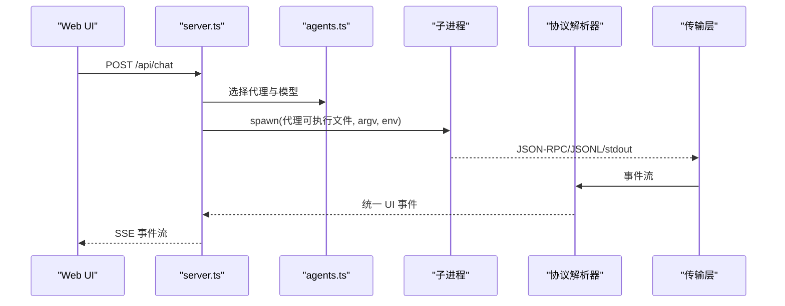
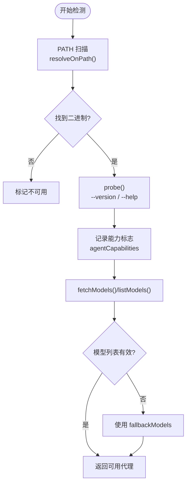
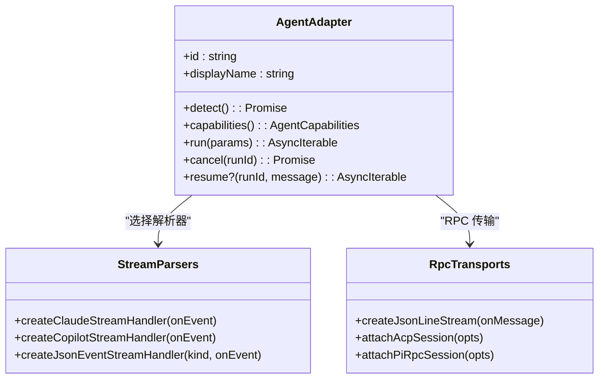
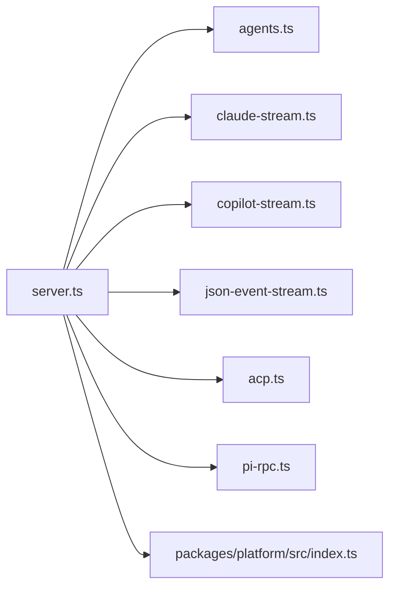

# 代理适配器系统

<cite>
**本文档引用的文件**
- [apps/daemon/src/agents.ts](file://apps/daemon/src/agents.ts)
- [apps/daemon/src/claude-stream.ts](file://apps/daemon/src/claude-stream.ts)
- [apps/daemon/src/copilot-stream.ts](file://apps/daemon/src/copilot-stream.ts)
- [apps/daemon/src/json-event-stream.ts](file://apps/daemon/src/json-event-stream.ts)
- [apps/daemon/src/pi-rpc.ts](file://apps/daemon/src/pi-rpc.ts)
- [apps/daemon/src/acp.ts](file://apps/daemon/src/acp.ts)
- [apps/daemon/src/server.ts](file://apps/daemon/src/server.ts)
- [apps/daemon/src/cli.ts](file://apps/daemon/src/cli.ts)
- [packages/platform/src/index.ts](file://packages/platform/src/index.ts)
- [docs/agent-adapters.md](file://docs/agent-adapters.md)
</cite>

## 目录
1. [简介](#简介)
2. [项目结构](#项目结构)
3. [核心组件](#核心组件)
4. [架构总览](#架构总览)
5. [详细组件分析](#详细组件分析)
6. [依赖关系分析](#依赖关系分析)
7. [性能考量](#性能考量)
8. [故障排查指南](#故障排查指南)
9. [结论](#结论)
10. [附录](#附录)

## 简介
本文件系统化阐述 Open Design 的代理适配器体系：从代理检测机制（PATH 扫描与配置目录探测）、13 种支持的编码代理 CLI（Claude Code、Codex、GitHub Copilot、Cursor Agent、Devin for Terminal、Gemini CLI、OpenCode、Pi、Kimi、Kiro、Vibe、Qwen Code、Cursor Agent 等）到适配器实现；再到四种流式协议格式（claude-stream-json、copilot-stream-json、json-event-stream、acp-json-rpc、pi-rpc、plain）的解析机制；最后覆盖跨平台兼容性处理（尤其是 Windows 友好启动）与 BYOK 代理代理（自定义代理）的实现方式，并提供新代理适配器开发指南。

## 项目结构
代理适配器系统主要由以下模块构成：
- 代理检测与定义：在 agents.ts 中声明 13 种代理的二进制名、能力标志、模型列表来源、构建参数策略、流式协议等元数据。
- 流式协议解析器：针对不同协议分别实现解析器，将子进程输出转换为统一的 UI 事件。
- 传输层：ACPRPC 与 Pi RPC 通过 JSON-RPC over stdio 驱动对话生命周期。
- 服务器入口：server.ts 提供 /api/chat 等接口，负责拼接系统提示词、选择代理、启动子进程、转发事件。
- CLI 入口：cli.ts 提供 od 与 od media 子命令，用于启动守护进程与媒体生成任务。
- 平台工具：packages/platform/src/index.ts 提供 Windows 友好启动（.bat/.cmd 调用封装）。

```mermaid
graph TB
subgraph "守护进程"
S["server.ts<br/>HTTP 服务与路由"]
A["agents.ts<br/>代理定义与检测"]
C["claude-stream.ts<br/>Claude JSONL 解析"]
P["copilot-stream.ts<br/>Copilot JSONL 解析"]
J["json-event-stream.ts<br/>通用 JSON 事件解析"]
R["pi-rpc.ts<br/>Pi JSON-RPC 驱动"]
K["acp.ts<br/>ACPRPC 驱动"]
end
subgraph "平台工具"
PL["packages/platform/src/index.ts<br/>Windows 友好启动"]
end
subgraph "CLI"
CLI["apps/daemon/src/cli.ts<br/>od / od media"]
end
CLI --> S
S --> A
S --> C
S --> P
S --> J
S --> R
S --> K
S --> PL
```

**图表来源**
- [apps/daemon/src/server.ts](file://apps/daemon/src/server.ts)
- [apps/daemon/src/agents.ts](file://apps/daemon/src/agents.ts)
- [apps/daemon/src/claude-stream.ts](file://apps/daemon/src/claude-stream.ts)
- [apps/daemon/src/copilot-stream.ts](file://apps/daemon/src/copilot-stream.ts)
- [apps/daemon/src/json-event-stream.ts](file://apps/daemon/src/json-event-stream.ts)
- [apps/daemon/src/pi-rpc.ts](file://apps/daemon/src/pi-rpc.ts)
- [apps/daemon/src/acp.ts](file://apps/daemon/src/acp.ts)
- [packages/platform/src/index.ts](file://packages/platform/src/index.ts)
- [apps/daemon/src/cli.ts](file://apps/daemon/src/cli.ts)

**章节来源**
- [apps/daemon/src/agents.ts](file://apps/daemon/src/agents.ts)
- [apps/daemon/src/server.ts](file://apps/daemon/src/server.ts)
- [apps/daemon/src/cli.ts](file://apps/daemon/src/cli.ts)
- [packages/platform/src/index.ts](file://packages/platform/src/index.ts)

## 核心组件
- 代理定义与检测（agents.ts）
  - 定义 13 种代理的二进制名、帮助/版本参数、能力标志、模型列表来源、构建参数策略、prompt 输入方式、流式协议类型与事件解析器等。
  - 实现 PATH 扫描与用户工具链目录补充扫描，支持 Windows PATHEXT 扩展名匹配。
  - 基于 --help 输出探测能力标志，缓存到 agentCapabilities，供后续构建参数使用。
  - 支持 fetchModels 与 listModels 两种模型列表来源，失败时回退到静态 fallbackModels。
- 流式协议解析器
  - claude-stream-json：解析 Claude Code 的 --output-format stream-json，支持 include-partial-messages 与旧版模式。
  - copilot-stream-json：解析 GitHub Copilot CLI 的 --output-format json，映射到统一事件集。
  - json-event-stream：解析通用 JSON 事件（opencode、gemini、cursor-agent、codex），按种类分派处理函数。
  - acp-json-rpc：解析 Devin/Kimi/Kiro/Vibe 等基于 ACP 协议的 JSON-RPC over stdio。
  - pi-rpc：解析 Pi 的 --mode rpc JSON-RPC over stdio，并自动应答扩展 UI 请求。
  - plain：直接透传原始文本块。
- 传输层
  - createJsonLineStream：通用 JSON 行解析器，忽略非 JSON 日志行。
  - attachAcpSession：建立 ACP 会话，驱动 initialize → session/new → session/prompt → usage 回传。
  - attachPiRpcSession：建立 Pi RPC 会话，发送 prompt 命令，解析 agent_start/turn_start/message_update/tool_execution_* 等事件。
- 服务器集成
  - /api/chat：拼装系统提示词与技能内容，选择代理，启动子进程，将 stdout/stderr 事件映射为 SSE 推送。
  - /api/agents：返回可用代理清单与模型列表。
  - /api/projects/:id/media/generate：媒体生成入口，由 od media 子命令调用。
- CLI
  - od：启动守护进程并在浏览器打开 UI。
  - od media generate/wait：与守护进程交互，排队与轮询任务状态，输出最终产物或错误。

**章节来源**
- [apps/daemon/src/agents.ts](file://apps/daemon/src/agents.ts)
- [apps/daemon/src/claude-stream.ts](file://apps/daemon/src/claude-stream.ts)
- [apps/daemon/src/copilot-stream.ts](file://apps/daemon/src/copilot-stream.ts)
- [apps/daemon/src/json-event-stream.ts](file://apps/daemon/src/json-event-stream.ts)
- [apps/daemon/src/acp.ts](file://apps/daemon/src/acp.ts)
- [apps/daemon/src/pi-rpc.ts](file://apps/daemon/src/pi-rpc.ts)
- [apps/daemon/src/server.ts](file://apps/daemon/src/server.ts)
- [apps/daemon/src/cli.ts](file://apps/daemon/src/cli.ts)

## 架构总览
下图展示代理检测、协议解析与传输层的整体交互：



**图表来源**
- [apps/daemon/src/server.ts](file://apps/daemon/src/server.ts)
- [apps/daemon/src/agents.ts](file://apps/daemon/src/agents.ts)
- [apps/daemon/src/acp.ts](file://apps/daemon/src/acp.ts)
- [apps/daemon/src/pi-rpc.ts](file://apps/daemon/src/pi-rpc.ts)
- [apps/daemon/src/claude-stream.ts](file://apps/daemon/src/claude-stream.ts)
- [apps/daemon/src/copilot-stream.ts](file://apps/daemon/src/copilot-stream.ts)
- [apps/daemon/src/json-event-stream.ts](file://apps/daemon/src/json-event-stream.ts)

## 详细组件分析

### 代理检测机制（PATH 扫描与配置目录探测）
- PATH 扫描
  - resolveOnPath 在 resolvePathDirs 合并的路径集合中查找二进制，Windows 下结合 PATHEXT 扩展名进行匹配。
  - resolveAgentExecutable 优先尝试 def.bin，再遍历 def.fallbackBins，解决“同一套 CLI 不同二进制名”的场景。
- 配置目录探测
  - userToolchainDirs 收集常见用户级 CLI 安装位置（如 ~/.local/bin、~/.volta/bin、mise/nvm/fnm 等），确保 GUI 启动器场景也能发现工具。
- 能力探测
  - probe 对每个代理执行 --version 与 --help，记录能力标志到 agentCapabilities，供 buildArgs 动态决定是否启用某些特性。
- 模型列表探测
  - 支持 fetchModels（如 pi --list-models 从 stderr 读取）与 listModels（如 opencode models 逐行解析）两种方式，失败回退 fallbackModels。



**图表来源**
- [apps/daemon/src/agents.ts](file://apps/daemon/src/agents.ts)

**章节来源**
- [apps/daemon/src/agents.ts](file://apps/daemon/src/agents.ts)

### 13 种支持的编码代理 CLI 与适配器实现
- Claude Code
  - 二进制：claude（支持 openclaude 作为回退）
  - 能力：include-partial-messages、add-dir
  - 模型：无内置 models 子命令，使用静态 hint 列表
  - 参数：-p、--output-format stream-json、--verbose、--permission-mode bypassPermissions
  - 流式：claude-stream-json
- Codex CLI
  - 二进制：codex
  - 能力：reasoningOptions（推理强度）
  - 模型：静态 hint 列表
  - 参数：exec --json --skip-git-repo-check --full-auto -c sandbox_workspace_write.network_access=true
  - 流式：json-event-stream（codex 事件）
- Devin for Terminal
  - 二进制：devin
  - 模型：通过 detectAcpModels 获取
  - 参数：--permission-mode dangerous --respect-workspace-trust false acp
  - 流式：acp-json-rpc
- Gemini CLI
  - 二进制：gemini
  - 模型：静态 hint 列表
  - 参数：--output-format stream-json --yolo
  - 流式：json-event-stream（gemini 事件）
- OpenCode
  - 二进制：opencode
  - 模型：opencode models 逐行解析
  - 参数：run --format json --dangerously-skip-permissions -
  - 流式：json-event-stream（opencode 事件）
- Cursor Agent
  - 二进制：cursor-agent
  - 模型：cursor-agent models 逐行解析（若无模型则回退）
  - 参数：--print --output-format stream-json --stream-partial-output --force --trust
  - 流式：json-event-stream（cursor-agent 事件）
- Qwen Code
  - 二进制：qwen
  - 模型：静态 hint 列表
  - 参数：--yolo + prompt 通过 stdin
  - 流式：plain
- GitHub Copilot CLI
  - 二进制：copilot
  - 模型：静态 hint 列表
  - 参数：-p - --allow-all-tools --output-format json + --add-dir 多次
  - 流式：copilot-stream-json
- Pi
  - 二进制：pi
  - 模型：pi --list-models TSV 解析（stderr）
  - 参数：--mode rpc --no-session + --model/--thinking
  - 流式：pi-rpc
- Kimi CLI
  - 二进制：kimi
  - 模型：detectAcpModels
  - 参数：acp
  - 流式：acp-json-rpc
- Kiro CLI
  - 二进制：kiro-cli
  - 模型：detectAcpModels
  - 参数：acp
  - 流式：acp-json-rpc
- Mistral Vibe CLI
  - 二进制：vibe-acp
  - 模型：detectAcpModels
  - 参数：[]
  - 流式：acp-json-rpc

**章节来源**
- [apps/daemon/src/agents.ts](file://apps/daemon/src/agents.ts)

### 流式协议解析机制
- claude-stream-json
  - 解析 JSONL 行，支持 stream_event 与 assistant/user/result 三类事件。
  - 支持 include-partial-messages（增量 text/thinking）与旧版仅在 assistant 结束时输出文本的模式。
  - 将事件映射为 status/text_delta/thinking_delta/tool_use/tool_result/usage。
- copilot-stream-json
  - 解析 Copilot 的 JSONL，字段以 dotted 类型命名（session.*, assistant.*, tool.*）。
  - 映射规则：tools_updated→status(initializing)，turn_start→status(streaming)，reasoning_delta→thinking_delta，message_delta→text_delta，execution_start→tool_use，execution_complete→tool_result，result→usage。
- json-event-stream
  - 通用解析器，按 kind 分派到不同事件处理器：
    - opencode：step_start/text/tool_use(step_finish)/error
    - gemini：init/message/result
    - cursor-agent：system/init/assistant/result
    - codex：thread.started/turn.started/item.started/started/completed/turn.completed
  - 维护 per-agent 状态（如 openCodeToolUses/cursorTextSoFar/codexToolUses）避免重复事件与增量文本合并。
- acp-json-rpc
  - 通过 createJsonLineStream 解析 JSON-RPC over stdio。
  - attachAcpSession 驱动 initialize → session/new → session/prompt → usage，自动处理权限请求与超时。
- pi-rpc
  - attachPiRpcSession 发送 prompt 命令，解析 agent_start/turn_start/message_update/tool_execution_* 等事件。
  - 自动应答 extension_ui_request（select/confirm/input/editor），静默消费 fire-and-forget 方法。
  - 解析 mapPiRpcEvent 将 agent 事件映射为统一 UI 事件。



**图表来源**
- [apps/daemon/src/claude-stream.ts](file://apps/daemon/src/claude-stream.ts)
- [apps/daemon/src/copilot-stream.ts](file://apps/daemon/src/copilot-stream.ts)
- [apps/daemon/src/json-event-stream.ts](file://apps/daemon/src/json-event-stream.ts)
- [apps/daemon/src/acp.ts](file://apps/daemon/src/acp.ts)
- [apps/daemon/src/pi-rpc.ts](file://apps/daemon/src/pi-rpc.ts)

**章节来源**
- [apps/daemon/src/claude-stream.ts](file://apps/daemon/src/claude-stream.ts)
- [apps/daemon/src/copilot-stream.ts](file://apps/daemon/src/copilot-stream.ts)
- [apps/daemon/src/json-event-stream.ts](file://apps/daemon/src/json-event-stream.ts)
- [apps/daemon/src/acp.ts](file://apps/daemon/src/acp.ts)
- [apps/daemon/src/pi-rpc.ts](file://apps/daemon/src/pi-rpc.ts)

### 跨平台兼容性处理与 Windows 友好启动
- PATH 扫描增强
  - resolvePathDirs 合并 PATH 与 userToolchainDirs，覆盖 GUI 启动器场景。
  - Windows 使用 PATHEXT 扩展名匹配二进制文件。
- 子进程启动封装
  - packages/platform/src/index.ts 提供 createCommandInvocation：
    - 当命令为 .bat/.cmd 时，通过 cmd.exe /s /c 包裹完整命令行，保持引号与空格不被 Node 默认转义破坏。
    - 设置 windowsVerbatimArguments: true，确保 .cmd/.bat 脚本正确解析参数。
  - spawnLoggedProcess/spawnBackgroundProcess 统一 stdio 与隐藏窗口行为。
- prompt 输入策略
  - 多个代理（Codex、Gemini、OpenCode、Qwen、Copilot、Cursor Agent）采用 promptViaStdin: true，将长提示写入 stdin，规避 Windows CreateProcess 命令行长度限制（ENAMETOOLONG）。
- 环境变量隔离
  - spawnEnvForAgent 对 Claude 适配器移除 ANTHROPIC_API_KEY，避免与 SDK/脚本环境冲突导致计费模式异常。

```mermaid
flowchart TD
Start(["spawn 请求"]) --> IsWin{"Windows?"}
IsWin --> |否| Direct["直接 spawn(command, args)"]
IsWin --> |是| CheckExt{".bat/.cmd?"}
CheckExt --> |是| Wrap["cmd.exe /s /c \"...\"<br/>windowsVerbatimArguments=true"]
CheckExt --> |否| Direct
Wrap --> Spawn["执行子进程"]
Direct --> Spawn
```

**图表来源**
- [packages/platform/src/index.ts](file://packages/platform/src/index.ts)
- [apps/daemon/src/agents.ts](file://apps/daemon/src/agents.ts)

**章节来源**
- [packages/platform/src/index.ts](file://packages/platform/src/index.ts)
- [apps/daemon/src/agents.ts](file://apps/daemon/src/agents.ts)

### BYOK 代理代理（自定义代理）实现
- 适配器注册
  - 在 AGENT_DEFS 中新增条目，定义 id/name/bin/helpArgs/capabilityFlags/listModels/fetchModels/buildArgs/streamFormat/promptViaStdin 等字段。
  - 若代理支持 ACP 或 Pi RPC，设置 streamFormat 为 'acp-json-rpc' 或 'pi-rpc'；否则根据实际输出格式选择 'claude-stream-json'、'copilot-stream-json'、'json-event-stream' 或 'plain'。
- 模型列表来源
  - 若代理提供 models 子命令，使用 listModels；若输出到 stderr，使用 fetchModels 并指定 stderr 读取。
- 参数与环境
  - buildArgs 返回 argv 数组；必要时通过 env 注入运行时变量（如 GEMINI_CLI_TRUST_WORKSPACE）。
  - 对 Windows 场景，确保 promptViaStdin: true 并避免将长提示作为 CLI 参数传递。
- 事件映射
  - 若代理输出非标准格式，可在 json-event-stream 中新增 kind 分支，或单独实现解析器（参考 claude-stream.ts/copilot-stream.ts）。
- 检测与回退
  - probe 会缓存能力标志，失败时回退到 fallbackModels；建议提供合理的静态 hint 列表。

**章节来源**
- [apps/daemon/src/agents.ts](file://apps/daemon/src/agents.ts)
- [apps/daemon/src/json-event-stream.ts](file://apps/daemon/src/json-event-stream.ts)
- [apps/daemon/src/claude-stream.ts](file://apps/daemon/src/claude-stream.ts)
- [apps/daemon/src/copilot-stream.ts](file://apps/daemon/src/copilot-stream.ts)

### 新代理适配器开发指南
- 步骤
  1) 在 AGENT_DEFS 中添加代理定义，至少包含 id/name/bin/versionArgs/helpArgs/capabilityFlags/streamFormat。
  2) 如需模型列表，实现 listModels.parse 或 fetchModels（stderr 读取）。
  3) 实现 buildArgs，返回 argv 数组；必要时设置 env。
  4) 选择合适的流式协议：
     - 'claude-stream-json'：已有解析器，按需处理 include-partial-messages。
     - 'copilot-stream-json'：已有解析器。
     - 'json-event-stream'：在 json-event-stream.ts 中新增 kind 分支。
     - 'acp-json-rpc'：复用 attachAcpSession。
     - 'pi-rpc'：复用 attachPiRpcSession。
     - 'plain'：直接透传。
  5) 若存在能力标志，使用 capabilityFlags 与 agentCapabilities 缓存结果。
  6) 对 Windows 友好：promptViaStdin: true，避免长参数。
  7) 在 server.ts 的 /api/chat 中接入新代理（或复用现有逻辑）。
- 特殊平台限制
  - Windows：.bat/.cmd 脚本必须通过 cmd.exe /s /c 包裹，设置 windowsVerbatimArguments。
  - 长命令行：prompt 通过 stdin 传递，避免 ENAMETOOLONG。
  - 环境变量：避免泄露敏感键（如 ANTHROPIC_API_KEY）。

**章节来源**
- [apps/daemon/src/agents.ts](file://apps/daemon/src/agents.ts)
- [apps/daemon/src/json-event-stream.ts](file://apps/daemon/src/json-event-stream.ts)
- [apps/daemon/src/acp.ts](file://apps/daemon/src/acp.ts)
- [apps/daemon/src/pi-rpc.ts](file://apps/daemon/src/pi-rpc.ts)
- [packages/platform/src/index.ts](file://packages/platform/src/index.ts)

## 依赖关系分析
- 组件耦合
  - server.ts 依赖 agents.ts（代理定义与检测）、各解析器与传输层模块。
  - 各解析器相互独立，仅依赖 createJsonLineStream（ACPRPC 与 Pi RPC）或各自专用解析逻辑。
  - 平台工具与 agents.ts 之间通过 spawnEnvForAgent 与 resolveAgentBin 进行间接耦合。
- 外部依赖
  - child_process：spawn/execFile 用于启动代理 CLI。
  - express：提供 HTTP API。
  - multer：处理文件上传。
- 循环依赖
  - 未见循环导入；模块职责清晰，解析器与传输层通过函数注入事件回调。



**图表来源**
- [apps/daemon/src/server.ts](file://apps/daemon/src/server.ts)
- [apps/daemon/src/agents.ts](file://apps/daemon/src/agents.ts)
- [apps/daemon/src/claude-stream.ts](file://apps/daemon/src/claude-stream.ts)
- [apps/daemon/src/copilot-stream.ts](file://apps/daemon/src/copilot-stream.ts)
- [apps/daemon/src/json-event-stream.ts](file://apps/daemon/src/json-event-stream.ts)
- [apps/daemon/src/acp.ts](file://apps/daemon/src/acp.ts)
- [apps/daemon/src/pi-rpc.ts](file://apps/daemon/src/pi-rpc.ts)
- [packages/platform/src/index.ts](file://packages/platform/src/index.ts)

**章节来源**
- [apps/daemon/src/server.ts](file://apps/daemon/src/server.ts)
- [apps/daemon/src/agents.ts](file://apps/daemon/src/agents.ts)

## 性能考量
- 检测阶段
  - 并行探测所有代理，减少启动延迟；缓存探测结果与模型列表，降低重复开销。
- 流式解析
  - JSONL 行式解析，低内存占用；ACPRPC/Pi RPC 通过 createJsonLineStream 逐行处理，避免缓冲过大。
- 子进程管理
  - 统一 stdio 策略与隐藏窗口，减少 UI 干扰；Windows 使用 cmd.exe 包裹避免二次转义问题。
- 模型校验
  - liveModelCache 与 fallbackModels 双重校验，避免无效模型参数导致的 CLI 异常。

## 故障排查指南
- 无法找到代理二进制
  - 检查 PATH 与 PATHEXT（Windows），确认 resolveOnPath 能定位到二进制。
  - 若二进制名不同（如 openclaude），检查 fallbackBins 是否配置。
- 代理未显示可用模型
  - 检查 listModels.args 与 parse 是否正确；若 stderr 输出，确认 fetchModels 正确读取。
- Windows 启动失败或参数被截断
  - 确认使用 createCommandInvocation 包裹 .bat/.cmd；确保 promptViaStdin: true。
- Copilot/Claude 等需要允许工具调用
  - 确保传入 --allow-all-tools（Copilot）与 --permission-mode bypassPermissions（Claude）等参数。
- ACP/Pi RPC 无响应或超时
  - 检查 initialize/session/new/session/prompt 生命周期是否完成；关注权限请求与超时时间。
- 模型校验失败
  - 确认模型 ID 在 liveModelCache 或 fallbackModels 中；自定义模型需满足 sanitizeCustomModel 规则。

**章节来源**
- [apps/daemon/src/agents.ts](file://apps/daemon/src/agents.ts)
- [apps/daemon/src/acp.ts](file://apps/daemon/src/acp.ts)
- [apps/daemon/src/pi-rpc.ts](file://apps/daemon/src/pi-rpc.ts)
- [packages/platform/src/index.ts](file://packages/platform/src/index.ts)

## 结论
Open Design 的代理适配器系统通过标准化的代理定义、强大的检测与能力探测、多协议解析器与传输层抽象，实现了对主流代码代理的统一接入。其设计兼顾了跨平台兼容性（尤其是 Windows 的 .bat/.cmd 支持）、长提示安全（stdin 传递）、以及可扩展性（新增代理只需遵循约定）。对于 BYOK 代理，开发者可快速将其纳入适配器体系，享受统一的事件映射与 UI 体验。

## 附录
- 代理能力与流式协议对照
  - Claude Code：stream-json（claude-stream-json）
  - Codex：json（json-event-stream）
  - Devin/Kimi/Kiro/Vibe：ACPRPC（acp-json-rpc）
  - Gemini/OpenCode/Cursor/Qwen：JSON 事件（json-event-stream）
  - Copilot：JSONL（copilot-stream-json）
  - Pi：RPC（pi-rpc）
  - 其他：plain

**章节来源**
- [apps/daemon/src/agents.ts](file://apps/daemon/src/agents.ts)
- [apps/daemon/src/claude-stream.ts](file://apps/daemon/src/claude-stream.ts)
- [apps/daemon/src/copilot-stream.ts](file://apps/daemon/src/copilot-stream.ts)
- [apps/daemon/src/json-event-stream.ts](file://apps/daemon/src/json-event-stream.ts)
- [apps/daemon/src/acp.ts](file://apps/daemon/src/acp.ts)
- [apps/daemon/src/pi-rpc.ts](file://apps/daemon/src/pi-rpc.ts)