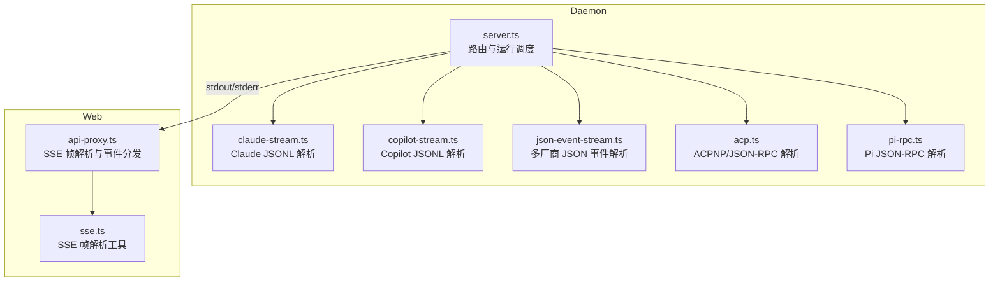
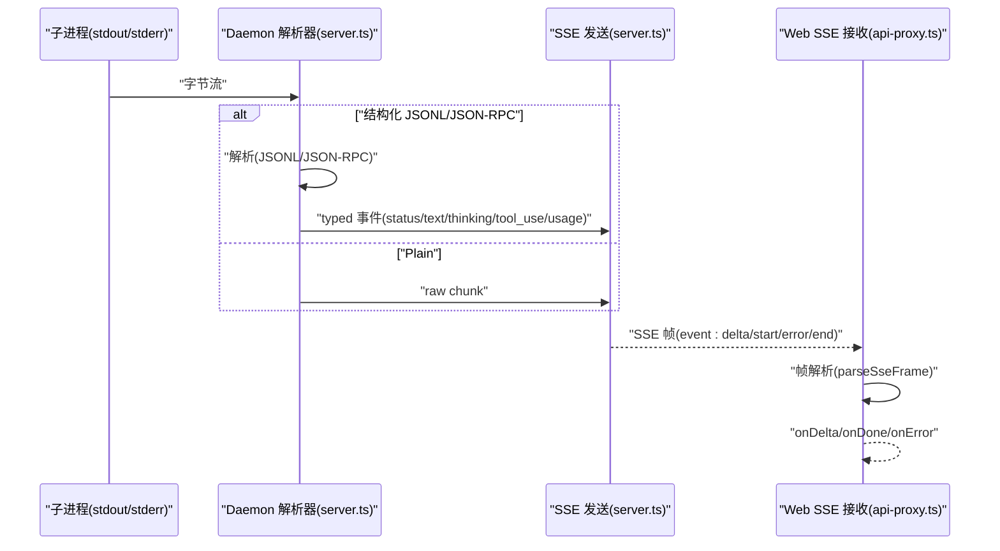
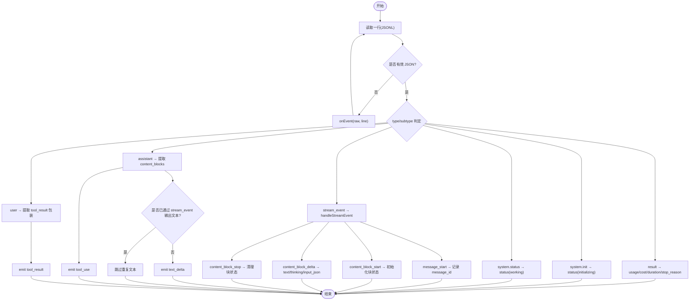
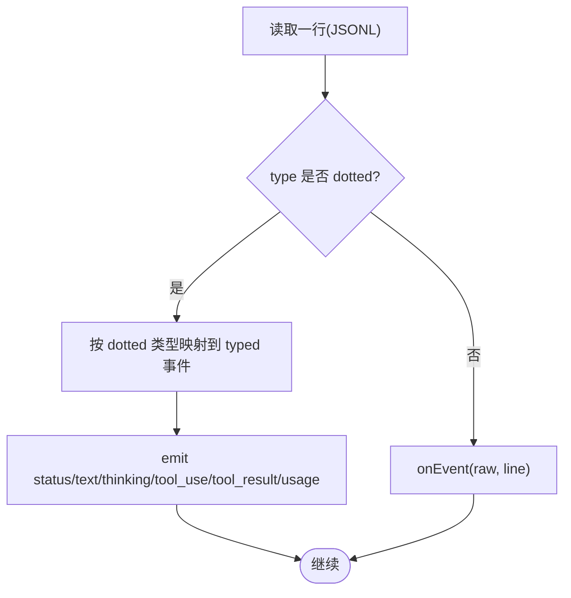
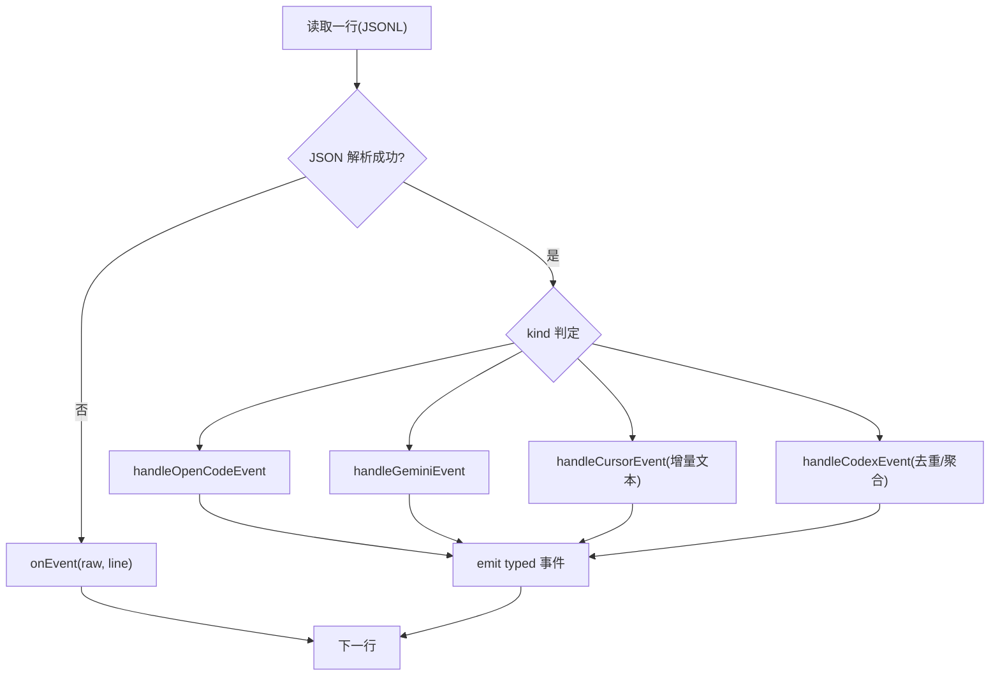
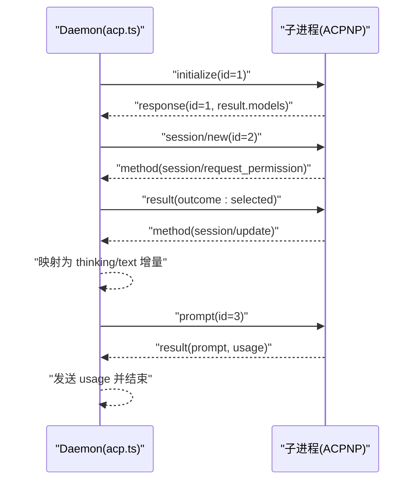
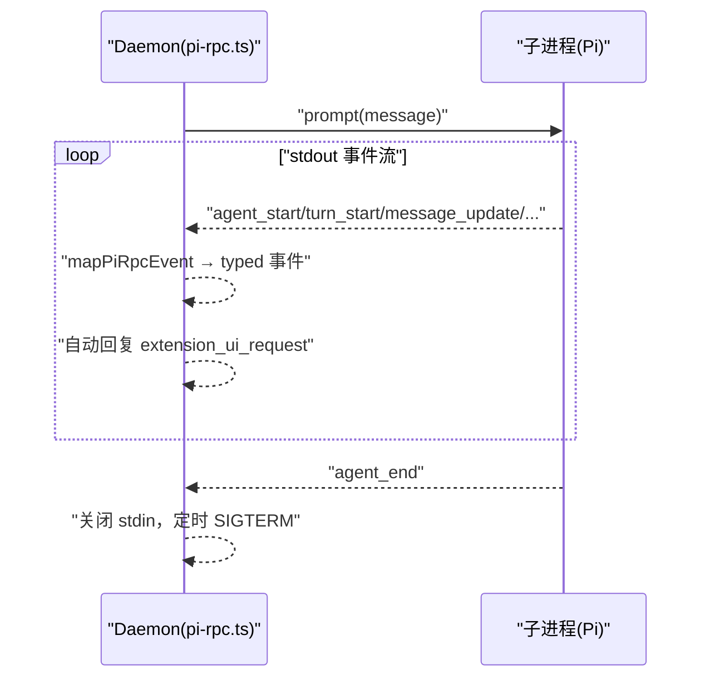
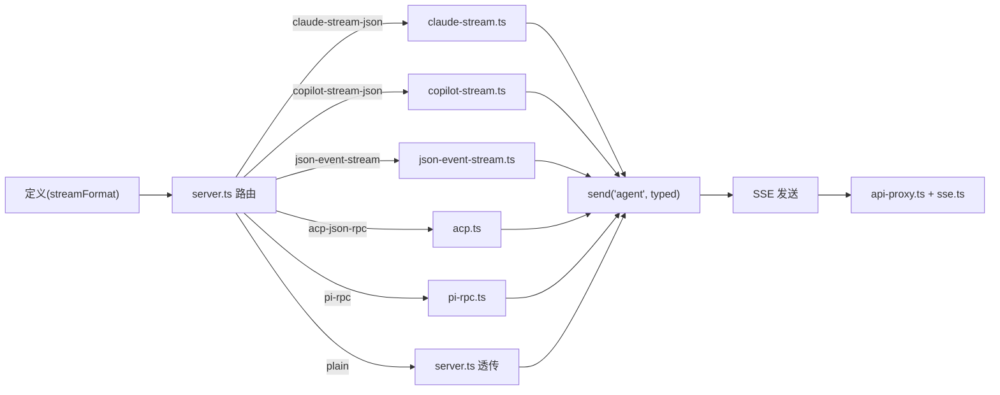

# 流式协议格式

<cite>
**本文引用的文件**
- [apps/daemon/src/claude-stream.ts](file://apps/daemon/src/claude-stream.ts)
- [apps/daemon/src/copilot-stream.ts](file://apps/daemon/src/copilot-stream.ts)
- [apps/daemon/src/json-event-stream.ts](file://apps/daemon/src/json-event-stream.ts)
- [apps/daemon/src/acp.ts](file://apps/daemon/src/acp.ts)
- [apps/daemon/src/pi-rpc.ts](file://apps/daemon/src/pi-rpc.ts)
- [apps/daemon/src/server.ts](file://apps/daemon/src/server.ts)
- [apps/web/src/providers/api-proxy.ts](file://apps/web/src/providers/api-proxy.ts)
- [apps/web/src/providers/sse.ts](file://apps/web/src/providers/sse.ts)
- [packages/contracts/src/sse/proxy.ts](file://packages/contracts/src/sse/proxy.ts)
</cite>

## 目录
1. [简介](#简介)
2. [项目结构](#项目结构)
3. [核心组件](#核心组件)
4. [架构总览](#架构总览)
5. [详细组件分析](#详细组件分析)
6. [依赖关系分析](#依赖关系分析)
7. [性能考量](#性能考量)
8. [故障排查指南](#故障排查指南)
9. [结论](#结论)
10. [附录](#附录)

## 简介
本文件面向 Open Design 的“流式协议格式系统”，系统性梳理并解释 13 种不同流式协议格式的解析机制与实现细节，覆盖以下关键点：
- 五类结构化 JSONL/JSON-RPC 协议：claude-stream-json、copilot-stream-json、json-event-stream、acp-json-rpc、pi-rpc
- 两类通用转发协议：acp-json-line（用于模型检测）、plain（原始字节透传）
- typed events 的统一转换：text、thinking、tool_use、tool_result、status、usage 等
- 完整性保障：缓冲区拆分、行边界识别、尾部残留处理
- 错误处理：非 JSON 行、RPC 错误、超时、致命错误标记
- 性能优化：最小化字符串拼接、按需状态位、延迟一次性事件

## 项目结构
围绕流式协议的核心代码主要位于 daemon 的协议解析模块与 web 的 SSE 解析模块之间形成闭环：
- daemon 端负责子进程输出的协议解析与 typed 事件发射
- web 端负责 SSE 帧解析与前端渲染

图表来源
- [apps/daemon/src/server.ts:3819-3856](file://apps/daemon/src/server.ts#L3819-L3856)
- [apps/daemon/src/claude-stream.ts:23-208](file://apps/daemon/src/claude-stream.ts#L23-L208)
- [apps/daemon/src/copilot-stream.ts:25-122](file://apps/daemon/src/copilot-stream.ts#L25-L122)
- [apps/daemon/src/json-event-stream.ts:287-331](file://apps/daemon/src/json-event-stream.ts#L287-L331)
- [apps/daemon/src/acp.ts:80-108](file://apps/daemon/src/acp.ts#L80-L108)
- [apps/daemon/src/pi-rpc.ts:20-297](file://apps/daemon/src/pi-rpc.ts#L20-L297)
- [apps/web/src/providers/api-proxy.ts:47-96](file://apps/web/src/providers/api-proxy.ts#L47-L96)
- [apps/web/src/providers/sse.ts:6-38](file://apps/web/src/providers/sse.ts#L6-L38)

章节来源
- [apps/daemon/src/server.ts:3819-3856](file://apps/daemon/src/server.ts#L3819-L3856)

## 核心组件
- 结构化 JSONL 解析器
  - Claude JSONL：支持 stream_event/content_block_* 与 assistant/user/result 的混合模式，兼容旧版仅在最终块中输出文本的场景
  - Copilot JSONL：将 dotted 类型映射到统一 typed 事件
  - JSON Event Stream：多厂商适配器，支持 opencode、gemini、cursor-agent、codex 等
- JSON-RPC 解析器
  - ACP JSON-RPC：会话生命周期管理、权限请求自动回复、思考/消息增量事件映射
  - Pi RPC：将 agent 事件映射为 typed 事件，自动处理扩展 UI 请求
- 通用转发
  - ACP JSON Line：用于模型探测的纯 JSON 行流
  - Plain：直接透传 stdout 字节块，不做任何解析

章节来源
- [apps/daemon/src/claude-stream.ts:23-208](file://apps/daemon/src/claude-stream.ts#L23-L208)
- [apps/daemon/src/copilot-stream.ts:25-122](file://apps/daemon/src/copilot-stream.ts#L25-L122)
- [apps/daemon/src/json-event-stream.ts:287-331](file://apps/daemon/src/json-event-stream.ts#L287-L331)
- [apps/daemon/src/acp.ts:80-108](file://apps/daemon/src/acp.ts#L80-L108)
- [apps/daemon/src/acp.ts:211-423](file://apps/daemon/src/acp.ts#L211-L423)
- [apps/daemon/src/pi-rpc.ts:20-297](file://apps/daemon/src/pi-rpc.ts#L20-L297)
- [apps/daemon/src/server.ts:3819-3856](file://apps/daemon/src/server.ts#L3819-L3856)

## 架构总览
下图展示从子进程到浏览器的关键数据通路与事件映射：

图表来源
- [apps/daemon/src/server.ts:3819-3856](file://apps/daemon/src/server.ts#L3819-L3856)
- [apps/web/src/providers/api-proxy.ts:47-96](file://apps/web/src/providers/api-proxy.ts#L47-L96)
- [apps/web/src/providers/sse.ts:6-38](file://apps/web/src/providers/sse.ts#L6-L38)

## 详细组件分析

### Claude 流式协议（claude-stream-json）
- 数据源：Claude Code 的 JSONL 输出，支持 verbose 模式与可选 partial messages
- 关键特性
  - 支持 stream_event 事件与 content_block_* 生命周期
  - 兼容旧版仅在 assistant 最终块输出文本的模式，避免重复
  - 聚合 tool_use 输入 JSON，等待 content_block_stop 后一次性发出 tool_use
  - 将 user/tool_result 包装为 tool_result typed 事件
  - 在 result 中输出 usage/cost/duration/stop_reason
- typed 事件映射
  - status: initializing/streaming/working
  - text_delta/thinking_delta
  - tool_use(tool id/name/input)
  - tool_result(tool_use_id/content/is_error)
  - usage(usage/cost/duration/stop_reason)

图表来源
- [apps/daemon/src/claude-stream.ts:43-205](file://apps/daemon/src/claude-stream.ts#L43-L205)

章节来源
- [apps/daemon/src/claude-stream.ts:23-208](file://apps/daemon/src/claude-stream.ts#L23-L208)

### Copilot 流式协议（copilot-stream-json）
- 数据源：GitHub Copilot CLI 的 JSONL 输出，使用 dotted 类型
- 映射规则
  - session.tools_updated → status(initializing, model)
  - assistant.turn_start → status(streaming)
  - assistant.reasoning_delta → thinking_delta
  - assistant.message_delta → text_delta
  - tool.execution_start → tool_use
  - tool.execution_complete → tool_result
  - result → usage；根据 success/exitCode 推断 stop_reason

图表来源
- [apps/daemon/src/copilot-stream.ts:25-122](file://apps/daemon/src/copilot-stream.ts#L25-L122)

章节来源
- [apps/daemon/src/copilot-stream.ts:25-122](file://apps/daemon/src/copilot-stream.ts#L25-L122)

### JSON 事件流（json-event-stream）
- 数据源：多厂商 JSON 事件流（opencode、gemini、cursor-agent、codex）
- 处理策略
  - 统一按行解析，逐条尝试 JSON 解析
  - 针对不同 kind 调用专用处理器
  - 对 Cursor 文本采用游标增量差分，避免重复
  - 对 Codex Bash 工具调用进行去重与聚合

图表来源
- [apps/daemon/src/json-event-stream.ts:287-331](file://apps/daemon/src/json-event-stream.ts#L287-L331)
- [apps/daemon/src/json-event-stream.ts:36-95](file://apps/daemon/src/json-event-stream.ts#L36-L95)
- [apps/daemon/src/json-event-stream.ts:97-133](file://apps/daemon/src/json-event-stream.ts#L97-L133)
- [apps/daemon/src/json-event-stream.ts:162-204](file://apps/daemon/src/json-event-stream.ts#L162-L204)
- [apps/daemon/src/json-event-stream.ts:206-285](file://apps/daemon/src/json-event-stream.ts#L206-L285)

章节来源
- [apps/daemon/src/json-event-stream.ts:287-331](file://apps/daemon/src/json-event-stream.ts#L287-L331)

### ACP JSON-RPC（acp-json-rpc）
- 数据源：ACPNP/JSON-RPC 子进程，标准 JSON-RPC over stdio
- 关键流程
  - initialize → session/new → session/set_model（可选）
  - 权限请求自动回复（选择最佳选项）
  - session/update 中的 agent_thought_chunk 与 agent_message_chunk 映射为 thinking/text 增量
  - prompt 响应携带 usage，结束会话
- 错误与超时
  - RPC 错误消息提取与 fail
  - 分阶段超时计时器（initialize/session/new/prompt 等）

图表来源
- [apps/daemon/src/acp.ts:211-423](file://apps/daemon/src/acp.ts#L211-L423)
- [apps/daemon/src/acp.ts:295-335](file://apps/daemon/src/acp.ts#L295-L335)

章节来源
- [apps/daemon/src/acp.ts:211-423](file://apps/daemon/src/acp.ts#L211-L423)

### Pi RPC（pi-rpc）
- 数据源：Pi 的 JSON-RPC over stdio
- 关键流程
  - 自动处理扩展 UI 请求（自动确认/选择首个选项/忽略 fire-and-forget）
  - 将 agent_start/turn_start/message_update/tool_execution_start/end 等事件映射为 typed 事件
  - 在 agent_end 后优雅关闭 stdin 并在超时后强制终止
- usage 格式化
  - 统一 input/output/cache/thought/total 字段

图表来源
- [apps/daemon/src/pi-rpc.ts:210-297](file://apps/daemon/src/pi-rpc.ts#L210-L297)
- [apps/daemon/src/pi-rpc.ts:80-197](file://apps/daemon/src/pi-rpc.ts#L80-L197)

章节来源
- [apps/daemon/src/pi-rpc.ts:210-297](file://apps/daemon/src/pi-rpc.ts#L210-L297)

### ACP JSON Line（acp-json-line）
- 数据源：用于模型探测的纯 JSON 行流
- 特点：按行解析，忽略非 JSON 行，便于后续 RPC 协商

章节来源
- [apps/daemon/src/acp.ts:80-108](file://apps/daemon/src/acp.ts#L80-L108)

### Plain（原始透传）
- 数据源：除上述结构化协议外的其他 CLI
- 特点：不做任何解析，直接以 stdout 事件透传字节块

章节来源
- [apps/daemon/src/server.ts:3854-3856](file://apps/daemon/src/server.ts#L3854-L3856)

## 依赖关系分析
- 协议选择与路由
  - server.ts 根据定义的 streamFormat 决定使用哪一类解析器或透传
- typed 事件统一
  - 所有解析器最终向 send('agent', ...) 发射统一的 typed 事件集合
- Web 端消费
  - api-proxy.ts 使用 sse.ts 的帧解析工具，将 SSE 事件映射为 onDelta/onDone/onError

图表来源
- [apps/daemon/src/server.ts:3819-3856](file://apps/daemon/src/server.ts#L3819-L3856)
- [apps/web/src/providers/api-proxy.ts:47-96](file://apps/web/src/providers/api-proxy.ts#L47-L96)
- [apps/web/src/providers/sse.ts:6-38](file://apps/web/src/providers/sse.ts#L6-L38)

章节来源
- [apps/daemon/src/server.ts:3819-3856](file://apps/daemon/src/server.ts#L3819-L3856)

## 性能考量
- 缓冲与拆分
  - 使用行分隔符逐行解析，避免大块字符串处理
  - flush 时处理尾部残留，确保最后一行被正确解析
- 状态最小化
  - Claude：基于 message_id + block index 的块状态表，及时清理
  - JSON Event Stream：游标增量文本只记录前缀差异
  - Pi/ACPNP：使用阶段计时器与首次 token 标记，减少重复状态发射
- 字符串处理
  - 工具函数 safeParseJson/stringifyContent/formatUsage 等，尽量避免异常分支中的昂贵操作
- I/O 与阻塞
  - 透传模式下避免额外解析开销
  - RPC 模式下严格区分响应与事件，避免阻塞

## 故障排查指南
- 非 JSON 行
  - 触发 onEvent({ type: 'raw', line })，便于日志与调试
- RPC 错误
  - 从 raw.error 中提取 message 或 code，构造带 id 的错误信息
- 超时
  - ACP/PI 均设置阶段超时与总超时，超时后 fail 并终止子进程
- 会话结束判定
  - ACP：hasFatalError() 返回 true 时，运行状态标记为 failed
  - Pi：agent_end 后优雅关闭 stdin，再按配置延时强制终止
- Web 端解析
  - api-proxy.ts 通过 parseSseFrame 解析帧，遇到 error 事件触发 onError，end 事件触发 onDone

章节来源
- [apps/daemon/src/acp.ts:246-253](file://apps/daemon/src/acp.ts#L246-L253)
- [apps/daemon/src/acp.ts:396-401](file://apps/daemon/src/acp.ts#L396-L401)
- [apps/daemon/src/pi-rpc.ts:264-280](file://apps/daemon/src/pi-rpc.ts#L264-L280)
- [apps/web/src/providers/api-proxy.ts:47-96](file://apps/web/src/providers/api-proxy.ts#L47-L96)
- [apps/web/src/providers/sse.ts:6-38](file://apps/web/src/providers/sse.ts#L6-L38)

## 结论
该流式协议格式系统通过“结构化解析 + 统一 typed 事件”的设计，实现了对多厂商、多模式输出的解耦与兼容。其关键优势在于：
- 事件抽象统一：text/thinking/tool_use/tool_result/status/usage
- 完整性保障：行边界识别、块状态跟踪、游标增量差分
- 错误与超时：清晰的错误消息与阶段化超时控制
- 性能友好：最小化字符串处理与状态维护，透传模式零解析成本

## 附录
- typed 事件清单
  - status: initializing/working/streaming/thinking/compacting/retrying/model
  - text_delta/thinking_delta
  - thinking_start/thinking_end
  - tool_use(id,name,input)
  - tool_result(toolUseId,content,isError)
  - usage(input_tokens,output_tokens,cached_read_tokens,thought_tokens,total_tokens,costUsd,durationMs,stopReason)
- 协议选择
  - claude-stream-json/copilot-stream-json/json-event-stream/acp-json-rpc/pi-rpc/plain
- 协议版本与常量
  - PROXY_SSE_PROTOCOL_VERSION = 1（代理 SSE 协议版本）