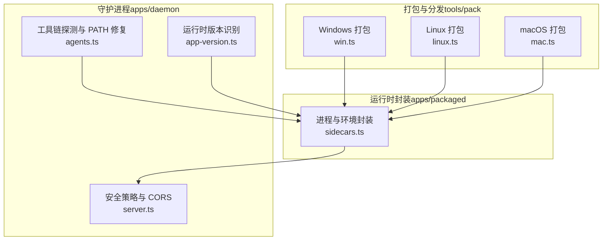
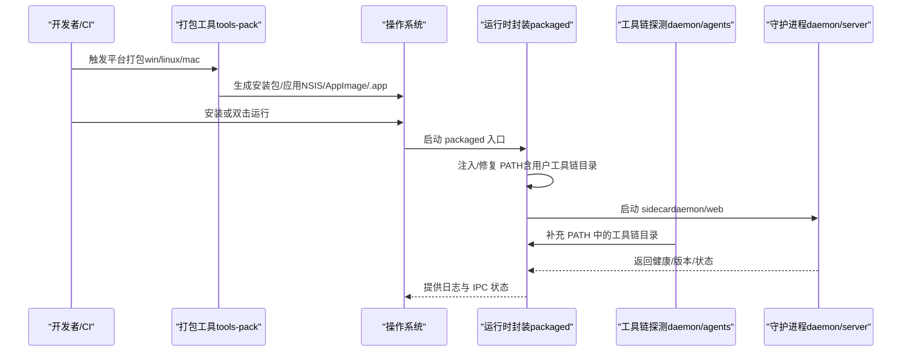
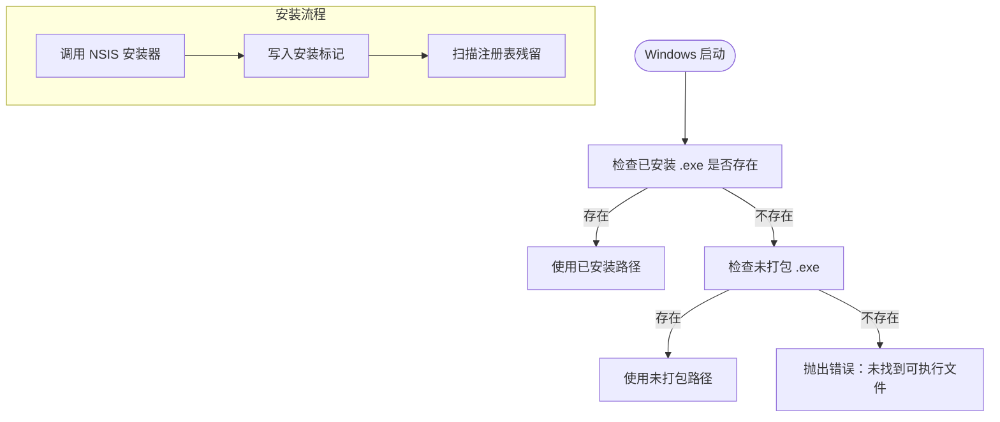
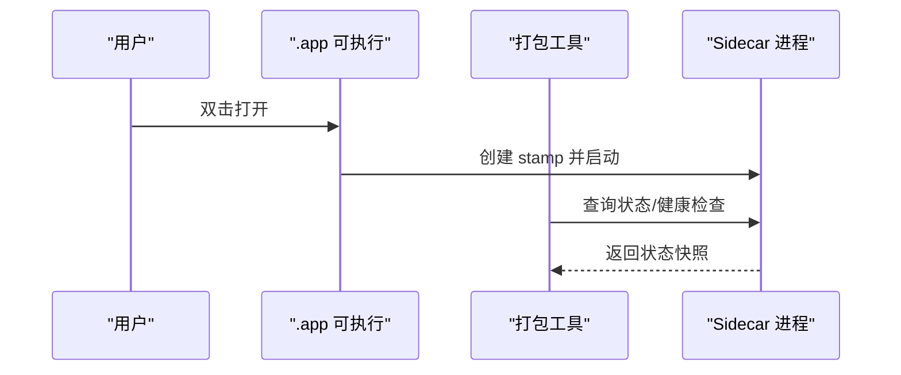
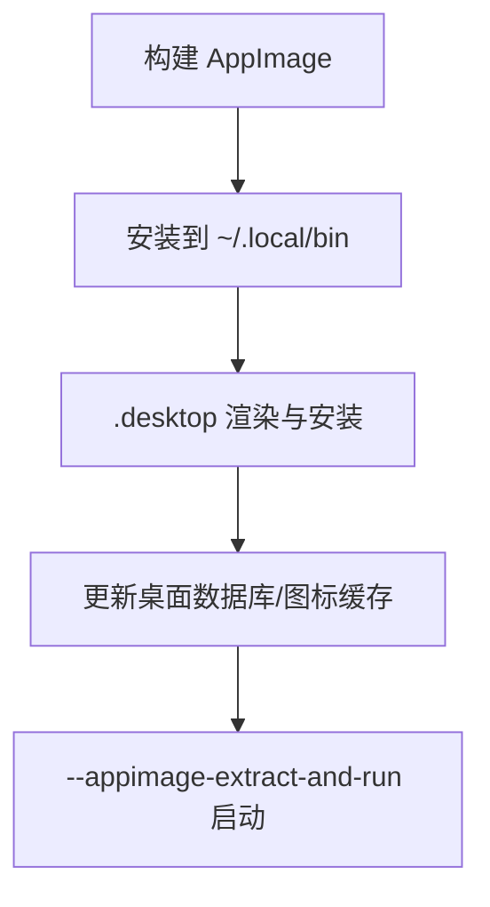
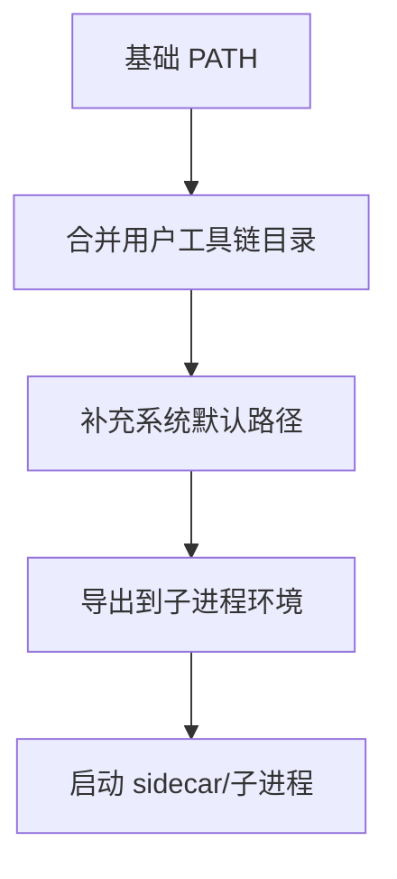
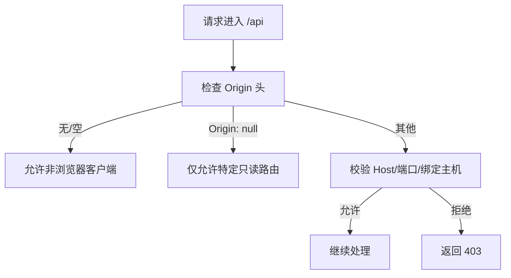
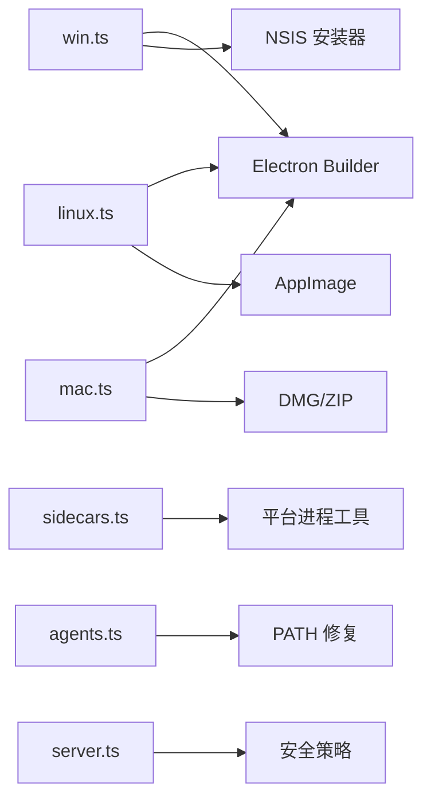

# 跨平台兼容性

<cite>
**本文引用的文件**
- [win.ts](file://tools/pack/src/win.ts)
- [linux.ts](file://tools/pack/src/linux.ts)
- [mac.ts](file://tools/pack/src/mac.ts)
- [app-version.ts](file://apps/daemon/src/app-version.ts)
- [sidecars.ts](file://apps/packaged/src/sidecars.ts)
- [agents.ts](file://apps/daemon/src/agents.ts)
- [server.ts](file://apps/daemon/src/server.ts)
</cite>

## 目录
1. [简介](#简介)
2. [项目结构](#项目结构)
3. [核心组件](#核心组件)
4. [架构总览](#架构总览)
5. [详细组件分析](#详细组件分析)
6. [依赖关系分析](#依赖关系分析)
7. [性能考量](#性能考量)
8. [故障排查指南](#故障排查指南)
9. [结论](#结论)
10. [附录](#附录)

## 简介
本文件系统化梳理 Open Design 在 Windows、macOS、Linux 三大平台上的跨平台兼容性设计与实现，重点覆盖以下方面：
- 可执行文件扩展名与入口差异（Windows .exe、macOS .app、Linux AppImage）
- PATH 环境变量在 GUI 启动场景下的修复与工具链目录发现
- 平台特定的安装与快捷方式（Windows 桌面/开始菜单、macOS Applications、Linux .desktop）
- 安全策略与沙箱限制（Origin 校验、CORS、Host 头校验）
- 打包与运行时的平台差异（资源树、图标、构建目标）

## 项目结构
围绕跨平台兼容性的关键模块分布如下：
- 打包与分发层（tools/pack）：按平台生成安装包、AppImage、DMG/ZIP，并负责安装后残留清理与状态查询
- 运行时封装层（apps/packaged）：统一注入 PATH、管理子进程、解析用户工具链
- 守护进程与服务（apps/daemon）：提供安全策略、版本识别、服务端口与 CORS 控制
- 工具链探测（apps/daemon/src/agents.ts）：在 GUI 启动器 PATH 较弱的情况下，补充用户级工具链目录

图示来源
- [win.ts:239-273](file://tools/pack/src/win.ts#L239-L273)
- [linux.ts:209-236](file://tools/pack/src/linux.ts#L209-L236)
- [mac.ts:168-199](file://tools/pack/src/mac.ts#L168-L199)
- [sidecars.ts:121-139](file://apps/packaged/src/sidecars.ts#L121-L139)
- [agents.ts:627-686](file://apps/daemon/src/agents.ts#L627-L686)
- [server.ts:780-827](file://apps/daemon/src/server.ts#L780-L827)
- [app-version.ts:41-62](file://apps/daemon/src/app-version.ts#L41-L62)

章节来源
- [win.ts:239-273](file://tools/pack/src/win.ts#L239-L273)
- [linux.ts:209-236](file://tools/pack/src/linux.ts#L209-L236)
- [mac.ts:168-199](file://tools/pack/src/mac.ts#L168-L199)
- [sidecars.ts:121-139](file://apps/packaged/src/sidecars.ts#L121-L139)
- [agents.ts:627-686](file://apps/daemon/src/agents.ts#L627-L686)
- [server.ts:780-827](file://apps/daemon/src/server.ts#L780-L827)
- [app-version.ts:41-62](file://apps/daemon/src/app-version.ts#L41-L62)

## 核心组件
- 平台打包与安装
  - Windows：NSIS 安装器、注册表项扫描、桌面/开始菜单快捷方式、卸载残留清理
  - macOS：.app 构建、DMG/ZIP 输出、公证与隔离属性处理
  - Linux：AppImage 构建、~/.local 安装、.desktop 文件渲染与 post-install 更新
- 运行时环境与工具链
  - 统一注入 PATH，合并用户工具链目录（含 nvm/fnm/mise 等）
  - 子进程以受控环境启动，确保 Electron 或 Node 运行一致性
- 安全策略
  - Origin/Host 校验、CORS 策略、仅允许沙箱只读路由放行 Origin: null
  - 版本识别与打包态判定，避免误判运行环境

章节来源
- [win.ts:521-562](file://tools/pack/src/win.ts#L521-L562)
- [linux.ts:561-605](file://tools/pack/src/linux.ts#L561-L605)
- [mac.ts:375-453](file://tools/pack/src/mac.ts#L375-L453)
- [sidecars.ts:121-139](file://apps/packaged/src/sidecars.ts#L121-L139)
- [agents.ts:627-686](file://apps/daemon/src/agents.ts#L627-L686)
- [server.ts:780-827](file://apps/daemon/src/server.ts#L780-L827)
- [app-version.ts:41-62](file://apps/daemon/src/app-version.ts#L41-L62)

## 架构总览
下图展示跨平台启动与运行的关键流程：打包阶段生成各平台产物，运行阶段通过 packaged 注入 PATH 并修复 GUI 启动器的 PATH，守护进程提供安全策略与版本信息。

图示来源
- [win.ts:724-795](file://tools/pack/src/win.ts#L724-L795)
- [linux.ts:427-443](file://tools/pack/src/linux.ts#L427-L443)
- [mac.ts:375-453](file://tools/pack/src/mac.ts#L375-L453)
- [sidecars.ts:121-139](file://apps/packaged/src/sidecars.ts#L121-L139)
- [agents.ts:627-686](file://apps/daemon/src/agents.ts#L627-L686)
- [server.ts:780-827](file://apps/daemon/src/server.ts#L780-L827)

## 详细组件分析

### Windows 平台兼容性
- 可执行文件与入口
  - 使用 .exe 可执行文件，支持已安装与未打包两种启动目标检测
- 安装与快捷方式
  - 支持桌面/开始菜单快捷方式创建；卸载时可选择是否移除本地数据
  - 注册表项扫描用于残留检测与清理
- 安装器语言与本地化
  - 内置多语言安装器支持与 Persian 别名补丁
- 安全与诊断
  - 安装/卸载日志记录，时间戳与错误元数据便于排障

图示来源
- [win.ts:963-968](file://tools/pack/src/win.ts#L963-L968)
- [win.ts:927-960](file://tools/pack/src/win.ts#L927-L960)
- [win.ts:521-562](file://tools/pack/src/win.ts#L521-L562)

章节来源
- [win.ts:239-273](file://tools/pack/src/win.ts#L239-L273)
- [win.ts:521-562](file://tools/pack/src/win.ts#L521-L562)
- [win.ts:927-960](file://tools/pack/src/win.ts#L927-L960)
- [win.ts:963-968](file://tools/pack/src/win.ts#L963-L968)

### macOS 平台兼容性
- 应用包结构
  - .app 包含 Contents/MacOS 下的可执行文件，支持安装到用户或系统 Applications
- 构建与输出
  - 支持 dir/dmg/zip 输出；DMG/ZIP 产物可进行签名与公证配置
- 隔离与属性
  - 清理 com.apple.quarantine 属性，便于本地未签名应用直接运行
- 运行时状态
  - 通过 sidecar IPC 获取状态，支持标记文件与进程匹配校验

图示来源
- [mac.ts:168-199](file://tools/pack/src/mac.ts#L168-L199)
- [mac.ts:771-794](file://tools/pack/src/mac.ts#L771-L794)
- [mac.ts:758-769](file://tools/pack/src/mac.ts#L758-L769)

章节来源
- [mac.ts:168-199](file://tools/pack/src/mac.ts#L168-L199)
- [mac.ts:375-453](file://tools/pack/src/mac.ts#L375-L453)
- [mac.ts:515-545](file://tools/pack/src/mac.ts#L515-L545)
- [mac.ts:758-769](file://tools/pack/src/mac.ts#L758-L769)

### Linux 平台兼容性
- AppImage 与 .desktop
  - 生成 AppImage 并安装到 ~/.local/bin；渲染 .desktop 文件并更新桌面数据库与图标缓存
- PATH 修复与工具链发现
  - 运行时注入 PATH，包含用户级工具链目录（含 nvm/fnm/mise 等）
- 容器化构建
  - 支持 Docker 容器内构建，挂载缓存目录与工作区

图示来源
- [linux.ts:561-605](file://tools/pack/src/linux.ts#L561-L605)
- [linux.ts:761-800](file://tools/pack/src/linux.ts#L761-L800)
- [linux.ts:498-538](file://tools/pack/src/linux.ts#L498-L538)

章节来源
- [linux.ts:209-236](file://tools/pack/src/linux.ts#L209-L236)
- [linux.ts:561-605](file://tools/pack/src/linux.ts#L561-L605)
- [linux.ts:761-800](file://tools/pack/src/linux.ts#L761-L800)
- [linux.ts:498-538](file://tools/pack/src/linux.ts#L498-L538)

### PATH 修复与工具链目录发现
- packaged 运行时
  - 统一注入 PATH，合并用户级工具链目录（如 ~/.local/bin、~/.cargo/bin、~/.bun/bin、~/.volta/bin、nvm/fnm/mise 等），并补充系统默认路径
- GUI 启动器场景
  - macOS/Linux 的 GUI 启动器常携带较弱的 PATH，daemon 的 agents 模块会额外探测用户工具链目录，保证工具可用性
- Windows 扩展名解析
  - 基于 PATHEXT 解析可执行扩展名，提升在 GUI 场景下的可执行查找成功率

图示来源
- [sidecars.ts:121-139](file://apps/packaged/src/sidecars.ts#L121-L139)
- [agents.ts:627-686](file://apps/daemon/src/agents.ts#L627-L686)

章节来源
- [sidecars.ts:121-139](file://apps/packaged/src/sidecars.ts#L121-L139)
- [agents.ts:627-686](file://apps/daemon/src/agents.ts#L627-L686)

### 安全策略与沙箱限制
- CORS 与 Origin 校验
  - 对 /api 路由仅允许同源或白名单浏览器来源；Origin: null 的沙箱 iframe 仅允许特定只读路由
- Host 头校验与 DNS 重绑定防护
  - 严格校验 Host 头，拒绝未知主机，结合允许的端口集合（含 OD_WEB_PORT）与绑定主机策略
- 版本识别与打包态
  - 通过可执行路径与资源路径判断是否打包运行，区分 development/stable 渠道

图示来源
- [server.ts:780-827](file://apps/daemon/src/server.ts#L780-L827)
- [server.ts:4556-4571](file://apps/daemon/src/server.ts#L4556-L4571)
- [app-version.ts:41-62](file://apps/daemon/src/app-version.ts#L41-L62)

章节来源
- [server.ts:780-827](file://apps/daemon/src/server.ts#L780-L827)
- [server.ts:4556-4571](file://apps/daemon/src/server.ts#L4556-L4571)
- [app-version.ts:41-62](file://apps/daemon/src/app-version.ts#L41-L62)

## 依赖关系分析
- 平台打包工具依赖 Electron Builder 与平台特定的构建目标（NSIS、AppImage、DMG/ZIP）
- 运行时封装依赖 sidecar 协议与平台进程工具，统一注入 PATH 与环境变量
- 守护进程的安全策略与版本识别独立于打包层，但与运行时环境强相关

图示来源
- [win.ts:724-795](file://tools/pack/src/win.ts#L724-L795)
- [linux.ts:427-443](file://tools/pack/src/linux.ts#L427-L443)
- [mac.ts:375-453](file://tools/pack/src/mac.ts#L375-L453)
- [sidecars.ts:121-139](file://apps/packaged/src/sidecars.ts#L121-L139)
- [agents.ts:627-686](file://apps/daemon/src/agents.ts#L627-L686)
- [server.ts:780-827](file://apps/daemon/src/server.ts#L780-L827)

章节来源
- [win.ts:724-795](file://tools/pack/src/win.ts#L724-L795)
- [linux.ts:427-443](file://tools/pack/src/linux.ts#L427-L443)
- [mac.ts:375-453](file://tools/pack/src/mac.ts#L375-L453)
- [sidecars.ts:121-139](file://apps/packaged/src/sidecars.ts#L121-L139)
- [agents.ts:627-686](file://apps/daemon/src/agents.ts#L627-L686)
- [server.ts:780-827](file://apps/daemon/src/server.ts#L780-L827)

## 性能考量
- AppImage 启动优化
  - Linux 默认采用 --appimage-extract-and-run 以规避 FUSE 挂载的性能瓶颈，缩短首次启动等待
- 打包体积与压缩
  - 各平台构建均启用最大压缩，平衡体积与传输效率
- 进程与 IPC
  - 通过 sidecar IPC 快速获取状态，减少轮询开销

章节来源
- [linux.ts:783-786](file://tools/pack/src/linux.ts#L783-L786)
- [win.ts:724-795](file://tools/pack/src/win.ts#L724-L795)
- [mac.ts:375-453](file://tools/pack/src/mac.ts#L375-L453)

## 故障排查指南
- Windows
  - 未找到可执行文件：确认已先执行 build，再执行 install 或检查已安装路径
  - 安装失败：查看 NSIS 日志与退出码，定位安装器阶段错误
  - 卸载残留：利用注册表扫描结果与残留清理计划核对
- macOS
  - 未签名应用被系统隔离：确认已清理 com.apple.quarantine 属性
  - .app 无法启动：检查 Contents/MacOS 下可执行路径是否存在
- Linux
  - AppImage 无法启动：确认已赋予可执行权限并使用 --appimage-extract-and-run
  - .desktop 不显示：检查 update-desktop-database 与 gtk-update-icon-cache 的执行结果
- 安全策略
  - CORS/Origin 失败：确认请求来源在允许列表中，且 Host 头合法
  - 403 服务器初始化中：等待端口解析完成后再发起请求

章节来源
- [win.ts:963-968](file://tools/pack/src/win.ts#L963-L968)
- [win.ts:894-909](file://tools/pack/src/win.ts#L894-L909)
- [mac.ts:455-461](file://tools/pack/src/mac.ts#L455-L461)
- [linux.ts:551-605](file://tools/pack/src/linux.ts#L551-L605)
- [server.ts:780-827](file://apps/daemon/src/server.ts#L780-L827)

## 结论
Open Design 在三大平台实现了统一的打包与运行体验：通过平台特定的构建目标与安装流程，配合运行时对 PATH 的修复与工具链目录发现，确保 GUI 启动器场景下的可用性；同时以严格的 Origin/Host/CORS 策略保障安全边界。该设计既满足了开发与分发的工程化需求，也兼顾了最终用户的使用体验与安全性。

## 附录
- 最佳实践
  - 打包前统一构建内部包，确保 tarball 与资源树一致
  - Linux 安装后执行桌面数据库与图标缓存更新命令
  - Windows 安装前准备 NSIS 语言包与本地化资源
  - macOS 未签名构建时清理隔离属性，避免启动失败
- 常见问题
  - GUI 启动找不到工具：检查 agents 的工具链目录与 sidecars 的 PATH 注入
  - 跨域请求失败：确认 Origin/Host 符合白名单策略
  - 版本识别异常：检查 isPackagedRuntime 的判定逻辑与资源路径