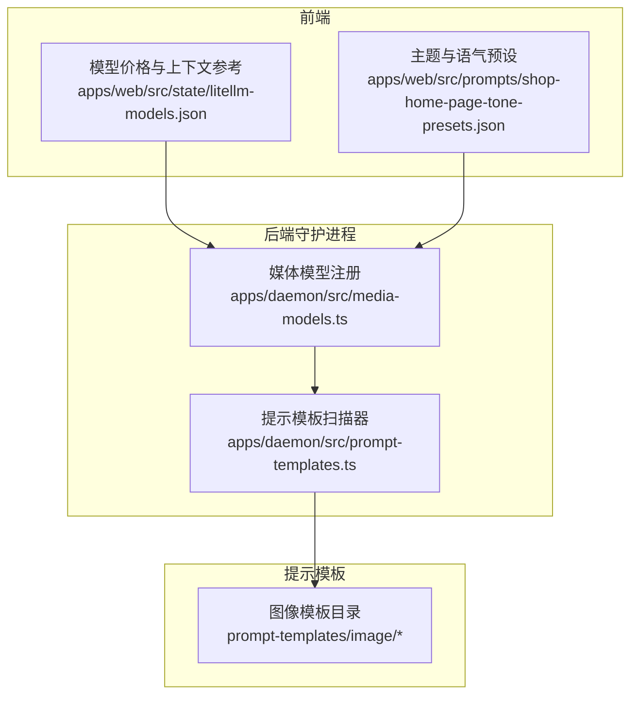
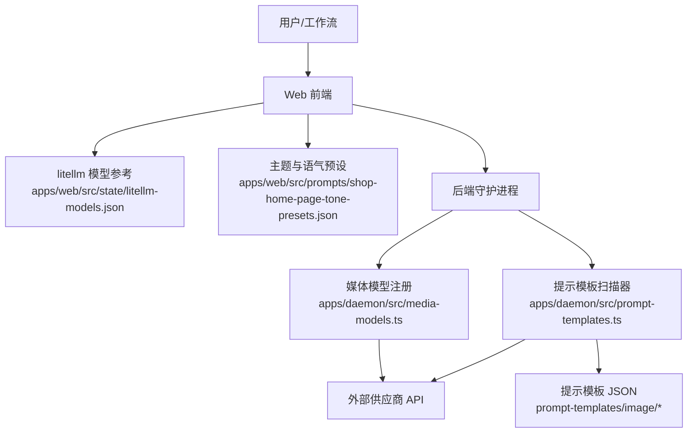
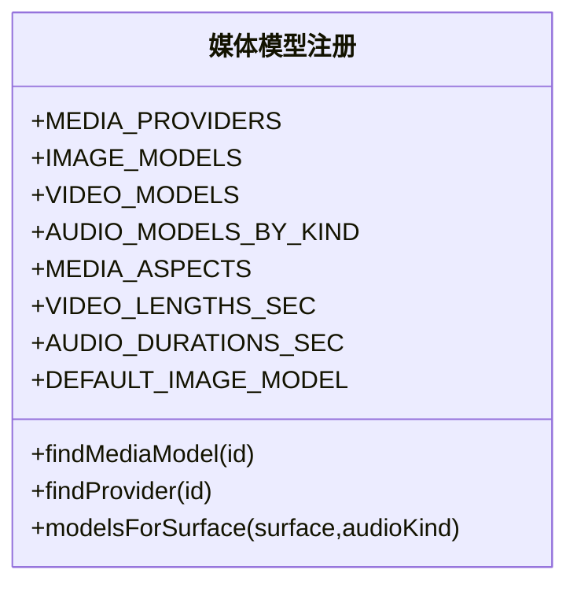
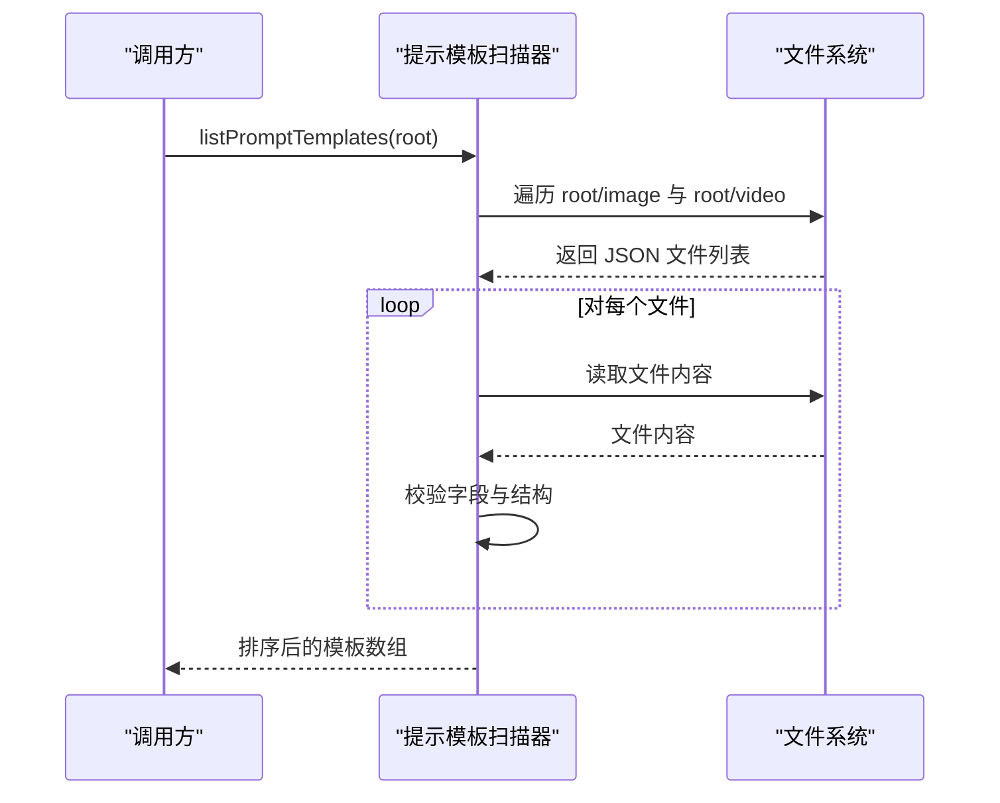

# 图像生成系统

<cite>
**本文引用的文件**
- [apps/daemon/src/media-models.ts](file://apps/daemon/src/media-models.ts)
- [apps/daemon/src/prompt-templates.ts](file://apps/daemon/src/prompt-templates.ts)
- [apps/web/src/state/litellm-models.json](file://apps/web/src/state/litellm-models.json)
- [apps/web/src/prompts/shop-home-page-tone-presets.json](file://apps/web/src/prompts/shop-home-page-tone-presets.json)
- [prompt-templates/image/profile-avatar-anime-girl-to-cinematic-photo.json](file://prompt-templates/image/profile-avatar-anime-girl-to-cinematic-photo.json)
- [prompt-templates/image/social-media-post-anime-pokemon-shop-outfit-teaser-poster.json](file://prompt-templates/image/social-media-post-anime-pokemon-shop-outfit-teaser-poster.json)
- [prompt-templates/image/infographic-otaku-dance-choreography-breakdown-gokurakujodo-16-panels.json](file://prompt-templates/image/infographic-otaku-dance-choreography-breakdown-gokurakujodo-16-panels.json)
</cite>

## 目录
1. [简介](#简介)
2. [项目结构](#项目结构)
3. [核心组件](#核心组件)
4. [架构总览](#架构总览)
5. [详细组件分析](#详细组件分析)
6. [依赖关系分析](#依赖关系分析)
7. [性能考量](#性能考量)
8. [故障排查指南](#故障排查指南)
9. [结论](#结论)
10. [附录](#附录)

## 简介
本项目是一个面向设计与内容生产的多模态媒体生成平台，覆盖图像（t2i/i2i/inpaint）、视频（t2v/i2v）与音频（音乐/语音/SFX）的统一调度与模板化工作流。系统内置超过 20 个图像生成模型（如 gpt-image-2、dall-e-3、FLUX 系列等），提供 43 个现成的图像提示模板（涵盖动漫、写实、抽象、社交海报、信息图等风格），并支持按场景选择模型、参数调优与与设计工作流的集成。

## 项目结构
- 后端守护进程负责模型清单、供应商配置与提示模板扫描，确保运行时一致性与可扩展性。
- Web 前端提供媒体模型价格与上下文窗口等参考数据，辅助成本与性能决策。
- 提示模板以 JSON 文件形式组织在仓库中，按 surface（image/video）分目录管理，支持校验与排序。
- 设计系统与主题预设为页面生成提供风格与排版指导。



**图表来源**
- [apps/daemon/src/media-models.ts:11-134](file://apps/daemon/src/media-models.ts#L11-L134)
- [apps/daemon/src/prompt-templates.ts:16-63](file://apps/daemon/src/prompt-templates.ts#L16-L63)
- [apps/web/src/state/litellm-models.json:1-120](file://apps/web/src/state/litellm-models.json#L1-L120)
- [apps/web/src/prompts/shop-home-page-tone-presets.json:1-193](file://apps/web/src/prompts/shop-home-page-tone-presets.json#L1-L193)

**章节来源**
- [apps/daemon/src/media-models.ts:11-134](file://apps/daemon/src/media-models.ts#L11-L134)
- [apps/daemon/src/prompt-templates.ts:16-63](file://apps/daemon/src/prompt-templates.ts#L16-L63)
- [apps/web/src/state/litellm-models.json:1-120](file://apps/web/src/state/litellm-models.json#L1-L120)
- [apps/web/src/prompts/shop-home-page-tone-presets.json:1-193](file://apps/web/src/prompts/shop-home-page-tone-presets.json#L1-L193)

## 核心组件
- 媒体模型注册中心：集中定义图像/视频/音频模型清单、供应商信息、默认模型与能力标签（t2i/i2i/inpaint/t2v/i2v/audio/music/tts/sfx 等）。
- 提示模板系统：扫描指定目录下的 JSON 模板，进行字段校验与排序，输出可用于画廊与系统提示的标准化条目。
- 成本与上下文参考：提供模型价格与上下文窗口等元数据，辅助选型与预算控制。
- 设计风格预设：为主题化页面生成提供字体、色彩、圆角、阴影与文案规则，便于与生成结果风格对齐。

**章节来源**
- [apps/daemon/src/media-models.ts:11-134](file://apps/daemon/src/media-models.ts#L11-L134)
- [apps/daemon/src/prompt-templates.ts:16-63](file://apps/daemon/src/prompt-templates.ts#L16-L63)
- [apps/web/src/state/litellm-models.json:1-120](file://apps/web/src/state/litellm-models.json#L1-L120)
- [apps/web/src/prompts/shop-home-page-tone-presets.json:1-193](file://apps/web/src/prompts/shop-home-page-tone-presets.json#L1-L193)

## 架构总览
系统采用“后端模型注册 + 前端参考数据 + 模板驱动”的分层架构。后端守护进程维护模型与供应商清单，扫描提示模板；前端基于 litellm 的模型参考与主题预设，为用户与工作流提供一致的生成体验。



**图表来源**
- [apps/daemon/src/media-models.ts:11-134](file://apps/daemon/src/media-models.ts#L11-L134)
- [apps/daemon/src/prompt-templates.ts:16-63](file://apps/daemon/src/prompt-templates.ts#L16-L63)
- [apps/web/src/state/litellm-models.json:1-120](file://apps/web/src/state/litellm-models.json#L1-L120)
- [apps/web/src/prompts/shop-home-page-tone-presets.json:1-193](file://apps/web/src/prompts/shop-home-page-tone-presets.json#L1-L193)

## 详细组件分析

### 组件一：媒体模型与供应商注册
- 功能要点
  - 定义图像/视频/音频模型清单，标注提供商、默认模型、能力标签与默认参数。
  - 提供查找模型与供应商的工具函数，支持按 surface（image/video/audio）筛选。
  - 统一的默认模型与能力集合，便于前端与工作流快速选择。
- 关键能力
  - t2i/i2i/inpaint：如 gpt-image-2、dall-e-3、FLUX 系列等。
  - t2v/i2v/audio：如 Doubao Seedance、xAI Grok Imagine、Google VEO、Kuaishou Kling 等。
  - 音乐/语音/SFX：如 Suno、Udio、ElevenLabs、FishAudio 等。
- 使用建议
  - 优先选择与目标风格匹配的模型（如动漫向可用 FLUX 或 Midjourney 代理）。
  - 对于高成本场景，结合 litellm 参考进行预算控制与上下文窗口评估。



**图表来源**
- [apps/daemon/src/media-models.ts:11-134](file://apps/daemon/src/media-models.ts#L11-L134)

**章节来源**
- [apps/daemon/src/media-models.ts:11-134](file://apps/daemon/src/media-models.ts#L11-L134)

### 组件二：提示模板扫描与校验
- 功能要点
  - 扫描指定根目录下 image/video 子目录，解析 JSON 模板。
  - 校验字段完整性（id、surface、title、prompt、source 等），过滤无效条目。
  - 输出稳定排序（先 image 再 video，同表面内按标题字母序）。
- 数据结构
  - 模板字段：id、surface、title、summary、category、tags、model、aspect、prompt、previewImageUrl/previewVideoUrl、source(repo/license/author/url)。
- 使用建议
  - 在工作流中通过 readPromptTemplate 获取单条模板，或 listPromptTemplate 获取全量列表。
  - 将模板中的参数占位符（如 {argument name=... default=...}）替换为业务值后再提交生成。



**图表来源**
- [apps/daemon/src/prompt-templates.ts:16-63](file://apps/daemon/src/prompt-templates.ts#L16-L63)

**章节来源**
- [apps/daemon/src/prompt-templates.ts:16-63](file://apps/daemon/src/prompt-templates.ts#L16-L63)

### 组件三：图像提示模板示例与参数化
- 示例一：角色头像从动漫到电影照片的转换
  - 场景：将参考图中的角色与猫咪保持一致，转换为真实电影摄影风格，保留服装与姿态。
  - 关键点：明确参考元素（服装、姿态、宠物）、场景布置（复古室内、光线方向）、风格参数（色调、颗粒、景深）。
  - 适用模型：gpt-image-2（1:1 人像）。
- 示例二：动漫 Pokémon 商店出装预告海报
  - 场景：生成软粉彩动漫时装公告海报，包含模糊脸角色、商店背景与五块信息面板。
  - 关键点：布局拆分（左半透明信息区+右全身展示）、细节要求（商品、徽标、角色数量、文字块）。
  - 适用模型：gpt-image-2（1:1 海报）。
- 示例三：OTAKU 舞蹈动作分解信息图（16 格）
  - 场景：4×4 网格信息图，每格展示一个标志性舞姿，用于视频生成的姿势参考。
  - 关键点：统一角色、清晰轮廓、无运动线、编号与日文标签。
  - 适用模型：gpt-image-2（2:3 竖版）。

```mermaid
flowchart TD
Start(["开始"]) --> Load["加载模板 JSON"]
Load --> Parse["解析参数占位符<br/>{argument name=\"...\" default=\"...\"}"]
Parse --> Replace["替换为业务值"]
Replace --> Validate["校验字段与长度"]
Validate --> Submit["提交至模型生成"]
Submit --> Review["人工审核与微调"]
Review --> End(["结束"])
```

**图表来源**
- [apps/daemon/src/prompt-templates.ts:65-108](file://apps/daemon/src/prompt-templates.ts#L65-L108)
- [prompt-templates/image/profile-avatar-anime-girl-to-cinematic-photo.json:1-23](file://prompt-templates/image/profile-avatar-anime-girl-to-cinematic-photo.json#L1-L23)
- [prompt-templates/image/social-media-post-anime-pokemon-shop-outfit-teaser-poster.json:1-24](file://prompt-templates/image/social-media-post-anime-pokemon-shop-outfit-teaser-poster.json#L1-L24)
- [prompt-templates/image/infographic-otaku-dance-choreography-breakdown-gokurakujodo-16-panels.json:1-30](file://prompt-templates/image/infographic-otaku-dance-choreography-breakdown-gokurakujodo-16-panels.json#L1-L30)

**章节来源**
- [prompt-templates/image/profile-avatar-anime-girl-to-cinematic-photo.json:1-23](file://prompt-templates/image/profile-avatar-anime-girl-to-cinematic-photo.json#L1-L23)
- [prompt-templates/image/social-media-post-anime-pokemon-shop-outfit-teaser-poster.json:1-24](file://prompt-templates/image/social-media-post-anime-pokemon-shop-outfit-teaser-poster.json#L1-L24)
- [prompt-templates/image/infographic-otaku-dance-choreography-breakdown-gokurakujodo-16-panels.json:1-30](file://prompt-templates/image/infographic-otaku-dance-choreography-breakdown-gokurakujodo-16-panels.json#L1-L30)

### 组件四：设计风格与主题预设
- 功能要点
  - 提供多种“语气”预设（如暖奶油食欲感、清透自然氧气感、明亮上新活力感、深色质感高级感、柔和生活方式感）。
  - 包含字体、配色、圆角、阴影与文案规则，帮助生成结果与品牌风格一致。
- 应用建议
  - 在生成前确定目标语气，再选择对应模板或微调提示词。
  - 将语气规则映射到生成参数（如色调、材质、构图）以提升一致性。

**章节来源**
- [apps/web/src/prompts/shop-home-page-tone-presets.json:1-193](file://apps/web/src/prompts/shop-home-page-tone-presets.json#L1-L193)

## 依赖关系分析
- 后端依赖
  - 模型注册依赖供应商 API（OpenAI、xAI、Volcengine、BFL、Fal、Replicate、Google、Kuaishou、MiniMax、HyperFrames 等）。
  - 提示模板扫描依赖文件系统读取与 JSON 解析。
- 前端依赖
  - litellm 模型参考用于成本与上下文窗口评估。
  - 主题预设用于生成页面风格一致性。
- 外部依赖
  - 各供应商的 API 端点与鉴权方式由供应商配置统一管理。

```mermaid
graph LR
PT["提示模板扫描器"] --> FS["文件系统"]
M["媒体模型注册"] --> API["供应商 API"]
W["Web 前端"] --> LM["litellm 参考"]
W --> TH["主题预设"]
M --> W
PT --> W
```



**图表来源**
- [apps/daemon/src/media-models.ts:11-134](file://apps/daemon/src/media-models.ts#L11-L134)
- [apps/daemon/src/prompt-templates.ts:16-63](file://apps/daemon/src/prompt-templates.ts#L16-L63)
- [apps/web/src/state/litellm-models.json:1-120](file://apps/web/src/state/litellm-models.json#L1-L120)
- [apps/web/src/prompts/shop-home-page-tone-presets.json:1-193](file://apps/web/src/prompts/shop-home-page-tone-presets.json#L1-L193)

**章节来源**
- [apps/daemon/src/media-models.ts:11-134](file://apps/daemon/src/media-models.ts#L11-L134)
- [apps/daemon/src/prompt-templates.ts:16-63](file://apps/daemon/src/prompt-templates.ts#L16-L63)
- [apps/web/src/state/litellm-models.json:1-120](file://apps/web/src/state/litellm-models.json#L1-L120)
- [apps/web/src/prompts/shop-home-page-tone-presets.json:1-193](file://apps/web/src/prompts/shop-home-page-tone-presets.json#L1-L193)

## 性能考量
- 模型选择
  - 高质量场景优先考虑 gpt-image-2、dall-e-3、FLUX Pro/1.1 Pro；对速度敏感场景可选用 FLUX Schnell 或 gpt-image-1.5。
- 上下文与成本
  - 结合 litellm 参考评估模型价格与上下文窗口，避免超长提示导致成本飙升。
- 模板复用
  - 使用参数化模板减少重复提示编写，提高迭代效率。
- 并发与缓存
  - 对常用模板与供应商接口增加本地缓存与并发限制，降低延迟与风控风险。

## 故障排查指南
- 提示模板加载失败
  - 检查 JSON 字段是否完整（id、surface、title、prompt、source）。
  - 确认文件名以 .json 结尾且位于正确目录（image/video）。
- 模型不可用或鉴权失败
  - 核对供应商配置与凭据，确认默认 BaseURL 与集成状态。
- 生成结果不符合预期
  - 检查模板参数占位符是否已替换。
  - 调整风格参数（色调、材质、景深）或更换更匹配的模型。

**章节来源**
- [apps/daemon/src/prompt-templates.ts:65-108](file://apps/daemon/src/prompt-templates.ts#L65-L108)
- [apps/daemon/src/media-models.ts:11-28](file://apps/daemon/src/media-models.ts#L11-L28)

## 结论
本系统通过“模板化 + 供应商注册 + 前端参考”的组合，实现了跨模型、跨风格的一致化生成体验。依托 43 个现成模板与 20+ 图像模型，既能满足创意探索，也能支撑规模化设计工作流。建议在实际落地中结合 litellm 参考进行成本控制，并利用主题预设保证风格一致性。

## 附录

### 模型能力速览（图像）
- OpenAI：gpt-image-2、gpt-image-1.5、gpt-image-1、gpt-image-1-mini、dall-e-3、dall-e-2
- Volcengine：seedream-3.0、seededit-3.0
- xAI：grok-imagine-image
- Black Forest Labs：flux-1.1-pro、flux-pro、flux-dev、flux-schnell、flux-kontext-pro
- Google：imagen-4、imagen-3、gemini-3-pro-image
- Replicate：ideogram-v2、stable-diffusion-xl
- Fal：stable-diffusion-3.5
- Midjourney（代理）：midjourney-v7

**章节来源**
- [apps/daemon/src/media-models.ts:30-58](file://apps/daemon/src/media-models.ts#L30-L58)

### 文本到图像（t2i）、图像到图像（i2i）、修复（inpaint）对比
- t2i：从零生成，强调创意与风格一致性。
- i2i：在原图基础上改写风格或内容，适合局部调整。
- inpaint：在遮罩区域进行修复与补全，适合去瑕疵与局部增强。

**章节来源**
- [apps/daemon/src/media-models.ts:30-58](file://apps/daemon/src/media-models.ts#L30-L58)

### 43 个图像提示模板类别示例
- 角色头像与写真：动漫女孩到电影照片、专业身份写真、复古修复等。
- 社交媒体海报：动漫出装预告、时装公告、活动海报等。
- 信息图与网格：OTAKU 舞蹈动作分解（16 格）、城市美食地图等。
- 游戏与 UI：游戏截图、角色 UI、MMO HUD 等。

**章节来源**
- [prompt-templates/image/profile-avatar-anime-girl-to-cinematic-photo.json:1-23](file://prompt-templates/image/profile-avatar-anime-girl-to-cinematic-photo.json#L1-L23)
- [prompt-templates/image/social-media-post-anime-pokemon-shop-outfit-teaser-poster.json:1-24](file://prompt-templates/image/social-media-post-anime-pokemon-shop-outfit-teaser-poster.json#L1-L24)
- [prompt-templates/image/infographic-otaku-dance-choreography-breakdown-gokurakujodo-16-panels.json:1-30](file://prompt-templates/image/infographic-otaku-dance-choreography-breakdown-gokurakujodo-16-panels.json#L1-L30)

### 模型选择与参数调优建议
- 模型选择
  - 创意探索：gpt-image-2、FLUX 1.1 Pro、Midjourney 代理。
  - 快速迭代：FLUX Schnell、gpt-image-1.5。
  - 高质量写实：dall-e-3、Gemini 3.5 Image。
- 参数调优
  - 明确风格关键词（如“电影摄影”、“赛博朋克”、“复古室内”）。
  - 控制构图与比例（1:1、16:9、2:3 等），必要时添加负向提示。
  - 使用主题预设中的配色与字体，确保生成结果与品牌一致。

**章节来源**
- [apps/daemon/src/media-models.ts:103-109](file://apps/daemon/src/media-models.ts#L103-L109)
- [apps/web/src/prompts/shop-home-page-tone-presets.json:1-193](file://apps/web/src/prompts/shop-home-page-tone-presets.json#L1-L193)

### 与设计工作流的集成方式
- 模板驱动：在工作流中直接读取模板 JSON，替换参数后提交生成。
- 主题对齐：根据语气预设设置生成参数，减少返工。
- 成本控制：结合 litellm 参考设定预算上限与上下文窗口阈值。
- 供应商统一：通过媒体模型注册集中管理供应商与凭据，避免分散配置。

**章节来源**
- [apps/daemon/src/prompt-templates.ts:53-63](file://apps/daemon/src/prompt-templates.ts#L53-L63)
- [apps/web/src/state/litellm-models.json:1-120](file://apps/web/src/state/litellm-models.json#L1-L120)
- [apps/web/src/prompts/shop-home-page-tone-presets.json:1-193](file://apps/web/src/prompts/shop-home-page-tone-presets.json#L1-L193)