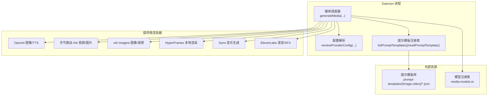
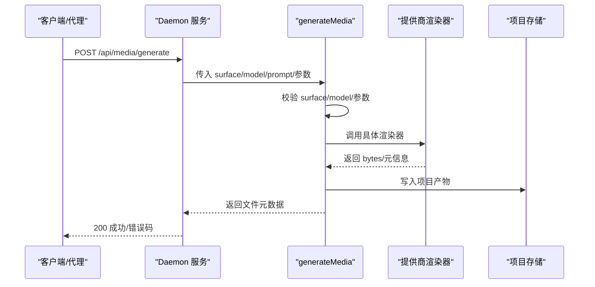
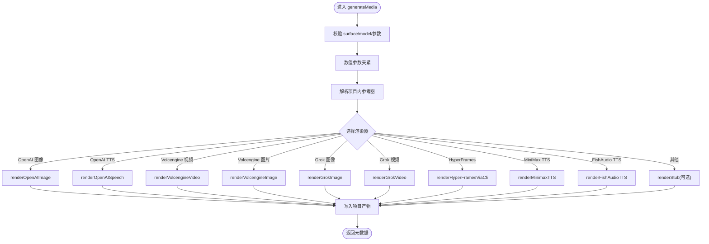
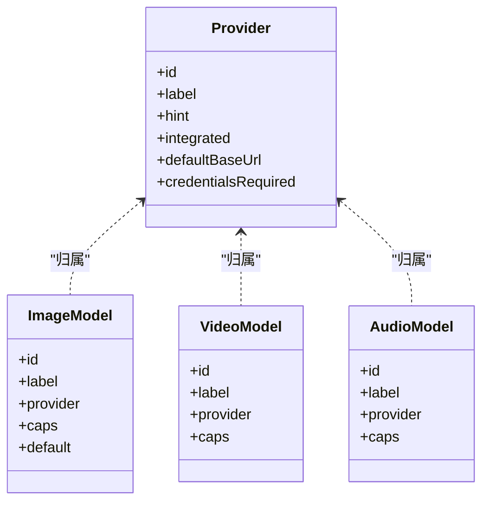
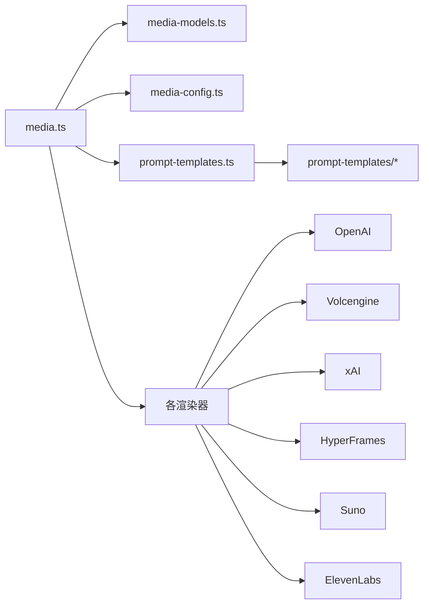

# 媒体生成系统

<cite>
**本文档引用的文件**
- [apps/daemon/src/media.ts](file://apps/daemon/src/media.ts)
- [apps/daemon/src/media-models.ts](file://apps/daemon/src/media-models.ts)
- [apps/daemon/src/media-config.ts](file://apps/daemon/src/media-config.ts)
- [apps/daemon/src/prompt-templates.ts](file://apps/daemon/src/prompt-templates.ts)
- [prompt-templates/image/3d-stone-staircase-evolution-infographic.json](file://prompt-templates/image/3d-stone-staircase-evolution-infographic.json)
- [prompt-templates/video/seedance-2-0-15-second-cinematic-japanese-romance-short-film.json](file://prompt-templates/video/seedance-2-0-15-second-cinematic-japanese-romance-short-film.json)
- [prompt-templates/video/hyperframes-app-showcase-three-phones.json](file://prompt-templates/video/hyperframes-app-showcase-three-phones.json)
- [skills/hyperframes/SKILL.md](file://skills/hyperframes/SKILL.md)
- [scripts/import-prompt-templates.mjs](file://scripts/import-prompt-templates.mjs)
- [apps/web/src/media/models.ts](file://apps/web/src/media/models.ts)
- [README.md](file://README.md)
</cite>

## 目录
1. [简介](#简介)
2. [项目结构](#项目结构)
3. [核心组件](#核心组件)
4. [架构总览](#架构总览)
5. [详细组件分析](#详细组件分析)
6. [依赖关系分析](#依赖关系分析)
7. [性能考虑](#性能考虑)
8. [故障排除指南](#故障排除指南)
9. [结论](#结论)
10. [附录](#附录)

## 简介
本文件面向 Open Design 的媒体生成系统，系统性阐述三大家族的模型适配器：图像生成（gpt-image-2）、视频生成（Seedance 2.0、HyperFrames）、音频生成（Suno、ElevenLabs）。文档覆盖媒体生成的工作流程、模型参数配置、与设计工作流的集成方式，并介绍 93 个现成的提示模板（43 个图像、39 个视频、11 个 HyperFrames）的使用方法、自定义与扩展策略。最后提供最佳实践、性能优化建议与故障排除指南。

## 项目结构
媒体生成系统由“调度器 + 提示模板 + 配置管理 + 各提供商渲染器”构成，核心入口为 daemon 的媒体调度模块，按 surface（图像/视频/音频）与 model 分发到对应渲染器；提示模板通过统一注册表暴露给前端与后端；配置管理负责凭证解析与持久化。

图表来源
- [apps/daemon/src/media.ts:210-473](file://apps/daemon/src/media.ts#L210-L473)
- [apps/daemon/src/media-config.ts:220-232](file://apps/daemon/src/media-config.ts#L220-L232)
- [apps/daemon/src/prompt-templates.ts:16-63](file://apps/daemon/src/prompt-templates.ts#L16-L63)
- [apps/daemon/src/media-models.ts:11-134](file://apps/daemon/src/media-models.ts#L11-L134)

章节来源
- [apps/daemon/src/media.ts:1-1691](file://apps/daemon/src/media.ts#L1-L1691)
- [apps/daemon/src/media-models.ts:1-134](file://apps/daemon/src/media-models.ts#L1-L134)
- [apps/daemon/src/media-config.ts:1-318](file://apps/daemon/src/media-config.ts#L1-L318)
- [apps/daemon/src/prompt-templates.ts:1-109](file://apps/daemon/src/prompt-templates.ts#L1-L109)
- [README.md:57-58](file://README.md#L57-L58)

## 核心组件
- 媒体调度器 generateMedia：统一入口，校验 surface/model/参数，解析项目内参考图，路由到具体提供商渲染器，处理占位符回退与错误传播，最终写入项目产物目录。
- 模型注册表：集中声明所有已支持的 provider、model、能力与默认值，确保跨层一致性。
- 配置管理：解析环境变量/存储的密钥与 base URL，支持 OAuth 自动注入，屏蔽不同 provider 的差异。
- 提示模板注册表：扫描本地模板目录，校验并返回可直接使用的模板条目，支持分类与标签检索。
- 渲染器：针对各 provider 的请求构建、异步轮询、错误处理与占位符回退策略。

章节来源
- [apps/daemon/src/media.ts:210-473](file://apps/daemon/src/media.ts#L210-L473)
- [apps/daemon/src/media-models.ts:11-134](file://apps/daemon/src/media-models.ts#L11-L134)
- [apps/daemon/src/media-config.ts:220-232](file://apps/daemon/src/media-config.ts#L220-L232)
- [apps/daemon/src/prompt-templates.ts:16-109](file://apps/daemon/src/prompt-templates.ts#L16-L109)

## 架构总览
媒体生成在 daemon 中以“单一路由器 + 多渲染器”的模式运行：前端或代理调用 /api/media/generate，daemon 解析参数与凭证后，根据 model 的 provider 与 surface 将请求分派至对应渲染器；渲染器完成上游调用、轮询与下载后，将二进制结果写入项目目录并返回元数据。

图表来源
- [apps/daemon/src/media.ts:210-473](file://apps/daemon/src/media.ts#L210-L473)
- [apps/daemon/src/server.ts:3189-3234](file://apps/daemon/src/server.ts#L3189-L3234)

## 详细组件分析

### 组件 A：媒体调度器 generateMedia
- 输入参数：projectRoot/projectsRoot/projectId/surface/model/prompt/output/aspect/length/duration/voice/audioKind/compositionDir/image/onProgress
- 校验与约束：
  - surface 必须为 image/video/audio
  - model 必须在 modelsForSurface(surface, audioKind) 允许列表中
  - 数值参数（长度/时长）按允许集合进行“就近夹紧”，避免上游账单风险
  - image 参数仅允许项目内受控路径，限制大小与扩展名白名单
- 路由逻辑：依据 provider 与 surface 选择渲染器，包括 OpenAI 图像/TTS、Volcengine 视频/图片、Grok 图像/视频、HyperFrames、MiniMax、FishAudio 等
- 错误处理：
  - 当未启用 stubs 或真实提供商失败且未允许 stubs 时，抛出明确错误
  - 允许 stubs 时，写入确定性占位符并标记 providerError，便于上层区分“未集成”与“失败”
- 输出：写入项目目录，返回文件名、大小、mime、providerNote、是否使用 stub 等元信息

图表来源
- [apps/daemon/src/media.ts:210-473](file://apps/daemon/src/media.ts#L210-L473)
- [apps/daemon/src/media.ts:510-756](file://apps/daemon/src/media.ts#L510-L756)
- [apps/daemon/src/media.ts:770-900](file://apps/daemon/src/media.ts#L770-L900)
- [apps/daemon/src/media.ts:981-1192](file://apps/daemon/src/media.ts#L981-L1192)
- [apps/daemon/src/media.ts:1407-1577](file://apps/daemon/src/media.ts#L1407-L1577)
- [apps/daemon/src/media.ts:1232-1382](file://apps/daemon/src/media.ts#L1232-L1382)
- [apps/daemon/src/media.ts:1587-1691](file://apps/daemon/src/media.ts#L1587-L1691)

章节来源
- [apps/daemon/src/media.ts:210-473](file://apps/daemon/src/media.ts#L210-L473)

### 组件 B：模型注册表与能力矩阵
- 提供商清单：包含 openai、volcengine、grok、hyperframes、minimax、fishaudio 等，标注是否集成、默认 base URL、是否需要凭证等
- 模型清单：按 surface 划分，image/video/audio 各有独立列表，标注 provider、能力（t2i/i2i/inpaint/t2v/i2v/audio/tts/sfx/music 等）
- 默认模型与参数：提供默认 image 模型、可用宽高比、视频/音频时长集合等

图表来源
- [apps/daemon/src/media-models.ts:11-134](file://apps/daemon/src/media-models.ts#L11-L134)
- [apps/web/src/media/models.ts:377-397](file://apps/web/src/media/models.ts#L377-L397)

章节来源
- [apps/daemon/src/media-models.ts:11-134](file://apps/daemon/src/media-models.ts#L11-L134)
- [apps/web/src/media/models.ts:377-397](file://apps/web/src/media/models.ts#L377-L397)

### 组件 C：配置管理 resolveProviderConfig
- 优先级：环境变量 > 存储配置 > OAuth 自动注入（OpenAI）
- 支持多位置存储：OD_MEDIA_CONFIG_DIR > OD_DATA_DIR > 项目 .od 目录
- 敏感信息掩码：读取接口对密钥进行掩码展示，避免泄露
- 写入保护：空 payload 不会清空已有配置，除非显式 force=true

章节来源
- [apps/daemon/src/media-config.ts:1-318](file://apps/daemon/src/media-config.ts#L1-L318)

### 组件 D：提示模板注册表
- 扫描策略：遍历 prompt-templates/{image,video}/*.json，校验字段完整性与来源合法性
- 输出规范：标准化 id/title/summary/category/tags/model/aspect/prompt 等字段
- 排序规则：先按 surface 分组，再按标题字母序排序，便于前端展示

章节来源
- [apps/daemon/src/prompt-templates.ts:16-109](file://apps/daemon/src/prompt-templates.ts#L16-L109)

### 组件 E：图像生成（gpt-image-2）
- 支持 Azure/OpenAI 双栈：自动检测 Azure URL 并附加 api-version、同时发送 api-key 与 Authorization
- 尺寸映射：根据 aspect 选择合适尺寸，避免 API 默默降级
- 响应格式：dall-e-* 强制 b64_json，gpt-image-* 使用 quality 控制质量
- 输出扩展名：PNG（默认）

章节来源
- [apps/daemon/src/media.ts:510-587](file://apps/daemon/src/media.ts#L510-L587)
- [apps/daemon/src/media.ts:689-756](file://apps/daemon/src/media.ts#L689-L756)

### 组件 F：视频生成（Seedance 2.0）
- 请求流程：提交任务 → 轮询状态 → 下载视频 → 写入项目
- 参数拼接：自动追加 --resolution/--duration/--ratio 等标志，保证与用户 prompt 解耦
- 超时控制：可配置最大轮询时间，默认 12 分钟
- 输出扩展名：MP4

章节来源
- [apps/daemon/src/media.ts:770-900](file://apps/daemon/src/media.ts#L770-L900)

### 组件 G：视频生成（HyperFrames）
- 工作流：agent 在项目隐藏缓存目录生成 composition（hyperframes.json/meta.json/index.html），daemon 以无沙箱进程执行 npx hyperframes render，捕获帧并输出 MP4
- 安全与隔离：compositionDir 必须位于项目内且存在 index.html，防止任意路径渲染
- 进度与日志：实时转发子进程 stdout/stderr，超时强制终止
- 输出扩展名：MP4

章节来源
- [apps/daemon/src/media.ts:1407-1577](file://apps/daemon/src/media.ts#L1407-L1577)
- [skills/hyperframes/SKILL.md:38-129](file://skills/hyperframes/SKILL.md#L38-L129)

### 组件 H：音频生成（Suno/ElevenLabs）
- Suno：音乐生成（music），通过模型注册表暴露 suno-v5/suno-v4-5 等
- ElevenLabs：语音/音效（speech/sfx），通过 elevenlabs-v3、elevenlabs-sfx 等模型
- 注意：当前 daemon 侧未实现 Suno/ElevenLabs 的具体渲染器，仍处于“待集成”状态；如需使用，需等待后续 provider 实现或采用替代方案

章节来源
- [apps/daemon/src/media-models.ts:83-101](file://apps/daemon/src/media-models.ts#L83-L101)
- [apps/web/src/media/models.ts:377-397](file://apps/web/src/media/models.ts#L377-L397)

## 依赖关系分析
- 耦合点：
  - generateMedia 对 provider 与 surface 的强绑定，新增 provider 需在主分支添加路由
  - 模型注册表与前端模型定义需保持同步，脚本 verify:media-models 保障一致性
- 外部依赖：
  - OpenAI/Volcengine/Grok 的 API 文档与行为差异通过渲染器封装
  - HyperFrames 依赖本地 npx/hyperframes CLI，且需无沙箱环境以避免 Chrome 捕获帧卡死
- 潜在循环依赖：无直接循环，但模板导入脚本与模板目录存在运行期依赖

图表来源
- [apps/daemon/src/media.ts:1-1691](file://apps/daemon/src/media.ts#L1-L1691)
- [apps/daemon/src/media-models.ts:1-134](file://apps/daemon/src/media-models.ts#L1-L134)
- [apps/daemon/src/media-config.ts:1-318](file://apps/daemon/src/media-config.ts#L1-L318)
- [apps/daemon/src/prompt-templates.ts:1-109](file://apps/daemon/src/prompt-templates.ts#L1-L109)

章节来源
- [apps/daemon/src/media.ts:1-1691](file://apps/daemon/src/media.ts#L1-L1691)
- [apps/daemon/src/media-models.ts:1-134](file://apps/daemon/src/media-models.ts#L1-L134)
- [apps/daemon/src/media-config.ts:1-318](file://apps/daemon/src/media-config.ts#L1-L318)
- [apps/daemon/src/prompt-templates.ts:1-109](file://apps/daemon/src/prompt-templates.ts#L1-L109)

## 性能考虑
- 数值参数夹紧：避免上游 API/计费异常波动，减少无效重试
- 轮询上限与超时：Seedance 与 Grok 的轮询时间可配置，避免长时间占用资源
- 占位符回退：在未集成 provider 时快速返回有效占位，降低端到端延迟
- I/O 优化：将 HyperFrames 的中间帧与临时目录置于系统临时目录，仅保留最终 MP4 到项目
- 缓存与复用：模板导入脚本支持去重与保留手写模板，减少重复解析成本

## 故障排除指南
- “未配置 provider”错误：检查 Settings 中的媒体提供商密钥，或设置环境变量；确认 base URL 正确
- “模型不支持该 surface”：核对 modelsForSurface 返回列表，确保 model 与 surface 匹配
- “图像参数过大/扩展名不受支持”：限制在 16MB 以内，仅允许 png/jpg/jpeg/webp/gif
- “Volcengine 任务超时”：适当提高 OD_VOLCENGINE_VIDEO_MAX_POLL_MS，或缩短视频长度
- “Grok 视频轮询超时”：提高 OD_GROK_VIDEO_MAX_POLL_MS，或降低时长/分辨率
- “HyperFrames 渲染卡住”：检查 compositionDir 是否在项目内、是否存在 index.html；确认无沙箱限制导致 Chrome 子进程阻塞
- “Stub 回退”：若启用 stubs，将看到 providerNote 带有 [stub] 标记；如未启用则会返回 503 并提示配置密钥

章节来源
- [apps/daemon/src/media.ts:77-91](file://apps/daemon/src/media.ts#L77-L91)
- [apps/daemon/src/media.ts:832-888](file://apps/daemon/src/media.ts#L832-L888)
- [apps/daemon/src/media.ts:1067-1168](file://apps/daemon/src/media.ts#L1067-L1168)
- [apps/daemon/src/media.ts:1407-1577](file://apps/daemon/src/media.ts#L1407-L1577)
- [apps/daemon/src/media.ts:1587-1691](file://apps/daemon/src/media.ts#L1587-L1691)

## 结论
Open Design 的媒体生成系统以“统一调度 + 多渲染器 + 模板生态”为核心，既保证了与多家提供商的兼容，又通过严格的参数夹紧、错误回退与占位符策略提升了稳定性与可调试性。对于尚未实现的 Suno/ElevenLabs，建议在后续版本中补齐渲染器并完善模板库。模板导入脚本与提示模板注册表共同构成了可扩展的模板体系，便于团队沉淀与复用高质量 prompt。

## 附录

### A. 提示模板使用与扩展
- 使用方式：通过 listPromptTemplates/readPromptTemplate 获取模板，结合 surface/model/aspect/prompt 字段直接用于生成
- 扩展策略：运行 scripts/import-prompt-templates.mjs 导入上游仓库的精选模板，或在 prompt-templates/{image,video} 下新增自定义 JSON 文件（需包含 source 信息）

章节来源
- [apps/daemon/src/prompt-templates.ts:16-109](file://apps/daemon/src/prompt-templates.ts#L16-L109)
- [scripts/import-prompt-templates.mjs:1-404](file://scripts/import-prompt-templates.mjs#L1-L404)

### B. 三大家族模型适配要点
- 图像（gpt-image-2）：Azure 自动识别、尺寸映射、响应格式差异化
- 视频（Seedance 2.0）：任务提交/轮询/下载链路、参数拼接、超时控制
- 视频（HyperFrames）：compositionDir 校验、npx 渲染、进度流、超时终止
- 音频（Suno/ElevenLabs）：模型注册表已列出，待实现渲染器

章节来源
- [apps/daemon/src/media.ts:510-587](file://apps/daemon/src/media.ts#L510-L587)
- [apps/daemon/src/media.ts:770-900](file://apps/daemon/src/media.ts#L770-L900)
- [apps/daemon/src/media.ts:1407-1577](file://apps/daemon/src/media.ts#L1407-L1577)
- [apps/daemon/src/media-models.ts:83-101](file://apps/daemon/src/media-models.ts#L83-L101)

### C. 示例模板参考
- 图像模板示例：[3d-stone-staircase-evolution-infographic.json:1-21](file://prompt-templates/image/3d-stone-staircase-evolution-infographic.json#L1-L21)
- 视频模板示例（Seedance 2.0）：[seedance-2-0-15-second-cinematic-japanese-romance-short-film.json:1-23](file://prompt-templates/video/seedance-2-0-15-second-cinematic-japanese-romance-short-film.json#L1-L23)
- 视频模板示例（HyperFrames）：[hyperframes-app-showcase-three-phones.json:1-19](file://prompt-templates/video/hyperframes-app-showcase-three-phones.json#L1-L19)

章节来源
- [prompt-templates/image/3d-stone-staircase-evolution-infographic.json:1-21](file://prompt-templates/image/3d-stone-staircase-evolution-infographic.json#L1-L21)
- [prompt-templates/video/seedance-2-0-15-second-cinematic-japanese-romance-short-film.json:1-23](file://prompt-templates/video/seedance-2-0-15-second-cinematic-japanese-romance-short-film.json#L1-L23)
- [prompt-templates/video/hyperframes-app-showcase-three-phones.json:1-19](file://prompt-templates/video/hyperframes-app-showcase-three-phones.json#L1-L19)