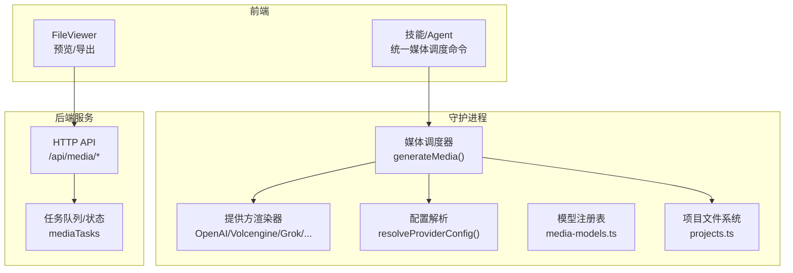
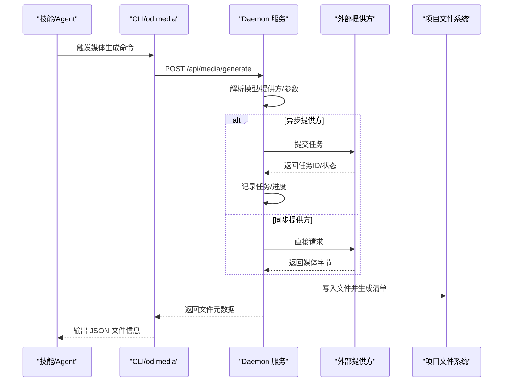
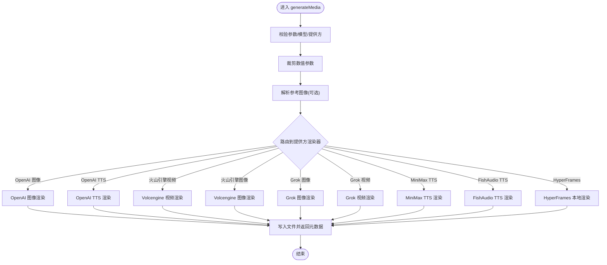
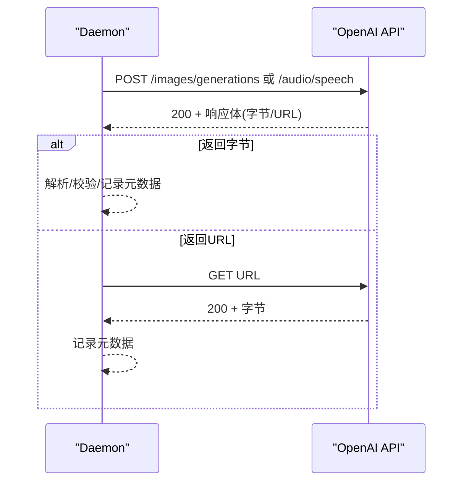
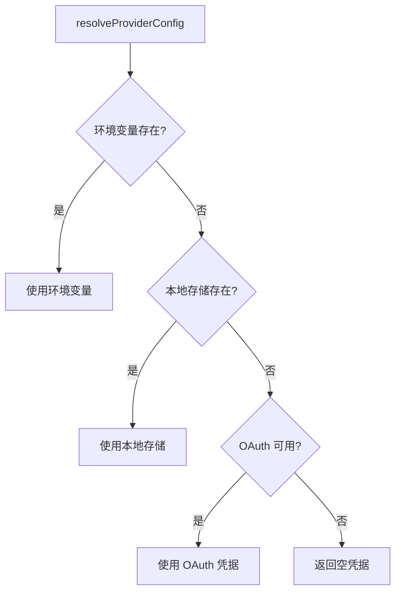
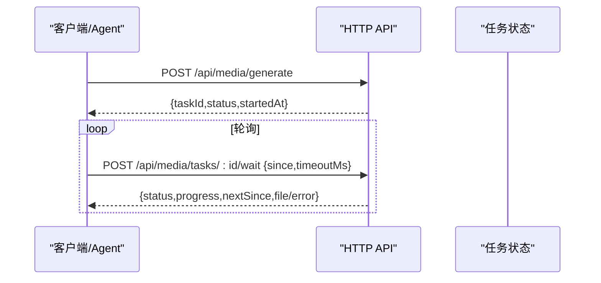
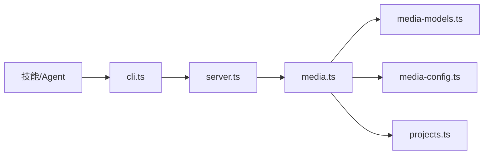

# 媒体集成与工作流

<cite>
**本文引用的文件**
- [apps/daemon/src/media.ts](file://apps/daemon/src/media.ts)
- [apps/daemon/src/media-config.ts](file://apps/daemon/src/media-config.ts)
- [apps/daemon/src/media-models.ts](file://apps/daemon/src/media-models.ts)
- [apps/daemon/src/projects.ts](file://apps/daemon/src/projects.ts)
- [apps/daemon/src/server.ts](file://apps/daemon/src/server.ts)
- [apps/daemon/src/cli.ts](file://apps/daemon/src/cli.ts)
- [scripts/verify-media-models.mjs](file://scripts/verify-media-models.mjs)
- [skills/video-shortform/SKILL.md](file://skills/video-shortform/SKILL.md)
- [apps/web/src/components/FileViewer.tsx](file://apps/web/src/components/FileViewer.tsx)
</cite>

## 目录
1. [简介](#简介)
2. [项目结构](#项目结构)
3. [核心组件](#核心组件)
4. [架构总览](#架构总览)
5. [详细组件分析](#详细组件分析)
6. [依赖关系分析](#依赖关系分析)
7. [性能考量](#性能考量)
8. [故障排查指南](#故障排查指南)
9. [结论](#结论)
10. [附录](#附录)

## 简介
本文件面向 Open Design 的媒体生成与工作流，系统性阐述媒体结果在工作流中的处理路径：从模型选择、提供方路由、文件落盘、元数据管理到版本化展示；覆盖预览、编辑、导出能力；解释错误处理、重试机制与性能监控；给出压缩、格式转换与质量优化的技术方案；说明与设计技能的集成方式及批量自动化工作流实现，并提供可操作的集成示例与最佳实践。

## 项目结构
媒体子系统由“前端技能（Agent）”“守护进程（Daemon）”“后端服务（Server）”三部分协作完成：
- 技能层：通过统一的媒体调度命令触发生成，遵循“技能 → 守护进程”的约定式调用。
- 守护进程：负责模型注册、提供方配置解析、具体渲染器执行、占位回退与错误标注、文件写入与元数据推断。
- 后端服务：提供 HTTP 接口，支持任务异步轮询、进度流与文件列表管理；前端 FileViewer 负责渲染与导出。

图表来源
- [apps/daemon/src/media.ts](file://apps/daemon/src/media.ts)
- [apps/daemon/src/media-config.ts](file://apps/daemon/src/media-config.ts)
- [apps/daemon/src/media-models.ts](file://apps/daemon/src/media-models.ts)
- [apps/daemon/src/projects.ts](file://apps/daemon/src/projects.ts)
- [apps/daemon/src/server.ts](file://apps/daemon/src/server.ts)

章节来源
- [apps/daemon/src/media.ts](file://apps/daemon/src/media.ts)
- [apps/daemon/src/media-config.ts](file://apps/daemon/src/media-config.ts)
- [apps/daemon/src/media-models.ts](file://apps/daemon/src/media-models.ts)
- [apps/daemon/src/projects.ts](file://apps/daemon/src/projects.ts)
- [apps/daemon/src/server.ts](file://apps/daemon/src/server.ts)

## 核心组件
- 媒体调度器 generateMedia：统一入口，校验参数、解析模型与提供方、路由到对应渲染器、写入项目目录并返回元数据。
- 提供方渲染器：针对不同提供方（OpenAI、火山引擎、Grok、MiniMax、FishAudio、HyperFrames）实现同步/异步请求、轮询与下载。
- 配置解析 resolveProviderConfig：优先环境变量，其次本地存储，再尝试 OAuth 凭据，最终回退占位。
- 模型注册表 media-models：维护提供方、模型、能力与默认值，保证 TS/JS 注册表一致性。
- 项目文件系统 projects：安全路径解析、文件读写、清单（artifact manifest）管理、归档打包。
- 服务器 API：任务提交、轮询、进度流与文件列表；FileViewer 前端组件负责渲染与导出。

章节来源
- [apps/daemon/src/media.ts](file://apps/daemon/src/media.ts)
- [apps/daemon/src/media-config.ts](file://apps/daemon/src/media-config.ts)
- [apps/daemon/src/media-models.ts](file://apps/daemon/src/media-models.ts)
- [apps/daemon/src/projects.ts](file://apps/daemon/src/projects.ts)
- [apps/daemon/src/server.ts](file://apps/daemon/src/server.ts)

## 架构总览
媒体工作流的关键路径如下：
- 技能侧调用统一命令，传递 surface/model/prompt/输出名等参数；
- 守护进程解析模型与提供方，按提供方实现进行请求或本地渲染；
- 异步任务通过 HTTP API 提交与轮询，进度实时回传；
- 成功后将字节写入项目目录，自动推断 kind/mime 并生成 artifact 清单；
- 前端 FileViewer 识别类型并渲染，支持导出为 PPTX/PDF 等。

图表来源
- [apps/daemon/src/media.ts](file://apps/daemon/src/media.ts)
- [apps/daemon/src/server.ts](file://apps/daemon/src/server.ts)
- [apps/daemon/src/cli.ts](file://apps/daemon/src/cli.ts)

章节来源
- [apps/daemon/src/media.ts](file://apps/daemon/src/media.ts)
- [apps/daemon/src/server.ts](file://apps/daemon/src/server.ts)
- [apps/daemon/src/cli.ts](file://apps/daemon/src/cli.ts)

## 详细组件分析

### 组件一：媒体调度器 generateMedia
职责与流程
- 参数校验：项目根、项目 ID、surface、model、prompt、输出名、长宽比、时长/时长、语音/音色种类等。
- 模型与提供方匹配：从注册表筛选允许的模型集合，确保跨 surface 不误配。
- 数值裁剪：对长度/时长等数值限制在允许区间，避免上游超限。
- 参考图处理：对图像参考图进行安全解析与 base64 数据 URL 转换。
- 渲染器路由：根据 provider/surface 分派到对应渲染器（OpenAI 图像/TTS、火山引擎视频/图像、Grok 图像/视频、MiniMax/FishAudio TTS、HyperFrames 本地渲染）。
- 错误与占位：当未启用占位或真实提供方失败且允许占位时，写入确定性占位文件并标注 providerNote。
- 文件落盘：根据建议扩展名修正输出名，写入项目目录，统计 size/mtime 并返回标准化元数据。

图表来源
- [apps/daemon/src/media.ts](file://apps/daemon/src/media.ts)

章节来源
- [apps/daemon/src/media.ts](file://apps/daemon/src/media.ts)

### 组件二：提供方渲染器（以 OpenAI 为例）
职责与流程
- OpenAI 图像：检测 Azure/OpenAI，构建 URL，设置响应格式与质量，支持 b64_json 或 url 下载。
- OpenAI TTS：根据文件扩展名映射音频格式，支持风格化指令（仅 gpt-4o-mini-tts），返回字节与建议扩展名。
- 错误处理：非 200 响应抛出带上下文的错误，解析失败提示非 JSON。
- 元数据：返回 providerNote 与建议扩展名，便于后续落盘与 FileViewer 展示。

图表来源
- [apps/daemon/src/media.ts](file://apps/daemon/src/media.ts)

章节来源
- [apps/daemon/src/media.ts](file://apps/daemon/src/media.ts)

### 组件三：配置解析 resolveProviderConfig
职责与流程
- 优先级：环境变量 > 本地存储 > OAuth（OpenAI/Codex/Hermes）。
- 存储位置：支持自定义目录（OD_MEDIA_CONFIG_DIR/OD_DATA_DIR），默认在项目 .od 下。
- 读取掩码：GET 接口返回“已配置/来源/尾号”等信息，不泄露密钥明文。
- 写入保护：空 payload 不会清空已有配置，除非显式 force=true 并打印警告日志。

图表来源
- [apps/daemon/src/media-config.ts](file://apps/daemon/src/media-config.ts)

章节来源
- [apps/daemon/src/media-config.ts](file://apps/daemon/src/media-config.ts)

### 组件四：模型注册表 media-models
职责与流程
- 维护提供方、模型、能力（t2i/i2i/inpaint/t2v/i2v/audio/tts/music/sfx 等）与默认值。
- 提供查找模型/提供方与按 surface 过滤的能力。
- 通过脚本 verify-media-models.mjs 保持 TS/JS 注册表一致，CI 失配即失败。

章节来源
- [apps/daemon/src/media-models.ts](file://apps/daemon/src/media-models.ts)
- [scripts/verify-media-models.mjs](file://scripts/verify-media-models.mjs)

### 组件五：项目文件系统 projects
职责与流程
- 安全路径：validateProjectPath/sanitizePath/sanitizeName 防止路径穿越与非法字符。
- 文件读写：ensureProject/listFiles/readProjectFile/writeProjectFile/deleteProjectFile/removeProjectDir。
- 清单管理：artifact manifest 自动推断与持久化，支持 .artifact.json 辅助文件。
- 归档打包：buildProjectArchive 支持子树归档，排除隐藏文件与 .artifact.json。

章节来源
- [apps/daemon/src/projects.ts](file://apps/daemon/src/projects.ts)

### 组件六：服务器 API 与任务轮询
职责与流程
- 提交任务：POST /api/media/generate 返回 taskId/status/startedAt。
- 轮询等待：POST /api/media/tasks/:id/wait，支持 since/timeoutMs，返回 progress/snapshot。
- FileViewer：根据 kind/mime 选择渲染器，支持 HTML 预览、源码查看、缩放、全屏、导出为 PPTX/PDF 等。

图表来源
- [apps/daemon/src/server.ts](file://apps/daemon/src/server.ts)

章节来源
- [apps/daemon/src/server.ts](file://apps/daemon/src/server.ts)
- [apps/web/src/components/FileViewer.tsx](file://apps/web/src/components/FileViewer.tsx)

## 依赖关系分析
- 模块耦合
  - media.ts 依赖 media-models.ts（模型/提供方）、media-config.ts（凭据）、projects.ts（文件系统）。
  - server.ts 依赖 media.ts 的任务状态与进度回传。
  - CLI 通过 HTTP 与 server 交互，间接依赖 media.ts 的生成逻辑。
- 外部依赖
  - 提供方 API（OpenAI/Volcengine/Grok/MiniMax/FishAudio）。
  - HyperFrames 本地渲染依赖 npx 与 puppeteer（受沙箱限制，需在守护进程执行）。
- 循环依赖
  - 无直接循环；TS 注册表与 JS 注册表通过脚本同步，避免运行时循环。

图表来源
- [apps/daemon/src/media.ts](file://apps/daemon/src/media.ts)
- [apps/daemon/src/media-models.ts](file://apps/daemon/src/media-models.ts)
- [apps/daemon/src/media-config.ts](file://apps/daemon/src/media-config.ts)
- [apps/daemon/src/projects.ts](file://apps/daemon/src/projects.ts)
- [apps/daemon/src/server.ts](file://apps/daemon/src/server.ts)
- [apps/daemon/src/cli.ts](file://apps/daemon/src/cli.ts)

章节来源
- [apps/daemon/src/media.ts](file://apps/daemon/src/media.ts)
- [apps/daemon/src/server.ts](file://apps/daemon/src/server.ts)
- [apps/daemon/src/cli.ts](file://apps/daemon/src/cli.ts)

## 性能考量
- 异步任务与轮询
  - Volcengine/Grok 对于视频采用异步任务，内置最大轮询时间上限，避免长时间占用。
  - HyperFrames 渲染设置固定 workers=1 控制内存占用，超时强制终止并清理临时目录。
- I/O 与缓存
  - 将远程下载的视频/图像字节直接写入项目目录，避免中间缓存泄漏。
  - 占位文件极小（~24 字节 MP4/静音 WAV），降低网络与磁盘压力。
- 清单与归档
  - artifact 清单与归档打包均排除隐藏文件与 .artifact.json，减少冗余。
- 前端渲染
  - FileViewer 按 kind/mime 选择渲染器，HTML 预览支持缩放与全屏，提升交互效率。

章节来源
- [apps/daemon/src/media.ts](file://apps/daemon/src/media.ts)
- [apps/daemon/src/projects.ts](file://apps/daemon/src/projects.ts)
- [apps/web/src/components/FileViewer.tsx](file://apps/web/src/components/FileViewer.tsx)

## 故障排查指南
常见问题与处理
- 提供方未配置/密钥缺失
  - 现象：抛出 StubProviderDisabledError 或真实提供方错误。
  - 处理：在设置中配置对应提供方密钥，或开启占位（OD_MEDIA_ALLOW_STUBS=1）以便框架可用。
- 路径穿越与非法文件名
  - 现象：resolveSafe/sanitizePath 抛错。
  - 处理：检查传入路径是否相对且不包含 ..、/ 开头或 Windows 驱动器盘符。
- 异步任务超时
  - 现象：Volcengine/Grok 视频任务在最大轮询时间内未完成。
  - 处理：适当提高 OD_VOLCENGINE_VIDEO_MAX_POLL_MS/OD_GROK_VIDEO_MAX_POLL_MS；确认上游服务状态。
- 占位与真实失败区分
  - 现象：FileViewer 显示 providerNote 标记 [stub]。
  - 处理：若为真实失败，CLI/守护进程会记录 stderr；若为占位，说明提供方尚未集成。
- 导出与预览异常
  - 现象：FileViewer 无法正确渲染或导出。
  - 处理：确认文件扩展名与 MIME 匹配；必要时修正输出扩展名或重新生成。

章节来源
- [apps/daemon/src/media.ts](file://apps/daemon/src/media.ts)
- [apps/daemon/src/media-config.ts](file://apps/daemon/src/media-config.ts)
- [apps/daemon/src/projects.ts](file://apps/daemon/src/projects.ts)
- [apps/web/src/components/FileViewer.tsx](file://apps/web/src/components/FileViewer.tsx)

## 结论
Open Design 的媒体子系统以“统一调度 + 提供方适配 + 安全文件系统 + 任务轮询 + 前端渲染”为核心，实现了从技能到产物的完整闭环。通过严格的参数校验、数值裁剪与占位策略，保障了在未集成真实提供方时的可用性；通过任务轮询与进度回传，提升了长耗时任务的可观测性；通过 artifact 清单与归档，完善了版本化与交付能力。结合本文的错误处理、性能优化与最佳实践，可在生产环境中稳定落地媒体生成与工作流自动化。

## 附录

### 技术方案：压缩、格式转换与质量优化
- 压缩
  - 图像：PNG/WebP/AVIF 在项目内按需保留；导出前可按目标平台选择最优格式。
  - 视频：导出时可选择编码参数与分辨率，平衡体积与清晰度。
  - 音频：MP3/WAV 根据用途选择，注意采样率与码率。
- 格式转换
  - 使用 FFmpeg 或浏览器原生 API 进行格式转换；在守护进程侧统一转换接口更易维护。
- 质量优化
  - 图像：基于感知质量与文件大小的折中；对高对比场景优先考虑 PNG/WebP。
  - 视频：根据目标平台（短视频/网页）选择合适帧率与分辨率；启用 VBR 与合适的 GOP。
  - 音频：根据语种与情感选择合适采样率与声道数；对语音优先 MP3，对音乐可考虑 AAC。

### 与其他设计技能的集成方式
- 技能通过统一命令触发媒体生成，无需直接调用提供方 API。
- 以 video-shortform 技能为例，先组装镜头提示词，再调用 od media generate，最后在回复中附上文件名与改进建议。
- HyperFrames 技能通过本地 HTML 渲染，避免沙箱限制导致的子进程阻塞。

章节来源
- [skills/video-shortform/SKILL.md](file://skills/video-shortform/SKILL.md)
- [apps/daemon/src/media.ts](file://apps/daemon/src/media.ts)

### 批量处理与自动化工作流
- 任务轮询：通过 /api/media/tasks/:id/wait 获取增量进度，适合在自动化流水线中持续拉取。
- CLI 工具：od media generate/od media wait 支持在脚本中组合使用，实现批量化与重试。
- 超时与重试：合理设置轮询上限与重试次数，避免资源泄露；对网络抖动与上游限流做好退避策略。

章节来源
- [apps/daemon/src/cli.ts](file://apps/daemon/src/cli.ts)
- [apps/daemon/src/server.ts](file://apps/daemon/src/server.ts)