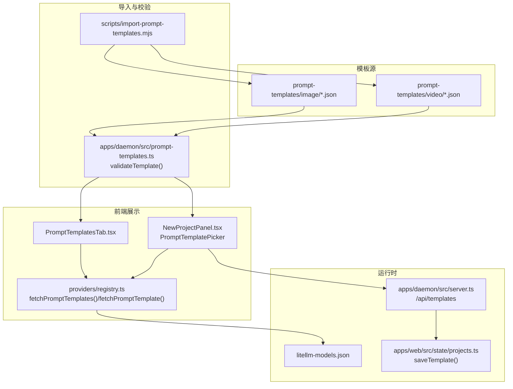
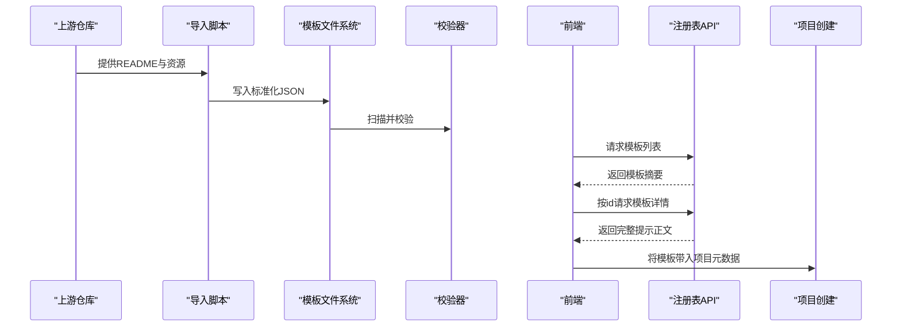
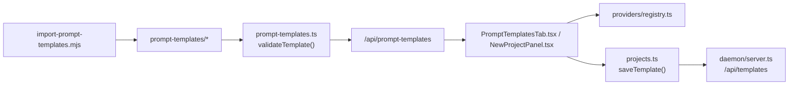

# 提示模板系统

<cite>
**本文档引用的文件**
- [apps/daemon/src/prompt-templates.ts](file://apps/daemon/src/prompt-templates.ts)
- [scripts/import-prompt-templates.mjs](file://scripts/import-prompt-templates.mjs)
- [prompt-templates/image/3d-stone-staircase-evolution-infographic.json](file://prompt-templates/image/3d-stone-staircase-evolution-infographic.json)
- [prompt-templates/video/3d-animated-boy-building-lego.json](file://prompt-templates/video/3d-animated-boy-building-lego.json)
- [apps/web/src/components/PromptTemplatesTab.tsx](file://apps/web/src/components/PromptTemplatesTab.tsx)
- [apps/web/src/components/NewProjectPanel.tsx](file://apps/web/src/components/NewProjectPanel.tsx)
- [apps/web/src/providers/registry.ts](file://apps/web/src/providers/registry.ts)
- [apps/web/src/prompts/shop-home-page-tone-presets.json](file://apps/web/src/prompts/shop-home-page-tone-presets.json)
- [apps/web/src/state/litellm-models.json](file://apps/web/src/state/litellm-models.json)
- [apps/daemon/src/server.ts](file://apps/daemon/src/server.ts)
- [apps/web/src/state/projects.ts](file://apps/web/src/state/projects.ts)
</cite>

## 目录
1. [简介](#简介)
2. [项目结构](#项目结构)
3. [核心组件](#核心组件)
4. [架构总览](#架构总览)
5. [详细组件分析](#详细组件分析)
6. [依赖关系分析](#依赖关系分析)
7. [性能考虑](#性能考虑)
8. [故障排除指南](#故障排除指南)
9. [结论](#结论)
10. [附录](#附录)

## 简介
本系统提供一套完整的提示模板（Prompt Templates）管理与使用方案，覆盖 93 个现成模板（图像与视频两类），支持模板导入、校验、检索、筛选与预览，并可直接用于媒体生成项目的创建流程中。模板采用标准化 JSON 结构，包含元数据、分类标签、来源信息与提示正文；前端提供搜索与分类筛选能力；后端负责扫描与校验模板文件；同时内置模板导入脚本以从上游仓库拉取高质量模板。

## 项目结构
- 模板源文件位于 `prompt-templates/{image,video}/`，每个模板为独立 JSON 文件，包含 id、标题、摘要、分类、标签、模型、宽高比、提示正文、预览链接与来源信息等字段。
- 导入脚本 `scripts/import-prompt-templates.mjs` 从指定上游仓库抓取模板，解析 README，抽取模板条目，生成标准化 JSON 并写入目标目录。
- 后端模块 `apps/daemon/src/prompt-templates.ts` 提供模板列表与读取接口，执行基础校验并返回结构化结果。
- 前端组件 `apps/web/src/components/PromptTemplatesTab.tsx` 与 `apps/web/src/components/NewProjectPanel.tsx` 提供模板浏览、搜索、分类筛选与选择预览功能。
- 模板详情通过 `apps/web/src/providers/registry.ts` 的 `fetchPromptTemplate` 接口按需加载完整提示正文。
- 模型兼容性参考 `apps/web/src/state/litellm-models.json` 中的模型清单，模板可声明默认模型与宽高比。

图表来源
- [apps/daemon/src/prompt-templates.ts:16-51](file://apps/daemon/src/prompt-templates.ts#L16-L51)
- [scripts/import-prompt-templates.mjs:371-398](file://scripts/import-prompt-templates.mjs#L371-L398)
- [apps/web/src/components/PromptTemplatesTab.tsx:21-107](file://apps/web/src/components/PromptTemplatesTab.tsx#L21-L107)
- [apps/web/src/components/NewProjectPanel.tsx:720-807](file://apps/web/src/components/NewProjectPanel.tsx#L720-L807)
- [apps/web/src/providers/registry.ts:163-188](file://apps/web/src/providers/registry.ts#L163-L188)
- [apps/web/src/state/litellm-models.json:1-800](file://apps/web/src/state/litellm-models.json#L1-L800)
- [apps/daemon/src/server.ts:2176-2220](file://apps/daemon/src/server.ts#L2176-L2220)
- [apps/web/src/state/projects.ts:106-123](file://apps/web/src/state/projects.ts#L106-L123)

章节来源
- [apps/daemon/src/prompt-templates.ts:1-109](file://apps/daemon/src/prompt-templates.ts#L1-L109)
- [scripts/import-prompt-templates.mjs:1-404](file://scripts/import-prompt-templates.mjs#L1-L404)

## 核心组件
- 模板导入器：从上游仓库抓取 README，解析“精选”与“全部”两类条目，抽取描述、作者、来源、预览链接与提示正文，生成标准化 JSON。
- 模板校验器：在后端扫描模板目录，对每个 JSON 执行字段完整性与一致性检查，确保 id、标题、提示正文长度、来源信息等符合规范。
- 模板注册表：提供模板列表与按 id 获取详情的 API，支持前端在新建项目时进行模板选择与预览。
- 前端模板面板：提供搜索框、分类过滤与卡片网格展示，支持本地化标题与摘要显示。
- 模板选择器：在图像/视频新建项目页弹出选择器，支持按表面类型过滤、关键词搜索与一键预览。
- 模板保存与复用：支持将项目产物快照为模板，便于团队共享与复用。

章节来源
- [apps/daemon/src/prompt-templates.ts:65-108](file://apps/daemon/src/prompt-templates.ts#L65-L108)
- [apps/web/src/components/PromptTemplatesTab.tsx:21-107](file://apps/web/src/components/PromptTemplatesTab.tsx#L21-L107)
- [apps/web/src/components/NewProjectPanel.tsx:720-807](file://apps/web/src/components/NewProjectPanel.tsx#L720-L807)
- [apps/web/src/providers/registry.ts:163-188](file://apps/web/src/providers/registry.ts#L163-L188)
- [apps/daemon/src/server.ts:2176-2220](file://apps/daemon/src/server.ts#L2176-L2220)
- [apps/web/src/state/projects.ts:106-123](file://apps/web/src/state/projects.ts#L106-L123)

## 架构总览
模板系统由“源模板 → 导入与校验 → 注册表 → 前端展示 → 项目创建”的链路构成。导入脚本负责从上游仓库抓取并生成标准化模板；后端负责扫描与校验；前端通过注册表接口获取模板并提供交互体验；模板最终被纳入项目元数据，成为生成请求的结构化参考。

图表来源
- [scripts/import-prompt-templates.mjs:371-398](file://scripts/import-prompt-templates.mjs#L371-L398)
- [apps/daemon/src/prompt-templates.ts:16-51](file://apps/daemon/src/prompt-templates.ts#L16-L51)
- [apps/web/src/providers/registry.ts:163-188](file://apps/web/src/providers/registry.ts#L163-L188)
- [apps/web/src/components/NewProjectPanel.tsx:789-807](file://apps/web/src/components/NewProjectPanel.tsx#L789-L807)

## 详细组件分析

### 模板 JSON 结构与字段说明
- 必填字段
  - id：模板唯一标识，用于路由与持久化
  - surface：表面类型，限定为 image 或 video
  - title：模板标题
  - prompt：提示正文，作为生成请求的结构化参考
  - source：来源信息对象，包含 repo、license 等
- 可选字段
  - summary：模板摘要
  - category：分类，默认 General
  - tags：标签数组
  - model：默认模型标识
  - aspect：默认宽高比
  - previewImageUrl / previewVideoUrl：预览资源链接
  - source.author / source.url：作者与来源链接

示例路径
- [prompt-templates/image/3d-stone-staircase-evolution-infographic.json:1-21](file://prompt-templates/image/3d-stone-staircase-evolution-infographic.json#L1-L21)
- [prompt-templates/video/3d-animated-boy-building-lego.json:1-20](file://prompt-templates/video/3d-animated-boy-building-lego.json#L1-L20)

章节来源
- [apps/daemon/src/prompt-templates.ts:65-108](file://apps/daemon/src/prompt-templates.ts#L65-L108)
- [prompt-templates/image/3d-stone-staircase-evolution-infographic.json:1-21](file://prompt-templates/image/3d-stone-staircase-evolution-infographic.json#L1-L21)
- [prompt-templates/video/3d-animated-boy-building-lego.json:1-20](file://prompt-templates/video/3d-animated-boy-building-lego.json#L1-L20)

### 模板导入与分类/标签推断
- 导入脚本从上游 README 抽取“精选”与“全部”两类条目，解析描述、作者、来源与预览链接，提取提示正文。
- 分类与标签基于标题与提示正文关键词进行推断，分别针对图像与视频设定不同的匹配规则，限制每条模板的标签数量以保持简洁。

章节来源
- [scripts/import-prompt-templates.mjs:112-194](file://scripts/import-prompt-templates.mjs#L112-L194)
- [scripts/import-prompt-templates.mjs:260-292](file://scripts/import-prompt-templates.mjs#L260-L292)
- [scripts/import-prompt-templates.mjs:294-318](file://scripts/import-prompt-templates.mjs#L294-L318)

### 模板校验与一致性检查
- 后端扫描模板目录，逐个读取 JSON 并执行字段校验：id 非空、surface 与目录一致、标题非空、提示正文长度阈值、来源信息完整性等。
- 校验通过后规范化输出字段，确保前端展示与后续流程稳定。

章节来源
- [apps/daemon/src/prompt-templates.ts:16-51](file://apps/daemon/src/prompt-templates.ts#L16-L51)
- [apps/daemon/src/prompt-templates.ts:65-108](file://apps/daemon/src/prompt-templates.ts#L65-L108)

### 前端模板浏览与筛选
- 模板面板提供搜索框与分类下拉，支持按标题、摘要、分类、标签进行多维检索；支持本地化显示。
- 模板卡片展示缩略图、标题、摘要、分类与标签，并标注来源信息；点击打开预览模态。

章节来源
- [apps/web/src/components/PromptTemplatesTab.tsx:21-107](file://apps/web/src/components/PromptTemplatesTab.tsx#L21-L107)

### 模板选择器与预览
- 新建项目面板中的图像/视频模板选择器，按表面类型过滤模板，支持关键词搜索与键盘事件处理。
- 选择模板后通过注册表 API 拉取完整提示正文，允许用户在创建前优化提示词。

章节来源
- [apps/web/src/components/NewProjectPanel.tsx:720-807](file://apps/web/src/components/NewProjectPanel.tsx#L720-L807)
- [apps/web/src/providers/registry.ts:174-188](file://apps/web/src/providers/registry.ts#L174-L188)

### 模板保存与复用
- 支持将项目产物快照为模板，服务端会收集项目中的文本/HTML/代码文件，生成可复用模板。
- 前端提供保存、查询、删除模板的接口，便于团队共享与版本化管理。

章节来源
- [apps/daemon/src/server.ts:2176-2220](file://apps/daemon/src/server.ts#L2176-L2220)
- [apps/web/src/state/projects.ts:106-123](file://apps/web/src/state/projects.ts#L106-L123)

### 模型兼容性与宽高比
- 模板可声明默认模型与宽高比；前端在媒体项目创建时根据模板自动填充模型与尺寸选项。
- 模型清单来自 litellm 统一配置，便于统一管理与切换。

章节来源
- [apps/web/src/state/litellm-models.json:1-800](file://apps/web/src/state/litellm-models.json#L1-L800)
- [apps/web/src/components/NewProjectPanel.tsx:139-147](file://apps/web/src/components/NewProjectPanel.tsx#L139-L147)

### 实际案例与使用场景
- 图像模板：如“3D 石阶演化信息图”，可用于教育类信息可视化生成，支持参数化风格与布局。
- 视频模板：如“男孩搭建乐高动画”，适用于短视频脚本与分镜序列生成，支持时长与镜头语言描述。
- 店铺首页主题预设：提供多种风格化的色彩与排版建议，辅助生成页面风格与文案方向。

章节来源
- [prompt-templates/image/3d-stone-staircase-evolution-infographic.json:1-21](file://prompt-templates/image/3d-stone-staircase-evolution-infographic.json#L1-L21)
- [prompt-templates/video/3d-animated-boy-building-lego.json:1-20](file://prompt-templates/video/3d-animated-boy-building-lego.json#L1-L20)
- [apps/web/src/prompts/shop-home-page-tone-presets.json:1-193](file://apps/web/src/prompts/shop-home-page-tone-presets.json#L1-L193)

## 依赖关系分析
- 模板导入依赖上游 README 结构与资源链接；导入脚本解析正则与块级结构，抽取所需字段。
- 后端依赖 Node fs/promises 进行目录扫描与文件读取；校验器对 JSON 字段进行严格约束。
- 前端依赖注册表 API 获取模板列表与详情；模板面板与选择器依赖 i18n 与本地化函数。
- 模板保存依赖服务端快照逻辑与数据库插入；前端通过 projects.ts 的保存接口提交请求。

图表来源
- [scripts/import-prompt-templates.mjs:371-398](file://scripts/import-prompt-templates.mjs#L371-L398)
- [apps/daemon/src/prompt-templates.ts:16-51](file://apps/daemon/src/prompt-templates.ts#L16-L51)
- [apps/web/src/providers/registry.ts:163-188](file://apps/web/src/providers/registry.ts#L163-L188)
- [apps/web/src/components/PromptTemplatesTab.tsx:21-107](file://apps/web/src/components/PromptTemplatesTab.tsx#L21-L107)
- [apps/web/src/components/NewProjectPanel.tsx:720-807](file://apps/web/src/components/NewProjectPanel.tsx#L720-L807)
- [apps/web/src/state/projects.ts:106-123](file://apps/web/src/state/projects.ts#L106-L123)
- [apps/daemon/src/server.ts:2176-2220](file://apps/daemon/src/server.ts#L2176-L2220)

## 性能考虑
- 模板列表加载：后端扫描模板目录并进行一次性 JSON 解析与校验，排序后返回，保证前端渲染稳定有序。
- 模板详情按需加载：仅在用户选择模板时才请求完整提示正文，减少网络与解析开销。
- 前端搜索与筛选：使用 useMemo 缓存中间结果，避免重复计算；输入框防抖与本地化处理降低重绘成本。
- 导入脚本：先清理旧生成文件，再写入新模板，避免重复与冲突，提升导入效率。

## 故障排除指南
- 模板缺失或格式错误：后端校验失败会记录警告并跳过该模板；请检查 id、surface、title、prompt、source 字段是否齐全。
- 模板导入异常：确认上游 README 结构与链接可用；检查导入脚本的抓取与解析逻辑是否命中预期块。
- 前端无法加载模板详情：检查注册表 API 是否可达，确认 surface 与 id 参数正确。
- 模板保存失败：检查服务端快照逻辑与数据库状态，确认项目 ID 存在且文件集合有效。

章节来源
- [apps/daemon/src/prompt-templates.ts:30-40](file://apps/daemon/src/prompt-templates.ts#L30-L40)
- [apps/web/src/providers/registry.ts:174-188](file://apps/web/src/providers/registry.ts#L174-L188)
- [apps/daemon/src/server.ts:2176-2220](file://apps/daemon/src/server.ts#L2176-L2220)

## 结论
本提示模板系统通过标准化的 JSON 结构、严格的导入与校验流程、完善的前端交互与按需加载机制，实现了高质量模板的采集、组织与复用。结合模型兼容性与项目创建流程，用户可以快速选择合适的模板并进行二次优化，显著提升媒体内容生成的一致性与效率。

## 附录

### 模板搜索与筛选使用指南
- 在模板面板顶部输入关键词，支持按标题、摘要、分类与标签进行模糊匹配。
- 使用分类下拉框快速筛选类别，如“Profile / Avatar”、“Infographic”、“Cinematic”等。
- 选择模板卡片打开预览，查看完整提示正文与来源信息。

章节来源
- [apps/web/src/components/PromptTemplatesTab.tsx:21-107](file://apps/web/src/components/PromptTemplatesTab.tsx#L21-L107)

### 创建自定义模板与最佳实践
- 自定义模板：在新建项目时选择“模板”标签，上传或选择已有模板；也可通过保存现有项目为模板实现复用。
- 模板验证：确保模板 JSON 包含必需字段并满足校验规则；来源信息完整以便合规使用。
- 模板分享：通过服务端模板接口分享给团队成员，统一风格与质量标准。

章节来源
- [apps/web/src/components/NewProjectPanel.tsx:440-454](file://apps/web/src/components/NewProjectPanel.tsx#L440-L454)
- [apps/web/src/state/projects.ts:106-123](file://apps/web/src/state/projects.ts#L106-L123)
- [apps/daemon/src/server.ts:2176-2220](file://apps/daemon/src/server.ts#L2176-L2220)

### 模板开发工具与批量处理
- 导入脚本：自动化从上游仓库抓取与生成模板，支持去重与保留手写模板。
- 校验器：后端扫描模板目录并执行字段校验，保证数据一致性。
- 前端工具：模板面板与选择器提供本地化与交互优化，便于快速筛选与预览。

章节来源
- [scripts/import-prompt-templates.mjs:320-369](file://scripts/import-prompt-templates.mjs#L320-L369)
- [apps/daemon/src/prompt-templates.ts:16-51](file://apps/daemon/src/prompt-templates.ts#L16-L51)
- [apps/web/src/components/PromptTemplatesTab.tsx:21-107](file://apps/web/src/components/PromptTemplatesTab.tsx#L21-L107)

### 模板质量评估方法
- 完整性：检查必需字段是否存在且格式正确。
- 可读性：提示正文应清晰、具体、可操作，避免歧义。
- 来源合规：确保来源信息完整，遵循相应许可证要求。
- 适用性：模板应与目标模型与宽高比匹配，避免无效组合。

章节来源
- [apps/daemon/src/prompt-templates.ts:65-108](file://apps/daemon/src/prompt-templates.ts#L65-L108)
- [scripts/import-prompt-templates.mjs:154-194](file://scripts/import-prompt-templates.mjs#L154-L194)