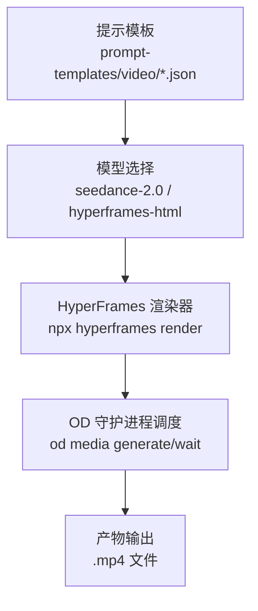
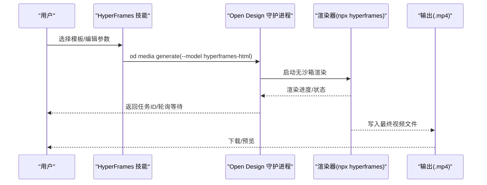
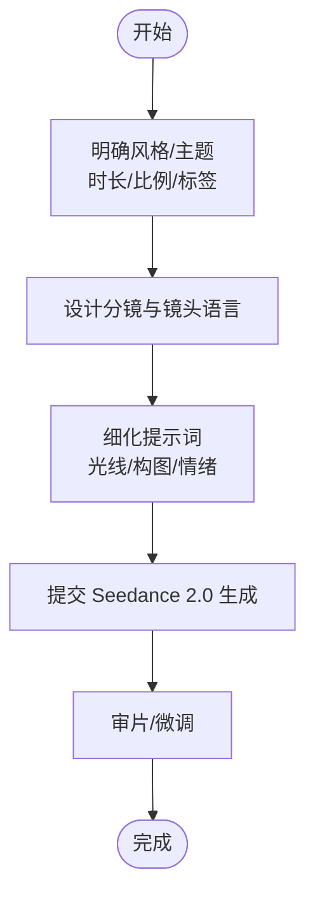
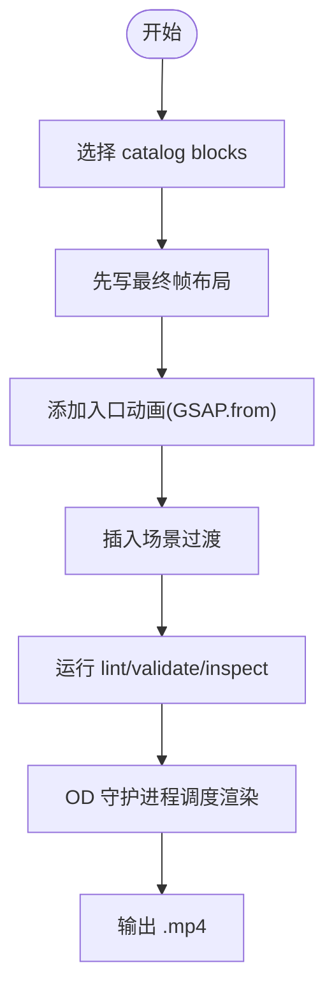
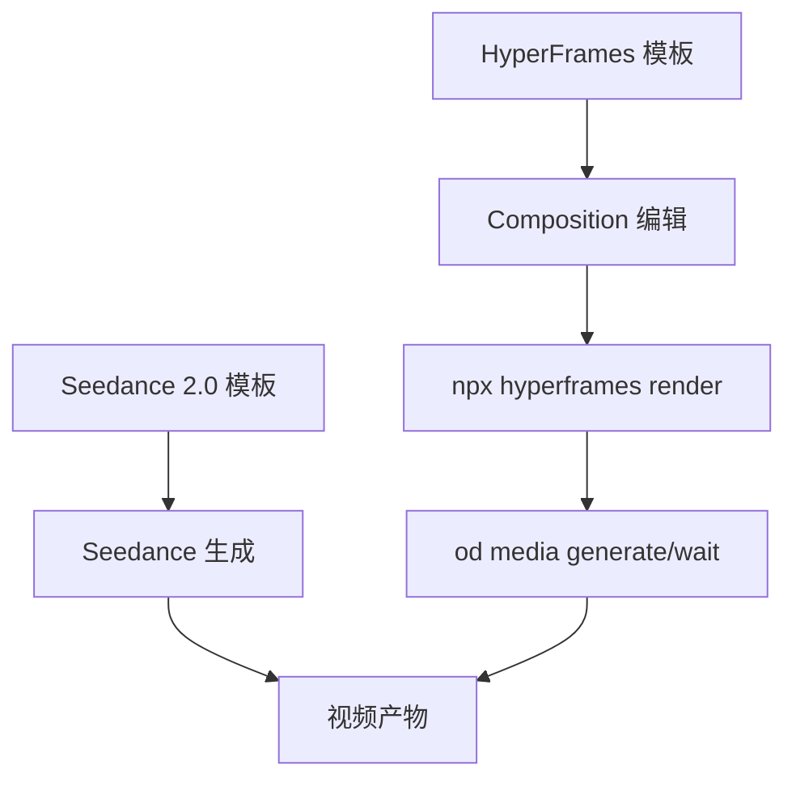

# 视频生成系统

<cite>
**本文引用的文件**
- [prompt-templates/video/seedance-2-0-15-second-cinematic-japanese-romance-short-film.json](file://prompt-templates/video/seedance-2-0-15-second-cinematic-japanese-romance-short-film.json)
- [prompt-templates/video/seedance-2-0-80-year-old-rapper-mv.json](file://prompt-templates/video/seedance-2-0-80-year-old-rapper-mv.json)
- [prompt-templates/video/viral-k-pop-dance-choreography.json](file://prompt-templates/video/viral-k-pop-dance-choreography.json)
- [prompt-templates/video/cyberpunk-game-trailer-script.json](file://prompt-templates/video/cyberpunk-game-trailer-script.json)
- [prompt-templates/video/hollywood-haute-couture-fantasy-video-prompt.json](file://prompt-templates/video/hollywood-haute-couture-fantasy-video-prompt.json)
- [prompt-templates/video/hyperframes-saas-product-promo-30s.json](file://prompt-templates/video/hyperframes-saas-product-promo-30s.json)
- [prompt-templates/video/hyperframes-app-showcase-three-phones.json](file://prompt-templates/video/hyperframes-app-showcase-three-phones.json)
- [prompt-templates/video/hyperframes-brand-sizzle-reel.json](file://prompt-templates/video/hyperframes-brand-sizzle-reel.json)
- [prompt-templates/video/hyperframes-data-bar-chart-race.json](file://prompt-templates/video/hyperframes-data-bar-chart-race.json)
- [skills/hyperframes/SKILL.md](file://skills/hyperframes/SKILL.md)
</cite>

## 目录
1. [简介](#简介)
2. [项目结构](#项目结构)
3. [核心组件](#核心组件)
4. [架构总览](#架构总览)
5. [详细组件分析](#详细组件分析)
6. [依赖关系分析](#依赖关系分析)
7. [性能考虑](#性能考虑)
8. [故障排除指南](#故障排除指南)
9. [结论](#结论)
10. [附录](#附录)

## 简介
本文件面向“视频生成系统”的使用者与开发者，系统性梳理仓库中已有的视频生成能力与工作流，重点覆盖以下方面：
- 模型与能力：以 Seedance 2.0、HyperFrames 为核心，结合仓库中的视频提示模板，说明文本到视频（t2v）、图像到视频（i2v）等核心能力边界与适用场景。
- 提示模板：对 39 个视频提示模板进行分类与解读，帮助用户快速选择合适的模板构建短视频、演示视频、动画、数据可视化等。
- 参数设置：说明视频长度、分辨率、帧率等关键参数在模板与渲染流程中的体现方式。
- 渲染器：HyperFrames 本地渲染器的使用方法、命令与工作流，以及在 Open Design 集成环境下的调度方式。
- 代码示例与最佳实践：通过模板路径与技能文档指引，提供可复用的实现思路与排障建议。

## 项目结构
本仓库围绕“提示模板 + 技能（Skill） + 渲染器”组织视频生成相关资产：
- 提示模板（prompt-templates/video/*.json）：定义了不同风格与用途的视频生成提示，覆盖 Seedance 2.0 与 HyperFrames 两类模型。
- 技能（skills/hyperframes/SKILL.md）：HyperFrames 的创作与渲染指南，包括结构、规则、质量检查、过渡与动画约束等。
- 渲染与集成：HyperFrames 在 Open Design 环境下的调度与渲染流程，避免沙箱限制导致的渲染失败。

图表来源
- [prompt-templates/video/seedance-2-0-15-second-cinematic-japanese-romance-short-film.json:1-23](file://prompt-templates/video/seedance-2-0-15-second-cinematic-japanese-romance-short-film.json#L1-L23)
- [prompt-templates/video/hyperframes-saas-product-promo-30s.json:1-19](file://prompt-templates/video/hyperframes-saas-product-promo-30s.json#L1-L19)
- [skills/hyperframes/SKILL.md:38-98](file://skills/hyperframes/SKILL.md#L38-L98)

章节来源
- [prompt-templates/video/seedance-2-0-15-second-cinematic-japanese-romance-short-film.json:1-23](file://prompt-templates/video/seedance-2-0-15-second-cinematic-japanese-romance-short-film.json#L1-L23)
- [prompt-templates/video/hyperframes-saas-product-promo-30s.json:1-19](file://prompt-templates/video/hyperframes-saas-product-promo-30s.json#L1-L19)
- [skills/hyperframes/SKILL.md:38-98](file://skills/hyperframes/SKILL.md#L38-L98)

## 核心组件
- Seedance 2.0
  - 用于文本到视频（t2v），强调高细节、多场景分镜、角色一致性与氛围营造。典型场景包括短片、动作/赛博朋克、幻想/时尚大片等。
  - 参考模板：日式纯爱短片、80 岁说唱 MV、K-pop 舞蹈分镜、赛博朋克游戏预告脚本、好莱坞高级定制幻想视频等。
- HyperFrames HTML
  - 以 HTML/CSS/GSAP 为核心的视频合成与渲染框架，支持标题卡、叠加字幕、语音合成、音浪同步视觉、场景过渡等。
  - 支持在 Open Design 环境下通过守护进程调度渲染，避免沙箱导致的浏览器渲染失败。
  - 参考模板：SaaS 产品宣传片、App 展示三屏、品牌节奏片、数据条形图竞速等。

章节来源
- [prompt-templates/video/seedance-2-0-15-second-cinematic-japanese-romance-short-film.json:1-23](file://prompt-templates/video/seedance-2-0-15-second-cinematic-japanese-romance-short-film.json#L1-L23)
- [prompt-templates/video/seedance-2-0-80-year-old-rapper-mv.json:1-23](file://prompt-templates/video/seedance-2-0-80-year-old-rapper-mv.json#L1-L23)
- [prompt-templates/video/viral-k-pop-dance-choreography.json:1-22](file://prompt-templates/video/viral-k-pop-dance-choreography.json#L1-L22)
- [prompt-templates/video/cyberpunk-game-trailer-script.json:1-24](file://prompt-templates/video/cyberpunk-game-trailer-script.json#L1-L24)
- [prompt-templates/video/hollywood-haute-couture-fantasy-video-prompt.json:1-24](file://prompt-templates/video/hollywood-haute-couture-fantasy-video-prompt.json#L1-L24)
- [prompt-templates/video/hyperframes-saas-product-promo-30s.json:1-19](file://prompt-templates/video/hyperframes-saas-product-promo-30s.json#L1-L19)
- [prompt-templates/video/hyperframes-app-showcase-three-phones.json:1-19](file://prompt-templates/video/hyperframes-app-showcase-three-phones.json#L1-L19)
- [prompt-templates/video/hyperframes-brand-sizzle-reel.json:1-19](file://prompt-templates/video/hyperframes-brand-sizzle-reel.json#L1-L19)
- [prompt-templates/video/hyperframes-data-bar-chart-race.json:1-19](file://prompt-templates/video/hyperframes-data-bar-chart-race.json#L1-L19)
- [skills/hyperframes/SKILL.md:1-494](file://skills/hyperframes/SKILL.md#L1-L494)

## 架构总览
从“提示模板”到“渲染产物”的端到端流程如下：

图表来源
- [skills/hyperframes/SKILL.md:38-98](file://skills/hyperframes/SKILL.md#L38-L98)

章节来源
- [skills/hyperframes/SKILL.md:38-98](file://skills/hyperframes/SKILL.md#L38-L98)

## 详细组件分析

### Seedance 2.0 组件分析
- 特点
  - 强调“多场景分镜 + 角色一致性 + 氛围感”，适合短片、动作/赛博朋克、幻想/时尚大片等。
  - 对镜头语言、光线、情绪与细节有较高要求，适合需要高质量画面与叙事连贯性的场景。
- 典型模板与场景
  - 日式纯爱短片：强调细腻表情、呼吸同步、浅景深与暖光。
  - 80 岁说唱 MV：赛博朋克风格、节奏感强、动作干净利落。
  - K-pop 舞蹈分镜：格子参考图、动作指示箭头、单色 3D 渲染。
  - 赛博朋克游戏预告：UI 动画、装备切换、环境从白空过渡到贫民窟。
  - 好莱坞高级定制幻想：液体瓷器裙摆、水墨飞溅、维度溶解。
- 使用建议
  - 明确时长（如 15 秒）、比例（16:9）、风格标签（如 cinematic、cyberpunk、fantasy）。
  - 注意角色一致性、口型同步、呼吸与微表情的自然度。
  - 若需 i2v，可在模板基础上加入静态参考图或关键帧提示。

图表来源
- [prompt-templates/video/seedance-2-0-15-second-cinematic-japanese-romance-short-film.json:1-23](file://prompt-templates/video/seedance-2-0-15-second-cinematic-japanese-romance-short-film.json#L1-L23)
- [prompt-templates/video/seedance-2-0-80-year-old-rapper-mv.json:1-23](file://prompt-templates/video/seedance-2-0-80-year-old-rapper-mv.json#L1-L23)
- [prompt-templates/video/viral-k-pop-dance-choreography.json:1-22](file://prompt-templates/video/viral-k-pop-dance-choreography.json#L1-L22)
- [prompt-templates/video/cyberpunk-game-trailer-script.json:1-24](file://prompt-templates/video/cyberpunk-game-trailer-script.json#L1-L24)
- [prompt-templates/video/hollywood-haute-couture-fantasy-video-prompt.json:1-24](file://prompt-templates/video/hollywood-haute-couture-fantasy-video-prompt.json#L1-L24)

章节来源
- [prompt-templates/video/seedance-2-0-15-second-cinematic-japanese-romance-short-film.json:1-23](file://prompt-templates/video/seedance-2-0-15-second-cinematic-japanese-romance-short-film.json#L1-L23)
- [prompt-templates/video/seedance-2-0-80-year-old-rapper-mv.json:1-23](file://prompt-templates/video/seedance-2-0-80-year-old-rapper-mv.json#L1-L23)
- [prompt-templates/video/viral-k-pop-dance-choreography.json:1-22](file://prompt-templates/video/viral-k-pop-dance-choreography.json#L1-L22)
- [prompt-templates/video/cyberpunk-game-trailer-script.json:1-24](file://prompt-templates/video/cyberpunk-game-trailer-script.json#L1-L24)
- [prompt-templates/video/hollywood-haute-couture-fantasy-video-prompt.json:1-24](file://prompt-templates/video/hollywood-haute-couture-fantasy-video-prompt.json#L1-L24)

### HyperFrames 组件分析
- 特点
  - 以 HTML 为“源代码”，通过 GSAP 时间线与 CSS 实现动画，渲染器负责捕帧与编码。
  - 在 Open Design 中通过守护进程调度，避免沙箱导致的浏览器渲染失败。
  - 强调“入口动画 + 过渡衔接 + 严格规则”，确保可重复、可审计、可渲染。
- 关键规则与约定
  - 时间线必须注册且暂停；时长由 data-duration 决定；禁止无限循环与异步构建时间线。
  - 场景间必须使用过渡；除最后一场景外不得提前“退出动画”。
  - 禁止随机与时序逻辑；字体嵌入由编译器处理。
- 典型模板与场景
  - SaaS 产品宣传片：UI 3D 展示、节拍同步动态文字、应用截图展示、片尾徽标。
  - App 展示三屏：三个悬浮手机轮流展示功能，节拍同步标注。
  - 品牌节奏片：快剪辑、节拍同步动态文字、音浪驱动缩放、多种着色器过渡。
  - 数据条形图竞速：纽约时报风格标题、分段入场、数值计数、注释框。
- 使用建议
  - 优先使用内置 catalog blocks（如 app-showcase、ui-3d-reveal、logo-outro、data-chart 等）。
  - 严格遵循“布局先于动画”原则，先写出最终帧再添加动效。
  - 使用 lint/validate/inspect 流程进行质量把关。

图表来源
- [skills/hyperframes/SKILL.md:172-391](file://skills/hyperframes/SKILL.md#L172-L391)
- [prompt-templates/video/hyperframes-saas-product-promo-30s.json:1-19](file://prompt-templates/video/hyperframes-saas-product-promo-30s.json#L1-L19)
- [prompt-templates/video/hyperframes-app-showcase-three-phones.json:1-19](file://prompt-templates/video/hyperframes-app-showcase-three-phones.json#L1-L19)
- [prompt-templates/video/hyperframes-brand-sizzle-reel.json:1-19](file://prompt-templates/video/hyperframes-brand-sizzle-reel.json#L1-L19)
- [prompt-templates/video/hyperframes-data-bar-chart-race.json:1-19](file://prompt-templates/video/hyperframes-data-bar-chart-race.json#L1-L19)

章节来源
- [skills/hyperframes/SKILL.md:172-391](file://skills/hyperframes/SKILL.md#L172-L391)
- [prompt-templates/video/hyperframes-saas-product-promo-30s.json:1-19](file://prompt-templates/video/hyperframes-saas-product-promo-30s.json#L1-L19)
- [prompt-templates/video/hyperframes-app-showcase-three-phones.json:1-19](file://prompt-templates/video/hyperframes-app-showcase-three-phones.json#L1-L19)
- [prompt-templates/video/hyperframes-brand-sizzle-reel.json:1-19](file://prompt-templates/video/hyperframes-brand-sizzle-reel.json#L1-L19)
- [prompt-templates/video/hyperframes-data-bar-chart-race.json:1-19](file://prompt-templates/video/hyperframes-data-bar-chart-race.json#L1-L19)

### 模板与参数对照表
以下为仓库中部分视频模板与其关键参数的映射，便于快速检索与配置：

- Seedance 2.0
  - 日式纯爱短片：15 秒、16:9、cinematic、cinematic-romance
  - 80 岁说唱 MV：16:9、cyberpunk、action
  - K-pop 舞蹈分镜：16:9、fantasy、3d-render
  - 赛博朋克游戏预告：16:9、cinematic、cyberpunk、3d-render
  - 好莱坞高级定制幻想：16:9、cinematic、fantasy、3d-render
- HyperFrames
  - SaaS 产品宣传片：1920×1080、30fps、线性风格、节拍同步
  - App 展示三屏：1920×1080、30fps、3D 手机、节拍同步
  - 品牌节奏片：1920×1080、30fps、快剪辑、音浪驱动
  - 数据条形图竞速：1920×1080、30fps、纽约时报风格标题

章节来源
- [prompt-templates/video/seedance-2-0-15-second-cinematic-japanese-romance-short-film.json:1-23](file://prompt-templates/video/seedance-2-0-15-second-cinematic-japanese-romance-short-film.json#L1-L23)
- [prompt-templates/video/seedance-2-0-80-year-old-rapper-mv.json:1-23](file://prompt-templates/video/seedance-2-0-80-year-old-rapper-mv.json#L1-L23)
- [prompt-templates/video/viral-k-pop-dance-choreography.json:1-22](file://prompt-templates/video/viral-k-pop-dance-choreography.json#L1-L22)
- [prompt-templates/video/cyberpunk-game-trailer-script.json:1-24](file://prompt-templates/video/cyberpunk-game-trailer-script.json#L1-L24)
- [prompt-templates/video/hollywood-haute-couture-fantasy-video-prompt.json:1-24](file://prompt-templates/video/hollywood-haute-couture-fantasy-video-prompt.json#L1-L24)
- [prompt-templates/video/hyperframes-saas-product-promo-30s.json:1-19](file://prompt-templates/video/hyperframes-saas-product-promo-30s.json#L1-L19)
- [prompt-templates/video/hyperframes-app-showcase-three-phones.json:1-19](file://prompt-templates/video/hyperframes-app-showcase-three-phones.json#L1-L19)
- [prompt-templates/video/hyperframes-brand-sizzle-reel.json:1-19](file://prompt-templates/video/hyperframes-brand-sizzle-reel.json#L1-L19)
- [prompt-templates/video/hyperframes-data-bar-chart-race.json:1-19](file://prompt-templates/video/hyperframes-data-bar-chart-race.json#L1-L19)

## 依赖关系分析
- 模板到模型
  - Seedance 2.0：适用于复杂叙事与画面风格的 t2v。
  - HyperFrames：适用于结构化场景、数据可视化与产品演示。
- 渲染链路
  - HyperFrames 在 OD 环境下通过守护进程调度渲染，避免沙箱导致的渲染失败。
  - 渲染器命令（如 lint/validate/inspect/render）在本地 Shell 中执行，但渲染主流程由守护进程接管。

图表来源
- [prompt-templates/video/seedance-2-0-15-second-cinematic-japanese-romance-short-film.json:1-23](file://prompt-templates/video/seedance-2-0-15-second-cinematic-japanese-romance-short-film.json#L1-L23)
- [prompt-templates/video/hyperframes-saas-product-promo-30s.json:1-19](file://prompt-templates/video/hyperframes-saas-product-promo-30s.json#L1-L19)
- [skills/hyperframes/SKILL.md:38-98](file://skills/hyperframes/SKILL.md#L38-L98)

章节来源
- [skills/hyperframes/SKILL.md:38-98](file://skills/hyperframes/SKILL.md#L38-L98)

## 性能考虑
- HyperFrames
  - 严格的时间线构造与“入口动画 + 过渡”规则，有助于减少无效渲染与重绘。
  - 使用 catalog blocks 可降低自定义复杂度，提升渲染稳定性。
  - 通过 lint/validate/inspect 提前发现布局溢出与对比度问题，避免反复渲染。
- Seedance 2.0
  - 多场景分镜与高细节提示会显著增加生成时长，建议在保证质量的前提下控制时长与镜头数量。
  - 角色一致性与口型同步要求较高，建议在模板基础上进行小步迭代。

## 故障排除指南
- HyperFrames 渲染失败（沙箱导致浏览器卡住）
  - 使用 OD 守护进程调度渲染，避免沙箱限制。
  - 确保所有时间线注册为暂停状态，时长由 data-duration 决定。
  - 不要使用无限循环与异步构建时间线。
- 布局溢出/文字裁切
  - 使用 inspect 工具定位溢出帧与元素，调整容器尺寸、内边距或字号。
  - 对动态文案使用自动适配工具，避免硬换行导致的额外断行。
- 对比度不达标
  - 使用 validate 工具检查 WCAG 对比度，按提示调整颜色或使用家族色。
- 动画节奏与节拍
  - 使用 catalog blocks 的节拍同步能力，确保场景切换与音效落在节拍上。
  - 对于音浪驱动效果，预先映射频段幅度到动画属性，避免随机与时序逻辑。

章节来源
- [skills/hyperframes/SKILL.md:414-471](file://skills/hyperframes/SKILL.md#L414-L471)

## 结论
本仓库提供了两类成熟的视频生成路径：以 Seedance 2.0 为主的文本到视频（t2v）与以 HyperFrames 为主的 HTML 视频合成（含产品演示、数据可视化、品牌节奏片等）。通过规范化的提示模板与严格的 HyperFrames 规则，用户可以在 Open Design 环境下稳定地生成高质量视频内容。建议优先使用模板与 catalog blocks，配合 lint/validate/inspect 流程，以获得更可靠的渲染结果。

## 附录
- 快速开始（HyperFrames）
  - 选择模板后，使用内置 catalog blocks 初始化并编辑 composition，随后通过 OD 守护进程调度渲染。
  - 参考路径：[skills/hyperframes/SKILL.md:38-98](file://skills/hyperframes/SKILL.md#L38-L98)
- 模板清单（示例）
  - Seedance 2.0：日式纯爱短片、80 岁说唱 MV、K-pop 舞蹈分镜、赛博朋克游戏预告、好莱坞高级定制幻想。
  - HyperFrames：SaaS 产品宣传片、App 展示三屏、品牌节奏片、数据条形图竞速。
  - 参考路径：
    - [prompt-templates/video/seedance-2-0-15-second-cinematic-japanese-romance-short-film.json:1-23](file://prompt-templates/video/seedance-2-0-15-second-cinematic-japanese-romance-short-film.json#L1-L23)
    - [prompt-templates/video/hyperframes-saas-product-promo-30s.json:1-19](file://prompt-templates/video/hyperframes-saas-product-promo-30s.json#L1-L19)
    - [prompt-templates/video/hyperframes-app-showcase-three-phones.json:1-19](file://prompt-templates/video/hyperframes-app-showcase-three-phones.json#L1-L19)
    - [prompt-templates/video/hyperframes-brand-sizzle-reel.json:1-19](file://prompt-templates/video/hyperframes-brand-sizzle-reel.json#L1-L19)
    - [prompt-templates/video/hyperframes-data-bar-chart-race.json:1-19](file://prompt-templates/video/hyperframes-data-bar-chart-race.json#L1-L19)