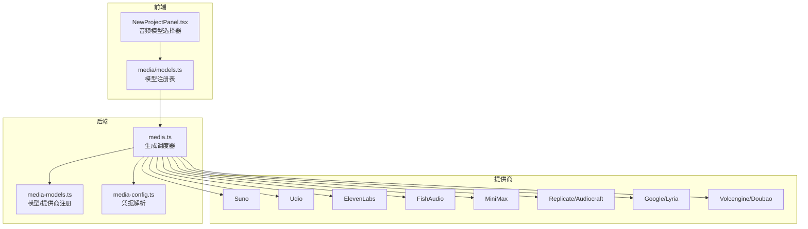
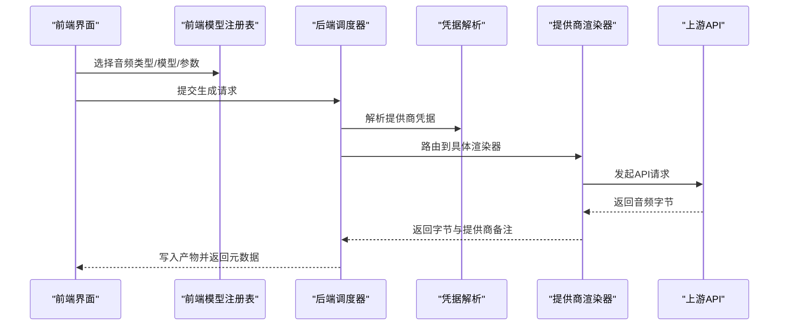
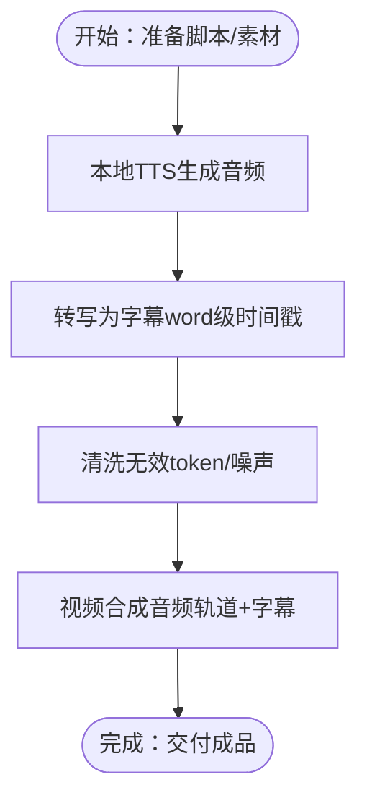
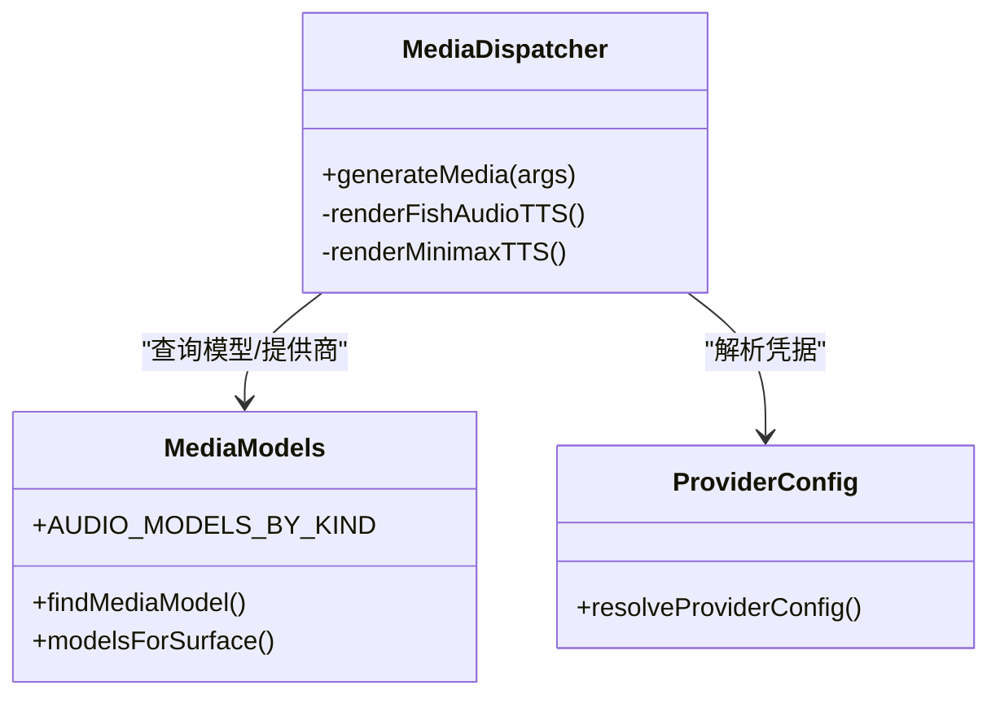

# 音频生成系统

<cite>
**本文档引用的文件**
- [apps/daemon/src/media-models.ts](file://apps/daemon/src/media-models.ts)
- [apps/daemon/src/media.ts](file://apps/daemon/src/media.ts)
- [apps/daemon/src/media-config.ts](file://apps/daemon/src/media-config.ts)
- [apps/web/src/media/models.ts](file://apps/web/src/media/models.ts)
- [apps/web/src/components/NewProjectPanel.tsx](file://apps/web/src/components/NewProjectPanel.tsx)
- [skills/hyperframes/references/transcript-guide.md](file://skills/hyperframes/references/transcript-guide.md)
- [skills/hyperframes/references/tts.md](file://skills/hyperframes/references/tts.md)
</cite>

## 目录
1. [简介](#简介)
2. [项目结构](#项目结构)
3. [核心组件](#核心组件)
4. [架构总览](#架构总览)
5. [详细组件分析](#详细组件分析)
6. [依赖关系分析](#依赖关系分析)
7. [性能考虑](#性能考虑)
8. [故障排除指南](#故障排除指南)
9. [结论](#结论)
10. [附录](#附录)

## 简介
本文件面向音频生成系统，系统性梳理并解释以下能力：
- 音乐生成（music）：Suno、Udio、Lyria（Google）等模型
- 语音合成（speech）：OpenAI GPT-4o mini、MiniMax、FishAudio、ElevenLabs、Doubao（Volcengine）等
- 音效生成（sfx）：ElevenLabs SFX、Audiocraft（Meta）
- 高级功能：语音克隆（voice-clone）、多语言支持、情感/风格表达
- 参数配置：音频时长、质量、风格等
- 与视频生成的音频轨道集成：原生音频输出、字幕/转写、本地TTS与转写

## 项目结构
音频生成系统由“前端选择器 + 后端调度器 + 提供商适配层 + 凭据管理”构成，核心文件分布如下：
- 前端模型注册与选择器：apps/web/src/media/models.ts、apps/web/src/components/NewProjectPanel.tsx
- 后端模型注册与调度：apps/daemon/src/media-models.ts、apps/daemon/src/media.ts
- 凭据存储与解析：apps/daemon/src/media-config.ts
- 视频/音频工作流参考：skills/hyperframes/references/transcript-guide.md、skills/hyperframes/references/tts.md

图表来源
- [apps/web/src/components/NewProjectPanel.tsx:1490-1528](file://apps/web/src/components/NewProjectPanel.tsx#L1490-L1528)
- [apps/web/src/media/models.ts:377-397](file://apps/web/src/media/models.ts#L377-L397)
- [apps/daemon/src/media.ts:210-473](file://apps/daemon/src/media.ts#L210-L473)
- [apps/daemon/src/media-models.ts:83-133](file://apps/daemon/src/media-models.ts#L83-L133)
- [apps/daemon/src/media-config.ts:220-232](file://apps/daemon/src/media-config.ts#L220-L232)

章节来源
- [apps/web/src/media/models.ts:377-397](file://apps/web/src/media/models.ts#L377-L397)
- [apps/daemon/src/media-models.ts:83-133](file://apps/daemon/src/media-models.ts#L83-L133)
- [apps/daemon/src/media.ts:210-473](file://apps/daemon/src/media.ts#L210-L473)

## 核心组件
- 模型注册表（后端）：定义所有可用模型、能力标签（caps）、默认项、提供商映射
- 模型注册表（前端）：与后端镜像，用于UI展示与选择
- 生成调度器：根据 surface/audioKind/model 解析提供商，调用对应渲染器，落盘输出
- 凭据解析器：按优先级读取环境变量/本地存储/OAuth，返回 { apiKey, baseUrl }
- Stub 回退：未集成或失败时生成占位音频/视频，保证框架可用性

章节来源
- [apps/daemon/src/media-models.ts:83-133](file://apps/daemon/src/media-models.ts#L83-L133)
- [apps/daemon/src/media.ts:210-473](file://apps/daemon/src/media.ts#L210-L473)
- [apps/daemon/src/media-config.ts:220-232](file://apps/daemon/src/media-config.ts#L220-L232)

## 架构总览
音频生成的端到端流程：
- 用户在前端选择音频类型（speech/music/sfx）与模型
- 前端将参数（prompt、duration、voice、audioKind 等）提交给后端
- 后端校验模型与参数，解析提供商凭据
- 调度器路由到具体提供商渲染器（如 ElevenLabs、FishAudio、MiniMax 等）
- 渲染器发起上游 API 请求，接收音频字节流
- 写入项目目录，返回元数据（大小、mime、提供商备注）

图表来源
- [apps/web/src/components/NewProjectPanel.tsx:1490-1528](file://apps/web/src/components/NewProjectPanel.tsx#L1490-L1528)
- [apps/daemon/src/media.ts:332-404](file://apps/daemon/src/media.ts#L332-L404)
- [apps/daemon/src/media-config.ts:220-232](file://apps/daemon/src/media-config.ts#L220-L232)

## 详细组件分析

### 功能分类与模型能力
- 音乐生成（music）
  - Suno：默认模型，支持音乐生成
  - Udio：音乐生成
  - Google Lyria：音乐生成
- 语音合成（speech）
  - OpenAI GPT-4o mini：表达力强的 TTS
  - MiniMax：默认 TTS，支持指定 voice_id
  - FishAudio：支持语音克隆（voice-clone）
  - ElevenLabs：支持语音克隆（voice-clone）
  - Doubao（Volcengine）：TTS
- 音效生成（sfx）
  - ElevenLabs SFX：音效
  - Audiocraft（Replicate）：音效/音乐

章节来源
- [apps/daemon/src/media-models.ts:83-101](file://apps/daemon/src/media-models.ts#L83-L101)
- [apps/web/src/media/models.ts:377-395](file://apps/web/src/media/models.ts#L377-L395)

### 语音克隆与多语言支持
- 语音克隆（voice-clone）
  - FishAudio/ElevenLabs 在模型能力中声明 caps: ['tts', 'voice-clone']
  - 克隆通过 ctx.voice 传递 reference_id 或 voice_id，具体取决于提供商
- 多语言支持
  - ElevenLabs 支持多种声音风格与语种
  - MiniMax 的 voice_id 可选不同性别/口音
  - HyperFrames TTS 支持多语言语音（kokoro-onnx），并自动检测语言前缀

章节来源
- [apps/daemon/src/media-models.ts:93-95](file://apps/daemon/src/media-models.ts#L93-L95)
- [apps/daemon/src/media.ts:1232-1312](file://apps/daemon/src/media.ts#L1232-L1312)
- [skills/hyperframes/references/tts.md:1-76](file://skills/hyperframes/references/tts.md#L1-L76)

### 情感/风格表达
- OpenAI GPT-4o mini TTS 支持通过 instructions 字段传入风格化指令（仅在特定模型上生效）
- ElevenLabs 通过声音选择与参考音频实现情感/风格迁移
- MiniMax 通过 voice_id 与语速/音量/音高参数控制

章节来源
- [apps/daemon/src/media.ts:689-756](file://apps/daemon/src/media.ts#L689-L756)
- [apps/daemon/src/media.ts:1232-1312](file://apps/daemon/src/media.ts#L1232-L1312)

### 参数配置：时长、质量、风格
- 音频时长（秒）
  - 后端对 duration 进行桶化限制（AUDIO_DURATIONS_SEC）
  - 前端 NewProjectPanel 提供下拉选择
- 质量与格式
  - MiniMax：固定采样率与 MP3 输出
  - FishAudio：MP3 位率可配置
  - OpenAI：根据文件扩展名选择输出格式（mp3/flac/aac/opus/ogg）
- 风格/能力
  - ElevenLabs：通过声音 ID 与参考音频实现风格化
  - Suno/Udio：通过 prompt 与风格提示词影响生成

章节来源
- [apps/daemon/src/media-models.ts:105-105](file://apps/daemon/src/media-models.ts#L105-L105)
- [apps/web/src/components/NewProjectPanel.tsx:1510-1514](file://apps/web/src/components/NewProjectPanel.tsx#L1510-L1514)
- [apps/daemon/src/media.ts:1232-1312](file://apps/daemon/src/media.ts#L1232-L1312)
- [apps/daemon/src/media.ts:1332-1382](file://apps/daemon/src/media.ts#L1332-L1382)
- [apps/daemon/src/media.ts:689-756](file://apps/daemon/src/media.ts#L689-L756)

### 与视频生成的音频轨道集成
- 原生音频输出
  - 后端生成音频文件（.mp3/.wav），并记录 providerNote 与 MIME 类型
- 字幕/转写
  - HyperFrames 提供本地 whisper.cpp 转写与格式转换，支持 word-level 时间戳
  - 支持导入 OpenAI/Groq Whisper 结果，清洗无效 token
- 本地 TTS 与字幕联动
  - HyperFrames 提供本地 kokoro-onnx TTS，可直接生成带时间戳的字幕

图表来源
- [skills/hyperframes/references/tts.md:45-76](file://skills/hyperframes/references/tts.md#L45-L76)
- [skills/hyperframes/references/transcript-guide.md:1-152](file://skills/hyperframes/references/transcript-guide.md#L1-L152)

章节来源
- [apps/daemon/src/media.ts:458-472](file://apps/daemon/src/media.ts#L458-L472)
- [skills/hyperframes/references/transcript-guide.md:1-152](file://skills/hyperframes/references/transcript-guide.md#L1-L152)
- [skills/hyperframes/references/tts.md:1-76](file://skills/hyperframes/references/tts.md#L1-L76)

### API 调用方法与实际使用示例
- 前端选择器
  - NewProjectPanel.tsx 提供音频类型切换、模型选择、时长选择、voice 输入
- 后端生成接口
  - generateMedia(args) 接收 surface='audio'、model、prompt、duration、voice、audioKind 等
  - 自动解析提供商凭据，路由到对应渲染器
- 实际使用步骤
  1) 在前端选择 speech/music/sfx 与模型
  2) 设置时长与 voice（如需克隆）
  3) 提交生成请求，后端返回产物路径与元数据
  4) 将音频与字幕/转写集成到视频轨道

章节来源
- [apps/web/src/components/NewProjectPanel.tsx:1490-1528](file://apps/web/src/components/NewProjectPanel.tsx#L1490-L1528)
- [apps/daemon/src/media.ts:210-473](file://apps/daemon/src/media.ts#L210-L473)
- [apps/daemon/src/media-config.ts:220-232](file://apps/daemon/src/media-config.ts#L220-L232)

## 依赖关系分析
- 模型注册表（前后端镜像）
  - 后端：AUDIO_MODELS_BY_KIND 定义各类型模型与提供商映射
  - 前端：AUDIO_MODELS_BY_KIND 与后端一致，用于 UI 展示
- 调度器耦合
  - generateMedia 统一入口，按 provider 分发
  - modelsForSurface 与 findMediaModel 保证 surface/audioKind 与模型匹配
- 凭据依赖
  - resolveProviderConfig 优先级：环境变量 > 存储配置 > OAuth
  - 不同提供商有独立的环境变量键名（如 OD_ELEVENLABS_API_KEY、OD_FISHAUDIO_API_KEY）

图表来源
- [apps/daemon/src/media-models.ts:83-133](file://apps/daemon/src/media-models.ts#L83-L133)
- [apps/daemon/src/media.ts:210-473](file://apps/daemon/src/media.ts#L210-L473)
- [apps/daemon/src/media-config.ts:220-232](file://apps/daemon/src/media-config.ts#L220-L232)

章节来源
- [apps/daemon/src/media-models.ts:110-133](file://apps/daemon/src/media-models.ts#L110-L133)
- [apps/daemon/src/media.ts:332-404](file://apps/daemon/src/media.ts#L332-L404)
- [apps/daemon/src/media-config.ts:220-232](file://apps/daemon/src/media-config.ts#L220-L232)

## 性能考虑
- 数值参数桶化
  - 对长度/时长进行允许集合裁剪，避免超大请求导致上游限流或超时
- 异步轮询与超时
  - 视频类提供商采用轮询策略，并设置最大等待时间，防止长时间挂起
- 占位回退
  - 未集成或失败时写入小体积占位音频，保证 UI 流程不中断
- 本地渲染限制
  - HyperFrames 渲染限制 workers=1，避免内存峰值过高；超时统一处理

章节来源
- [apps/daemon/src/media.ts:267-280](file://apps/daemon/src/media.ts#L267-L280)
- [apps/daemon/src/media.ts:835-840](file://apps/daemon/src/media.ts#L835-L840)
- [apps/daemon/src/media.ts:1405-1405](file://apps/daemon/src/media.ts#L1405-L1405)
- [apps/daemon/src/media.ts:1548-1559](file://apps/daemon/src/media.ts#L1548-L1559)

## 故障排除指南
- 缺少提供商密钥
  - 症状：抛出“no ... API key”错误
  - 处理：在设置中填写密钥，或通过环境变量注入
- 认证失败/参数错误
  - 症状：上游返回非 200 或逻辑错误（如 MiniMax base_resp.status_code !== 0）
  - 处理：检查模型 ID、voice_id、时长是否在允许范围内
- 生成失败回退
  - 症状：写入占位音频，providerNote 标注 [stub]
  - 处理：开启 OD_MEDIA_ALLOW_STUBS=1 以允许占位；否则请配置真实提供商
- 超时/队列过长
  - 症状：Groq/Volcengine 视频任务超时
  - 处理：提高 OD_GROK_VIDEO_MAX_POLL_MS 或 OD_VOLCENGINE_VIDEO_MAX_POLL_MS

章节来源
- [apps/daemon/src/media.ts:397-425](file://apps/daemon/src/media.ts#L397-L425)
- [apps/daemon/src/media.ts:1289-1292](file://apps/daemon/src/media.ts#L1289-L1292)
- [apps/daemon/src/media.ts:835-840](file://apps/daemon/src/media.ts#L835-L840)
- [apps/daemon/src/media.ts:1160-1167](file://apps/daemon/src/media.ts#L1160-L1167)

## 结论
该音频生成系统以统一调度器为核心，通过前后端模型注册表保持一致性，支持音乐、语音、音效三大类别，并覆盖语音克隆、多语言、情感风格等高级能力。结合 HyperFrames 的本地 TTS/转写/字幕工具链，可高效完成从音频到视频轨道的集成。建议在生产环境中：
- 明确各提供商的环境变量与默认 Base URL
- 使用桶化参数避免异常请求
- 配置合理的轮询与超时策略
- 利用占位回退保障开发体验，上线后关闭占位模式

## 附录

### 常用环境变量与提供商映射
- OpenAI：OD_OPENAI_API_KEY / OPENAI_API_KEY / AZURE_API_KEY / AZURE_OPENAI_API_KEY
- ElevenLabs：OD_ELEVENLABS_API_KEY / ELEVENLABS_API_KEY
- FishAudio：OD_FISHAUDIO_API_KEY / FISH_AUDIO_API_KEY
- MiniMax：OD_MINIMAX_API_KEY / MINIMAX_API_KEY
- Suno：OD_SUNO_API_KEY
- Udio：OD_UDIO_API_KEY
- Replicate：OD_REPLICATE_API_TOKEN / REPLICATE_API_TOKEN

章节来源
- [apps/daemon/src/media-config.ts:45-74](file://apps/daemon/src/media-config.ts#L45-L74)