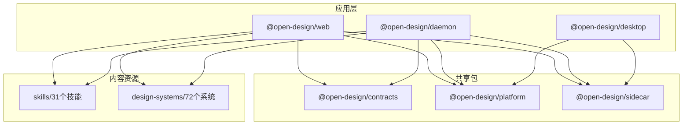
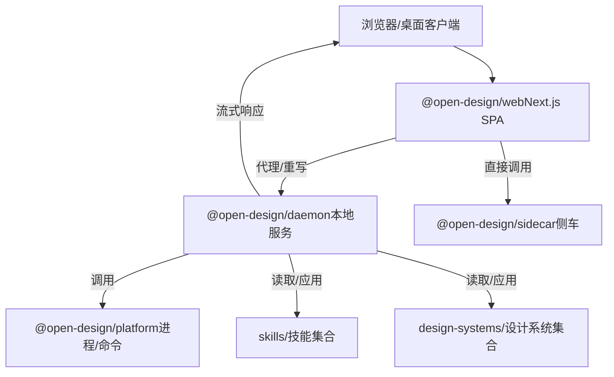
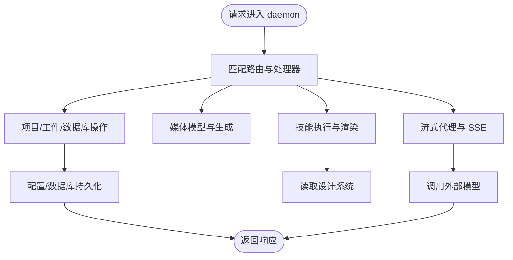
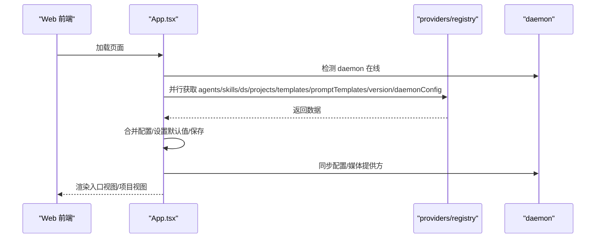
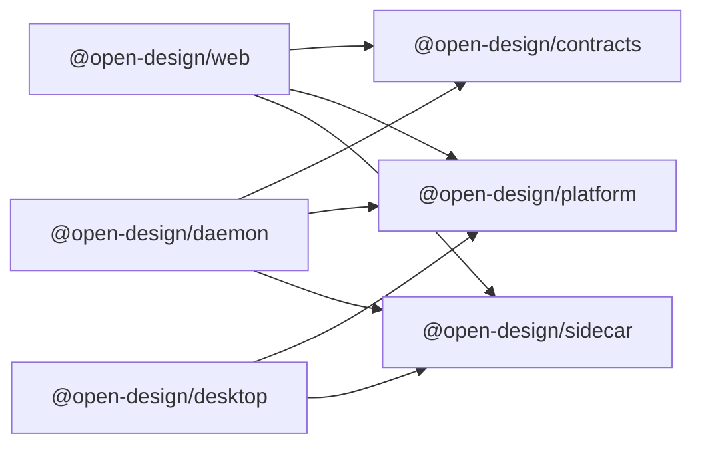

# 代码结构说明

<cite>
**本文引用的文件**
- [package.json](file://package.json)
- [pnpm-workspace.yaml](file://pnpm-workspace.yaml)
- [apps/daemon/package.json](file://apps/daemon/package.json)
- [apps/web/package.json](file://apps/web/package.json)
- [apps/desktop/package.json](file://apps/desktop/package.json)
- [packages/platform/package.json](file://packages/platform/package.json)
- [packages/contracts/package.json](file://packages/contracts/package.json)
- [packages/sidecar/package.json](file://packages/sidecar/package.json)
- [apps/daemon/tsconfig.json](file://apps/daemon/tsconfig.json)
- [apps/web/tsconfig.json](file://apps/web/tsconfig.json)
- [apps/daemon/src/app-config.ts](file://apps/daemon/src/app-config.ts)
- [apps/web/src/App.tsx](file://apps/web/src/App.tsx)
- [packages/platform/src/index.ts](file://packages/platform/src/index.ts)
- [design-systems/README.md](file://design-systems/README.md)
- [skills/blog-post/SKILL.md](file://skills/blog-post/SKILL.md)
- [design-systems/default/DESIGN.md](file://design-systems/default/DESIGN.md)
- [packages/contracts/src/index.ts](file://packages/contracts/src/index.ts)
- [packages/sidecar/src/index.ts](file://packages/sidecar/src/index.ts)
- [apps/daemon/src/server.ts](file://apps/daemon/src/server.ts)
- [apps/web/next.config.ts](file://apps/web/next.config.ts)
</cite>

## 目录
1. [简介](#简介)
2. [项目结构](#项目结构)
3. [核心组件](#核心组件)
4. [架构总览](#架构总览)
5. [详细组件分析](#详细组件分析)
6. [依赖分析](#依赖分析)
7. [性能考虑](#性能考虑)
8. [故障排查指南](#故障排查指南)
9. [结论](#结论)
10. [附录](#附录)

## 简介
本文件面向 Open Design 项目的贡献者与使用者，系统性梳理 monorepo 的组织方式、应用边界、类型系统与构建策略、包管理与依赖关系，并提供代码导航与定位特定功能的方法。Open Design 采用 pnpm workspace 管理多包，核心由三大应用组成：daemon（服务端与代理）、web（Next.js 前端）、desktop（Electron 桌面端），并辅以 packages/ 共享包、skills/ 设计技能集合、design-systems/ 设计系统集合。

## 项目结构
- 工作区与包管理
  - 使用 pnpm workspace 统一管理所有包，根目录通过工作区配置声明包含 packages/*、apps/*、tools/*、e2e。
  - 根 package.json 定义全局脚本与引擎约束，统一 Node 与 pnpm 版本范围。
- 应用层
  - apps/daemon：本地守护进程，提供 API、流式代理、项目与工件管理、媒体生成、商店首页技能等能力。
  - apps/web：Next.js 前端，SPA + 静态导出，开发时通过重写代理到 daemon；生产可切换为 server 输出模式。
  - apps/desktop：Electron 主进程入口，复用平台与 sidecar 能力。
- 共享包
  - packages/contracts：前后端契约（类型与协议），如商店首页提示词模板、问题表单等。
  - packages/platform：跨平台进程与命令封装、等待与日志工具。
  - packages/sidecar：前端/桌面侧车（sidecar）运行时桥接与协议。
- 技能与设计系统
  - skills/：31 个设计技能，每个技能以 SKILL.md 描述触发词、模式、平台、场景、预览与设计系统要求。
  - design-systems/：72 个设计系统，每个系统以 DESIGN.md 描述主题、配色、排版、组件、布局与响应式规则。
- 其他
  - tools/：开发与打包工具链。
  - e2e：端到端测试套件。
  - scripts/：同步、烘焙、校验等工程化脚本。

图表来源
- [pnpm-workspace.yaml:1-6](file://pnpm-workspace.yaml#L1-L6)
- [apps/daemon/package.json:1-57](file://apps/daemon/package.json#L1-L57)
- [apps/web/package.json:1-52](file://apps/web/package.json#L1-L52)
- [apps/desktop/package.json:1-34](file://apps/desktop/package.json#L1-L34)
- [packages/contracts/package.json:1-50](file://packages/contracts/package.json#L1-L50)
- [packages/platform/package.json:1-32](file://packages/platform/package.json#L1-L32)
- [packages/sidecar/package.json:1-32](file://packages/sidecar/package.json#L1-L32)

章节来源
- [pnpm-workspace.yaml:1-6](file://pnpm-workspace.yaml#L1-L6)
- [package.json:1-43](file://package.json#L1-L43)

## 核心组件
- apps/daemon
  - 职责：本地服务端、代理流式响应、项目与工件管理、媒体模型与生成、商店首页技能、数据库与配置持久化、部署与预览。
  - 关键点：TypeScript + JS 混编，严格类型检查；通过 sidecar 提供前端/桌面侧车能力；内置 Express 与流式处理。
- apps/web
  - 职责：Next.js 前端，SPA + 静态导出；开发时通过重写代理到 daemon；状态管理与路由驱动。
  - 关键点：React 组件树，集中于 App.tsx；通过 providers 与 registry 访问 daemon；支持 server 输出模式。
- apps/desktop
  - 职责：Electron 主进程，复用平台与 sidecar 能力。
- packages/contracts
  - 职责：定义前后端契约（类型与协议），如商店首页提示词模板、问题表单等。
- packages/platform
  - 职责：进程与命令封装、进程树收集、HTTP 等待、日志读取等通用能力。
- packages/sidecar
  - 职责：前端/桌面侧车运行时桥接与协议，与 daemon 协同。

章节来源
- [apps/daemon/package.json:1-57](file://apps/daemon/package.json#L1-L57)
- [apps/web/package.json:1-52](file://apps/web/package.json#L1-L52)
- [apps/desktop/package.json:1-34](file://apps/desktop/package.json#L1-L34)
- [packages/contracts/package.json:1-50](file://packages/contracts/package.json#L1-L50)
- [packages/platform/package.json:1-32](file://packages/platform/package.json#L1-L32)
- [packages/sidecar/package.json:1-32](file://packages/sidecar/package.json#L1-L32)

## 架构总览
Open Design 采用“前端 SPA + 本地守护进程”的架构。web 前端在开发时通过 Next.js 重写将 /api、/artifacts、/frames 代理到 daemon；生产环境可静态导出或切换为 server 输出模式。daemon 负责与外部模型服务交互、管理项目与工件、执行技能与设计系统渲染，并通过 sidecar 与前端/桌面进行桥接。

图表来源
- [apps/web/next.config.ts:71-105](file://apps/web/next.config.ts#L71-L105)
- [apps/daemon/src/server.ts:1-200](file://apps/daemon/src/server.ts#L1-L200)
- [packages/platform/src/index.ts:1-397](file://packages/platform/src/index.ts#L1-L397)
- [packages/sidecar/src/index.ts:1-200](file://packages/sidecar/src/index.ts#L1-L200)

## 详细组件分析

### apps/daemon：本地守护进程
- 类型系统与构建
  - tsconfig 启用严格模式、允许 JS 混编、生成声明文件、隔离模块、启用 sourceMap。
- 核心职责
  - 项目与工件管理、数据库与配置持久化、媒体模型与生成、商店首页技能、流式代理、部署与预览。
  - 通过 contracts 与 sidecar 提供前后端契约与桥接。
- 数据与配置
  - 应用配置读写：支持并发写入锁、键白名单过滤、JSON 校验与容错。
  - 媒体配置：按提供方与模型维度管理。
- API 与流
  - Express 路由组织清晰，包含聊天、工件、媒体、部署、商店首页等子域。
  - 流式代理：支持 Claude、Copilot 等模型的事件流转发。

图表来源
- [apps/daemon/src/server.ts:1-200](file://apps/daemon/src/server.ts#L1-L200)
- [apps/daemon/src/app-config.ts:1-154](file://apps/daemon/src/app-config.ts#L1-L154)

章节来源
- [apps/daemon/tsconfig.json:1-30](file://apps/daemon/tsconfig.json#L1-L30)
- [apps/daemon/src/app-config.ts:1-154](file://apps/daemon/src/app-config.ts#L1-L154)
- [apps/daemon/src/server.ts:1-200](file://apps/daemon/src/server.ts#L1-L200)

### apps/web：Next.js 前端
- 类型系统与构建
  - tsconfig 针对 Next.js 进行优化，启用 JSX、bundler 解析、严格模式、隔离模块、允许 JS。
- 核心职责
  - SPA 路由与状态管理集中在 App.tsx；通过 providers 与 registry 访问 daemon。
  - 开发时通过重写将 /api、/artifacts、/frames 代理到 daemon；生产可静态导出或 server 输出。
- 交互流程
  - 启动引导：检测 daemon 是否在线，拉取 agents、skills、design systems、projects、templates、prompt templates、版本信息与 daemon 配置。
  - 配置同步：合并 daemon 与本地配置，必要时回写 daemon；迁移自定义宠物图集。
  - 项目生命周期：创建、导入、删除、刷新、补丁更新；深链接路由处理。

图表来源
- [apps/web/src/App.tsx:88-190](file://apps/web/src/App.tsx#L88-L190)
- [apps/web/next.config.ts:71-105](file://apps/web/next.config.ts#L71-L105)

章节来源
- [apps/web/tsconfig.json:1-51](file://apps/web/tsconfig.json#L1-L51)
- [apps/web/src/App.tsx:1-582](file://apps/web/src/App.tsx#L1-L582)
- [apps/web/next.config.ts:1-108](file://apps/web/next.config.ts#L1-L108)

### apps/desktop：Electron 主进程
- 角色：复用平台与 sidecar 能力，作为桌面端运行时。
- 关注点：与 web 前端一致的 sidecar 协议与平台工具。

章节来源
- [apps/desktop/package.json:1-34](file://apps/desktop/package.json#L1-L34)

### packages/contracts：前后端契约
- 角色：定义前后端通信的类型与协议，如商店首页提示词模板、问题表单等。
- 用途：daemon 与 web/desktop 通过 contracts 对齐接口契约。

章节来源
- [packages/contracts/package.json:1-50](file://packages/contracts/package.json#L1-L50)
- [packages/contracts/src/index.ts:1-200](file://packages/contracts/src/index.ts#L1-L200)

### packages/platform：进程与命令工具
- 角色：跨平台进程与命令封装、进程树收集、HTTP 等待、日志读取等通用能力。
- 用途：daemon 内部用于启动/停止子进程、等待服务可用、读取日志尾部。

章节来源
- [packages/platform/package.json:1-32](file://packages/platform/package.json#L1-L32)
- [packages/platform/src/index.ts:1-397](file://packages/platform/src/index.ts#L1-L397)

### packages/sidecar：侧车桥接
- 角色：前端/桌面侧车运行时桥接与协议，与 daemon 协同。
- 用途：web/desktop 通过 sidecar 与 daemon 通信。

章节来源
- [packages/sidecar/package.json:1-32](file://packages/sidecar/package.json#L1-L32)
- [packages/sidecar/src/index.ts:1-200](file://packages/sidecar/src/index.ts#L1-L200)

### skills/：设计技能
- 结构：每个技能以 SKILL.md 描述触发词、模式、平台、场景、预览与设计系统要求。
- 示例：blog-post 技能描述了长文博客页面的产出规范与输出约定。

章节来源
- [skills/blog-post/SKILL.md:1-80](file://skills/blog-post/SKILL.md#L1-L80)

### design-systems/：设计系统
- 结构：每个系统以 DESIGN.md 描述主题、配色、排版、组件、布局与响应式规则。
- 数量：共 72 个系统，涵盖 AI/LLM、开发者工具、SaaS、设计/创意、金融/电商、媒体/消费、汽车等多个类别。
- 用途：技能在执行时读取并应用对应设计系统，确保风格一致性。

章节来源
- [design-systems/README.md:1-98](file://design-systems/README.md#L1-L98)
- [design-systems/default/DESIGN.md:1-63](file://design-systems/default/DESIGN.md#L1-L63)

## 依赖分析
- 包管理策略
  - pnpm workspace 统一管理，根 package.json 声明 onlyBuiltDependencies，避免非二进制依赖安装失败。
  - 各应用与共享包通过 workspace:* 引用，保证版本一致性。
- 应用间依赖
  - web/desktop 依赖 contracts、platform、sidecar。
  - daemon 依赖 contracts、platform、sidecar，并内建 Express 与流式处理。
- 外部依赖
  - web：Next.js、React、Anthropic SDK、OpenAI SDK。
  - daemon：Express、Multer、Better SQLite3、Chokidar、JSZip。
  - desktop：Electron。

图表来源
- [apps/web/package.json:30-40](file://apps/web/package.json#L30-L40)
- [apps/desktop/package.json:20-24](file://apps/desktop/package.json#L20-L24)
- [apps/daemon/package.json:34-44](file://apps/daemon/package.json#L34-L44)

章节来源
- [package.json:35-41](file://package.json#L35-L41)
- [apps/web/package.json:1-52](file://apps/web/package.json#L1-L52)
- [apps/desktop/package.json:1-34](file://apps/desktop/package.json#L1-L34)
- [apps/daemon/package.json:1-57](file://apps/daemon/package.json#L1-L57)

## 性能考虑
- 构建与打包
  - web 在生产环境可选择静态导出（简化 daemon 部署）或 server 输出模式（SSR）。静态导出时保持输出目录稳定，便于 daemon 直接 serving。
  - daemon 与 sidecar 使用 TypeScript 编译与声明文件生成，减少运行时错误。
- 运行时
  - daemon 通过并发写锁保护配置文件写入，避免竞态；媒体与工件操作采用临时文件与原子重命名，降低损坏风险。
  - platform 提供进程树收集与等待机制，便于诊断与资源回收。
- 网络与流
  - web 开发时通过重写代理减少 CORS 复杂度；流式代理直接透传外部模型事件，降低中间层开销。

章节来源
- [apps/web/next.config.ts:71-105](file://apps/web/next.config.ts#L71-L105)
- [apps/daemon/src/app-config.ts:119-154](file://apps/daemon/src/app-config.ts#L119-L154)
- [packages/platform/src/index.ts:205-397](file://packages/platform/src/index.ts#L205-L397)

## 故障排查指南
- 常见问题定位
  - 配置读写异常：检查 daemon 配置文件路径与权限，确认键白名单与 JSON 格式；查看并发写锁是否导致覆盖。
  - 媒体生成失败：核对媒体提供方配置与模型映射，确认 daemon 日志尾部与进程存活状态。
  - 前端无法连接 daemon：确认 OD_PORT 环境变量与重写规则；检查 allowedDevOrigins 与主机地址。
- 排查步骤
  - 查看 daemon 日志尾部：使用 platform 的日志读取工具。
  - 等待服务可用：使用 platform 的 HTTP 等待函数验证端口可达。
  - 进程管理：使用平台工具列出进程树、发送信号、等待退出。

章节来源
- [apps/daemon/src/app-config.ts:99-154](file://apps/daemon/src/app-config.ts#L99-L154)
- [packages/platform/src/index.ts:373-397](file://packages/platform/src/index.ts#L373-L397)
- [apps/web/next.config.ts:53-70](file://apps/web/next.config.ts#L53-L70)

## 结论
Open Design 通过清晰的 monorepo 分层与严格的类型系统，实现了前端 SPA、本地守护进程与桌面端的一致协作。skills 与 design-systems 为内容与风格提供了标准化扩展点；packages/ 共享包沉淀了跨平台的进程与命令能力。建议在新增功能时优先复用 contracts 与 platform，遵循 TS/JS 混编策略与严格类型检查，确保可维护性与可扩展性。

## 附录

### TypeScript 与 JavaScript 使用策略
- apps/daemon
  - 严格启用 allowJs 与 checkJs 控制，生成声明文件，隔离模块，提升可维护性。
- apps/web
  - 针对 Next.js 优化 tsconfig，启用 JSX 与 bundler 解析，严格模式与隔离模块。
- packages/*
  - 通过 esbuild 与 tsc 双轨生成产物与声明文件，保证类型与运行时一致性。

章节来源
- [apps/daemon/tsconfig.json:10-22](file://apps/daemon/tsconfig.json#L10-L22)
- [apps/web/tsconfig.json:9-27](file://apps/web/tsconfig.json#L9-L27)
- [packages/platform/package.json:17-20](file://packages/platform/package.json#L17-L20)

### JSDoc 注释最佳实践
- 为公共 API 与复杂逻辑添加 JSDoc，明确参数、返回值与副作用。
- 在 contracts 中使用 Zod schema 与类型注释，确保前后端契约清晰。
- 在 daemon 的流式代理与进程管理处补充注释，便于后续维护与调试。

章节来源
- [packages/contracts/package.json:42-48](file://packages/contracts/package.json#L42-L48)
- [apps/daemon/src/server.ts:1-200](file://apps/daemon/src/server.ts#L1-L200)

### 代码导航与查找特定功能
- 查找技能
  - 路径：skills/<技能名>/SKILL.md；示例：blog-post 技能的触发词、模式、平台、场景与预览。
- 查找设计系统
  - 路径：design-systems/<系统名>/DESIGN.md；示例：default 系统的主题、配色、排版、组件与布局。
- 查找共享契约
  - 路径：packages/contracts/src/*.ts；示例：商店首页提示词模板、问题表单等。
- 查找平台工具
  - 路径：packages/platform/src/index.ts；示例：进程管理、HTTP 等待、日志读取。
- 查找 sidecar
  - 路径：packages/sidecar/src/index.ts；示例：侧车桥接与协议。
- 查找 daemon API
  - 路径：apps/daemon/src/server.ts；示例：/api、/artifacts、/frames 等路由与处理器。
- 查找 web 配置
  - 路径：apps/web/next.config.ts；示例：开发代理、静态导出、server 输出模式。

章节来源
- [skills/blog-post/SKILL.md:1-80](file://skills/blog-post/SKILL.md#L1-L80)
- [design-systems/default/DESIGN.md:1-63](file://design-systems/default/DESIGN.md#L1-L63)
- [packages/contracts/src/index.ts:1-200](file://packages/contracts/src/index.ts#L1-L200)
- [packages/platform/src/index.ts:1-397](file://packages/platform/src/index.ts#L1-L397)
- [packages/sidecar/src/index.ts:1-200](file://packages/sidecar/src/index.ts#L1-L200)
- [apps/daemon/src/server.ts:1-200](file://apps/daemon/src/server.ts#L1-L200)
- [apps/web/next.config.ts:1-108](file://apps/web/next.config.ts#L1-L108)