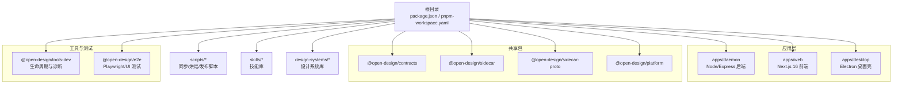
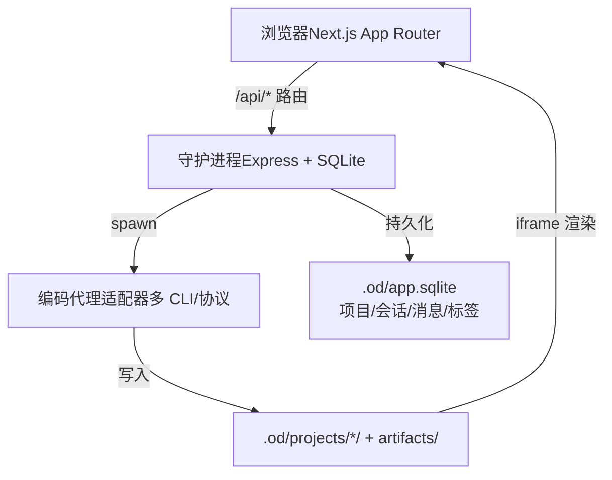
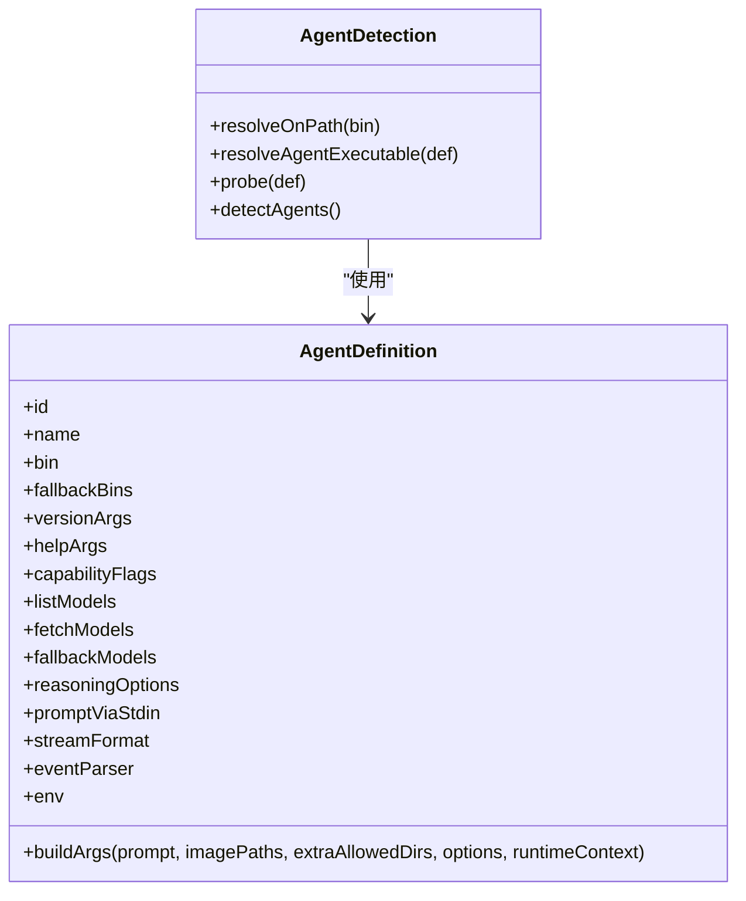
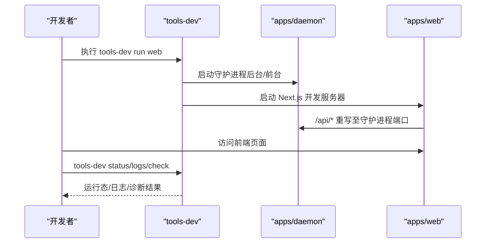
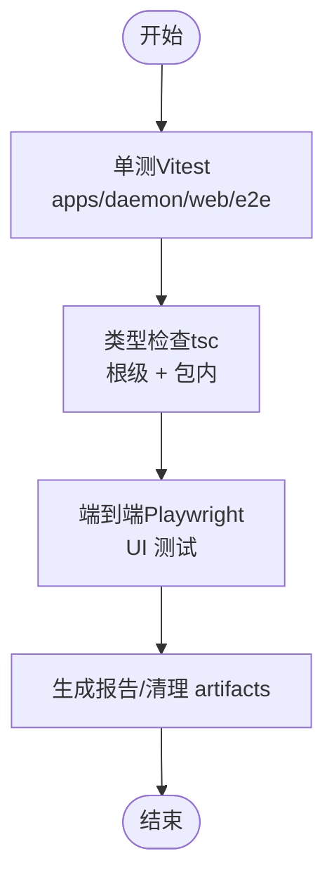
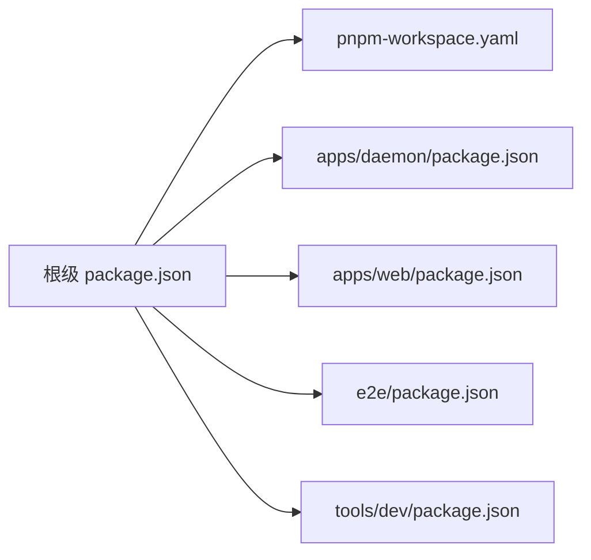

# 开发指南

<cite>
**本文档引用的文件**
- [package.json](file://package.json)
- [pnpm-workspace.yaml](file://pnpm-workspace.yaml)
- [README.md](file://README.md)
- [QUICKSTART.md](file://QUICKSTART.md)
- [CONTRIBUTING.md](file://CONTRIBUTING.md)
- [apps/daemon/package.json](file://apps/daemon/package.json)
- [apps/web/package.json](file://apps/web/package.json)
- [e2e/package.json](file://e2e/package.json)
- [tools/dev/package.json](file://tools/dev/package.json)
- [apps/daemon/tsconfig.json](file://apps/daemon/tsconfig.json)
- [apps/daemon/vitest.config.ts](file://apps/daemon/vitest.config.ts)
- [apps/web/vitest.config.ts](file://apps/web/vitest.config.ts)
- [e2e/vitest.config.ts](file://e2e/vitest.config.ts)
- [apps/daemon/src/agents.ts](file://apps/daemon/src/agents.ts)
</cite>

## 目录
1. [简介](#简介)
2. [项目结构](#项目结构)
3. [核心组件](#核心组件)
4. [架构总览](#架构总览)
5. [详细组件分析](#详细组件分析)
6. [依赖关系分析](#依赖关系分析)
7. [性能考虑](#性能考虑)
8. [故障排查指南](#故障排查指南)
9. [结论](#结论)
10. [附录](#附录)

## 简介
本指南面向贡献者与维护者，系统性说明 Open Design 的开发环境搭建、代码结构、调试与测试方法、贡献流程、monorepo 策略、构建与工具链、测试策略与持续集成建议，以及新功能开发流程、代码评审标准与发布流程。目标是帮助新贡献者快速上手并高质量交付。

## 项目结构
Open Design 采用 pnpm workspace 的 monorepo 架构，核心应用与工具分布在 apps、packages、tools、e2e 等目录中，根级 package.json 提供统一脚本与版本管理，pnpm-workspace.yaml 声明工作区范围。

图表来源
- [pnpm-workspace.yaml:1-6](file://pnpm-workspace.yaml#L1-L6)
- [package.json:1-43](file://package.json#L1-L43)

章节来源
- [pnpm-workspace.yaml:1-6](file://pnpm-workspace.yaml#L1-L6)
- [package.json:1-43](file://package.json#L1-L43)
- [README.md:344-441](file://README.md#L344-L441)

## 核心组件
- 应用与运行时
  - apps/daemon：本地守护进程，负责代理与调度、SQLite 存储、API 路由与 SSE 流式输出。
  - apps/web：Next.js 16 App Router 前端，负责聊天、文件工作区、预览 iframe、设置与导入等。
  - apps/desktop：可选 Electron 壳，通过 sidecar 协议与桌面交互。
- 共享包
  - @open-design/contracts：前后端契约。
  - @open-design/sidecar：通用 sidecar 运行时原语。
  - @open-design/sidecar-proto：sidecar 协议定义。
  - @open-design/platform：平台与进程抽象。
- 工具与测试
  - @open-design/tools-dev：开发期生命周期管理与诊断命令。
  - @open-design/e2e：Playwright UI 与外部集成测试。
- 资源与内容
  - skills/*：31 个技能（SKILL.md）。
  - design-systems/*：72+ 设计系统（DESIGN.md）。
  - scripts/*：同步/烘焙/发布辅助脚本。

章节来源
- [README.md:355-441](file://README.md#L355-L441)
- [apps/daemon/package.json:1-57](file://apps/daemon/package.json#L1-L57)
- [apps/web/package.json:1-52](file://apps/web/package.json#L1-L52)
- [e2e/package.json:1-28](file://e2e/package.json#L1-L28)
- [tools/dev/package.json:1-31](file://tools/dev/package.json#L1-L31)

## 架构总览
系统采用“浏览器前端（Next.js）—本地守护进程（Express + SQLite）—多编码代理适配器”的三层架构。前端通过 /api/* 与守护进程通信；守护进程根据所选代理（本地 CLI 或 BYOK API）进行流式分发，并在沙箱 iframe 中渲染产物。

图表来源
- [README.md:257-299](file://README.md#L257-L299)

章节来源
- [README.md:257-299](file://README.md#L257-L299)

## 详细组件分析

### 组件一：代理适配器（apps/daemon/src/agents.ts）
该模块负责自动检测 PATH 上可用的编码代理 CLI，解析模型列表，构造子进程参数，选择合适的流格式解析器，并处理跨平台长度限制问题（stdin 传递长提示）。

图表来源
- [apps/daemon/src/agents.ts:119-604](file://apps/daemon/src/agents.ts#L119-L604)

章节来源
- [apps/daemon/src/agents.ts:1-884](file://apps/daemon/src/agents.ts#L1-L884)

### 组件二：守护进程生命周期与调试（tools-dev）
tools-dev 提供统一的开发期生命周期入口，支持启动/停止/重启/状态查看/日志查看/检查诊断等，便于联调前端与守护进程。

图表来源
- [QUICKSTART.md:61-78](file://QUICKSTART.md#L61-L78)

章节来源
- [QUICKSTART.md:61-78](file://QUICKSTART.md#L61-L78)

### 组件三：测试与验证流程
- 单元测试：各包使用 Vitest，按包独立执行。
- 集成/端到端：e2e 使用 Playwright + Vitest，支持无头/有头模式与 UI 清理脚本。
- 类型检查：根级与各包分别执行类型检查，确保 TS 安全。

图表来源
- [apps/daemon/vitest.config.ts:1-9](file://apps/daemon/vitest.config.ts#L1-L9)
- [apps/web/vitest.config.ts:1-9](file://apps/web/vitest.config.ts#L1-L9)
- [e2e/vitest.config.ts:1-13](file://e2e/vitest.config.ts#L1-L13)
- [package.json:21-25](file://package.json#L21-L25)

章节来源
- [apps/daemon/vitest.config.ts:1-9](file://apps/daemon/vitest.config.ts#L1-L9)
- [apps/web/vitest.config.ts:1-9](file://apps/web/vitest.config.ts#L1-L9)
- [e2e/vitest.config.ts:1-13](file://e2e/vitest.config.ts#L1-L13)
- [package.json:21-25](file://package.json#L21-L25)

## 依赖关系分析
- 工作区范围：apps/*、packages/*、tools/*、e2e。
- 根级脚本：统一聚合各包任务，如构建、测试、类型检查。
- 依赖锁定：根级 package.json 声明 Node/pnpm 版本约束与仅构建依赖白名单，确保二进制依赖正确编译。

图表来源
- [pnpm-workspace.yaml:1-6](file://pnpm-workspace.yaml#L1-L6)
- [package.json:1-43](file://package.json#L1-L43)

章节来源
- [pnpm-workspace.yaml:1-6](file://pnpm-workspace.yaml#L1-L6)
- [package.json:1-43](file://package.json#L1-L43)

## 性能考虑
- 代理适配器对长提示采用 stdin 传递，避免平台 ARG 限制导致的 spawn 失败。
- SSE 流式传输需保持无缓冲与压缩关闭，避免反向代理对分块响应的错误处理。
- SQLite 作为轻量存储，注意并发读写与事务边界，避免阻塞 UI。
- 前端静态导出用于生产部署，减少运行时开销。

章节来源
- [apps/daemon/src/agents.ts:150-184](file://apps/daemon/src/agents.ts#L150-L184)
- [QUICKSTART.md:114-131](file://QUICKSTART.md#L114-L131)

## 故障排查指南
- “未在 PATH 中发现代理”：安装任一支持的 CLI，或在设置中切换 BYOK API 模式。
- “/api/chat 500”：查看守护进程 stderr，确认 CLI 参数形状是否匹配。
- “媒体生成提示缺失 OD_BIN/OD_DAEMON_URL”：重建守护进程 CLI 并重启运行时，重新打开项目以注入新变量。
- “Codex 插件上下文过大”：通过环境变量禁用插件后重试。
- “产物未渲染”：确认系统提示已下发，必要时更换更合适的模型或技能。

章节来源
- [QUICKSTART.md:215-222](file://QUICKSTART.md#L215-L222)
- [CONTRIBUTING.md:255-266](file://CONTRIBUTING.md#L255-L266)

## 结论
本指南从环境搭建、代码结构、调试测试、贡献流程、工具链与发布等方面提供了 Open Design 的完整开发指引。建议贡献者优先阅读 QUICKSTART 与 CONTRIBUTING，结合本指南的组件与流程图，快速定位问题并高效交付。

## 附录

### 开发环境搭建步骤
- Node.js：~24（根级 engines 约束）
- pnpm：10.33.x（通过 Corepack 固定版本）
- 安装与启动：启用 Corepack → pnpm install → pnpm tools-dev run web
- 可选：安装任意编码代理 CLI（如 claude、codex、devin、gemini、opencode、cursor-agent、qwen、copilot），或在设置中配置 BYOK API

章节来源
- [QUICKSTART.md:7-31](file://QUICKSTART.md#L7-L31)
- [package.json:31-34](file://package.json#L31-L34)

### 贡献流程与评审标准
- 新增技能：遵循 SKILL.md 规范，提供真实 example.html，通过反 AI 潦草清单与诚实占位符校验。
- 新增设计系统：DESIGN.md 九段落齐全，颜色值真实，slug 使用 ASCII。
- 新增代理适配：在 agents.ts 中添加条目并通过端到端会话验证。
- 代码风格：JS/TS 使用单引号，注释使用英文；避免过度注释；不引入无关依赖；提交前运行类型检查。
- 提交规范：每个 PR 聚焦单一主题；标题使用祈使句 + 作用域；正文解释“为什么”。

章节来源
- [CONTRIBUTING.md:11-298](file://CONTRIBUTING.md#L11-L298)

### 测试策略与持续集成建议
- 单元测试：各包独立运行 Vitest，覆盖核心逻辑与边界条件。
- 集成测试：e2e 使用 Playwright，支持 UI 模式与无头模式；提供 artifacts 清理脚本。
- 类型检查：根级与包内分别执行，保证类型安全。
- CI 建议：在 PR 中执行类型检查、单元测试与 UI 测试，确保最小回归面。

章节来源
- [apps/daemon/vitest.config.ts:1-9](file://apps/daemon/vitest.config.ts#L1-L9)
- [apps/web/vitest.config.ts:1-9](file://apps/web/vitest.config.ts#L1-L9)
- [e2e/vitest.config.ts:1-13](file://e2e/vitest.config.ts#L1-L13)
- [package.json:21-25](file://package.json#L21-L25)

### 发布流程与版本管理
- 版本：根级与各包 version 对齐，遵循语义化版本。
- 发布脚本：scripts/release-*.ts 用于 beta/stable 发布（仓库包含相关脚本文件）。
- 构建导出：apps/web 支持静态导出，便于部署到 Vercel 或静态托管。

章节来源
- [package.json:2-4](file://package.json#L2-L4)
- [apps/web/package.json:23-28](file://apps/web/package.json#L23-L28)
- [README.md:673-678](file://README.md#L673-L678)