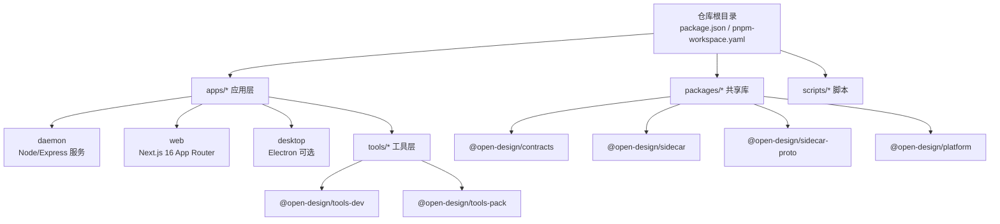
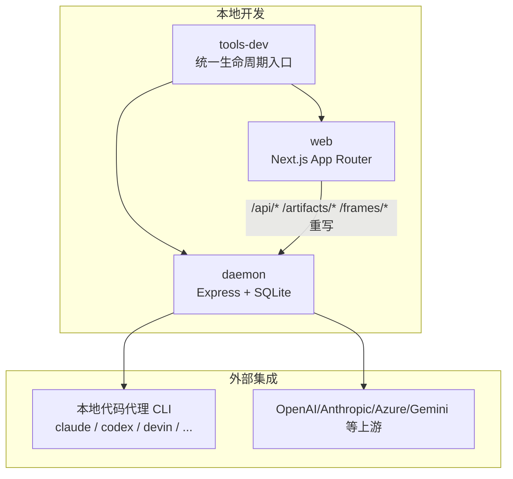
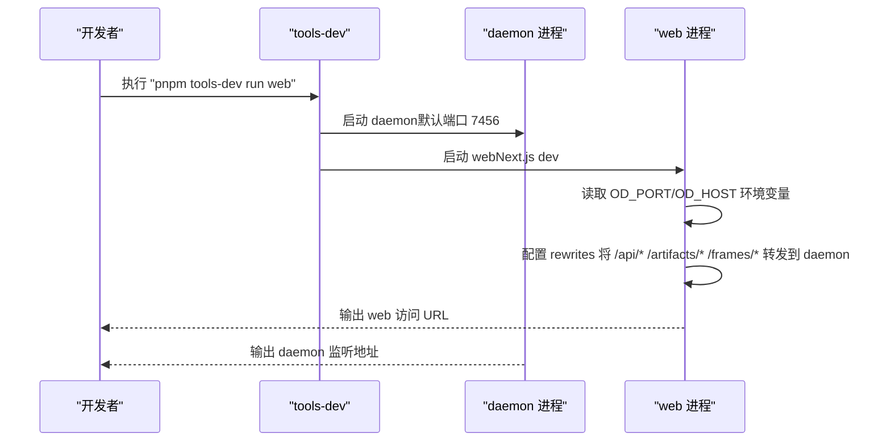
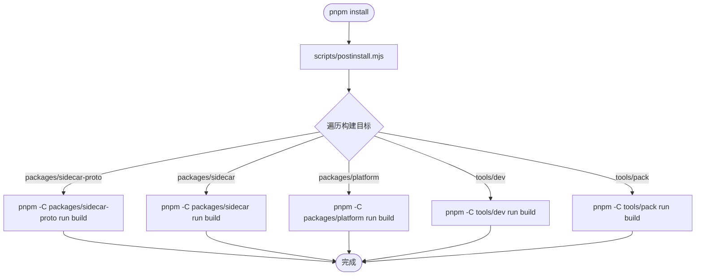
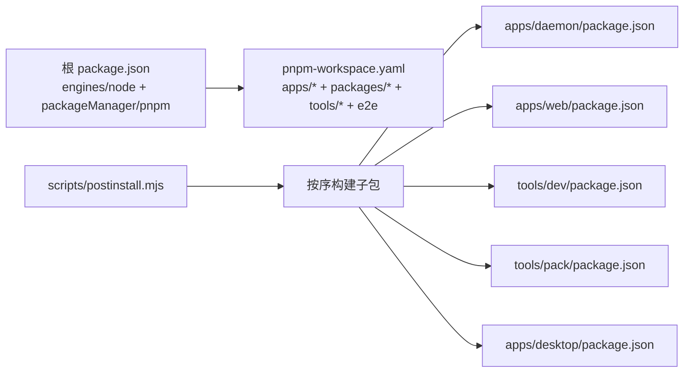

# 开发环境搭建

<cite>
**本文档引用的文件**
- [package.json](file://package.json)
- [pnpm-workspace.yaml](file://pnpm-workspace.yaml)
- [README.md](file://README.md)
- [QUICKSTART.md](file://QUICKSTART.md)
- [CONTRIBUTING.md](file://CONTRIBUTING.md)
- [tools/dev/package.json](file://tools/dev/package.json)
- [tools/pack/package.json](file://tools/pack/package.json)
- [apps/daemon/package.json](file://apps/daemon/package.json)
- [apps/web/package.json](file://apps/web/package.json)
- [apps/desktop/package.json](file://apps/desktop/package.json)
- [apps/daemon/src/server.ts](file://apps/daemon/src/server.ts)
- [apps/web/next.config.ts](file://apps/web/next.config.ts)
- [tools/dev/bin/tools-dev.mjs](file://tools/dev/bin/tools-dev.mjs)
- [scripts/postinstall.mjs](file://scripts/postinstall.mjs)
</cite>

## 目录
1. [简介](#简介)
2. [项目结构](#项目结构)
3. [核心组件](#核心组件)
4. [架构总览](#架构总览)
5. [详细组件分析](#详细组件分析)
6. [依赖关系分析](#依赖关系分析)
7. [性能考虑](#性能考虑)
8. [故障排查指南](#故障排查指南)
9. [结论](#结论)
10. [附录](#附录)

## 简介
本指南面向希望在本地搭建并运行 Open Design 的开发者，提供从零到一的完整开发环境设置步骤，涵盖 Node.js (~24)、pnpm (10.33.x)、Corepack 启用与 monorepo 结构理解，并详解 tools-dev 工具链的使用方法与 daemon + web 前台循环开发模式。文档同时给出环境验证步骤与常见问题排查建议，帮助你快速建立可用的开发环境。

## 项目结构
Open Design 采用 pnpm workspace 的 monorepo 架构，根目录通过 package.json 指定包管理器版本与 Node 引擎要求，pnpm-workspace.yaml 定义了工作区范围。应用层包含 daemon（Node/Express）、web（Next.js 16 App Router）、desktop（Electron 可选）、tools（生命周期与打包工具），以及 packages（共享协议与运行时库）。

图表来源
- [pnpm-workspace.yaml:1-6](file://pnpm-workspace.yaml#L1-L6)
- [package.json:1-43](file://package.json#L1-L43)

章节来源
- [pnpm-workspace.yaml:1-6](file://pnpm-workspace.yaml#L1-L6)
- [package.json:1-43](file://package.json#L1-L43)

## 核心组件
- Node.js：版本要求为 ~24，所有子包均声明 engines.node=~24，确保全栈一致。
- pnpm：版本要求 10.33.x，通过 package.json#engines 与 packageManager 字段固定版本；推荐使用 Corepack 自动选择 pinned 版本。
- Corepack：启用后可自动使用仓库内指定的 pnpm 版本，避免版本漂移。
- tools-dev：统一的本地生命周期入口，负责启动/停止 daemon、web、desktop，并提供检查、日志、状态等能力。
- monorepo：通过 pnpm-workspace.yaml 管理 apps/*、packages/*、tools/*、e2e，实现跨包依赖与并行构建。

章节来源
- [package.json:31-34](file://package.json#L31-L34)
- [tools/dev/package.json:27-29](file://tools/dev/package.json#L27-L29)
- [apps/web/package.json:48-50](file://apps/web/package.json#L48-L50)
- [apps/daemon/package.json:53-55](file://apps/daemon/package.json#L53-L55)

## 架构总览
Open Design 的本地开发由 tools-dev 驱动，启动 daemon（Node/Express）与 web（Next.js）两个主要进程。在开发模式下，Next.js 通过 rewrites 将 /api/*、/artifacts/*、/frames/* 请求转发至 daemon，从而避免 CORS 干扰并保持端到端流式体验。

图表来源
- [apps/web/next.config.ts:89-99](file://apps/web/next.config.ts#L89-L99)
- [apps/daemon/src/server.ts:1-200](file://apps/daemon/src/server.ts#L1-L200)

章节来源
- [apps/web/next.config.ts:71-105](file://apps/web/next.config.ts#L71-L105)
- [apps/daemon/src/server.ts:1-200](file://apps/daemon/src/server.ts#L1-L200)

## 详细组件分析

### 开发环境准备与验证
- Node.js：满足 ~24 要求，可通过 nvm/fnm 切换或直接使用系统 Node。
- pnpm：使用 Corepack 启用后，执行 corepack pnpm --version 应输出 10.33.x。
- 验证：clone 仓库后，先 corepack enable，再执行 pnpm install，最后运行 pnpm tools-dev run web，观察终端输出的 web URL。

章节来源
- [QUICKSTART.md:7-31](file://QUICKSTART.md#L7-L31)
- [README.md:300-314](file://README.md#L300-L314)

### tools-dev 工具链使用
tools-dev 是本地生命周期唯一入口，支持以下常用命令：
- pnpm tools-dev：后台启动 daemon + web + desktop
- pnpm tools-dev run web：前台启动 daemon + web（适合调试）
- pnpm tools-dev start web：后台启动 daemon + web
- pnpm tools-dev restart / stop / status / logs / check：重启、停止、查看状态、查看日志、健康检查
- pnpm tools-dev inspect desktop status/eval/screenshot：桌面自动化检查（IPC）

图表来源
- [apps/web/next.config.ts:89-99](file://apps/web/next.config.ts#L89-L99)
- [apps/daemon/src/cli.ts:62-90](file://apps/daemon/src/cli.ts#L62-L90)

章节来源
- [QUICKSTART.md:59-76](file://QUICKSTART.md#L59-L76)
- [apps/web/next.config.ts:71-105](file://apps/web/next.config.ts#L71-L105)
- [apps/daemon/src/cli.ts:62-90](file://apps/daemon/src/cli.ts#L62-L90)

### monorepo 结构与包管理
- 工作区定义：apps/*、packages/*、tools/*、e2e。
- 包装器与构建：scripts/postinstall.mjs 在安装阶段自动构建 packages/sidecar-proto、packages/sidecar、packages/platform、tools/dev、tools/pack。
- 子包引擎：apps/web、apps/daemon、tools/dev、tools/pack、apps/desktop 均声明 engines.node=~24，确保统一 Node 版本。

图表来源
- [scripts/postinstall.mjs:8-49](file://scripts/postinstall.mjs#L8-L49)

章节来源
- [pnpm-workspace.yaml:1-6](file://pnpm-workspace.yaml#L1-L6)
- [scripts/postinstall.mjs:1-50](file://scripts/postinstall.mjs#L1-L50)

### daemon + web 前台循环开发模式
- 启动顺序：tools-dev 先启动 daemon，再将 daemon 端口注入到 web，web 通过 next.config.ts 的 rewrites 将 API 请求转发至 daemon。
- 端口与主机：daemon 默认绑定 127.0.0.1:7456，可通过 OD_PORT/OD_BIND_HOST 环境变量调整。
- 开发体验：前台模式下，浏览器打开 web URL，即可进行交互式聊天、预览与导出；SSE 流式传输保证低延迟。

章节来源
- [apps/web/next.config.ts:89-99](file://apps/web/next.config.ts#L89-L99)
- [apps/daemon/src/cli.ts:62-90](file://apps/daemon/src/cli.ts#L62-L90)

## 依赖关系分析
- 根级约束：package.json 指定 packageManager=pnpm@10.33.2，engines.node=~24，确保包管理器与 Node 版本一致性。
- 工作区范围：pnpm-workspace.yaml 明确 apps/*、packages/*、tools/*、e2e 为工作区成员。
- 构建链路：scripts/postinstall.mjs 统一触发各子包构建，避免首次运行缺失产物。
- 运行时依赖：apps/daemon 使用 better-sqlite3、express、chokidar 等；apps/web 使用 next、react、@anthropic-ai/sdk、openai 等。

图表来源
- [package.json:5-34](file://package.json#L5-L34)
- [pnpm-workspace.yaml:1-6](file://pnpm-workspace.yaml#L1-L6)
- [scripts/postinstall.mjs:8-49](file://scripts/postinstall.mjs#L8-L49)

章节来源
- [package.json:5-34](file://package.json#L5-L34)
- [pnpm-workspace.yaml:1-6](file://pnpm-workspace.yaml#L1-L6)
- [scripts/postinstall.mjs:1-50](file://scripts/postinstall.mjs#L1-L50)

## 性能考虑
- 开发服务器：Next.js dev 模式下，通过 rewrites 实现无 CORS 的 API 转发，避免额外代理层带来的开销。
- 流式传输：SSE 在 daemon 与前端之间保持低延迟，注意反向代理（如 nginx）需关闭压缩与缓冲，以避免分块编码异常。
- 构建缓存：pnpm workspace 支持增量构建与缓存，建议在本地磁盘使用 SSD 以提升安装与构建速度。

## 故障排查指南
- “未检测到任何 agent”：安装任一支持的本地 CLI（如 claude、codex、devin、gemini、opencode、cursor-agent、qwen、copilot），或在设置中切换到 BYOK API 模式并填写密钥。
- daemon 500 on /api/chat：查看 daemon 终端 stderr 日志，通常为 CLI 参数不匹配；参考 apps/daemon/src/agents.ts 的 buildArgs 配置。
- 媒体生成报错“OD_BIN 未设置或 daemon URL 为 :0”：重建 daemon CLI 并重启运行时；确认 OD_DAEMON_URL 不为 http://127.0.0.1:0。
- Codex 插件上下文过大：以 OD_CODEX_DISABLE_PLUGINS=1 启动，使 Codex 进程禁用插件。
- artifact 无法渲染：确认系统提示词已正确下发，必要时更换更合适的模型或技能。
- 反向代理问题：若使用 nginx，请确保对 /api/ 路径关闭 gzip 与缓冲，并设置长超时。

章节来源
- [QUICKSTART.md:215-231](file://QUICKSTART.md#L215-L231)
- [apps/daemon/src/server.ts:1-200](file://apps/daemon/src/server.ts#L1-L200)

## 结论
通过本指南，你可以基于 Node.js (~24) 与 pnpm (10.33.x)、Corepack 启用，完成 Open Design 的 monorepo 开发环境搭建。tools-dev 提供统一的生命周期管理，daemon + web 的前台循环开发模式让你在本地即可获得接近生产的交互体验。遇到问题时，可依据故障排查章节快速定位并解决。

## 附录
- 快速开始命令（来自仓库文档）：
  - git clone 仓库
  - corepack enable
  - corepack pnpm --version（应显示 10.33.x）
  - pnpm install
  - pnpm tools-dev run web
- 贡献者本地设置（TL;DR）：
  - git clone → corepack enable → pnpm install → pnpm tools-dev run web → pnpm typecheck → pnpm build

章节来源
- [README.md:300-314](file://README.md#L300-L314)
- [CONTRIBUTING.md:25-37](file://CONTRIBUTING.md#L25-L37)