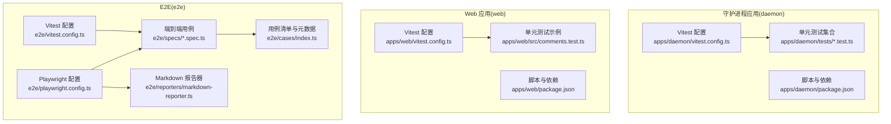
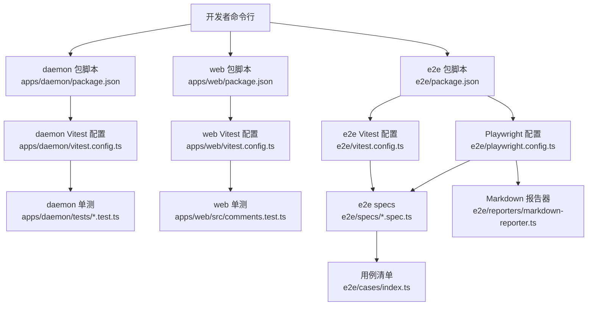
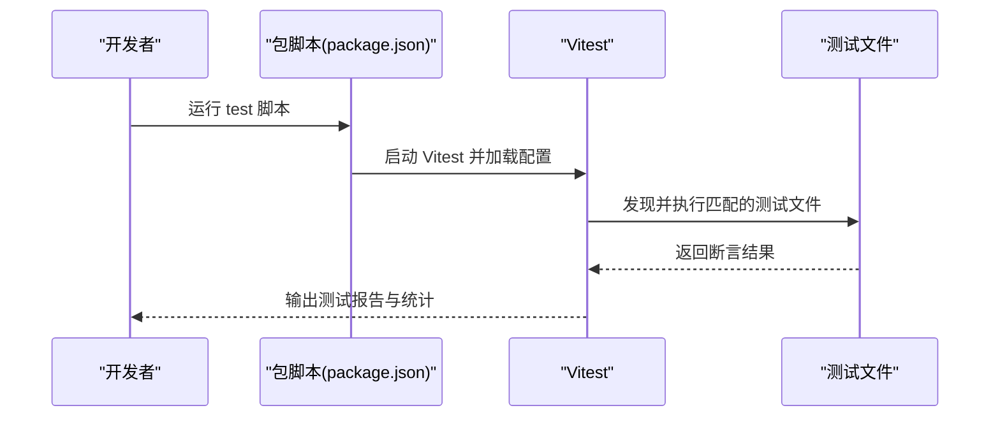
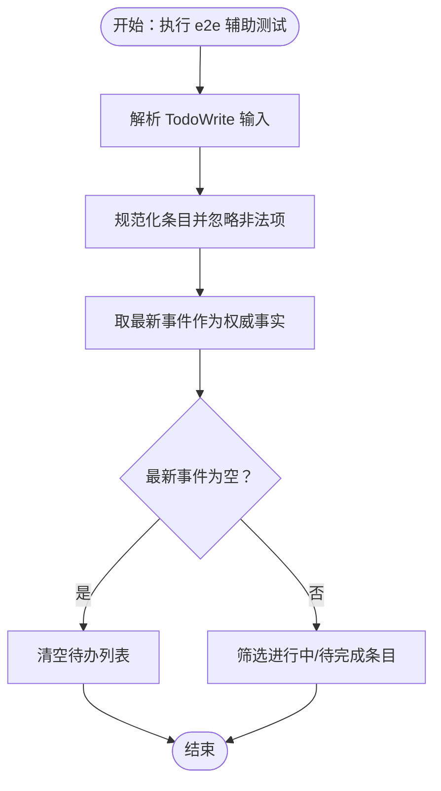
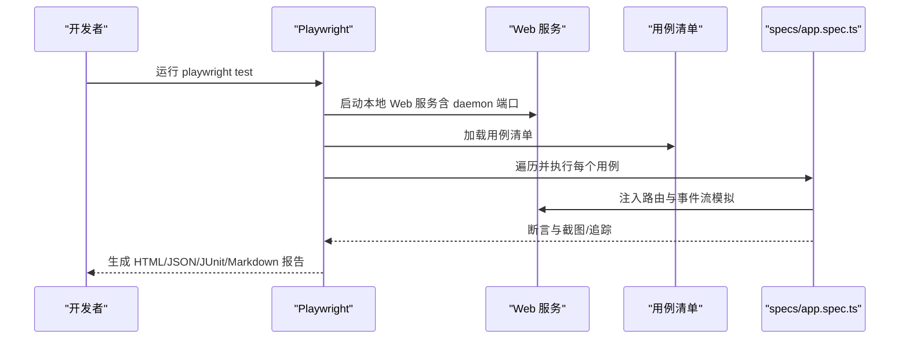
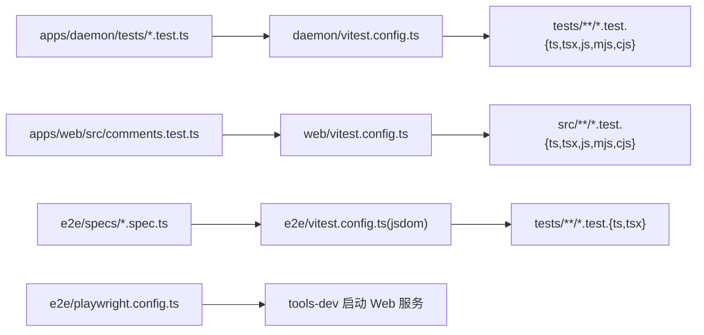

# 测试与调试

<cite>
**本文引用的文件**
- [apps/daemon/vitest.config.ts](file://apps/daemon/vitest.config.ts)
- [apps/web/vitest.config.ts](file://apps/web/vitest.config.ts)
- [e2e/playwright.config.ts](file://e2e/playwright.config.ts)
- [e2e/vitest.config.ts](file://e2e/vitest.config.ts)
- [apps/daemon/package.json](file://apps/daemon/package.json)
- [apps/web/package.json](file://apps/web/package.json)
- [e2e/package.json](file://e2e/package.json)
- [apps/daemon/tests/app-config.test.ts](file://apps/daemon/tests/app-config.test.ts)
- [apps/web/src/comments.test.ts](file://apps/web/src/comments.test.ts)
- [e2e/specs/app.spec.ts](file://e2e/specs/app.spec.ts)
- [e2e/tests/todos.test.ts](file://e2e/tests/todos.test.ts)
- [apps/daemon/tsconfig.tests.json](file://apps/daemon/tsconfig.tests.json)
- [apps/web/tsconfig.json](file://apps/web/tsconfig.json)
- [e2e/cases/index.ts](file://e2e/cases/index.ts)
- [e2e/reporters/markdown-reporter.ts](file://e2e/reporters/markdown-reporter.ts)
</cite>

## 目录
1. [简介](#简介)
2. [项目结构](#项目结构)
3. [核心组件](#核心组件)
4. [架构总览](#架构总览)
5. [详细组件分析](#详细组件分析)
6. [依赖分析](#依赖分析)
7. [性能考虑](#性能考虑)
8. [故障排查指南](#故障排查指南)
9. [结论](#结论)
10. [附录](#附录)

## 简介
本指南面向 Open Design 项目的测试与调试工作，覆盖单元测试、集成测试与端到端（E2E）测试的组织方式与执行流程；详解 Vitest 与 Playwright 的配置与使用；提供调试技巧（浏览器开发者工具、Node.js 调试器、daemon 日志分析）；并给出测试数据准备、模拟对象使用与性能测试最佳实践。

## 项目结构
Open Design 在多应用与多测试域中采用分层与按域分离的结构：
- 守护进程应用（daemon）：包含大量后端逻辑与工具函数的单元测试，集中于 tests 目录，并通过 Vitest 执行。
- Web 应用（web）：前端 Next.js 应用，包含业务逻辑与 UI 组件的单元测试，同样通过 Vitest 执行。
- E2E 测试（e2e）：Playwright 端到端测试，同时包含 Vitest 的前端运行时辅助测试（如 todos 解析），并提供自定义 Markdown 报告器。

图表来源
- [apps/daemon/vitest.config.ts:1-9](file://apps/daemon/vitest.config.ts#L1-L9)
- [apps/web/vitest.config.ts:1-9](file://apps/web/vitest.config.ts#L1-L9)
- [e2e/playwright.config.ts:1-51](file://e2e/playwright.config.ts#L1-L51)
- [e2e/vitest.config.ts:1-13](file://e2e/vitest.config.ts#L1-L13)
- [apps/daemon/package.json:26-33](file://apps/daemon/package.json#L26-L33)
- [apps/web/package.json:23-28](file://apps/web/package.json#L23-L28)
- [e2e/package.json:6-12](file://e2e/package.json#L6-L12)
- [apps/daemon/tests/app-config.test.ts:1-388](file://apps/daemon/tests/app-config.test.ts#L1-L388)
- [apps/web/src/comments.test.ts:1-163](file://apps/web/src/comments.test.ts#L1-L163)
- [e2e/specs/app.spec.ts:1-800](file://e2e/specs/app.spec.ts#L1-L800)
- [e2e/cases/index.ts:1-406](file://e2e/cases/index.ts#L1-L406)
- [e2e/reporters/markdown-reporter.ts:1-290](file://e2e/reporters/markdown-reporter.ts#L1-L290)

章节来源
- [apps/daemon/vitest.config.ts:1-9](file://apps/daemon/vitest.config.ts#L1-L9)
- [apps/web/vitest.config.ts:1-9](file://apps/web/vitest.config.ts#L1-L9)
- [e2e/playwright.config.ts:1-51](file://e2e/playwright.config.ts#L1-L51)
- [e2e/vitest.config.ts:1-13](file://e2e/vitest.config.ts#L1-L13)
- [apps/daemon/package.json:26-33](file://apps/daemon/package.json#L26-L33)
- [apps/web/package.json:23-28](file://apps/web/package.json#L23-L28)
- [e2e/package.json:6-12](file://e2e/package.json#L6-L12)

## 核心组件
- Vitest 测试框架
  - 守护进程与 Web 应用均使用 Vitest 的 Node 环境执行单元测试，支持 TypeScript 与 TSX。
  - E2E 子工程使用 Vitest 的 jsdom 环境执行前端运行时辅助测试（如 todos 解析）。
- Playwright 端到端测试
  - 通过 Playwright 配置启动本地 Web 服务，自动路由与断言 UI 行为。
  - 提供多种报告格式（HTML、JSON、JUnit、Markdown），并输出截图与追踪信息。
- 测试数据与用例
  - E2E 用例由 cases 清单统一管理，支持自动化与手动用例分类。
  - 用例通过 Playwright 的路由与事件流模拟真实交互，确保可重复性与稳定性。

章节来源
- [apps/daemon/vitest.config.ts:1-9](file://apps/daemon/vitest.config.ts#L1-L9)
- [apps/web/vitest.config.ts:1-9](file://apps/web/vitest.config.ts#L1-L9)
- [e2e/playwright.config.ts:1-51](file://e2e/playwright.config.ts#L1-L51)
- [e2e/vitest.config.ts:1-13](file://e2e/vitest.config.ts#L1-L13)
- [e2e/cases/index.ts:1-406](file://e2e/cases/index.ts#L1-L406)

## 架构总览
下图展示测试体系在不同应用与环境中的交互关系：

图表来源
- [apps/daemon/package.json:26-33](file://apps/daemon/package.json#L26-L33)
- [apps/web/package.json:23-28](file://apps/web/package.json#L23-L28)
- [e2e/package.json:6-12](file://e2e/package.json#L6-L12)
- [apps/daemon/vitest.config.ts:1-9](file://apps/daemon/vitest.config.ts#L1-L9)
- [apps/web/vitest.config.ts:1-9](file://apps/web/vitest.config.ts#L1-L9)
- [e2e/vitest.config.ts:1-13](file://e2e/vitest.config.ts#L1-L13)
- [e2e/playwright.config.ts:1-51](file://e2e/playwright.config.ts#L1-L51)
- [apps/daemon/tests/app-config.test.ts:1-388](file://apps/daemon/tests/app-config.test.ts#L1-L388)
- [apps/web/src/comments.test.ts:1-163](file://apps/web/src/comments.test.ts#L1-L163)
- [e2e/specs/app.spec.ts:1-800](file://e2e/specs/app.spec.ts#L1-L800)
- [e2e/cases/index.ts:1-406](file://e2e/cases/index.ts#L1-L406)
- [e2e/reporters/markdown-reporter.ts:1-290](file://e2e/reporters/markdown-reporter.ts#L1-L290)

## 详细组件分析

### 单元测试（Vitest）
- 守护进程（daemon）
  - 测试范围：配置读写、跨源校验、事件流、媒体与制品等。
  - 示例：应用配置读取与写入、跨源请求拦截、事件流解析等。
- Web 应用（web）
  - 测试范围：评论附件上下文、消息内容拼接、快照边界转换等。
  - 示例：评论目标构建、附件序列化、历史消息附加上下文等。

图表来源
- [apps/daemon/package.json:31-31](file://apps/daemon/package.json#L31-L31)
- [apps/web/package.json:28-28](file://apps/web/package.json#L28-L28)
- [apps/daemon/vitest.config.ts:3-8](file://apps/daemon/vitest.config.ts#L3-L8)
- [apps/web/vitest.config.ts:3-8](file://apps/web/vitest.config.ts#L3-L8)

章节来源
- [apps/daemon/tests/app-config.test.ts:1-388](file://apps/daemon/tests/app-config.test.ts#L1-L388)
- [apps/web/src/comments.test.ts:1-163](file://apps/web/src/comments.test.ts#L1-L163)
- [apps/daemon/vitest.config.ts:1-9](file://apps/daemon/vitest.config.ts#L1-L9)
- [apps/web/vitest.config.ts:1-9](file://apps/web/vitest.config.ts#L1-L9)

### 集成测试（Vitest）
- e2e 子工程包含前端运行时辅助测试，例如 todos 事件解析与状态推导。
- 使用 jsdom 环境，便于在无浏览器场景下验证事件处理逻辑。

图表来源
- [e2e/tests/todos.test.ts:1-85](file://e2e/tests/todos.test.ts#L1-L85)
- [e2e/vitest.config.ts:1-13](file://e2e/vitest.config.ts#L1-L13)

章节来源
- [e2e/tests/todos.test.ts:1-85](file://e2e/tests/todos.test.ts#L1-L85)
- [e2e/vitest.config.ts:1-13](file://e2e/vitest.config.ts#L1-L13)

### 端到端测试（Playwright）
- 配置要点
  - 测试目录与输出：specs 与 reports。
  - 超时与并行：全局超时、期望超时、完全并行。
  - 报告器：GitHub、列表、HTML、JSON、JUnit、Markdown。
  - WebServer：通过 tools-dev 启动本地 Web 服务，绑定端口与数据目录。
  - 设备：当前仅 Chromium。
- 用例组织
  - 用例清单（cases/index.ts）定义了自动化与手动用例，涵盖项目创建、对话持久化、文件上传/提及、评论附件、问题表单等。
  - specs/app.spec.ts 遍历用例，动态注入路由与断言，保证 UI 行为稳定可测。

图表来源
- [e2e/playwright.config.ts:1-51](file://e2e/playwright.config.ts#L1-L51)
- [e2e/cases/index.ts:1-406](file://e2e/cases/index.ts#L1-L406)
- [e2e/specs/app.spec.ts:1-800](file://e2e/specs/app.spec.ts#L1-L800)

章节来源
- [e2e/playwright.config.ts:1-51](file://e2e/playwright.config.ts#L1-L51)
- [e2e/cases/index.ts:1-406](file://e2e/cases/index.ts#L1-L406)
- [e2e/specs/app.spec.ts:1-800](file://e2e/specs/app.spec.ts#L1-L800)

### 测试覆盖率与报告
- 当前仓库未显式配置覆盖率收集参数，建议在 Vitest 配置中增加 coverage 字段以满足覆盖率要求。
- Playwright 已内置多种报告器，Markdown 报告器会汇总用例状态、断言点与错误信息，并输出附件路径与原始产物链接。

章节来源
- [e2e/playwright.config.ts:15-30](file://e2e/playwright.config.ts#L15-L30)
- [e2e/reporters/markdown-reporter.ts:170-263](file://e2e/reporters/markdown-reporter.ts#L170-L263)

## 依赖分析
- Vitest 配置与测试文件发现
  - daemon 与 web 的 Vitest 配置分别指定 include 模式，确保仅扫描对应目录下的测试文件。
  - e2e 的 Vitest 配置使用 jsdom 环境，适配前端运行时测试。
- TypeScript 编译与类型检查
  - daemon 的 tests tsconfig 与 web 的 tsconfig 分别约束 include/exclude，避免无关目录参与编译。
- 脚本与执行顺序
  - e2e 的 playwright 命令通过 tools-dev 启动 Web 服务，确保端到端测试在受控环境中运行。

图表来源
- [apps/daemon/vitest.config.ts:6-6](file://apps/daemon/vitest.config.ts#L6-L6)
- [apps/web/vitest.config.ts:6-6](file://apps/web/vitest.config.ts#L6-L6)
- [e2e/vitest.config.ts:9-10](file://e2e/vitest.config.ts#L9-L10)
- [apps/daemon/tsconfig.tests.json:7-12](file://apps/daemon/tsconfig.tests.json#L7-L12)
- [apps/web/tsconfig.json:34-49](file://apps/web/tsconfig.json#L34-L49)
- [e2e/playwright.config.ts:36-43](file://e2e/playwright.config.ts#L36-L43)

章节来源
- [apps/daemon/vitest.config.ts:1-9](file://apps/daemon/vitest.config.ts#L1-L9)
- [apps/web/vitest.config.ts:1-9](file://apps/web/vitest.config.ts#L1-L9)
- [e2e/vitest.config.ts:1-13](file://e2e/vitest.config.ts#L1-L13)
- [apps/daemon/tsconfig.tests.json:1-18](file://apps/daemon/tsconfig.tests.json#L1-L18)
- [apps/web/tsconfig.json:1-51](file://apps/web/tsconfig.json#L1-L51)
- [e2e/playwright.config.ts:1-51](file://e2e/playwright.config.ts#L1-L51)

## 性能考虑
- 测试并行与超时
  - 启用 fullyParallel 可提升整体吞吐，但需注意资源竞争与共享状态隔离。
  - 合理设置 timeout 与 expect.timeout，避免长尾用例拖慢 CI。
- 用例拆分与稳定
  - 将大用例拆分为更小的子步骤，减少页面等待与重试次数。
  - 使用路由模拟与事件流注入，避免真实外部依赖带来的不确定性。
- 报告与产物
  - 仅在失败时保留截图与追踪，降低磁盘占用；必要时开启 trace 于首次重试。

章节来源
- [e2e/playwright.config.ts:14-14](file://e2e/playwright.config.ts#L14-L14)
- [e2e/playwright.config.ts:10-13](file://e2e/playwright.config.ts#L10-L13)
- [e2e/playwright.config.ts:33-34](file://e2e/playwright.config.ts#L33-L34)

## 故障排查指南
- 浏览器开发者工具
  - 使用 --headed 模式运行 Playwright，结合控制台与网络面板定位 UI 与资源加载问题。
  - 利用 Elements/Console/Network 面板检查选择器、样式与事件流。
- Node.js 调试器
  - daemon 与 web 的 Vitest 测试可通过 Node 调试器附加，设置断点于关键函数（如配置读写、事件解析）。
  - 建议在本地先以 --inspect-brk 启动，逐步执行测试文件定位异常。
- daemon 日志分析
  - 端到端测试通过 tools-dev 启动 Web 服务，可在日志中查找关键请求与响应，确认代理、路由与权限校验是否符合预期。
  - 若出现跨源或 Host 校验失败，参考守护进程测试中的跨源断言与环境变量设置（如 OD_WEB_PORT、OD_BIND_HOST）。
- 截图与追踪
  - Playwright 配置已启用失败截图与首次重试追踪，定位 UI 不一致与交互异常。
  - Markdown 报告器会列出失败用例的错误摘要与附件路径，优先查看报告与附件。

章节来源
- [e2e/playwright.config.ts:24-30](file://e2e/playwright.config.ts#L24-L30)
- [e2e/playwright.config.ts:32-34](file://e2e/playwright.config.ts#L32-L34)
- [apps/daemon/tests/app-config.test.ts:192-387](file://apps/daemon/tests/app-config.test.ts#L192-L387)
- [e2e/reporters/markdown-reporter.ts:220-262](file://e2e/reporters/markdown-reporter.ts#L220-L262)

## 结论
Open Design 的测试体系以 Vitest 与 Playwright 为核心，覆盖从单元到端到端的完整测试链路。通过清晰的配置与用例组织，配合丰富的报告与调试手段，能够有效保障功能正确性与用户体验稳定性。建议后续补充覆盖率配置与持续优化用例粒度，进一步提升测试效率与质量。

## 附录
- 测试文件命名约定
  - 单元测试：以 .test.ts/.test.tsx 结尾，位于各自应用的 tests 或 src 目录下。
  - 端到端测试：位于 e2e/specs 下，文件以 .spec.ts 结尾。
  - 辅助测试：位于 e2e/tests，使用 jsdom 环境。
- 执行命令
  - 守护进程：pnpm --filter @open-design/daemon test
  - Web 应用：pnpm --filter @open-design/web test
  - E2E UI 测试：pnpm run test:ui 或 test:ui:headed
  - E2E Live：pnpm run test:e2e:live

章节来源
- [apps/daemon/package.json:31-31](file://apps/daemon/package.json#L31-L31)
- [apps/web/package.json:28-28](file://apps/web/package.json#L28-L28)
- [e2e/package.json:10-12](file://e2e/package.json#L10-L12)