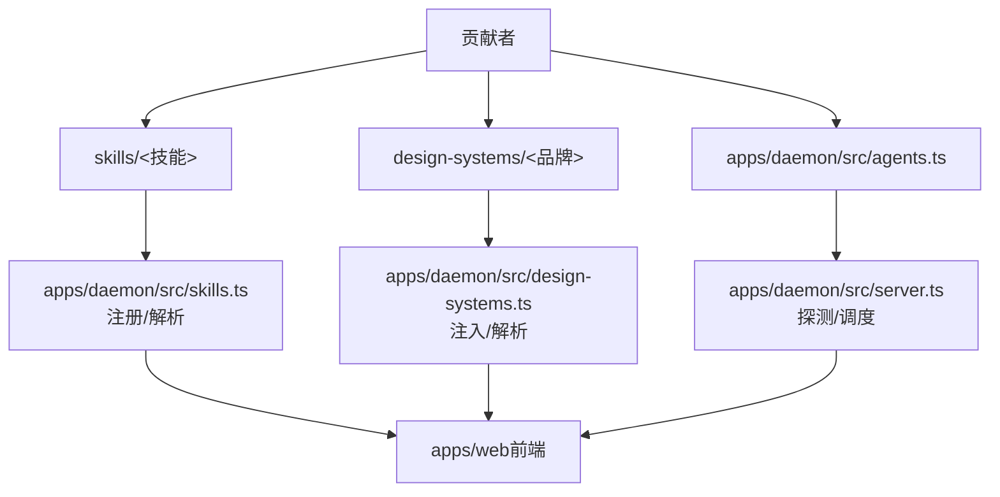
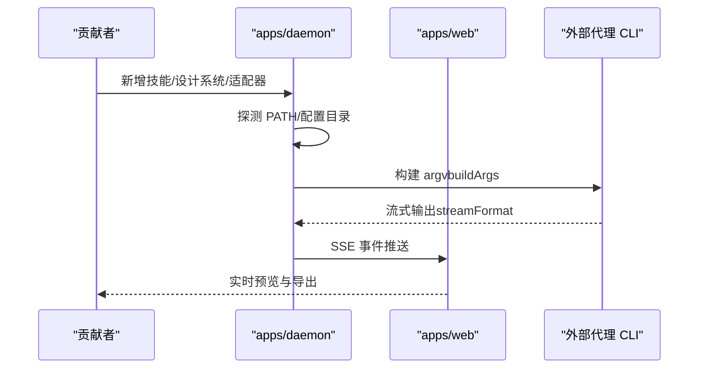
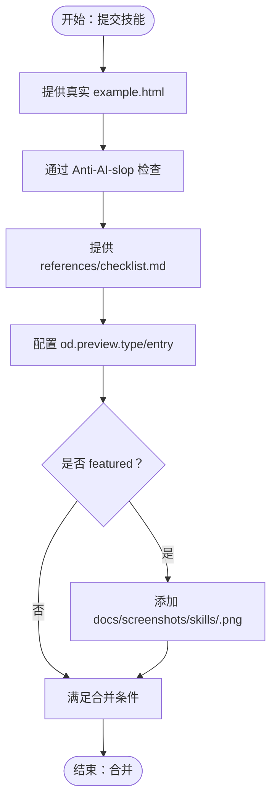
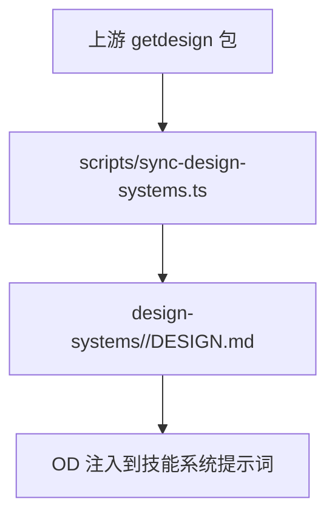
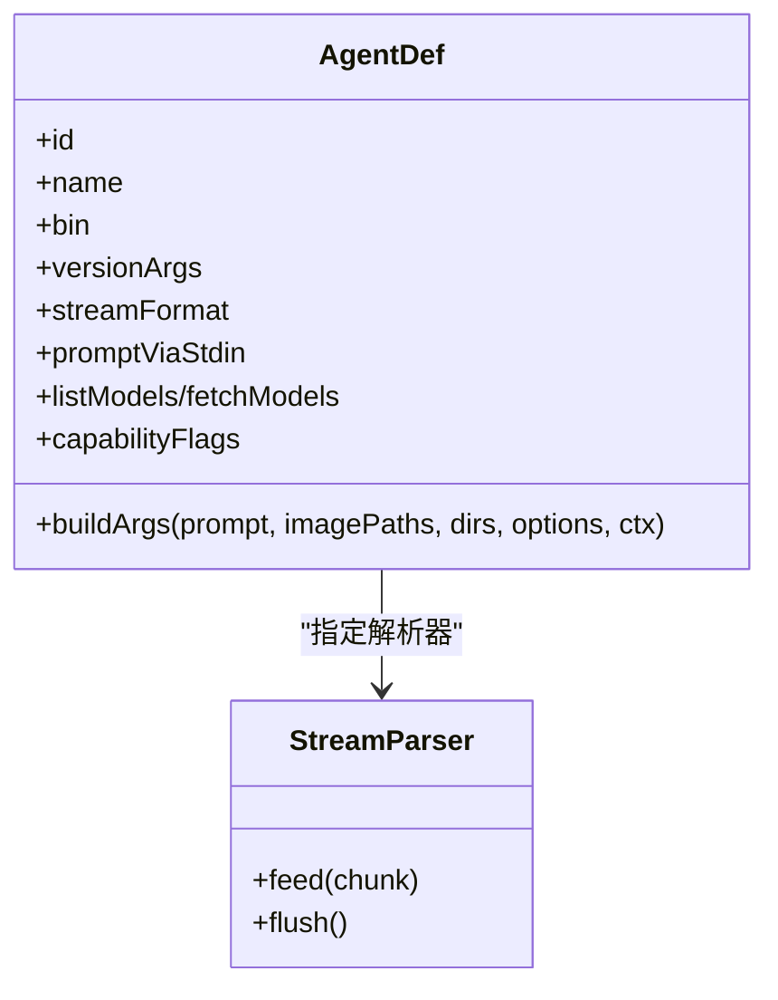
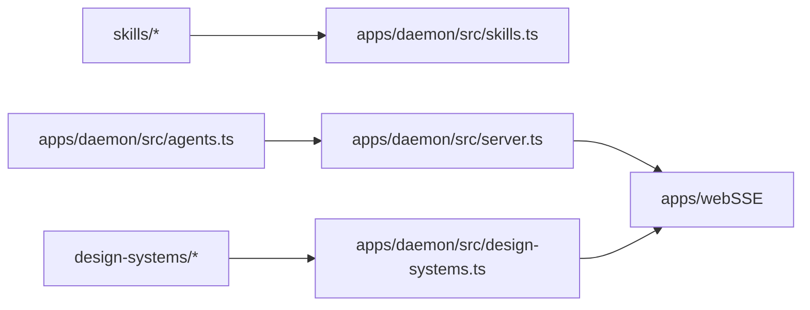

# 贡献指南

<cite>
**本文引用的文件**
- [CONTRIBUTING.md](file://CONTRIBUTING.md)
- [CONTRIBUTING.zh-CN.md](file://CONTRIBUTING.zh-CN.md)
- [QUICKSTART.md](file://QUICKSTART.md)
- [AGENTS.md](file://AGENTS.md)
- [apps/AGENTS.md](file://apps/AGENTS.md)
- [apps/landing-page/AGENTS.md](file://apps/landing-page/AGENTS.md)
- [apps/packaged/AGENTS.md](file://apps/packaged/AGENTS.md)
- [packages/AGENTS.md](file://packages/AGENTS.md)
- [TRANSLATIONS.md](file://TRANSLATIONS.md)
- [apps/daemon/src/agents.ts](file://apps/daemon/src/agents.ts)
- [apps/daemon/src/claude-stream.ts](file://apps/daemon/src/claude-stream.ts)
- [design-systems/README.md](file://design-systems/README.md)
- [docs/skills-protocol.md](file://docs/skills-protocol.md)
- [docs/agent-adapters.md](file://docs/agent-adapters.md)
- [scripts/sync-design-systems.ts](file://scripts/sync-design-systems.ts)
- [craft/anti-ai-slop.md](file://craft/anti-ai-slop.md)
- [skills/dating-web/SKILL.md](file://skills/dating-web/SKILL.md)
- [design-systems/default/DESIGN.md](file://design-systems/default/DESIGN.md)
</cite>

## 目录
1. [简介](#简介)
2. [项目结构](#项目结构)
3. [核心贡献类型](#核心贡献类型)
4. [架构总览](#架构总览)
5. [详细组件分析](#详细组件分析)
6. [依赖关系分析](#依赖关系分析)
7. [性能与质量标准](#性能与质量标准)
8. [故障排查指南](#故障排查指南)
9. [结论](#结论)
10. [附录](#附录)

## 简介
本指南面向希望为 Open Design 贡献的开发者与设计伙伴，系统阐述三大类贡献：技能开发（skills/）、设计系统添加（design-systems/）、代理适配器开发（apps/daemon/src/agents.ts）。文档同时给出文件结构、质量门槛、合并条件、代码风格、提交规范、本地化维护流程、社区渠道与项目限制，帮助你在最短时间内高质量交付。

## 项目结构
Open Design 采用多包工作区（pnpm workspace）组织，核心贡献路径集中在：
- skills/：技能目录，每个技能是一个独立文件夹，包含 SKILL.md 与可选 assets/、references/、example.html
- design-systems/：设计系统目录，每个品牌系统是一个文件夹，包含 DESIGN.md
- apps/daemon/src/agents.ts：代理适配器清单，声明 PATH 扫描、参数构建、流格式等
- docs/：协议与架构说明，支撑技能与适配器的实现边界
- scripts/：上游同步与工具脚本，如设计系统批量导入
- apps/web、apps/daemon、apps/desktop、packages/*：运行时与协议层，不作为贡献主战场

图示来源
- [apps/daemon/src/agents.ts:119-604](file://apps/daemon/src/agents.ts#L119-L604)
- [docs/skills-protocol.md:125-151](file://docs/skills-protocol.md#L125-L151)
- [design-systems/README.md:1-98](file://design-systems/README.md#L1-L98)

章节来源
- [QUICKSTART.md:154-213](file://QUICKSTART.md#L154-L213)
- [apps/AGENTS.md:5-31](file://apps/AGENTS.md#L5-L31)

## 核心贡献类型
本节概述三大贡献类型的“入口、结构、门槛与合并条件”，并给出落地建议。

- 技能开发（skills/）
  - 入口：在 skills/ 下新建文件夹，根目录放置 SKILL.md，按需提供 assets/、references/、example.html
  - 结构要点：od.mode 决定出现的模式分组；preview.type/entry 控制预览；design_system.requires/sections 控制上下文注入；inputs/parameters 控制 UI 输入与实时微调
  - 质量门槛：必须提供真实 example.html；通过 Anti-AI-slop 检查；诚实占位；提供 references/checklist.md；featured 技能需截图；单文件夹自包含
  - 合并条件：满足上述门槛；CI 通过；README/文档补充到位
  - 参考实现：dating-web、guizang-ppt、simple-deck 等
  - 章节来源
    - [CONTRIBUTING.md:45-117](file://CONTRIBUTING.md#L45-L117)
    - [CONTRIBUTING.zh-CN.md:45-116](file://CONTRIBUTING.zh-CN.md#L45-L116)
    - [docs/skills-protocol.md:11-124](file://docs/skills-protocol.md#L11-L124)
    - [craft/anti-ai-slop.md:14-42](file://craft/anti-ai-slop.md#L14-L42)
    - [skills/dating-web/SKILL.md:1-94](file://skills/dating-web/SKILL.md#L1-L94)

- 设计系统添加（design-systems/）
  - 入口：在 design-systems/<slug>/ 下新增 DESIGN.md，slug 使用 ASCII
  - 结构要点：首行 H1 为展示标题；第二行 > Category: … 决定分组；9 段式固定结构（主题、色彩、字体、间距、布局、组件、动效、声音、反模式）
  - 质量门槛：9 段齐全；HEX 真实；slug ASCII；避免营销用语；强调色可用 OKLch
  - 合并条件：结构合规；颜色与品牌一致；slug 规范；上游未收录时才放入本仓库
  - 参考实现：default、warm-editorial、各品牌系统
  - 章节来源
    - [CONTRIBUTING.md:120-168](file://CONTRIBUTING.md#L120-L168)
    - [CONTRIBUTING.zh-CN.md:119-167](file://CONTRIBUTING.zh-CN.md#L119-L167)
    - [design-systems/README.md:46-70](file://design-systems/README.md#L46-L70)
    - [scripts/sync-design-systems.ts:28-69](file://scripts/sync-design-systems.ts#L28-L69)
    - [design-systems/default/DESIGN.md:1-63](file://design-systems/default/DESIGN.md#L1-L63)

- 代理适配器开发（apps/daemon/src/agents.ts）
  - 入口：在 agents.ts 中新增一条适配器定义，声明 id/name/bin/versionArgs/buildArgs/streamFormat 等
  - 结构要点：buildArgs 返回 argv；streamFormat 指定解析器；必要时提供 fetchModels/listModels/capabilityFlags；支持 promptViaStdin 避免 Windows ENAMETOOLONG
  - 质量门槛：端到端会话成功；更新 docs/agent-adapters.md 与 README 的“支持的编码代理”表格
  - 合并条件：适配器可用；流解析正确；兼容性说明清晰；CI 通过
  - 章节来源
    - [CONTRIBUTING.md:171-193](file://CONTRIBUTING.md#L171-L193)
    - [CONTRIBUTING.zh-CN.md:170-192](file://CONTRIBUTING.zh-CN.md#L170-L192)
    - [apps/daemon/src/agents.ts:119-604](file://apps/daemon/src/agents.ts#L119-L604)
    - [apps/daemon/src/claude-stream.ts:23-208](file://apps/daemon/src/claude-stream.ts#L23-L208)
    - [docs/agent-adapters.md:122-198](file://docs/agent-adapters.md#L122-L198)

## 架构总览
Open Design 的贡献与运行时关系如下：

图示来源
- [apps/daemon/src/agents.ts:733-796](file://apps/daemon/src/agents.ts#L733-L796)
- [docs/agent-adapters.md:13-70](file://docs/agent-adapters.md#L13-L70)
- [QUICKSTART.md:133-141](file://QUICKSTART.md#L133-L141)

章节来源
- [AGENTS.md:44-69](file://AGENTS.md#L44-L69)
- [apps/AGENTS.md:5-31](file://apps/AGENTS.md#L5-L31)

## 详细组件分析

### 技能协议与质量门禁
- 协议与 UI 扩展：SKILL.md 基于 Claude Code 规范扩展 od.* 字段，支持 preview、design_system、craft、inputs、parameters、outputs、capabilities_required
- 发现与优先级：.claude/skills/ > ./skills/ > ~/.claude/skills/，冲突按优先级覆盖
- 质量门禁：example.html 必须真实可渲染；Anti-AI-slop 检查；诚实占位；checklist.md；截图；单文件夹自包含
- 参考实现：dating-web 的工作流与输出契约

图示来源
- [CONTRIBUTING.md:98-110](file://CONTRIBUTING.md#L98-L110)
- [craft/anti-ai-slop.md:14-42](file://craft/anti-ai-slop.md#L14-L42)
- [docs/skills-protocol.md:125-151](file://docs/skills-protocol.md#L125-L151)

章节来源
- [docs/skills-protocol.md:11-124](file://docs/skills-protocol.md#L11-L124)
- [skills/dating-web/SKILL.md:39-94](file://skills/dating-web/SKILL.md#L39-L94)

### 设计系统导入与分类
- 设计系统目录：每个子目录一个 DESIGN.md，首行 H1 为标题，第二行 > Category: … 为分组
- 上游同步：通过 scripts/sync-design-systems.ts 从 getdesign 包导入，映射品牌到 Category
- 本地新增：slug 使用 ASCII；9 段齐全；HEX 真实；避免营销用语；强调色可用 OKLch

图示来源
- [design-systems/README.md:65-84](file://design-systems/README.md#L65-L84)
- [scripts/sync-design-systems.ts:102-152](file://scripts/sync-design-systems.ts#L102-L152)

章节来源
- [design-systems/README.md:46-70](file://design-systems/README.md#L46-L70)
- [design-systems/default/DESIGN.md:1-63](file://design-systems/default/DESIGN.md#L1-L63)

### 代理适配器注册与流解析
- 适配器定义：在 agents.ts 中新增对象，声明 id/name/bin/versionArgs/buildArgs/streamFormat 等
- 探测与缓存：PATH 扫描 + 配置目录探测，缓存 24h；支持 capabilityFlags 与 listModels/fetchModels
- 流解析：不同 CLI 输出格式对应不同解析器（如 claude-stream-json、copilot-stream-json、acp-json-rpc、pi-rpc）

图示来源
- [apps/daemon/src/agents.ts:119-604](file://apps/daemon/src/agents.ts#L119-L604)
- [apps/daemon/src/claude-stream.ts:23-208](file://apps/daemon/src/claude-stream.ts#L23-L208)

章节来源
- [apps/daemon/src/agents.ts:119-604](file://apps/daemon/src/agents.ts#L119-L604)
- [apps/daemon/src/claude-stream.ts:23-208](file://apps/daemon/src/claude-stream.ts#L23-L208)
- [docs/agent-adapters.md:122-198](file://docs/agent-adapters.md#L122-L198)

## 依赖关系分析
- 贡献与运行时耦合度低：技能与设计系统以静态文件形式被 daemon 注入；适配器以 PATH/配置扫描发现
- 适配器边界：apps/daemon/src/agents.ts 仅负责探测与参数构建；流解析在各自解析器中完成
- UI 与协议：apps/web 通过 SSE 与 daemon 通信；协议与适配器接口在 docs/agent-adapters.md 中定义

图示来源
- [apps/daemon/src/agents.ts:799-800](file://apps/daemon/src/agents.ts#L799-L800)
- [docs/agent-adapters.md:13-70](file://docs/agent-adapters.md#L13-L70)

章节来源
- [apps/AGENTS.md:12-29](file://apps/AGENTS.md#L12-L29)

## 性能与质量标准
- 性能
  - 适配器避免长参数导致 ENAMETOOLONG（Windows）：使用 promptViaStdin 将提示写入 stdin
  - 流解析最小化 UI 延迟：按事件增量推送
- 质量
  - 单引号字符串、英文注释（避免污染提示栈与多语言注释）
  - 无新增顶级依赖（除非充分说明收益与体积）
  - 提交前运行 typecheck
- 章节来源
  - [CONTRIBUTING.md:226-239](file://CONTRIBUTING.md#L226-L239)
  - [CONTRIBUTING.zh-CN.md:217-230](file://CONTRIBUTING.zh-CN.md#L217-L230)

## 故障排查指南
- 本地环境
  - Node ~24、pnpm 10.33.x；Corepack 启用；tools-dev 作为唯一生命周期入口
- 常见问题
  - “未在 PATH 中找到代理”：安装任一代理或切换 API 模式并在设置中填入密钥
  - /api/chat 500：检查 daemon 日志 stderr，确认 CLI 参数构建（agents.ts buildArgs）
  - 媒体生成失败：OD_BIN/OD_DAEMON_URL 未注入或为 :0，重建 daemon CLI 并重启
  - Codex 插件上下文过多：OD_CODEX_DISABLE_PLUGINS=1 启动
  - 产物未渲染：确认系统提示已送达，考虑更换更合适的模型或技能
- 章节来源
  - [QUICKSTART.md:215-231](file://QUICKSTART.md#L215-L231)
  - [CONTRIBUTING.md:255-266](file://CONTRIBUTING.md#L255-L266)

## 结论
Open Design 的贡献门槛低、交付快：技能与设计系统以文件形式贡献，适配器以极简定义接入。遵循本文的结构、质量与合并条件，即可在一天内完成一次高质量贡献。

## 附录

### 本地化维护流程（翻译）
- 新增语言：更新 apps/web/src/i18n/types.ts 与 apps/web/src/i18n/index.tsx，创建 <code>.ts 字典；更新各 README 语言切换链接
- README 翻译：复制 README.md 至 README.<code>.md，保持 README 切换列表一致
- 刷新策略：English 为源；UI 字典键缺失回退至 English；建议按 locale 维护者节奏刷新
- 区域术语：参考 zh-CN ↔ zh-TW 术语表，善用 OpenCC 工具
- 章节来源
  - [TRANSLATIONS.md:51-101](file://TRANSLATIONS.md#L51-L101)
  - [TRANSLATIONS.md:134-201](file://TRANSLATIONS.md#L134-L201)

### 提交规范与沟通渠道
- 提交规范
  - 一个 PR 一个关注点；标题使用动词+范围；正文解释“为什么”；引用/创建 issue；review 期间不强求 squash
- 社区渠道
  - 架构/设计/误用判定：GitHub Discussions
  - 如何写技能：开 discussion，答案可能沉淀为 docs/skills-protocol.md
- 章节来源
  - [CONTRIBUTING.md:242-273](file://CONTRIBUTING.md#L242-L273)
  - [CONTRIBUTING.zh-CN.md:233-264](file://CONTRIBUTING.zh-CN.md#L233-L264)

### 不接受的贡献与项目限制
- 不接受
  - 供应商模型运行时、重写前端栈、替换 daemon 为 serverless、引入遥测/分析/phone-home、打包二进制未附许可证与归属
- 限制
  - 保持本地优先；适配器仅负责调用 CLI，不承担额外权限；UI 功能按适配器能力降级展示
- 章节来源
  - [CONTRIBUTING.md:276-287](file://CONTRIBUTING.md#L276-L287)
  - [CONTRIBUTING.zh-CN.md:267-277](file://CONTRIBUTING.zh-CN.md#L267-L277)