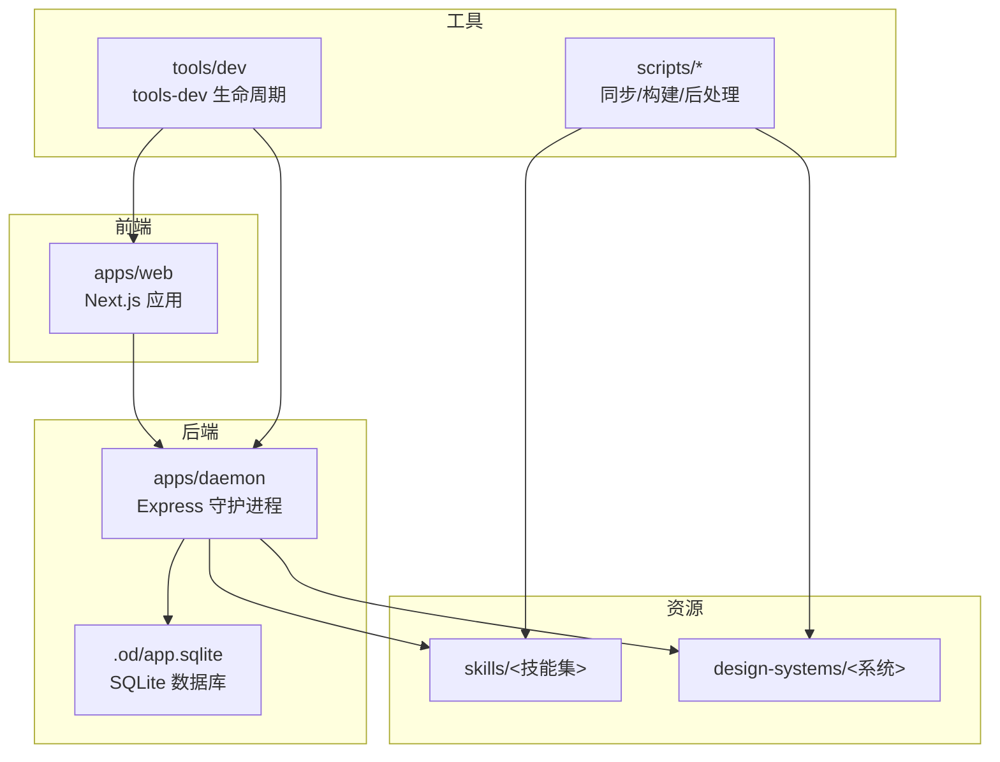
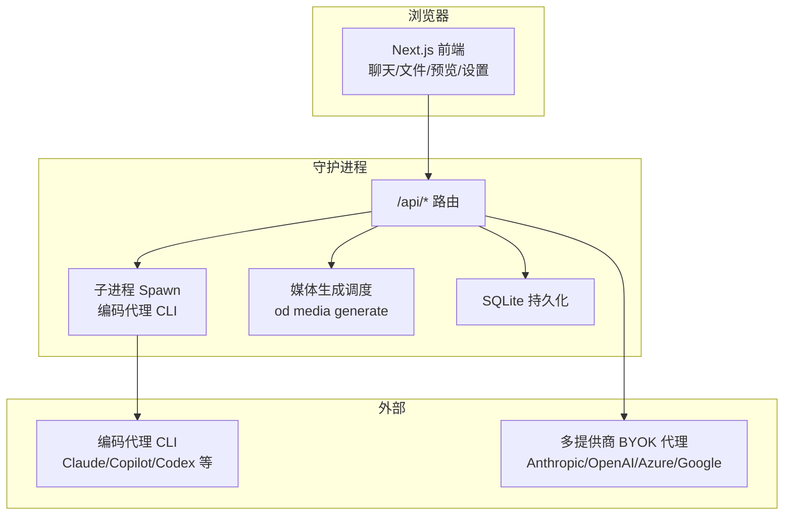
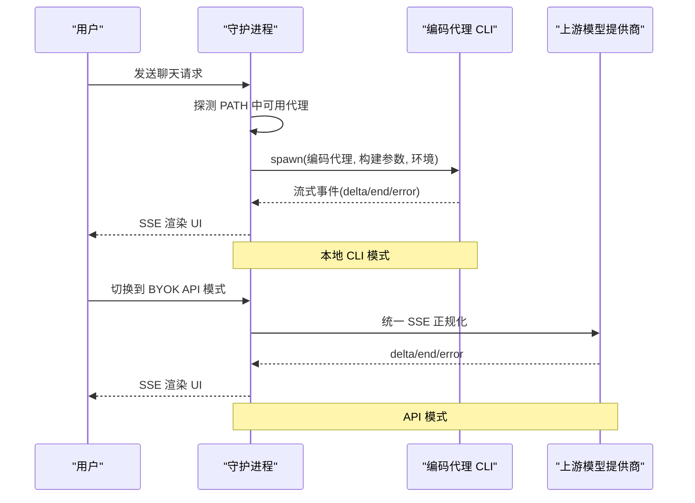
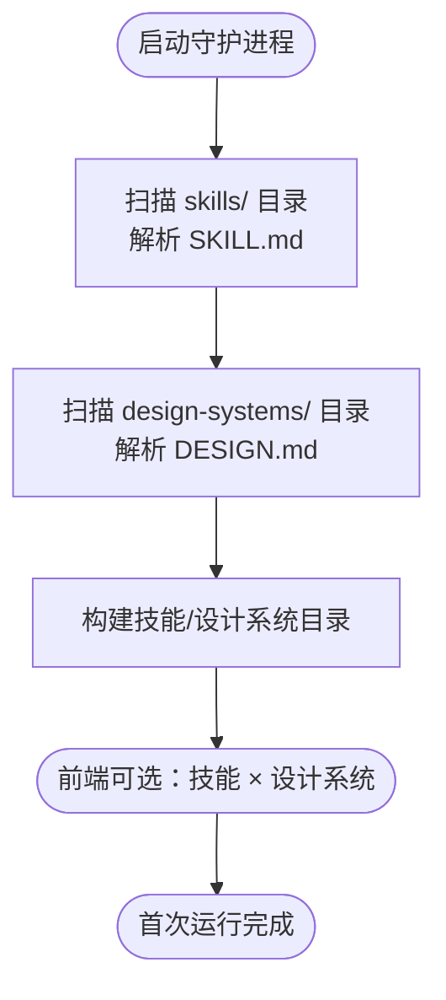
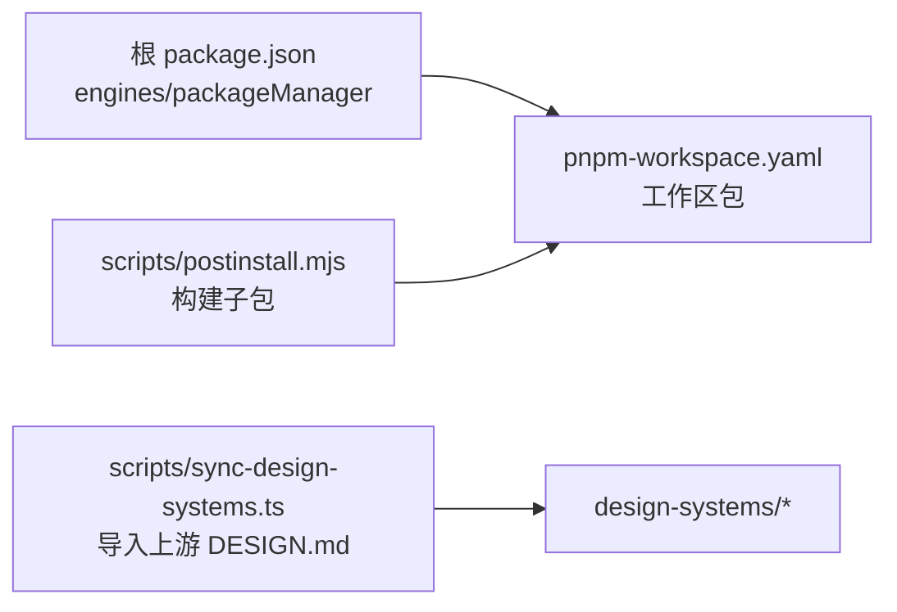

# 快速开始

<cite>
**本文引用的文件**
- [README.md](file://README.md)
- [QUICKSTART.md](file://QUICKSTART.md)
- [package.json](file://package.json)
- [pnpm-workspace.yaml](file://pnpm-workspace.yaml)
- [apps/daemon/package.json](file://apps/daemon/package.json)
- [apps/daemon/src/agents.ts](file://apps/daemon/src/agents.ts)
- [apps/daemon/src/skills.ts](file://apps/daemon/src/skills.ts)
- [apps/daemon/src/design-systems.ts](file://apps/daemon/src/design-systems.ts)
- [apps/daemon/src/cli.ts](file://apps/daemon/src/cli.ts)
- [apps/daemon/src/server.ts](file://apps/daemon/src/server.ts)
- [apps/daemon/src/db.ts](file://apps/daemon/src/db.ts)
- [tools/dev/package.json](file://tools/dev/package.json)
- [scripts/postinstall.mjs](file://scripts/postinstall.mjs)
- [scripts/sync-design-systems.ts](file://scripts/sync-design-systems.ts)
- [skills/web-prototype/SKILL.md](file://skills/web-prototype/SKILL.md)
- [design-systems/default/DESIGN.md](file://design-systems/default/DESIGN.md)
</cite>

## 目录
1. [简介](#简介)
2. [项目结构](#项目结构)
3. [核心组件](#核心组件)
4. [架构总览](#架构总览)
5. [详细组件分析](#详细组件分析)
6. [依赖关系分析](#依赖关系分析)
7. [性能考虑](#性能考虑)
8. [故障排除指南](#故障排除指南)
9. [结论](#结论)
10. [附录](#附录)

## 简介
本指南面向首次接触 Open Design 的用户，目标是在最短时间内完成安装、环境准备、依赖安装与首次运行，并成功加载内置的 31 个技能与 72 个设计系统。同时，提供如何检测与配置支持的编码代理 CLI（Claude Code、Codex、GitHub Copilot 等）的方法，以及如何验证安装是否成功。

Open Design 是一个本地优先的设计工作流平台，通过自动检测你系统中的“编码代理 CLI”或 BYOK（Bring Your Own Key）代理，驱动“技能 + 设计系统”的组合，实时生成可预览的产物并通过沙箱 iframe 展示，支持保存为 HTML/PDF/PPTX/ZIP/Markdown 等格式。

## 项目结构
仓库采用 pnpm 工作区组织，核心应用分为：
- apps/daemon：Node + Express 的本地守护进程，负责聊天、项目管理、媒体生成等后端能力
- apps/web：Next.js 16 App Router 前端应用，提供聊天界面、文件工作区、预览与设置
- apps/desktop：可选的 Electron 桌面壳层
- skills/：内置 31 个技能（SKILL.md 协议）
- design-systems/：内置 72 个设计系统（DESIGN.md 规范）
- scripts/：同步上游设计系统、构建后处理等脚本
- tools/dev：开发期生命周期与调试工具（tools-dev）

图表来源
- [README.md: 344-441:344-441](file://README.md#L344-L441)
- [pnpm-workspace.yaml: 1-6:1-6](file://pnpm-workspace.yaml#L1-L6)

章节来源
- [README.md: 344-441:344-441](file://README.md#L344-L441)
- [pnpm-workspace.yaml: 1-6:1-6](file://pnpm-workspace.yaml#L1-L6)

## 核心组件
- 环境与工具链
  - Node.js 版本：约 24（工程通过 engines 约束）
  - 包管理器：pnpm 10.33.x（通过 Corepack 固定版本）
- 守护进程（apps/daemon）
  - 自动扫描 PATH 中的编码代理 CLI，构建模型列表，选择可用适配器
  - 提供 /api/* 路由，包括聊天、项目、媒体生成、设计系统与技能目录等
  - 内置 SQLite 存储（.od/app.sqlite），持久化项目、会话、消息、标签页与模板
- 技能与设计系统
  - 技能：31 个 SKILL.md 文件，定义模式（prototype/deck/template/design-system）、场景、触发词、预览类型等
  - 设计系统：72 个 DESIGN.md 文件，定义色彩、字体、布局、组件、动效、语音、品牌与反模式等
- 媒体生成
  - 通过 od CLI 的子命令 od media generate 调用守护进程接口，统一图像/视频/音频生成
- 开发工具
  - tools-dev：统一入口，启动/停止/重启守护进程与前端，查看状态与日志，执行检查

章节来源
- [README.md: 300-343:300-343](file://README.md#L300-L343)
- [apps/daemon/src/agents.ts: 119-604:119-604](file://apps/daemon/src/agents.ts#L119-L604)
- [apps/daemon/src/skills.ts: 41-98:41-98](file://apps/daemon/src/skills.ts#L41-L98)
- [apps/daemon/src/design-systems.ts: 10-41:10-41](file://apps/daemon/src/design-systems.ts#L10-L41)
- [apps/daemon/src/db.ts: 16-29:16-29](file://apps/daemon/src/db.ts#L16-L29)
- [apps/daemon/src/cli.ts: 49-51:49-51](file://apps/daemon/src/cli.ts#L49-L51)

## 架构总览
下图展示了浏览器前端、守护进程与编码代理之间的交互路径，以及媒体生成的统一调度。

图表来源
- [README.md: 257-299:257-299](file://README.md#L257-L299)
- [apps/daemon/src/agents.ts: 119-604:119-604](file://apps/daemon/src/agents.ts#L119-L604)
- [apps/daemon/src/cli.ts: 139-210:139-210](file://apps/daemon/src/cli.ts#L139-L210)
- [apps/daemon/src/db.ts: 38-147:38-147](file://apps/daemon/src/db.ts#L38-L147)

## 详细组件分析

### 环境与依赖安装
- 环境要求
  - Node.js：约 24（工程通过 engines 约束）
  - pnpm：10.33.x（通过 packageManager 固定版本）
  - OS：macOS/Linux/WSL2；Windows 原生可用但建议以 WSL2 为安全基线
- 安装步骤
  1) 克隆仓库并进入目录
  2) 启用 Corepack 并确认 pnpm 版本
  3) 执行依赖安装
  4) 启动开发服务（tools-dev run web）
  5) 在终端输出的 URL 打开浏览器访问

命令示例与预期行为
- 启用 Corepack 并校验 pnpm 版本
  - 命令：corepack enable && corepack pnpm --version
  - 预期输出：打印 10.33.x 版本号
- 依赖安装
  - 命令：pnpm install
  - 行为：安装工作区所有包，执行 postinstall 构建 sidecar/proto/platform 等子包
- 启动开发服务
  - 命令：pnpm tools-dev run web
  - 行为：启动守护进程 + 前端（前台），打印监听地址；自动打开浏览器

章节来源
- [QUICKSTART.md: 7-31:7-31](file://QUICKSTART.md#L7-L31)
- [package.json: 1-43:1-43](file://package.json#L1-L43)
- [apps/daemon/package.json: 53-55:53-55](file://apps/daemon/package.json#L53-L55)
- [tools/dev/package.json: 27-29:27-29](file://tools/dev/package.json#L27-L29)
- [scripts/postinstall.mjs: 8-49:8-49](file://scripts/postinstall.mjs#L8-L49)

### 编码代理 CLI 检测与配置
- 自动检测
  - 守护进程启动时扫描 PATH，识别已安装的编码代理 CLI（如 claude、codex、devin、gemini、opencode、cursor-agent、qwen、copilot、hermes、kimi、kiro、vibe 等）
  - 对每个代理探测版本、帮助信息与模型列表，构建可用适配器集合
- 运行时选择
  - 若检测到可用 CLI，默认使用本地 CLI 模式；若未检测到，则切换至 BYOK API 模式（Anthropic/OpenAI/Azure/Google）
- 适配器参数与流式解析
  - 不同 CLI 使用不同的 argv 形态与流式事件格式（如 claude-stream-json、copilot-stream-json、json-event-stream、acp-json-rpc、pi-rpc、plain）
  - 针对长提示词，多数适配器通过 stdin 或 prompt 文件传递，避免 Windows/Linux 的 argv 长度限制

图表来源
- [apps/daemon/src/agents.ts: 799-800:799-800](file://apps/daemon/src/agents.ts#L799-L800)
- [apps/daemon/src/agents.ts: 119-604:119-604](file://apps/daemon/src/agents.ts#L119-L604)
- [apps/daemon/src/server.ts: 14-20:14-20](file://apps/daemon/src/server.ts#L14-L20)

章节来源
- [apps/daemon/src/agents.ts: 119-604:119-604](file://apps/daemon/src/agents.ts#L119-L604)
- [apps/daemon/src/server.ts: 14-20:14-20](file://apps/daemon/src/server.ts#L14-L20)

### 加载内置技能与设计系统
- 技能加载
  - 扫描 skills/ 下的每个目录，读取 SKILL.md，解析 frontmatter，生成技能清单
  - 支持技能别名映射、默认技能、场景分类、预览类型等元数据
- 设计系统加载
  - 扫描 design-systems/ 下的每个目录，读取 DESIGN.md，提取标题、类别、摘要、色板与表面类型
  - 自动生成 4 色样本用于选择器展示
- 示例与验证
  - skills/web-prototype/SKILL.md 展示了技能协议与工作流
  - design-systems/default/DESIGN.md 展示了 DESIGN.md 的结构与规范

图表来源
- [apps/daemon/src/skills.ts: 41-98:41-98](file://apps/daemon/src/skills.ts#L41-L98)
- [apps/daemon/src/design-systems.ts: 10-41:10-41](file://apps/daemon/src/design-systems.ts#L10-L41)
- [skills/web-prototype/SKILL.md: 1-98:1-98](file://skills/web-prototype/SKILL.md#L1-L98)
- [design-systems/default/DESIGN.md: 1-63:1-63](file://design-systems/default/DESIGN.md#L1-L63)

章节来源
- [apps/daemon/src/skills.ts: 41-98:41-98](file://apps/daemon/src/skills.ts#L41-L98)
- [apps/daemon/src/design-systems.ts: 10-41:10-41](file://apps/daemon/src/design-systems.ts#L10-L41)
- [skills/web-prototype/SKILL.md: 1-98:1-98](file://skills/web-prototype/SKILL.md#L1-L98)
- [design-systems/default/DESIGN.md: 1-63:1-63](file://design-systems/default/DESIGN.md#L1-L63)

### 首次运行与欢迎流程
- 首次启动时的行为
  - 自动检测 PATH 中的编码代理 CLI 并选择其一
  - 加载 31 个技能与 72 个设计系统
  - 弹出欢迎对话框，允许粘贴 Anthropic Key（仅在 BYOK 模式需要）
  - 自动创建 .od/ 目录（包含 app.sqlite、artifacts/、projects/<id>/）
- 验证要点
  - 浏览器打开后，选择技能与设计系统，输入提示并发送
  - 观察左侧聊天流与右侧沙箱预览是否正常渲染
  - 点击“保存到磁盘”或导出为 ZIP，确认产物出现在 .od/projects/<id>/ 下

章节来源
- [README.md: 316-343:316-343](file://README.md#L316-L343)

### 媒体生成与 od CLI
- od CLI 子命令
  - 默认：启动守护进程并打开浏览器
  - 子命令 od media generate：由编码代理在聊天中调用，向守护进程发起媒体生成任务
- 环境变量注入
  - 守护进程在 spawn 编码代理时注入 OD_BIN、OD_DAEMON_URL、OD_PROJECT_ID、OD_PROJECT_DIR
- 故障排查
  - 若出现 OD_BIN 未设置或守护进程 URL 为 :0，需重建守护进程 CLI 并重启运行时

章节来源
- [apps/daemon/src/cli.ts: 49-51:49-51](file://apps/daemon/src/cli.ts#L49-L51)
- [apps/daemon/src/cli.ts: 139-210:139-210](file://apps/daemon/src/cli.ts#L139-L210)
- [apps/daemon/src/cli.ts: 152-159:152-159](file://apps/daemon/src/cli.ts#L152-L159)
- [QUICKSTART.md: 80-109:80-109](file://QUICKSTART.md#L80-L109)

## 依赖关系分析
- 工作区与包管理
  - pnpm 工作区包含 packages/*、apps/*、tools/*、e2e
  - package.json 通过 engines 与 packageManager 固定 Node 与 pnpm 版本
- 构建与后处理
  - postinstall.mjs 自动构建 sidecar-proto、sidecar、platform、tools/dev、tools/pack 等子包
- 设计系统同步
  - sync-design-systems.ts 将上游 getdesign 的模板导入为 DESIGN.md，并添加分类与描述

图表来源
- [package.json: 1-43:1-43](file://package.json#L1-L43)
- [pnpm-workspace.yaml: 1-6:1-6](file://pnpm-workspace.yaml#L1-L6)
- [scripts/postinstall.mjs: 8-49:8-49](file://scripts/postinstall.mjs#L8-L49)
- [scripts/sync-design-systems.ts: 102-155:102-155](file://scripts/sync-design-systems.ts#L102-L155)

章节来源
- [package.json: 1-43:1-43](file://package.json#L1-L43)
- [pnpm-workspace.yaml: 1-6:1-6](file://pnpm-workspace.yaml#L1-L6)
- [scripts/postinstall.mjs: 8-49:8-49](file://scripts/postinstall.mjs#L8-L49)
- [scripts/sync-design-systems.ts: 102-155:102-155](file://scripts/sync-design-systems.ts#L102-L155)

## 性能考虑
- 本地守护进程与前端分离
  - 开发模式下，tools-dev 会先启动守护进程，再将端口传给前端，通过 next.config.ts 的重写实现无 CORS 访问
- SSE 传输
  - 守护进程通过 SSE 向前端推送流式事件；生产模式下守护进程直接提供静态导出
- 端口与命名空间
  - 可通过 --daemon-port 与 --web-port 指定端口；--namespace 支持多实例隔离
- 代理与网络
  - 若放置 nginx，需保持 SSE 不缓冲且关闭 gzip；否则可能出现 ERR_INCOMPLETE_CHUNKED_ENCODING

章节来源
- [QUICKSTART.md: 78-131:78-131](file://QUICKSTART.md#L78-L131)

## 故障排除指南
- “PATH 未发现任何代理”
  - 解决：安装任一支持的 CLI（claude、codex、devin、gemini、opencode、cursor-agent、qwen、copilot 等），或在设置中切换到 BYOK API 模式并粘贴密钥
- “/api/chat 返回 500”
  - 解决：查看守护进程日志末尾错误；不同 CLI 的 argv 形态不同，参考 agents.ts 的 buildArgs 配置进行调整
- “媒体生成提示 OD_BIN 未设置或守护进程 URL 为 :0”
  - 解决：重建守护进程 CLI 并重启运行时；不要复用旧的 CLI 会话，应从应用重新打开项目以注入新鲜的 OD_* 变量
- “Codex 插件上下文过大”
  - 解决：以 OD_CODEX_DISABLE_PLUGINS=1 启动，使 Codex 进程禁用插件
- “产物未渲染”
  - 解决：确认系统提示已正确下发；若模型未包裹 <artifact>，请尝试更合适的模型或技能

章节来源
- [QUICKSTART.md: 215-222:215-222](file://QUICKSTART.md#L215-L222)
- [apps/daemon/src/agents.ts: 119-604:119-604](file://apps/daemon/src/agents.ts#L119-L604)

## 结论
通过上述步骤，你可以在本地快速搭建 Open Design：安装 Node 与 pnpm、启用 Corepack、安装依赖、启动 tools-dev，即可在浏览器中体验自动检测的编码代理 CLI、加载内置的 31 个技能与 72 个设计系统，并通过沙箱预览与导出功能完成设计闭环。遇到问题时，可依据故障排除章节逐项定位并解决。

## 附录
- 常用命令
  - pnpm tools-dev run web：前台启动守护进程 + 前端
  - pnpm tools-dev：后台启动守护进程 + 前端 + 桌面壳层
  - pnpm tools-dev status/logs/check/stop：查看状态、日志、诊断与停止
  - pnpm build/typecheck：生产构建与类型检查
- 第一次运行后的 .od 目录
  - app.sqlite：项目/会话/消息/标签页/模板
  - artifacts/：一次性“保存到磁盘”渲染
  - projects/<id>/：每个项目的文件夹，也是编码代理的工作目录

章节来源
- [README.md: 325-342:325-342](file://README.md#L325-L342)
- [apps/daemon/src/db.ts: 16-29:16-29](file://apps/daemon/src/db.ts#L16-L29)