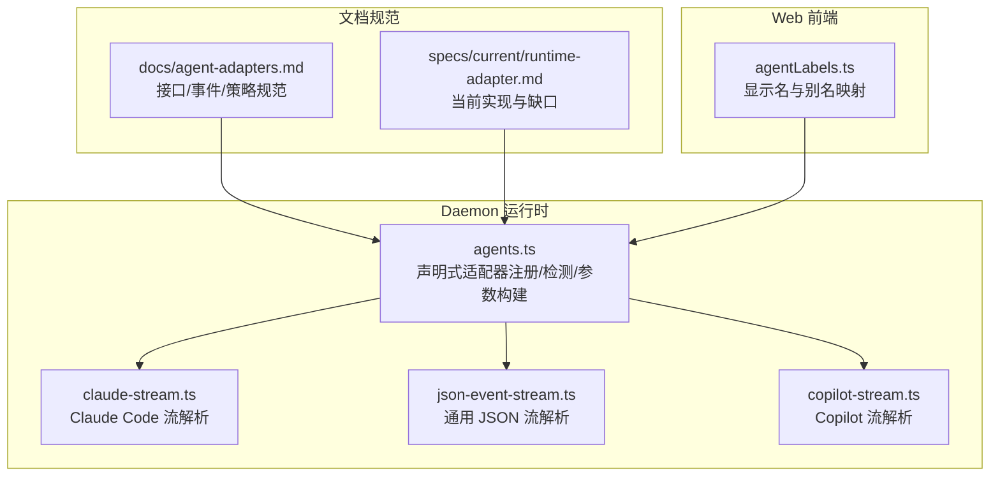
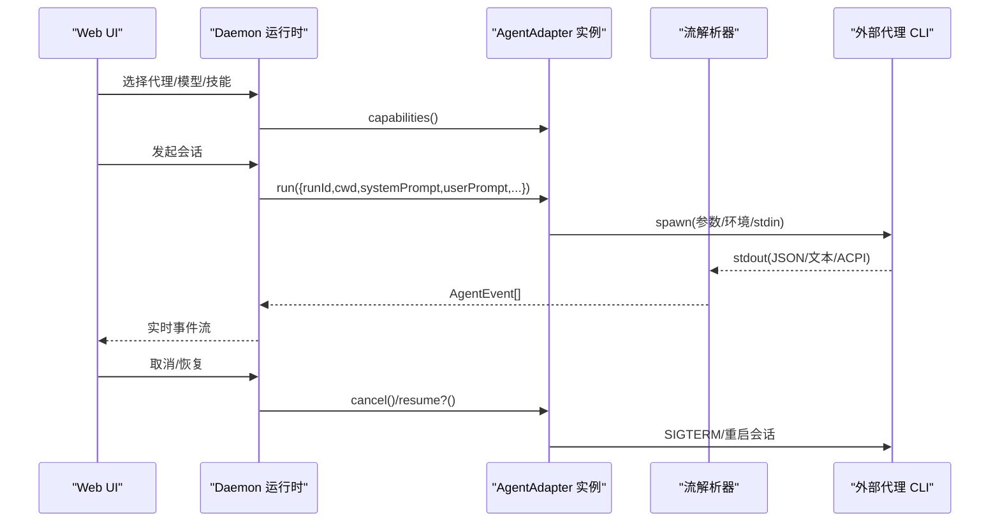
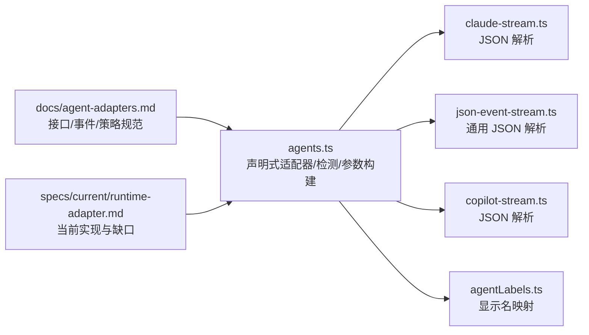
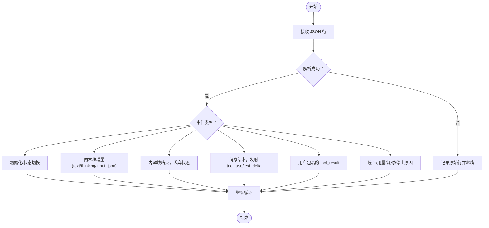

# 代理适配器开发

<cite>
**本文引用的文件**
- [docs/agent-adapters.md](file://docs/agent-adapters.md)
- [specs/current/runtime-adapter.md](file://specs/current/runtime-adapter.md)
- [apps/daemon/src/agents.ts](file://apps/daemon/src/agents.ts)
- [apps/daemon/src/claude-stream.ts](file://apps/daemon/src/claude-stream.ts)
- [apps/daemon/src/json-event-stream.ts](file://apps/daemon/src/json-event-stream.ts)
- [apps/daemon/src/copilot-stream.ts](file://apps/daemon/src/copilot-stream.ts)
- [apps/web/src/utils/agentLabels.ts](file://apps/web/src/utils/agentLabels.ts)
- [CONTRIBUTING.md](file://CONTRIBUTING.md)
</cite>

## 目录
1. [简介](#简介)
2. [项目结构](#项目结构)
3. [核心组件](#核心组件)
4. [架构总览](#架构总览)
5. [组件详解](#组件详解)
6. [依赖关系分析](#依赖关系分析)
7. [性能考量](#性能考量)
8. [故障排查指南](#故障排查指南)
9. [结论](#结论)
10. [附录](#附录)

## 简介
本指南面向希望为新的编程代理创建适配器的开发者，系统讲解如何基于统一的 AgentAdapter 接口完成从“发现与检测”到“能力协商”、“执行与取消/恢复”、“流式事件解析”、“权限与安全边界”的完整实现。文档同时给出 Claude Code、Codex、Cursor Agent 等现有适配器的实现模式与最佳实践，并对技能注入策略（原生技能加载、提示注入、文件放置工作流）进行对比与选择建议。

## 项目结构
- 适配器目标形态由文档定义，包含统一的接口、事件模型与检测策略；当前运行时层以“声明式对象数组 + 运行时解析器”的方式落地。
- 关键实现位于 daemon 层，包含通用检测逻辑、参数构建、流式事件解析器与工具循环等；web 层负责展示与标签映射。

图表来源
- [apps/daemon/src/agents.ts:119-200](file://apps/daemon/src/agents.ts#L119-L200)
- [apps/daemon/src/claude-stream.ts:23-208](file://apps/daemon/src/claude-stream.ts#L23-L208)
- [apps/daemon/src/json-event-stream.ts:185-217](file://apps/daemon/src/json-event-stream.ts#L185-L217)
- [apps/daemon/src/copilot-stream.ts](file://apps/daemon/src/copilot-stream.ts)
- [apps/web/src/utils/agentLabels.ts:1-47](file://apps/web/src/utils/agentLabels.ts#L1-L47)
- [docs/agent-adapters.md:13-69](file://docs/agent-adapters.md#L13-L69)
- [specs/current/runtime-adapter.md:261-284](file://specs/current/runtime-adapter.md#L261-L284)

章节来源
- [docs/agent-adapters.md:1-294](file://docs/agent-adapters.md#L1-L294)
- [specs/current/runtime-adapter.md:107-169](file://specs/current/runtime-adapter.md#L107-L169)

## 核心组件
- AgentAdapter 接口：定义 detect()/capabilities()/run()/cancel()/resume? 等方法，输出统一 AgentEvent 流。
- 检测策略：双信号（PATH 扫描 + 配置目录探测），并缓存结果与 TTL。
- 能力协商：通过 capabilities() 返回 surgicalEdit/nativeSkillLoading/streaming/resume/permissionMode 等能力位。
- 执行与流式解析：根据 streamFormat 选择解析器（如 claude-stream-json、acp-json-rpc、plain）。
- 权限与边界：继承底层代理的权限模型；API fallback 自身实现白名单工具集与 cwd 边界。
- 技能注入：三种策略优先级递减（原生技能加载 > 提示注入 > 文件放置工作流）。

章节来源
- [docs/agent-adapters.md:13-69](file://docs/agent-adapters.md#L13-L69)
- [docs/agent-adapters.md:71-80](file://docs/agent-adapters.md#L71-L80)
- [docs/agent-adapters.md:100-121](file://docs/agent-adapters.md#L100-L121)
- [docs/agent-adapters.md:253-261](file://docs/agent-adapters.md#L253-L261)

## 架构总览
下图展示了从用户选择代理到生成产物的端到端流程，以及各适配器在运行时中的角色分工。

图表来源
- [docs/agent-adapters.md:13-69](file://docs/agent-adapters.md#L13-L69)
- [apps/daemon/src/claude-stream.ts:23-208](file://apps/daemon/src/claude-stream.ts#L23-L208)
- [apps/daemon/src/json-event-stream.ts:185-217](file://apps/daemon/src/json-event-stream.ts#L185-L217)
- [apps/daemon/src/agents.ts:119-200](file://apps/daemon/src/agents.ts#L119-L200)

## 组件详解

### AgentAdapter 接口与实现要点
- detect()：返回 AgentDetection 或 null。双信号一致才认为已安装；单信号则标记 authState 并引导用户完成认证。
- capabilities()：返回能力位，驱动 UI 功能开关与体验降级。
- run(params)：返回可异步迭代的 AgentEvent 序列；按 streamFormat 选择解析器。
- cancel(runId)/resume?(runId,message)：取消与恢复由适配器与底层 CLI 协作实现；当前未统一 runId 取消 API，多依赖连接关闭/SIGTERM。
- AgentEvent：统一承载 thinking/tool_call/tool_result/text_delta/file_write/error/done 等事件类型。

章节来源
- [docs/agent-adapters.md:13-69](file://docs/agent-adapters.md#L13-L69)
- [specs/current/runtime-adapter.md:261-284](file://specs/current/runtime-adapter.md#L261-L284)

### 检测策略与认证状态
- 双信号机制：
  - PATH 扫描：快速判断二进制是否在 PATH 中。
  - 配置目录探测：检查 ~/.<agent>/ 等目录是否存在，覆盖 npm 全局安装导致的 PATH 不一致问题。
- 缓存与重检测：启动并行检测，结果缓存至 ~/.open-design/agents.json，带 24 小时 TTL；SIGHUP 触发重新检测。
- 认证状态：若仅 PATH 或仅配置目录命中，标记 authState 为 missing 并提示用户运行 CLI 的认证流程。

章节来源
- [docs/agent-adapters.md:71-80](file://docs/agent-adapters.md#L71-L80)
- [apps/daemon/src/agents.ts:656-701](file://apps/daemon/src/agents.ts#L656-L701)
- [apps/daemon/src/agents.ts:733-775](file://apps/daemon/src/agents.ts#L733-L775)

### 能力协商与 UI 驱动
- 能力位包括 surgicalEdit/nativeSkillLoading/streaming/resume/permissionMode/contextWindowHint 等。
- Web UI 依据 capabilities() 决定功能可用性与降级提示，避免“在某代理上可用而在另一代理上失败”。

章节来源
- [docs/agent-adapters.md:42-49](file://docs/agent-adapters.md#L42-L49)
- [docs/agent-adapters.md:199-210](file://docs/agent-adapters.md#L199-L210)

### 执行流程与流式传输
- 参数构建：buildArgs(prompt, imagePaths, extraAllowedDirs, options, runtimeContext) 产出 argv；不同代理差异体现在 flags、stdin 传递、模型选择等。
- 流格式：
  - claude-stream-json：JSON Lines，Claude Code 的 stream-json 输出，经 claude-stream.ts 解析。
  - acp-json-rpc：Devin 等通过 stdio 的 ACP 协议，由共享模块处理。
  - plain：原始文本透传，逐块转发。
- 事件映射：解析器将底层事件映射为统一 AgentEvent，供 UI 渲染与后续处理。

章节来源
- [apps/daemon/src/agents.ts:119-200](file://apps/daemon/src/agents.ts#L119-L200)
- [apps/daemon/src/claude-stream.ts:23-208](file://apps/daemon/src/claude-stream.ts#L23-L208)
- [apps/daemon/src/json-event-stream.ts:185-217](file://apps/daemon/src/json-event-stream.ts#L185-L217)
- [specs/current/runtime-adapter.md:107-169](file://specs/current/runtime-adapter.md#L107-L169)

### 技能注入策略与实现
- 原生技能加载（首选）：代理自动扫描 ~/.<agent>/skills/，OD 通过符号链接将技能放入该目录，零提示开销。
- 提示注入（通用回退）：读取 SKILL.md 与 references/*，拼接进 systemPrompt，并复制 assets/ 到 cwd。
- 文件放置工作流（混合）：针对支持 .cursorrules/agenda 等项目级规则文件的代理，在 artifact 目录写入规则文件，由代理自动读取。
- 能力声明：通过 capabilities().nativeSkillLoading 与私有字段 skillInjectionStrategy 控制策略选择。

章节来源
- [docs/agent-adapters.md:100-121](file://docs/agent-adapters.md#L100-L121)

### 权限控制与安全边界
- 继承底层代理权限模型：Claude Code 使用其 own allowed-tools/permission-mode；Codex/Cursor 默认以 artifact cwd 为边界；API fallback 自身实现白名单工具集与网络隔离。
- 环境变量处理：例如 Claude Code 场景中，为避免 SDK/脚本导出的密钥影响其自有认证，会清理 ANTHROPIC_API_KEY。

章节来源
- [docs/agent-adapters.md:253-261](file://docs/agent-adapters.md#L253-L261)
- [apps/daemon/src/agents.ts:824-844](file://apps/daemon/src/agents.ts#L824-L844)

### 取消与恢复
- 当前取消主要通过 HTTP 连接关闭与向 CLI 发送 SIGTERM 实现；尚未统一 runId/cancel API。
- 恢复（resume）为可选接口，部分代理具备中断后继续的能力，需在适配器中实现。

章节来源
- [docs/agent-adapters.md:131-132](file://docs/agent-adapters.md#L131-L132)
- [specs/current/runtime-adapter.md:269-271](file://specs/current/runtime-adapter.md#L269-L271)

### 具体适配器实现模式

#### Claude Code（参考实现）
- 调用方式：使用 --output-format stream-json 与 --verbose 输出结构化事件流。
- 技能注入：原生技能加载（~/.claude/skills/）。
- 撕裂编辑：使用内置 Edit 工具。
- 权限：设置 --permission-mode bypassPermissions。
- 取消：发送 SIGTERM，Claude Code 会刷新并退出。
- 注意：JSON 流 schema 版本化，需固定版本并警告不匹配。

章节来源
- [docs/agent-adapters.md:124-133](file://docs/agent-adapters.md#L124-L133)

#### Codex
- 调用方式：codex exec --json --skip-git-repo-check --full-auto -C <cwd> "<prompt>"。
- 流式：使用 JSON 事件流，解析器映射 thread.started/turn.started/item.completed/usage 等。
- 技能注入：版本相关（新版本支持 ~/.codex/skills/，旧版本回退提示注入）。
- 撕裂编辑：当前通过“仅变更 X”再生文件近似实现。
- 注意：可能遇到“错误组织”的认证状态，可在检测阶段通过 whoami 判断。

章节来源
- [specs/current/runtime-adapter.md:107-128](file://specs/current/runtime-adapter.md#L107-L128)
- [docs/agent-adapters.md:143-149](file://docs/agent-adapters.md#L143-L149)

#### Cursor Agent
- 调用方式：cursor-agent --workspace <dir> "<prompt>"（以实际 CLI 文档为准）。
- 流式：JSON Lines。
- 技能注入：写入 .cursorrules 文件到 artifact 目录，由代理读取。
- 撕裂编辑：使用其内联编辑工具。
- 注意：操作工作区而非单文件，需约束工作区到 artifact 目录。

章节来源
- [docs/agent-adapters.md:161-168](file://docs/agent-adapters.md#L161-L168)

#### Gemini CLI
- 调用方式：GEMINI_CLI_TRUST_WORKSPACE=true gemini --output-format stream-json --yolo，提示通过 stdin 传递。
- 流式：JSON Lines。
- 技能注入：提示注入。
- 撕裂编辑：再生整文件。
- 注意：Windows 上命令行过长限制，采用 stdin 透传提示。

章节来源
- [docs/agent-adapters.md:169-186](file://docs/agent-adapters.md#L169-L186)

#### Copilot
- 调用方式：copilot -p "<prompt>" --allow-all-tools --output-format json --add-dir <skills> --add-dir <design-systems>。
- 流式：--output-format json 对应 UI 事件形状，解析器与 claude-stream 类似。
- 技能注入：提示注入；未来可逆向其 skill 工具格式。
- 撕裂编辑：专用 edit 工具。
- 注意：非交互模式必须显式允许所有工具，否则会阻塞等待人工确认。

章节来源
- [docs/agent-adapters.md:191-198](file://docs/agent-adapters.md#L191-L198)

#### API Fallback（无 CLI）
- 调用方式：直接调用 Anthropic Messages API，stream: true。
- 流式：JSON Lines。
- 技能注入：提示注入。
- 工具循环：自建 Read/Write/Edit 工具，对 artifact cwd 执行。
- 撕裂编辑：通过“仅变更 X”再生文件近似实现。
- 价值：在无 daemon 的部署拓扑或首次体验场景仍可工作。

章节来源
- [docs/agent-adapters.md:134-142](file://docs/agent-adapters.md#L134-L142)

### 新代理接入步骤（贡献指南）
- 在 agents.ts 的 AGENT_DEFS 中新增条目，至少包含 id/name/bin/versionArgs/buildArgs/streamFormat 等。
- 若 CLI 支持结构化事件流，编写/复用解析器（如 claude-stream.ts、json-event-stream.ts、copilot-stream.ts）。
- 如需能力探测（flags），配置 helpArgs 与 capabilityFlags，以便在 probe 阶段收集。
- 更新文档与 README 表格，补充 CLI 的特性与注意事项。

章节来源
- [CONTRIBUTING.md:171-195](file://CONTRIBUTING.md#L171-L195)

## 依赖关系分析

图表来源
- [apps/daemon/src/agents.ts:119-200](file://apps/daemon/src/agents.ts#L119-L200)
- [apps/daemon/src/claude-stream.ts:23-208](file://apps/daemon/src/claude-stream.ts#L23-L208)
- [apps/daemon/src/json-event-stream.ts:185-217](file://apps/daemon/src/json-event-stream.ts#L185-L217)
- [apps/daemon/src/copilot-stream.ts](file://apps/daemon/src/copilot-stream.ts)
- [apps/web/src/utils/agentLabels.ts:1-47](file://apps/web/src/utils/agentLabels.ts#L1-L47)
- [docs/agent-adapters.md:13-69](file://docs/agent-adapters.md#L13-L69)
- [specs/current/runtime-adapter.md:261-284](file://specs/current/runtime-adapter.md#L261-L284)

章节来源
- [apps/daemon/src/agents.ts:119-200](file://apps/daemon/src/agents.ts#L119-L200)
- [apps/daemon/src/claude-stream.ts:23-208](file://apps/daemon/src/claude-stream.ts#L23-L208)
- [apps/daemon/src/json-event-stream.ts:185-217](file://apps/daemon/src/json-event-stream.ts#L185-L217)
- [apps/daemon/src/copilot-stream.ts](file://apps/daemon/src/copilot-stream.ts)
- [apps/web/src/utils/agentLabels.ts:1-47](file://apps/web/src/utils/agentLabels.ts#L1-L47)
- [docs/agent-adapters.md:13-69](file://docs/agent-adapters.md#L13-L69)
- [specs/current/runtime-adapter.md:261-284](file://specs/current/runtime-adapter.md#L261-L284)

## 性能考量
- PATH 扫描与帮助标志探测成本低，但需注意超时与缓冲上限，避免阻塞启动。
- 流式解析器应尽量无额外分配与字符串拼接，减少 UI 延迟。
- Windows 场景下避免将长提示作为命令行参数，改用 stdin 管道，规避 ENAMETOOLONG。
- 缓存检测结果与模型列表，减少重复探测与 IO。

章节来源
- [apps/daemon/src/agents.ts:733-775](file://apps/daemon/src/agents.ts#L733-L775)
- [apps/daemon/src/agents.ts:150-157](file://apps/daemon/src/agents.ts#L150-L157)
- [docs/agent-adapters.md:179-183](file://docs/agent-adapters.md#L179-L183)

## 故障排查指南
- 无法检测到代理
  - 检查 PATH 是否包含二进制；若通过 npm 全局安装，确认用户级 CLI 安装路径已被包含。
  - 检查配置目录是否存在，必要时引导用户运行 CLI 的认证流程。
- 流式事件缺失或重复
  - 确认 CLI 版本与 flags（如 partialMessages）是否满足解析器要求。
  - 检查解析器是否正确处理 content_block_start/delta/stop 与 assistant 结束事件。
- 取消无效
  - 确认是否通过连接关闭或向 CLI 发送 SIGTERM；若代理不响应，考虑实现 resume/runId 管理。
- Windows 命令行过长
  - 使用 promptViaStdin: true，将提示写入 stdin 而非 argv。
- 权限被拒绝
  - 确认代理的非交互/自动批准开关已启用；API fallback 仅开放 Read/Write/Edit 白名单工具。

章节来源
- [apps/daemon/src/agents.ts:656-701](file://apps/daemon/src/agents.ts#L656-L701)
- [apps/daemon/src/claude-stream.ts:160-205](file://apps/daemon/src/claude-stream.ts#L160-L205)
- [apps/daemon/src/json-event-stream.ts:206-217](file://apps/daemon/src/json-event-stream.ts#L206-L217)
- [docs/agent-adapters.md:179-183](file://docs/agent-adapters.md#L179-L183)
- [docs/agent-adapters.md:253-261](file://docs/agent-adapters.md#L253-L261)

## 结论
通过统一的 AgentAdapter 接口与运行时解析器，OD 将多样化的代理 CLI 以最小侵入的方式集成进来。开发者只需关注“如何发现/如何调用/如何解析/如何注入技能/如何处理权限”，即可快速为新代理提供一致的用户体验。建议优先采用原生技能加载与结构化事件流，辅以提示注入与文件放置工作流作为回退，确保在不同代理间平滑迁移。

## 附录

### AgentAdapter 方法与职责速览
- detect()：双信号检测，返回可执行路径、版本、配置/技能目录与认证状态。
- capabilities()：返回能力位，驱动 UI 功能开关。
- run(params)：构建 argv，spawn 子进程，解析 stdout 为统一事件流。
- cancel(runId)：触发取消（常见为 SIGTERM 或连接关闭）。
- resume?(runId,message)：可选的恢复接口，用于中断后继续。

章节来源
- [docs/agent-adapters.md:13-69](file://docs/agent-adapters.md#L13-L69)

### 流式事件解析流程（以 Claude Code 为例）

图表来源
- [apps/daemon/src/claude-stream.ts:43-205](file://apps/daemon/src/claude-stream.ts#L43-L205)