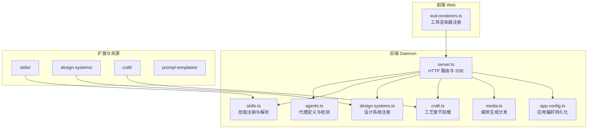
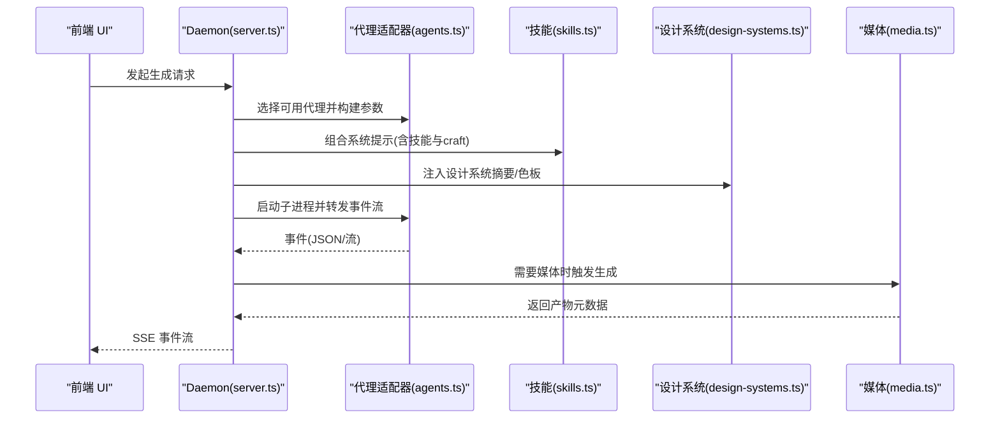
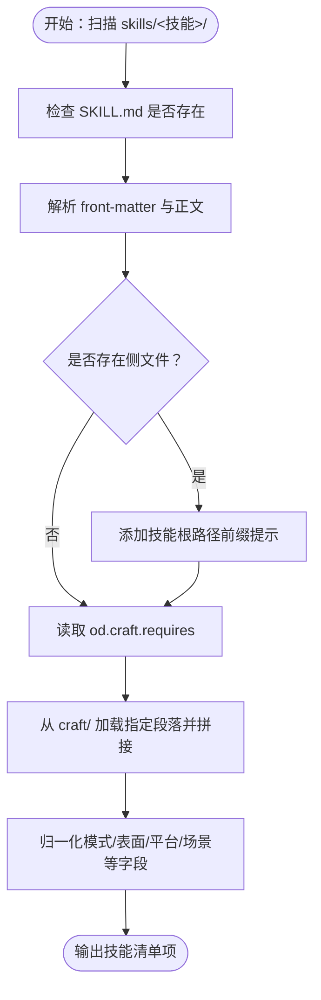
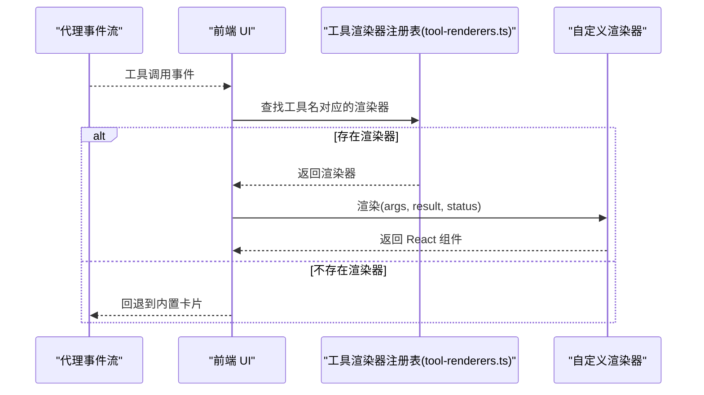
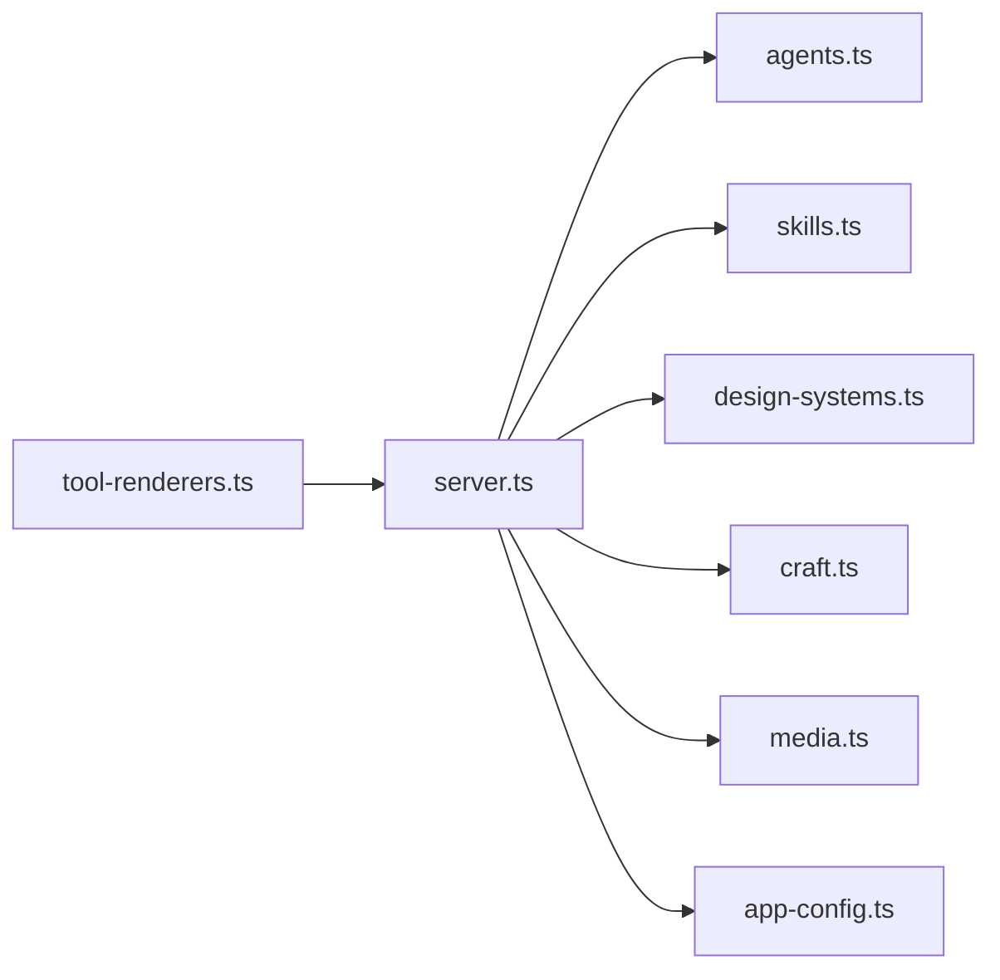

# 扩展开发

<cite>
**本文引用的文件**
- [apps/daemon/src/agents.ts](file://apps/daemon/src/agents.ts)
- [apps/daemon/src/skills.ts](file://apps/daemon/src/skills.ts)
- [apps/daemon/src/design-systems.ts](file://apps/daemon/src/design-systems.ts)
- [apps/daemon/src/craft.ts](file://apps/daemon/src/craft.ts)
- [apps/daemon/src/media.ts](file://apps/daemon/src/media.ts)
- [apps/daemon/src/server.ts](file://apps/daemon/src/server.ts)
- [apps/daemon/src/app-config.ts](file://apps/daemon/src/app-config.ts)
- [docs/agent-adapters.md](file://docs/agent-adapters.md)
- [packages/AGENTS.md](file://packages/AGENTS.md)
- [apps/web/src/runtime/tool-renderers.ts](file://apps/web/src/runtime/tool-renderers.ts)
- [apps/web/src/runtime/tool-renderers.test.tsx](file://apps/web/src/runtime/tool-renderers.test.tsx)
- [apps/daemon/src/shop-home-page.ts](file://apps/daemon/src/shop-home-page.ts)
- [apps/daemon/src/pi-rpc.ts](file://apps/daemon/src/pi-rpc.ts)
- [apps/daemon/src/project-watchers.ts](file://apps/daemon/src/project-watchers.ts)
- [apps/daemon/tests/deploy.test.ts](file://apps/daemon/tests/deploy.test.ts)
- [apps/daemon/tests/shop-home-page.test.ts](file://apps/daemon/tests/shop-home-page.test.ts)
</cite>

## 目录
1. [简介](#简介)
2. [项目结构](#项目结构)
3. [核心组件](#核心组件)
4. [架构总览](#架构总览)
5. [详细组件分析](#详细组件分析)
6. [依赖关系分析](#依赖关系分析)
7. [性能考量](#性能考量)
8. [故障排查指南](#故障排查指南)
9. [结论](#结论)
10. [附录](#附录)

## 简介
本指南面向希望在 Open Design 生态中进行扩展开发的工程师，涵盖以下主题：
- 如何开发新的代理适配器（Agent Adapter）
- 如何开发新的技能（Skill）
- 如何开发新的设计系统（Design System）
- 如何开发自定义插件（Plugin）并与核心系统集成
- 扩展点识别、系统集成模式与最佳实践
- 插件系统的架构、扩展接口与核心交互方式
- 开发示例、测试方法与发布流程
- 工具链、调试技巧与性能优化建议
- 社区生态贡献路径

## 项目结构
Open Design 采用多应用与多包协作的组织方式：
- apps/daemon：后端服务，负责代理检测、技能与设计系统注册、媒体生成、项目与工件管理、SSE 流等
- apps/web：前端应用，负责 UI、工具渲染器注册、与后端交互
- apps/packaged、apps/desktop、apps/landing-page：打包与桌面端相关
- packages/*：跨应用共享的协议与运行时抽象（contracts、sidecar-proto、sidecar、platform）
- skills/：内置技能集合
- design-systems/：内置设计系统集合
- craft/：技能“工艺”参考章节
- prompt-templates/：提示模板
- docs/：扩展文档与规范

图示来源
- [apps/daemon/src/server.ts:1-120](file://apps/daemon/src/server.ts#L1-L120)
- [apps/daemon/src/agents.ts:119-604](file://apps/daemon/src/agents.ts#L119-L604)
- [apps/daemon/src/skills.ts:41-98](file://apps/daemon/src/skills.ts#L41-L98)
- [apps/daemon/src/design-systems.ts:10-41](file://apps/daemon/src/design-systems.ts#L10-L41)
- [apps/daemon/src/craft.ts:21-46](file://apps/daemon/src/craft.ts#L21-L46)
- [apps/daemon/src/media.ts:210-473](file://apps/daemon/src/media.ts#L210-L473)
- [apps/daemon/src/app-config.ts:99-153](file://apps/daemon/src/app-config.ts#L99-L153)
- [apps/web/src/runtime/tool-renderers.ts:55-85](file://apps/web/src/runtime/tool-renderers.ts#L55-L85)

章节来源
- [apps/daemon/src/server.ts:1-120](file://apps/daemon/src/server.ts#L1-L120)
- [packages/AGENTS.md:1-35](file://packages/AGENTS.md#L1-L35)

## 核心组件
- 代理适配器层：统一代理检测、能力协商、执行与事件流，屏蔽不同 CLI 的差异
- 技能层：扫描技能目录、解析 front-matter、推导模式/表面/场景等元数据
- 设计系统层：扫描 DESIGN.md，提取标题、分类、摘要、色板与表面信息
- 媒体生成层：根据模型与供应商路由到真实或占位实现，支持安全校验与错误回退
- 应用配置层：持久化用户偏好（代理、技能、设计系统选择等），并发写入保护
- 工具渲染器插件层：前端可动态注册工具渲染器，覆盖默认 UI 表现

章节来源
- [apps/daemon/src/agents.ts:119-604](file://apps/daemon/src/agents.ts#L119-L604)
- [apps/daemon/src/skills.ts:41-98](file://apps/daemon/src/skills.ts#L41-L98)
- [apps/daemon/src/design-systems.ts:10-41](file://apps/daemon/src/design-systems.ts#L10-L41)
- [apps/daemon/src/media.ts:210-473](file://apps/daemon/src/media.ts#L210-L473)
- [apps/daemon/src/app-config.ts:99-153](file://apps/daemon/src/app-config.ts#L99-L153)
- [apps/web/src/runtime/tool-renderers.ts:55-85](file://apps/web/src/runtime/tool-renderers.ts#L55-L85)

## 架构总览
Open Design 的扩展点主要集中在四类：
- 代理适配器：通过统一接口对接不同 CLI，实现能力协商与事件流映射
- 技能与设计系统：通过目录扫描与 Markdown 解析，注入系统提示与上下文
- 媒体生成：通过模型注册表与供应商映射，实现真实/占位渲染
- 工具渲染器：前端可插拔 UI 渲染器，实现工具调用结果的可视化

图示来源
- [apps/daemon/src/server.ts:1-120](file://apps/daemon/src/server.ts#L1-L120)
- [apps/daemon/src/agents.ts:119-604](file://apps/daemon/src/agents.ts#L119-L604)
- [apps/daemon/src/skills.ts:41-98](file://apps/daemon/src/skills.ts#L41-L98)
- [apps/daemon/src/design-systems.ts:10-41](file://apps/daemon/src/design-systems.ts#L10-L41)
- [apps/daemon/src/media.ts:210-473](file://apps/daemon/src/media.ts#L210-L473)

## 详细组件分析

### 代理适配器扩展（新增 Agent Adapter）
目标：为新的代码代理 CLI 提供适配器，使其可被 Daemon 检测、能力协商与事件流映射。

- 关键职责
  - 可发现性：通过 PATH 扫描与配置目录探测
  - 能力协商：声明手术式编辑、原生技能加载、流式工具调用、恢复能力、权限模式等
  - 执行与事件：以统一的 AgentEvent 形态输出思考、工具调用、文件写入、完成/错误等
  - 参数构建：根据用户选择的模型与推理强度，拼装 CLI 参数；必要时通过 stdin 注入提示

- 扩展步骤
  1) 在代理定义数组中新增一项，定义二进制名、帮助标志、能力标志映射、模型列表/拉取函数、事件解析器、环境变量等
  2) 实现 buildArgs：按需拼接模型、工作目录、额外允许目录、推理强度等参数
  3) 实现事件解析：将 CLI 输出映射为统一 AgentEvent
  4) 在 Daemon 中注册该适配器，并在路由中使用

- 最佳实践
  - 尽量使用 stdin 注入提示，避免 Windows 上命令行长度限制
  - 对于需要读取技能与设计系统文件的代理，通过 --add-dir 或等价能力扩大沙箱范围
  - 对于不支持原生技能加载的代理，采用“提示注入”策略并在 UI 中降级展示

章节来源
- [apps/daemon/src/agents.ts:119-604](file://apps/daemon/src/agents.ts#L119-L604)
- [docs/agent-adapters.md:1-294](file://docs/agent-adapters.md#L1-L294)

### 技能扩展（新增 Skill）
目标：新增一个可被系统识别与使用的技能，包含元数据、模式、场景、平台、示例提示等。

- 关键职责
  - 目录扫描：遍历 skills/<技能名>/SKILL.md
  - Front-matter 解析：提取名称、描述、触发词、模式、表面、平台、场景、预览类型、设计系统需求、默认适用对象、上游、精选优先级、保真度、演讲者备注、动画等
  - 附件处理：若存在 assets/references 等侧文件，为代理提供相对/绝对路径提示，确保在不同工作目录下可访问
  - Craft 引用：通过 od.craft.requires 指定的 slug 列表，从 craft/ 目录拼接参考段落

- 扩展步骤
  1) 在 skills/<你的技能>/ 下创建 SKILL.md，按约定填写 front-matter 与正文
  2) 若需要侧文件（assets、references），放置于同目录下
  3) 在 SKILL.md 中通过 od.craft.requires 声明所需的 craft 段落
  4) 若需要示例提示，可在 front-matter 中提供 od.example_prompt；否则会自动从描述抽取首句作为示例提示
  5) 若需要示例 HTML，可提供 example.html 并在 SKILL.md 中引用

- 最佳实践
  - 使用标准化的 od.* 元数据，便于 UI 过滤与排序
  - 将 craft 段落拆分为独立 md 文件，减少 SKILL.md 体积
  - 对于需要外部资源的技能，提供相对路径提示，避免跨目录访问问题

图示来源
- [apps/daemon/src/skills.ts:41-98](file://apps/daemon/src/skills.ts#L41-L98)
- [apps/daemon/src/craft.ts:21-46](file://apps/daemon/src/craft.ts#L21-L46)

章节来源
- [apps/daemon/src/skills.ts:41-98](file://apps/daemon/src/skills.ts#L41-L98)
- [apps/daemon/src/craft.ts:21-46](file://apps/daemon/src/craft.ts#L21-L46)

### 设计系统扩展（新增 Design System）
目标：新增一个可被系统识别与使用的品牌/风格设计系统，用于生成阶段提供色彩与风格参考。

- 关键职责
  - 目录扫描：遍历 design-systems/<系统名>/DESIGN.md
  - 标题与分类：从 DESIGN.md 提取一级标题与 Category 行
  - 摘要：从标题后到下一个标题之间的段落提取首段摘要
  - 色板：从 DESIGN.md 中提取代表性的颜色，形成 swatch 列表
  - 表面：从 DESIGN.md 中提取 Surface 字段或基于内容推断

- 扩展步骤
  1) 在 design-systems/<你的系统>/ 下创建 DESIGN.md，按约定书写标题、分类、摘要与色板
  2) 在 DESIGN.md 中使用特定格式描述颜色与风格，以便自动提取

- 最佳实践
  - 使用一致的标题与分类格式，便于自动化解析
  - 色板命名尽量语义化，便于挑选背景/前景/强调色
  - 明确 Surface 类型，避免与生成目标不匹配

章节来源
- [apps/daemon/src/design-systems.ts:10-41](file://apps/daemon/src/design-systems.ts#L10-L41)

### 媒体生成扩展（新增供应商/模型）
目标：为新的媒体生成供应商或模型提供接入，支持图像/视频/音频的生成与回退策略。

- 关键职责
  - 模型注册：在模型注册表中登记新模型及其供应商
  - 供应商路由：根据模型供应商选择真实实现或占位实现
  - 安全校验：对输入参数进行裁剪与校验，防止越权与超限
  - 错误回退：当禁用占位或真实供应商失败时，返回可区分的占位或错误信息

- 扩展步骤
  1) 在媒体模型注册表中登记新模型与供应商
  2) 在 media.ts 中新增供应商分支，实现真实调用与占位回退
  3) 在 UI 中显示供应商注记与警告，便于用户理解当前状态

- 最佳实践
  - 对数值参数进行桶裁剪，避免真实调用时产生异常费用
  - 对图片大小与格式进行严格白名单校验
  - 区分“故意禁用占位”与“真实调用失败”的返回，便于 UI 与 CLI 区分

章节来源
- [apps/daemon/src/media.ts:210-473](file://apps/daemon/src/media.ts#L210-L473)

### 工具渲染器插件（前端插件）
目标：在前端为特定工具名称注册自定义渲染器，覆盖默认 UI 表现。

- 关键职责
  - 注册/查找/清理：提供注册与注销工具渲染器的接口
  - 渲染策略：未知工具名时查表渲染；渲染器抛错时回退到内置卡片
  - 生命周期：支持热重载场景下的覆盖与清理

- 扩展步骤
  1) 在前端模块中调用 registerToolRenderer('工具名', 渲染器函数)
  2) 渲染器接收 args/result/status/isError 等属性，返回 React 组件
  3) 通过返回的卸载函数在模块销毁时清理

- 最佳实践
  - 渲染器内部使用独立 Fiber 挂载，避免 Hook 序列变化导致的问题
  - 对异常进行捕获并回退到内置卡片，保证稳定性

图示来源
- [apps/web/src/runtime/tool-renderers.ts:55-85](file://apps/web/src/runtime/tool-renderers.ts#L55-L85)
- [apps/web/src/runtime/tool-renderers.test.tsx:101-149](file://apps/web/src/runtime/tool-renderers.test.tsx#L101-L149)

章节来源
- [apps/web/src/runtime/tool-renderers.ts:55-85](file://apps/web/src/runtime/tool-renderers.ts#L55-L85)
- [apps/web/src/runtime/tool-renderers.test.tsx:101-149](file://apps/web/src/runtime/tool-renderers.test.tsx#L101-L149)

### 自定义插件（后端 Sidecar/控制平面）
目标：为 Daemon 增加与 Sidecar 的控制平面交互，实现更复杂的任务编排与状态管理。

- 关键职责
  - 与 sidecar-proto 协议对接，定义消息结构与状态机
  - 在 platform 层实现通用进程/命令解析与匹配
  - 在 sidecar 层实现启动、IPC 传输、路径/运行时解析等

- 扩展步骤
  1) 在 packages/sidecar-proto 中定义消息与状态
  2) 在 packages/sidecar 中实现启动/IPC/文件助手等通用能力
  3) 在 packages/platform 中实现命令解析与进程匹配
  4) 在 apps/daemon 中通过 attachXxxSession 等函数接入

- 最佳实践
  - 保持边界清晰：contracts 不依赖具体框架；sidecar 不硬编码应用常量
  - 通过 stamp 字段约束五要素：app/mode/namespace/ipc/source

章节来源
- [packages/AGENTS.md:1-35](file://packages/AGENTS.md#L1-L35)

### 示例：商店首页生成（Shop Home Page）工作流
目标：演示如何在后端通过技能与模块规格驱动页面生成，并支持资产任务队列与预览文件。

- 关键职责
  - 规格解析：从要求中解析模块规格与内容
  - 模块布局：根据模块类型计算布局、数量与宽高比
  - 资产任务：异步生成图片/视频等资产并跟踪进度
  - 预览与屏幕文件：生成预览与屏幕截图文件

- 扩展步骤
  1) 定义模块规格与内容，支持 top_slider/goods/image_ad/user_assets 等
  2) 通过 enqueueShopHomePageAssetTasks 推送任务并轮询状态
  3) 生成预览与屏幕文件，供前端展示

- 最佳实践
  - 对重复模块实例进行独立处理，避免相互影响
  - 对模块数量与宽高比进行规范化，确保一致性

章节来源
- [apps/daemon/src/shop-home-page.ts:1259-1726](file://apps/daemon/src/shop-home-page.ts#L1259-L1726)
- [apps/daemon/tests/shop-home-page.test.ts:456-495](file://apps/daemon/tests/shop-home-page.test.ts#L456-L495)

## 依赖关系分析

图示来源
- [apps/daemon/src/server.ts:1-120](file://apps/daemon/src/server.ts#L1-L120)
- [apps/daemon/src/agents.ts:119-604](file://apps/daemon/src/agents.ts#L119-L604)
- [apps/daemon/src/skills.ts:41-98](file://apps/daemon/src/skills.ts#L41-L98)
- [apps/daemon/src/design-systems.ts:10-41](file://apps/daemon/src/design-systems.ts#L10-L41)
- [apps/daemon/src/craft.ts:21-46](file://apps/daemon/src/craft.ts#L21-L46)
- [apps/daemon/src/media.ts:210-473](file://apps/daemon/src/media.ts#L210-L473)
- [apps/daemon/src/app-config.ts:99-153](file://apps/daemon/src/app-config.ts#L99-L153)
- [apps/web/src/runtime/tool-renderers.ts:55-85](file://apps/web/src/runtime/tool-renderers.ts#L55-L85)

章节来源
- [apps/daemon/src/server.ts:1-120](file://apps/daemon/src/server.ts#L1-L120)

## 性能考量
- 代理检测缓存：检测结果缓存 24 小时，避免频繁扫描
- 技能扫描：当前为每次请求重新扫描，适合少量技能；若技能数量增长，建议引入文件系统监控或缓存
- 媒体生成：对数值参数进行桶裁剪，防止大额调用；禁用占位时避免写入假数据
- SSE 保活：设置合理的保活间隔，避免中间代理断开连接
- 并发写入：应用配置写入使用串行锁，避免竞态

章节来源
- [apps/daemon/src/agents.ts:799-800](file://apps/daemon/src/agents.ts#L799-L800)
- [apps/daemon/src/skills.ts:41-98](file://apps/daemon/src/skills.ts#L41-L98)
- [apps/daemon/src/media.ts:267-280](file://apps/daemon/src/media.ts#L267-L280)
- [apps/daemon/src/server.ts:726-779](file://apps/daemon/src/server.ts#L726-L779)
- [apps/daemon/src/app-config.ts:121-135](file://apps/daemon/src/app-config.ts#L121-L135)

## 故障排查指南
- 代理不可用
  - 检查 PATH 与配置目录探测是否同时命中
  - 查看能力标志与模型列表是否正确拉取
  - 对于 Windows 上的命令行长度限制，确认已通过 stdin 注入提示
- 技能未显示或无法加载
  - 确认 SKILL.md 存在且 front-matter 正确
  - 确认 craft 段落存在且 slug 符合规则
  - 若有侧文件，确认相对路径提示是否生效
- 设计系统未显示
  - 确认 DESIGN.md 格式正确，包含标题与分类
  - 确认色板提取逻辑能匹配到颜色
- 媒体生成失败
  - 检查模型与表面/音频种类是否匹配
  - 确认禁用占位时的错误信息是否清晰
  - 校验图片大小与格式是否在白名单内
- 工具渲染器不生效
  - 确认工具名与注册名一致（大小写敏感）
  - 检查渲染器是否抛错导致回退到内置卡片
- 部署钩子脚本注入
  - 确认部署配置中的 hookScriptUrl 正确注入到 index.html

章节来源
- [apps/daemon/src/agents.ts:733-775](file://apps/daemon/src/agents.ts#L733-L775)
- [apps/daemon/src/skills.ts:41-98](file://apps/daemon/src/skills.ts#L41-L98)
- [apps/daemon/src/design-systems.ts:10-41](file://apps/daemon/src/design-systems.ts#L10-L41)
- [apps/daemon/src/media.ts:393-435](file://apps/daemon/src/media.ts#L393-L435)
- [apps/web/src/runtime/tool-renderers.ts:55-85](file://apps/web/src/runtime/tool-renderers.ts#L55-L85)
- [apps/daemon/tests/deploy.test.ts:47-59](file://apps/daemon/tests/deploy.test.ts#L47-L59)

## 结论
Open Design 的扩展体系围绕“代理适配器 + 技能/设计系统 + 媒体生成 + 工具渲染器”四大支柱展开。通过统一的接口与清晰的边界，开发者可以快速接入新的代理、技能与设计系统，并在前端以插件化的方式增强工具渲染体验。建议在扩展过程中遵循“最小可行 + 缓存 + 校验 + 回退”的原则，确保稳定性与可维护性。

## 附录

### 开发示例清单
- 新增代理适配器：参考 AGENT_DEFS 中现有条目，补充 buildArgs、能力标志、事件解析与模型列表
- 新增技能：在 skills/<技能>/ 创建 SKILL.md，按需提供 assets/references 与 craft 引用
- 新增设计系统：在 design-systems/<系统>/ 创建 DESIGN.md，按需提供色板与摘要
- 新增媒体供应商：在 media.ts 中新增供应商分支，实现真实调用与占位回退
- 注册工具渲染器：在前端调用 registerToolRenderer，返回 React 组件

章节来源
- [apps/daemon/src/agents.ts:119-604](file://apps/daemon/src/agents.ts#L119-L604)
- [apps/daemon/src/skills.ts:41-98](file://apps/daemon/src/skills.ts#L41-L98)
- [apps/daemon/src/design-systems.ts:10-41](file://apps/daemon/src/design-systems.ts#L10-L41)
- [apps/daemon/src/media.ts:333-404](file://apps/daemon/src/media.ts#L333-L404)
- [apps/web/src/runtime/tool-renderers.ts:55-85](file://apps/web/src/runtime/tool-renderers.ts#L55-L85)

### 测试方法
- 单元测试：利用 Vitest 对工具渲染器注册、查找与清理进行验证
- 集成测试：对部署钩子脚本注入、商店首页生成流程进行端到端验证
- 代理适配器：通过模拟 CLI 输出，验证事件解析与能力协商

章节来源
- [apps/web/src/runtime/tool-renderers.test.tsx:101-149](file://apps/web/src/runtime/tool-renderers.test.tsx#L101-L149)
- [apps/daemon/tests/deploy.test.ts:47-59](file://apps/daemon/tests/deploy.test.ts#L47-L59)
- [apps/daemon/tests/shop-home-page.test.ts:456-495](file://apps/daemon/tests/shop-home-page.test.ts#L456-L495)

### 发布流程
- 本地验证：通过单元/集成测试，确保功能正确与边界条件覆盖
- 文档更新：补充 SKILL.md/DESIGN.md 的 front-matter 与示例，完善示例 HTML
- 版本与变更：遵循仓库版本与变更记录规范，标注破坏性变更与迁移指引
- 社区贡献：提交 PR 至仓库，附带测试与文档，等待维护者审核

### 工具链与调试技巧
- 工具链：使用 pnpm workspace 管理多包；通过 packages/AGENTS.md 中的命令进行类型检查与测试
- 调试：启用 Daemon 日志与 SSE 保活；在前端使用 React DevTools 检查工具渲染器挂载；在媒体生成中关注 providerNote 与 providerError 区分占位与真实失败

章节来源
- [packages/AGENTS.md:24-34](file://packages/AGENTS.md#L24-L34)
- [apps/daemon/src/media.ts:428-435](file://apps/daemon/src/media.ts#L428-L435)