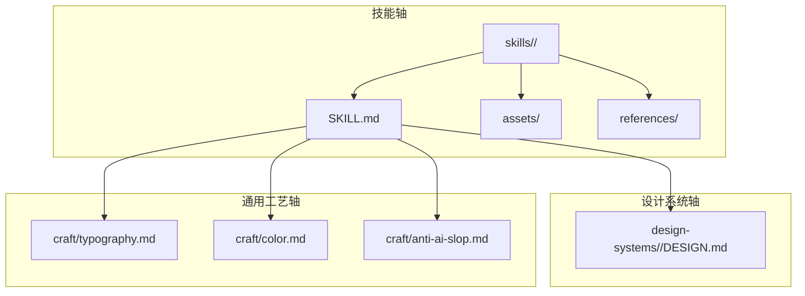
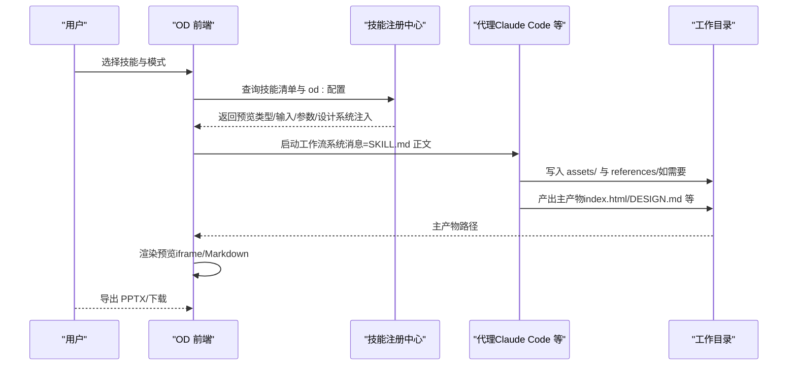
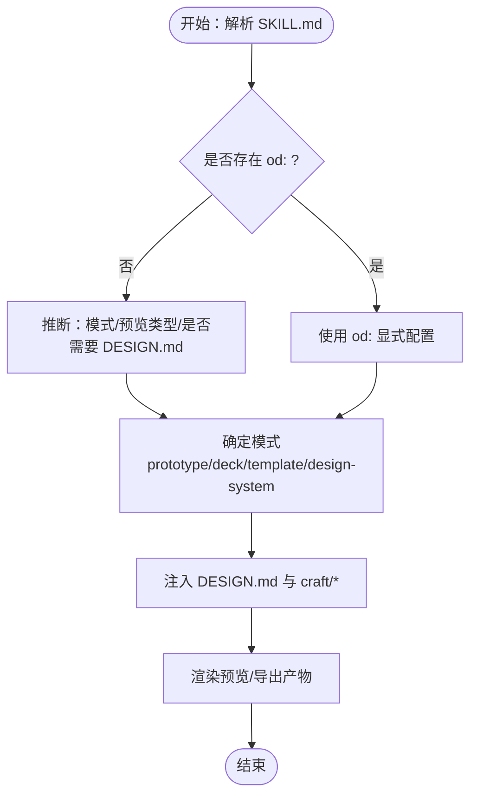
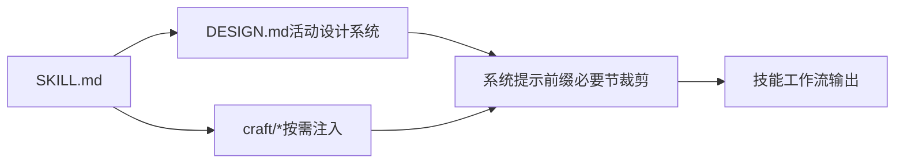
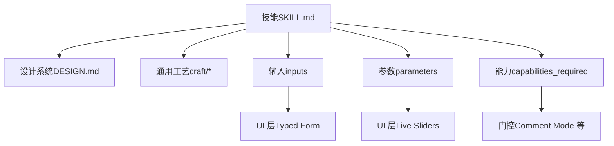

# 技能开发

<cite>
**本文引用的文件**
- [skills-protocol.md](file://docs/skills-protocol.md)
- [examples/SAAS-landing-skill/SKILL.md](file://docs/examples/SAAS-landing-skill/SKILL.md)
- [references.md](file://docs/references.md)
- [guizang-ppt/SKILL.md](file://skills/guizang-ppt/SKILL.md)
- [html-ppt/SKILL.md](file://skills/html-ppt/SKILL.md)
- [dating-web/SKILL.md](file://skills/dating-web/SKILL.md)
- [mobile-onboarding/SKILL.md](file://skills/mobile-onboarding/SKILL.md)
- [pm-spec/SKILL.md](file://skills/pm-spec/SKILL.md)
- [simple-deck/SKILL.md](file://skills/simple-deck/SKILL.md)
- [README.md](file://design-systems/README.md)
- [application/DESIGN.md](file://design-systems/application/DESIGN.md)
- [figma/DESIGN.md](file://design-systems/figma/DESIGN.md)
- [craft/README.md](file://craft/README.md)
- [craft/color.md](file://craft/color.md)
- [craft/typography.md](file://craft/typography.md)
- [CONTRIBUTING.md](file://CONTRIBUTING.md)
</cite>

## 目录
1. [简介](#简介)
2. [项目结构](#项目结构)
3. [核心组件](#核心组件)
4. [架构总览](#架构总览)
5. [详细组件分析](#详细组件分析)
6. [依赖关系分析](#依赖关系分析)
7. [性能考量](#性能考量)
8. [故障排查指南](#故障排查指南)
9. [结论](#结论)
10. [附录](#附录)

## 简介
本指南面向希望在开放设计（Open Design，简称 OD）平台上创建“技能”（Skill）的开发者。技能是 OD 中“设计能力”的最小单元，采用 Claude Code 的 SKILL.md 约定作为基础，并扩展了 OD 专属的 UI/交互与上下文注入能力。通过本指南，您将学会：
- 如何组织技能目录结构（SKILL.md、assets/、references/）
- 如何编写符合 OD 协议的 SKILL.md 前言与工作流
- 如何利用设计系统（DESIGN.md）与通用工艺知识（craft/）提升输出质量
- 如何进行测试与验证、生命周期管理与版本控制
- 如何参与社区贡献与发布

## 项目结构
OD 的技能生态围绕三大轴心展开：
- 技能轴（skills/）：定义“产物形态”（原型、演示文稿、模板、设计系统）
- 设计系统轴（design-systems/）：定义品牌“视觉语言”
- 通用工艺轴（craft/）：定义“跨品牌通用设计工艺规则”

图表来源
- [skills-protocol.md:11-24](file://docs/skills-protocol.md#L11-L24)
- [craft/README.md:8-19](file://craft/README.md#L8-L19)
- [README.md:1-98](file://design-systems/README.md#L1-L98)

章节来源
- [skills-protocol.md:11-24](file://docs/skills-protocol.md#L11-L24)
- [craft/README.md:8-19](file://craft/README.md#L8-L19)
- [README.md:1-98](file://design-systems/README.md#L1-L98)

## 核心组件
- SKILL.md：技能的“清单 + 工作流说明”。前言 YAML 包含 name/description/triggers；正文为自由 Markdown，描述代理应遵循的工作流。
- assets/：技能产出所需的模板、图像、脚手架等资源。
- references/：技能在规划阶段阅读的知识库（如布局、组件、检查清单等）。

OD 在 SKILL.md 基础上扩展了 od: 前言块，以启用：
- 模式（mode）：prototype/deck/template/design-system
- 预览（preview）：html/jsx/pptx/markdown
- 设计系统注入（design_system）：是否读取 ACTIVE DESIGN.md，以及按节裁剪
- 通用工艺注入（craft.requires）：按需注入跨品牌通用规则
- 输入与参数（inputs/parameters）：UI 层的类型化输入与实时微调滑条
- 输出（outputs.primary/secondary）：主产物与导出辅助文件
- 能力要求（capabilities_required）：对代理能力的门控

章节来源
- [skills-protocol.md:26-113](file://docs/skills-protocol.md#L26-L113)
- [skills-protocol.md:152-188](file://docs/skills-protocol.md#L152-L188)
- [skills-protocol.md:189-244](file://docs/skills-protocol.md#L189-L244)

## 架构总览
OD 的技能执行链路如下：
- 用户在 UI 中选择技能与模式
- OD 解析 SKILL.md（含 od: 扩展），决定预览类型、输入参数、设计系统与通用工艺注入
- 代理在工作目录中执行工作流，读取 DESIGN.md 与 craft/*，产出 artifacts
- OD 渲染预览（iframe/Markdown/PPTX 导出管线）

图表来源
- [skills-protocol.md:125-136](file://docs/skills-protocol.md#L125-L136)
- [skills-protocol.md:245-262](file://docs/skills-protocol.md#L245-L262)
- [skills-protocol.md:337-350](file://docs/skills-protocol.md#L337-L350)

章节来源
- [skills-protocol.md:125-136](file://docs/skills-protocol.md#L125-L136)
- [skills-protocol.md:245-262](file://docs/skills-protocol.md#L245-L262)
- [skills-protocol.md:337-350](file://docs/skills-protocol.md#L337-L350)

## 详细组件分析

### 组件 A：SKILL.md 结构与协议
- 基本格式（来自 Claude Code）：name/description/triggers 三要素；正文为工作流说明
- OD 扩展（od:）：mode/preview/design_system/craft/inputs/parameters/outputs/capabilities_required
- 默认行为：若省略 od:，OD 将尽力推断（模式嗅探、预览类型嗅探、是否需要 DESIGN.md 等）

图表来源
- [skills-protocol.md:114-124](file://docs/skills-protocol.md#L114-L124)
- [skills-protocol.md:191-196](file://docs/skills-protocol.md#L191-L196)
- [skills-protocol.md:237-244](file://docs/skills-protocol.md#L237-L244)

章节来源
- [skills-protocol.md:11-44](file://docs/skills-protocol.md#L11-L44)
- [skills-protocol.md:45-124](file://docs/skills-protocol.md#L45-L124)

### 组件 B：设计系统（DESIGN.md）与通用工艺（craft/）
- 设计系统：9 节固定结构（视觉氛围、色彩、字体、组件、布局、层次、反模式、响应式、代理提示），作为上下文注入
- 通用工艺：typography/color/anti-ai-slop 等跨品牌规则，按需注入，减少重复与漂移

图表来源
- [skills-protocol.md:189-214](file://docs/skills-protocol.md#L189-L214)
- [craft/README.md:20-34](file://craft/README.md#L20-L34)

章节来源
- [skills-protocol.md:189-214](file://docs/skills-protocol.md#L189-L214)
- [craft/README.md:20-34](file://craft/README.md#L20-L34)

### 组件 C：技能类型与模式
- Prototype（原型）：单屏交互原型，预览 html/jsx
- Deck（演示文稿）：多页幻灯片，预览 html，主产物 index.html，次产物 slides.json（导出 PPTX）
- Template（模板）：从现有模板起始，代理仅个性化内容
- Design-system（设计系统）：从输入产出 DESIGN.md，预览 markdown

章节来源
- [skills-protocol.md:152-188](file://docs/skills-protocol.md#L152-L188)

### 组件 D：输入、参数与能力门控
- inputs：类型化 UI 输入（string/integer/boolean/enum），支持 required/default/min/max
- parameters：运行期滑条（hue/spacing/font-scale/opacity），热重绘
- capabilities_required：对代理能力的门控（如 surgical_edit/comment_mode）

章节来源
- [skills-protocol.md:68-96](file://docs/skills-protocol.md#L68-L96)
- [skills-protocol.md:100-113](file://docs/skills-protocol.md#L100-L113)

### 组件 E：安装与发现
- 三种扫描位置（优先级递增）：项目私有、项目提交、用户全局
- 支持符号链接策略，统一管理技能目录

章节来源
- [skills-protocol.md:125-151](file://docs/skills-protocol.md#L125-L151)

### 组件 F：测试与回归
- tests/ 目录下的测试用例：basic.prompt、basic.expected.manifest.json、basic.expected.regex.txt
- 使用轻量模型运行并断言产物清单与正则匹配

章节来源
- [skills-protocol.md:337-350](file://docs/skills-protocol.md#L337-L350)

## 依赖关系分析
- 技能对设计系统的依赖：通过 DESIGN.md 注入上下文，支持节裁以节省 token
- 技能对通用工艺的依赖：按需注入 craft/*，避免重复规则
- 技能对输入/参数的依赖：驱动 UI 层的 typed inputs 与 live sliders
- 技能对代理能力的依赖：capabilities_required 门控评论模式等功能

图表来源
- [skills-protocol.md:191-244](file://docs/skills-protocol.md#L191-L244)
- [craft/README.md:20-34](file://craft/README.md#L20-L34)

章节来源
- [skills-protocol.md:191-244](file://docs/skills-protocol.md#L191-L244)
- [craft/README.md:20-34](file://craft/README.md#L20-L34)

## 性能考量
- 预览刷新策略：reload debounce（如 debounce-100）降低频繁刷新带来的抖动
- 设计系统节裁：仅注入必要节，减少 token 消耗
- 通用工艺按需注入：仅请求的 craft/* 被注入，避免冗余内容
- 导出回退：若缺少 slides.json，OD 会回退到“打印 PDF 再转 PPTX”，虽可用但体验欠佳，建议在技能中提供 secondary 输出

章节来源
- [skills-protocol.md:59-62](file://docs/skills-protocol.md#L59-L62)
- [skills-protocol.md:105-106](file://docs/skills-protocol.md#L105-L106)
- [skills-protocol.md:279-283](file://docs/skills-protocol.md#L279-L283)

## 故障排查指南
- 预览不刷新或闪烁：检查 reload/debounce 设置
- 设计系统未生效：确认 SKILL.md 中是否声明 design_system.requires 与 sections
- 通用工艺缺失：确认 craft.requires 是否正确列出所需 slug
- 导出 PPTX 失败：确认技能是否声明 outputs.secondary（如 slides.json）
- 输入/参数无效：检查 inputs/parameters 的类型与范围是否与 UI 一致
- 代理能力不足：确认 capabilities_required 是否满足当前模式（如评论模式）

章节来源
- [skills-protocol.md:57-96](file://docs/skills-protocol.md#L57-L96)
- [skills-protocol.md:100-113](file://docs/skills-protocol.md#L100-L113)
- [skills-protocol.md:279-283](file://docs/skills-protocol.md#L279-L283)

## 结论
OD 的技能体系以 SKILL.md 为核心，结合设计系统与通用工艺，实现了“可组合、可测试、可导出”的设计能力闭环。通过合理的文件组织、清晰的工作流与严格的测试回归，开发者可以快速构建高质量的技能，并融入 OD 生态。

## 附录

### 附录 A：技能开发示例（从零到一）
以下为一个完整示例的步骤拆解（以“SaaS 登录页原型”为例）：
- 创建目录：skills/<your-skill>/
- 编写 SKILL.md：填写 name/description/triggers；添加 od:（mode/preview/design_system/inputs/parameters/outputs/capabilities_required）
- 准备 assets/：提供基础模板（如 base.html）
- 准备 references/：可选，如组件/布局/检查清单
- 编写工作流：在 SKILL.md 正文中描述“澄清 → 读取 DESIGN.md → 复制模板 → 填充内容 → 自检 → 写出 index.html”的步骤
- 示例参考：
  - [examples/SAAS-landing-skill/SKILL.md](file://docs/examples/SAAS-landing-skill/SKILL.md)
  - [simple-deck/SKILL.md](file://skills/simple-deck/SKILL.md)
  - [guizang-ppt/SKILL.md](file://skills/guizang-ppt/SKILL.md)

章节来源
- [examples/SAAS-landing-skill/SKILL.md:1-121](file://docs/examples/SAAS-landing-skill/SKILL.md#L1-L121)
- [simple-deck/SKILL.md:1-121](file://skills/simple-deck/SKILL.md#L1-L121)
- [guizang-ppt/SKILL.md:1-315](file://skills/guizang-ppt/SKILL.md#L1-L315)

### 附录 B：技能分类体系与能力要求
- 分类维度：mode（原型/演示文稿/模板/设计系统）、scenario（营销/工程/产品/设计/个人）、platform（桌面/移动）
- 能力要求：capabilities_required 用于门控评论模式等高级功能
- 示例参考：
  - [mobile-onboarding/SKILL.md](file://skills/mobile-onboarding/SKILL.md)
  - [pm-spec/SKILL.md](file://skills/pm-spec/SKILL.md)
  - [dating-web/SKILL.md](file://skills/dating-web/SKILL.md)

章节来源
- [mobile-onboarding/SKILL.md:1-53](file://skills/mobile-onboarding/SKILL.md#L1-L53)
- [pm-spec/SKILL.md:1-53](file://skills/pm-spec/SKILL.md#L1-L53)
- [dating-web/SKILL.md:1-94](file://skills/dating-web/SKILL.md#L1-L94)

### 附录 C：与设计系统的集成
- 设计系统目录：design-systems/<brand>/DESIGN.md
- 设计系统类别：README 中列出的分组（如“Developer Tools”、“AI & LLM”等）
- 示例参考：
  - [README.md](file://design-systems/README.md)
  - [application/DESIGN.md](file://design-systems/application/DESIGN.md)
  - [figma/DESIGN.md](file://design-systems/figma/DESIGN.md)

章节来源
- [README.md:1-98](file://design-systems/README.md#L1-L98)
- [application/DESIGN.md:1-72](file://design-systems/application/DESIGN.md#L1-L72)
- [figma/DESIGN.md:1-224](file://design-systems/figma/DESIGN.md#L1-L224)

### 附录 D：通用工艺（craft/）使用
- craft/ 提供跨品牌通用规则（排版、色彩、反 AI 槽）
- 技能通过 craft.requires 按需注入
- 示例参考：
  - [craft/README.md](file://craft/README.md)
  - [craft/typography.md](file://craft/typography.md)
  - [craft/color.md](file://craft/color.md)

章节来源
- [craft/README.md:1-63](file://craft/README.md#L1-L63)
- [craft/typography.md:1-89](file://craft/typography.md#L1-L89)
- [craft/color.md:1-89](file://craft/color.md#L1-L89)

### 附录 E：生命周期管理与版本控制
- 安装：od skill add <url|path>；支持本地 symlink 与远程仓库克隆
- 列表与移除：od skill list / od skill remove
- 测试：od skill test <name>，使用 tests/ 目录中的用例
- 版本控制：技能为纯文件，天然纳入 Git；建议以分支/标签管理版本

章节来源
- [skills-protocol.md:245-262](file://docs/skills-protocol.md#L245-L262)
- [skills-protocol.md:337-350](file://docs/skills-protocol.md#L337-L350)
- [CONTRIBUTING.md:45-118](file://CONTRIBUTING.md#L45-L118)

### 附录 F：社区贡献流程
- 新增技能：在 skills/ 下新建目录，包含 SKILL.md 与可选 assets/references/example.html
- 新增设计系统：在 design-systems/<slug>/ 下新增 DESIGN.md
- 新增代理适配：在 apps/daemon/src/agents.ts 中注册
- 贡献门槛：示例 HTML、反 AI 槽检查、截图、单一自包含目录等
- 本地开发：QUICKSTART.md 提供一键启动方案

章节来源
- [CONTRIBUTING.md:11-22](file://CONTRIBUTING.md#L11-L22)
- [CONTRIBUTING.md:45-118](file://CONTRIBUTING.md#L45-L118)
- [CONTRIBUTING.md:120-168](file://CONTRIBUTING.md#L120-L168)
- [CONTRIBUTING.md:171-193](file://CONTRIBUTING.md#L171-L193)
- [references.md:20-38](file://docs/references.md#L20-L38)