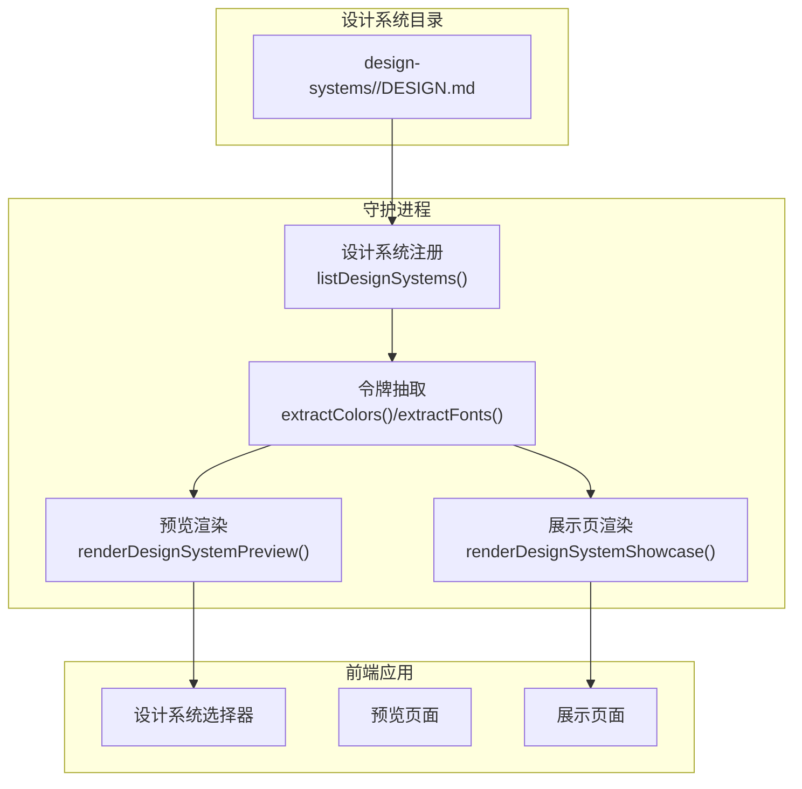
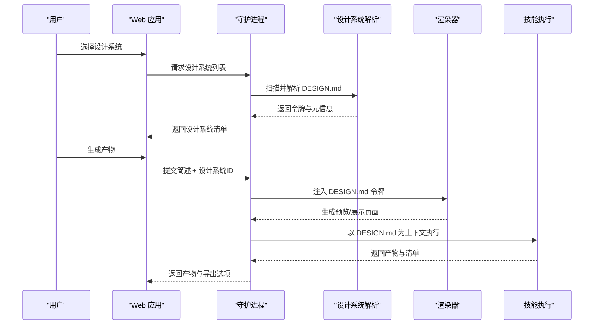
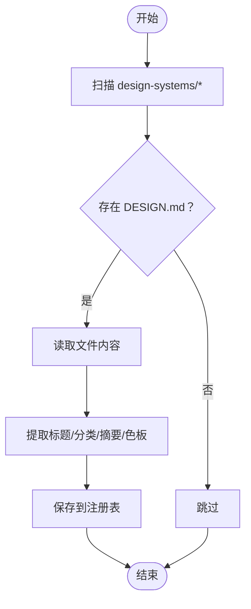
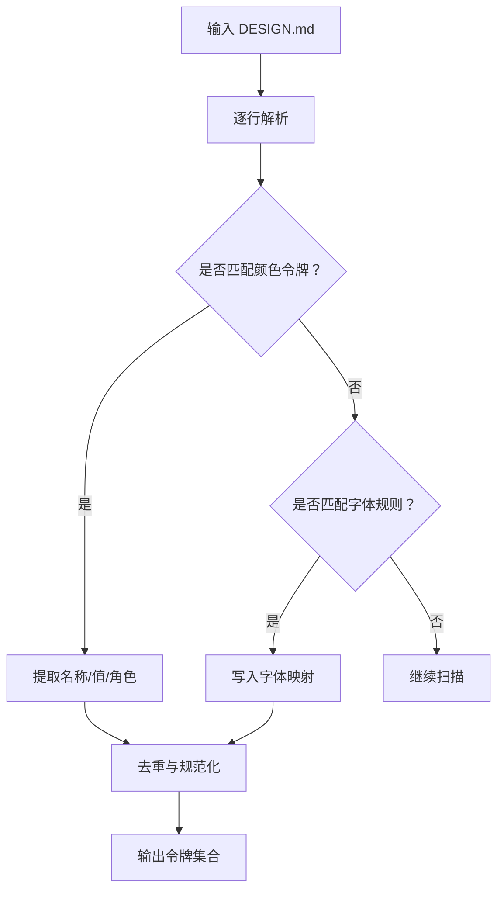
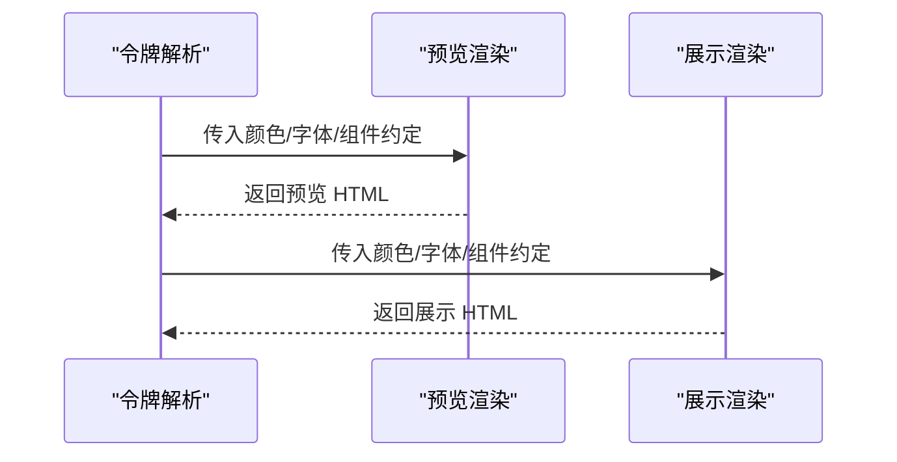
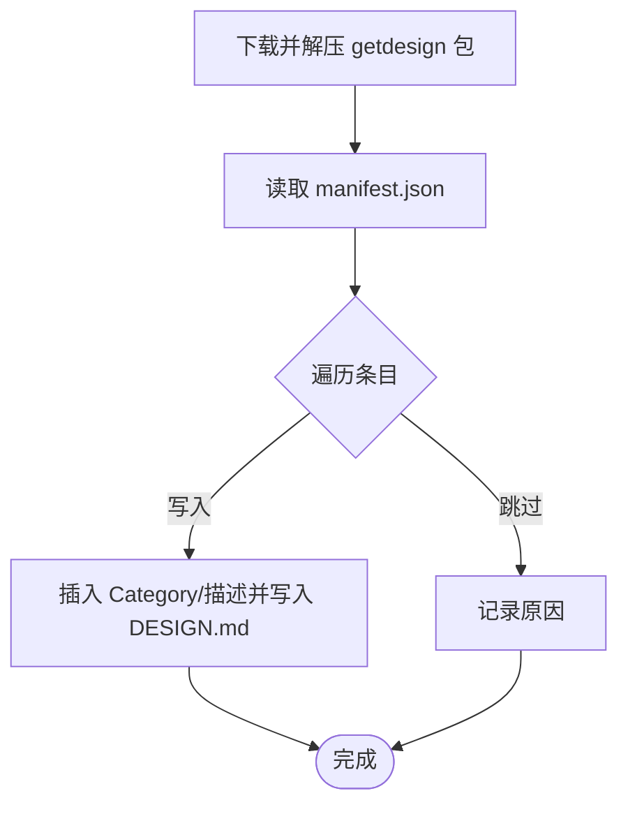
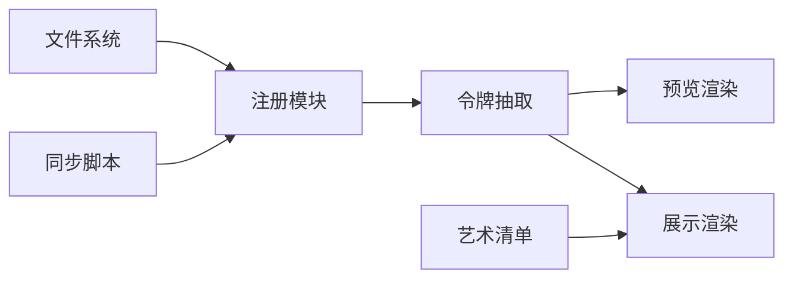

# 设计系统开发

<cite>
**本文引用的文件**
- [design-systems/README.md](file://design-systems/README.md)
- [docs/examples/DESIGN.sample.md](file://docs/examples/DESIGN.sample.md)
- [apps/daemon/src/design-systems.ts](file://apps/daemon/src/design-systems.ts)
- [apps/daemon/src/design-system-showcase.ts](file://apps/daemon/src/design-system-showcase.ts)
- [apps/daemon/src/design-system-preview.ts](file://apps/daemon/src/design-system-preview.ts)
- [apps/daemon/tests/design-system-showcase.test.ts](file://apps/daemon/tests/design-system-showcase.test.ts)
- [scripts/sync-design-systems.ts](file://scripts/sync-design-systems.ts)
- [design-systems/default/DESIGN.md](file://design-systems/default/DESIGN.md)
- [design-systems/warm-editorial/DESIGN.md](file://design-systems/warm-editorial/DESIGN.md)
- [design-systems/figma/DESIGN.md](file://design-systems/figma/DESIGN.md)
- [docs/spec.md](file://docs/spec.md)
- [apps/daemon/src/artifact-manifest.ts](file://apps/daemon/src/artifact-manifest.ts)
- [apps/web/app/layout.tsx](file://apps/web/app/layout.tsx)
- [CONTRIBUTING.md](file://CONTRIBUTING.md)
</cite>

## 目录
1. [简介](#简介)
2. [项目结构](#项目结构)
3. [核心组件](#核心组件)
4. [架构总览](#架构总览)
5. [详细组件分析](#详细组件分析)
6. [依赖关系分析](#依赖关系分析)
7. [性能考量](#性能考量)
8. [故障排查指南](#故障排查指南)
9. [结论](#结论)
10. [附录](#附录)

## 简介
本指南面向希望在 Open Design 平台上创建与集成“品牌级设计系统”的开发者与设计系统维护者。内容涵盖：
- DESIGN.md 的九章节结构与撰写规范
- 设计令牌（Design Tokens）的定义、抽取与使用
- 设计系统注册与解析机制
- 测试验证与文档编写方法
- 在项目中的实际应用与最佳实践

## 项目结构
Open Design 将“设计系统”抽象为单一文件 DESIGN.md，并通过本地守护进程扫描、解析与渲染，供所有技能（skills）在生成产物时作为上下文注入。

图示来源
- [apps/daemon/src/design-systems.ts:10-50](file://apps/daemon/src/design-systems.ts#L10-L50)
- [apps/daemon/src/design-system-preview.ts:14-298](file://apps/daemon/src/design-system-preview.ts#L14-L298)
- [apps/daemon/src/design-system-showcase.ts:13-547](file://apps/daemon/src/design-system-showcase.ts#L13-L547)

章节来源
- [design-systems/README.md:1-98](file://design-systems/README.md#L1-L98)
- [apps/daemon/src/design-systems.ts:10-50](file://apps/daemon/src/design-systems.ts#L10-L50)

## 核心组件
- 设计系统注册与索引：扫描 design-systems/* 目录，读取每个 DESIGN.md，提取标题、分类、摘要、色板与表面类型等元信息。
- 设计系统解析与令牌抽取：从 DESIGN.md 中抽取颜色令牌、字体规则与布局原则，用于预览与展示渲染。
- 预览与展示渲染：将 DESIGN.md 渲染为可浏览的预览页与产品化展示页，便于在生成前确认风格一致性。
- 同步脚本：从上游包批量导入品牌设计系统，自动插入 Category 元数据。
- 艺术品清单：在生成产物中记录所用设计系统 ID，便于追溯与版本管理。

章节来源
- [apps/daemon/src/design-systems.ts:10-168](file://apps/daemon/src/design-systems.ts#L10-L168)
- [apps/daemon/src/design-system-preview.ts:14-298](file://apps/daemon/src/design-system-preview.ts#L14-L298)
- [apps/daemon/src/design-system-showcase.ts:13-547](file://apps/daemon/src/design-system-showcase.ts#L13-L547)
- [scripts/sync-design-systems.ts:1-155](file://scripts/sync-design-systems.ts#L1-L155)
- [apps/daemon/src/artifact-manifest.ts:13-38](file://apps/daemon/src/artifact-manifest.ts#L13-L38)

## 架构总览
下图展示了从用户选择设计系统到生成产物的关键流程，以及 DESIGN.md 如何贯穿预览、渲染与导出阶段。

图示来源
- [apps/daemon/src/design-systems.ts:10-50](file://apps/daemon/src/design-systems.ts#L10-L50)
- [apps/daemon/src/design-system-preview.ts:14-298](file://apps/daemon/src/design-system-preview.ts#L14-L298)
- [apps/daemon/src/design-system-showcase.ts:13-547](file://apps/daemon/src/design-system-showcase.ts#L13-L547)
- [apps/daemon/src/artifact-manifest.ts:13-38](file://apps/daemon/src/artifact-manifest.ts#L13-L38)

## 详细组件分析

### 设计系统注册与解析
- 注册机制：遍历 design-systems/*，检查是否存在 DESIGN.md；读取文件后提取标题、分类、摘要、色板与表面类型。
- 标题清洗：移除“Design System Inspired by/for”前缀，保留干净的显示名。
- 摘要与分类：从首段文本中剥离 Category 行，生成预览摘要；Category 决定下拉分组。
- 色板提取：按启发式匹配颜色令牌名称与值，返回代表性的四色条带，用于选择器预览。

图示来源
- [apps/daemon/src/design-systems.ts:10-50](file://apps/daemon/src/design-systems.ts#L10-L50)
- [apps/daemon/src/design-systems.ts:52-87](file://apps/daemon/src/design-systems.ts#L52-L87)
- [apps/daemon/src/design-systems.ts:102-157](file://apps/daemon/src/design-systems.ts#L102-L157)

章节来源
- [apps/daemon/src/design-systems.ts:10-168](file://apps/daemon/src/design-systems.ts#L10-L168)

### 设计令牌抽取与使用
- 颜色令牌：支持多种书写形式（粗体+冒号、列表项、括号内十六进制），并能处理多色组合（取首个）与角色描述（role）。
- 字体规则：从 DESIGN.md 中抽取 Display/Heading、Body/Text、Mono/Code 的字体栈与排版参数。
- 可读性与对比度：根据背景色自动推断前景色，保证对比度满足可访问性要求。
- 表面类型：支持 web/image/video/audio 等输出表面，影响渲染策略。

图示来源
- [apps/daemon/src/design-system-showcase.ts:657-727](file://apps/daemon/src/design-system-showcase.ts#L657-L727)
- [apps/daemon/src/design-system-preview.ts:314-357](file://apps/daemon/src/design-system-preview.ts#L314-L357)
- [apps/daemon/src/design-system-showcase.ts:761-783](file://apps/daemon/src/design-system-showcase.ts#L761-L783)

章节来源
- [apps/daemon/src/design-system-showcase.ts:657-743](file://apps/daemon/src/design-system-showcase.ts#L657-L743)
- [apps/daemon/src/design-system-preview.ts:314-357](file://apps/daemon/src/design-system-preview.ts#L314-L357)

### 预览与展示渲染
- 预览页：固定模板，抽取色板、字体与组件约定，渲染卡片、按钮与排版示例，下方直接渲染 DESIGN.md 原文。
- 展示页：更完整的产品化页面，包含导航、英雄区、特性网格、仪表盘预览、定价、客户评价、FAQ 与页脚，完全由 DESIGN.md 令牌驱动。

图示来源
- [apps/daemon/src/design-system-preview.ts:14-298](file://apps/daemon/src/design-system-preview.ts#L14-L298)
- [apps/daemon/src/design-system-showcase.ts:13-547](file://apps/daemon/src/design-system-showcase.ts#L13-L547)

章节来源
- [apps/daemon/src/design-system-preview.ts:14-298](file://apps/daemon/src/design-system-preview.ts#L14-L298)
- [apps/daemon/src/design-system-showcase.ts:13-547](file://apps/daemon/src/design-system-showcase.ts#L13-L547)

### 同步与导入机制
- 上游同步：从 npm 包 getdesign 导入品牌设计系统，自动为每个系统插入 Category 与描述元数据。
- 分类映射：根据品牌名映射到指定类别，确保选择器分组一致。
- 安全写入：对目标路径进行创建与写入，失败项单独记录。

图示来源
- [scripts/sync-design-systems.ts:79-155](file://scripts/sync-design-systems.ts#L79-L155)

章节来源
- [scripts/sync-design-systems.ts:1-155](file://scripts/sync-design-systems.ts#L1-L155)

### 设计系统九章节结构详解
DESIGN.md 采用 9 章节标准化结构，确保系统化设计语言的一致性与可复用性：

1) 设计理念与氛围（Visual Theme & Atmosphere）
- 描述整体气质与调性，指导排版、留白与组件风格取舍。
- 示例参考：[design-systems/default/DESIGN.md:7-8](file://design-systems/default/DESIGN.md#L7-L8)、[design-systems/warm-editorial/DESIGN.md:7-8](file://design-systems/warm-editorial/DESIGN.md#L7-L8)、[design-systems/figma/DESIGN.md:6-22](file://design-systems/figma/DESIGN.md#L6-L22)

2) 色彩系统与角色（Color Palette & Roles）
- 明确定义背景、前景、强调色、中性、边框、表面等角色与对应色值。
- 支持多形态书写，如“名称: `#hex`”、“**名称** (`#hex`)”、“**名称** `#hex`: 角色描述”。
- 示例参考：[design-systems/default/DESIGN.md:10-18](file://design-systems/default/DESIGN.md#L10-L18)、[design-systems/warm-editorial/DESIGN.md:10-17](file://design-systems/warm-editorial/DESIGN.md#L10-L17)、[design-systems/figma/DESIGN.md:24-40](file://design-systems/figma/DESIGN.md#L24-L40)

3) 字体系统（Typography Rules）
- 定义 Display/Heading、Body/Text、Mono/Code 的字体栈与字号、行高、字距等。
- 示例参考：[design-systems/default/DESIGN.md:20-26](file://design-systems/default/DESIGN.md#L20-L26)、[design-systems/warm-editorial/DESIGN.md:19-25](file://design-systems/warm-editorial/DESIGN.md#L19-L25)、[design-systems/figma/DESIGN.md:41-67](file://design-systems/figma/DESIGN.md#L41-L67)

4) 组件样式（Component Stylings）
- 规定按钮、卡片、输入、链接等常见组件的视觉与交互规范。
- 示例参考：[design-systems/default/DESIGN.md:28-32](file://design-systems/default/DESIGN.md#L28-L32)、[design-systems/warm-editorial/DESIGN.md:27-31](file://design-systems/warm-editorial/DESIGN.md#L27-L31)

5) 布局原则（Layout Principles）
- 网格、容器、间距与分节策略，指导页面结构与节奏。
- 示例参考：[design-systems/default/DESIGN.md:34-38](file://design-systems/default/DESIGN.md#L34-L38)、[design-systems/warm-editorial/DESIGN.md:33-37](file://design-systems/warm-editorial/DESIGN.md#L33-L37)

6) 深度与层级（Depth & Elevation）
- 定义平面、抬起等层级与阴影/光晕等表现。
- 示例参考：[design-systems/default/DESIGN.md:40-44](file://design-systems/default/DESIGN.md#L40-L44)、[design-systems/warm-editorial/DESIGN.md:39-43](file://design-systems/warm-editorial/DESIGN.md#L39-L43)

7) 响应式设计（Responsive Behavior）
- 面向桌面、平板、手机的网格与断点策略。
- 示例参考：[design-systems/default/DESIGN.md:54-57](file://design-systems/default/DESIGN.md#L54-L57)、[design-systems/warm-editorial/DESIGN.md:54-57](file://design-systems/warm-editorial/DESIGN.md#L54-L57)、[design-systems/figma/DESIGN.md:187-204](file://design-systems/figma/DESIGN.md#L187-L204)

8) 无障碍设计（Accessibility & Voice）
- 对比度、焦点指示、键盘可达性与文案语调建议。
- 示例参考：[apps/daemon/src/design-system-showcase.ts:56-83](file://apps/daemon/src/design-system-showcase.ts#L56-L83)、[apps/daemon/src/design-system-preview.ts:180-202](file://apps/daemon/src/design-system-preview.ts#L180-L202)

9) 品牌应用与反模式（Agent Prompt Guide / Anti-patterns）
- 生成时的提示词指南与禁用清单，确保一致性与可维护性。
- 示例参考：[design-systems/default/DESIGN.md:46-62](file://design-systems/default/DESIGN.md#L46-L62)、[design-systems/warm-editorial/DESIGN.md:44-65](file://design-systems/warm-editorial/DESIGN.md#L44-L65)、[design-systems/figma/DESIGN.md:168-186](file://design-systems/figma/DESIGN.md#L168-L186)

章节来源
- [design-systems/default/DESIGN.md:7-62](file://design-systems/default/DESIGN.md#L7-L62)
- [design-systems/warm-editorial/DESIGN.md:7-65](file://design-systems/warm-editorial/DESIGN.md#L7-L65)
- [design-systems/figma/DESIGN.md:6-224](file://design-systems/figma/DESIGN.md#L6-L224)

### 设计系统开发示例（从零到一）
以下为创建一套品牌级设计系统的完整步骤与要点，结合仓库现有示例与规范：

- 步骤一：准备目录与文件
  - 在 design-systems/<你的品牌> 下创建 DESIGN.md，遵循九章节结构。
  - 参考示例文件：[docs/examples/DESIGN.sample.md:1-65](file://docs/examples/DESIGN.sample.md#L1-L65)、[design-systems/default/DESIGN.md:1-63](file://design-systems/default/DESIGN.md#L1-L63)

- 步骤二：定义设计令牌
  - 色彩系统：至少包含背景、前景、强调色、中性、边框、表面等角色。
  - 字体系统：明确 Display/Heading、Body/Text、Mono/Code 的字体栈与排版参数。
  - 组件样式：给出按钮、卡片、输入、链接等的尺寸、半径、内边距与交互状态。
  - 布局与响应式：网格列数、最大宽度、断点与移动端折叠策略。
  - 参考实现：[apps/daemon/src/design-system-preview.ts:314-357](file://apps/daemon/src/design-system-preview.ts#L314-L357)、[apps/daemon/src/design-system-showcase.ts:657-727](file://apps/daemon/src/design-system-showcase.ts#L657-L727)

- 步骤三：预览与验证
  - 使用预览渲染器快速核对色板、排版与组件示例。
  - 参考实现：[apps/daemon/src/design-system-preview.ts:14-298](file://apps/daemon/src/design-system-preview.ts#L14-L298)

- 步骤四：集成到生成流程
  - 在技能或生成请求中引用该设计系统 ID，守护进程将其注入为上下文。
  - 参考实现：[apps/daemon/src/artifact-manifest.ts:13-38](file://apps/daemon/src/artifact-manifest.ts#L13-L38)

- 步骤五：文档与发布
  - 在 DESIGN.md 中添加 Category 与摘要，便于选择器分组与预览。
  - 参考规范：[design-systems/README.md:46-63](file://design-systems/README.md#L46-L63)

章节来源
- [docs/examples/DESIGN.sample.md:1-65](file://docs/examples/DESIGN.sample.md#L1-L65)
- [apps/daemon/src/design-system-preview.ts:14-298](file://apps/daemon/src/design-system-preview.ts#L14-L298)
- [apps/daemon/src/design-system-showcase.ts:13-547](file://apps/daemon/src/design-system-showcase.ts#L13-L547)
- [apps/daemon/src/artifact-manifest.ts:13-38](file://apps/daemon/src/artifact-manifest.ts#L13-L38)
- [design-systems/README.md:46-63](file://design-systems/README.md#L46-L63)

## 依赖关系分析
- 设计系统注册依赖文件系统扫描与正则解析，耦合度低，扩展性强。
- 预览与展示渲染依赖令牌抽取结果，二者共享解析逻辑，避免重复计算。
- 同步脚本独立于主流程，仅负责批量导入，不影响运行时稳定性。
- 艺术品清单记录设计系统 ID，便于审计与回溯。

图示来源
- [apps/daemon/src/design-systems.ts:10-50](file://apps/daemon/src/design-systems.ts#L10-L50)
- [apps/daemon/src/design-system-preview.ts:14-298](file://apps/daemon/src/design-system-preview.ts#L14-L298)
- [apps/daemon/src/design-system-showcase.ts:13-547](file://apps/daemon/src/design-system-showcase.ts#L13-L547)
- [scripts/sync-design-systems.ts:1-155](file://scripts/sync-design-systems.ts#L1-L155)
- [apps/daemon/src/artifact-manifest.ts:13-38](file://apps/daemon/src/artifact-manifest.ts#L13-L38)

章节来源
- [apps/daemon/src/design-systems.ts:10-168](file://apps/daemon/src/design-systems.ts#L10-L168)
- [apps/daemon/src/design-system-preview.ts:14-298](file://apps/daemon/src/design-system-preview.ts#L14-L298)
- [apps/daemon/src/design-system-showcase.ts:13-547](file://apps/daemon/src/design-system-showcase.ts#L13-L547)
- [scripts/sync-design-systems.ts:1-155](file://scripts/sync-design-systems.ts#L1-L155)
- [apps/daemon/src/artifact-manifest.ts:13-38](file://apps/daemon/src/artifact-manifest.ts#L13-L38)

## 性能考量
- 解析复杂度：令牌抽取采用线性扫描与有限正则，时间复杂度近似 O(N)，N 为 DESIGN.md 行数。
- 缓存策略：预览与展示渲染结果可缓存至浏览器端，减少重复解析成本。
- I/O 优化：批量导入时一次性写入目标目录，避免频繁小文件操作。
- 渲染体积：预览模板固定，令牌注入后 HTML 结构稳定，有利于压缩与传输。

## 故障排查指南
- 设计系统未出现在选择器
  - 检查 DESIGN.md 是否位于 design-systems/<slug>/DESIGN.md
  - 确认首 H1 后存在 Category 元数据行
  - 参考：[design-systems/README.md:46-63](file://design-systems/README.md#L46-L63)

- 颜色令牌解析异常
  - 确保颜色值为合法十六进制（#RGB/#RGBA/#RRGGBBAABB）
  - 若出现多色组合，解析器会取第一个；必要时调整书写格式
  - 单元测试覆盖了多种书写形状，可对照参考
  - 参考：[apps/daemon/tests/design-system-showcase.test.ts:10-71](file://apps/daemon/tests/design-system-showcase.test.ts#L10-L71)

- 预览/展示渲染空白或样式错乱
  - 检查 DESIGN.md 中字体栈是否包含可用回退字体
  - 确认组件样式与布局章节已提供基础规范
  - 参考：[apps/daemon/src/design-system-preview.ts:314-357](file://apps/daemon/src/design-system-preview.ts#L314-L357)、[apps/daemon/src/design-system-showcase.ts:657-727](file://apps/daemon/src/design-system-showcase.ts#L657-L727)

- 同步导入失败
  - 确认已下载并解压 getdesign 包，且 manifest.json 存在
  - 查看控制台输出的跳过条目，定位具体品牌与原因
  - 参考：[scripts/sync-design-systems.ts:79-155](file://scripts/sync-design-systems.ts#L79-L155)

章节来源
- [design-systems/README.md:46-63](file://design-systems/README.md#L46-L63)
- [apps/daemon/tests/design-system-showcase.test.ts:10-71](file://apps/daemon/tests/design-system-showcase.test.ts#L10-L71)
- [apps/daemon/src/design-system-preview.ts:314-357](file://apps/daemon/src/design-system-preview.ts#L314-L357)
- [apps/daemon/src/design-system-showcase.ts:657-727](file://apps/daemon/src/design-system-showcase.ts#L657-L727)
- [scripts/sync-design-systems.ts:79-155](file://scripts/sync-design-systems.ts#L79-L155)

## 结论
通过将设计系统抽象为单一的 DESIGN.md 文件，并配合守护进程的注册、解析与渲染能力，Open Design 实现了“系统即资产”的设计语言统一与跨技能复用。遵循九章节结构、严谨定义设计令牌、完善测试与文档，即可构建可维护、可演进的品牌级设计系统，并在原型、演示文稿与模板等场景中稳定落地。

## 附录
- 设计系统注册与解析 API
  - 列举设计系统：[apps/daemon/src/design-systems.ts:10-41](file://apps/daemon/src/design-systems.ts#L10-L41)
  - 读取单个设计系统：[apps/daemon/src/design-systems.ts:43-50](file://apps/daemon/src/design-systems.ts#L43-L50)
- 预览与展示渲染 API
  - 预览渲染：[apps/daemon/src/design-system-preview.ts:14-298](file://apps/daemon/src/design-system-preview.ts#L14-L298)
  - 展示渲染：[apps/daemon/src/design-system-showcase.ts:13-547](file://apps/daemon/src/design-system-showcase.ts#L13-L547)
- 设计令牌抽取 API
  - 颜色抽取：[apps/daemon/src/design-system-showcase.ts:657-727](file://apps/daemon/src/design-system-showcase.ts#L657-L727)
  - 字体抽取：[apps/daemon/src/design-system-preview.ts:341-357](file://apps/daemon/src/design-system-preview.ts#L341-L357)
- 同步脚本
  - 批量导入：[scripts/sync-design-systems.ts:1-155](file://scripts/sync-design-systems.ts#L1-L155)
- 艺术品清单
  - 清单校验与清理：[apps/daemon/src/artifact-manifest.ts:72-179](file://apps/daemon/src/artifact-manifest.ts#L72-L179)
- 产品定位与模块职责
  - 产品规格：[docs/spec.md:63-94](file://docs/spec.md#L63-L94)
- 前端主题初始化
  - 主题脚本：[apps/web/app/layout.tsx:27-35](file://apps/web/app/layout.tsx#L27-L35)
- 贡献指南（新增设计系统）
  - 新增设计系统步骤与示例：[CONTRIBUTING.md:120-155](file://CONTRIBUTING.md#L120-L155)