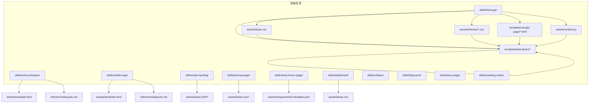
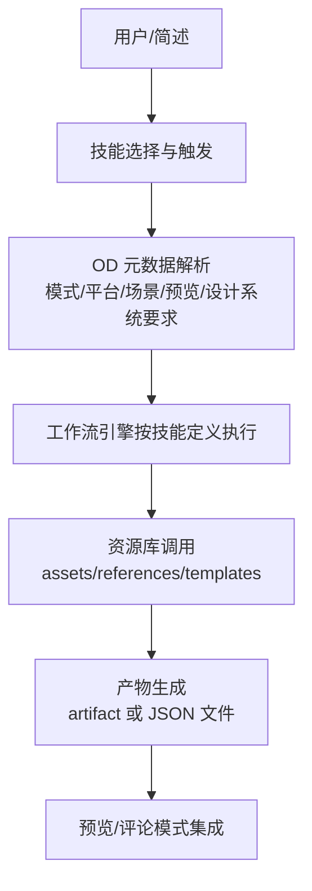
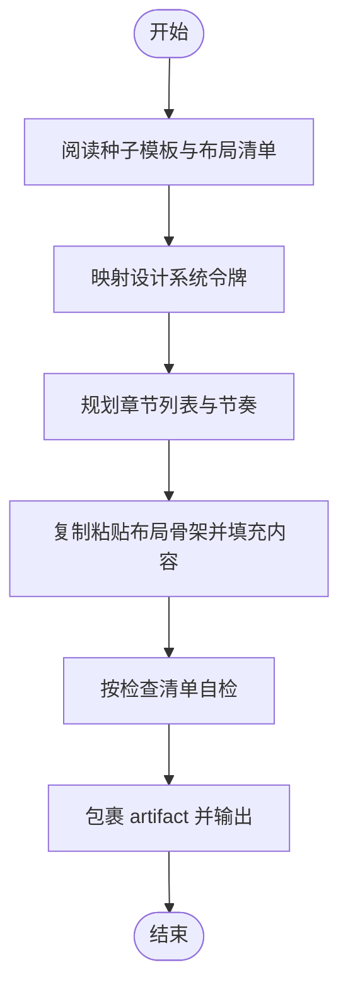
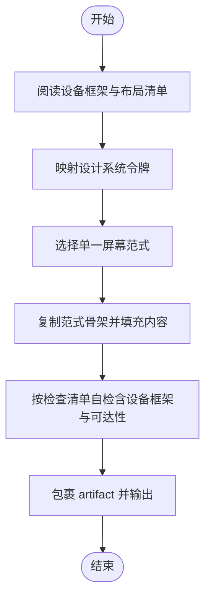
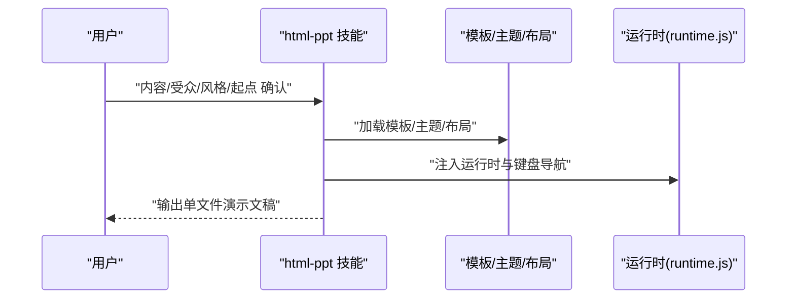
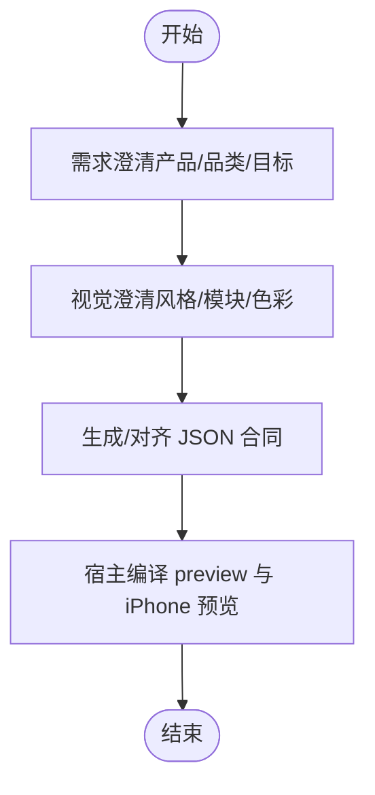
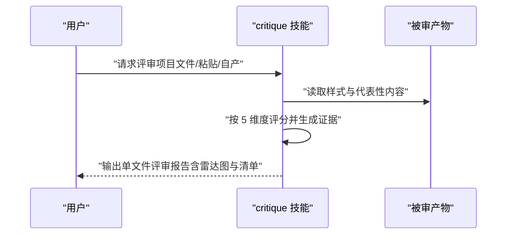
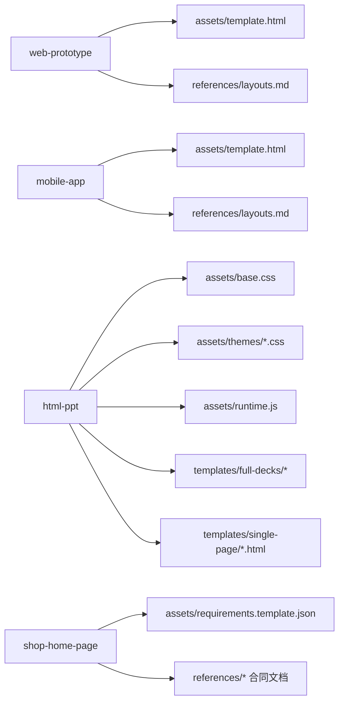

# 内置技能详解

<cite>
**本文引用的文件**
- [web-prototype/SKILL.md](file://skills/web-prototype/SKILL.md)
- [mobile-app/SKILL.md](file://skills/mobile-app/SKILL.md)
- [saas-landing/SKILL.md](file://skills/saas-landing/SKILL.md)
- [pricing-page/SKILL.md](file://skills/pricing-page/SKILL.md)
- [shop-home-page/SKILL.md](file://skills/shop-home-page/SKILL.md)
- [dashboard/SKILL.md](file://skills/dashboard/SKILL.md)
- [critique/SKILL.md](file://skills/critique/SKILL.md)
- [html-ppt/SKILL.md](file://skills/html-ppt/SKILL.md)
- [html-ppt-pitch-deck/SKILL.md](file://skills/html-ppt-pitch-deck/SKILL.md)
- [html-ppt-tech-sharing/SKILL.md](file://skills/html-ppt-tech-sharing/SKILL.md)
- [html-ppt-product-launch/SKILL.md](file://skills/html-ppt-product-launch/SKILL.md)
- [html-ppt-xhs-post/SKILL.md](file://skills/html-ppt-xhs-post/SKILL.md)
- [html-ppt-weekly-report/SKILL.md](file://skills/html-ppt-weekly-report/SKILL.md)
- [blog-post/SKILL.md](file://skills/blog-post/SKILL.md)
- [docs-page/SKILL.md](file://skills/docs-page/SKILL.md)
- [meeting-notes/SKILL.md](file://skills/meeting-notes/SKILL.md)
</cite>

## 目录
1. [简介](#简介)
2. [项目结构](#项目结构)
3. [核心组件](#核心组件)
4. [架构总览](#架构总览)
5. [详细组件分析](#详细组件分析)
6. [依赖关系分析](#依赖关系分析)
7. [性能考量](#性能考量)
8. [故障排查指南](#故障排查指南)
9. [结论](#结论)
10. [附录](#附录)

## 简介
本文件为 Open Design 的 31 个内置技能提供系统化参考，覆盖设计原型类（web-prototype、mobile-app）、演示文稿类（html-ppt 系列）、电商页面类（shop-home-page）、营销页面类（saas-landing、pricing-page）、专业工具类（critique、dashboard）等。每个技能均给出用途定位、触发关键词、输入参数与输出产物规范、工作流程、最佳实践与常见问题排查要点，帮助用户在不同场景下高效选择与使用。

## 项目结构
内置技能以“技能包”形式组织于 skills/ 目录，每个技能包含：
- SKILL.md：技能定义与工作流说明
- assets/：种子模板、样式与运行时资源
- references/：布局、动画、主题、作者指南等参考文档
- templates/：完整演示模板与单页布局模板
- 示例与脚本：渲染、脚手架等辅助工具

图表来源
- [web-prototype/SKILL.md:34-41](file://skills/web-prototype/SKILL.md#L34-L41)
- [mobile-app/SKILL.md:35-43](file://skills/mobile-app/SKILL.md#L35-L43)
- [html-ppt/SKILL.md:193-220](file://skills/html-ppt/SKILL.md#L193-L220)

章节来源
- [web-prototype/SKILL.md:1-98](file://skills/web-prototype/SKILL.md#L1-L98)
- [mobile-app/SKILL.md:1-101](file://skills/mobile-app/SKILL.md#L1-L101)
- [html-ppt/SKILL.md:1-252](file://skills/html-ppt/SKILL.md#L1-L252)

## 核心组件
- 设计原型类
  - web-prototype：通用桌面端单页原型，强调“复制粘贴布局骨架”，默认设计系统要求颜色/字体/版式/组件齐全。
  - mobile-app：移动应用单屏原型，内置于 iPhone 15 Pro 设备框架中，提供 Feed/Detail/Onboarding/Profile/Checkout/Focus 六种屏幕范式。
- 演示文稿类（HTML PPT）
  - html-ppt：统一主题/布局/动画体系，支持键盘导航、演讲者模式、逐字稿、Canvas 效果等，提供 36 主题、15 个完整模板、31 种单页布局、27 种 CSS 动画与 20 种 Canvas FX。
  - html-ppt-pitch-deck：种子轮/风投路演 10 页模板，强调白+蓝紫渐变主视觉、大数字、增长条形图与资金需求页。
  - html-ppt-tech-sharing：技术分享/工程演讲模板，暗色主题、终端字体、代码块、议程与问答页。
  - html-ppt-product-launch：新品发布/Keynote 模板，深色主视觉+浅内容、暖橙→桃色强调色、特性卡、价格档位与 CTA。
  - html-ppt-xhs-post：小红书/Instagram 风 9 页竖版图文（810×1080），暖色 pastel、虚线贴纸卡片、底部页码点。
  - html-ppt-weekly-report：团队周报/状态更新模板，企业清晰风格、8 格 KPI 网格、已发布清单、8 周柱状图与下周计划表。
- 电商页面类
  - shop-home-page：面向商户/店铺首页的“schema-first + 聊天驱动”工作流，输出 requirements、reference-state、style-guide、schema 四件套，并由宿主编译 preview 与 iPhone 屏幕预览。
- 营销页面类
  - saas-landing：单页 SaaS 登陆页，包含 Hero、Features、Social Proof、Pricing、Footer CTA/Footer，支持参数化密度与强调强度。
  - pricing-page：独立定价页，含头部、价格档位、特性对比表与 FAQ，支持 2/3/4 档位与响应式对比表。
- 专业工具类
  - critique：5 维度专家设计评审（哲学一致性/视觉层级/细节执行/功能性/创新性），输出雷达图与可操作的 Keep/Fix/Quick-wins 清单。
  - dashboard：管理/分析仪表盘，固定左栏+顶部栏+主网格 KPI 卡与 1-2 个图表，纯 HTML 输出，支持内联 SVG 图表。

章节来源
- [web-prototype/SKILL.md:27-98](file://skills/web-prototype/SKILL.md#L27-L98)
- [mobile-app/SKILL.md:29-101](file://skills/mobile-app/SKILL.md#L29-L101)
- [html-ppt/SKILL.md:34-252](file://skills/html-ppt/SKILL.md#L34-L252)
- [html-ppt-pitch-deck/SKILL.md:26-80](file://skills/html-ppt-pitch-deck/SKILL.md#L26-L80)
- [html-ppt-tech-sharing/SKILL.md:25-79](file://skills/html-ppt-tech-sharing/SKILL.md#L25-L79)
- [html-ppt-product-launch/SKILL.md:25-79](file://skills/html-ppt-product-launch/SKILL.md#L25-L79)
- [html-ppt-xhs-post/SKILL.md:26-80](file://skills/html-ppt-xhs-post/SKILL.md#L26-L80)
- [html-ppt-weekly-report/SKILL.md:25-79](file://skills/html-ppt-weekly-report/SKILL.md#L25-L79)
- [shop-home-page/SKILL.md:26-104](file://skills/shop-home-page/SKILL.md#L26-L104)
- [saas-landing/SKILL.md:54-125](file://skills/saas-landing/SKILL.md#L54-L125)
- [pricing-page/SKILL.md:27-78](file://skills/pricing-page/SKILL.md#L27-L78)
- [critique/SKILL.md:35-259](file://skills/critique/SKILL.md#L35-L259)
- [dashboard/SKILL.md:27-75](file://skills/dashboard/SKILL.md#L27-L75)

## 架构总览
内置技能遵循统一的“技能定义 + 资源库 + 工作流”的结构化设计：
- 技能定义（SKILL.md）：声明名称、描述、触发词、OD 元数据（模式/平台/场景/预览/设计系统要求）、输入/参数/输出契约、能力要求。
- 资源库（assets/references/templates）：提供种子模板、布局骨架、主题、动画、作者指南等，确保输出一致性与可复用性。
- 工作流（Workflow）：从上下文读取、设计系统映射、规划与填充、自检与产出，严格约束输出格式与质量门禁。

图表来源
- [web-prototype/SKILL.md:15-25](file://skills/web-prototype/SKILL.md#L15-L25)
- [html-ppt/SKILL.md:19-32](file://skills/html-ppt/SKILL.md#L19-L32)
- [shop-home-page/SKILL.md:14-24](file://skills/shop-home-page/SKILL.md#L14-L24)

## 详细组件分析

### 设计原型类

#### web-prototype（桌面端通用原型）
- 适用场景：落地页/营销页/文档页/SaaS 首页等无更具体技能匹配时的默认选择。
- 关键特性：单文件 HTML、基于种子模板与布局库组合；强调设计系统令牌映射与“骨架粘贴”而非从零写样式。
- 输入与参数：无显式输入；通过 DESIGN.md 注入颜色/字体/版式/组件令牌。
- 输出产物：单文件 index.html，包裹在 artifact 标签中。
- 最佳实践：
  - 先通读种子模板与布局清单，再决定章节节奏；
  - 严格控制强调色使用频次（默认不超过两次）；
  - 使用占位图与内联样式，避免外部依赖。
- 常见问题：
  - 忘记替换 :root 变量导致配色不一致；
  - 在未覆盖的布局上强行拼接导致结构错乱。

图表来源
- [web-prototype/SKILL.md:43-79](file://skills/web-prototype/SKILL.md#L43-L79)

章节来源
- [web-prototype/SKILL.md:1-98](file://skills/web-prototype/SKILL.md#L1-L98)

#### mobile-app（移动端应用单屏原型）
- 适用场景：移动端/APP UI 原型，需内置于 iPhone 15 Pro 设备框架。
- 关键特性：六种屏幕范式（Feed/Detail/Onboarding/Profile/Checkout/Focus），强调单任务、单职责；设备框架与交互元素由种子模板提供。
- 输入与参数：无显式输入；通过 DESIGN.md 映射令牌。
- 输出产物：单文件 index.html，artifact 包裹。
- 最佳实践：
  - 严格遵守“一屏一任务”原则；
  - 确保触控目标尺寸≥44px；
  - 使用设备框架提供的状态栏/动态岛/底栏等元素，避免重复绘制。
- 常见问题：
  - 在不展示 TabBar 的范式中仍保留 TabBar 片段；
  - 强行叠加多任务流程导致信息过载。

图表来源
- [mobile-app/SKILL.md:45-92](file://skills/mobile-app/SKILL.md#L45-L92)

章节来源
- [mobile-app/SKILL.md:1-101](file://skills/mobile-app/SKILL.md#L1-L101)

### 演示文稿类（HTML PPT）

#### html-ppt（HTML 演示文稿工作室）
- 适用场景：各类多页演示/讲稿/报告，强调“静态 HTML + 主题/布局/动画 + 键盘导航 + 演讲者模式”。
- 关键特性：36 主题、15 个完整模板、31 种单页布局、27 种 CSS 动画、20 种 Canvas FX；支持键盘导航、演讲者模式弹窗、逐字稿、PNG 导出脚本。
- 输入与参数：无显式输入；通过“内容/受众/风格/起点”四步确认后开始创作。
- 输出产物：单文件 index.html，artifact 包裹。
- 最佳实践：
  - 先确认内容体量与受众，再挑选主题与起点模板；
  - 严格使用令牌而非硬编码颜色；
  - 演讲者文本仅放入 notes，不在幻灯片可见区域出现。
- 常见问题：
  - 未将上游相对路径重写为项目本地路径导致资源 404；
  - 在幻灯片中混入仅面向演讲者的提示文字。

图表来源
- [html-ppt/SKILL.md:91-122](file://skills/html-ppt/SKILL.md#L91-L122)
- [html-ppt/SKILL.md:153-176](file://skills/html-ppt/SKILL.md#L153-L176)

章节来源
- [html-ppt/SKILL.md:1-252](file://skills/html-ppt/SKILL.md#L1-L252)

#### html-ppt-pitch-deck（路演/种子轮模板）
- 适用场景：种子轮/风投融资路演，强调白+蓝紫渐变主视觉、大数字、增长条形图与资金需求页。
- 输入与参数：无显式输入；通过“公司名+一句话简介 + 关键增长指标 + 融资规模与用途”四要素确认。
- 输出产物：单文件 index.html，artifact 包裹。
- 最佳实践：保持视觉统一、数据真实可信、强调“可执行的行动项”。

章节来源
- [html-ppt-pitch-deck/SKILL.md:26-80](file://skills/html-ppt-pitch-deck/SKILL.md#L26-L80)

#### html-ppt-tech-sharing（技术分享模板）
- 适用场景：技术分享/工程演讲/内部技术交流，强调暗色主题、终端字体、代码块、议程与问答。
- 输入与参数：无显式输入；通过“主题/受众/是否包含代码与基准测试”确认。
- 输出产物：单文件 index.html，artifact 包裹。
- 最佳实践：代码块具备可复制外观、字体与排版符合工程文档习惯。

章节来源
- [html-ppt-tech-sharing/SKILL.md:25-79](file://skills/html-ppt-tech-sharing/SKILL.md#L25-L79)

#### html-ppt-product-launch（新品发布模板）
- 适用场景：新品发布/Keynote 场景，强调深色主视觉、暖色强调、特性卡、价格档位与 CTA。
- 输入与参数：无显式输入；通过“产品名+标语 + 三大特性 + 价格档位”确认。
- 输出产物：单文件 index.html，artifact 包裹。
- 最佳实践：突出“价值主张”与“差异化优势”。

章节来源
- [html-ppt-product-launch/SKILL.md:25-79](file://skills/html-ppt-product-launch/SKILL.md#L25-L79)

#### html-ppt-xhs-post（小红书/Instagram 图文模板）
- 适用场景：小红书/Instagram 竖版图文（810×1080），强调 pastel 暖色、虚线贴纸卡片、底部页码点。
- 输入与参数：无显式输入；通过“主题 + 封面 + 7 页内容 + 结尾 CTA”确认。
- 输出产物：单文件 index.html，artifact 包裹。
- 最佳实践：每页一句标题+一段正文+关键词贴纸，保持视觉节奏一致。

章节来源
- [html-ppt-xhs-post/SKILL.md:26-80](file://skills/html-ppt-xhs-post/SKILL.md#L26-L80)

#### html-ppt-weekly-report（团队周报模板）
- 适用场景：团队周报/状态更新/业务回顾，强调企业清晰风格、8 格 KPI 网格、已发布清单、8 周柱状图与下周计划。
- 输入与参数：无显式输入；通过“本周时间范围 + 核心 KPI + 已发布/已完成 + 下周计划与风险”确认。
- 输出产物：单文件 index.html，artifact 包裹。
- 最佳实践：数据真实、图表简洁、计划可执行。

章节来源
- [html-ppt-weekly-report/SKILL.md:25-79](file://skills/html-ppt-weekly-report/SKILL.md#L25-L79)

### 电商页面类

#### shop-home-page（商户/店铺首页）
- 适用场景：面向 OD 工作空间的聊天驱动首页规划，输出 JSON 合同文件，由宿主编译 preview 与 iPhone 屏幕预览。
- 输入与参数：无显式输入；通过“需求澄清 → 视觉澄清 → schema 输出”的三步走流程。
- 输出产物：shop-home-page.requirements.json、reference-state.json、style-guide.json、schema.json。
- 最佳实践：
  - 明确区分“参考图/素材图/页面内容图”，并维护 reference-state.json；
  - 严格遵循 schema 合同，不引入不受支持的模块；
  - 优先使用模板或可复用视觉参考构建 style-guide.json。
- 常见问题：
  - 将素材图误提升为参考图；
  - 未对齐合同即擅自扩展模块类型。

图表来源
- [shop-home-page/SKILL.md:61-99](file://skills/shop-home-page/SKILL.md#L61-L99)

章节来源
- [shop-home-page/SKILL.md:1-104](file://skills/shop-home-page/SKILL.md#L1-L104)

### 营销页面类

#### saas-landing（SaaS 登陆页）
- 适用场景：单页 SaaS 登陆页，包含 Hero、Features、Social Proof、Pricing、Footer CTA/Footer。
- 输入与参数：
  - inputs：product_name（必需）、tagline（必需）、has_pricing（布尔，默认 true）、proof_count（整数，默认 3，范围 0-6）。
  - parameters：hero_density（间距，默认 96，范围 48-200）、accent_strength（强调强度，默认 1.0，范围 0.5-1.0）。
- 输出产物：单文件 index.html。
- 最佳实践：
  - 所有颜色/字体/组件均来自 DESIGN.md 令牌；
  - 强调色使用不超过两次（Hero 与 Footer CTA/链接）；
  - 在 1440w/768w/375w 下均可用。

章节来源
- [saas-landing/SKILL.md:24-52](file://skills/saas-landing/SKILL.md#L24-L52)
- [saas-landing/SKILL.md:65-104](file://skills/saas-landing/SKILL.md#L65-L104)

#### pricing-page（独立定价页）
- 适用场景：独立定价页，包含头部、价格档位、特性对比表与 FAQ。
- 输入与参数：无显式输入；根据 brief 分类选择 2/3/4 档位。
- 输出产物：单文件 index.html。
- 最佳实践：
  - 价格与功能应符合产品定位；
  - 对比表在 1024px 下可读，在 768px 下可堆叠或横向滚动；
  - 强调色仅用于推荐档位与一个 CTA。

章节来源
- [pricing-page/SKILL.md:35-65](file://skills/pricing-page/SKILL.md#L35-L65)

### 专业工具类

#### critique（5 维度专家评审）
- 适用场景：对任意 HTML 产物进行 5 维度评分（哲学一致性/视觉层级/细节执行/功能性/创新性），输出单文件评审报告。
- 输入与参数：无显式输入；支持三种“获取被审产物”的方式（项目文件/粘贴 HTML/自产自审）。
- 输出产物：单文件 index.html（artifact 包裹），包含雷达图与三个行动清单。
- 最佳实践：
  - 每个维度必须提供可溯源证据（元素/类名/行号）；
  - 不平均化掩盖局部失败；
  - 创新性可适度保守，但需“有根有据”。

图表来源
- [critique/SKILL.md:170-244](file://skills/critique/SKILL.md#L170-L244)

章节来源
- [critique/SKILL.md:1-259](file://skills/critique/SKILL.md#L1-L259)

#### dashboard（管理/分析仪表盘）
- 适用场景：管理/分析仪表盘，固定左栏+顶部栏+主网格 KPI 卡与 1-2 个图表。
- 输入与参数：无显式输入；根据 brief 分类监控领域（销售/流量/使用/事件/运营等）。
- 输出产物：单文件 index.html。
- 最佳实践：
  - 左栏与顶部栏吸顶，主内容独立滚动；
  - 图表为内联 SVG，不依赖外部库；
  - 强调色不超过两次（侧栏激活 + 一个图表高亮）。

章节来源
- [dashboard/SKILL.md:31-62](file://skills/dashboard/SKILL.md#L31-L62)

### 其他常用技能（补充）

#### blog-post（博客文章）
- 适用场景：长文博客/文章/随笔/案例研究，强调编辑体布局与可读性。
- 输入与参数：无显式输入；需写出至少 600 字，包含 H2 段落、引用、图示、列表与内联引用。
- 输出产物：单文件 index.html。

章节来源
- [blog-post/SKILL.md:34-67](file://skills/blog-post/SKILL.md#L34-L67)

#### docs-page（文档页）
- 适用场景：文档/指南/API 参考/教程，强调三栏布局与可读性。
- 输入与参数：无显式输入；需包含至少 350 字可读文档，含命令示例、代码片段、调用框与表格。
- 输出产物：单文件 index.html。

章节来源
- [docs-page/SKILL.md:30-61](file://skills/docs-page/SKILL.md#L30-L61)

#### meeting-notes（会议纪要）
- 适用场景：会议记录/1:1 纪要/全员回顾，强调结构化与可执行。
- 输入与参数：无显式输入；需包含议程、决策、行动项与下次会议安排。
- 输出产物：单文件 index.html。

章节来源
- [meeting-notes/SKILL.md:31-41](file://skills/meeting-notes/SKILL.md#L31-L41)

## 依赖关系分析
- 资源耦合
  - html-ppt 系列强依赖 assets/base.css、themes/*.css、runtime.js、templates/full-decks/*、templates/single-page/*.html 与 references/* 文档。
  - web-prototype 与 mobile-app 依赖各自 assets/template.html 与 references/layouts.md。
  - shop-home-page 依赖 assets/requirements.template.json 等模板与 references/* 合同文档。
- 设计系统耦合
  - 多数技能要求 DESIGN.md 注入，颜色/字体/版式/组件令牌作为唯一权威来源。
- 输出契约
  - 原型类技能统一采用 artifact 包裹的单文件 HTML；
  - shop-home-page 输出 JSON 合同文件集，由宿主负责编译与预览。

图表来源
- [web-prototype/SKILL.md:36-41](file://skills/web-prototype/SKILL.md#L36-L41)
- [mobile-app/SKILL.md:38-43](file://skills/mobile-app/SKILL.md#L38-L43)
- [html-ppt/SKILL.md:193-220](file://skills/html-ppt/SKILL.md#L193-L220)
- [shop-home-page/SKILL.md:47-59](file://skills/shop-home-page/SKILL.md#L47-L59)

章节来源
- [web-prototype/SKILL.md:1-98](file://skills/web-prototype/SKILL.md#L1-L98)
- [mobile-app/SKILL.md:1-101](file://skills/mobile-app/SKILL.md#L1-L101)
- [html-ppt/SKILL.md:1-252](file://skills/html-ppt/SKILL.md#L1-L252)
- [shop-home-page/SKILL.md:1-104](file://skills/shop-home-page/SKILL.md#L1-L104)

## 性能考量
- 原型类（web-prototype、mobile-app、dashboard、blog-post、docs-page、meeting-notes）
  - 单文件 HTML，内联样式与少量运行时脚本，避免额外网络请求，首屏渲染快。
  - 避免使用外部图片与第三方库，降低加载与跨域风险。
- 演示文稿类（html-ppt 系列）
  - 采用 CDN 字体与轻量运行时，支持键盘导航与演讲者模式，交互流畅。
  - Canvas FX 仅在需要时启用，避免不必要的计算开销。
- 电商首页（shop-home-page）
  - 以 JSON 合同驱动，宿主侧编译与缓存，减少前端渲染压力。
- 评审类（critique）
  - 单文件报告，内联 SVG 雷达图，无需外部资源即可呈现。

## 故障排查指南
- 设计系统未注入或令牌缺失
  - 症状：颜色/字体/间距异常。
  - 处理：确保 DESIGN.md 存在且令牌完整；在种子模板中替换 :root 变量。
- 资源 404（html-ppt）
  - 症状：主题/运行时/模板无法加载。
  - 处理：将上游相对路径重写为项目本地路径，或直接内联所需资源。
- 输出不符合 artifact 规范
  - 症状：产物未包裹 artifact 标签或缺少元信息。
  - 处理：严格遵循各技能的输出契约，artifact 标签前后仅允许必要说明。
- 移动端交互不可用（mobile-app）
  - 症状：触控目标过小、设备框架元素缺失。
  - 处理：遵循“单屏一任务”原则，使用种子模板提供的设备框架与交互元素。
- 评审报告不完整（critique）
  - 症状：缺少维度评分或无证据支撑。
  - 处理：每个维度必须提供具体证据（类名/行号/元素），不得仅凭主观感受评分。

章节来源
- [html-ppt/SKILL.md:50-66](file://skills/html-ppt/SKILL.md#L50-L66)
- [mobile-app/SKILL.md:74-82](file://skills/mobile-app/SKILL.md#L74-L82)
- [critique/SKILL.md:245-259](file://skills/critique/SKILL.md#L245-L259)

## 结论
Open Design 的内置技能以“资源库 + 工作流 + 契约输出”为核心，覆盖从原型到演示、从电商到营销、从评审到仪表盘的全链路设计交付场景。通过明确的输入/参数/输出规范与严格的自检流程，用户可在不同场景下快速获得高质量、可复用、可预览的产物。建议在使用前先理解技能的 OD 元数据与设计系统要求，按工作流逐步完成，以最大化产出质量与效率。

## 附录
- 触发关键词速查
  - web-prototype：prototype、mockup、landing、single page、marketing page、homepage
  - mobile-app：mobile app、ios app、android app、phone screen、app ui、app mockup、移动端、手机 app
  - html-ppt：ppt、deck、slides、presentation、keynote、reveal、slideshow、幻灯片、演讲稿、分享稿、talk slides、pitch deck、tech sharing、technical presentation
  - saas-landing：saas landing、marketing page、product landing
  - pricing-page：pricing、pricing page、plans、subscription、compare plans、定价、套餐
  - shop-home-page：storefront homepage、shop homepage、merchant homepage、店铺首页、商城首页
  - dashboard：dashboard、admin panel、analytics、control panel、后台、管理后台
  - critique：critique、design review、design audit、5 维度评审、5-dim review、audit my design、review my design、评审、复盘
  - blog-post：blog、blog post、article、essay、case study、newsletter、博客、文章
  - docs-page：docs、documentation、guide、tutorial、api reference、文档
  - meeting-notes：meeting notes、minutes、1:1 notes、all-hands recap、会议纪要