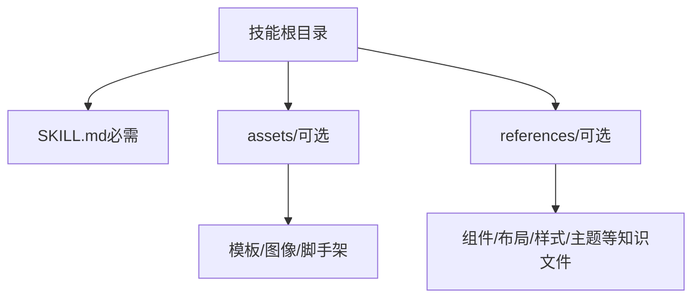
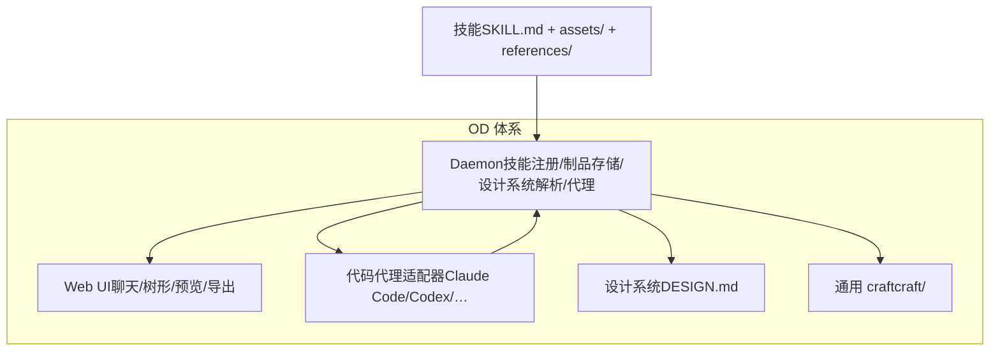
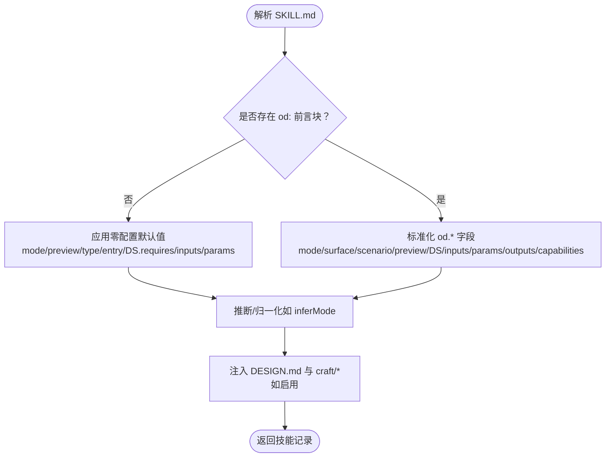
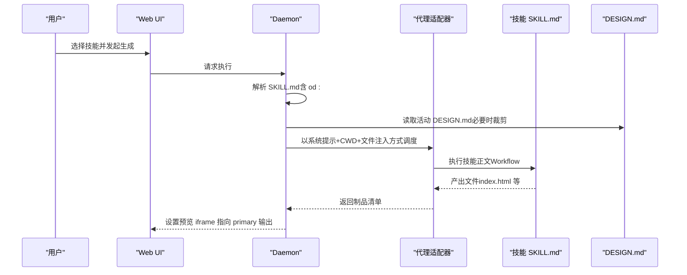
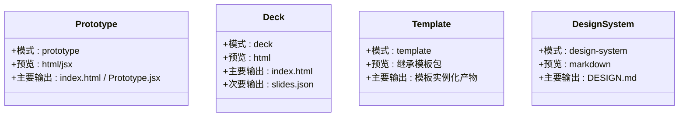
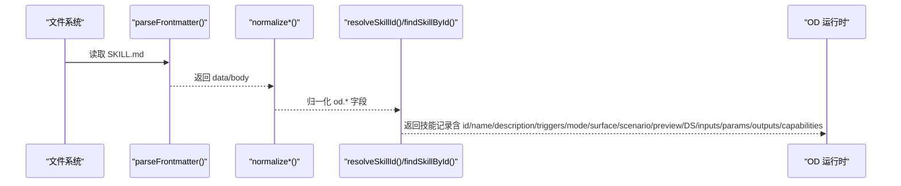
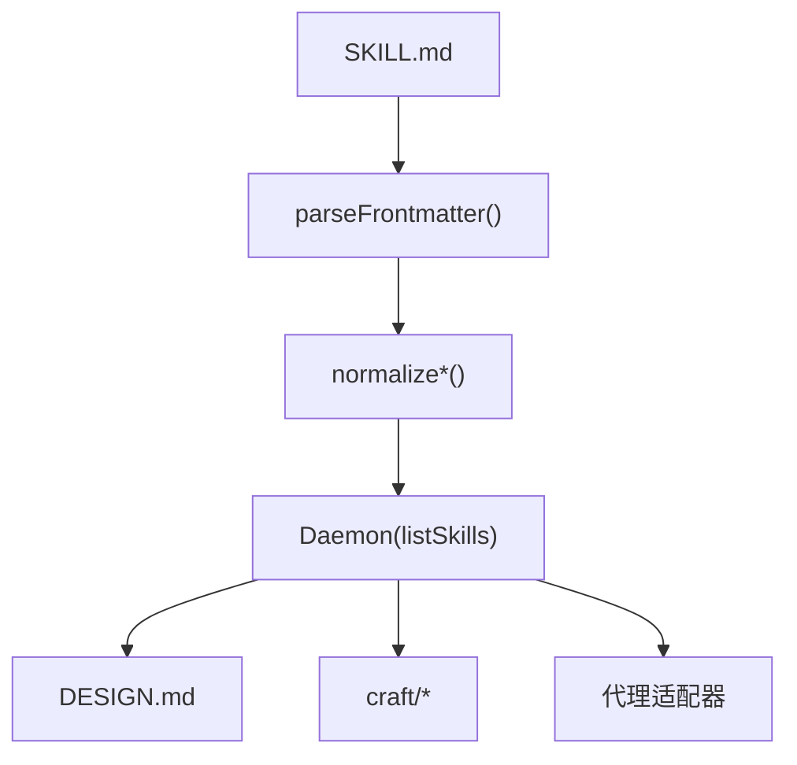

# 技能协议规范

<cite>
**本文档引用的文件**
- [docs/skills-protocol.md](file://docs/skills-protocol.md)
- [docs/spec.md](file://docs/spec.md)
- [docs/examples/saas-landing-skill/SKILL.md](file://docs/examples/saas-landing-skill/SKILL.md)
- [skills/guizang-ppt/SKILL.md](file://skills/guizang-ppt/SKILL.md)
- [skills/html-ppt/SKILL.md](file://skills/html-ppt/SKILL.md)
- [skills/open-design-landing/SKILL.md](file://skills/open-design-landing/SKILL.md)
- [apps/daemon/src/skills.ts](file://apps/daemon/src/skills.ts)
- [craft/README.md](file://craft/README.md)
- [craft/color.md](file://craft/color.md)
- [craft/typography.md](file://craft/typography.md)
- [design-systems/README.md](file://design-systems/README.md)
</cite>

## 目录
1. [简介](#简介)
2. [项目结构](#项目结构)
3. [核心组件](#核心组件)
4. [架构总览](#架构总览)
5. [详细组件分析](#详细组件分析)
6. [依赖关系分析](#依赖关系分析)
7. [性能考量](#性能考量)
8. [故障排查指南](#故障排查指南)
9. [结论](#结论)
10. [附录](#附录)

## 简介
本规范定义了 Open Design（OD）中的“技能协议”，将“技能即文件”作为原子能力单元，沿用 Claude Code 的 SKILL.md 约定，并扩展 od: 前言字段以支持设计系统注入、UI 输入与参数化、预览类型与入口、输出产物声明、能力门禁等 OD 特性。OD 在兼容现有 Claude Code 技能的同时，提供零配置兼容与增强体验。

OD 的兼容承诺：现有 Claude Code 技能无需修改即可在 OD 中运行；OD 技能在不使用扩展字段时也可在 Claude Code 中运行。

## 项目结构
OD 技能遵循最小目录结构：
- 技能根目录包含 SKILL.md（必需）
- assets/（可选）：模板、图像、脚手架等
- references/（可选）：技能在规划阶段读取的知识文件

**图表来源**
- [docs/skills-protocol.md:13-24](file://docs/skills-protocol.md#L13-L24)

**章节来源**
- [docs/skills-protocol.md:11-24](file://docs/skills-protocol.md#L11-L24)

## 核心组件
- 技能清单与发现：Daemon 扫描三个位置，按优先级合并冲突；支持符号链接策略统一管理。
- OD 扩展字段：od: 前言块提供模式、预览、设计系统、通用 craft 引用、输入与参数、输出、能力门禁等。
- 设计系统注入：非设计系统技能可消费活动 DESIGN.md，系统提示前缀、CWD 文件与 Mustache 变量。
- 通用 craft 注入：craft/ 下的通用规则按需注入，位于 DESIGN.md 与技能正文之间。
- 安装与测试：提供命令行安装、列表、移除；技能可携带测试用例进行回归验证。

**章节来源**
- [docs/skills-protocol.md:125-151](file://docs/skills-protocol.md#L125-L151)
- [docs/skills-protocol.md:45-124](file://docs/skills-protocol.md#L45-L124)
- [docs/skills-protocol.md:189-244](file://docs/skills-protocol.md#L189-L244)
- [docs/skills-protocol.md:245-261](file://docs/skills-protocol.md#L245-L261)
- [docs/skills-protocol.md:337-350](file://docs/skills-protocol.md#L337-L350)

## 架构总览
OD 技能协议在 OD 体系中的作用与交互：

**图表来源**
- [docs/spec.md:65-94](file://docs/spec.md#L65-L94)
- [apps/daemon/src/skills.ts:41-98](file://apps/daemon/src/skills.ts#L41-L98)

## 详细组件分析

### OD 扩展字段与默认行为
od: 前言块中的字段用于驱动 UI 与运行时行为。未设置时采用“零配置兼容”的默认值，确保现有 Claude Code 技能无需改动即可在 OD 中运行。

字段与默认行为概览（摘自规范）：
- mode：从名称/描述关键词推断，否则为 prototype
- preview.type：按文件扩展名嗅探（*.html → html，*.jsx → jsx，否则 markdown）
- preview.entry：首个匹配类型的文件
- design_system.requires：若正文提及“design system”或“DESIGN.md”则为真
- inputs、parameters：空（仅自由文本）
- craft.requires：空数组
- outputs.primary/secondary：由技能自行声明
- capabilities_required：空数组

**图表来源**
- [apps/daemon/src/skills.ts:41-98](file://apps/daemon/src/skills.ts#L41-L98)
- [apps/daemon/src/skills.ts:232-242](file://apps/daemon/src/skills.ts#L232-L242)
- [apps/daemon/src/skills.ts:161-174](file://apps/daemon/src/skills.ts#L161-L174)

**章节来源**
- [docs/skills-protocol.md:45-124](file://docs/skills-protocol.md#L45-L124)
- [apps/daemon/src/skills.ts:41-98](file://apps/daemon/src/skills.ts#L41-L98)

### 设计系统注入机制
非设计系统技能（模式 1–3）可消费活动 DESIGN.md。OD 在三处提供上下文：
- 系统提示前缀（仅所需部分）
- 当前工作目录下的 DESIGN.md 文件
- Mustache 变量 {{ design_system }}

**图表来源**
- [docs/skills-protocol.md:189-196](file://docs/skills-protocol.md#L189-L196)
- [apps/daemon/src/skills.ts:57-92](file://apps/daemon/src/skills.ts#L57-L92)

**章节来源**
- [docs/skills-protocol.md:189-214](file://docs/skills-protocol.md#L189-L214)

### 通用 craft 注入机制
craft/ 提供品牌无关的设计规则（如排版、色彩、反 AI 倾向等）。技能通过 od.craft.requires 声明所需条目，Daemon 仅注入请求的部分，未知条目静默忽略，保证前向兼容。

**图表来源**
- [craft/README.md:20-34](file://craft/README.md#L20-L34)
- [craft/README.md:47-54](file://craft/README.md#L47-L54)
- [apps/daemon/src/skills.ts:161-174](file://apps/daemon/src/skills.ts#L161-L174)

**章节来源**
- [craft/README.md:1-63](file://craft/README.md#L1-L63)
- [craft/color.md:1-89](file://craft/color.md#L1-L89)
- [craft/typography.md:1-89](file://craft/typography.md#L1-L89)
- [apps/daemon/src/skills.ts:155-174](file://apps/daemon/src/skills.ts#L155-L174)

### 技能类型与模式
OD 定义四种模式，分别要求不同的产物与工作流：
- prototype-skill：单屏交互原型，预览 html/jsx，主要输出 index.html/Prototype.jsx
- deck-skill：多页演示，预览 html，主要输出 index.html，次要输出 slides.json（用于 PPTX 导出）
- template-skill：从预置制品起始，代理仅个性化内容
- design-system-skill：生成 DESIGN.md，预览 markdown，主要输出 DESIGN.md

**图表来源**
- [docs/skills-protocol.md:152-188](file://docs/skills-protocol.md#L152-L188)

**章节来源**
- [docs/skills-protocol.md:152-188](file://docs/skills-protocol.md#L152-L188)

### 字段使用说明与默认值处理
- mode：显式 od.mode > 关键词推断 > prototype
- preview.type：显式 od.preview.type > 文件扩展名嗅探 > markdown
- preview.entry：显式 od.preview.entry > 嗅探到的第一个匹配文件
- design_system.requires：显式 od.design_system.requires > 正文关键词检测 > true
- inputs/parameters：显式 od.inputs/parameters > 空（自由文本）
- craft.requires：显式 od.craft.requires > 空数组
- outputs.primary/secondary：由技能声明
- capabilities_required：显式 od.capabilities_required > 空数组

**章节来源**
- [docs/skills-protocol.md:114-124](file://docs/skills-protocol.md#L114-L124)
- [apps/daemon/src/skills.ts:232-242](file://apps/daemon/src/skills.ts#L232-L242)
- [apps/daemon/src/skills.ts:59-92](file://apps/daemon/src/skills.ts#L59-L92)

### 兼容性与迁移
- 兼容承诺：现有 Claude Code 技能无需修改即可在 OD 中运行
- 符号链接策略：可将技能集中放置并通过符号链接到各代理期望目录
- 前向兼容：craft 未知条目静默忽略；inputs/parameters 缺省为空

**章节来源**
- [docs/skills-protocol.md:7](file://docs/skills-protocol.md#L7)
- [docs/skills-protocol.md:137-151](file://docs/skills-protocol.md#L137-L151)
- [craft/README.md:35-44](file://craft/README.md#L35-L44)

### 示例与解析规则
- 示例技能：saas-landing、guizang-ppt、html-ppt、open-design-landing
- 解析规则：Daemon 读取 SKILL.md front-matter，解析 od.* 字段，推断模式与表面（surface）、场景（scenario）、平台（platform）、示例提示等

**图表来源**
- [apps/daemon/src/skills.ts:57-92](file://apps/daemon/src/skills.ts#L57-L92)
- [apps/daemon/src/skills.ts:24-39](file://apps/daemon/src/skills.ts#L24-L39)

**章节来源**
- [docs/examples/saas-landing-skill/SKILL.md:1-121](file://docs/examples/saas-landing-skill/SKILL.md#L1-L121)
- [skills/guizang-ppt/SKILL.md:1-315](file://skills/guizang-ppt/SKILL.md#L1-L315)
- [skills/html-ppt/SKILL.md:1-252](file://skills/html-ppt/SKILL.md#L1-L252)
- [skills/open-design-landing/SKILL.md:1-322](file://skills/open-design-landing/SKILL.md#L1-L322)
- [apps/daemon/src/skills.ts:41-98](file://apps/daemon/src/skills.ts#L41-L98)

## 依赖关系分析
OD 技能协议的依赖链：
- 技能（SKILL.md）依赖 Daemon 的解析与归一化
- Daemon 依赖 DESIGN.md 与 craft/ 的注入
- 运行时依赖代理适配器（Claude Code/Codex/…）

**图表来源**
- [apps/daemon/src/skills.ts:57-92](file://apps/daemon/src/skills.ts#L57-L92)
- [craft/README.md:20-34](file://craft/README.md#L20-L34)
- [design-systems/README.md:1-98](file://design-systems/README.md#L1-L98)

**章节来源**
- [apps/daemon/src/skills.ts:41-98](file://apps/daemon/src/skills.ts#L41-L98)
- [craft/README.md:1-63](file://craft/README.md#L1-L63)
- [design-systems/README.md:1-98](file://design-systems/README.md#L1-L98)

## 性能考量
- 技能发现：当前实现为每次请求重新扫描，适用于少量技能；大规模技能集建议引入文件系统监控或缓存层
- 字段归一化：字符串到布尔/枚举的转换为常数时间，开销极低
- 设计系统与 craft 注入：仅注入请求部分，减少令牌消耗
- 预览类型嗅探：基于文件扩展名，成本极低

[本节为通用指导，不涉及具体文件分析]

## 故障排查指南
- 技能未出现在列表：检查 SKILL.md 是否可读、是否位于扫描路径、是否被更高优先级位置覆盖
- 预览不正确：检查 od.preview.type 与 entry 是否匹配实际产物；确认文件扩展名与类型一致
- 设计系统未生效：确认 od.design_system.requires 为真或正文包含相关关键词；确认 DESIGN.md 已设置为活动系统
- craft 未生效：确认 od.craft.requires 列表中的条目与 craft/ 文件名一致；未知条目会被静默忽略
- 输入/参数无效：确认 inputs/parameters 的类型与范围；未声明时仍可使用自由文本
- 安装/卸载：使用 od skill add/remove 命令；确认符号链接指向正确

**章节来源**
- [docs/skills-protocol.md:125-151](file://docs/skills-protocol.md#L125-L151)
- [docs/skills-protocol.md:245-261](file://docs/skills-protocol.md#L245-L261)
- [craft/README.md:35-44](file://craft/README.md#L35-L44)

## 结论
OD 技能协议在保持与 Claude Code 高度兼容的前提下，通过 od: 前言扩展提供了设计系统与 craft 注入、输入与参数化、预览与输出声明、能力门禁等能力，既满足零配置兼容，又为复杂技能提供增强体验。其模块化与前向兼容设计，使得技能作者可渐进采用新特性，而不会破坏既有工作流。

[本节为总结性内容，不涉及具体文件分析]

## 附录

### 字段解析与默认值速查
- mode：显式 > 关键词推断 > prototype
- preview.type：显式 > 扩展名嗅探 > markdown
- preview.entry：显式 > 嗅探到的第一个匹配文件
- design_system.requires：显式 > 正文关键词 > true
- inputs/parameters：显式 > 空（自由文本）
- craft.requires：显式 > 空数组
- outputs.primary/secondary：由技能声明
- capabilities_required：显式 > 空数组

**章节来源**
- [docs/skills-protocol.md:114-124](file://docs/skills-protocol.md#L114-L124)
- [apps/daemon/src/skills.ts:59-92](file://apps/daemon/src/skills.ts#L59-L92)

### 示例技能参考
- saas-landing：最小但完整的原型技能示例，展示 inputs/parameters/outputs/capabilities_required
- guizang-ppt：deck 模式示例，展示 od.preview、design_system.requires、example_prompt 等
- html-ppt：deck 模式示例，展示 speaker_notes、animations、example_prompt 等
- open-design-landing：多输出与复杂 inputs/parameters 示例，展示输出条件与能力门禁

**章节来源**
- [docs/examples/saas-landing-skill/SKILL.md:1-121](file://docs/examples/saas-landing-skill/SKILL.md#L1-L121)
- [skills/guizang-ppt/SKILL.md:1-315](file://skills/guizang-ppt/SKILL.md#L1-L315)
- [skills/html-ppt/SKILL.md:1-252](file://skills/html-ppt/SKILL.md#L1-L252)
- [skills/open-design-landing/SKILL.md:1-322](file://skills/open-design-landing/SKILL.md#L1-L322)