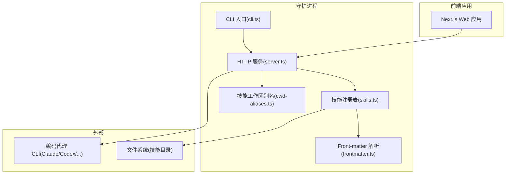
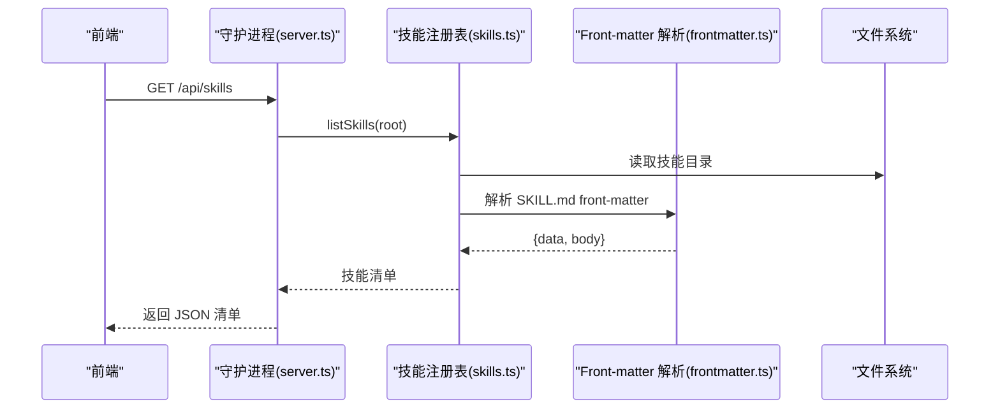
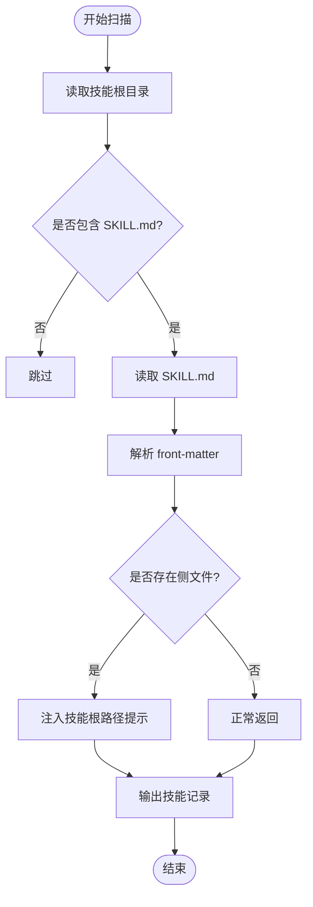
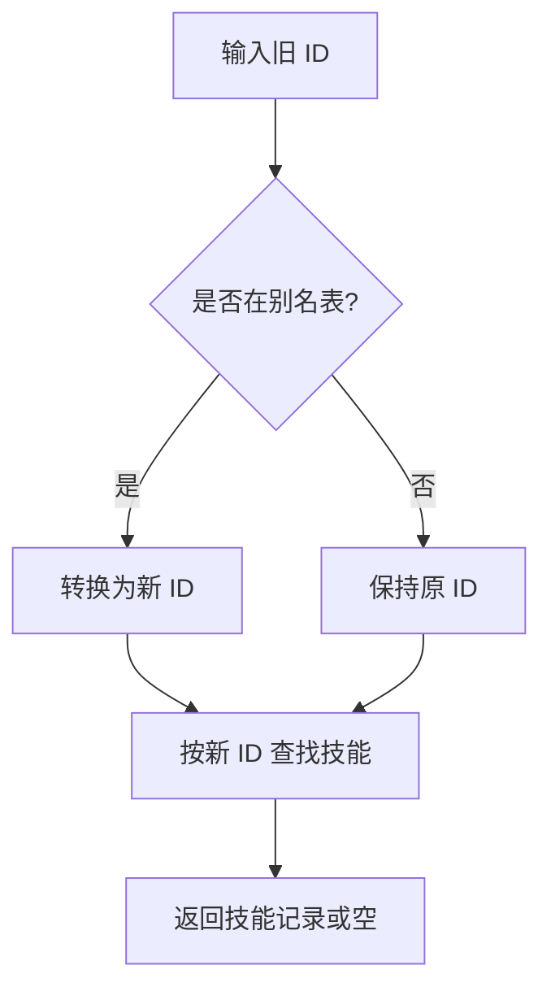
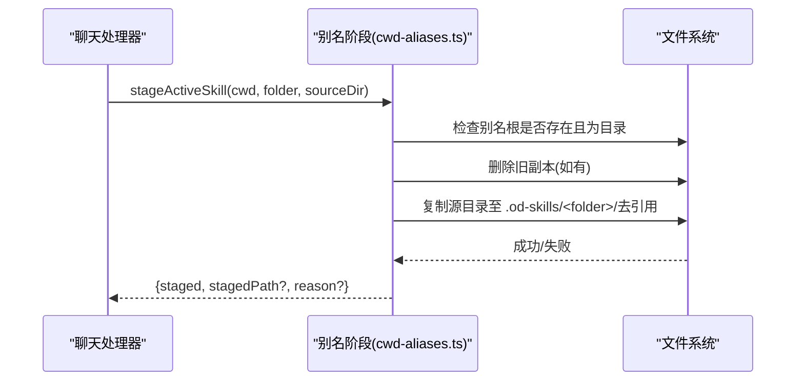
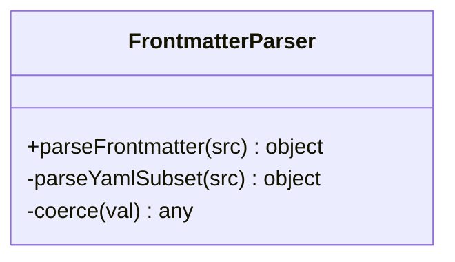
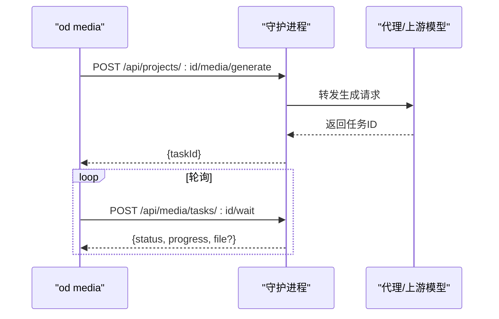
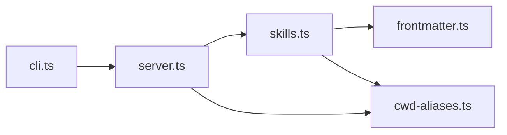

# 技能发现与管理

<cite>
**本文档引用的文件**
- [skills.ts](file://apps/daemon/src/skills.ts)
- [cwd-aliases.ts](file://apps/daemon/src/cwd-aliases.ts)
- [frontmatter.ts](file://apps/daemon/src/frontmatter.ts)
- [cli.ts](file://apps/daemon/src/cli.ts)
- [server.ts](file://apps/daemon/src/server.ts)
- [skills-protocol.md](file://docs/skills-protocol.md)
- [README.md](file://README.md)
- [spec.md](file://docs/spec.md)
- [guizang-ppt/SKILL.md](file://skills/guizang-ppt/SKILL.md)
- [web-prototype/SKILL.md](file://skills/web-prototype/SKILL.md)
- [package.json](file://apps/daemon/package.json)
</cite>

## 目录
1. [简介](#简介)
2. [项目结构](#项目结构)
3. [核心组件](#核心组件)
4. [架构总览](#架构总览)
5. [详细组件分析](#详细组件分析)
6. [依赖关系分析](#依赖关系分析)
7. [性能考量](#性能考量)
8. [故障排查指南](#故障排查指南)
9. [结论](#结论)
10. [附录](#附录)

## 简介
本文件面向“技能发现与管理系统”，系统性阐述技能的搜索、加载与优先级机制，覆盖三类扫描位置（项目私有、项目提交、用户全局）的优先级规则；解释冲突解决策略、符号链接机制、热重载能力；给出技能安装、卸载、列表查看等 CLI 命令的使用方法与参数说明；并说明技能注册表的工作原理与性能优化策略。

## 项目结构
- 技能注册表位于守护进程模块中，负责扫描技能目录、解析 front-matter、构建技能清单。
- CLI 提供守护进程启动与媒体生成子命令；媒体子命令通过 HTTP 调用守护进程接口实现。
- 项目采用多层职责分离：前端 Web 应用负责交互与预览；守护进程负责技能注册、设计系统解析、代理聊天与媒体生成；Agent 适配器负责对接不同编码代理 CLI。

**图表来源**
- [server.ts:1-120](file://apps/daemon/src/server.ts#L1-L120)
- [skills.ts:1-120](file://apps/daemon/src/skills.ts#L1-L120)
- [frontmatter.ts:1-80](file://apps/daemon/src/frontmatter.ts#L1-L80)
- [cwd-aliases.ts:1-80](file://apps/daemon/src/cwd-aliases.ts#L1-L80)
- [cli.ts:1-120](file://apps/daemon/src/cli.ts#L1-L120)

**章节来源**
- [README.md:344-441](file://README.md#L344-L441)
- [spec.md:63-95](file://docs/spec.md#L63-L95)

## 核心组件
- 技能注册表：扫描技能目录、解析 SKILL.md front-matter、推断模式与表面类型、注入设计系统与 craft 引用、派生示例提示与附件检测。
- 前端解析器：最小化 YAML front-matter 解析器，支持数组、块字面量与扁平键值。
- 工作区别名与符号链接：将活动技能复制到项目工作区的别名目录，确保侧文件可被代理以 cwd 相对路径访问；同时提供绝对回退路径。
- CLI：守护进程入口与媒体子命令；媒体子命令通过 HTTP 调用守护进程接口进行任务排队与等待。
- HTTP 服务：提供 /api/skills、/api/skills/:id/example、/api/projects/:id/media/generate 等接口；集成项目管理、设计系统、媒体模型与导出。

**章节来源**
- [skills.ts:41-98](file://apps/daemon/src/skills.ts#L41-L98)
- [frontmatter.ts:7-138](file://apps/daemon/src/frontmatter.ts#L7-L138)
- [cwd-aliases.ts:34-151](file://apps/daemon/src/cwd-aliases.ts#L34-L151)
- [cli.ts:49-115](file://apps/daemon/src/cli.ts#L49-L115)
- [server.ts:1-120](file://apps/daemon/src/server.ts#L1-L120)

## 架构总览
技能发现与管理贯穿“扫描 → 解析 → 注册 → 使用”全流程。守护进程在启动时扫描技能目录，构建技能清单；前端在技能选择器中展示；运行时将活动技能复制到项目工作区，注入设计系统与 craft 引用，最终由代理执行生成。

**图表来源**
- [server.ts:1-120](file://apps/daemon/src/server.ts#L1-L120)
- [skills.ts:41-98](file://apps/daemon/src/skills.ts#L41-L98)
- [frontmatter.ts:7-138](file://apps/daemon/src/frontmatter.ts#L7-L138)

## 详细组件分析

### 技能扫描与加载机制
- 扫描范围与优先级
  - 项目私有：./.claude/skills/（最高优先级）
  - 项目提交：./skills/（次高优先级）
  - 用户全局：~/.claude/skills/（最低优先级）
  - 冲突解决：按优先级保留高优先级版本，低优先级同名技能被忽略。
  - 监控与热重载：开发环境使用 chokidar 监听；生产环境通过 SIGHUP 信号触发重新扫描。
- 加载流程
  - 遍历技能根目录，过滤出包含 SKILL.md 的目录。
  - 读取并解析 front-matter，推断模式与表面类型，合并 craft 与设计系统要求。
  - 若技能包含侧文件（assets/references 等），在技能描述前注入“技能根路径”提示，确保代理可定位侧文件。
- 示例提示与附件检测
  - 若未显式提供示例提示，则从描述首句派生，限制长度。
  - 检测是否存在除 SKILL.md 外的侧文件，若有则启用“技能根路径”提示。

**图表来源**
- [skills.ts:41-98](file://apps/daemon/src/skills.ts#L41-L98)
- [frontmatter.ts:7-138](file://apps/daemon/src/frontmatter.ts#L7-L138)

**章节来源**
- [skills.ts:41-98](file://apps/daemon/src/skills.ts#L41-L98)
- [skills-protocol.md:125-151](file://docs/skills-protocol.md#L125-L151)

### 技能 ID 别名与冲突解决
- ID 别名映射：为历史重命名的技能提供向后兼容，查找时先转换为规范 ID 再匹配。
- 冲突处理：同一名称在同一优先级内仅保留一个；跨优先级时，高优先级覆盖低优先级。
- 影响范围：技能查询、系统提示拼装、项目持久化 ID 的兼容。

**图表来源**
- [skills.ts:19-39](file://apps/daemon/src/skills.ts#L19-L39)

**章节来源**
- [skills.ts:19-39](file://apps/daemon/src/skills.ts#L19-L39)

### 符号链接与工作区别名机制
- 目标：确保代理在项目工作区内可通过 cwd 相对路径访问技能侧文件（assets、references），避免写放大与权限绕过风险。
- 实施策略
  - 在每次对话前，将活动技能复制到项目工作区下的别名目录（.od-skills/<folder>/），并去引用（dereference），使复制体完全自包含。
  - 若复制失败，提供绝对路径回退，并在提示中同时给出相对与绝对两种形式。
  - 若别名根目录被占用（非目录），拒绝覆盖并返回原因。
- 安全性：复制体为独立工作副本，不写回源目录，降低风险。

**图表来源**
- [cwd-aliases.ts:58-133](file://apps/daemon/src/cwd-aliases.ts#L58-L133)

**章节来源**
- [cwd-aliases.ts:1-151](file://apps/daemon/src/cwd-aliases.ts#L1-L151)

### 前端解析器（Front-matter）
- 功能：解析 SKILL.md 中的 YAML front-matter，支持标量、数组、块字面量与扁平对象。
- 设计：轻量实现，避免额外依赖；对嵌套对象与流式语法不做支持。
- 用途：技能注册表读取 front-matter 后，派生模式、平台、场景、预览类型、设计系统要求等字段。

**图表来源**
- [frontmatter.ts:7-138](file://apps/daemon/src/frontmatter.ts#L7-L138)

**章节来源**
- [frontmatter.ts:1-138](file://apps/daemon/src/frontmatter.ts#L1-L138)

### CLI 与媒体子命令
- 守护进程模式：启动 HTTP 服务，绑定主机与端口，默认自动打开浏览器。
- 媒体子命令（od media）
  - generate：向守护进程提交生成请求，返回任务 ID；随后轮询等待直至完成或超时。
  - wait：基于任务 ID 继续等待，支持 --since 参数增量拉取进度。
  - 参数校验：严格白名单，未知标志直接报错。
- 任务轮询：带预算时间与分段超时，输出进度与最终结果；失败时输出错误码与消息。

**图表来源**
- [cli.ts:139-236](file://apps/daemon/src/cli.ts#L139-L236)
- [server.ts:1-120](file://apps/daemon/src/server.ts#L1-L120)

**章节来源**
- [cli.ts:49-115](file://apps/daemon/src/cli.ts#L49-L115)
- [cli.ts:139-236](file://apps/daemon/src/cli.ts#L139-L236)
- [cli.ts:238-328](file://apps/daemon/src/cli.ts#L238-L328)

### 技能注册表工作原理与性能优化
- 工作原理
  - 读取技能根目录，遍历子目录，检查 SKILL.md 是否存在。
  - 解析 front-matter，推断模式与表面类型，合并 craft 与设计系统要求。
  - 若存在侧文件，注入“技能根路径”提示，确保代理可定位。
  - 派生示例提示、默认平台与场景标签。
- 性能优化
  - 按需扫描：每次请求重新扫描，适合少量技能场景；大量技能时可考虑缓存与增量更新。
  - I/O 优化：复制技能到项目工作区使用 copy-on-write 文件系统可减少写放大。
  - 前端过滤：通过场景、平台、模式等字段在前端快速筛选，减少渲染压力。
  - 热重载：开发环境监听变更，生产环境通过信号触发重索引。

**章节来源**
- [skills.ts:41-98](file://apps/daemon/src/skills.ts#L41-L98)
- [cwd-aliases.ts:20-30](file://apps/daemon/src/cwd-aliases.ts#L20-L30)

### 技能协议与示例
- 协议要点
  - 基于 Claude Code 的 SKILL.md 约定，扩展 od: 字段（模式、预览、设计系统、craft、输入与参数等）。
  - 三种扫描位置与优先级，冲突按优先级覆盖。
  - 支持符号链接策略，集中管理技能并在多个代理目录中生效。
- 示例技能
  - web-prototype：桌面端通用原型技能，强调“从种子复制 + 布局库拼装”的工作流。
  - guizang-ppt：杂志风格网页 PPT 技能，包含方向选择、布局骨架、主题色与检查清单。

**章节来源**
- [skills-protocol.md:125-151](file://docs/skills-protocol.md#L125-L151)
- [web-prototype/SKILL.md:1-98](file://skills/web-prototype/SKILL.md#L1-L98)
- [guizang-ppt/SKILL.md:1-60](file://skills/guizang-ppt/SKILL.md#L1-L60)

## 依赖关系分析
- 组件耦合
  - skills.ts 依赖 frontmatter.ts 解析 front-matter；依赖 cwd-aliases.ts 生成技能工作区别名。
  - server.ts 依赖 skills.ts 提供技能清单；依赖 cwd-aliases.ts 在运行时复制技能。
  - cli.ts 依赖 server.ts 的 HTTP 接口；媒体子命令通过守护进程调度。
- 外部依赖
  - chokidar：开发环境监控文件变化。
  - better-sqlite3：本地数据库存储项目与会话状态。
  - Express：HTTP 服务框架。

**图表来源**
- [skills.ts:1-20](file://apps/daemon/src/skills.ts#L1-L20)
- [frontmatter.ts:1-10](file://apps/daemon/src/frontmatter.ts#L1-L10)
- [cwd-aliases.ts:1-20](file://apps/daemon/src/cwd-aliases.ts#L1-L20)
- [server.ts:1-40](file://apps/daemon/src/server.ts#L1-L40)
- [cli.ts:1-20](file://apps/daemon/src/cli.ts#L1-L20)

**章节来源**
- [package.json:34-56](file://apps/daemon/package.json#L34-L56)

## 性能考量
- 技能扫描
  - 当前实现为每次请求重新扫描，适合中小规模技能集；大规模技能集建议引入缓存与增量索引。
- I/O 与复制
  - 项目工作区复制采用去引用与按需清理，避免残留；在支持 COW 的文件系统上可显著降低写放大。
- 前端渲染
  - 通过场景/平台/模式等字段进行前端过滤，减少渲染与交互成本。
- 热重载
  - 开发环境 chokidar 监听；生产环境 SIGHUP 触发重索引，避免频繁重启。

[本节为通用指导，不直接分析特定文件]

## 故障排查指南
- 媒体子命令失败
  - 检查守护进程地址与项目 ID 是否正确；确认网络策略未阻断出站连接。
  - 关注返回的状态码与错误信息，必要时使用 --daemon-url 显式指定。
- 任务长时间运行
  - 使用 od media wait 继续跟踪；注意 --since 参数用于增量拉取。
  - 若超过预算时间，命令会输出手付信息与退出码，按提示继续等待。
- 技能未出现在选择器
  - 确认 SKILL.md 存在且 front-matter 可解析；检查扫描位置与优先级。
  - 若存在同名技能，确认是否被更高优先级版本覆盖。
- 侧文件无法访问
  - 确认已启用工作区别名复制；若失败，检查别名根目录占用情况与权限。

**章节来源**
- [cli.ts:330-352](file://apps/daemon/src/cli.ts#L330-L352)
- [cli.ts:238-328](file://apps/daemon/src/cli.ts#L238-L328)
- [cwd-aliases.ts:93-111](file://apps/daemon/src/cwd-aliases.ts#L93-L111)

## 结论
本系统通过清晰的扫描优先级、严格的冲突解决策略、安全的别名复制与回退路径，以及简洁的 CLI 与 HTTP 接口，实现了可扩展、可维护的技能发现与管理能力。结合前端过滤与热重载，可在开发与生产环境中高效迭代。未来可进一步引入缓存与增量索引以提升大规模技能集的性能表现。

[本节为总结，不直接分析特定文件]

## 附录

### 技能安装、卸载、列表查看与测试（待实现）
- 当前仓库已定义 CLI 命令与参数规范，具体实现处于“草案”阶段，后续将补充安装、卸载、列表与测试等子命令。

**章节来源**
- [skills-protocol.md:245-261](file://docs/skills-protocol.md#L245-L261)

### 技能示例与工作流参考
- web-prototype：强调“种子复制 + 布局库拼装”的工作流，适合通用原型生成。
- guizang-ppt：提供方向选择、布局骨架、主题色与检查清单，适合高质量网页 PPT。

**章节来源**
- [web-prototype/SKILL.md:1-98](file://skills/web-prototype/SKILL.md#L1-L98)
- [guizang-ppt/SKILL.md:1-60](file://skills/guizang-ppt/SKILL.md#L1-L60)