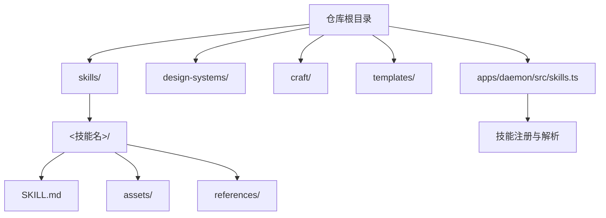
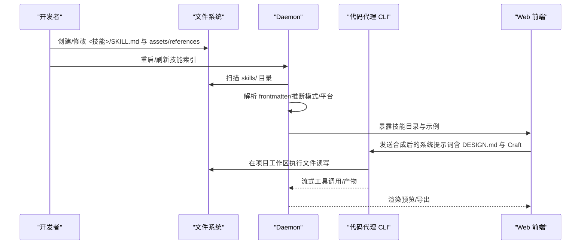
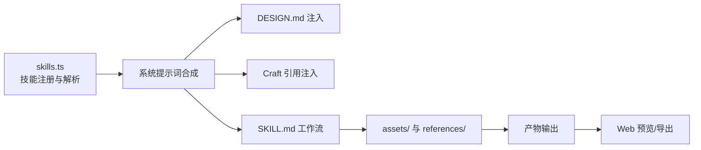

# 技能开发指南

<cite>
**本文引用的文件**
- [README.md](file://README.md)
- [docs/skills-protocol.md](file://docs/skills-protocol.md)
- [docs/modes.md](file://docs/modes.md)
- [docs/spec.md](file://docs/spec.md)
- [apps/daemon/src/skills.ts](file://apps/daemon/src/skills.ts)
- [apps/daemon/src/craft.ts](file://apps/daemon/src/craft.ts)
- [craft/README.md](file://craft/README.md)
- [craft/color.md](file://craft/color.md)
- [craft/typography.md](file://craft/typography.md)
- [craft/anti-ai-slop.md](file://craft/anti-ai-slop.md)
- [skills/web-prototype/SKILL.md](file://skills/web-prototype/SKILL.md)
- [skills/mobile-app/SKILL.md](file://skills/mobile-app/SKILL.md)
- [skills/html-ppt/SKILL.md](file://skills/html-ppt/SKILL.md)
- [skills/guizang-ppt/SKILL.md](file://skills/guizang-ppt/SKILL.md)
</cite>

## 目录
1. [简介](#简介)
2. [项目结构](#项目结构)
3. [核心组件](#核心组件)
4. [架构总览](#架构总览)
5. [详细组件分析](#详细组件分析)
6. [依赖关系分析](#依赖关系分析)
7. [性能考量](#性能考量)
8. [故障排查指南](#故障排查指南)
9. [结论](#结论)
10. [附录](#附录)

## 简介
本指南面向开发者，系统讲解如何在 Open Design 中创建与发布“技能”（Skill）。内容涵盖：
- 目录结构规范与文件职责
- SKILL.md 扩展 frontmatter 的编写技巧
- assets 与 references 目录的使用
- 不同类型技能（prototype、deck、template、design-system）的开发模板与最佳实践
- 输入参数定义、预览配置、设计系统集成、Craft 引用使用
- 调试技巧、测试方法与发布流程

## 项目结构
Open Design 将“技能”作为最小可组合单元，遵循 Claude Code 的 SKILL.md 约定，并扩展了 OD 的 frontmatter 字段以支持模式、预览、输入参数、Craft 引用等能力。技能位于 skills/ 目录下，每个技能至少包含 SKILL.md，以及可选的 assets/ 与 references/。

图示来源
- [README.md:344-441](file://README.md#L344-L441)
- [docs/skills-protocol.md:11-44](file://docs/skills-protocol.md#L11-L44)

章节来源
- [README.md:344-441](file://README.md#L344-L441)
- [docs/skills-protocol.md:11-44](file://docs/skills-protocol.md#L11-L44)

## 核心组件
- 技能注册与解析：daemon 侧扫描 skills/ 目录，解析 SKILL.md frontmatter，推断模式与平台，注入 DESIGN.md 与 Craft 引用，构建技能目录供前端选择。
- 模式系统：四种模式（prototype、deck、template、design-system）分别对应不同的工作流形状与输出形态。
- Craft 引用：品牌无关的通用设计准则（排版、色彩、反 AI-slop 等），技能可按需声明引用，系统在合成 prompt 时注入。

章节来源
- [apps/daemon/src/skills.ts:41-98](file://apps/daemon/src/skills.ts#L41-L98)
- [docs/modes.md:1-274](file://docs/modes.md#L1-L274)
- [craft/README.md:1-63](file://craft/README.md#L1-L63)

## 架构总览
技能开发与运行的整体流程如下：

图示来源
- [apps/daemon/src/skills.ts:41-98](file://apps/daemon/src/skills.ts#L41-L98)
- [docs/skills-protocol.md:215-244](file://docs/skills-protocol.md#L215-L244)
- [docs/modes.md:18-111](file://docs/modes.md#L18-L111)

## 详细组件分析

### 1) 目录结构规范与文件职责
- SKILL.md：技能清单与工作流说明，采用 YAML frontmatter + 自由体 Markdown 描述。
- assets/：种子模板、图片、字体等资源，供技能在生成阶段复制/内联。
- references/：知识库文件，如布局、组件、主题、检查清单等，供技能在规划阶段引用。

章节来源
- [docs/skills-protocol.md:11-44](file://docs/skills-protocol.md#L11-L44)

### 2) SKILL.md 扩展 frontmatter（od: 字段）
OD 在 Claude Code 的基础上新增了若干字段，用于增强 UI 体验与工作流控制：
- od.mode：技能模式（prototype/deck/template/design-system），用于路由与筛选
- od.preview：预览类型与入口文件，决定 iframe 渲染器与热更新策略
- od.design_system.requires/sections：是否需要 DESIGN.md，以及需要注入的 sections
- od.craft.requires：声明所需的通用 Craft 引用（如 typography、color、anti-ai-slop）
- od.inputs/parameters：结构化输入与运行时可调参数（滑条）
- od.outputs.primary/secondary：主次产物文件，用于导出与 PPTX 等
- od.capabilities_required：能力要求（如 comment mode 需要 surgical_edit）

章节来源
- [docs/skills-protocol.md:49-113](file://docs/skills-protocol.md#L49-L113)
- [apps/daemon/src/skills.ts:59-92](file://apps/daemon/src/skills.ts#L59-L92)

### 3) 模式与工作流（modes）
- Prototype（原型）：单屏交互原型，HTML/JSX 输出，支持评论精修与参数滑条
- Deck（演示文稿）：多页 HTML 演示，导航由技能自身负责，支持 PPTX 导出
- Template（模板）：从预置模板快速生成，仅个性化内容
- Design System（设计系统）：产出 DESIGN.md 与示例预览，作为其他模式的上下文

章节来源
- [docs/modes.md:7-16](file://docs/modes.md#L7-L16)
- [docs/modes.md:18-111](file://docs/modes.md#L18-L111)
- [docs/modes.md:114-167](file://docs/modes.md#L114-L167)
- [docs/modes.md:170-227](file://docs/modes.md#L170-L227)

### 4) 设计系统集成（DESIGN.md）
- 每个非 design-system 的技能可消费当前激活的 DESIGN.md，系统会在 prompt 中注入必要 sections，并在 CWD 提供 DESIGN.md 文件与模板变量
- 技能可通过 od.design_system.requires 与 od.design_system.sections 控制注入范围，减少 token 消耗

章节来源
- [docs/skills-protocol.md:189-214](file://docs/skills-protocol.md#L189-L214)

### 5) Craft 引用使用
- Craft 是品牌无关的设计准则集合，技能通过 od.craft.requires 声明所需条目，系统在合成 prompt 时按需注入
- 未实现的 Craft 条目会被静默忽略，保证技能向前兼容

章节来源
- [craft/README.md:1-63](file://craft/README.md#L1-L63)
- [apps/daemon/src/craft.ts:21-46](file://apps/daemon/src/craft.ts#L21-L46)

### 6) 不同类型技能的开发模板与最佳实践

#### 6.1 原型技能（prototype）
- 典型工作流：需求澄清 → 读取 DESIGN.md 与种子模板 → 组合布局 → 自检 → 输出 HTML/JSX
- 建议：在 SKILL.md 中明确列出 assets/template.html 的类名清单，确保生成前进行“预检”
- 示例参考：web-prototype、mobile-app

章节来源
- [skills/web-prototype/SKILL.md:1-98](file://skills/web-prototype/SKILL.md#L1-L98)
- [skills/mobile-app/SKILL.md:1-101](file://skills/mobile-app/SKILL.md#L1-L101)

#### 6.2 演示技能（deck）
- 典型工作流：主题/方向选择 → 滑块参数（如 accent_hue、section_spacing）→ 布局库选择 → 自检 → 输出单文件 HTML 与 slides.json（用于 PPTX）
- 示例参考：html-ppt、guizang-ppt

章节来源
- [skills/html-ppt/SKILL.md:1-252](file://skills/html-ppt/SKILL.md#L1-L252)
- [skills/guizang-ppt/SKILL.md:1-315](file://skills/guizang-ppt/SKILL.md#L1-L315)

#### 6.3 模板技能（template）
- 典型工作流：从 assets/base.html 复制 → 填充占位符 → 可选地按 DESIGN.md 重新着色
- 输出形态与原型一致，但无设计决策过程

章节来源
- [docs/modes.md:144-167](file://docs/modes.md#L144-L167)

#### 6.4 设计系统技能（design-system）
- 输入：截图/PDF/URL/自由描述 → 产出 DESIGN.md 与示例预览
- 输出：DESIGN.md、preview.html、tokens.json（可选）

章节来源
- [docs/modes.md:170-227](file://docs/modes.md#L170-L227)

### 7) 输入参数定义与预览配置
- od.inputs：结构化输入，支持 string/integer/enum/boolean 等类型，可设置 required/default/min/max
- od.parameters：运行时滑条参数，支持 hue/spacing/font-scale/opacity 等类型，变更后触发再生成
- od.preview：指定 type（html/jsx/pptx/markdown）与入口文件，决定 iframe 渲染器与热更新策略

章节来源
- [docs/skills-protocol.md:68-96](file://docs/skills-protocol.md#L68-L96)
- [docs/skills-protocol.md:114-123](file://docs/skills-protocol.md#L114-L123)

### 8) 设计系统集成与 Craft 引用
- 设计系统：通过 od.design_system.requires 与 sections 注入 DESIGN.md，系统自动在 CWD 提供 DESIGN.md 并注入模板变量
- Craft：通过 od.craft.requires 声明，系统在 prompt 中注入相应条目，未实现条目静默忽略

章节来源
- [docs/skills-protocol.md:189-244](file://docs/skills-protocol.md#L189-L244)
- [craft/README.md:20-44](file://craft/README.md#L20-L44)

### 9) 高级功能：评论精修与参数滑条
- 评论精修：需要 agent 具备 surgical_edit 能力，技能通过 od.capabilities_required 声明
- 参数滑条：od.parameters 定义的参数在 UI 上以滑条呈现，变更后仅重渲染，不重新规划

章节来源
- [docs/skills-protocol.md:93-96](file://docs/skills-protocol.md#L93-L96)
- [docs/modes.md:54-58](file://docs/modes.md#L54-L58)

### 10) 调试技巧与测试方法
- 调试：利用 daemon 的技能注册日志与前端预览，逐步定位 SKILL.md 工作流中的问题；必要时在 assets/template.html 中加入占位符校验
- 测试：在技能根目录添加 tests/basic.prompt 与 basic.expected.*，使用轻量模型进行回归测试

章节来源
- [docs/skills-protocol.md:337-350](file://docs/skills-protocol.md#L337-L350)

### 11) 发布流程
- 本地开发：将技能放入 skills/ 目录，重启 daemon，技能出现在技能列表
- 共享发布：通过 od skill add <git-url> 安装到用户全局；或在项目私有 skills/ 下维护

章节来源
- [docs/skills-protocol.md:245-262](file://docs/skills-protocol.md#L245-L262)

## 依赖关系分析

图示来源
- [apps/daemon/src/skills.ts:41-98](file://apps/daemon/src/skills.ts#L41-L98)
- [docs/skills-protocol.md:189-244](file://docs/skills-protocol.md#L189-L244)

章节来源
- [apps/daemon/src/skills.ts:41-98](file://apps/daemon/src/skills.ts#L41-L98)
- [docs/skills-protocol.md:189-244](file://docs/skills-protocol.md#L189-L244)

## 性能考量
- token 消耗控制：通过 od.design_system.sections 限制 DESIGN.md 注入范围；仅在需要时注入 Craft 条目
- 预览热更新：od.preview.reload 可配置防抖策略，减少频繁刷新
- 生成路径优化：优先使用 assets/template.html 作为种子，避免重复计算与外部依赖

## 故障排查指南
- 生成产物不符合预期
  - 检查 assets/template.html 的类名清单是否齐全（预检）
  - 确认 DESIGN.md 的 tokens 是否正确映射到 :root 变量
  - 使用 od.parameters 调整参数，避免全量重规划
- 预览无法渲染
  - 检查 od.preview.type 与入口文件是否匹配
  - 确保 HTML 结构完整，无缺失标签
- 设计系统未生效
  - 确认 od.design_system.requires 与 sections 设置
  - 检查 DESIGN.md 是否可被读取（CWD 中是否存在）
- Craft 规则未生效
  - 确认 od.craft.requires 列表中的条目名称与 craft/ 文件名一致
  - 未实现的条目会被静默忽略，不影响技能运行

章节来源
- [skills/web-prototype/SKILL.md:45-98](file://skills/web-prototype/SKILL.md#L45-L98)
- [craft/README.md:35-44](file://craft/README.md#L35-L44)

## 结论
通过遵循本指南，开发者可以高效地创建符合 OD 模式体系的技能，充分利用 DESIGN.md 与 Craft 引用，结合结构化输入与参数滑条提升用户体验，并通过测试与调试保障质量。技能一经发布，即可在 OD 生态中被广泛复用与迭代。

## 附录

### A. SKILL.md 扩展字段速查
- od.mode：技能模式
- od.preview.type/entry：预览类型与入口
- od.design_system.requires/sections：设计系统注入开关与范围
- od.craft.requires：Craft 引用列表
- od.inputs/parameters：结构化输入与运行时参数
- od.outputs.primary/secondary：主次产物文件
- od.capabilities_required：能力要求

章节来源
- [docs/skills-protocol.md:49-113](file://docs/skills-protocol.md#L49-L113)

### B. Craft 引用清单
- typography：排版与字偶距规则
- color：色彩使用与对比度要求
- anti-ai-slop：反 AI-slop 检查清单

章节来源
- [craft/README.md:47-54](file://craft/README.md#L47-L54)
- [craft/typography.md:1-89](file://craft/typography.md#L1-L89)
- [craft/color.md:1-89](file://craft/color.md#L1-L89)
- [craft/anti-ai-slop.md:1-85](file://craft/anti-ai-slop.md#L1-L85)