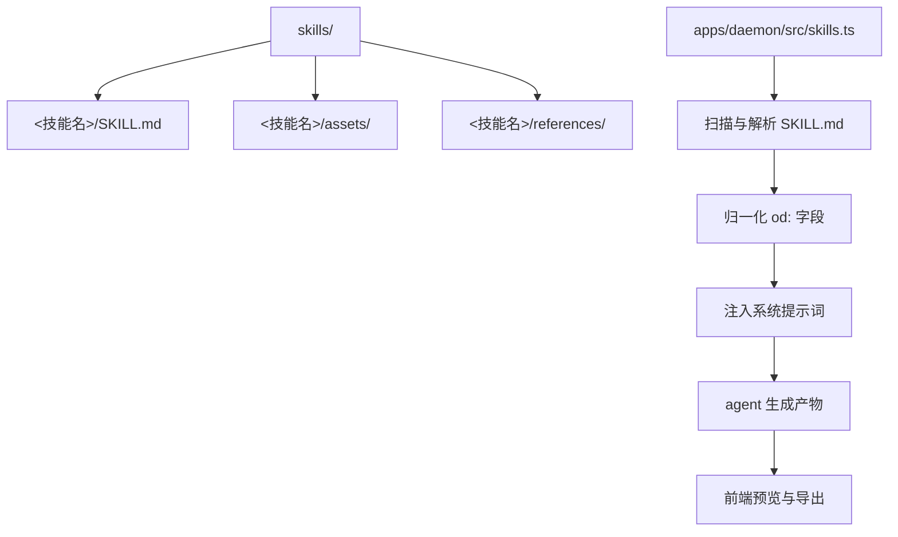
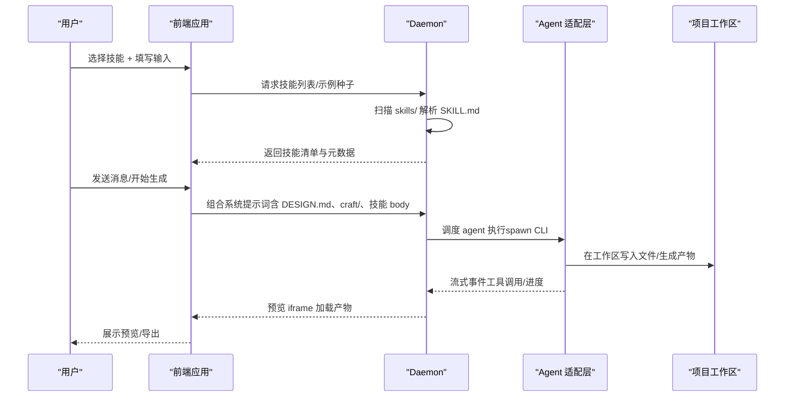
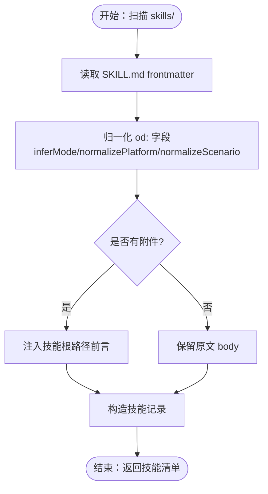
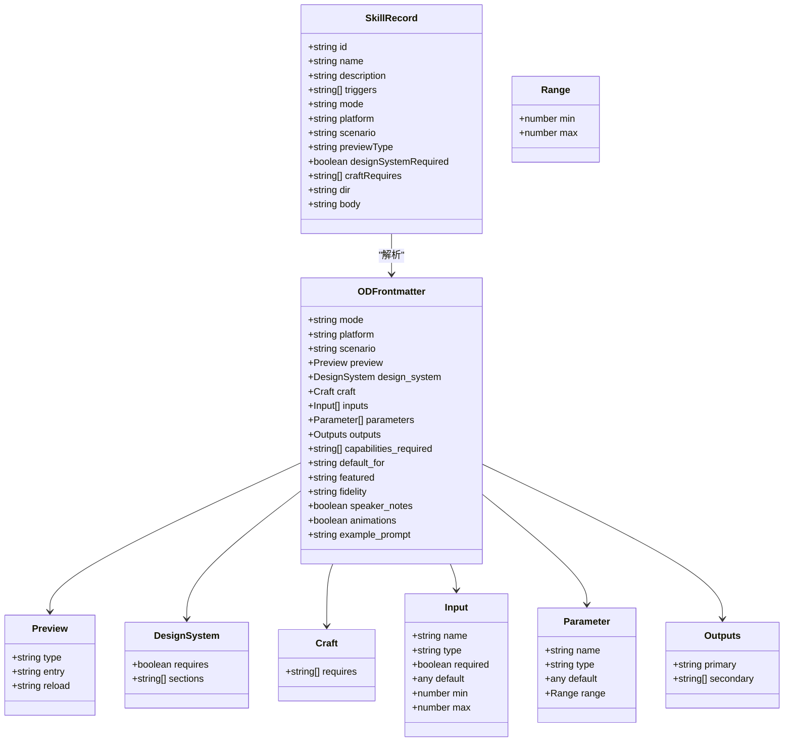
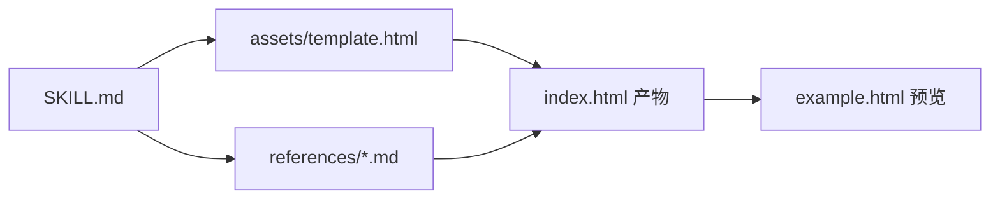
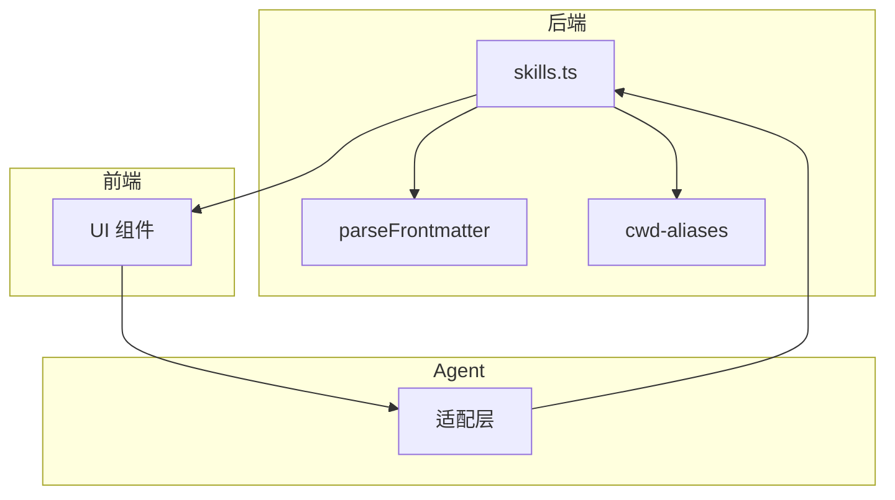

# 技能系统

<cite>
**本文引用的文件**
- [README.md](file://README.md)
- [skills-protocol.md](file://docs/skills-protocol.md)
- [skills.ts](file://apps/daemon/src/skills.ts)
- [web-prototype/SKILL.md](file://skills/web-prototype/SKILL.md)
- [saas-landing/SKILL.md](file://skills/saas-landing/SKILL.md)
- [guizang-ppt/SKILL.md](file://skills/guizang-ppt/SKILL.md)
- [motion-frames/SKILL.md](file://skills/motion-frames/SKILL.md)
- [guizang-ppt/README.md](file://skills/guizang-ppt/README.md)
- [html-ppt/README.md](file://skills/html-ppt/README.md)
- [web-prototype/example.html](file://skills/web-prototype/example.html)
- [saas-landing/example.html](file://skills/saas-landing/example.html)
- [motion-frames/example.html](file://skills/motion-frames/example.html)
- [guizang-ppt/assets/template.html](file://skills/guizang-ppt/assets/template.html)
</cite>

## 目录
1. [简介](#简介)
2. [项目结构](#项目结构)
3. [核心组件](#核心组件)
4. [架构总览](#架构总览)
5. [详细组件分析](#详细组件分析)
6. [依赖关系分析](#依赖关系分析)
7. [性能考量](#性能考量)
8. [故障排查指南](#故障排查指南)
9. [结论](#结论)
10. [附录](#附录)

## 简介
Open Design 的技能系统以“技能即文件”为核心理念：每个技能是一个独立的文件夹，遵循 Claude Code 的 SKILL.md 约定，并扩展 od: 前言字段，使技能具备模式（mode）、平台（platform）、场景（scenario）、预览类型（preview.type）等元数据，从而在 OD 的前端与后端之间形成一致的协议。OD 的技能库包含 31 个内置技能，覆盖原型设计、演示文稿、文档与运营等场景；这些技能通过 daemon 的技能注册机制被扫描、解析并注入到系统提示词中，驱动 agent 在项目工作区中生成可预览、可导出的产物。

OD 的设计理念强调“文件而非插件”，即技能无需编译、无需安装额外依赖，只需放入 skills/ 目录，重启 daemon 即可生效。OD 的 od: 前言字段扩展了 Claude Code 的基础能力，支持预览类型、输入参数、参数调节、输出清单、能力要求等，使技能在前端具备更丰富的交互体验与更强的可组合性。

## 项目结构
技能系统的核心目录与文件如下：
- skills/：内置技能集合，每个技能以文件夹形式存在，包含 SKILL.md、assets/、references/ 等资源
- docs/skills-protocol.md：技能协议规范，定义 od: 前言字段、模式分类、输入/参数/输出等
- apps/daemon/src/skills.ts：技能注册与解析逻辑，负责扫描、解析 frontmatter、归一化字段、派生默认值
- 示例技能产物：skills/*/example.html 展示最终生成的示例页面
- 技能资产与参考：如 guizang-ppt/assets/template.html、references/*.md 等

**图表来源**
- [skills-protocol.md:11-44](file://docs/skills-protocol.md#L11-L44)
- [skills.ts:41-98](file://apps/daemon/src/skills.ts#L41-L98)

**章节来源**
- [README.md:116-216](file://README.md#L116-L216)
- [skills-protocol.md:11-44](file://docs/skills-protocol.md#L11-L44)
- [skills.ts:41-98](file://apps/daemon/src/skills.ts#L41-L98)

## 核心组件
- 技能目录结构
  - 必备文件：SKILL.md（包含 YAML frontmatter 与工作流说明）
  - 可选资源：assets/（模板、图片、运行时脚本等）、references/（组件、布局、检查清单等）
- od: 前言字段（OD 扩展）
  - od.mode：技能模式（prototype/deck/template/design-system）
  - od.platform：平台（desktop/mobile）
  - od.scenario：场景（design/marketing/operations/engineering/product/finance/hr/sales/personal 等）
  - od.preview.type：预览类型（html/jsx/pptx/markdown）
  - od.preview.entry：预览入口文件（相对路径）
  - od.design_system.requires：是否注入 DESIGN.md
  - od.design_system.sections：仅注入 DESIGN.md 的指定章节
  - od.craft.requires：注入通用设计规范（craft/）
  - od.inputs：用户可填写的结构化输入
  - od.parameters：运行期可调节的参数（滑条）
  - od.outputs.primary/secondary：主要/次要输出清单
  - od.capabilities_required：所需能力（如 surgical_edit、file_write）
  - 其他：default_for、featured、fidelity、speaker_notes、animations、example_prompt 等
- 技能注册与解析
  - daemon 扫描 skills/ 目录，读取 SKILL.md frontmatter，归一化字段，派生默认值
  - 若 SKILL.md 未声明 od:，则依据名称/描述/正文进行最佳努力推断
  - 将技能记录注入系统提示词，供 agent 使用

**章节来源**
- [skills-protocol.md:45-124](file://docs/skills-protocol.md#L45-L124)
- [skills.ts:41-98](file://apps/daemon/src/skills.ts#L41-L98)
- [skills.ts:232-300](file://apps/daemon/src/skills.ts#L232-L300)

## 架构总览
OD 的技能系统在前端与后端之间形成清晰的契约：前端负责渲染技能选择器、输入表单、参数滑条与预览；后端负责扫描技能、解析 frontmatter、注入上下文、调度 agent 生成产物，并将产物通过 sandboxed iframe 渲染回前端。

**图表来源**
- [README.md:257-299](file://README.md#L257-L299)
- [skills-protocol.md:190-244](file://docs/skills-protocol.md#L190-L244)
- [skills.ts:41-98](file://apps/daemon/src/skills.ts#L41-L98)

## 详细组件分析

### 组件 A：技能注册与解析（apps/daemon/src/skills.ts）
- 职责
  - 扫描 skills/ 目录，读取 SKILL.md frontmatter
  - 归一化 od: 字段（mode、platform、scenario、preview.type、design_system、craft、inputs、parameters、outputs、capabilities_required 等）
  - 派生默认值（如 inferMode、normalizePlatform、normalizeScenario、normalizeFeatured、normalizeBoolHint、normalizeFidelity）
  - 为带有附件的技能注入“技能根路径”前言，确保 agent 能正确读取 assets/references
- 关键函数
  - listSkills：遍历目录、解析 frontmatter、构造技能记录
  - inferMode/normalizePlatform/normalizeScenario：从正文/描述推断模式与场景
  - normalizeCraftRequires/normalizeDefaultFor/normalizeFeatured/normalizeBoolHint/normalizeFidelity：字段规范化
  - withSkillRootPreamble：为带附件的技能注入路径指引
- 依赖
  - parseFrontmatter（frontmatter 解析）
  - cwd-aliases（技能根路径别名）

**图表来源**
- [skills.ts:41-98](file://apps/daemon/src/skills.ts#L41-L98)
- [skills.ts:121-140](file://apps/daemon/src/skills.ts#L121-L140)
- [skills.ts:232-300](file://apps/daemon/src/skills.ts#L232-L300)

**章节来源**
- [skills.ts:41-98](file://apps/daemon/src/skills.ts#L41-L98)
- [skills.ts:121-140](file://apps/daemon/src/skills.ts#L121-L140)
- [skills.ts:232-300](file://apps/daemon/src/skills.ts#L232-L300)

### 组件 B：技能协议与 od: 前言字段（docs/skills-protocol.md）
- 基础格式（与 Claude Code 一致）
  - SKILL.md + assets/ + references/
- OD 扩展字段
  - od.mode、od.platform、od.scenario、od.preview.type/entry、od.design_system.requires/sections、od.craft.requires、od.inputs、od.parameters、od.outputs.primary/secondary、od.capabilities_required
  - 默认策略：若省略 od:，则按名称/描述/正文进行最佳努力推断
- 模式类型
  - prototype、deck、template、design-system（不同模式对输出与工作流有不同约束）
- 设计系统注入
  - 将 DESIGN.md 注入系统提示词（必要章节），并在 CWD 提供 DESIGN.md 文件与 {{ design_system }} 模板变量

**图表来源**
- [skills-protocol.md:49-113](file://docs/skills-protocol.md#L49-L113)
- [skills-protocol.md:152-188](file://docs/skills-protocol.md#L152-L188)

**章节来源**
- [skills-protocol.md:45-124](file://docs/skills-protocol.md#L45-L124)
- [skills-protocol.md:152-188](file://docs/skills-protocol.md#L152-L188)

### 组件 C：示例技能与产物（skills/*/example.html）
- web-prototype：通用桌面网页原型，展示单页 HTML 的生成与预览
- saas-landing：SaaS 营销落地页，演示输入参数与参数调节
- motion-frames：单帧动画合成，展示预览类型为 html 的运动设计
- guizang-ppt：杂志风网页 PPT，展示 assets/template.html 作为种子文件与 references/* 的协作

**图表来源**
- [web-prototype/SKILL.md:33-41](file://skills/web-prototype/SKILL.md#L33-L41)
- [saas-landing/SKILL.md:24-52](file://skills/saas-landing/SKILL.md#L24-L52)
- [motion-frames/SKILL.md:21-33](file://skills/motion-frames/SKILL.md#L21-L33)
- [guizang-ppt/SKILL.md:25-31](file://skills/guizang-ppt/SKILL.md#L25-L31)

**章节来源**
- [web-prototype/example.html:1-82](file://skills/web-prototype/example.html#L1-L82)
- [saas-landing/example.html:1-154](file://skills/saas-landing/example.html#L1-L154)
- [motion-frames/example.html:1-222](file://skills/motion-frames/example.html#L1-L222)
- [guizang-ppt/assets/template.html:1-200](file://skills/guizang-ppt/assets/template.html#L1-L200)

## 依赖关系分析
- 技能注册依赖
  - skills.ts 依赖 parseFrontmatter、cwd-aliases
  - 归一化函数依赖正则匹配与关键字推断
- 前端集成
  - 前端根据 od: 字段渲染输入表单、参数滑条、预览类型与能力开关
- agent 交互
  - 系统提示词中注入 DESIGN.md 与 craft/，技能 body 作为工作流指导
  - 产物通过 sandboxed iframe 预览，支持导出多种格式

**图表来源**
- [skills.ts:8-9](file://apps/daemon/src/skills.ts#L8-L9)

**章节来源**
- [skills.ts:8-9](file://apps/daemon/src/skills.ts#L8-L9)

## 性能考量
- 技能扫描与解析
  - 当前为每次请求重新扫描（GET /api/skills），适用于数十个技能规模；随着技能数量增长，可引入缓存与增量扫描
- 预览刷新
  - od.preview.reload 支持防抖策略，减少频繁刷新带来的渲染压力
- 产物体积
  - 原子化 HTML + 内联 CSS，避免额外构建步骤，利于快速预览与导出
- 设计系统与 craft 注入
  - 仅注入必要章节（od.design_system.sections），减少提示词长度，提升响应速度

[本节为通用指导，无需特定文件引用]

## 故障排查指南
- 技能未出现在选择器中
  - 检查 SKILL.md 是否存在 frontmatter 且 name/描述/正文包含触发关键词
  - 确认 assets/references 是否存在，必要时在 SKILL.md 中添加“技能根路径”前言
- 预览空白或 404
  - 检查 od.preview.entry 是否指向实际存在的文件
  - 确认产物是否在项目工作区生成，且路径正确
- 参数滑条无效
  - 确认 od.parameters 是否声明，且参数名与前端绑定一致
- 无法读取 DESIGN.md
  - 确认 od.design_system.requires 为 true，或在技能 body 中显式读取 CWD 的 DESIGN.md
- 导出异常
  - 检查 od.outputs.primary/secondary 是否与导出流程一致

**章节来源**
- [skills-protocol.md:101-113](file://docs/skills-protocol.md#L101-L113)
- [skills.ts:121-140](file://apps/daemon/src/skills.ts#L121-L140)

## 结论
Open Design 的技能系统以“文件即插件”的方式实现了高度可组合与可演进的设计能力。通过 od: 前言字段，技能在前端具备结构化输入、参数调节与预览控制，在后端具备一致的解析与注入流程。31 个内置技能覆盖广泛场景，配合 DESIGN.md 与 craft/ 的协同，使 agent 能在确定性上下文中创作高质量产物。未来可在技能缓存、参数稳定性、技能组合等方面进一步优化，以支撑更大规模的生态。

[本节为总结性内容，无需特定文件引用]

## 附录

### 技能开发指南
- 创建新技能
  - 在 skills/ 下新建文件夹，编写 SKILL.md（含 YAML frontmatter 与工作流）
  - 如需资源，放置 assets/ 与 references/ 文件
  - 重启 daemon，技能将出现在选择器中
- 利用现有技能
  - 在前端选择技能后，根据 od.inputs 与 od.parameters 填写与调节
  - 通过 od.preview.type 选择预览类型，实时查看生成效果
- 扩展技能功能
  - 添加 od.outputs.primary/secondary 以支持导出
  - 声明 od.capabilities_required 以启用评论模式等高级能力
  - 使用 od.design_system.requires 与 od.design_system.sections 控制 DESIGN.md 注入范围

**章节来源**
- [skills-protocol.md:245-262](file://docs/skills-protocol.md#L245-L262)
- [skills-protocol.md:284-326](file://docs/skills-protocol.md#L284-L326)

### 31 个内置技能概览与使用示例
- 原型类（27 个）
  - web-prototype：通用桌面网页原型（示例见 web-prototype/example.html）
  - saas-landing：SaaS 营销落地页（示例见 saas-landing/example.html）
  - dashboard：管理后台/数据分析（示例见 dashboard/example.html）
  - pricing-page：定价页面（示例见 pricing-page/example.html）
  - docs-page：文档页面（示例见 docs-page/example.html）
  - blog-post：博客文章（示例见 blog-post/example.html）
  - mobile-app：移动端页面（示例见 mobile-app/example.html）
  - mobile-onboarding：移动端引导流程（示例见 mobile-onboarding/example.html）
  - gamified-app：游戏化移动端原型（示例见 gamified-app/example.html）
  - email-marketing：HTML 邮件营销（示例见 email-marketing/example.html）
  - social-carousel：社交图集（示例见 social-carousel/example.html）
  - magazine-poster：杂志海报（示例见 magazine-poster/example.html）
  - motion-frames：单帧动画合成（示例见 motion-frames/example.html）
  - sprite-animation：像素动画（示例见 sprite-animation/example.html）
  - dating-web：约会网站仪表盘（示例见 dating-web/example.html）
  - digital-eguide：电子指南（示例见 digital-eguide/example.html）
  - wireframe-sketch：手绘草图（示例见 wireframe-sketch/example.html）
  - critique：五维自我评审（示例见 critique/example.html）
  - tweaks：微调面板（示例见 tweaks/example.html）
- 演示文稿类（4 个）
  - guizang-ppt：杂志风网页 PPT（示例见 guizang-ppt/example.html；种子模板见 assets/template.html）
  - simple-deck：极简横滑 PPT
  - replit-deck：产品讲解 PPT
  - weekly-update：周报 PPT

**章节来源**
- [README.md:169-216](file://README.md#L169-L216)
- [web-prototype/example.html:1-82](file://skills/web-prototype/example.html#L1-L82)
- [saas-landing/example.html:1-154](file://skills/saas-landing/example.html#L1-L154)
- [motion-frames/example.html:1-222](file://skills/motion-frames/example.html#L1-L222)
- [guizang-ppt/README.md:67-81](file://skills/guizang-ppt/README.md#L67-L81)
- [guizang-ppt/assets/template.html:1-200](file://skills/guizang-ppt/assets/template.html#L1-L200)