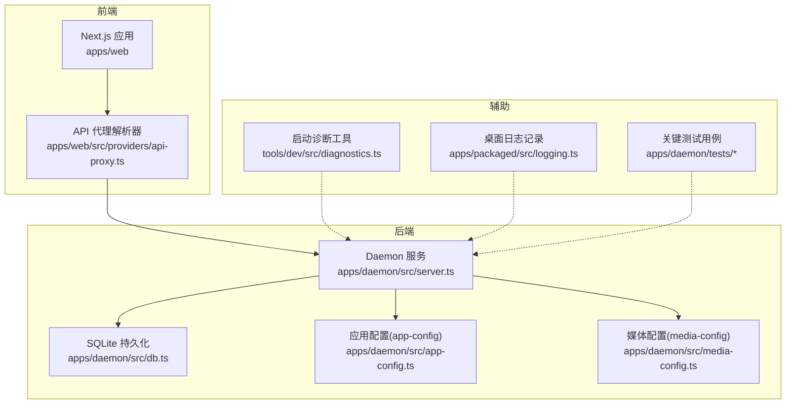
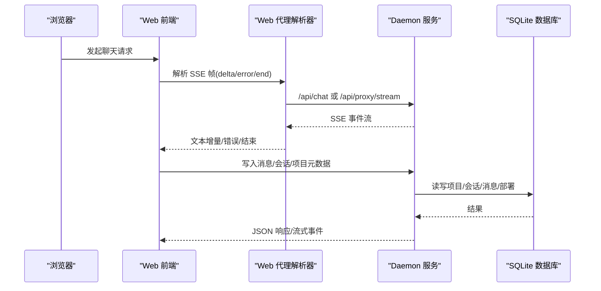
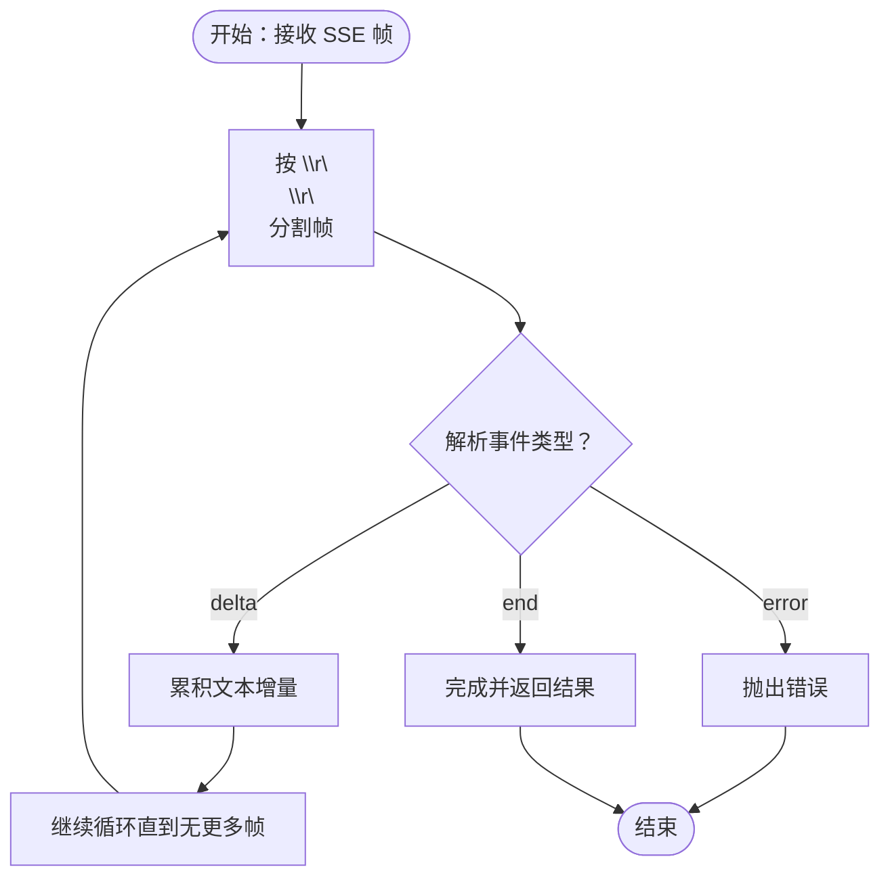
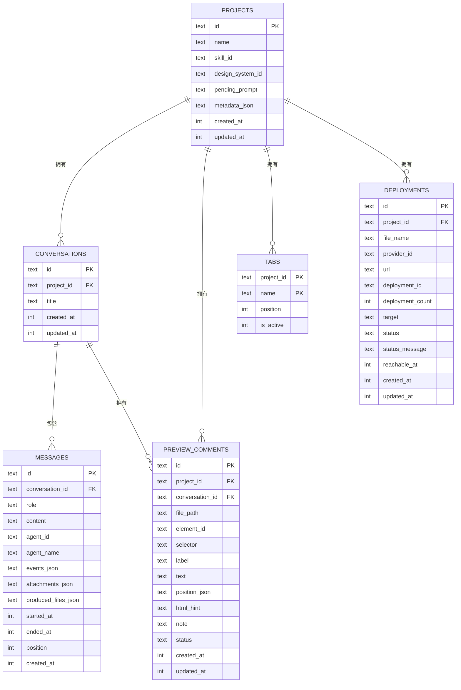
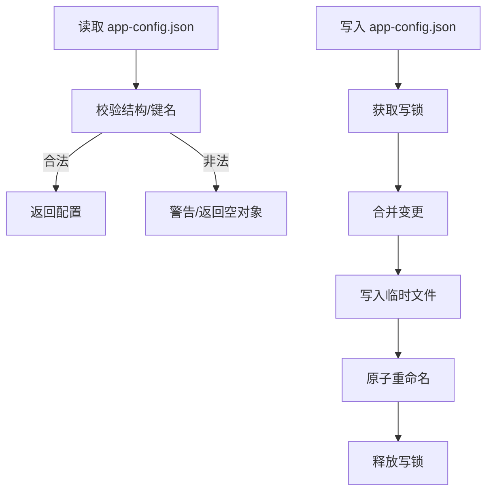
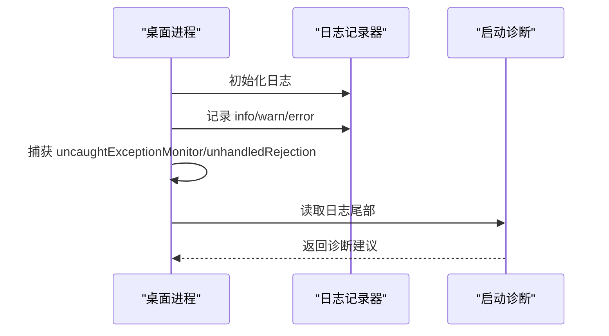
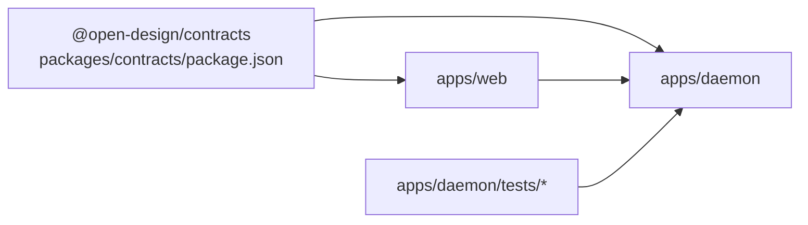

# 故障排除

<cite>
**本文引用的文件**
- [apps/daemon/src/server.ts](file://apps/daemon/src/server.ts)
- [apps/daemon/src/db.ts](file://apps/daemon/src/db.ts)
- [apps/daemon/src/app-config.ts](file://apps/daemon/src/app-config.ts)
- [apps/daemon/src/media-config.ts](file://apps/daemon/src/media-config.ts)
- [apps/daemon/src/server.ts](file://apps/daemon/src/server.ts)
- [apps/daemon/src/critique/errors.ts](file://apps/daemon/src/critique/errors.ts)
- [apps/web/src/providers/api-proxy.ts](file://apps/web/src/providers/api-proxy.ts)
- [apps/web/src/components/SettingsDialog.tsx](file://apps/web/src/components/SettingsDialog.tsx)
- [apps/packaged/src/logging.ts](file://apps/packaged/src/logging.ts)
- [tools/dev/src/diagnostics.ts](file://tools/dev/src/diagnostics.ts)
- [apps/daemon/tests/proxy-routes.test.ts](file://apps/daemon/tests/proxy-routes.test.ts)
- [apps/daemon/tests/sse-response.test.ts](file://apps/daemon/tests/sse-response.test.ts)
- [apps/daemon/tests/version-route.test.ts](file://apps/daemon/tests/version-route.test.ts)
- [apps/daemon/tests/deploy.test.ts](file://apps/daemon/tests/deploy.test.ts)
- [apps/web/src/App.tsx](file://apps/web/src/App.tsx)
- [packages/contracts/package.json](file://packages/contracts/package.json)
</cite>

## 目录
1. [简介](#简介)
2. [项目结构](#项目结构)
3. [核心组件](#核心组件)
4. [架构总览](#架构总览)
5. [详细组件分析](#详细组件分析)
6. [依赖关系分析](#依赖关系分析)
7. [性能考量](#性能考量)
8. [故障排除指南](#故障排除指南)
9. [结论](#结论)
10. [附录](#附录)

## 简介
本指南面向 Open Design 用户与运维人员，聚焦于常见问题的系统化诊断与解决：代理检测失败、流式传输中断、SQLite 数据库问题、文件权限错误、网络连接问题等。文档提供分层说明、日志分析技巧、错误代码参考、调试工具使用、预防性维护与灾难恢复建议，并给出可操作的排障流程图与序列图。

## 项目结构
Open Design 采用多应用协作架构：Web 前端通过本地代理访问 Daemon 后端；Daemon 负责项目数据、会话、消息、部署、媒体配置、代理路由与流式输出；桌面打包组件负责进程日志与异常捕获；工具链提供启动诊断能力；测试覆盖关键路径（代理、SSE、版本、部署）。

图表来源
- [apps/web/src/providers/api-proxy.ts:47-96](file://apps/web/src/providers/api-proxy.ts#L47-L96)
- [apps/daemon/src/server.ts:1-200](file://apps/daemon/src/server.ts#L1-L200)
- [apps/daemon/src/db.ts:1-800](file://apps/daemon/src/db.ts#L1-L800)
- [apps/daemon/src/app-config.ts:1-154](file://apps/daemon/src/app-config.ts#L1-L154)
- [apps/daemon/src/media-config.ts:110-295](file://apps/daemon/src/media-config.ts#L110-L295)
- [apps/packaged/src/logging.ts:1-136](file://apps/packaged/src/logging.ts#L1-L136)
- [tools/dev/src/diagnostics.ts:1-56](file://tools/dev/src/diagnostics.ts#L1-L56)
- [apps/daemon/tests/proxy-routes.test.ts:1-116](file://apps/daemon/tests/proxy-routes.test.ts#L1-L116)

章节来源
- [apps/web/src/providers/api-proxy.ts:47-96](file://apps/web/src/providers/api-proxy.ts#L47-L96)
- [apps/daemon/src/server.ts:1-200](file://apps/daemon/src/server.ts#L1-L200)
- [apps/daemon/src/db.ts:1-800](file://apps/daemon/src/db.ts#L1-L800)
- [apps/daemon/src/app-config.ts:1-154](file://apps/daemon/src/app-config.ts#L1-L154)
- [apps/daemon/src/media-config.ts:110-295](file://apps/daemon/src/media-config.ts#L110-L295)
- [apps/packaged/src/logging.ts:1-136](file://apps/packaged/src/logging.ts#L1-L136)
- [tools/dev/src/diagnostics.ts:1-56](file://tools/dev/src/diagnostics.ts#L1-L56)
- [apps/daemon/tests/proxy-routes.test.ts:1-116](file://apps/daemon/tests/proxy-routes.test.ts#L1-L116)

## 核心组件
- Daemon 服务：提供聊天、代理、部署、项目与消息管理、健康/版本接口等。
- SQLite 数据库：存储项目、会话、消息、预览评论、标签页、部署状态等元数据。
- 应用配置：持久化 onboarding、agent/skill/DS 选择等偏好，隔离于浏览器存储。
- 媒体配置：按提供方读取/写入密钥与基础地址，支持环境变量回退。
- Web 代理解析器：将 CRLF SSE 分片转换为 delta/end 事件，处理错误帧。
- 日志与诊断：桌面进程日志、启动诊断工具、测试用例覆盖关键行为。

章节来源
- [apps/daemon/src/server.ts:1-200](file://apps/daemon/src/server.ts#L1-L200)
- [apps/daemon/src/db.ts:1-800](file://apps/daemon/src/db.ts#L1-L800)
- [apps/daemon/src/app-config.ts:1-154](file://apps/daemon/src/app-config.ts#L1-L154)
- [apps/daemon/src/media-config.ts:110-295](file://apps/daemon/src/media-config.ts#L110-L295)
- [apps/web/src/providers/api-proxy.ts:47-96](file://apps/web/src/providers/api-proxy.ts#L47-L96)
- [apps/packaged/src/logging.ts:1-136](file://apps/packaged/src/logging.ts#L1-L136)
- [tools/dev/src/diagnostics.ts:1-56](file://tools/dev/src/diagnostics.ts#L1-L56)

## 架构总览
下图展示 Web 与 Daemon 的交互、代理路由与 SSE 流式处理、以及数据库与配置的依赖关系。

图表来源
- [apps/web/src/providers/api-proxy.ts:47-96](file://apps/web/src/providers/api-proxy.ts#L47-L96)
- [apps/daemon/src/server.ts:1035-1303](file://apps/daemon/src/server.ts#L1035-L1303)
- [apps/daemon/src/db.ts:1-800](file://apps/daemon/src/db.ts#L1-L800)

章节来源
- [apps/web/src/providers/api-proxy.ts:47-96](file://apps/web/src/providers/api-proxy.ts#L47-L96)
- [apps/daemon/src/server.ts:1035-1303](file://apps/daemon/src/server.ts#L1035-L1303)
- [apps/daemon/src/db.ts:1-800](file://apps/daemon/src/db.ts#L1-L800)

## 详细组件分析

### 组件一：代理与流式传输
- Web 端将 CRLF 分隔的 SSE 帧解析为事件，识别 delta、error、end，分别触发文本增量、错误与完成回调。
- Daemon 对外代理校验 baseUrl 协议与私有网段，返回标准化错误码（如 UNAUTHORIZED/FORBIDDEN/NOT_FOUND/RATE_LIMITED/UPSTREAM_UNAVAILABLE），并将上游错误映射为 SSE error 事件。
- 测试覆盖了 CRLF 到 delta/end 的转换、私网阻断、以及上游错误帧透传。

图表来源
- [apps/web/src/providers/api-proxy.ts:47-96](file://apps/web/src/providers/api-proxy.ts#L47-L96)
- [apps/daemon/src/server.ts:3923-3966](file://apps/daemon/src/server.ts#L3923-L3966)
- [apps/daemon/tests/proxy-routes.test.ts:28-116](file://apps/daemon/tests/proxy-routes.test.ts#L28-L116)

章节来源
- [apps/web/src/providers/api-proxy.ts:47-96](file://apps/web/src/providers/api-proxy.ts#L47-L96)
- [apps/daemon/src/server.ts:3923-3966](file://apps/daemon/src/server.ts#L3923-L3966)
- [apps/daemon/tests/proxy-routes.test.ts:1-116](file://apps/daemon/tests/proxy-routes.test.ts#L1-L116)

### 组件二：SQLite 数据库与迁移
- Daemon 使用 better-sqlite3，开启 WAL 与外键约束，统一迁移逻辑，向前兼容新增列。
- 提供项目、模板、会话、消息、预览评论、标签页、部署等表的增删改查与索引。
- 错误处理：JSON 字段解析失败时降级为空值；并发写锁避免覆盖更新。

图表来源
- [apps/daemon/src/db.ts:38-183](file://apps/daemon/src/db.ts#L38-L183)

章节来源
- [apps/daemon/src/db.ts:1-800](file://apps/daemon/src/db.ts#L1-L800)

### 组件三：应用配置与媒体配置
- 应用配置：仅允许白名单键，写入前进行并发锁，临时文件写入后原子重命名，避免竞态。
- 媒体配置：按提供方读取密钥与基础地址，支持环境变量回退；写入时整体替换，防止误清空。

图表来源
- [apps/daemon/src/app-config.ts:99-153](file://apps/daemon/src/app-config.ts#L99-L153)
- [apps/daemon/src/media-config.ts:110-295](file://apps/daemon/src/media-config.ts#L110-L295)

章节来源
- [apps/daemon/src/app-config.ts:1-154](file://apps/daemon/src/app-config.ts#L1-L154)
- [apps/daemon/src/media-config.ts:110-295](file://apps/daemon/src/media-config.ts#L110-L295)

### 组件四：桌面日志与启动诊断
- 桌面日志：统一 JSON 序列化，支持环境开关回显到控制台；捕获未处理异常与拒绝，记录进程生命周期事件。
- 启动诊断：检测 native addon ABI 不匹配，生成推荐命令（重建 better-sqlite3 或刷新安装）。

图表来源
- [apps/packaged/src/logging.ts:57-135](file://apps/packaged/src/logging.ts#L57-L135)
- [tools/dev/src/diagnostics.ts:15-56](file://tools/dev/src/diagnostics.ts#L15-L56)

章节来源
- [apps/packaged/src/logging.ts:1-136](file://apps/packaged/src/logging.ts#L1-L136)
- [tools/dev/src/diagnostics.ts:1-56](file://tools/dev/src/diagnostics.ts#L1-L56)

## 依赖关系分析
- Web 与 Daemon 通过统一的 DTO 与 SSE 事件契约通信；共享契约位于 packages/contracts。
- Daemon 内部模块解耦：server.ts 作为入口协调 agents、skills、media、deploy、db、app-config、media-config 等。
- 测试用例覆盖代理路由、SSE 行为、版本与健康检查、部署可达性等关键路径。

图表来源
- [packages/contracts/package.json:1-50](file://packages/contracts/package.json#L1-L50)
- [apps/daemon/tests/proxy-routes.test.ts:1-116](file://apps/daemon/tests/proxy-routes.test.ts#L1-L116)
- [apps/daemon/tests/sse-response.test.ts:41-125](file://apps/daemon/tests/sse-response.test.ts#L41-L125)
- [apps/daemon/tests/version-route.test.ts:1-48](file://apps/daemon/tests/version-route.test.ts#L1-L48)
- [apps/daemon/tests/deploy.test.ts:653-688](file://apps/daemon/tests/deploy.test.ts#L653-L688)

章节来源
- [packages/contracts/package.json:1-50](file://packages/contracts/package.json#L1-L50)
- [apps/daemon/tests/proxy-routes.test.ts:1-116](file://apps/daemon/tests/proxy-routes.test.ts#L1-L116)
- [apps/daemon/tests/sse-response.test.ts:41-125](file://apps/daemon/tests/sse-response.test.ts#L41-L125)
- [apps/daemon/tests/version-route.test.ts:1-48](file://apps/daemon/tests/version-route.test.ts#L1-L48)
- [apps/daemon/tests/deploy.test.ts:653-688](file://apps/daemon/tests/deploy.test.ts#L653-L688)

## 性能考量
- SSE 心跳：保持长连接稳定，避免中间设备断开。
- 数据库：WAL 模式提升并发读写；外键约束保障一致性；索引覆盖高频查询字段。
- 并发写锁：app-config 写入串行化，避免竞争导致的数据丢失。
- 部署可达性：对公网链接进行可达性轮询，超时返回延迟状态，不阻塞主流程。

章节来源
- [apps/daemon/src/server.ts:491-512](file://apps/daemon/src/server.ts#L491-L512)
- [apps/daemon/src/db.ts:23-24](file://apps/daemon/src/db.ts#L23-L24)
- [apps/daemon/src/app-config.ts:119-135](file://apps/daemon/src/app-config.ts#L119-L135)
- [apps/daemon/tests/deploy.test.ts:678-688](file://apps/daemon/tests/deploy.test.ts#L678-L688)

## 故障排除指南

### 一、代理检测失败
- 症状
  - Web 无法将上游 SSE 转换为 delta/end 事件。
  - 代理请求被阻断或返回内部 IP 错误。
- 诊断步骤
  - 在 Web 端确认代理解析器是否正确识别 CRLF 分隔与事件类型。
  - 在 Daemon 端检查外部 API 基础地址协议与私网限制。
- 解决方案
  - 确保 baseUrl 以 http/https 开头且非私网地址。
  - 如遇上游错误帧，确保前端解析器将 error 事件转为错误回调。
- 参考
  - [apps/web/src/providers/api-proxy.ts:47-96](file://apps/web/src/providers/api-proxy.ts#L47-L96)
  - [apps/daemon/src/server.ts:3923-3966](file://apps/daemon/src/server.ts#L3923-L3966)
  - [apps/daemon/tests/proxy-routes.test.ts:91-116](file://apps/daemon/tests/proxy-routes.test.ts#L91-L116)

章节来源
- [apps/web/src/providers/api-proxy.ts:47-96](file://apps/web/src/providers/api-proxy.ts#L47-L96)
- [apps/daemon/src/server.ts:3923-3966](file://apps/daemon/src/server.ts#L3923-L3966)
- [apps/daemon/tests/proxy-routes.test.ts:91-116](file://apps/daemon/tests/proxy-routes.test.ts#L91-L116)

### 二、流式传输中断
- 症状
  - SSE 连接在中途断开，无 end 事件。
  - 控制台出现心跳停止或响应提前结束。
- 诊断步骤
  - 检查 SSE 心跳间隔设置与关闭时机。
  - 确认响应是否在写入前被结束。
- 解决方案
  - 保证心跳定时器在连接关闭时清理。
  - 避免在写入后再次 end。
- 参考
  - [apps/daemon/src/server.ts:491-491](file://apps/daemon/src/server.ts#L491-L491)
  - [apps/daemon/tests/sse-response.test.ts:41-125](file://apps/daemon/tests/sse-response.test.ts#L41-L125)

章节来源
- [apps/daemon/src/server.ts:491-491](file://apps/daemon/src/server.ts#L491-L491)
- [apps/daemon/tests/sse-response.test.ts:41-125](file://apps/daemon/tests/sse-response.test.ts#L41-L125)

### 三、SQLite 数据库问题
- 症状
  - 启动时报 native addon ABI 不匹配。
  - 数据库文件损坏或锁冲突。
- 诊断步骤
  - 查看启动诊断输出，定位 better-sqlite3 版本不一致。
  - 检查 .od/app.sqlite 是否存在、权限是否正确。
- 解决方案
  - 为当前 Node 版本重建 better-sqlite3 或执行工作区安装刷新。
  - 确保数据目录存在且具备读写权限。
- 参考
  - [tools/dev/src/diagnostics.ts:15-30](file://tools/dev/src/diagnostics.ts#L15-L30)
  - [apps/daemon/src/db.ts:16-29](file://apps/daemon/src/db.ts#L16-L29)

章节来源
- [tools/dev/src/diagnostics.ts:15-30](file://tools/dev/src/diagnostics.ts#L15-L30)
- [apps/daemon/src/db.ts:16-29](file://apps/daemon/src/db.ts#L16-L29)

### 四、文件权限错误
- 症状
  - 写入 app-config.json 失败。
  - 读取/写入媒体配置失败。
- 诊断步骤
  - 检查数据目录是否存在与可写。
  - 观察写入过程是否使用临时文件与原子重命名。
- 解决方案
  - 确保数据目录存在且具备写权限；必要时手动创建目录。
  - 避免并发写入，等待写锁释放。
- 参考
  - [apps/daemon/src/app-config.ts:137-153](file://apps/daemon/src/app-config.ts#L137-L153)
  - [apps/daemon/src/media-config.ts:124-128](file://apps/daemon/src/media-config.ts#L124-L128)

章节来源
- [apps/daemon/src/app-config.ts:137-153](file://apps/daemon/src/app-config.ts#L137-L153)
- [apps/daemon/src/media-config.ts:124-128](file://apps/daemon/src/media-config.ts#L124-L128)

### 五、网络连接问题
- 症状
  - 代理请求被拒绝（内部 IP）。
  - 健康检查与版本接口不可达。
- 诊断步骤
  - 校验 baseUrl 协议与主机名是否为私网地址。
  - 检查 /api/health 与 /api/version 是否返回一致的版本号。
- 解决方案
  - 将 baseUrl 改为公网或 localhost/127.0.0.1/[::1]。
  - 确保服务已启动并监听指定端口。
- 参考
  - [apps/daemon/src/server.ts:3923-3946](file://apps/daemon/src/server.ts#L3923-L3946)
  - [apps/daemon/tests/version-route.test.ts:36-47](file://apps/daemon/tests/version-route.test.ts#L36-L47)

章节来源
- [apps/daemon/src/server.ts:3923-3946](file://apps/daemon/src/server.ts#L3923-L3946)
- [apps/daemon/tests/version-route.test.ts:36-47](file://apps/daemon/tests/version-route.test.ts#L36-L47)

### 六、错误代码参考
- 代理错误码映射
  - 401 → UNAUTHORIZED
  - 403 → FORBIDDEN
  - 404 → NOT_FOUND
  - 429 → RATE_LIMITED
  - 其他 → UPSTREAM_UNAVAILABLE
- Web 设置中对 API 基础地址的校验规则
  - 协议必须为 http/https
  - 主机名不能为空
  - 允许 localhost/127.0.0.1/[::1] 或公网地址
- 参考
  - [apps/daemon/src/server.ts:3948-3954](file://apps/daemon/src/server.ts#L3948-L3954)
  - [apps/web/src/components/SettingsDialog.tsx:168-191](file://apps/web/src/components/SettingsDialog.tsx#L168-L191)

章节来源
- [apps/daemon/src/server.ts:3948-3954](file://apps/daemon/src/server.ts#L3948-L3954)
- [apps/web/src/components/SettingsDialog.tsx:168-191](file://apps/web/src/components/SettingsDialog.tsx#L168-L191)

### 七、调试工具与日志分析
- 桌面日志
  - 打印 JSON 化日志，支持将日志回显到控制台。
  - 捕获未处理异常与拒绝，记录进程生命周期事件。
- 启动诊断
  - 自动检测 native addon ABI 不匹配并给出重建命令。
- 参考
  - [apps/packaged/src/logging.ts:57-135](file://apps/packaged/src/logging.ts#L57-L135)
  - [tools/dev/src/diagnostics.ts:15-56](file://tools/dev/src/diagnostics.ts#L15-L56)

章节来源
- [apps/packaged/src/logging.ts:57-135](file://apps/packaged/src/logging.ts#L57-L135)
- [tools/dev/src/diagnostics.ts:15-56](file://tools/dev/src/diagnostics.ts#L15-L56)

### 八、预防性维护与灾难恢复
- 预防性维护
  - 定期重建 better-sqlite3 以适配 Node 版本升级。
  - 保持数据目录权限与磁盘空间充足。
  - 使用 app-config 的并发写锁避免竞态。
- 灾难恢复
  - 若 app-config.json 损坏，系统会回退为空对象；重新配置即可恢复。
  - 部署链接可达性超时保留原链接，后续轮询恢复。
- 参考
  - [apps/daemon/src/app-config.ts:99-117](file://apps/daemon/src/app-config.ts#L99-L117)
  - [apps/daemon/tests/deploy.test.ts:678-688](file://apps/daemon/tests/deploy.test.ts#L678-L688)

章节来源
- [apps/daemon/src/app-config.ts:99-117](file://apps/daemon/src/app-config.ts#L99-L117)
- [apps/daemon/tests/deploy.test.ts:678-688](file://apps/daemon/tests/deploy.test.ts#L678-L688)

## 结论
通过系统化的诊断流程、日志分析与错误码映射，大多数问题可在本地快速定位与修复。建议在开发与生产环境中启用桌面日志与启动诊断，定期维护 SQLite 与配置文件权限，并遵循代理与网络访问策略，以获得稳定可靠的运行体验。

## 附录

### A. 关键流程图与序列图
- 代理与 SSE 流程已在“架构总览”与“组件一”中给出。
- 启动诊断与日志记录流程已在“组件四”中给出。

### B. 常见问题速查
- 代理检测失败：检查 baseUrl 协议与私网限制，确认上游错误帧透传。
- 流式传输中断：检查心跳与响应结束时机。
- SQLite 问题：重建 better-sqlite3，检查数据目录权限。
- 文件权限错误：确保数据目录存在且可写，避免并发写入。
- 网络连接问题：使用公网或本地回环地址，验证健康与版本接口。