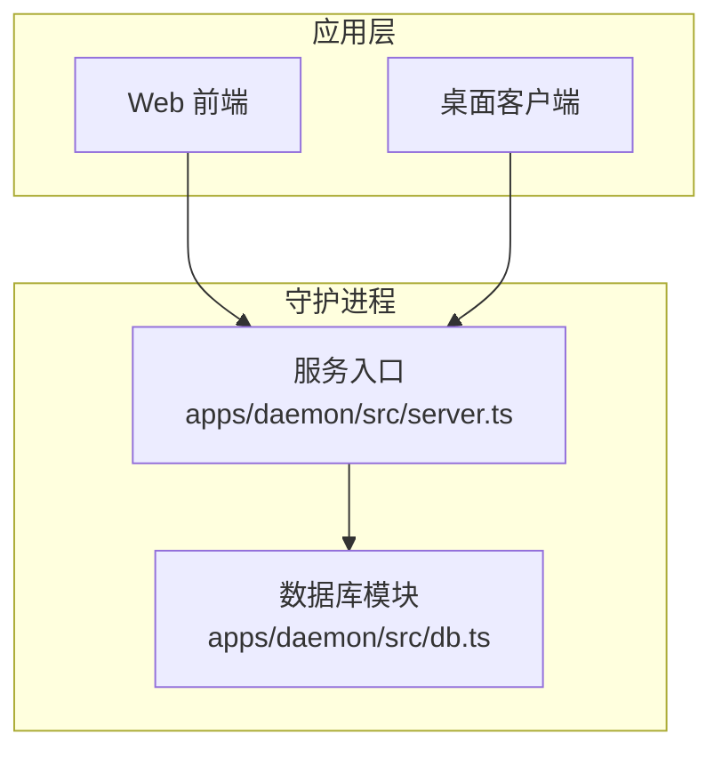
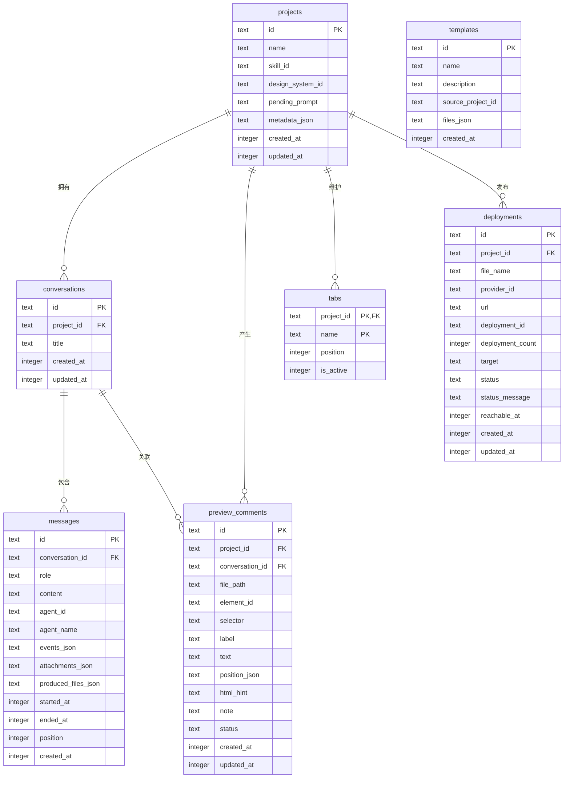
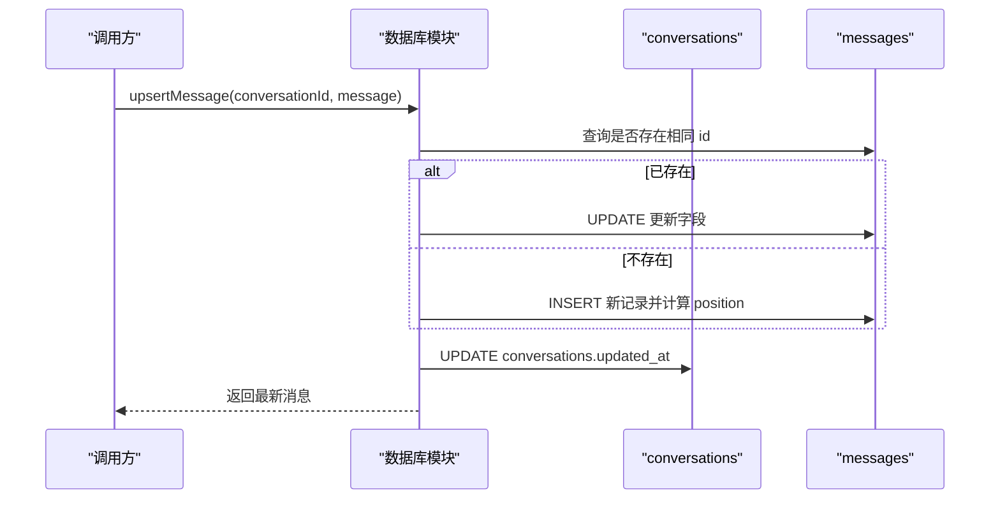
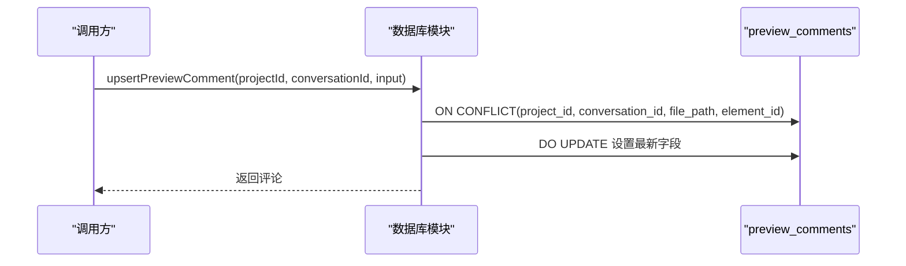
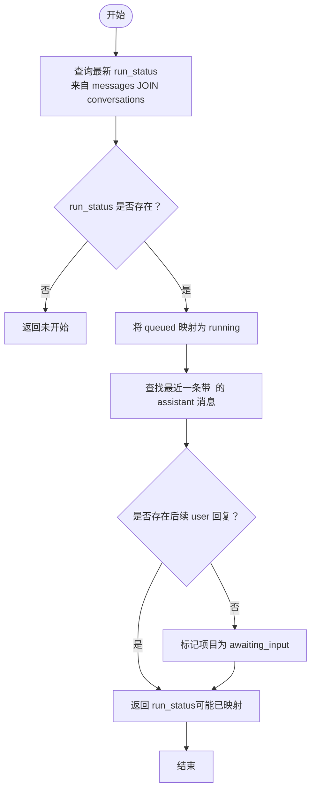
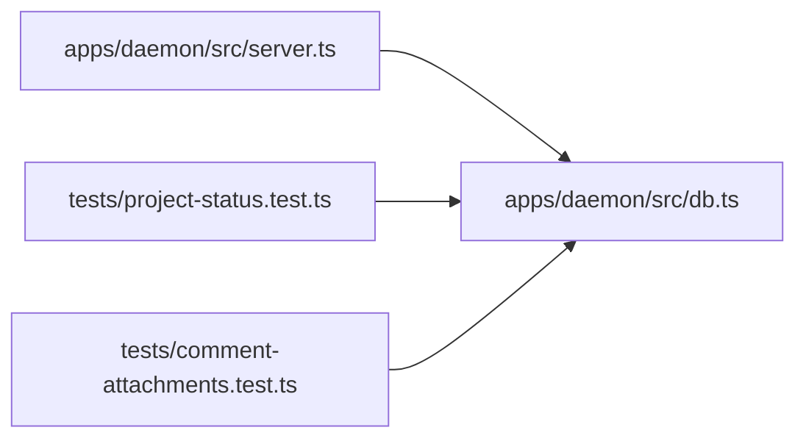

# 数据库设计

<cite>
**本文引用的文件**
- [apps/daemon/src/db.ts](file://apps/daemon/src/db.ts)
- [apps/daemon/src/server.ts](file://apps/daemon/src/server.ts)
- [apps/daemon/tests/project-status.test.ts](file://apps/daemon/tests/project-status.test.ts)
- [apps/daemon/tests/comment-attachments.test.ts](file://apps/daemon/tests/comment-attachments.test.ts)
</cite>

## 目录
1. [简介](#简介)
2. [项目结构](#项目结构)
3. [核心组件](#核心组件)
4. [架构总览](#架构总览)
5. [详细组件分析](#详细组件分析)
6. [依赖分析](#依赖分析)
7. [性能考虑](#性能考虑)
8. [故障排查指南](#故障排查指南)
9. [结论](#结论)
10. [附录](#附录)

## 简介
本文件面向 Open Design 的本地数据库层，系统性阐述基于 SQLite 的数据模型设计与实现细节。重点覆盖以下方面：
- 核心表结构：projects、conversations、messages、tabs、templates、deployments、preview_comments
- 表间关系、索引与约束
- 数据模型设计理念：项目状态持久化、对话历史记录、文件工作区、用户模板管理、预览评论与部署状态
- 迁移策略、备份与恢复建议、性能优化实践
- 典型数据访问模式与 SQL 示例路径，便于开发者理解与扩展

## 项目结构
数据库位于守护进程模块中，采用单文件集中式定义与迁移逻辑，通过统一入口函数打开/关闭连接，并在启动时执行迁移以确保表结构与列的演进兼容。

图示来源
- [apps/daemon/src/db.ts:16-29](file://apps/daemon/src/db.ts#L16-L29)
- [apps/daemon/src/server.ts:104-113](file://apps/daemon/src/server.ts#L104-L113)

章节来源
- [apps/daemon/src/db.ts:16-29](file://apps/daemon/src/db.ts#L16-L29)
- [apps/daemon/src/server.ts:104-113](file://apps/daemon/src/server.ts#L104-L113)

## 核心组件
- 数据库连接与生命周期
  - 打开数据库：确定数据目录，创建目录并初始化 WAL 模式与外键约束，执行迁移
  - 关闭数据库：释放连接资源
- 迁移与向前兼容
  - 针对旧版本数据库，按需添加新列（如 projects.metadata_json、messages.agent_*、comment_attachments_json、deployments.*）
- 数据访问层
  - 提供 CRUD 与查询聚合方法：项目、模板、会话、消息、预览评论、标签页、部署等

章节来源
- [apps/daemon/src/db.ts:16-29](file://apps/daemon/src/db.ts#L16-L29)
- [apps/daemon/src/db.ts:38-183](file://apps/daemon/src/db.ts#L38-L183)

## 架构总览
下图展示数据库层与服务层的交互关系，以及核心表之间的外键约束与典型查询路径。

图示来源
- [apps/daemon/src/db.ts:39-147](file://apps/daemon/src/db.ts#L39-L147)

## 详细组件分析

### 表：projects（项目）
- 设计要点
  - 主键：id
  - 字段：名称、技能标识、设计系统标识、待处理提示、元数据 JSON、时间戳
  - 外键：无（根实体）
- 使用场景
  - 项目列表、详情、更新、删除
  - 与会话、预览评论、标签页、部署形成强关联
- 典型 SQL 路径
  - 插入：[apps/daemon/src/db.ts:391-408](file://apps/daemon/src/db.ts#L391-L408)
  - 更新：[apps/daemon/src/db.ts:410-437](file://apps/daemon/src/db.ts#L410-L437)
  - 删除：[apps/daemon/src/db.ts:439-441](file://apps/daemon/src/db.ts#L439-L441)

章节来源
- [apps/daemon/src/db.ts:391-441](file://apps/daemon/src/db.ts#L391-L441)

### 表：conversations（会话）
- 设计要点
  - 主键：id
  - 外键：project_id → projects(id)，级联删除
  - 索引：(project_id, updated_at DESC)
- 使用场景
  - 列出项目下的会话并按最近活动排序
  - 会话标题更新、删除
- 典型 SQL 路径
  - 列表：[apps/daemon/src/db.ts:542-559](file://apps/daemon/src/db.ts#L542-L559)
  - 新增：[apps/daemon/src/db.ts:579-586](file://apps/daemon/src/db.ts#L579-L586)
  - 更新：[apps/daemon/src/db.ts:588-601](file://apps/daemon/src/db.ts#L588-L601)
  - 删除：[apps/daemon/src/db.ts:603-605](file://apps/daemon/src/db.ts#L603-L605)

章节来源
- [apps/daemon/src/db.ts:542-605](file://apps/daemon/src/db.ts#L542-L605)

### 表：messages（消息）
- 设计要点
  - 主键：id
  - 外键：conversation_id → conversations(id)，级联删除
  - 索引：(conversation_id, position)
  - JSON 字段：事件、附件、产物文件、评论附件
  - 时间字段：started_at、ended_at、created_at
- 使用场景
  - 按序列出会话消息、插入或更新消息、删除消息
  - 与项目运行状态、问题表单等待态相关联
- 典型 SQL 路径
  - 列表：[apps/daemon/src/db.ts:609-627](file://apps/daemon/src/db.ts#L609-L627)
  - Upsert：[apps/daemon/src/db.ts:629-716](file://apps/daemon/src/db.ts#L629-L716)
  - 删除：[apps/daemon/src/db.ts:718-720](file://apps/daemon/src/db.ts#L718-L720)

章节来源
- [apps/daemon/src/db.ts:609-720](file://apps/daemon/src/db.ts#L609-L720)

### 表：tabs（文件工作区）
- 设计要点
  - 复合主键：(project_id, name)
  - 外键：project_id → projects(id)，级联删除
  - 索引：(project_id, position)
  - 字段：position、is_active（默认 0）
- 使用场景
  - 维护项目内打开文件的顺序与当前激活项
- 典型 SQL 路径
  - 列表：[apps/daemon/src/db.ts:914-926](file://apps/daemon/src/db.ts#L914-L926)
  - 设置：[apps/daemon/src/db.ts:928-941](file://apps/daemon/src/db.ts#L928-L941)

章节来源
- [apps/daemon/src/db.ts:914-941](file://apps/daemon/src/db.ts#L914-L941)

### 表：templates（用户模板）
- 设计要点
  - 主键：id
  - 字段：name、description、source_project_id、files_json、created_at
- 使用场景
  - 模板列表、详情、新增、删除
- 典型 SQL 路径
  - 列表：[apps/daemon/src/db.ts:481-491](file://apps/daemon/src/db.ts#L481-L491)
  - 新增：[apps/daemon/src/db.ts:504-517](file://apps/daemon/src/db.ts#L504-L517)
  - 删除：[apps/daemon/src/db.ts:519-521](file://apps/daemon/src/db.ts#L519-L521)

章节来源
- [apps/daemon/src/db.ts:481-521](file://apps/daemon/src/db.ts#L481-L521)

### 表：preview_comments（预览评论）
- 设计要点
  - 主键：id
  - 复合唯一：(project_id, conversation_id, file_path, element_id)
  - 外键：project_id → projects(id)、conversation_id → conversations(id)，均级联删除
  - 索引：(project_id, conversation_id, updated_at DESC)
  - 字段：位置信息、HTML 提示、状态集合
- 使用场景
  - 评论的去重合并、状态变更、删除；按会话列出
- 典型 SQL 路径
  - 列表：[apps/daemon/src/db.ts:733-746](file://apps/daemon/src/db.ts#L733-L746)
  - Upsert：[apps/daemon/src/db.ts:748-799](file://apps/daemon/src/db.ts#L748-L799)
  - 状态更新：[apps/daemon/src/db.ts:802-811](file://apps/daemon/src/db.ts#L802-L811)
  - 删除：[apps/daemon/src/db.ts:813-821](file://apps/daemon/src/db.ts#L813-L821)

章节来源
- [apps/daemon/src/db.ts:733-821](file://apps/daemon/src/db.ts#L733-L821)

### 表：deployments（部署）
- 设计要点
  - 主键：id
  - 复合唯一：(project_id, file_name, provider_id)
  - 外键：project_id → projects(id)，级联删除
  - 索引：(project_id, updated_at DESC)
  - 字段：provider_id、url、deployment_id、deployment_count、target、status、status_message、reachable_at
- 使用场景
  - 列出项目部署、按文件名与提供商查询、Upsert 合并更新
- 典型 SQL 路径
  - 列表：[apps/daemon/src/db.ts:193-203](file://apps/daemon/src/db.ts#L193-L203)
  - 查询：[apps/daemon/src/db.ts:205-225](file://apps/daemon/src/db.ts#L205-L225)
  - Upsert：[apps/daemon/src/db.ts:227-284](file://apps/daemon/src/db.ts#L227-L284)

章节来源
- [apps/daemon/src/db.ts:193-284](file://apps/daemon/src/db.ts#L193-L284)

### 数据访问模式与序列流程

#### 会话消息流（插入/更新）

图示来源
- [apps/daemon/src/db.ts:629-716](file://apps/daemon/src/db.ts#L629-L716)

#### 预览评论去重合并

图示来源
- [apps/daemon/src/db.ts:748-799](file://apps/daemon/src/db.ts#L748-L799)

#### 项目运行状态投影（含“待回答”判定）

图示来源
- [apps/daemon/src/db.ts:324-348](file://apps/daemon/src/db.ts#L324-L348)
- [apps/daemon/tests/project-status.test.ts:63-121](file://apps/daemon/tests/project-status.test.ts#L63-L121)

## 依赖分析
- 服务层依赖数据库模块提供的统一接口，集中于路由与业务编排处
- 数据库模块内部通过 PRAGMA 与 DDL 确保一致性与向前兼容
- 测试用例覆盖关键数据访问路径与级联行为

图示来源
- [apps/daemon/src/server.ts:84-113](file://apps/daemon/src/server.ts#L84-L113)
- [apps/daemon/tests/project-status.test.ts:8-16](file://apps/daemon/tests/project-status.test.ts#L8-L16)
- [apps/daemon/tests/comment-attachments.test.ts:5-18](file://apps/daemon/tests/comment-attachments.test.ts#L5-L18)

章节来源
- [apps/daemon/src/server.ts:84-113](file://apps/daemon/src/server.ts#L84-L113)
- [apps/daemon/tests/project-status.test.ts:8-16](file://apps/daemon/tests/project-status.test.ts#L8-L16)
- [apps/daemon/tests/comment-attachments.test.ts:5-18](file://apps/daemon/tests/comment-attachments.test.ts#L5-L18)

## 性能考虑
- 存储引擎与事务
  - WAL 模式提升并发读写性能，适合本地开发环境
  - 事务封装（如标签页批量写入）减少往返与锁竞争
- 索引策略
  - conversations(project_id, updated_at DESC)：按项目检索会话并按最近活动排序
  - messages(conversation_id, position)：保证消息有序读取
  - preview_comments(project_id, conversation_id, updated_at DESC)：按会话快速列出并按时间倒序
  - tabs(project_id, position)：按顺序遍历打开文件
  - deployments(project_id, updated_at DESC)：按项目列出部署并按最近更新排序
- JSON 字段与查询
  - JSON 字段用于存储复杂对象，查询时注意避免全表扫描；可结合必要字段建立二级索引或视图（视需求评估）
- 写入模式
  - Upsert 使用冲突键（如 deployments 的三元唯一键、preview_comments 的四元唯一键）减少重复写入
  - 消息 position 自动递增，避免随机写导致的页分裂

章节来源
- [apps/daemon/src/db.ts:23-24](file://apps/daemon/src/db.ts#L23-L24)
- [apps/daemon/src/db.ts:69-70](file://apps/daemon/src/db.ts#L69-L70)
- [apps/daemon/src/db.ts:89-90](file://apps/daemon/src/db.ts#L89-L90)
- [apps/daemon/src/db.ts:112-113](file://apps/daemon/src/db.ts#L112-L113)
- [apps/daemon/src/db.ts:124-125](file://apps/daemon/src/db.ts#L124-L125)
- [apps/daemon/src/db.ts:145-146](file://apps/daemon/src/db.ts#L145-L146)
- [apps/daemon/src/db.ts:227-284](file://apps/daemon/src/db.ts#L227-L284)
- [apps/daemon/src/db.ts:748-799](file://apps/daemon/src/db.ts#L748-L799)

## 故障排查指南
- 连接与迁移
  - 若出现表缺失或列缺失，确认是否执行了迁移逻辑；检查 PRAGMA 查询与列存在性判断
  - 若数据库文件损坏，优先尝试备份恢复
- 级联删除验证
  - 删除项目后，会话、预览评论应随之清理；删除会话后，预览评论应随之清理
- 数据一致性
  - 预览评论按 (project_id, conversation_id, file_path, element_id) 去重；若出现重复，请检查输入参数与冲突键
  - 部署 Upsert 依赖 (project_id, file_name, provider_id) 唯一键；若更新异常，请核对三元组唯一性
- 运行状态与“待回答”
  - 若项目状态与预期不符，检查 messages 中 run_status 的最新值与映射规则；确认是否存在未回复的问题表单

章节来源
- [apps/daemon/src/db.ts:149-183](file://apps/daemon/src/db.ts#L149-L183)
- [apps/daemon/tests/comment-attachments.test.ts:68-90](file://apps/daemon/tests/comment-attachments.test.ts#L68-L90)
- [apps/daemon/tests/project-status.test.ts:63-121](file://apps/daemon/tests/project-status.test.ts#L63-L121)

## 结论
该数据库设计围绕“项目—会话—消息”的核心链路，辅以工作区标签页、模板与预览评论，满足本地开发与协作场景的数据持久化需求。通过外键级联与唯一约束保障数据完整性，借助索引与 Upsert 优化常见查询与写入路径。迁移机制确保历史数据平滑演进，配合测试用例验证关键行为。建议在生产环境中引入显式迁移表与备份-before-migrate 策略，进一步增强可运维性与安全性。

## 附录

### 迁移策略与版本演进
- 启动迁移
  - 在打开数据库时执行 DDL 与 PRAGMA 检查，按需添加缺失列
- 列演进
  - projects.metadata_json
  - messages.agent_id、agent_name、run_id、run_status、last_run_event_id、comment_attachments_json
  - deployments.status、status_message、reachable_at
- 建议
  - 引入显式迁移表与版本号字段，记录已执行迁移；在升级前进行备份

章节来源
- [apps/daemon/src/db.ts:38-183](file://apps/daemon/src/db.ts#L38-L183)

### 备份与恢复方案
- 备份
  - 复制 app.sqlite 文件到安全位置；建议在升级或重大变更前执行
- 恢复
  - 停止服务，替换损坏的 app.sqlite，重启服务
- 注意
  - 确保数据目录权限正确；WAL 模式下可直接复制数据库文件

章节来源
- [apps/daemon/src/db.ts:16-29](file://apps/daemon/src/db.ts#L16-L29)

### 典型 SQL 示例路径（仅路径，不含具体代码）
- 创建数据库与迁移
  - [apps/daemon/src/db.ts:38-147](file://apps/daemon/src/db.ts#L38-L147)
- 项目操作
  - 插入：[apps/daemon/src/db.ts:391-408](file://apps/daemon/src/db.ts#L391-L408)
  - 更新：[apps/daemon/src/db.ts:410-437](file://apps/daemon/src/db.ts#L410-L437)
  - 删除：[apps/daemon/src/db.ts:439-441](file://apps/daemon/src/db.ts#L439-L441)
- 会话操作
  - 列表：[apps/daemon/src/db.ts:542-559](file://apps/daemon/src/db.ts#L542-L559)
  - 新增：[apps/daemon/src/db.ts:579-586](file://apps/daemon/src/db.ts#L579-L586)
  - 更新：[apps/daemon/src/db.ts:588-601](file://apps/daemon/src/db.ts#L588-L601)
  - 删除：[apps/daemon/src/db.ts:603-605](file://apps/daemon/src/db.ts#L603-L605)
- 消息操作
  - 列表：[apps/daemon/src/db.ts:609-627](file://apps/daemon/src/db.ts#L609-L627)
  - Upsert：[apps/daemon/src/db.ts:629-716](file://apps/daemon/src/db.ts#L629-L716)
  - 删除：[apps/daemon/src/db.ts:718-720](file://apps/daemon/src/db.ts#L718-L720)
- 预览评论操作
  - 列表：[apps/daemon/src/db.ts:733-746](file://apps/daemon/src/db.ts#L733-L746)
  - Upsert：[apps/daemon/src/db.ts:748-799](file://apps/daemon/src/db.ts#L748-L799)
  - 状态更新：[apps/daemon/src/db.ts:802-811](file://apps/daemon/src/db.ts#L802-L811)
  - 删除：[apps/daemon/src/db.ts:813-821](file://apps/daemon/src/db.ts#L813-L821)
- 标签页操作
  - 列表：[apps/daemon/src/db.ts:914-926](file://apps/daemon/src/db.ts#L914-L926)
  - 设置：[apps/daemon/src/db.ts:928-941](file://apps/daemon/src/db.ts#L928-L941)
- 模板操作
  - 列表：[apps/daemon/src/db.ts:481-491](file://apps/daemon/src/db.ts#L481-L491)
  - 新增：[apps/daemon/src/db.ts:504-517](file://apps/daemon/src/db.ts#L504-L517)
  - 删除：[apps/daemon/src/db.ts:519-521](file://apps/daemon/src/db.ts#L519-L521)
- 部署操作
  - 列表：[apps/daemon/src/db.ts:193-203](file://apps/daemon/src/db.ts#L193-L203)
  - 查询：[apps/daemon/src/db.ts:205-225](file://apps/daemon/src/db.ts#L205-L225)
  - Upsert：[apps/daemon/src/db.ts:227-284](file://apps/daemon/src/db.ts#L227-L284)