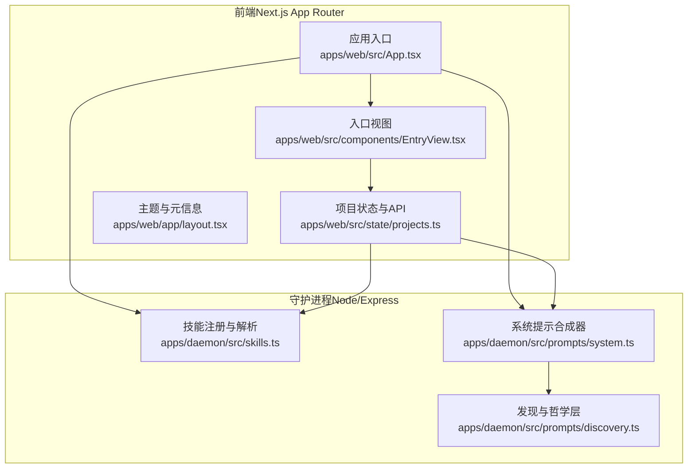
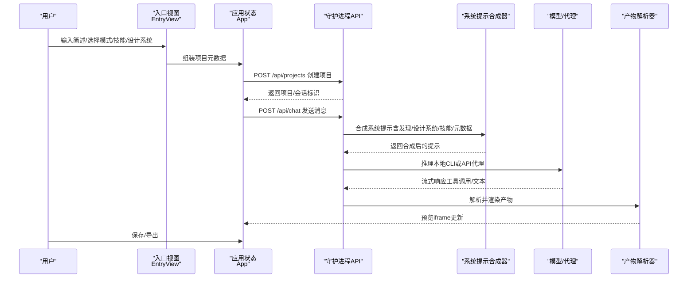
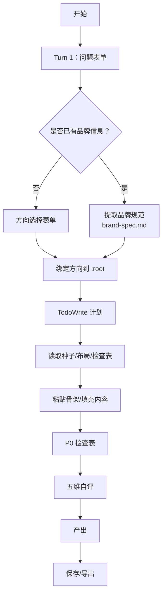
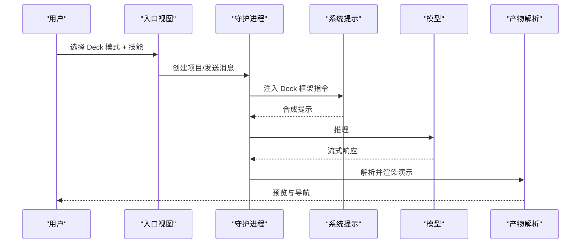
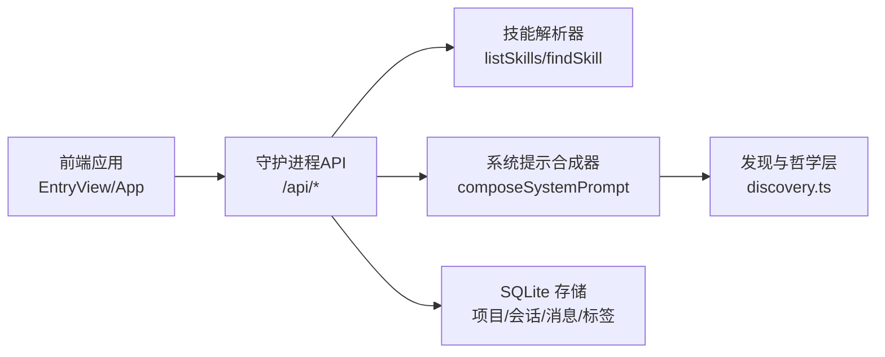
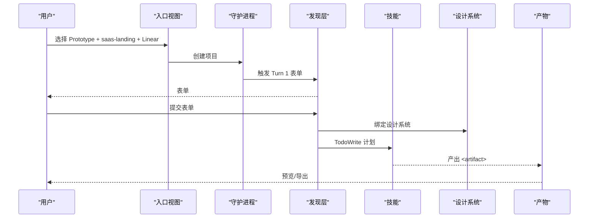

# 使用指南

<cite>
**本文引用的文件**
- [README.md](file://README.md)
- [QUICKSTART.md](file://QUICKSTART.md)
- [docs/modes.md](file://docs/modes.md)
- [apps/web/src/App.tsx](file://apps/web/src/App.tsx)
- [apps/web/app/layout.tsx](file://apps/web/app/layout.tsx)
- [apps/web/src/components/EntryView.tsx](file://apps/web/src/components/EntryView.tsx)
- [apps/web/src/state/projects.ts](file://apps/web/src/state/projects.ts)
- [apps/daemon/src/skills.ts](file://apps/daemon/src/skills.ts)
- [apps/daemon/src/prompts/system.ts](file://apps/daemon/src/prompts/system.ts)
- [apps/daemon/src/prompts/discovery.ts](file://apps/daemon/src/prompts/discovery.ts)
</cite>

## 目录
1. [简介](#简介)
2. [项目结构](#项目结构)
3. [核心组件](#核心组件)
4. [架构总览](#架构总览)
5. [详细组件分析](#详细组件分析)
6. [依赖关系分析](#依赖关系分析)
7. [性能与可用性建议](#性能与可用性建议)
8. [故障排查指南](#故障排查指南)
9. [结论](#结论)
10. [附录：模式使用与工作流](#附录模式使用与工作流)

## 简介
本指南面向首次使用 Open Design 的设计师与创作者，帮助你高效掌握四种模式（Prototype、Deck、Template、Design System）的使用方法，涵盖模式选择策略、工作流程优化、最佳实践、界面操作与快捷键、提示词优化与迭代技巧，并提供从“问题表单”到“最终产品”的完整设计流程范例。

## 项目结构
Open Design 采用“前端 Web 应用 + 本地守护进程（Daemon）”的双层架构：前端负责交互与预览；守护进程负责代理模型调用、项目持久化、技能与设计系统的加载、媒体生成调度等。四大模式通过统一的入口与系统提示栈组合，形成一致的创作体验。

图表来源
- [apps/web/src/App.tsx:1-582](file://apps/web/src/App.tsx#L1-L582)
- [apps/web/src/components/EntryView.tsx:1-559](file://apps/web/src/components/EntryView.tsx#L1-L559)
- [apps/web/src/state/projects.ts:1-305](file://apps/web/src/state/projects.ts#L1-L305)
- [apps/daemon/src/skills.ts:1-304](file://apps/daemon/src/skills.ts#L1-L304)
- [apps/daemon/src/prompts/system.ts:1-400](file://apps/daemon/src/prompts/system.ts#L1-L400)
- [apps/daemon/src/prompts/discovery.ts:1-264](file://apps/daemon/src/prompts/discovery.ts#L1-L264)

章节来源
- [README.md:257-300](file://README.md#L257-L300)
- [QUICKSTART.md:133-141](file://QUICKSTART.md#L133-L141)

## 核心组件
- 模式与工作流
  - 四大模式：Prototype（单屏原型）、Deck（多页演示）、Template（模板复用）、Design System（设计系统生成）。模式决定技能类型、输出形态与导出方式。
- 提示栈与系统提示
  - 系统提示由“发现与规划 + 身份与工作流 + 设计系统 + 技能 + 元数据 + 框架指令 + 媒体生成契约”组成，确保从“问题表单”到“可检查的产物”闭环。
- 项目与会话
  - 项目、对话、消息、标签页持久化在守护进程的 SQLite 中，支持跨浏览器标签与重启恢复。
- 技能与设计系统
  - 技能以 SKILL.md 为协议，支持默认技能、平台、场景、预览类型、前置资产读取等；设计系统以 DESIGN.md 为规范，内置 72+ 系统。

章节来源
- [docs/modes.md:1-274](file://docs/modes.md#L1-L274)
- [apps/daemon/src/prompts/system.ts:111-193](file://apps/daemon/src/prompts/system.ts#L111-L193)
- [apps/daemon/src/prompts/discovery.ts:26-264](file://apps/daemon/src/prompts/discovery.ts#L26-L264)
- [apps/web/src/state/projects.ts:18-305](file://apps/web/src/state/projects.ts#L18-L305)
- [apps/daemon/src/skills.ts:41-98](file://apps/daemon/src/skills.ts#L41-L98)

## 架构总览
下图展示了从用户输入到产物渲染的关键路径：入口视图收集模式/技能/设计系统/元数据，守护进程合成系统提示并驱动模型，模型产出带标记的产物，前端解析并沙箱预览，最终可保存或导出。

图表来源
- [apps/web/src/components/EntryView.tsx:176-178](file://apps/web/src/components/EntryView.tsx#L176-L178)
- [apps/web/src/state/projects.ts:40-59](file://apps/web/src/state/projects.ts#L40-L59)
- [apps/daemon/src/prompts/system.ts:111-193](file://apps/daemon/src/prompts/system.ts#L111-L193)
- [apps/daemon/src/prompts/discovery.ts:34-80](file://apps/daemon/src/prompts/discovery.ts#L34-L80)

## 详细组件分析

### 模式与工作流（Prototype）
- 目标：单屏高保真原型，快速可见化。
- 工作流要点
  - 发现表单（Turn 1）锁定输出类型、平台、受众、视觉基调、品牌上下文、规模与约束。
  - 视觉方向分支（Turn 2）：若无品牌，弹出方向卡；若有品牌，先提取品牌规范再进入计划。
  - TodoWrite 计划（Turn 3）：按清单执行，实时进度卡片，完成后进行 P0 自检与五维自评，最后一次性产出 <artifact>。
- 输出形态：HTML 主文件 + assets/ 资源 + artifact.json 元数据；支持导出 HTML/PDF/ZIP。
- 迭代手段：聊天微调、评论模式（如适配能力）、参数滑条（技能声明的 od.parameters）。

图表来源
- [apps/daemon/src/prompts/discovery.ts:34-167](file://apps/daemon/src/prompts/discovery.ts#L34-L167)
- [apps/daemon/src/prompts/system.ts:148-153](file://apps/daemon/src/prompts/system.ts#L148-L153)

章节来源
- [docs/modes.md:18-71](file://docs/modes.md#L18-L71)
- [apps/daemon/src/prompts/discovery.ts:34-167](file://apps/daemon/src/prompts/discovery.ts#L34-L167)
- [apps/daemon/src/prompts/system.ts:148-153](file://apps/daemon/src/prompts/system.ts#L148-L153)

### 模式与工作流（Deck）
- 目标：多页演示（杂志风/极简/暗色/实验风等），强调框架与导航一致性。
- 工作流要点
  - 技能筛选仅显示 deck 类型；预览为全页演示，自带键盘/滚轮/触控导航。
  - 若无技能绑定，仍注入通用框架指令，保证 PDF 打印与导航稳定。
  - 可在生成后对主题参数进行调整（如色相）。
- 输出形态：单文件 HTML + slides.json（可选）+ assets/；导出支持 HTML/PDF/PPTX/ZIP/Markdown。

图表来源
- [apps/daemon/src/prompts/system.ts:174-179](file://apps/daemon/src/prompts/system.ts#L174-L179)
- [apps/web/src/components/EntryView.tsx:176-178](file://apps/web/src/components/EntryView.tsx#L176-L178)

章节来源
- [docs/modes.md:73-112](file://docs/modes.md#L73-L112)
- [apps/daemon/src/prompts/system.ts:174-179](file://apps/daemon/src/prompts/system.ts#L174-L179)

### 模式与工作流（Template）
- 目标：跳过生成，直接基于精选模板个性化内容，最快路径。
- 工作流要点
  - 从模板库中挑选模板，填写内容槽位；可选“按 DESIGN.md 重新着色”。
  - 模板即高质量起始产物，速度更快但天花板较低。
- 输出形态：与 Prototype 相同，但由模板驱动。

章节来源
- [docs/modes.md:114-168](file://docs/modes.md#L114-L168)

### 模式与工作流（Design System）
- 目标：生成 DESIGN.md 并预览样例组件，作为其他模式的输入。
- 工作流要点
  - 支持截图/PDF/URL/自由描述四种输入源；生成 DESIGN.md + preview.html + tokens.json（可选）。
  - 可在编辑器内微调 DESIGN.md，然后设为当前激活的设计系统。
- 输出形态：DESIGN.md + 预览页 + 可选 tokens.json。

章节来源
- [docs/modes.md:170-227](file://docs/modes.md#L170-L227)

### 界面与操作指南
- 顶部模式切换：Prototype/Deck/Template/Design System，模式不同技能与输出形态随之变化。
- 技能选择：按场景分组（设计/营销/工程/产品/财务/HR/销售/个人），默认技能标注。
- 设计系统选择：内置 72+ 系统，也可通过 Design System 模式生成自定义系统。
- 项目管理：项目列表、导入 Claude Design ZIP、新建/删除/打开项目、标签页持久化。
- 快捷键
  - 生成：⌘/Ctrl+Enter
  - 取消运行：Esc
  - 切换评论模式：⌘/Ctrl+;
  - 切换预览设备：⌘/Ctrl+\（Prototype）
  - 导出：⌘/Ctrl+E

章节来源
- [apps/web/src/App.tsx:50-582](file://apps/web/src/App.tsx#L50-L582)
- [apps/web/src/components/EntryView.tsx:411-452](file://apps/web/src/components/EntryView.tsx#L411-L452)
- [apps/web/app/layout.tsx:1-43](file://apps/web/app/layout.tsx#L1-L43)
- [docs/modes.md:253-263](file://docs/modes.md#L253-L263)

### 提示词优化与迭代
- 发现表单优先：Turn 1 必须先发问题表单，锁定输出类型、平台、受众、视觉基调、品牌上下文、规模与约束。
- 品牌规范先行：若用户提供品牌资料，先执行品牌规范提取（定位/下载/提取/编码/口述），再进入计划。
- 五维自评：每次产出前进行五维度评分（哲学/层级/执行/具体性/克制），任何一项低于 3 分需修正后再发。
- 检查表：严格遵循技能自带的 P0/P1/P2 清单，P0 必须全部通过。
- 多版本探索：默认提供 2–3 种差异化方向，便于早期决策。

章节来源
- [apps/daemon/src/prompts/discovery.ts:34-167](file://apps/daemon/src/prompts/discovery.ts#L34-L167)

### 媒体生成（图像/视频/音频）
- 图像：gpt-image-2（Azure/OpenAI），适合海报、头像、插画地图、信息图等。
- 视频：Seedance 2.0（ByteDance）用于 15s 电影级文本转视频/图像转视频；HyperFrames（HTML→MP4）用于运动图形。
- 音频：Suno/Udio/Lyria（音乐）与 gpt-4o-mini-tts/MiniMax TTS（语音）。
- 使用方式：在系统提示中明确媒体表面与元数据，通过媒体生成契约触发本地 CLI 调度。

章节来源
- [README.md:490-562](file://README.md#L490-L562)
- [apps/daemon/src/prompts/system.ts:181-190](file://apps/daemon/src/prompts/system.ts#L181-L190)

## 依赖关系分析
- 前端依赖守护进程提供的 pickers（技能/设计系统/模板/提示模板）与项目 API。
- 守护进程依赖技能解析器（SKILL.md）与系统提示合成器（含发现层、设计系统、技能、元数据、框架指令、媒体契约）。
- 项目持久化与会话状态由守护进程 SQLite 存储，前端通过 HTTP 轮询/变更。

图表来源
- [apps/web/src/components/EntryView.tsx:1-559](file://apps/web/src/components/EntryView.tsx#L1-L559)
- [apps/web/src/App.tsx:1-582](file://apps/web/src/App.tsx#L1-L582)
- [apps/daemon/src/skills.ts:41-98](file://apps/daemon/src/skills.ts#L41-L98)
- [apps/daemon/src/prompts/system.ts:111-193](file://apps/daemon/src/prompts/system.ts#L111-L193)
- [apps/web/src/state/projects.ts:18-305](file://apps/web/src/state/projects.ts#L18-L305)

章节来源
- [apps/daemon/src/skills.ts:1-304](file://apps/daemon/src/skills.ts#L1-L304)
- [apps/daemon/src/prompts/system.ts:1-400](file://apps/daemon/src/prompts/system.ts#L1-L400)
- [apps/web/src/state/projects.ts:1-305](file://apps/web/src/state/projects.ts#L1-L305)

## 性能与可用性建议
- 优先使用本地 CLI 模式，减少网络延迟；若无 CLI，可在设置中切换 API 模式并配置密钥。
- 在大型项目中启用“实时 Todo 进度”与“评论模式”，可显著降低往返成本。
- 对于 Deck 项目，避免过多幻灯片导致上下文溢出；必要时拆分为多个项目。
- 使用“从模板”快速起步，减少生成时间；需要深度定制时再转入 Prototype 模式。

## 故障排查指南
- “未检测到可用代理”：安装任一支持的 CLI（如 claude/codex/devin/gemini/opencode/cursor-agent/qwen/copilot），或在设置中切换 API 模式并填入密钥。
- “媒体生成提示缺失”：确认已重建守护进程 CLI 并重启运行时；重新打开项目以注入 OD_BIN/OD_DAEMON_URL 等环境变量。
- “产物不渲染”：检查系统提示是否正确下发，必要时更换更强模型或更严格的技能。
- “Codex 插件上下文过大”：启动时添加 OD_CODEX_DISABLE_PLUGINS=1 以禁用插件。

章节来源
- [QUICKSTART.md:215-222](file://QUICKSTART.md#L215-L222)

## 结论
Open Design 通过“问题表单 + 设计系统 + 技能 + 检查表 + 五维自评”的闭环，将“AI 自由发挥”转变为“可预期、可检查、可迭代”的设计流程。四种模式覆盖从单屏原型到多页演示、从模板复用到设计系统生成的全场景需求。建议新用户先从 Prototype/Deck 的默认技能入手，逐步掌握提示词与迭代节奏，再深入 Template 与 Design System 模式以沉淀资产与风格。

## 附录：模式使用与工作流

### 从问题表单到最终产品的完整流程（范例）
- 场景：为一款 SaaS 产品制作种子轮融资的杂志风路演页。
- 步骤
  1) 选择模式：Prototype（单屏落地页）
  2) 选择技能：saas-landing（默认）
  3) 选择设计系统：Linear 或 Vercel（现代极简）
  4) 发送简述 → 触发 Turn 1 问题表单 → 填写输出类型/平台/受众/视觉基调/品牌/规模/约束
  5) 若无品牌 → 弹出方向卡 → 选择“现代极简”
  6) TodoWrite 计划 → 读取种子/布局/检查表 → 粘贴骨架/填充内容 → P0 检查表 → 五维自评
  7) 产出 <artifact> → 预览 → 保存/导出 HTML/PDF/ZIP

图表来源
- [apps/daemon/src/prompts/discovery.ts:34-167](file://apps/daemon/src/prompts/discovery.ts#L34-L167)
- [apps/daemon/src/prompts/system.ts:148-153](file://apps/daemon/src/prompts/system.ts#L148-L153)

### 模式选择策略
- Prototype：需要快速验证单屏视觉与信息架构，适合探索期与早期反馈。
- Deck：需要对外展示的多页演示，强调框架一致性与可打印性。
- Template：已有成熟风格与文案，只需个性化内容，追求效率。
- Design System：需要建立统一的视觉语言与规范，作为后续所有产出的基础。

章节来源
- [docs/modes.md:1-274](file://docs/modes.md#L1-L274)