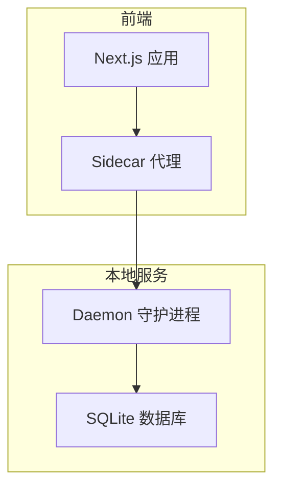
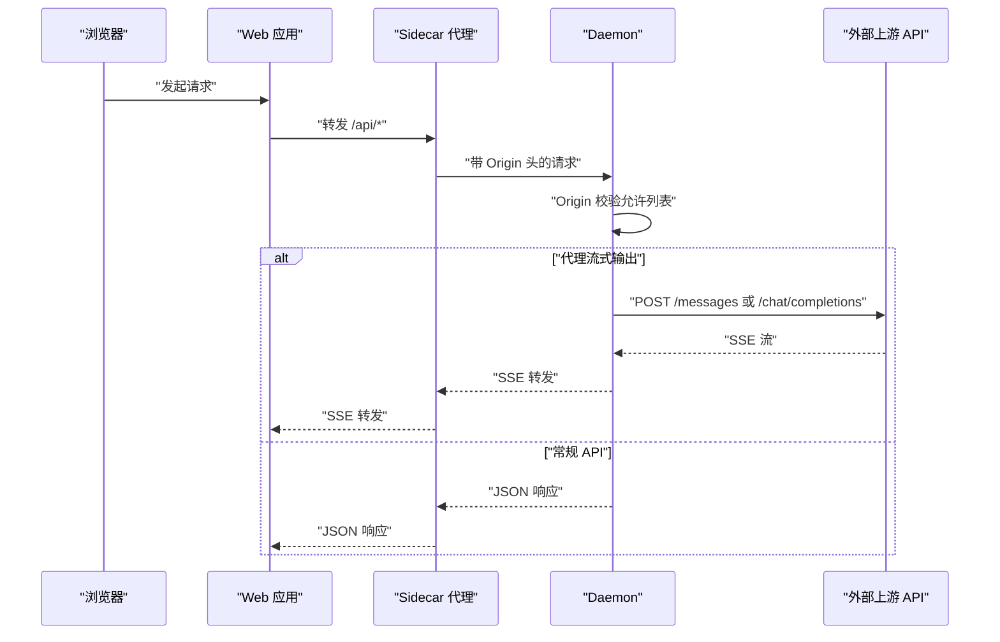
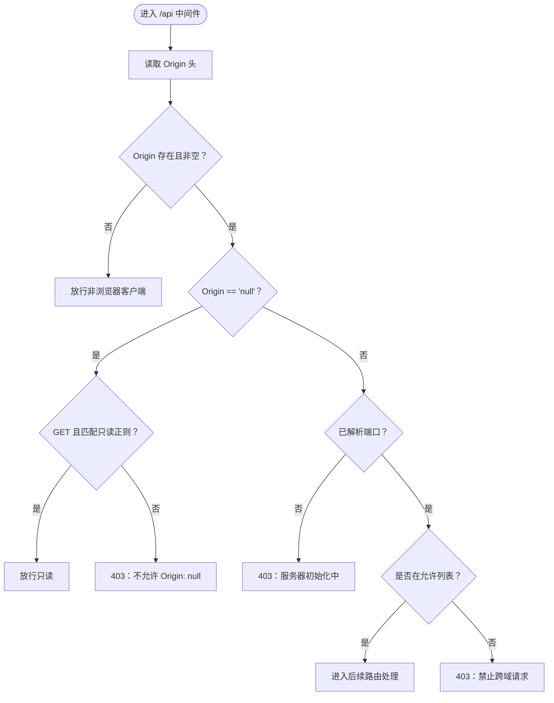
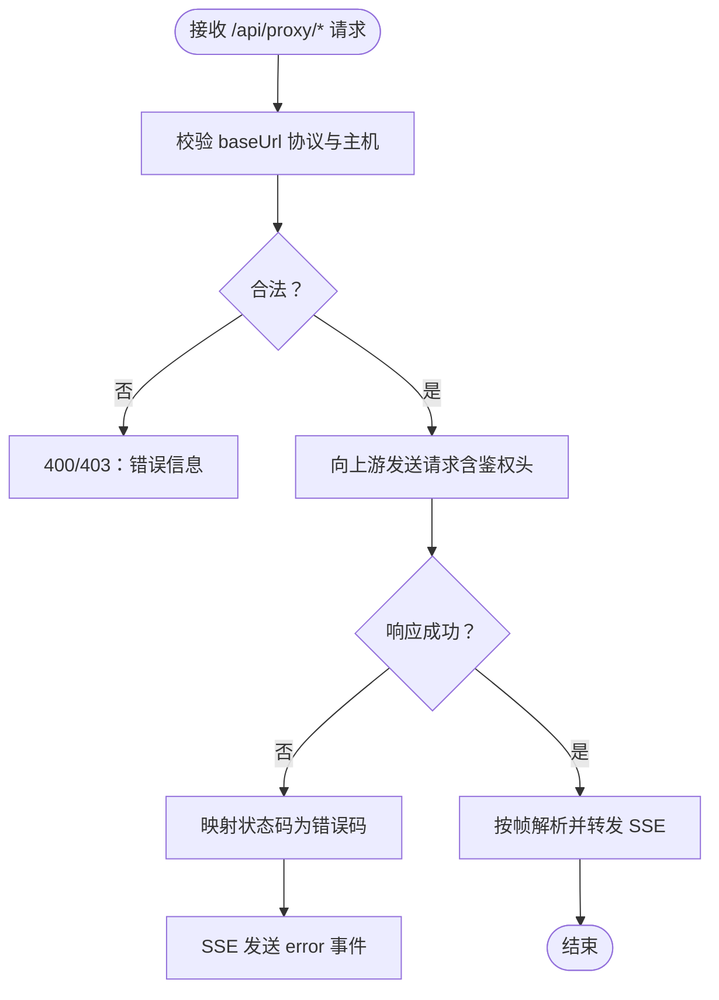
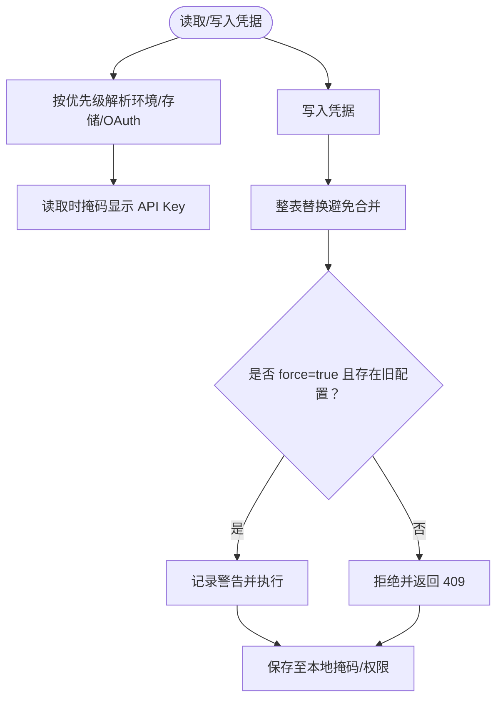
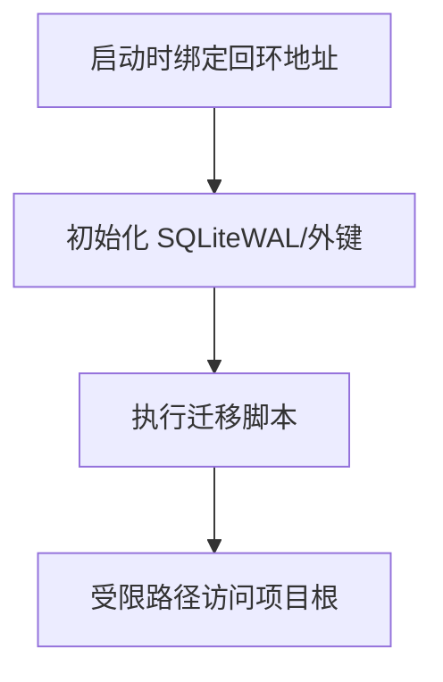
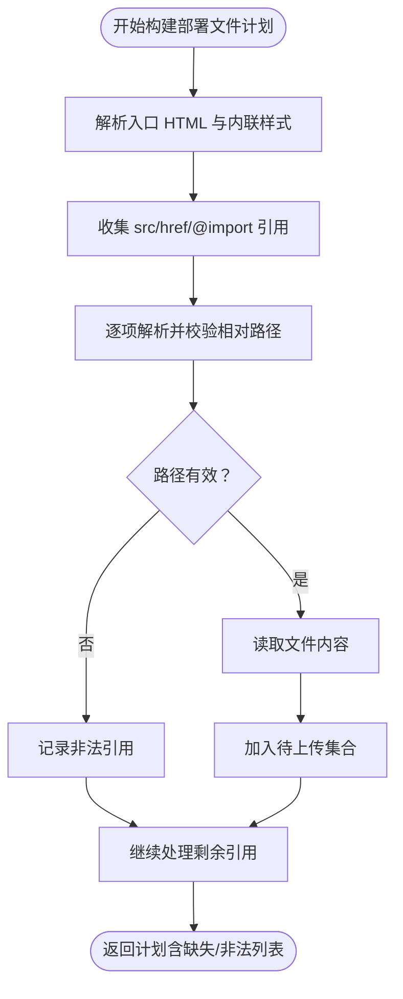
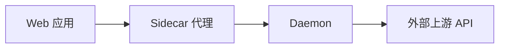

# 安全考虑

<cite>
**本文引用的文件**
- [apps/daemon/src/server.ts](file://apps/daemon/src/server.ts)
- [apps/daemon/tests/origin-validation.test.ts](file://apps/daemon/tests/origin-validation.test.ts)
- [apps/daemon/tests/app-config.test.ts](file://apps/daemon/tests/app-config.test.ts)
- [apps/daemon/src/media-config.ts](file://apps/daemon/src/media-config.ts)
- [apps/daemon/src/deploy.ts](file://apps/daemon/src/deploy.ts)
- [apps/daemon/src/db.ts](file://apps/daemon/src/db.ts)
- [apps/web/sidecar/server.ts](file://apps/web/sidecar/server.ts)
- [specs/current/architecture-boundaries.md](file://specs/current/architecture-boundaries.md)
- [specs/current/runtime-adapter.md](file://specs/current/runtime-adapter.md)
- [specs/current/maintainability-roadmap.md](file://specs/current/maintainability-roadmap.md)
- [apps/daemon/src/document-preview.ts](file://apps/daemon/src/document-preview.ts)
</cite>

## 目录
1. [简介](#简介)
2. [项目结构](#项目结构)
3. [核心组件](#核心组件)
4. [架构总览](#架构总览)
5. [详细组件分析](#详细组件分析)
6. [依赖关系分析](#依赖关系分析)
7. [性能与安全权衡](#性能与安全权衡)
8. [故障排查指南](#故障排查指南)
9. [结论](#结论)
10. [附录：安全配置模板与实践](#附录安全配置模板与实践)

## 简介
本指南面向 Open Design 的开发者与运维人员，聚焦于本地数据保护、代理 API 安全与系统访问控制三方面，结合代码库中的现有实现，给出可操作的安全建议、配置模板与事件响应流程。内容覆盖：
- 如何保护用户设计数据（本地存储、路径校验、最小权限）
- 如何安全地配置与使用代理密钥（环境变量优先、本地缓存掩码、写入权限）
- 如何防止跨站请求伪造与恶意输入攻击（Origin 校验、内部 IP 屏蔽、XML 实体限制）
- 数据加密策略、API 访问控制、CORS 配置与安全审计建议

## 项目结构
Open Design 采用“本地优先”的架构：Web 前端通过侧车代理访问本地守护进程（daemon），daemon 负责本地文件系统、数据库与外部代理调用。关键边界如下：
- Web 层：Next.js 应用，负责 UI 与路由；通过 sidecar 代理转发到 daemon。
- Sidecar：在 Web 与 daemon 之间做请求转发与 Origin 处理。
- Daemon：本地服务，绑定回环地址，提供 API、代理流式输出、SQLite 数据库、部署能力等。

图示来源
- [apps/web/sidecar/server.ts:144-180](file://apps/web/sidecar/server.ts#L144-L180)
- [apps/daemon/src/server.ts:780-827](file://apps/daemon/src/server.ts#L780-L827)
- [apps/daemon/src/db.ts:16-29](file://apps/daemon/src/db.ts#L16-L29)

章节来源
- [specs/current/architecture-boundaries.md:56-84](file://specs/current/architecture-boundaries.md#L56-L84)

## 核心组件
- Origin 校验中间件：统一校验浏览器 Origin，支持 loopback、显式绑定主机、OD_WEB_PORT 代理端口，Fail-closed 策略。
- 外部代理安全：对上游 BaseURL 进行协议与内网 IP 检查，屏蔽内部网络地址；对鉴权头进行脱敏日志。
- 本地凭据管理：优先使用环境变量，其次本地存储，再次 OAuth 推断；写入时强制掩码与权限控制。
- 文件与路径安全：严格校验项目路径，避免越权访问；部署前构建文件清单并校验缺失与非法引用。
- 文档预览安全：XML 解析前检查实体声明，拒绝不受支持的实体类型。

章节来源
- [apps/daemon/src/server.ts:786-827](file://apps/daemon/src/server.ts#L786-L827)
- [apps/daemon/src/server.ts:3930-3953](file://apps/daemon/src/server.ts#L3930-L3953)
- [apps/daemon/src/media-config.ts:220-232](file://apps/daemon/src/media-config.ts#L220-L232)
- [apps/daemon/src/media-config.ts:275-317](file://apps/daemon/src/media-config.ts#L275-L317)
- [apps/daemon/src/deploy.ts:45-77](file://apps/daemon/src/deploy.ts#L45-L77)
- [apps/daemon/src/deploy.ts:84-186](file://apps/daemon/src/deploy.ts#L84-L186)
- [apps/daemon/src/document-preview.ts:260-266](file://apps/daemon/src/document-preview.ts#L260-L266)

## 架构总览
下图展示浏览器、Web 侧车与 Daemon 的交互，以及代理流式输出与上游 API 的关系。重点在于 Origin 校验与上游 BaseURL 校验两条安全链路。

图示来源
- [apps/web/sidecar/server.ts:144-180](file://apps/web/sidecar/server.ts#L144-L180)
- [apps/daemon/src/server.ts:786-827](file://apps/daemon/src/server.ts#L786-L827)
- [apps/daemon/src/server.ts:4082-4174](file://apps/daemon/src/server.ts#L4082-L4174)

## 详细组件分析

### 组件一：Origin 校验与 CORS 控制
- 功能要点
  - 对 /api 路由统一校验 Origin，非浏览器客户端（无 Origin）放行。
  - Origin: null（沙箱 iframe）仅允许特定只读路由。
  - Fail-closed：端口未解析前拒绝请求。
  - 允许列表包括 loopback、显式绑定主机、OD_WEB_PORT 代理端口。
- 防护效果
  - 阻止 CSRF 攻击与跨站请求。
  - 限定来自受信 Web 代理端口的请求。
- 测试覆盖
  - 跨域 POST 拦截、OD_WEB_PORT 代理放行、错误 Host 头拒绝等。

图示来源
- [apps/daemon/src/server.ts:786-827](file://apps/daemon/src/server.ts#L786-L827)
- [apps/daemon/tests/origin-validation.test.ts:113-138](file://apps/daemon/tests/origin-validation.test.ts#L113-L138)

章节来源
- [apps/daemon/src/server.ts:786-827](file://apps/daemon/src/server.ts#L786-L827)
- [apps/daemon/tests/origin-validation.test.ts:300-336](file://apps/daemon/tests/origin-validation.test.ts#L300-L336)
- [apps/daemon/tests/origin-validation.test.ts:418-468](file://apps/daemon/tests/origin-validation.test.ts#L418-L468)

### 组件二：代理 API 安全（上游 BaseURL 与鉴权头）
- 功能要点
  - BaseURL 必须为 http/https，且不能指向内网私有地址（169.254.x.x、10.x、172.16–172.31、192.168.x.x）。
  - 对上游错误进行分类映射（401/403/404/429 等），并以 SSE error 事件返回。
  - 日志中对 Bearer Token 进行脱敏。
- 防护效果
  - 防止 SSRF 与内网探测。
  - 明确上游错误语义，便于前端重试或提示。

图示来源
- [apps/daemon/src/server.ts:3930-3953](file://apps/daemon/src/server.ts#L3930-L3953)
- [apps/daemon/src/server.ts:3955-3973](file://apps/daemon/src/server.ts#L3955-L3973)
- [apps/daemon/src/server.ts:4082-4174](file://apps/daemon/src/server.ts#L4082-L4174)

章节来源
- [apps/daemon/src/server.ts:3930-3973](file://apps/daemon/src/server.ts#L3930-L3973)
- [apps/daemon/src/server.ts:4082-4200](file://apps/daemon/src/server.ts#L4082-L4200)

### 组件三：本地凭据与密钥管理
- 功能要点
  - 凭据解析顺序：环境变量 > 本地存储 > OAuth 推断。
  - 读取时对 API Key 进行掩码显示，不泄露明文。
  - 写入时强制替换整张表，避免合并导致意外保留；若尝试清空但已有配置，需 force=true 才会执行。
  - Vercel 部署配置写入时设置文件权限 0600 并掩码显示。
- 防护效果
  - 降低密钥泄露风险；防止误删配置。
  - 本地敏感文件最小暴露面。

图示来源
- [apps/daemon/src/media-config.ts:220-232](file://apps/daemon/src/media-config.ts#L220-L232)
- [apps/daemon/src/media-config.ts:239-261](file://apps/daemon/src/media-config.ts#L239-L261)
- [apps/daemon/src/media-config.ts:275-317](file://apps/daemon/src/media-config.ts#L275-L317)
- [apps/daemon/src/deploy.ts:45-77](file://apps/daemon/src/deploy.ts#L45-L77)

章节来源
- [apps/daemon/src/media-config.ts:130-318](file://apps/daemon/src/media-config.ts#L130-L318)
- [apps/daemon/src/deploy.ts:45-77](file://apps/daemon/src/deploy.ts#L45-L77)

### 组件四：本地数据保护与访问控制
- 功能要点
  - Daemon 默认绑定回环地址，本地 API 认证可延后。
  - 项目工作目录限制在 .od/projects/<projectId>/ 下，路径解析与校验在 daemon 边界完成。
  - SQLite 使用 WAL 模式与外键约束，迁移逻辑集中管理。
- 防护效果
  - 降低本地横向移动风险；保证数据一致性与可恢复性。

图示来源
- [specs/current/architecture-boundaries.md:82-84](file://specs/current/architecture-boundaries.md#L82-L84)
- [apps/daemon/src/db.ts:16-29](file://apps/daemon/src/db.ts#L16-L29)
- [apps/daemon/src/db.ts:38-183](file://apps/daemon/src/db.ts#L38-L183)

章节来源
- [specs/current/architecture-boundaries.md:56-84](file://specs/current/architecture-boundaries.md#L56-L84)
- [apps/daemon/src/db.ts:16-29](file://apps/daemon/src/db.ts#L16-L29)

### 组件五：部署与文件引用安全
- 功能要点
  - 部署前构建文件清单，解析 HTML/CSS 引用，收集缺失与非法引用。
  - 仅允许相对路径与项目内资源，避免越权读取。
- 防护效果
  - 防止部署阶段的路径遍历与越权读取。

图示来源
- [apps/daemon/src/deploy.ts:84-186](file://apps/daemon/src/deploy.ts#L84-L186)

章节来源
- [apps/daemon/src/deploy.ts:84-186](file://apps/daemon/src/deploy.ts#L84-L186)

### 组件六：文档预览与恶意输入防护
- 功能要点
  - XML 解析前检测 DOCTYPE/ENTITY 声明，拒绝不受支持的实体类型。
- 防护效果
  - 降低 XXE/XEE 风险。

章节来源
- [apps/daemon/src/document-preview.ts:260-266](file://apps/daemon/src/document-preview.ts#L260-L266)

## 依赖关系分析
- Web 与 Sidecar：Web 通过 sidecar 将 /api/* 请求转发给 daemon，同时维护 Origin 与 Host 头。
- Sidecar 与 Daemon：Sidecar 在转发时修正 Host 与 Origin，确保 daemon 的 Origin 校验生效。
- Daemon 与上游：代理接口对上游 BaseURL 进行白名单校验，防止内网 SSRF。

图示来源
- [apps/web/sidecar/server.ts:144-180](file://apps/web/sidecar/server.ts#L144-L180)
- [apps/daemon/src/server.ts:4082-4174](file://apps/daemon/src/server.ts#L4082-L4174)

章节来源
- [apps/web/sidecar/server.ts:144-180](file://apps/web/sidecar/server.ts#L144-L180)
- [apps/daemon/src/server.ts:4082-4174](file://apps/daemon/src/server.ts#L4082-L4174)

## 性能与安全权衡
- 代理流式输出：通过 daemon 中转可简化前端 CORS，但引入一次本地流式转发开销。建议在代理层启用合理的超时与背压策略。
- 路径与引用解析：部署前的引用解析会增加构建时间，但能显著降低运行期风险。建议在 CI 中提前发现缺失/非法引用。
- 日志脱敏：对 Bearer Token 的脱敏处理避免了敏感信息泄露，但需要确保日志系统不会绕过该机制。

## 故障排查指南
- Origin 校验失败
  - 症状：403 禁止跨域请求。
  - 排查：确认 Origin 是否在允许列表（loopback/绑定主机/OD_WEB_PORT）；检查端口解析状态。
- 上游代理错误
  - 症状：SSE 返回 error 事件，包含 code 与 details。
  - 排查：检查 BaseURL 协议与主机是否被屏蔽；核对鉴权头与模型参数；查看脱敏后的日志定位问题。
- 凭据写入冲突
  - 症状：409 冲突，拒绝清空已有配置。
  - 排查：确认是否传入 force=true；检查本地存储文件权限与掩码。
- 部署失败
  - 症状：返回缺失/非法引用列表。
  - 排查：修正 HTML/CSS 引用路径，确保均为项目内相对路径。

章节来源
- [apps/daemon/tests/origin-validation.test.ts:300-336](file://apps/daemon/tests/origin-validation.test.ts#L300-L336)
- [apps/daemon/src/server.ts:3955-3973](file://apps/daemon/src/server.ts#L3955-L3973)
- [apps/daemon/src/media-config.ts:293-317](file://apps/daemon/src/media-config.ts#L293-L317)
- [apps/daemon/src/deploy.ts:174-186](file://apps/daemon/src/deploy.ts#L174-L186)

## 结论
Open Design 在本地安全边界上已具备较为完善的控制点：Origin 校验、上游 BaseURL 白名单、凭据掩码与权限控制、路径与引用解析、XML 实体限制等。建议在此基础上进一步完善：
- 在 daemon 边界引入统一的输入验证与错误模型；
- 明确 API/SSE 合约与错误码规范；
- 加强日志结构化与审计追踪；
- 增加运行时进程生命周期管理与隔离。

## 附录：安全配置模板与实践

### 本地数据保护
- 绑定策略
  - 默认绑定回环地址，避免对外暴露。
  - 仅在必要时开放显式主机，并配合 OD_WEB_PORT 代理端口。
- 路径与权限
  - 项目工作目录严格限制在 .od/projects/<projectId>/ 下。
  - 本地敏感文件（如部署配置）写入时设置 0600 权限并掩码显示。

章节来源
- [specs/current/architecture-boundaries.md:66-72](file://specs/current/architecture-boundaries.md#L66-L72)
- [apps/daemon/src/deploy.ts:45-77](file://apps/daemon/src/deploy.ts#L45-L77)

### 代理 API 安全
- BaseURL 校验
  - 仅允许 http/https；禁止内网私有地址段。
- 鉴权与日志
  - 通过环境变量注入 API Key；日志中对 Bearer Token 脱敏。
- 错误映射
  - 将上游状态码映射为统一错误码，便于前端处理。

章节来源
- [apps/daemon/src/server.ts:3930-3953](file://apps/daemon/src/server.ts#L3930-L3953)
- [apps/daemon/src/server.ts:3955-3973](file://apps/daemon/src/server.ts#L3955-L3973)

### 系统访问控制
- Origin 校验
  - /api 路由统一校验 Origin；Origin: null 仅允许特定只读路由。
  - Fail-closed：端口未解析前拒绝请求。
- 代理端口
  - 通过 OD_WEB_PORT 放行来自受信 Web 代理端口的请求。

章节来源
- [apps/daemon/src/server.ts:786-827](file://apps/daemon/src/server.ts#L786-L827)
- [apps/daemon/tests/origin-validation.test.ts:113-138](file://apps/daemon/tests/origin-validation.test.ts#L113-L138)

### 数据加密策略
- 本地存储
  - 项目文件与 SQLite 数据库位于用户工作区，建议用户在操作系统层面启用磁盘加密（如 BitLocker、FileVault）。
- 传输安全
  - 代理上游使用 HTTPS；本地通信通过回环地址与受控端口。
- 密钥管理
  - 优先使用环境变量；本地存储掩码显示；写入时强制替换整表并要求显式确认。

章节来源
- [apps/daemon/src/media-config.ts:220-232](file://apps/daemon/src/media-config.ts#L220-L232)
- [apps/daemon/src/media-config.ts:275-317](file://apps/daemon/src/media-config.ts#L275-L317)

### CORS 配置建议
- 仅允许来自受信 Origin（loopback/绑定主机/OD_WEB_PORT）。
- 对沙箱 iframe（Origin: null）仅放行特定只读路由。
- 健康检查与版本查询保持开放，便于监控探针。

章节来源
- [apps/daemon/src/server.ts:794-827](file://apps/daemon/src/server.ts#L794-L827)
- [apps/daemon/tests/origin-validation.test.ts:418-468](file://apps/daemon/tests/origin-validation.test.ts#L418-L468)

### 安全审计建议
- 日志结构化
  - 为每个请求生成 requestId，关联任务与代理输出。
  - 对敏感字段进行脱敏，避免日志泄漏。
- 错误模型
  - 统一错误码与 retryable 标记，便于前端与监控系统识别。
- 运行时边界
  - 严格区分 web/daemon 边界，避免将高权限逻辑迁移到前端。

章节来源
- [specs/current/maintainability-roadmap.md:35-48](file://specs/current/maintainability-roadmap.md#L35-L48)
- [specs/current/runtime-adapter.md:242-256](file://specs/current/runtime-adapter.md#L242-L256)

### 漏洞防护措施
- SSRF 防护
  - 上游 BaseURL 校验与内网 IP 屏蔽。
- 跨站请求伪造
  - Origin 校验与只读路由白名单。
- 恶意输入
  - XML 解析前实体声明检查；路径解析与引用校验。
- 凭据泄露
  - 环境变量优先；本地存储掩码；写入强制替换与权限控制。

章节来源
- [apps/daemon/src/server.ts:3930-3953](file://apps/daemon/src/server.ts#L3930-L3953)
- [apps/daemon/src/document-preview.ts:260-266](file://apps/daemon/src/document-preview.ts#L260-L266)
- [apps/daemon/src/media-config.ts:275-317](file://apps/daemon/src/media-config.ts#L275-L317)

### 安全事件响应流程
- 事件分类
  - 代理上游错误：根据状态码映射错误码，判断是否可重试。
  - Origin 校验失败：检查请求来源与端口配置。
  - 凭据写入冲突：确认 force 参数与历史配置。
- 处置步骤
  - 记录日志与请求上下文；必要时回滚配置。
  - 通知用户并提供最小化修复指引。
- 回归验证
  - 在 CI 中补充相关测试用例，覆盖异常路径与边界条件。

章节来源
- [apps/daemon/src/server.ts:3955-3973](file://apps/daemon/src/server.ts#L3955-L3973)
- [apps/daemon/tests/origin-validation.test.ts:300-336](file://apps/daemon/tests/origin-validation.test.ts#L300-L336)
- [apps/daemon/src/media-config.ts:293-317](file://apps/daemon/src/media-config.ts#L293-L317)