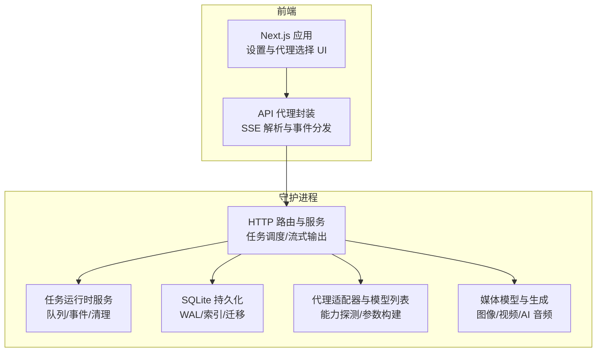
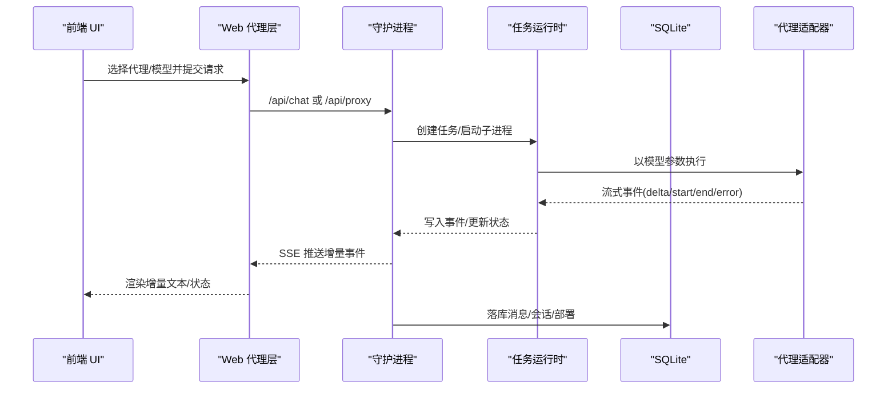
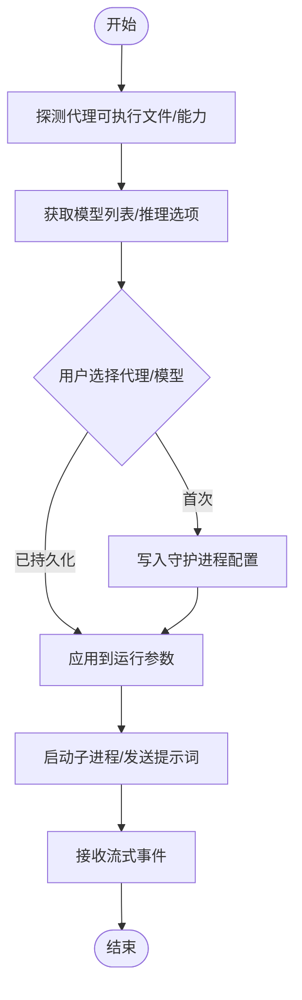
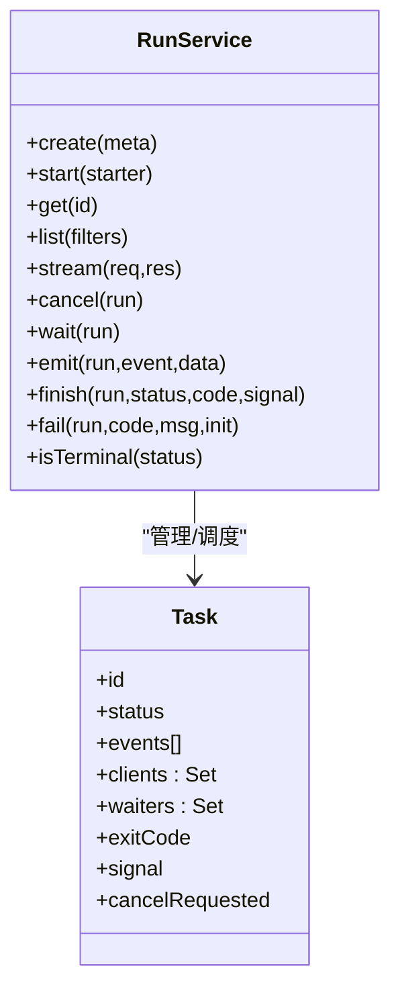
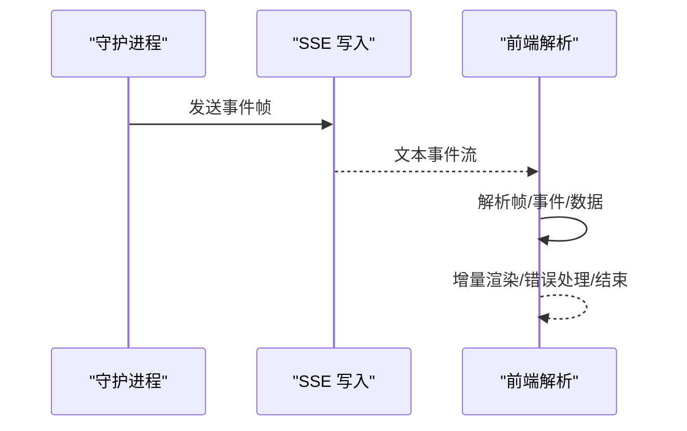
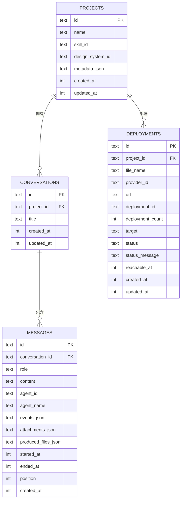
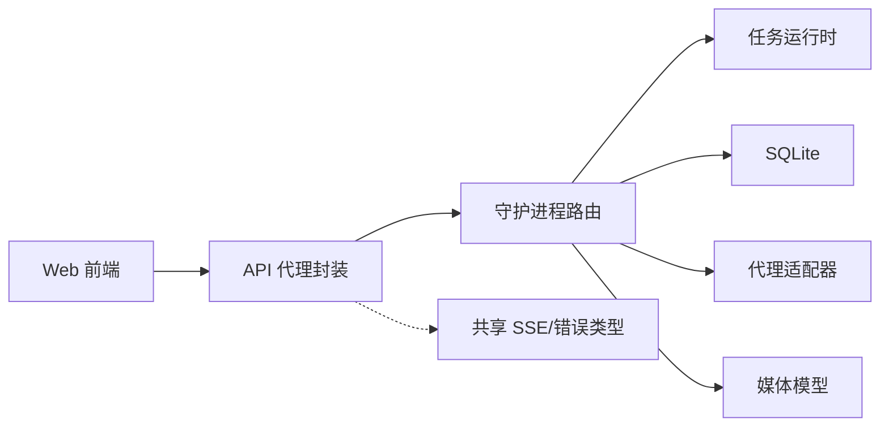

# 性能优化

<cite>
**本文引用的文件**
- [apps/daemon/src/app-config.ts](file://apps/daemon/src/app-config.ts)
- [apps/web/src/App.tsx](file://apps/web/src/App.tsx)
- [apps/web/src/components/SettingsDialog.tsx](file://apps/web/src/components/SettingsDialog.tsx)
- [apps/daemon/src/agents.ts](file://apps/daemon/src/agents.ts)
- [apps/daemon/src/media-models.ts](file://apps/daemon/src/media-models.ts)
- [apps/daemon/src/runs.ts](file://apps/daemon/src/runs.ts)
- [apps/daemon/src/server.ts](file://apps/daemon/src/server.ts)
- [apps/daemon/src/db.ts](file://apps/daemon/src/db.ts)
- [apps/daemon/src/community-pets-sync.ts](file://apps/daemon/src/community-pets-sync.ts)
- [apps/daemon/src/document-preview.ts](file://apps/daemon/src/document-preview.ts)
- [apps/web/src/providers/api-proxy.ts](file://apps/web/src/providers/api-proxy.ts)
- [apps/web/src/providers/sse.ts](file://apps/web/src/providers/sse.ts)
- [packages/contracts/src/sse/common.ts](file://packages/contracts/src/sse/common.ts)
- [packages/contracts/src/sse/proxy.ts](file://packages/contracts/src/sse/proxy.ts)
- [packages/contracts/src/api/proxy.ts](file://packages/contracts/src/api/proxy.ts)
- [QUICKSTART.ja-JP.md](file://QUICKSTART.ja-JP.md)
- [specs/current/maintainability-roadmap.md](file://specs/current/maintainability-roadmap.md)
- [specs/current/architecture-boundaries.md](file://specs/current/architecture-boundaries.md)
- [apps/daemon/src/cli.ts](file://apps/daemon/src/cli.ts)
</cite>

## 目录
1. [简介](#简介)
2. [项目结构](#项目结构)
3. [核心组件](#核心组件)
4. [架构总览](#架构总览)
5. [详细组件分析](#详细组件分析)
6. [依赖关系分析](#依赖关系分析)
7. [性能考量](#性能考量)
8. [故障排查指南](#故障排查指南)
9. [结论](#结论)
10. [附录](#附录)

## 简介
本指南面向 Open Design 的开发者与运维人员，聚焦于性能优化的三大支柱：代理选择策略、资源使用优化、以及系统性能调优。内容覆盖如何基于项目场景选择最合适的代理模型、如何优化生成速度、如何管理内存与存储资源，并给出代理性能对比、并发处理策略、缓存机制、以及大规模项目的性能考虑。同时提供可落地的配置参数调整建议、监控指标与性能瓶颈识别与解决方案。

## 项目结构
Open Design 采用“前端（Next.js）+ 守护进程（Daemon）”的双层架构：
- 前端负责用户交互与轻量 BFF/代理；守护进程负责本地运行时、SQLite 数据持久化、代理子进程管理、SSE 流式输出等。
- 关键性能路径包括：代理模型选择与参数、SSE 事件流、任务生命周期管理、数据库读写、媒体生成与缓存、反向代理与网络缓冲策略。

图示来源
- [apps/web/src/App.tsx:127-296](file://apps/web/src/App.tsx#L127-L296)
- [apps/web/src/providers/api-proxy.ts:47-96](file://apps/web/src/providers/api-proxy.ts#L47-L96)
- [apps/daemon/src/server.ts:1-200](file://apps/daemon/src/server.ts#L1-L200)
- [apps/daemon/src/runs.ts:1-155](file://apps/daemon/src/runs.ts#L1-L155)
- [apps/daemon/src/db.ts:16-29](file://apps/daemon/src/db.ts#L16-L29)
- [apps/daemon/src/agents.ts:119-604](file://apps/daemon/src/agents.ts#L119-L604)
- [apps/daemon/src/media-models.ts:1-134](file://apps/daemon/src/media-models.ts#L1-L134)

章节来源
- [apps/web/src/App.tsx:127-296](file://apps/web/src/App.tsx#L127-L296)
- [apps/daemon/src/server.ts:1-200](file://apps/daemon/src/server.ts#L1-L200)

## 核心组件
- 代理选择与模型参数
  - 代理定义集中于守护进程，包含模型列表、推理选项、参数构建、流格式等。前端通过设置界面选择代理与模型，并持久化到守护进程配置中。
- 任务运行时与 SSE
  - 守护进程维护任务生命周期（队列、开始、运行、结束/失败/取消），并通过 SSE 向前端推送增量事件。
- 数据持久化与索引
  - 使用 SQLite（WAL 模式）存储项目、会话、消息、部署状态等，配合索引与迁移保障查询与升级稳定性。
- 媒体生成与模型
  - 提供图像/视频/AI 音频模型清单与默认值，支持本地渲染或外部服务调用。
- 反向代理与网络缓冲
  - 通过反向代理保持 SSE 不缓冲、禁用压缩，避免浏览器长连接错误。

章节来源
- [apps/daemon/src/agents.ts:119-604](file://apps/daemon/src/agents.ts#L119-L604)
- [apps/daemon/src/runs.ts:1-155](file://apps/daemon/src/runs.ts#L1-L155)
- [apps/daemon/src/db.ts:16-29](file://apps/daemon/src/db.ts#L16-L29)
- [apps/daemon/src/media-models.ts:1-134](file://apps/daemon/src/media-models.ts#L1-L134)
- [QUICKSTART.ja-JP.md:110-131](file://QUICKSTART.ja-JP.md#L110-L131)

## 架构总览
下图展示从前端发起请求到守护进程执行、再到 SSE 推送与数据库落盘的完整链路，以及关键性能控制点（并发、缓冲、清理、索引）。

图示来源
- [apps/web/src/providers/api-proxy.ts:47-96](file://apps/web/src/providers/api-proxy.ts#L47-L96)
- [apps/daemon/src/runs.ts:6-155](file://apps/daemon/src/runs.ts#L6-L155)
- [apps/daemon/src/server.ts:3975-4016](file://apps/daemon/src/server.ts#L3975-L4016)
- [apps/daemon/src/db.ts:609-716](file://apps/daemon/src/db.ts#L609-L716)

## 详细组件分析

### 代理选择策略与性能权衡
- 代理能力探测与模型列表
  - 守护进程对各代理进行可执行文件探测、帮助信息解析与模型列表获取，动态生成可用模型与推理选项，避免硬编码带来的过时与不一致。
- 模型参数与流格式
  - 不同代理对模型参数、推理选项、流格式（JSON/事件流/自定义）支持不同，需按代理特性选择合适参数，减少不必要的重试与回退。
- 前端偏好持久化
  - 用户在前端选择的代理与模型偏好写入守护进程配置文件，确保跨浏览器/重装后仍保持一致体验。

图示来源
- [apps/daemon/src/agents.ts:703-775](file://apps/daemon/src/agents.ts#L703-L775)
- [apps/daemon/src/app-config.ts:123-153](file://apps/daemon/src/app-config.ts#L123-L153)
- [apps/web/src/App.tsx:127-296](file://apps/web/src/App.tsx#L127-L296)

章节来源
- [apps/daemon/src/agents.ts:119-604](file://apps/daemon/src/agents.ts#L119-L604)
- [apps/daemon/src/app-config.ts:19-97](file://apps/daemon/src/app-config.ts#L19-L97)
- [apps/web/src/App.tsx:127-296](file://apps/web/src/App.tsx#L127-L296)

### 任务运行时与并发控制
- 任务生命周期
  - 任务创建、状态更新、事件记录、客户端订阅、清理回收均有明确边界，支持取消与等待回调。
- 并发与限流
  - 通过任务队列与事件上限控制内存占用；对媒体生成等耗时操作采用限流器，避免资源争抢。
- 清理与 TTL
  - 终止状态任务按 TTL 清理，释放内存与连接资源。

图示来源
- [apps/daemon/src/runs.ts:6-155](file://apps/daemon/src/runs.ts#L6-L155)

章节来源
- [apps/daemon/src/runs.ts:1-155](file://apps/daemon/src/runs.ts#L1-L155)
- [apps/daemon/src/document-preview.ts:268-288](file://apps/daemon/src/document-preview.ts#L268-L288)

### SSE 协议与前端解析
- 协议版本与事件类型
  - SSE 事件统一为 start/delta/error/end 等，前端按帧解析并增量渲染，错误与终止事件触发收尾逻辑。
- 反向代理注意事项
  - 保持 SSE 不缓冲、禁用压缩，避免浏览器长连接错误。

图示来源
- [packages/contracts/src/sse/common.ts:1-11](file://packages/contracts/src/sse/common.ts#L1-L11)
- [packages/contracts/src/sse/proxy.ts:1-11](file://packages/contracts/src/sse/proxy.ts#L1-L11)
- [apps/web/src/providers/sse.ts:1-38](file://apps/web/src/providers/sse.ts#L1-L38)
- [apps/web/src/providers/api-proxy.ts:47-96](file://apps/web/src/providers/api-proxy.ts#L47-L96)
- [QUICKSTART.ja-JP.md:110-131](file://QUICKSTART.ja-JP.md#L110-L131)

章节来源
- [apps/web/src/providers/api-proxy.ts:47-96](file://apps/web/src/providers/api-proxy.ts#L47-L96)
- [apps/web/src/providers/sse.ts:1-38](file://apps/web/src/providers/sse.ts#L1-L38)
- [packages/contracts/src/sse/common.ts:1-11](file://packages/contracts/src/sse/common.ts#L1-L11)
- [packages/contracts/src/sse/proxy.ts:1-11](file://packages/contracts/src/sse/proxy.ts#L1-L11)

### 数据库与存储优化
- WAL 模式与外键约束
  - 使用 WAL 模式提升并发读写性能；启用外键约束保证一致性。
- 索引与查询
  - 针对会话、消息、部署等高频查询建立索引，降低延迟。
- 迁移与兼容
  - 兼容旧字段的迁移策略，避免升级中断。

图示来源
- [apps/daemon/src/db.ts:38-183](file://apps/daemon/src/db.ts#L38-L183)

章节来源
- [apps/daemon/src/db.ts:16-29](file://apps/daemon/src/db.ts#L16-L29)
- [apps/daemon/src/db.ts:38-183](file://apps/daemon/src/db.ts#L38-L183)

### 媒体生成与模型选择
- 模型清单与默认值
  - 图像/视频/AI 音频模型清单与默认值集中管理，便于统一选择与回退。
- 本地渲染与外部服务
  - 支持本地 HTML 渲染视频等能力，减少外部依赖波动。

章节来源
- [apps/daemon/src/media-models.ts:1-134](file://apps/daemon/src/media-models.ts#L1-L134)

### 并发处理策略与缓存机制
- 通用并发池
  - 通过并发池限制同时执行的任务数，避免资源枯竭。
- 限流器
  - 对高开销任务（如文档预览）使用限流器串行化执行，平衡吞吐与稳定性。
- 缓存与持久化
  - 前端偏好与守护进程配置持久化，避免重复探测与配置丢失。

章节来源
- [apps/daemon/src/community-pets-sync.ts:222-241](file://apps/daemon/src/community-pets-sync.ts#L222-L241)
- [apps/daemon/src/document-preview.ts:268-288](file://apps/daemon/src/document-preview.ts#L268-L288)
- [apps/daemon/src/app-config.ts:123-153](file://apps/daemon/src/app-config.ts#L123-L153)

## 依赖关系分析
- 前端与守护进程
  - 前端通过代理层访问守护进程 API；守护进程内部路由组织清晰，便于后续模块化拆分。
- 代理与子进程
  - 代理适配器负责参数构建与流格式映射，子进程执行与事件回传构成性能关键路径。
- SSE 与协议契约
  - 共享的 SSE 事件类型与错误模型确保前后端契约稳定，减少解析与映射成本。

图示来源
- [apps/web/src/providers/api-proxy.ts:47-96](file://apps/web/src/providers/api-proxy.ts#L47-L96)
- [apps/daemon/src/server.ts:1-200](file://apps/daemon/src/server.ts#L1-L200)
- [packages/contracts/src/sse/common.ts:1-11](file://packages/contracts/src/sse/common.ts#L1-L11)

章节来源
- [apps/daemon/src/server.ts:1-200](file://apps/daemon/src/server.ts#L1-L200)
- [packages/contracts/src/sse/common.ts:1-11](file://packages/contracts/src/sse/common.ts#L1-L11)

## 性能考量
- 代理选择策略
  - 优先选择具备更丰富流事件与推理选项的代理；对大提示词场景优先使用 stdin 传递，避免命令行长度限制。
  - 在前端设置中保留“默认（CLI 配置）”选项，允许用户在本地 CLI 已优化的情况下复用其配置。
- 生成速度优化
  - 控制 maxTokens 与上游 maxOutputTokens，避免无界输出导致的内存与网络压力。
  - 合理设置 SSE 心跳与 keep-alive，确保长连接稳定。
- 内存与存储资源管理
  - 任务事件上限与 TTL 清理防止内存膨胀；SQLite 使用 WAL 与索引提升并发与查询效率。
  - 对高开销任务（媒体生成、文档预览）使用并发池与限流器，避免 CPU/IO 抖动。
- 大规模项目考虑
  - 引入任务队列与超时策略，避免单点阻塞；对频繁变更的数据（消息）采用批量写入与去重。
  - 通过守护进程健康检查与反向代理配置，确保长连接与高并发下的稳定性。

章节来源
- [apps/daemon/src/agents.ts:157-184](file://apps/daemon/src/agents.ts#L157-L184)
- [apps/web/src/providers/api-proxy.ts:47-96](file://apps/web/src/providers/api-proxy.ts#L47-L96)
- [apps/daemon/src/runs.ts:9-11](file://apps/daemon/src/runs.ts#L9-L11)
- [apps/daemon/src/db.ts:23-24](file://apps/daemon/src/db.ts#L23-L24)
- [apps/daemon/src/document-preview.ts:268-288](file://apps/daemon/src/document-preview.ts#L268-L288)
- [QUICKSTART.ja-JP.md:110-131](file://QUICKSTART.ja-JP.md#L110-L131)

## 故障排查指南
- SSE 连接问题
  - 确认反向代理未启用 gzip 且未缓冲 SSE；检查心跳与 keep-alive 是否正常。
- 代理执行异常
  - 检查代理可执行文件是否存在、帮助信息解析是否成功、模型参数是否匹配代理要求。
- 任务卡住或内存增长
  - 查看任务事件上限与 TTL 清理是否生效；确认取消流程是否正确触发子进程信号。
- 数据库性能问题
  - 检查索引是否覆盖常用查询；确认 WAL 模式与外键约束是否开启；关注迁移过程中的兼容性。

章节来源
- [QUICKSTART.ja-JP.md:110-131](file://QUICKSTART.ja-JP.md#L110-L131)
- [apps/daemon/src/agents.ts:733-775](file://apps/daemon/src/agents.ts#L733-L775)
- [apps/daemon/src/runs.ts:124-131](file://apps/daemon/src/runs.ts#L124-L131)
- [apps/daemon/src/db.ts:38-183](file://apps/daemon/src/db.ts#L38-L183)

## 结论
通过合理的代理选择、严格的并发与资源控制、完善的 SSE 协议与数据库优化，Open Design 能在复杂的大规模项目中保持稳定的性能表现。建议优先完善任务生命周期管理与进程管理模块，进一步强化运行时验证与可观测性，持续迭代以获得更佳的用户体验与工程可维护性。

## 附录
- 配置参数与建议
  - 代理模型参数：根据代理能力探测结果选择模型与推理选项；必要时使用“默认（CLI 配置）”。
  - SSE：保持不缓冲、禁用压缩；合理设置心跳间隔。
  - SQLite：启用 WAL 与外键；为高频查询建立索引；关注迁移兼容。
  - 并发：媒体生成与文档预览使用限流器；通用任务使用并发池。
- 监控指标
  - 任务状态分布、事件速率、内存占用、CPU 使用率、数据库读写延迟、SSE 连接存活率。
- 瓶颈识别
  - 代理执行时间、事件流延迟、数据库慢查询、反向代理缓冲问题、子进程阻塞。