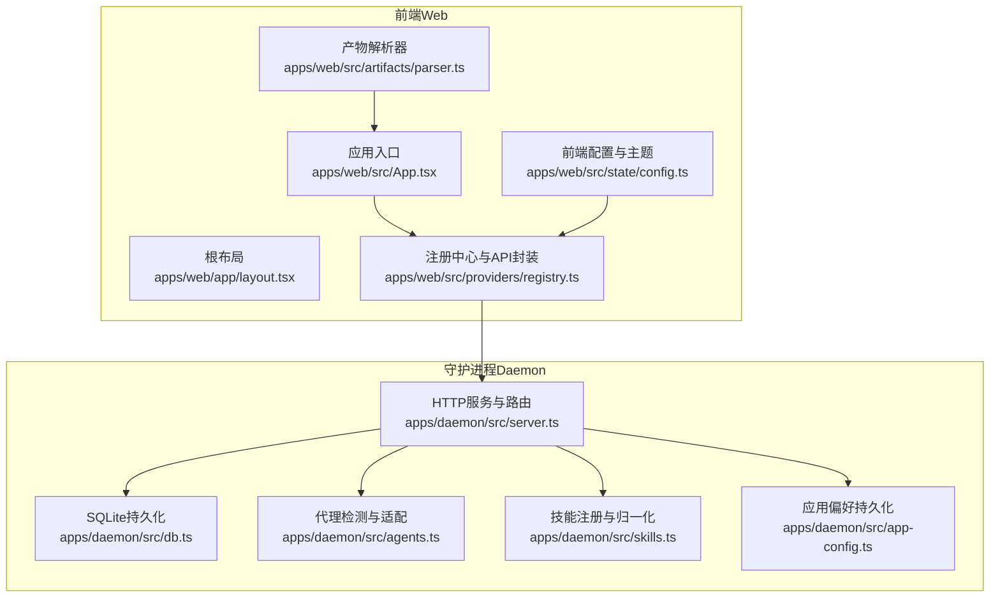
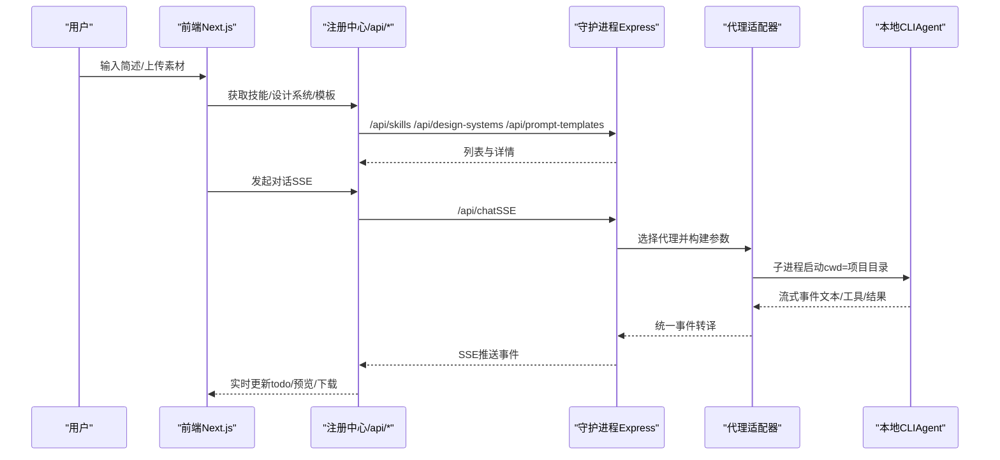
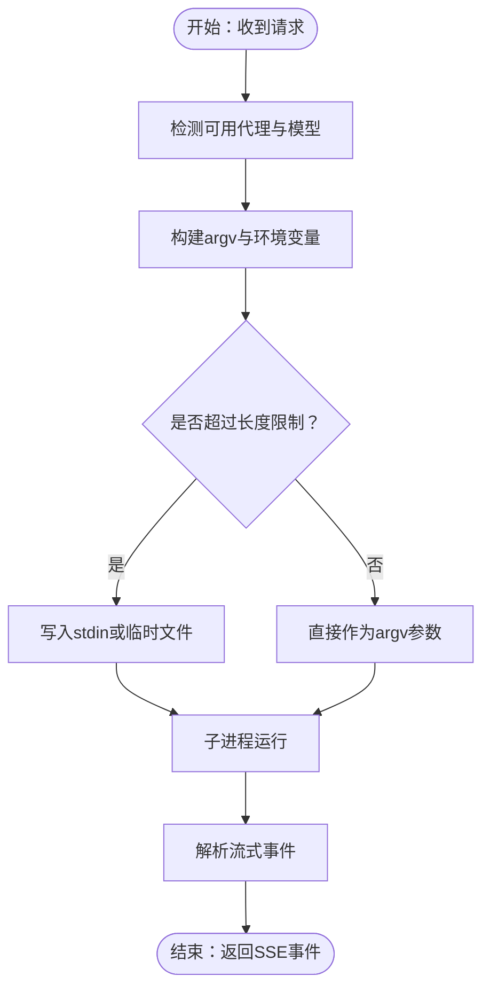
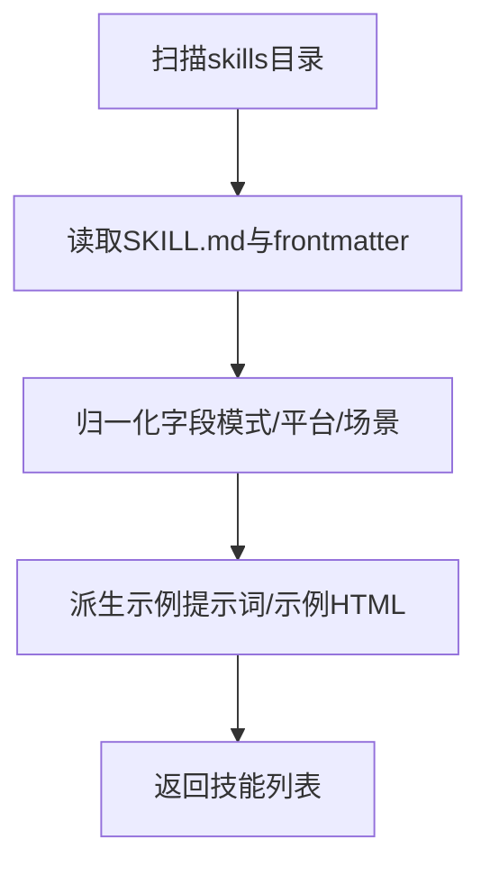
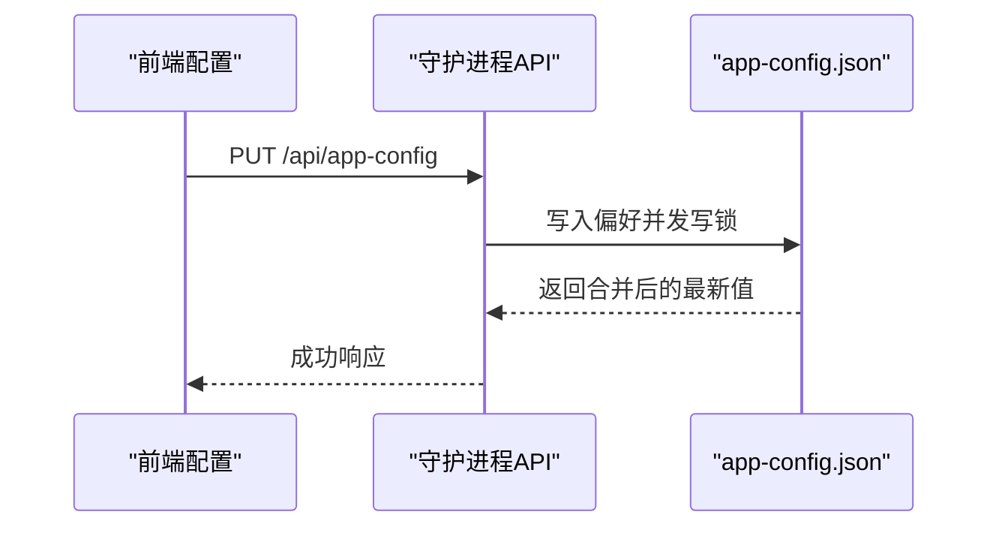
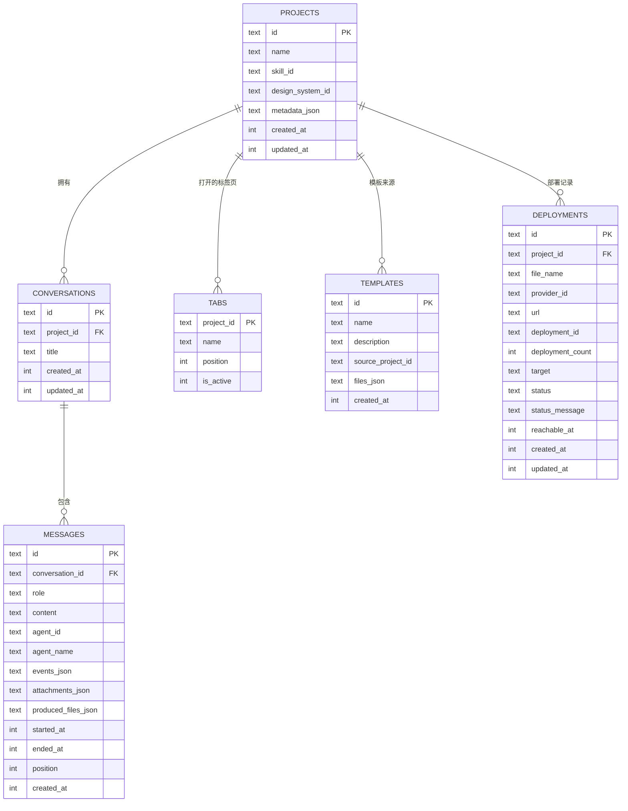
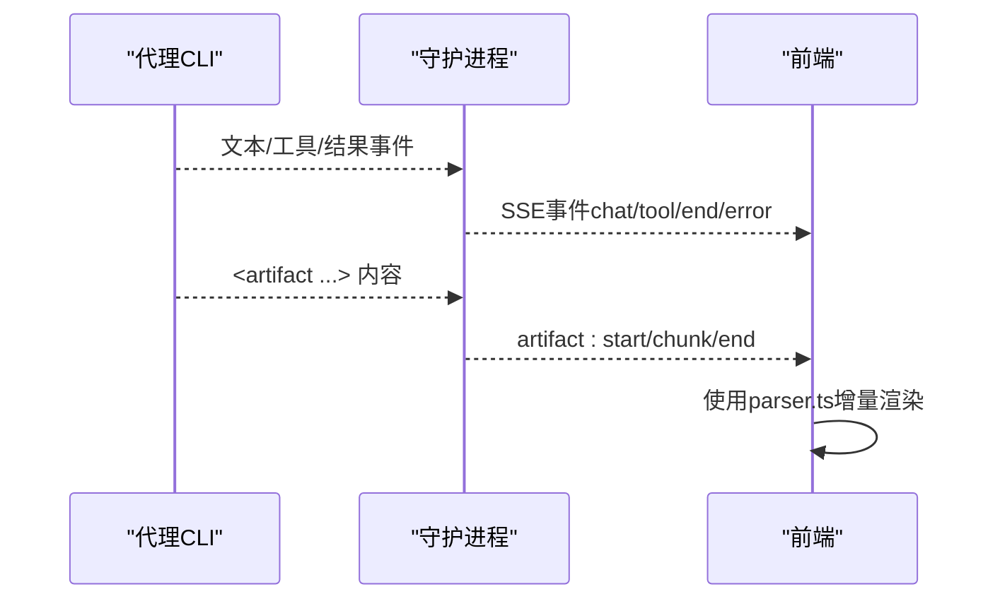
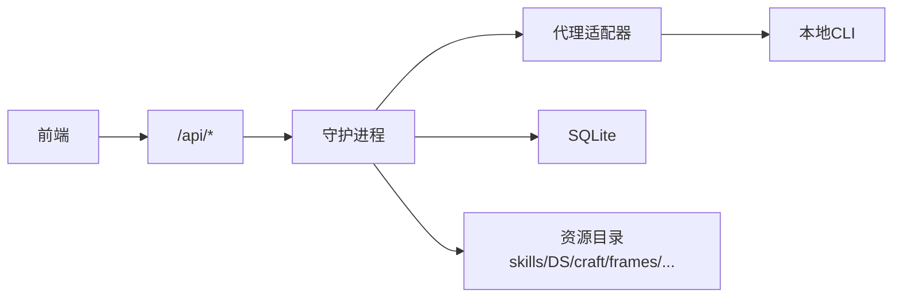

# 最佳实践

<cite>
**本文引用的文件**
- [README.md](file://README.md)
- [apps/daemon/src/app-config.ts](file://apps/daemon/src/app-config.ts)
- [apps/daemon/src/agents.ts](file://apps/daemon/src/agents.ts)
- [apps/daemon/src/skills.ts](file://apps/daemon/src/skills.ts)
- [apps/daemon/src/db.ts](file://apps/daemon/src/db.ts)
- [apps/daemon/src/server.ts](file://apps/daemon/src/server.ts)
- [apps/web/app/layout.tsx](file://apps/web/app/layout.tsx)
- [apps/web/src/App.tsx](file://apps/web/src/App.tsx)
- [apps/web/src/state/config.ts](file://apps/web/src/state/config.ts)
- [apps/web/src/providers/registry.ts](file://apps/web/src/providers/registry.ts)
- [apps/web/src/artifacts/parser.ts](file://apps/web/src/artifacts/parser.ts)
</cite>

## 目录
1. [简介](#简介)
2. [项目结构](#项目结构)
3. [核心组件](#核心组件)
4. [架构总览](#架构总览)
5. [详细组件分析](#详细组件分析)
6. [依赖关系分析](#依赖关系分析)
7. [性能考量](#性能考量)
8. [故障排查指南](#故障排查指南)
9. [结论](#结论)
10. [附录](#附录)

## 简介
本指南面向希望高效使用与规模化运营 Open Design 的个人与团队，围绕以下目标展开：  
- 设计工作流最佳实践：从“问题表单”到“产物预览”的闭环路径  
- 技能与设计系统的选型策略：如何基于场景与品牌资产快速定位合适方案  
- 代理性能优化：多代理适配、参数调优与长提示处理  
- 项目生命周期管理：从新建、迭代、导出到部署  
- 团队协作与规模化：命名规范、权限边界、跨环境一致性  
- 安全与合规：SSRF 防护、本地数据隔离、凭据管理  
- 可视化与可审计：端到端流程图、依赖关系图、安全检查清单  

## 项目结构
Open Design 采用“前端（Next.js）+ 本地守护进程（Node + Express）+ 多代理适配器”的分层架构。  
- 前端层负责交互、路由、主题与媒体配置同步；  
- 守护进程负责代理检测、技能与设计系统注册、SQLite 持久化、SSE 流式传输、文件系统与媒体生成；  
- 代理层通过子进程对接本地 CLI，支持多厂商模型与 BYOK 代理。

图表来源
- [apps/web/src/App.tsx:1-582](file://apps/web/src/App.tsx#L1-L582)
- [apps/web/app/layout.tsx:1-43](file://apps/web/app/layout.tsx#L1-L43)
- [apps/web/src/providers/registry.ts:1-682](file://apps/web/src/providers/registry.ts#L1-L682)
- [apps/web/src/state/config.ts:1-327](file://apps/web/src/state/config.ts#L1-L327)
- [apps/web/src/artifacts/parser.ts:1-180](file://apps/web/src/artifacts/parser.ts#L1-L180)
- [apps/daemon/src/server.ts:1-800](file://apps/daemon/src/server.ts#L1-L800)
- [apps/daemon/src/db.ts:1-942](file://apps/daemon/src/db.ts#L1-L942)
- [apps/daemon/src/agents.ts:1-800](file://apps/daemon/src/agents.ts#L1-L800)
- [apps/daemon/src/skills.ts:1-304](file://apps/daemon/src/skills.ts#L1-L304)
- [apps/daemon/src/app-config.ts:1-154](file://apps/daemon/src/app-config.ts#L1-L154)

章节来源
- [README.md:344-441](file://README.md#L344-L441)

## 核心组件
- 代理适配与检测：自动扫描 PATH 中的多类 CLI，按流格式解析输出，统一注入权限与工作目录参数。  
- 技能注册：扫描 skills 目录，解析 SKILL.md frontmatter，归一化字段（模式、平台、场景等）。  
- 设计系统：以 DESIGN.md 为契约，提供颜色、字体、间距、组件等令牌，支持品牌资产提取与方向选择。  
- 前后端配置：前端 localStorage 与守护进程 app-config.json 双向同步，确保首选项在 origin 变更后仍可用。  
- 数据持久化：SQLite 表涵盖项目、会话、消息、标签页、模板与部署记录，支持 WAL 与外键约束。  
- SSE 流：统一事件通道，支持聊天、代理工具调用、媒体任务进度与错误事件。  

章节来源
- [apps/daemon/src/agents.ts:119-604](file://apps/daemon/src/agents.ts#L119-L604)
- [apps/daemon/src/skills.ts:41-98](file://apps/daemon/src/skills.ts#L41-L98)
- [apps/daemon/src/app-config.ts:1-154](file://apps/daemon/src/app-config.ts#L1-L154)
- [apps/daemon/src/db.ts:38-183](file://apps/daemon/src/db.ts#L38-L183)
- [apps/web/src/state/config.ts:43-65](file://apps/web/src/state/config.ts#L43-L65)

## 架构总览
下图展示从浏览器到代理 CLI 的完整链路，以及关键数据与安全边界。

图表来源
- [apps/web/src/providers/registry.ts:43-56](file://apps/web/src/providers/registry.ts#L43-L56)
- [apps/daemon/src/server.ts:781-800](file://apps/daemon/src/server.ts#L781-L800)
- [apps/daemon/src/agents.ts:799-800](file://apps/daemon/src/agents.ts#L799-L800)

## 详细组件分析

### 代理适配与性能优化
- 自动检测：扫描 PATH 与常见用户工具链目录，支持多厂商 CLI（Claude Code、Codex、Devin、Gemini、OpenCode、Cursor Agent、Qwen、Copilot、Hermes、Kimi、Pi、Kiro、Mistral Vibe），并探测能力标志与模型列表。  
- 参数构建：针对不同 CLI 的 argv 形态与 stdin 限制，统一采用“promptViaStdin: true”避免 Windows/类 Unix 的命令行长度上限；对部分 CLI 提供 reasoning 选项与模型钳制逻辑。  
- 超长提示处理：当 prompt 过长时，优先走 stdin；若仍超限则回退至临时文件，避免 spawn 失败。  
- 权限与工作空间：默认以项目目录为 cwd，部分 CLI 支持额外目录授权，减少权限弹窗与失败重试。  

图表来源
- [apps/daemon/src/agents.ts:119-187](file://apps/daemon/src/agents.ts#L119-L187)
- [apps/daemon/src/agents.ts:209-244](file://apps/daemon/src/agents.ts#L209-L244)
- [apps/daemon/src/agents.ts:321-333](file://apps/daemon/src/agents.ts#L321-L333)
- [apps/daemon/src/agents.ts:433-445](file://apps/daemon/src/agents.ts#L433-L445)

章节来源
- [apps/daemon/src/agents.ts:119-604](file://apps/daemon/src/agents.ts#L119-L604)

### 技能注册与选择策略
- 扫描与解析：遍历 skills 目录，读取 SKILL.md frontmatter，归一化字段（模式、平台、场景、预览类型、设计系统需求等）。  
- 示例与提示：支持从示例 HTML 快速创建项目，或从描述推断示例提示词，缩短首次上手时间。  
- 兼容性：提供技能 ID 别名映射，避免重命名导致旧项目无法解析。  

图表来源
- [apps/daemon/src/skills.ts:41-98](file://apps/daemon/src/skills.ts#L41-L98)
- [apps/daemon/src/skills.ts:203-230](file://apps/daemon/src/skills.ts#L203-L230)

章节来源
- [apps/daemon/src/skills.ts:1-304](file://apps/daemon/src/skills.ts#L1-L304)

### 设计系统与品牌资产
- 契约与令牌：以 DESIGN.md 为契约，提供颜色、字体、间距、布局、组件、动效、声音、品牌与反模式九段落，确保跨技能一致性。  
- 方向选择：当无品牌资产时，提供五种确定性视觉方向（编辑部/现代极简/科技工具/粗野主义/暖软），一键绑定 OKLch 色板与字体栈。  
- 品牌提取：支持从截图/链接提取品牌色与文案，形成 brand-spec.md，避免凭空猜测。  

章节来源
- [README.md:443-492](file://README.md#L443-L492)
- [README.md:476-488](file://README.md#L476-L488)

### 前后端配置与主题
- 前端配置：localStorage 保存主题、通知、宠物等偏好，并在加载时进行迁移与协议推断。  
- 后端偏好：守护进程 app-config.json 保存 onboardingCompleted、默认代理/技能/设计系统等，跨 origin 与存储重置后仍可用。  
- 同步机制：前端保存后通过 /api/app-config PUT 同步至守护进程，实现双端一致。  

图表来源
- [apps/web/src/state/config.ts:282-327](file://apps/web/src/state/config.ts#L282-L327)
- [apps/daemon/src/app-config.ts:119-154](file://apps/daemon/src/app-config.ts#L119-L154)

章节来源
- [apps/web/src/state/config.ts:1-327](file://apps/web/src/state/config.ts#L1-L327)
- [apps/daemon/src/app-config.ts:1-154](file://apps/daemon/src/app-config.ts#L1-L154)

### 数据持久化与项目生命周期
- SQLite 表结构：projects、conversations、messages、tabs、templates、deployments 等，支持外键级联与列演进（迁移）。  
- 生命周期：新建项目 → 生成种子 → 生成产物 → 预览与下载 → 导出（HTML/PDF/PPTX/ZIP/Markdown）→ 模板复用 → 部署（Vercel）。  
- 文件系统：.od/projects/<id>/ 为真实工作目录，守护进程仅作为调度与持久化中枢，不暴露敏感接口。  

图表来源
- [apps/daemon/src/db.ts:38-183](file://apps/daemon/src/db.ts#L38-L183)

章节来源
- [apps/daemon/src/db.ts:1-942](file://apps/daemon/src/db.ts#L1-L942)

### SSE 与产物解析
- SSE 通道：统一事件类型（delta/end/error），用于聊天、工具调用、媒体任务与错误反馈。  
- 产物解析：从流中识别 <artifact> 标签，按标识符与类型分发，支持增量渲染与最终内容回传。  

图表来源
- [apps/daemon/src/server.ts:726-779](file://apps/daemon/src/server.ts#L726-L779)
- [apps/web/src/artifacts/parser.ts:89-179](file://apps/web/src/artifacts/parser.ts#L89-L179)

章节来源
- [apps/daemon/src/server.ts:726-779](file://apps/daemon/src/server.ts#L726-L779)
- [apps/web/src/artifacts/parser.ts:1-180](file://apps/web/src/artifacts/parser.ts#L1-L180)

## 依赖关系分析
- 前端依赖守护进程提供的注册中心（/api/*），包括技能、设计系统、模板、项目文件与部署配置。  
- 守护进程依赖代理适配器与子进程执行，同时维护 SQLite 与静态资源目录（skills、design-systems、craft、frames、prompt-templates）。  
- 安全边界：代理执行严格受限于项目目录与必要授权；SSRF 防护拒绝 loopback/link-local/RFC1918 主机访问；Origin 白名单仅允许绑定主机与回环地址。  

图表来源
- [apps/web/src/providers/registry.ts:1-682](file://apps/web/src/providers/registry.ts#L1-L682)
- [apps/daemon/src/server.ts:1-800](file://apps/daemon/src/server.ts#L1-L800)
- [apps/daemon/src/db.ts:1-942](file://apps/daemon/src/db.ts#L1-L942)

章节来源
- [apps/daemon/src/server.ts:236-293](file://apps/daemon/src/server.ts#L236-L293)

## 性能考量
- 代理选择与参数优化  
  - 优先选择具备 partialMessages/addDir 能力的代理，提升事件粒度与文件访问范围。  
  - 对 Codex/Devin/Hermes/Kimi/Pi 等支持 reasoning 的 CLI，合理设置推理强度，平衡质量与延迟。  
  - 长提示优先 stdin，避免 argv 超长；必要时使用临时文件回退。  
- SSE 保活与缓冲  
  - 合理设置心跳间隔，避免中间代理中断导致连接断开；生产环境建议开启 keep-alive 并配合反向代理缓冲策略。  
- 数据库与文件系统  
  - SQLite 使用 WAL 模式与外键约束，适合中小规模并发；大并发建议评估外部数据库或分库策略。  
  - 项目文件直写到 .od/projects/<id>/，避免跨目录权限与路径拼接问题。  
- 前端渲染与缓存  
  - 首屏骨架屏与懒加载结合，减少首次渲染阻塞；对静态资源（如 frames、prompt-templates）启用 CDN 与缓存头。  

## 故障排查指南
- 代理不可用或模型列表为空  
  - 检查 PATH 是否包含所需二进制；确认 CLI 版本与 --version/--help 输出正常；查看守护进程日志中的探测失败信息。  
- SSE 连接中断或无事件  
  - 检查反向代理/负载均衡器是否支持长连接与 SSE；确认心跳未被中间件清理；核对 Origin/Host 头是否在允许范围内。  
- 产物解析异常  
  - 确认代理输出中 <artifact> 标签闭合正确；前端 parser 仅处理单个 artifact，嵌套需在上游规范化。  
- 文件上传/下载失败  
  - 检查 /api/projects/:id/upload 的大小限制与字段名；确认项目目录可写且路径未越权；核对 Content-Disposition 与文件名编码。  
- 部署失败  
  - 查看 /api/deploy/config 与 /api/projects/:id/deployments 的状态与错误信息；确认 Vercel 凭据与域名配置正确。  

章节来源
- [apps/daemon/src/server.ts:574-678](file://apps/daemon/src/server.ts#L574-L678)
- [apps/web/src/artifacts/parser.ts:1-180](file://apps/web/src/artifacts/parser.ts#L1-L180)

## 结论
通过遵循本最佳实践，您可以：  
- 快速建立稳定的设计工作流，从“问题表单”到“产物预览”零偏差落地；  
- 在多代理环境中选择最优执行路径，兼顾质量与性能；  
- 以技能与设计系统为支点，实现跨项目的一致性与可复用性；  
- 在团队与规模化场景下，保持配置与数据的可审计与可迁移；  
- 将安全与合规纳入默认设计，降低供应链与内网风险。  

## 附录

### 设计思维最佳实践
- 以“问题表单”为第一原则，先锁定表面、受众、语调、品牌背景与尺度，再进入创作。  
- 使用“五维自评”在产出前把关：哲学契合度、层级清晰度、执行精度、具体性、克制程度。  
- 引入“P0/P1/P2 清单”，在关键节点强制校验，避免“看起来像样但经不起推敲”的半成品。  

章节来源
- [README.md:576-586](file://README.md#L576-L586)

### 团队协作建议
- 统一技能与设计系统选择：在团队内形成“场景-技能-系统”的选型共识，减少反复返工。  
- 规范命名与目录：项目文件、模板与参考材料按约定命名，便于自动化与检索。  
- 权限与边界：仅授予代理必要的工作目录访问权限；对外部网络访问实施 SSRF 防护。  
- 版本与迁移：定期同步上游技能/系统，使用 app-config 的合并策略避免偏好丢失。  

章节来源
- [apps/daemon/src/app-config.ts:1-154](file://apps/daemon/src/app-config.ts#L1-L154)
- [apps/daemon/src/server.ts:236-293](file://apps/daemon/src/server.ts#L236-L293)

### 规模化部署考虑
- 本地守护进程：支持多命名空间运行（OD_DATA_DIR + --namespace），隔离测试与生产数据。  
- Web 层部署：前端静态导出（Next.js）可部署至 Vercel/CDN，后端仅保留守护进程。  
- 代理扩展：新增 CLI 适配只需在 agents.ts 中补充定义，无需修改核心流程。  
- 监控与可观测：在反向代理层增加健康检查与慢请求告警；在守护进程侧记录关键事件与耗时指标。  

章节来源
- [README.md:316-342](file://README.md#L316-L342)
- [apps/daemon/src/agents.ts:119-604](file://apps/daemon/src/agents.ts#L119-L604)

### 安全审计清单
- 代理执行  
  - 仅在项目目录执行，必要时添加额外目录授权；禁止在代理参数中透传敏感凭据。  
- 网络访问  
  - 拒绝 loopback/link-local/RFC1918 主机访问；校验 Origin/Host 头与绑定主机一致。  
- 配置与凭据  
  - app-config.json 与媒体配置文件（.od/media-config.json）应纳入 gitignore；凭据只在守护进程内存中使用。  
- 文件系统  
  - 上传文件落地到项目目录，避免跨目录路径；对文件名进行清洗与长度限制。  
- 日志与监控  
  - 记录关键操作（创建/删除/部署）与错误码；对异常请求与失败率进行告警。  

章节来源
- [apps/daemon/src/server.ts:236-293](file://apps/daemon/src/server.ts#L236-L293)
- [apps/daemon/src/server.ts:574-678](file://apps/daemon/src/server.ts#L574-L678)
- [apps/daemon/src/app-config.ts:1-154](file://apps/daemon/src/app-config.ts#L1-L154)