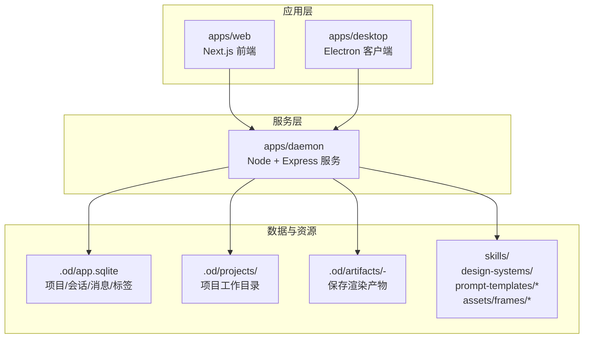
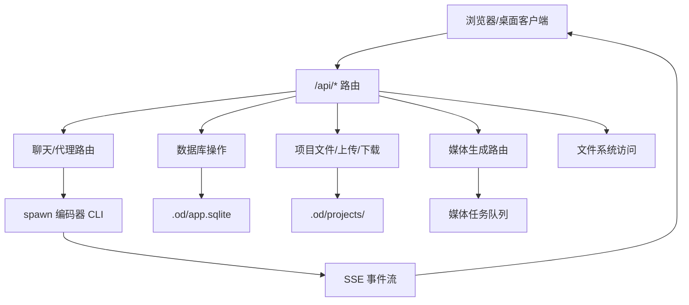
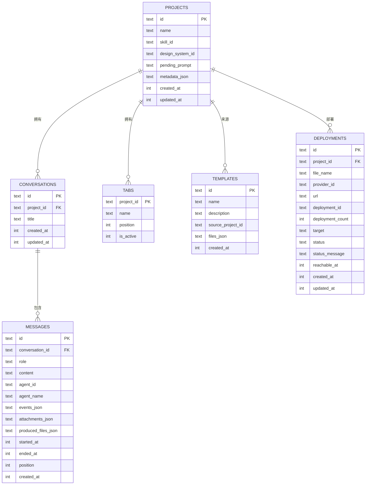
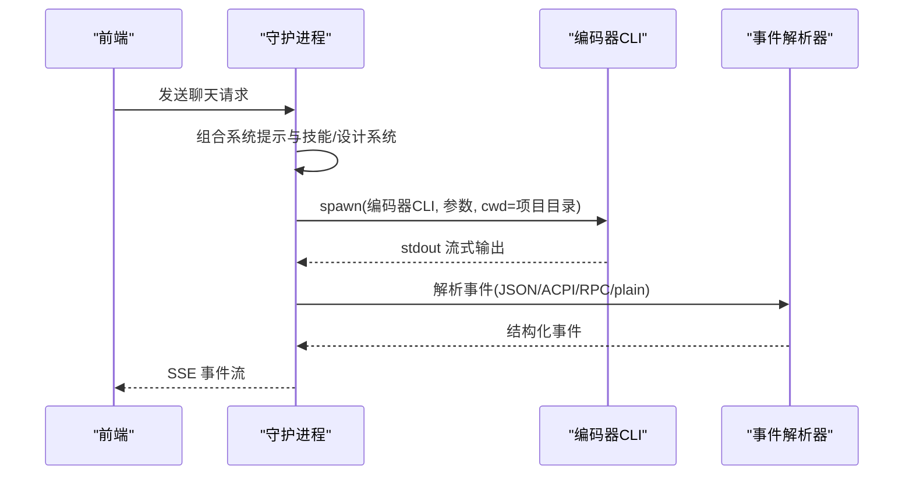
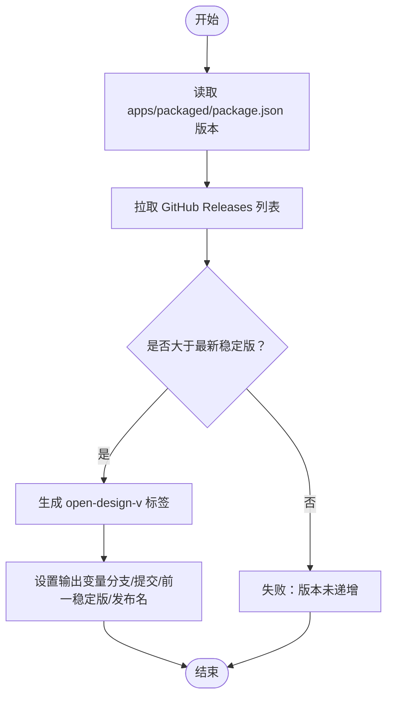
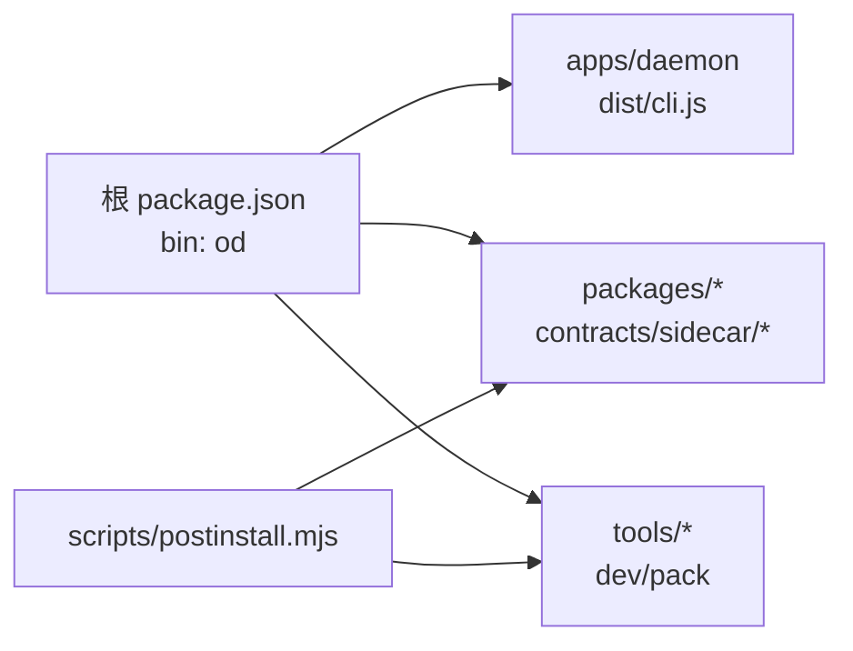

# 维护指南

<cite>
**本文引用的文件**
- [README.md](file://README.md)
- [QUICKSTART.md](file://QUICKSTART.md)
- [package.json](file://package.json)
- [scripts/postinstall.mjs](file://scripts/postinstall.mjs)
- [scripts/release-stable.ts](file://scripts/release-stable.ts)
- [scripts/release-beta.ts](file://scripts/release-beta.ts)
- [apps/daemon/src/db.ts](file://apps/daemon/src/db.ts)
- [apps/daemon/src/server.ts](file://apps/daemon/src/server.ts)
- [apps/daemon/src/agents.ts](file://apps/daemon/src/agents.ts)
</cite>

## 目录
1. [简介](#简介)
2. [项目结构](#项目结构)
3. [核心组件](#核心组件)
4. [架构总览](#架构总览)
5. [详细组件分析](#详细组件分析)
6. [依赖关系分析](#依赖关系分析)
7. [性能考虑](#性能考虑)
8. [故障排除指南](#故障排除指南)
9. [结论](#结论)
10. [附录](#附录)

## 简介
本维护指南面向 Open Design 的系统管理员与运维工程师，覆盖日常维护任务、更新升级流程、故障排除方法，以及数据库维护、日志管理、性能监控与自动化运维脚本的使用。文档同时提供维护检查清单、常见问题诊断与紧急情况处理方案，帮助在生产环境中稳定运行该本地优先的设计工作流平台。

## 项目结构
Open Design 采用多包工作区（pnpm workspace）组织，核心由以下模块构成：
- apps/daemon：Node + Express 后端服务，负责代理聊天、媒体生成、SQLite 数据持久化、文件上传与项目管理等。
- apps/web：Next.js 16 应用，前端界面与聊天、预览、导出等功能。
- apps/desktop：可选 Electron 客户端外壳，通过 sidecar 协议与后端通信。
- scripts：发布与同步脚本，如发布稳定版/测试版、设计系统同步、媒体模型校验等。
- packages：跨应用共享的协议与工具包（contracts、sidecar、sidecar-proto、platform）。
- skills、design-systems、assets、prompt-templates：技能、设计系统、设备框架与提示模板资源。

图示来源
- [README.md: 344-441:344-441](file://README.md#L344-L441)
- [QUICKSTART.md: 154-213:154-213](file://QUICKSTART.md#L154-L213)

章节来源
- [README.md: 344-441:344-441](file://README.md#L344-L441)
- [QUICKSTART.md: 154-213:154-213](file://QUICKSTART.md#L154-L213)

## 核心组件
- 后端服务（apps/daemon）
  - 路由与 API：聊天、代理、项目文件、部署、导入导出、媒体生成等。
  - 数据持久化：SQLite 表 projects、conversations、messages、tabs、templates、deployments。
  - 代理适配器：支持多编码器 CLI 与 BYOK API 代理，统一输出为 SSE。
  - 运行时数据：.od/ 下的 app.sqlite、projects/<id>/、artifacts/。
- 前端（apps/web）
  - Next.js App Router + React，负责聊天、问题表单、方向选择、沙箱预览与导出。
- 桌面客户端（apps/desktop）
  - 可选 Electron，通过 sidecar 协议驱动桌面自动化与检查。
- 资源与技能
  - skills、design-systems、prompt-templates、assets/frames 提供可插拔的技能与视觉系统。

章节来源
- [README.md: 257-299:257-299](file://README.md#L257-L299)
- [apps/daemon/src/db.ts: 38-183:38-183](file://apps/daemon/src/db.ts#L38-L183)
- [apps/daemon/src/server.ts: 781-800:781-800](file://apps/daemon/src/server.ts#L781-L800)

## 架构总览
Open Design 采用“浏览器前端 + 本地守护进程 + 编码器 CLI”的架构。守护进程提供 /api/* 接口，负责：
- 代理聊天与 BYOK API 流水线
- 项目生命周期管理（创建、读取、删除、归档）
- 文件上传与静态资源服务
- SQLite 元数据存储
- 媒体生成任务调度（图像/视频/音频）

图示来源
- [README.md: 257-299:257-299](file://README.md#L257-L299)
- [apps/daemon/src/server.ts: 781-800:781-800](file://apps/daemon/src/server.ts#L781-L800)

## 详细组件分析

### 数据库组件（SQLite）
- 存储内容
  - projects：项目元数据（名称、技能、设计系统、待处理提示、元数据）
  - conversations：会话标题与时间戳
  - messages：角色、内容、附件、事件、产物文件、运行状态与时间戳
  - tabs：项目打开文件与活动标签
  - templates：用户保存的模板
  - deployments：部署记录（目标、状态、可达时间等）
- 运行模式
  - WAL 模式、外键约束开启
  - 动态迁移：按需添加新列，兼容旧版本数据库
- 访问接口
  - 提供列表、插入、更新、删除、查询等方法；消息位置自增保证顺序

图示来源
- [apps/daemon/src/db.ts: 38-183:38-183](file://apps/daemon/src/db.ts#L38-L183)

章节来源
- [apps/daemon/src/db.ts: 38-183:38-183](file://apps/daemon/src/db.ts#L38-L183)

### 代理与适配器（agents）
- 自动检测 PATH 中可用的编码器 CLI，支持 Claude Code、Codex、Devin、Gemini、OpenCode、Cursor Agent、Qwen、Copilot、Pi、Kiro、Mistral Vibe 等。
- 针对不同 CLI 的参数构建、流格式解析、能力探测（如 partial messages、add-dir）与环境变量注入。
- 对长提示采用 stdin 或临时文件规避平台限制（Linux E2BIG、Windows ENAMETOOLONG）。

图示来源
- [apps/daemon/src/agents.ts: 119-604:119-604](file://apps/daemon/src/agents.ts#L119-L604)
- [apps/daemon/src/server.ts: 781-800:781-800](file://apps/daemon/src/server.ts#L781-L800)

章节来源
- [apps/daemon/src/agents.ts: 119-604:119-604](file://apps/daemon/src/agents.ts#L119-L604)

### 服务器与路由（server）
- 路由安全策略：基于绑定主机与端口判断允许的浏览器来源，拒绝跨域 API 请求（除健康/版本）。
- SSE 支持：保持连接、心跳、错误事件封装。
- 上传与项目文件：多文件上传到项目目录，支持大小限制与文件名清洗。
- 媒体任务：以任务 ID 管理图像/视频/音频生成进度，带 TTL 清理。
- 静态资源：在打包模式下由守护进程直接提供静态导出目录。

章节来源
- [apps/daemon/src/server.ts: 781-800:781-800](file://apps/daemon/src/server.ts#L781-L800)
- [apps/daemon/src/server.ts: 574-678:574-678](file://apps/daemon/src/server.ts#L574-L678)
- [apps/daemon/src/server.ts: 680-779:680-779](file://apps/daemon/src/server.ts#L680-L779)

### 日志与运行状态
- 工具入口：tools-dev 提供 start/run/status/logs/check 等命令，统一管理守护进程、Web 与桌面。
- 日志采集：tools-dev logs 输出守护进程、Web、桌面三类日志；check 展示健康检查与最近日志摘要。
- 端口与命名空间：支持固定端口与命名空间隔离，避免冲突。

章节来源
- [QUICKSTART.md: 59-76:59-76](file://QUICKSTART.md#L59-L76)
- [QUICKSTART.md: 62-74:62-74](file://QUICKSTART.md#L62-L74)

### 备份与恢复
- 备份范围
  - .od/app.sqlite：项目、会话、消息、标签、模板、部署记录
  - .od/projects/<id>/：每个项目的完整工作目录（含生成的 HTML/PPTX/PDF/ZIP 等）
  - .od/artifacts/<timestamp>-<slug>/：一次性保存的渲染产物
- 备份方式
  - 本地打包：tar/zip 归档 .od 目录
  - 数据库导出：使用 SQLite 工具导出数据库（建议在停止守护进程后执行）
- 恢复步骤
  - 停止守护进程
  - 还原 .od 目录
  - 启动守护进程，确认项目与文件可见
  - 如遇数据库不一致，可重建数据库或迁移（见“数据库维护”）

章节来源
- [README.md: 325-342:325-342](file://README.md#L325-L342)
- [apps/daemon/src/db.ts: 16-29:16-29](file://apps/daemon/src/db.ts#L16-L29)

### 性能监控
- SSE 连接：确保反向代理不缓冲分块传输（Nginx 示例中已禁用 gzip 并设置 X-Accel-Buffering=no）。
- 任务超时：媒体任务 TTL 与等待器清理，避免内存泄漏。
- 数据库：WAL 模式提升并发写入性能；索引覆盖常用查询（会话、消息、标签、部署）。

章节来源
- [QUICKSTART.md: 112-131:112-131](file://QUICKSTART.md#L112-L131)
- [apps/daemon/src/db.ts: 69-147:69-147](file://apps/daemon/src/db.ts#L69-L147)
- [apps/daemon/src/server.ts: 680-724:680-724](file://apps/daemon/src/server.ts#L680-L724)

### 版本升级与发布
- 稳定版发布
  - 校验 apps/packaged/package.json 版本必须大于当前最新稳定版
  - 通过 GitHub Releases 列表提取最新稳定版并比较
  - 设置输出变量（版本号、分支、提交、前一稳定版等）
- 测试版发布
  - 基于基础稳定版生成 beta.N，若存在相同基础版本则递增 N
  - 支持签名开关与固定标签 open-design-beta
- 开发者发布流程
  - 使用 tools-dev 构建与启动，确保子包构建完成（postinstall.mjs 会自动构建 packages/*、tools/*）

图示来源
- [scripts/release-stable.ts: 83-120:83-120](file://scripts/release-stable.ts#L83-L120)
- [scripts/release-beta.ts: 134-187:134-187](file://scripts/release-beta.ts#L134-L187)

章节来源
- [scripts/release-stable.ts: 83-120:83-120](file://scripts/release-stable.ts#L83-L120)
- [scripts/release-beta.ts: 134-187:134-187](file://scripts/release-beta.ts#L134-L187)
- [scripts/postinstall.mjs: 32-49:32-49](file://scripts/postinstall.mjs#L32-L49)

## 依赖关系分析
- 包管理与运行时
  - pnpm workspace + Node ~24，根 package.json 指定二进制入口 od（apps/daemon/dist/cli.js）
  - onlyBuiltDependencies 限定编译型依赖（better-sqlite3、electron、esbuild），减少安装体积
- 构建链路
  - postinstall.mjs 在安装后自动构建 packages/* 与 tools/*，确保运行时可用
- 运行入口
  - tools-dev 是唯一本地生命周期入口，提供守护进程、Web、桌面的统一管理

图示来源
- [package.json: 9-11:9-11](file://package.json#L9-L11)
- [package.json: 28-29:28-29](file://package.json#L28-L29)
- [scripts/postinstall.mjs: 32-49:32-49](file://scripts/postinstall.mjs#L32-L49)

章节来源
- [package.json: 9-11:9-11](file://package.json#L9-L11)
- [package.json: 28-29:28-29](file://package.json#L28-L29)
- [scripts/postinstall.mjs: 32-49:32-49](file://scripts/postinstall.mjs#L32-L49)

## 性能考虑
- SSE 传输：确保反向代理不缓冲分块响应，避免浏览器长时间无响应。
- 数据库写入：WAL 模式与外键约束在高并发场景下更稳健；合理使用索引减少慢查询。
- 任务清理：媒体任务完成后带 TTL 清理，防止内存泄漏。
- 上传限制：对上传大小与数量进行限制，避免磁盘与网络压力过大。

章节来源
- [QUICKSTART.md: 112-131:112-131](file://QUICKSTART.md#L112-L131)
- [apps/daemon/src/db.ts: 23-24:23-24](file://apps/daemon/src/db.ts#L23-L24)
- [apps/daemon/src/server.ts: 680-724:680-724](file://apps/daemon/src/server.ts#L680-L724)

## 故障排除指南
- “未在 PATH 中发现任何编码器”
  - 安装任一支持的 CLI（claude、codex、devin、gemini、opencode、cursor-agent、qwen、copilot）或切换到 BYOK API 模式
- “/api/chat 返回 500”
  - 查看守护进程终端日志，通常为 CLI 参数不匹配；参考 agents.ts 中 buildArgs 配置
- “媒体生成提示缺少 OD_BIN 或守护进程 URL 为 :0”
  - 重新构建守护进程 CLI 并重启；确保从应用内重新打开项目以注入 OD_* 环境变量
- “Codex 插件过多导致上下文膨胀”
  - 以 OD_CODEX_DISABLE_PLUGINS=1 启动，禁用插件后再运行
- “产物未渲染”
  - 确认系统提示正确下发；必要时更换更强模型或更严格的技能

章节来源
- [QUICKSTART.md: 215-222:215-222](file://QUICKSTART.md#L215-L222)
- [apps/daemon/src/agents.ts: 216-241:216-241](file://apps/daemon/src/agents.ts#L216-L241)

## 结论
通过规范化的维护流程（备份/恢复、日志/监控、数据库维护、升级发布）、清晰的故障排除路径与自动化脚本，Open Design 可在本地与云端稳定运行。建议团队建立标准化的巡检清单与应急预案，确保系统高可用与可追溯性。

## 附录

### 维护检查清单
- 系统健康
  - tools-dev status：确认守护进程、Web、桌面均运行
  - tools-dev logs：查看最近错误与异常
  - curl -s http://127.0.0.1:<端口>/api/health：验证健康检查
- 数据库
  - 检查 .od/app.sqlite 是否存在且可读写
  - 确认关键表（projects/conversations/messages/tabs/templates/deployments）索引存在
- 项目与文件
  - 确认 .od/projects/<id>/ 存在且可读写
  - 检查 .od/artifacts/ 是否按预期生成
- 代理与媒体
  - 确认 PATH 中至少一个编码器 CLI 可用
  - 验证媒体生成任务队列与 TTL 清理正常
- 反向代理（如使用）
  - 确保 SSE 不被缓冲，关闭 gzip，设置 X-Accel-Buffering=no

章节来源
- [QUICKSTART.md: 62-74:62-74](file://QUICKSTART.md#L62-L74)
- [apps/daemon/src/db.ts: 69-147:69-147](file://apps/daemon/src/db.ts#L69-L147)
- [apps/daemon/src/server.ts: 781-800:781-800](file://apps/daemon/src/server.ts#L781-L800)