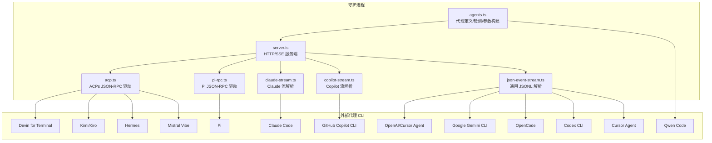
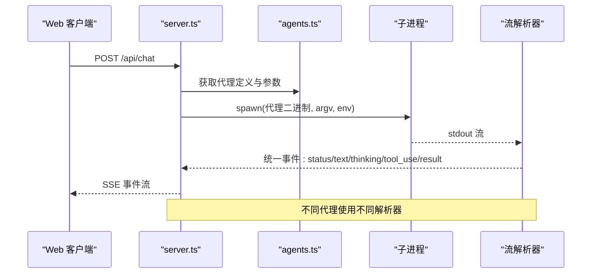
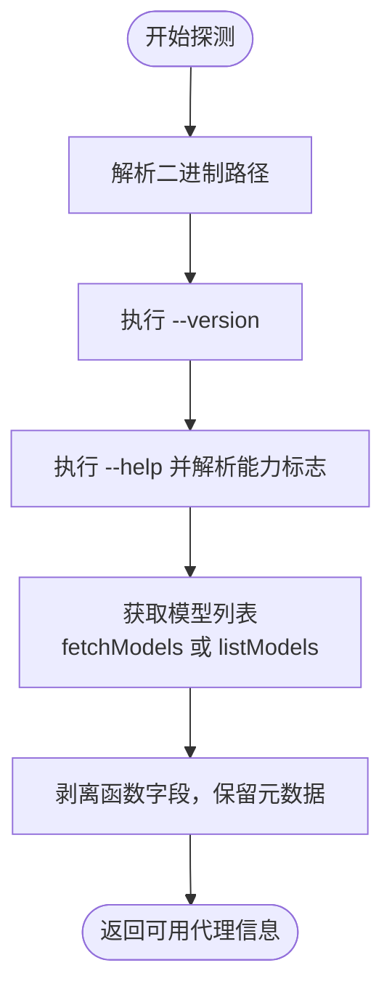
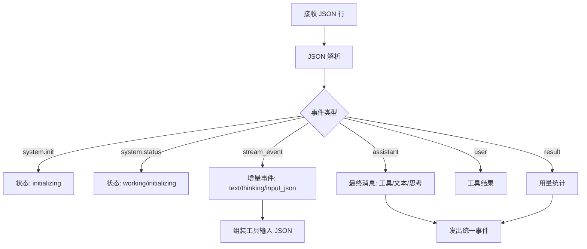
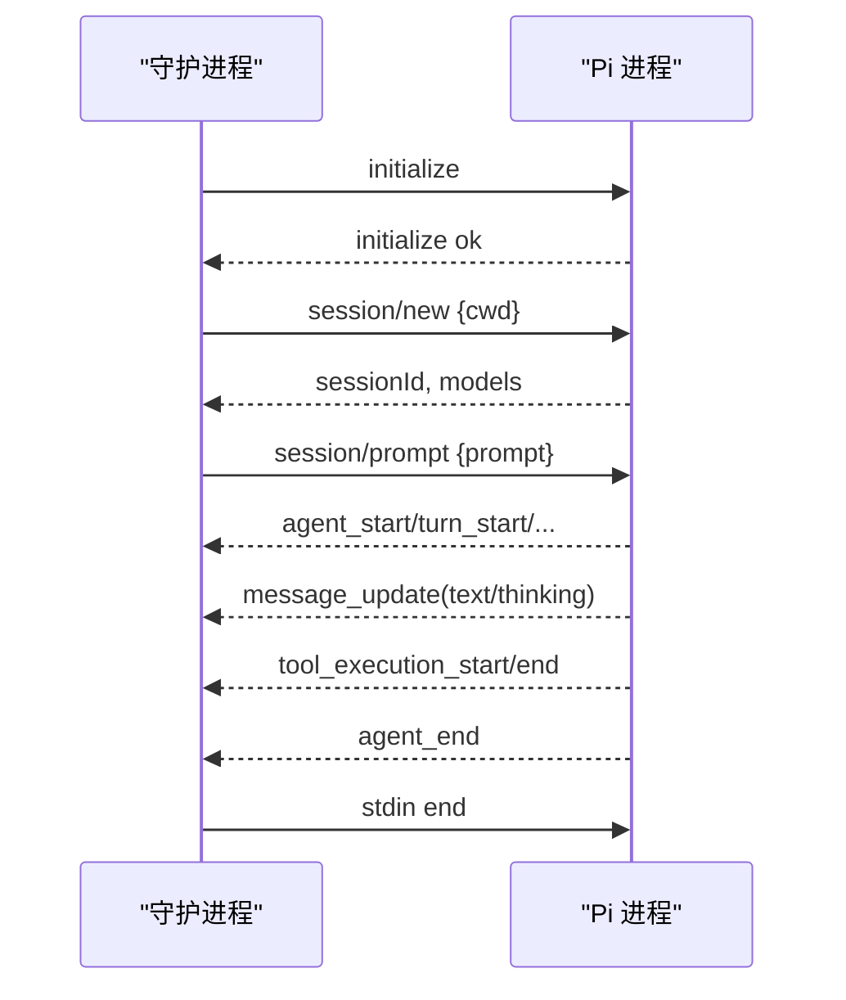
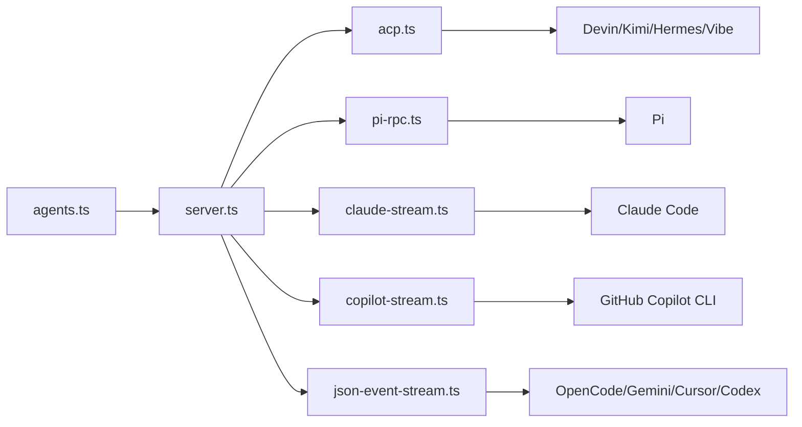

# 代理适配器系统

<cite>
**本文档引用的文件**
- [agents.ts](file://apps/daemon/src/agents.ts)
- [cli.ts](file://apps/daemon/src/cli.ts)
- [claude-stream.ts](file://apps/daemon/src/claude-stream.ts)
- [copilot-stream.ts](file://apps/daemon/src/copilot-stream.ts)
- [json-event-stream.ts](file://apps/daemon/src/json-event-stream.ts)
- [pi-rpc.ts](file://apps/daemon/src/pi-rpc.ts)
- [acp.ts](file://apps/daemon/src/acp.ts)
- [server.ts](file://apps/daemon/src/server.ts)
- [agents.test.ts](file://apps/daemon/tests/agents.test.ts)
- [AGENTS.md](file://AGENTS.md)
- [apps/AGENTS.md](file://apps/AGENTS.md)
</cite>

## 目录
1. [简介](#简介)
2. [项目结构](#项目结构)
3. [核心组件](#核心组件)
4. [架构总览](#架构总览)
5. [详细组件分析](#详细组件分析)
6. [依赖关系分析](#依赖关系分析)
7. [性能考虑](#性能考虑)
8. [故障排除指南](#故障排除指南)
9. [结论](#结论)
10. [附录](#附录)

## 简介
本系统为统一的编程代理适配器，支持 13 种主流代码代理 CLI（Claude、Copilot、OpenAI、Anthropic 等）的本地集成与流式协议解析。其核心目标是：
- 统一代理检测、模型列表发现与参数构建
- 提供一致的流式事件解析与 UI 映射
- 支持跨平台路径解析、权限策略与环境隔离
- 通过标准化的 JSON-RPC/事件流协议，将不同代理的输出映射为统一的 UI 事件（状态、文本、思考、工具调用、结果、用量）

## 项目结构
- apps/daemon/src：核心适配器与服务器逻辑
  - agents.ts：代理定义、检测、参数构建与模型发现
  - claude-stream.ts：Claude Code 流式 JSON 解析
  - copilot-stream.ts：GitHub Copilot CLI 流式 JSON 解析
  - json-event-stream.ts：通用 JSONL 事件解析（OpenCode、Gemini、Cursor Agent、Codex）
  - pi-rpc.ts：Pi 的 JSON-RPC over stdio 会话驱动
  - acp.ts：ACPs（Agent Communication Protocol）JSON-RPC 会话驱动与模型发现
  - server.ts：HTTP/SSE 服务端，负责聊天会话、媒体生成、代理调度
  - cli.ts：本地 CLI 入口，支持 od 媒体子命令
  - tests/agents.test.ts：代理适配器行为测试
- apps/AGENTS.md、AGENTS.md：模块边界与开发说明

**图表来源**
- [agents.ts:119-604](file://apps/daemon/src/agents.ts#L119-L604)
- [server.ts:14-33](file://apps/daemon/src/server.ts#L14-L33)
- [acp.ts:110-209](file://apps/daemon/src/acp.ts#L110-L209)
- [pi-rpc.ts:210-297](file://apps/daemon/src/pi-rpc.ts#L210-L297)
- [claude-stream.ts:23-208](file://apps/daemon/src/claude-stream.ts#L23-L208)
- [copilot-stream.ts:25-122](file://apps/daemon/src/copilot-stream.ts#L25-L122)
- [json-event-stream.ts:287-331](file://apps/daemon/src/json-event-stream.ts#L287-L331)

**章节来源**
- [apps/AGENTS.md:12-18](file://apps/AGENTS.md#L12-L18)
- [AGENTS.md:47-53](file://AGENTS.md#L47-L53)

## 核心组件
- 代理定义与检测（agents.ts）
  - 统一的 AGENT_DEFS 列表，描述每个代理的二进制名、版本/帮助参数、能力标志、模型发现方式、默认模型、参数构建函数、流格式与事件解析器
  - 探测流程：PATH 解析 → 版本查询 → 帮助解析能力 → 模型列表获取 → 返回可用代理信息
  - 跨平台 PATH 扩展：用户工具链目录缓存与去重
- 流式协议解析器
  - Claude Code：解析 stream-json 输出，支持增量思考/文本与工具调用
  - Copilot CLI：解析 JSONL 输出，映射到统一事件
  - 通用 JSONL：OpenCode、Gemini、Cursor Agent、Codex 的事件映射
  - Pi JSON-RPC over stdio：驱动 RPC 生命周期，映射事件到统一事件
  - ACP JSON-RPC over stdio：多代理通用协议，自动处理权限请求与会话
- 服务器与会话（server.ts）
  - /api/agents：返回可用代理与模型
  - /api/chat：SSE 流式聊天，按代理类型选择解析器
  - /api/projects/:id/media/generate：媒体生成代理调用
- CLI 入口（cli.ts）
  - 默认启动守护进程并打开浏览器
  - 子命令 od media generate：从代理内部调用，向守护进程发起媒体生成任务

**章节来源**
- [agents.ts:119-796](file://apps/daemon/src/agents.ts#L119-L796)
- [claude-stream.ts:23-208](file://apps/daemon/src/claude-stream.ts#L23-L208)
- [copilot-stream.ts:25-122](file://apps/daemon/src/copilot-stream.ts#L25-L122)
- [json-event-stream.ts:287-331](file://apps/daemon/src/json-event-stream.ts#L287-L331)
- [pi-rpc.ts:210-297](file://apps/daemon/src/pi-rpc.ts#L210-L297)
- [acp.ts:110-209](file://apps/daemon/src/acp.ts#L110-L209)
- [server.ts:14-50](file://apps/daemon/src/server.ts#L14-L50)
- [cli.ts:49-115](file://apps/daemon/src/cli.ts#L49-L115)

## 架构总览
系统采用“声明式代理定义 + 运行时探测 + 统一流解析”的三层架构：
- 声明层：在 AGENT_DEFS 中声明每个代理的能力、参数与流格式
- 探测层：运行时解析 PATH、执行 --version/--help、动态获取模型列表
- 解析层：根据 streamFormat 选择对应的解析器，将代理输出映射为统一 UI 事件

**图表来源**
- [server.ts:14-50](file://apps/daemon/src/server.ts#L14-L50)
- [agents.ts:733-796](file://apps/daemon/src/agents.ts#L733-L796)
- [claude-stream.ts:23-208](file://apps/daemon/src/claude-stream.ts#L23-L208)
- [copilot-stream.ts:25-122](file://apps/daemon/src/copilot-stream.ts#L25-L122)
- [json-event-stream.ts:287-331](file://apps/daemon/src/json-event-stream.ts#L287-L331)
- [pi-rpc.ts:210-297](file://apps/daemon/src/pi-rpc.ts#L210-L297)
- [acp.ts:211-423](file://apps/daemon/src/acp.ts#L211-L423)

## 详细组件分析

### 代理定义与检测（agents.ts）
- 关键字段
  - id/name/bin：代理标识与可执行文件名
  - fallbackBins/versionArgs/helpArgs/capabilityFlags：用于探测与能力识别
  - listModels/fetchModels：模型列表发现（优先 fetchModels，否则 listModels）
  - buildArgs：根据输入参数与运行上下文生成 argv
  - promptViaStdin/streamFormat/eventParser/env：流格式与提示词传递方式
- 探测流程
  - resolveAgentExecutable：在 PATH 与用户工具链目录中查找二进制
  - probe：执行 --version/--help，记录能力标志；获取模型列表
  - stripFns：剥离函数字段，仅保留元数据
- 跨平台 PATH 扩展
  - userToolchainDirs：收集 ~/.local/bin、mise、nvm、volta、asdf 等目录
  - resolveOnPath：遍历 PATH 与扩展目录，支持 Windows PATHEXT

**图表来源**
- [agents.ts:687-701](file://apps/daemon/src/agents.ts#L687-L701)
- [agents.ts:733-796](file://apps/daemon/src/agents.ts#L733-L796)
- [agents.ts:627-654](file://apps/daemon/src/agents.ts#L627-L654)
- [agents.ts:656-671](file://apps/daemon/src/agents.ts#L656-L671)

**章节来源**
- [agents.ts:119-796](file://apps/daemon/src/agents.ts#L119-L796)
- [agents.test.ts:322-375](file://apps/daemon/tests/agents.test.ts#L322-L375)

### 统一流式协议解析机制

#### Claude Code 流解析（claude-stream.ts）
- 输入：--output-format stream-json --verbose
- 支持：增量思考/文本、工具调用组装、最终消息块、用量统计
- 关键点：区分带/不带 --include-partial-messages 的两种模式，避免重复

**图表来源**
- [claude-stream.ts:43-208](file://apps/daemon/src/claude-stream.ts#L43-L208)

**章节来源**
- [claude-stream.ts:23-208](file://apps/daemon/src/claude-stream.ts#L23-L208)

#### Copilot CLI 流解析（copilot-stream.ts）
- 输入：--output-format json（JSONL）
- 映射：session.tools_updated → status；assistant.* → text/thinking；tool.* → tool_use/tool_result；result → usage

**章节来源**
- [copilot-stream.ts:25-122](file://apps/daemon/src/copilot-stream.ts#L25-L122)

#### 通用 JSONL 解析（json-event-stream.ts）
- OpenCode：step_start/text/tool_use/step_finish/error
- Gemini：init/message/result
- Cursor Agent：system.init/assistant.message/result
- Codex：thread.started/turn.started/item.started/.../turn.completed

**章节来源**
- [json-event-stream.ts:36-95](file://apps/daemon/src/json-event-stream.ts#L36-L95)
- [json-event-stream.ts:97-133](file://apps/daemon/src/json-event-stream.ts#L97-L133)
- [json-event-stream.ts:162-204](file://apps/daemon/src/json-event-stream.ts#L162-L204)
- [json-event-stream.ts:206-285](file://apps/daemon/src/json-event-stream.ts#L206-L285)

#### Pi JSON-RPC over stdio（pi-rpc.ts）
- 生命周期：initialize → session/new → session/prompt → agent_start/turn_start/.../agent_end
- 自动处理：扩展 UI 请求（自动确认/选择），静默消费 fire-and-forget 方法
- 事件映射：message_update（text/thinking）、tool_execution_start/end、turn_end（usage）

**图表来源**
- [pi-rpc.ts:210-297](file://apps/daemon/src/pi-rpc.ts#L210-L297)
- [pi-rpc.ts:80-197](file://apps/daemon/src/pi-rpc.ts#L80-L197)

**章节来源**
- [pi-rpc.ts:210-297](file://apps/daemon/src/pi-rpc.ts#L210-L297)
- [pi-rpc.ts:80-197](file://apps/daemon/src/pi-rpc.ts#L80-L197)

#### ACP JSON-RPC over stdio（acp.ts）
- 通用代理协议：initialize → session/new → session/prompt → 权限请求自动批准
- 事件映射：agent_thought_chunk → thinking_delta；agent_message_chunk → text_delta
- 超时控制：阶段超时与全局超时，失败时终止进程

**章节来源**
- [acp.ts:110-209](file://apps/daemon/src/acp.ts#L110-L209)
- [acp.ts:211-423](file://apps/daemon/src/acp.ts#L211-L423)

### 服务器与会话（server.ts）
- /api/agents：返回可用代理与模型列表
- /api/chat：根据代理定义选择解析器，建立子进程，转发事件到 SSE
- /api/projects/:id/media/generate：代理内部媒体生成调用入口
- 会话管理：基于运行时上下文（cwd）与模型选择，构建 argv 与环境变量

**章节来源**
- [server.ts:14-50](file://apps/daemon/src/server.ts#L14-L50)

### CLI 入口（cli.ts）
- 默认模式：启动守护进程并打开浏览器
- 子命令 od media generate：校验参数，向守护进程发起媒体生成任务，轮询任务状态

**章节来源**
- [cli.ts:49-115](file://apps/daemon/src/cli.ts#L49-L115)
- [cli.ts:139-328](file://apps/daemon/src/cli.ts#L139-L328)

## 依赖关系分析

**图表来源**
- [agents.ts:119-604](file://apps/daemon/src/agents.ts#L119-L604)
- [server.ts:14-50](file://apps/daemon/src/server.ts#L14-L50)
- [acp.ts:110-209](file://apps/daemon/src/acp.ts#L110-L209)
- [pi-rpc.ts:210-297](file://apps/daemon/src/pi-rpc.ts#L210-L297)
- [claude-stream.ts:23-208](file://apps/daemon/src/claude-stream.ts#L23-L208)
- [copilot-stream.ts:25-122](file://apps/daemon/src/copilot-stream.ts#L25-L122)
- [json-event-stream.ts:287-331](file://apps/daemon/src/json-event-stream.ts#L287-L331)

**章节来源**
- [agents.ts:119-604](file://apps/daemon/src/agents.ts#L119-L604)
- [server.ts:14-50](file://apps/daemon/src/server.ts#L14-L50)

## 性能考虑
- 参数构建与长度限制
  - 长提示词通过 stdin 传递，避免 Linux MAX_ARG_STRLEN 与 Windows 命令行长度限制
  - 代理参数严格白名单化，减少不必要的 argv 开销
- 流解析与缓冲
  - JSONL 解析采用行缓冲，逐行处理，避免大块内存占用
  - Claude/Copilot 的增量事件避免重复发送，降低 UI 渲染压力
- 超时与资源回收
  - ACP 阶段超时与全局超时，防止卡死
  - Pi 在 agent_end 后优雅关闭 stdin 并定时 SIGTERM，释放资源

**章节来源**
- [agents.test.ts:272-294](file://apps/daemon/tests/agents.test.ts#L272-L294)
- [acp.ts:234-239](file://apps/daemon/src/acp.ts#L234-L239)
- [pi-rpc.ts:275-279](file://apps/daemon/src/pi-rpc.ts#L275-L279)

## 故障排除指南
- 代理不可用
  - 检查 PATH 与用户工具链目录是否包含代理二进制
  - 使用 resolveAgentExecutable 的测试用例作为参考，验证二进制解析逻辑
- 流解析异常
  - Claude：确认是否启用 --include-partial-messages；检查 stream-json 格式
  - Copilot：确认 --output-format json 且前缀为 -p -
  - 通用 JSONL：确保每行有效 JSON；解析器会丢弃非 JSON 行
- Pi 会话问题
  - 检查 extension_ui_request 是否被正确自动回复
  - 确认 prompt 命令成功返回（id 匹配）
- 环境变量泄漏
  - Claude 适配器会移除 ANTHROPIC_API_KEY，避免计费风险

**章节来源**
- [agents.test.ts:322-375](file://apps/daemon/tests/agents.test.ts#L322-L375)
- [agents.test.ts:430-475](file://apps/daemon/tests/agents.test.ts#L430-L475)
- [pi-rpc.ts:37-64](file://apps/daemon/src/pi-rpc.ts#L37-L64)
- [pi-rpc.ts:245-260](file://apps/daemon/src/pi-rpc.ts#L245-L260)

## 结论
该代理适配器系统通过“声明式定义 + 动态探测 + 统一流解析”的设计，实现了对 13 种主流代码代理的统一接入。其关键优势在于：
- 强大的跨平台 PATH 解析与工具链目录缓存
- 严格的参数构建与 stdin 提示词传递，规避平台限制
- 多样化的流解析器与 JSON-RPC 驱动，覆盖不同代理生态
- 完善的超时与资源回收策略，保障稳定性

## 附录

### 新代理适配器开发指南
- 在 AGENT_DEFS 中新增条目，至少包含：
  - id/name/bin/fallbackBins（可选）
  - versionArgs/helpArgs/capabilityFlags（用于探测）
  - listModels/fetchModels（二选一，推荐 fetchModels）
  - buildArgs：返回 argv 数组，必要时设置 env
  - promptViaStdin：长提示词必须为 true
  - streamFormat：'claude-stream-json'/'copilot-stream-json'/'json-event-stream'/'acp-json-rpc'/'pi-rpc'
  - eventParser（如为 json-event-stream）
- 实现对应流解析器或复用现有解析器
- 编写测试用例，覆盖：
  - 参数构建（含环境变量、模型、额外目录）
  - PATH 解析（含 fallbackBins）
  - 提示词传递（stdin 优先）
  - 环境变量清理（如需要）

**章节来源**
- [agents.ts:119-604](file://apps/daemon/src/agents.ts#L119-L604)
- [agents.test.ts:45-99](file://apps/daemon/tests/agents.test.ts#L45-L99)
- [agents.test.ts:101-169](file://apps/daemon/tests/agents.test.ts#L101-L169)
- [agents.test.ts:304-375](file://apps/daemon/tests/agents.test.ts#L304-L375)