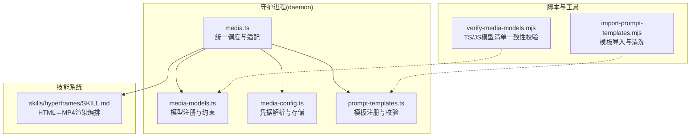
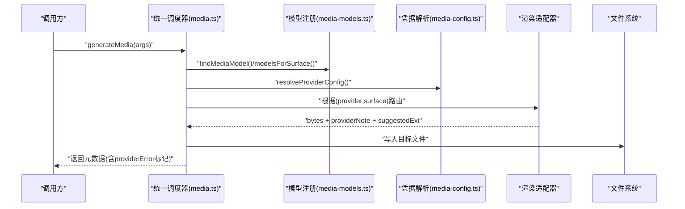
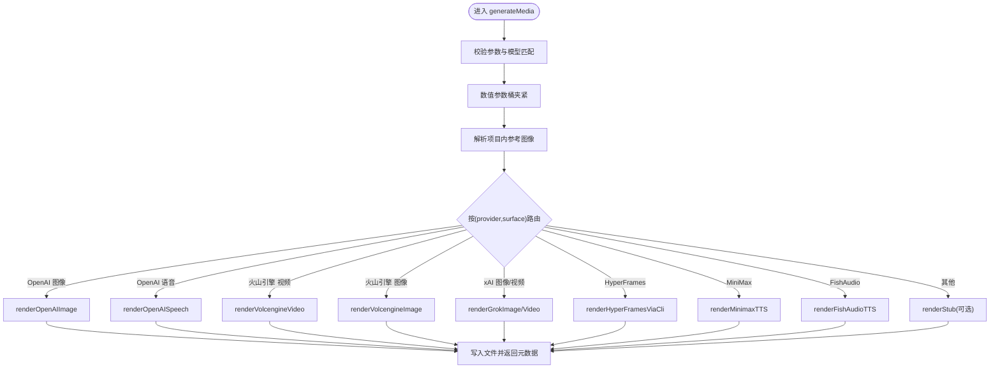
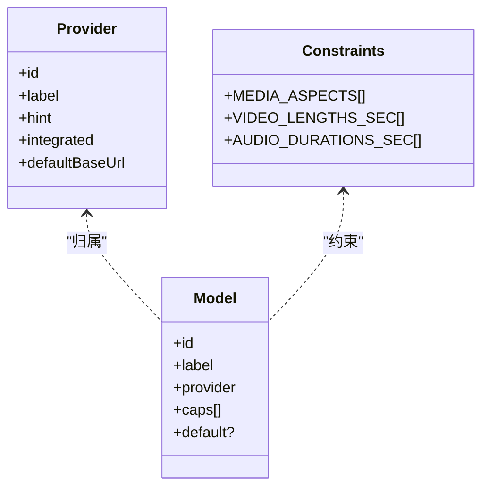
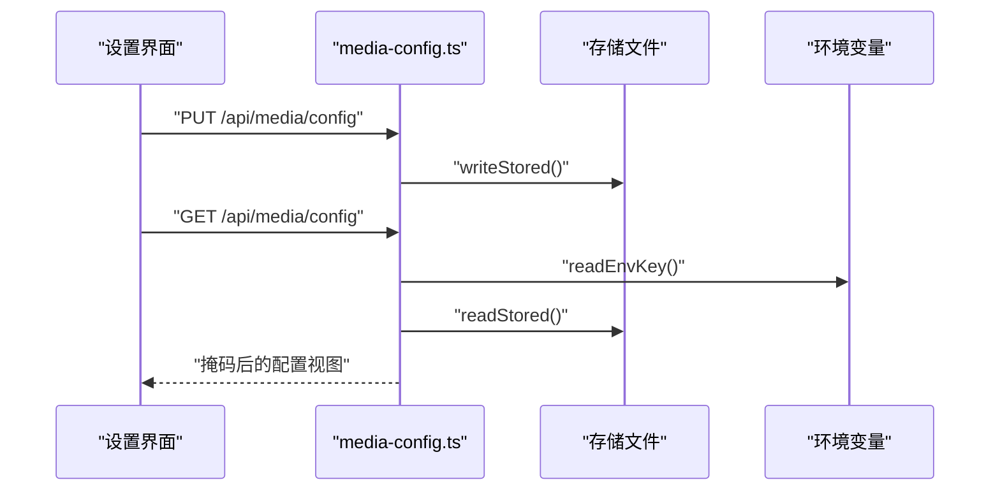
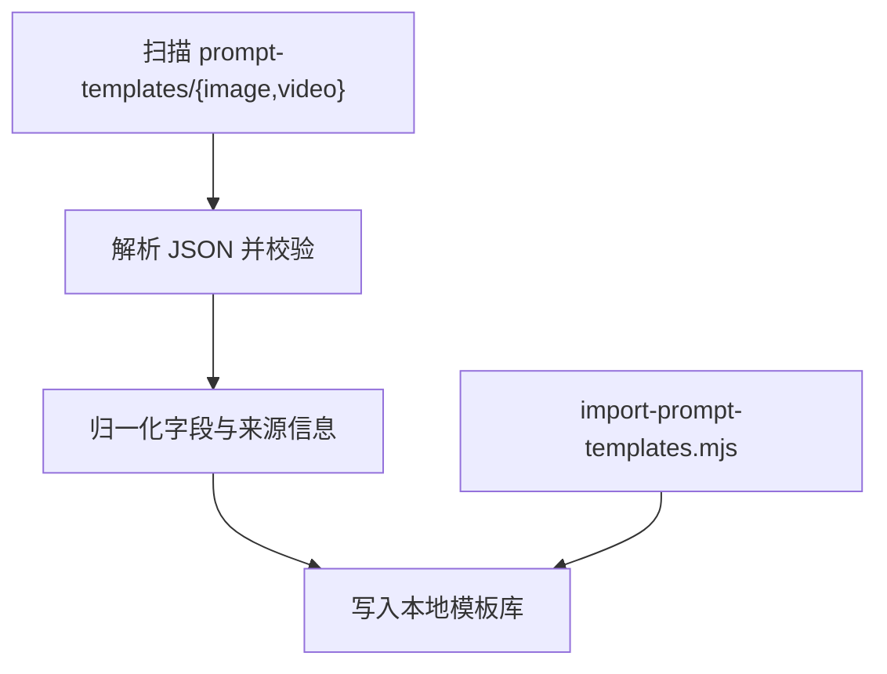
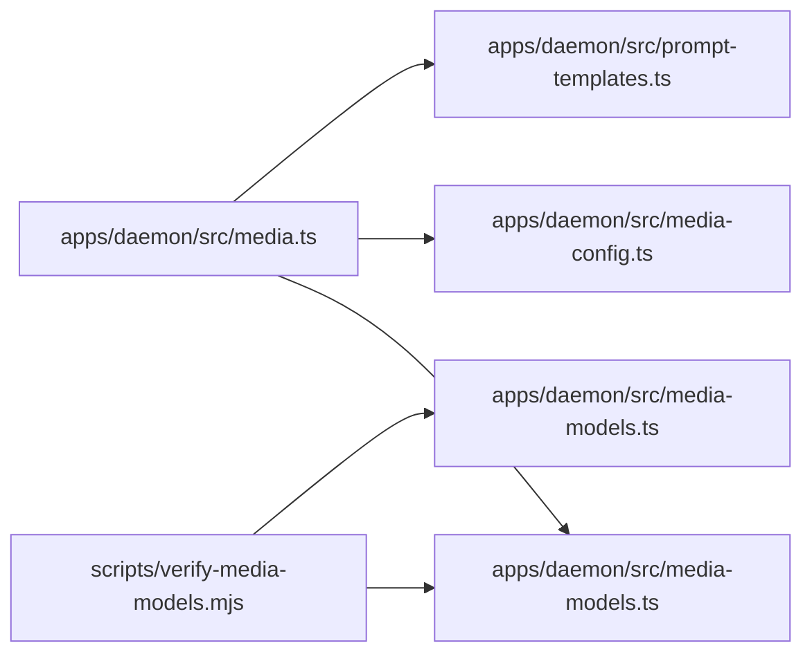

# 媒体生成管道

<cite>
**本文档引用的文件**
- [apps/daemon/src/media.ts](file://apps/daemon/src/media.ts)
- [apps/daemon/src/media-models.ts](file://apps/daemon/src/media-models.ts)
- [apps/daemon/src/media-config.ts](file://apps/daemon/src/media-config.ts)
- [apps/daemon/src/prompt-templates.ts](file://apps/daemon/src/prompt-templates.ts)
- [scripts/verify-media-models.mjs](file://scripts/verify-media-models.mjs)
- [scripts/import-prompt-templates.mjs](file://scripts/import-prompt-templates.mjs)
- [skills/hyperframes/SKILL.md](file://skills/hyperframes/SKILL.md)
</cite>

## 目录
1. [简介](#简介)
2. [项目结构](#项目结构)
3. [核心组件](#核心组件)
4. [架构总览](#架构总览)
5. [详细组件分析](#详细组件分析)
6. [依赖关系分析](#依赖关系分析)
7. [性能考虑](#性能考虑)
8. [故障排除指南](#故障排除指南)
9. [结论](#结论)
10. [附录](#附录)

## 简介
本文件系统性阐述媒体生成管道的设计与实现，覆盖图像、视频、音频三类媒体的统一调度与适配层，重点包括：
- 统一入口与路由：通过单一生成接口分发到不同提供商（OpenAI、火山引擎、xAI、HyperFrames、MiniMax、FishAudio 等）
- 模型注册与约束：严格的模型清单、能力标签、尺寸/时长限制与数值桶校准
- 提示词模板系统：从上游仓库导入与本地手写模板的双轨制，保障创意复用与合规标注
- 配置管理：多来源凭据解析（环境变量、存储文件、OAuth）、安全读取与掩码展示
- 生成流程控制：进度回调、超时与轮询策略、占位符回退与错误传播
- 质量评估：扩展名嗅探、对比度验证、动画映射等质量检查工具链

## 项目结构
媒体生成相关的核心位于后端守护进程模块，前端与技能系统提供提示词模板与渲染编排。

**图表来源**
- [apps/daemon/src/media.ts](file://apps/daemon/src/media.ts)
- [apps/daemon/src/media-models.ts](file://apps/daemon/src/media-models.ts)
- [apps/daemon/src/media-config.ts](file://apps/daemon/src/media-config.ts)
- [apps/daemon/src/prompt-templates.ts](file://apps/daemon/src/prompt-templates.ts)
- [scripts/verify-media-models.mjs](file://scripts/verify-media-models.mjs)
- [scripts/import-prompt-templates.mjs](file://scripts/import-prompt-templates.mjs)
- [skills/hyperframes/SKILL.md](file://skills/hyperframes/SKILL.md)

**章节来源**
- [apps/daemon/src/media.ts](file://apps/daemon/src/media.ts)
- [apps/daemon/src/media-models.ts](file://apps/daemon/src/media-models.ts)
- [apps/daemon/src/media-config.ts](file://apps/daemon/src/media-config.ts)
- [apps/daemon/src/prompt-templates.ts](file://apps/daemon/src/prompt-templates.ts)
- [scripts/verify-media-models.mjs](file://scripts/verify-media-models.mjs)
- [scripts/import-prompt-templates.mjs](file://scripts/import-prompt-templates.mjs)
- [skills/hyperframes/SKILL.md](file://skills/hyperframes/SKILL.md)

## 核心组件
- 统一调度器：负责参数校验、模型与提供商匹配、输出路径安全化、调用真实/占位渲染器、写盘与元数据返回
- 模型注册表：集中定义所有可用模型、提供商、能力标签、默认值与数值桶（时长/音长）
- 凭据解析器：按优先级解析凭据（环境变量 > 存储文件 > OAuth），支持掩码读取与安全写入
- 提示词模板系统：扫描本地模板目录，进行基础字段校验与归一化，支持来源信息与分类标签
- 渲染适配器：针对不同提供商实现具体请求与轮询逻辑，包含占位符回退与错误传播
- 超媒体渲染：HyperFrames 的本地 HTML→MP4 渲染，规避沙箱限制并提供进度流

**章节来源**
- [apps/daemon/src/media.ts](file://apps/daemon/src/media.ts)
- [apps/daemon/src/media-models.ts](file://apps/daemon/src/media-models.ts)
- [apps/daemon/src/media-config.ts](file://apps/daemon/src/media-config.ts)
- [apps/daemon/src/prompt-templates.ts](file://apps/daemon/src/prompt-templates.ts)

## 架构总览
媒体生成采用“统一入口 + 适配层”的分层架构。上层通过 CLI 或代理调用统一生成接口，内部根据模型与表面类型选择对应渲染器；渲染器负责与外部服务交互或本地执行（如 HyperFrames）；最终将字节写入项目目录并返回元数据。

**图表来源**
- [apps/daemon/src/media.ts](file://apps/daemon/src/media.ts)
- [apps/daemon/src/media-models.ts](file://apps/daemon/src/media-models.ts)
- [apps/daemon/src/media-config.ts](file://apps/daemon/src/media-config.ts)

## 详细组件分析

### 统一调度器与适配层
- 参数与约束校验：确保项目根、项目ID、表面类型、模型存在且匹配；对数值参数进行桶内夹紧，防止异常值直达上游
- 安全输入处理：图像参考路径仅允许项目内相对路径，拒绝逃逸；限制最大文件大小；仅允许白名单扩展名
- 输出命名与扩展：自动推导输出名，必要时替换扩展以匹配实际格式
- 占位符回退：当未配置真实提供商或真实调用失败时，按需写入占位符并标记 providerError，便于 CLI/代理区分“未集成”与“调用失败”
- 进度回调：视频类异步任务通过回调实时上报轮询状态，避免长时间静默导致的超时误判

**图表来源**
- [apps/daemon/src/media.ts](file://apps/daemon/src/media.ts)

**章节来源**
- [apps/daemon/src/media.ts](file://apps/daemon/src/media.ts)

### 模型注册与能力约束
- 提供商清单：集中声明已集成/待集成提供商及其默认基地址、是否需要凭据等
- 模型清单：按图像/视频/音频三类组织，每项包含提供商归属、能力标签（如 t2i/i2i/t2v/audio 等）、默认值与注释
- 数值桶：视频时长与音频时长采用离散集合，调度器在生成前进行桶夹紧，避免上游不兼容
- 表面过滤：根据表面类型与音频种类筛选允许的模型列表，防止跨表面组合

**图表来源**
- [apps/daemon/src/media-models.ts](file://apps/daemon/src/media-models.ts)

**章节来源**
- [apps/daemon/src/media-models.ts](file://apps/daemon/src/media-models.ts)

### 凭据解析与安全存储
- 解析顺序：环境变量 > 存储文件 > OAuth（OpenAI/Codex）
- 存储位置：支持自定义目录（OD_MEDIA_CONFIG_DIR/OD_DATA_DIR），默认在项目 .od 下
- 掩码读取：UI 展示时隐藏密钥，仅显示尾部字符或“已配置”状态
- 写入保护：空载写入会触发冲突检测，除非显式 force=true

**图表来源**
- [apps/daemon/src/media-config.ts](file://apps/daemon/src/media-config.ts)

**章节来源**
- [apps/daemon/src/media-config.ts](file://apps/daemon/src/media-config.ts)

### 提示词模板系统
- 扫描策略：遍历 image/video 两个子目录，读取 .json 文件并进行基础校验（id/surface/title/prompt/来源）
- 归一化：提取标题、摘要、分类、标签、预览链接、来源信息等字段
- 导入脚本：从上游仓库抓取并清洗，保留手写模板（非上游来源）

**图表来源**
- [apps/daemon/src/prompt-templates.ts](file://apps/daemon/src/prompt-templates.ts)
- [scripts/import-prompt-templates.mjs](file://scripts/import-prompt-templates.mjs)

**章节来源**
- [apps/daemon/src/prompt-templates.ts](file://apps/daemon/src/prompt-templates.ts)
- [scripts/import-prompt-templates.mjs](file://scripts/import-prompt-templates.mjs)

### 渲染适配器详解

#### OpenAI 图像与语音
- 图像：支持 gpt-image-* 与 dall-e-*，自动识别 Azure 部署并注入 api-key 头；dall-e-* 强制 b64_json；gpt-* 支持 quality 参数
- 语音：支持多种格式与声音，Azure 自动注入 api-key；gpt-4o-mini-tts 支持风格化 instructions

**章节来源**
- [apps/daemon/src/media.ts](file://apps/daemon/src/media.ts)

#### 火山引擎（Doubao）视频/图像
- 视频：提交任务后轮询状态，支持 t2v/i2v，自动拼接分辨率/时长/比例参数；下载完成后返回字节
- 图像：与 OpenAI 兼容的 payload，返回 b64_json 或 url

**章节来源**
- [apps/daemon/src/media.ts](file://apps/daemon/src/media.ts)

#### xAI Grok 图像/视频
- 图像：同步返回，支持 JPEG/PNG/WebP 嗅探扩展
- 视频：异步轮询，上限 15 秒，支持 i2v；超时与状态异常清晰报错

**章节来源**
- [apps/daemon/src/media.ts](file://apps/daemon/src/media.ts)

#### HyperFrames HTML→MP4
- 由守护进程直接运行 npx hyperframes render，规避代理沙箱导致的 Chrome 挂起问题
- 严格校验 compositionDir 不逃逸项目根，输出临时目录，最终只保留 mp4 字节
- 进度流剥离 ANSI 控制符，逐行转发，避免长时间静默

**章节来源**
- [apps/daemon/src/media.ts](file://apps/daemon/src/media.ts)
- [skills/hyperframes/SKILL.md](file://skills/hyperframes/SKILL.md)

#### MiniMax 与 FishAudio 文本转语音
- MiniMax：映射通用 id 到具体模型，返回 hex 编码音频，解析 base_resp 错误
- FishAudio：直接流式下载音频字节，支持 reference_id 选择声音

**章节来源**
- [apps/daemon/src/media.ts](file://apps/daemon/src/media.ts)

### 质量评估与工具链
- 扩展名嗅探：图像响应按魔数判断实际格式，避免扩展名误导
- 对比度验证：WCAG 对比度审计，定位低对比度文本
- 动画映射：生成动画时间线摘要、ASCII 时间轴、死区检测、元素生命周期等
- HyperFrames 质量检查：布局溢出、对比度、动画编排等

**章节来源**
- [apps/daemon/src/media.ts](file://apps/daemon/src/media.ts)
- [skills/hyperframes/SKILL.md](file://skills/hyperframes/SKILL.md)

## 依赖关系分析
- 类型耦合：调度器强依赖模型注册表与凭据解析器；渲染器彼此独立，通过 provider 字段解耦
- 外部依赖：HTTP 客户端访问各提供商 API；本地子进程用于 HyperFrames 渲染
- 数据一致性：TS 前端模型清单与 JS 后端镜像通过脚本校验，CI 强制保持一致

**图表来源**
- [apps/daemon/src/media.ts](file://apps/daemon/src/media.ts)
- [apps/daemon/src/media-models.ts](file://apps/daemon/src/media-models.ts)
- [apps/daemon/src/media-config.ts](file://apps/daemon/src/media-config.ts)
- [apps/daemon/src/prompt-templates.ts](file://apps/daemon/src/prompt-templates.ts)
- [scripts/verify-media-models.mjs](file://scripts/verify-media-models.mjs)

**章节来源**
- [apps/daemon/src/media.ts](file://apps/daemon/src/media.ts)
- [apps/daemon/src/media-models.ts](file://apps/daemon/src/media-models.ts)
- [apps/daemon/src/media-config.ts](file://apps/daemon/src/media-config.ts)
- [apps/daemon/src/prompt-templates.ts](file://apps/daemon/src/prompt-templates.ts)
- [scripts/verify-media-models.mjs](file://scripts/verify-media-models.mjs)

## 性能考虑
- 数值桶夹紧：避免上游不兼容参数导致的重试与浪费
- 轮询节流：视频类异步任务固定 4 秒轮询间隔，结合进度回调降低静默等待
- 本地渲染隔离：HyperFrames 在守护进程内渲染，避免代理沙箱带来的额外开销与不稳定
- 输出扩展自动修正：减少下游格式不匹配导致的二次处理
- 模板导入缓存：一次性抓取并清洗，减少重复网络开销

## 故障排除指南
- 提供商未配置：启用占位符回退需显式允许；否则抛出 StubProviderDisabledError 并返回 503
- 真实调用失败：在允许占位符时写入占位符并标记 providerError，便于 CLI/代理区分“未集成”与“调用失败”
- 超时与状态异常：视频轮询超过阈值或状态异常时，明确提示最后状态与可调整的超时参数
- 进度无输出：代理工具默认超时较短，务必使用 onProgress 回调输出轮询状态
- 图像参考路径错误：必须为项目内相对路径，不得逃逸；过大或不支持的扩展名会被拒绝

**章节来源**
- [apps/daemon/src/media.ts](file://apps/daemon/src/media.ts)

## 结论
该媒体生成管道以“统一入口 + 适配层”为核心，通过严格的模型注册、数值约束与安全凭据管理，实现了对多家提供商的稳定集成；借助提示词模板系统与质量工具链，兼顾创意复用与产出质量。HyperFrames 的本地渲染路径有效规避了代理沙箱问题，保障了复杂 HTML 视频内容的可靠生成。

## 附录

### 最佳实践
- 优先使用模型注册表中的合法组合，避免跨表面与跨种类混用
- 对于视频/音频生成，合理设置时长与时长桶，避免超出上游限制
- 使用提示词模板提升产出一致性与可复用性，注意来源与许可标注
- 在生产环境中禁用占位符回退，确保错误可见性；开发调试时可开启以保证流程可用性

### 性能优化建议
- 将大体积资源上传至专用端点，避免通过调度器携带 base64
- 合理设置轮询上限与日志级别，平衡可观测性与资源消耗
- 对于 HyperFrames，使用单工作进程与合适的输出质量，避免内存峰值过高