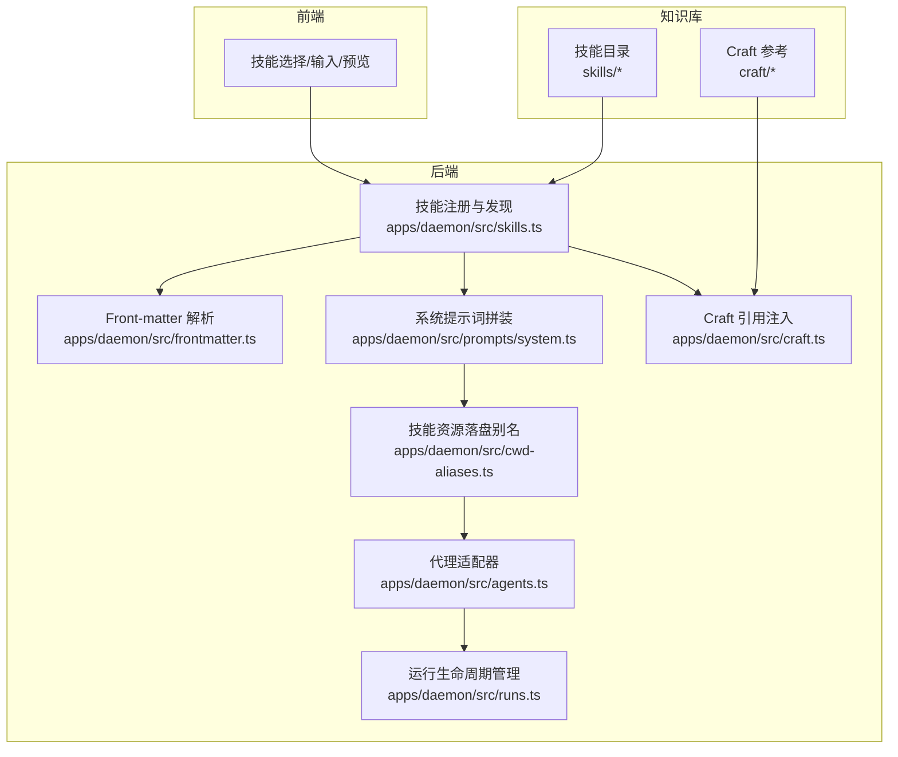
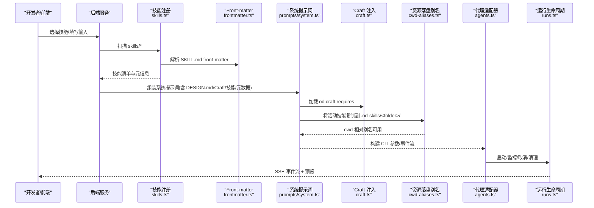
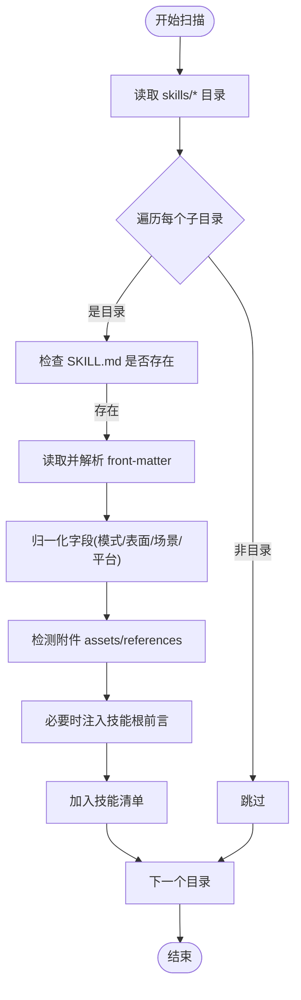
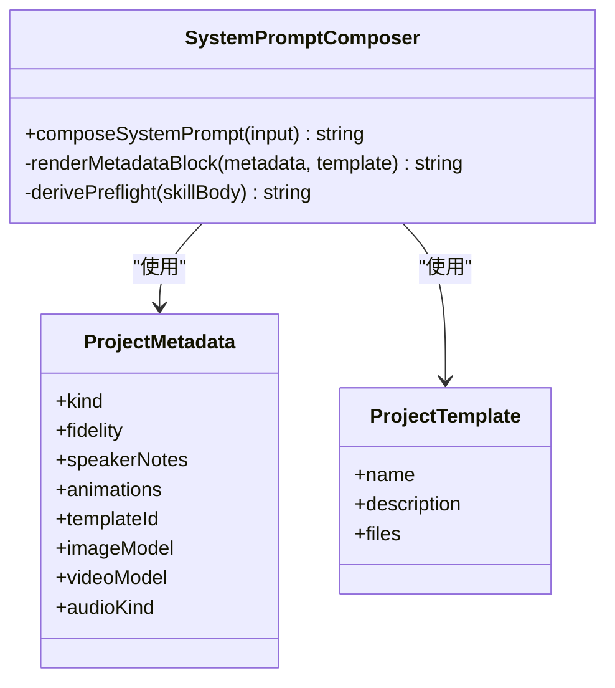
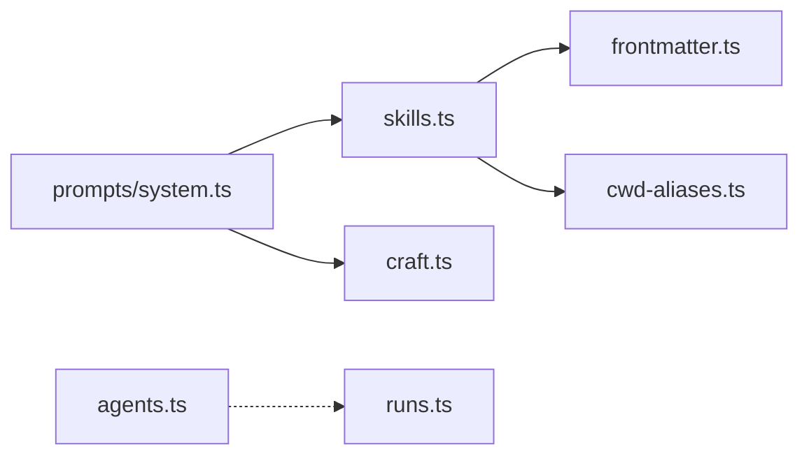

# 技能系统

<cite>
**本文档引用的文件**
- [apps/daemon/src/skills.ts](file://apps/daemon/src/skills.ts)
- [apps/daemon/src/frontmatter.ts](file://apps/daemon/src/frontmatter.ts)
- [apps/daemon/src/craft.ts](file://apps/daemon/src/craft.ts)
- [apps/daemon/src/prompts/system.ts](file://apps/daemon/src/prompts/system.ts)
- [apps/daemon/src/agents.ts](file://apps/daemon/src/agents.ts)
- [apps/daemon/src/runs.ts](file://apps/daemon/src/runs.ts)
- [apps/daemon/src/cwd-aliases.ts](file://apps/daemon/src/cwd-aliases.ts)
- [docs/skills-protocol.md](file://docs/skills-protocol.md)
- [craft/README.md](file://craft/README.md)
- [skills/guizang-ppt/SKILL.md](file://skills/guizang-ppt/SKILL.md)
- [skills/saas-landing/SKILL.md](file://skills/saas-landing/SKILL.md)
</cite>

## 目录
1. [简介](#简介)
2. [项目结构](#项目结构)
3. [核心组件](#核心组件)
4. [架构总览](#架构总览)
5. [详细组件分析](#详细组件分析)
6. [依赖关系分析](#依赖关系分析)
7. [性能考量](#性能考量)
8. [故障排查指南](#故障排查指南)
9. [结论](#结论)
10. [附录](#附录)

## 简介
本文件系统性阐述“技能系统”的架构与实现，覆盖技能注册机制、工作流编排、模板化系统、协议规范、场景分类、依赖管理等关键能力。面向技能作者与平台开发者，提供从设计原则到落地实践的完整指南，并给出大量真实案例与开发示例路径。

## 项目结构
技能系统围绕“技能仓库 + 前端展示 + 后端编排 + 代理执行”四层展开：
- 技能仓库：skills/ 与 craft/ 两大知识轴，前者定义“产物形态”，后者提供“通用设计规范”
- 前端：负责技能选择、输入面板、预览与导出
- 后端：扫描技能、解析 front-matter、拼装系统提示词、调度代理执行
- 代理：Claude Code、Copilot、Pi 等多适配器，统一事件流与权限策略

**图表来源**
- [apps/daemon/src/skills.ts:41-98](file://apps/daemon/src/skills.ts#L41-L98)
- [apps/daemon/src/frontmatter.ts:7-138](file://apps/daemon/src/frontmatter.ts#L7-L138)
- [apps/daemon/src/prompts/system.ts:111-193](file://apps/daemon/src/prompts/system.ts#L111-L193)
- [apps/daemon/src/craft.ts:21-46](file://apps/daemon/src/craft.ts#L21-L46)
- [apps/daemon/src/runs.ts:6-155](file://apps/daemon/src/runs.ts#L6-L155)
- [apps/daemon/src/agents.ts:119-604](file://apps/daemon/src/agents.ts#L119-L604)
- [apps/daemon/src/cwd-aliases.ts:58-133](file://apps/daemon/src/cwd-aliases.ts#L58-L133)

**章节来源**
- [apps/daemon/src/skills.ts:41-98](file://apps/daemon/src/skills.ts#L41-L98)
- [apps/daemon/src/frontmatter.ts:7-138](file://apps/daemon/src/frontmatter.ts#L7-L138)
- [apps/daemon/src/prompts/system.ts:111-193](file://apps/daemon/src/prompts/system.ts#L111-L193)
- [apps/daemon/src/craft.ts:21-46](file://apps/daemon/src/craft.ts#L21-L46)
- [apps/daemon/src/runs.ts:6-155](file://apps/daemon/src/runs.ts#L6-L155)
- [apps/daemon/src/agents.ts:119-604](file://apps/daemon/src/agents.ts#L119-L604)
- [apps/daemon/src/cwd-aliases.ts:58-133](file://apps/daemon/src/cwd-aliases.ts#L58-L133)

## 核心组件
- 技能注册与发现：扫描 skills/*，解析 SKILL.md front-matter，派生模式/表面/场景/平台等元信息，支持别名映射与附件检测
- Front-matter 解析：轻量 YAML 解析器，支持数组、块文本与扁平键值
- Craft 注入：按技能声明的 slug 列表读取 craft/* 并拼接为系统提示词片段
- 系统提示词拼装：按“发现与哲学 → 设计系统 → Craft → 技能 → 项目元数据 → 框架/媒体契约”的顺序叠加
- 代理适配：统一构建 CLI 参数、事件流格式、模型列表探测与能力探测
- 运行生命周期：队列、事件流、取消、清理与 SSE 输出
- 技能资源落盘别名：将活动技能复制到项目内 .od-skills/<folder>/，确保代理侧文件可达

**章节来源**
- [apps/daemon/src/skills.ts:19-98](file://apps/daemon/src/skills.ts#L19-L98)
- [apps/daemon/src/frontmatter.ts:7-138](file://apps/daemon/src/frontmatter.ts#L7-L138)
- [apps/daemon/src/craft.ts:21-46](file://apps/daemon/src/craft.ts#L21-L46)
- [apps/daemon/src/prompts/system.ts:111-193](file://apps/daemon/src/prompts/system.ts#L111-L193)
- [apps/daemon/src/agents.ts:119-604](file://apps/daemon/src/agents.ts#L119-L604)
- [apps/daemon/src/runs.ts:6-155](file://apps/daemon/src/runs.ts#L6-L155)
- [apps/daemon/src/cwd-aliases.ts:58-133](file://apps/daemon/src/cwd-aliases.ts#L58-L133)

## 架构总览
技能系统采用“声明式协议 + 动态编排 + 多代理适配”的架构：
- 协议层：以 SKILL.md 为核心，扩展 od.* 字段描述模式、预览、输入、参数、输出、能力需求等
- 编排层：注册发现 → front-matter 解析 → Craft 注入 → 系统提示词拼装 → 资源落盘 → 代理执行
- 适配层：统一事件流、模型探测、权限策略、流式输出

**图表来源**
- [apps/daemon/src/skills.ts:41-98](file://apps/daemon/src/skills.ts#L41-L98)
- [apps/daemon/src/frontmatter.ts:7-138](file://apps/daemon/src/frontmatter.ts#L7-L138)
- [apps/daemon/src/prompts/system.ts:111-193](file://apps/daemon/src/prompts/system.ts#L111-L193)
- [apps/daemon/src/craft.ts:21-46](file://apps/daemon/src/craft.ts#L21-L46)
- [apps/daemon/src/cwd-aliases.ts:58-133](file://apps/daemon/src/cwd-aliases.ts#L58-L133)
- [apps/daemon/src/agents.ts:119-604](file://apps/daemon/src/agents.ts#L119-L604)
- [apps/daemon/src/runs.ts:6-155](file://apps/daemon/src/runs.ts#L6-L155)

## 详细组件分析

### 技能注册与发现（skills.ts）
- 扫描策略：遍历 skills/* 目录，定位 SKILL.md，解析 front-matter，派生模式/表面/场景/平台等字段
- 元信息归一化：模式自动推断、平台/场景/特性化字段标准化、Craft 依赖规范化
- 附件检测：判断是否存在 assets/references 等侧文件，决定是否注入技能根前言
- 别名映射：提供 SKILL_ID_ALIASES，兼容历史 ID，findSkillById 统一解析

**图表来源**
- [apps/daemon/src/skills.ts:41-98](file://apps/daemon/src/skills.ts#L41-L98)
- [apps/daemon/src/skills.ts:121-140](file://apps/daemon/src/skills.ts#L121-L140)

**章节来源**
- [apps/daemon/src/skills.ts:19-98](file://apps/daemon/src/skills.ts#L19-L98)
- [apps/daemon/src/skills.ts:121-140](file://apps/daemon/src/skills.ts#L121-L140)

### Front-matter 解析（frontmatter.ts）
- 轻量 YAML 解析：支持标量、数组、块文本、扁平对象，满足 SKILL.md 使用场景
- 无外部依赖：减少运行时复杂度，提升稳定性

**章节来源**
- [apps/daemon/src/frontmatter.ts:7-138](file://apps/daemon/src/frontmatter.ts#L7-L138)

### Craft 注入（craft.ts）
- 按需加载：仅加载技能声明的 od.craft.requires 中的 slug
- 容错策略：文件不存在静默忽略，支持未来扩展
- 结构化注入：为每个 slug 添加三级标题，拼接分隔线，形成系统提示词片段

**章节来源**
- [apps/daemon/src/craft.ts:21-46](file://apps/daemon/src/craft.ts#L21-L46)
- [craft/README.md:20-44](file://craft/README.md#L20-L44)

### 系统提示词拼装（prompts/system.ts）
- 层次化叠加：发现与哲学 → 设计系统 → Craft → 技能 → 项目元数据 → 框架/媒体契约
- 预检指令：针对携带 seed/references 的技能，自动生成“先读侧文件”的硬性前置步骤
- 媒体表面契约：图像/视频/音频项目注入专用生成合约，禁止直接产出 HTML

**图表来源**
- [apps/daemon/src/prompts/system.ts:111-193](file://apps/daemon/src/prompts/system.ts#L111-L193)
- [apps/daemon/src/prompts/system.ts:195-377](file://apps/daemon/src/prompts/system.ts#L195-L377)

**章节来源**
- [apps/daemon/src/prompts/system.ts:111-193](file://apps/daemon/src/prompts/system.ts#L111-L193)
- [apps/daemon/src/prompts/system.ts:195-377](file://apps/daemon/src/prompts/system.ts#L195-L377)

### 代理适配（agents.ts）
- 多适配器：Claude Code、Copilot、Pi、Cursor Agent 等，统一构建参数、事件流格式
- 能力探测：通过 --help 识别特性标志，动态启用/禁用可选参数
- 模型列表：优先从 CLI 获取，失败回退静态提示，部分适配器支持自定义 fetchModels

**章节来源**
- [apps/daemon/src/agents.ts:119-604](file://apps/daemon/src/agents.ts#L119-L604)

### 运行生命周期（runs.ts）
- 事件驱动：Map 存储运行状态，SSE 推送事件，支持客户端断线重连
- 生命周期：queued → running → succeeded/failed/canceled，定时清理
- 取消机制：SIGTERM 优雅终止子进程

**章节来源**
- [apps/daemon/src/runs.ts:6-155](file://apps/daemon/src/runs.ts#L6-L155)

### 技能资源落盘别名（cwd-aliases.ts）
- 目的：解决代理工作目录限制，确保 assets/references 等侧文件可通过 cwd 相对路径访问
- 安全：全量复制并去引用，杜绝写回源文件的风险
- 稳健：失败时保留绝对路径回退方案

**章节来源**
- [apps/daemon/src/cwd-aliases.ts:58-133](file://apps/daemon/src/cwd-aliases.ts#L58-L133)

### 技能协议与工作流（skills-protocol.md）
- 协议基础：沿用 Claude Code 的 SKILL.md 约定，扩展 od.* 字段
- 模式体系：prototype/deck/template/design-system/image/video/audio
- 场景分类：general/engineering/product/design/marketing/sales/finance/hr/operations/support/legal/education/personal
- 安装与优先级：项目私有 > 项目提交 > 用户全局，冲突按优先级覆盖
- 示例：guizang-ppt 与 saas-landing 的最小实现

**章节来源**
- [docs/skills-protocol.md:125-151](file://docs/skills-protocol.md#L125-L151)
- [docs/skills-protocol.md:152-188](file://docs/skills-protocol.md#L152-L188)
- [docs/skills-protocol.md:245-261](file://docs/skills-protocol.md#L245-L261)
- [docs/skills-protocol.md:284-336](file://docs/skills-protocol.md#L284-L336)

### 实战案例
- guizang-ppt：完整的“杂志风网页 PPT”技能，包含触发词、模式、场景、预览、示例提示、上游仓库等
- saas-landing：最小但完整的原型技能，演示输入/参数/输出/能力需求的声明与工作流

**章节来源**
- [skills/guizang-ppt/SKILL.md:1-315](file://skills/guizang-ppt/SKILL.md#L1-L315)
- [skills/saas-landing/SKILL.md:1-125](file://skills/saas-landing/SKILL.md#L1-L125)

## 依赖关系分析
- 组件耦合
  - skills.ts 依赖 frontmatter.ts 与 cwd-aliases.ts 的辅助函数
  - prompts/system.ts 依赖 craft.ts 与内置框架/媒体契约
  - agents.ts 与 runs.ts 彼此独立，通过事件流交互
- 外部依赖
  - 代理 CLI 的能力探测与模型列表获取
  - 文件系统：技能目录扫描、Craft 文件读取、资源复制

**图表来源**
- [apps/daemon/src/skills.ts:6-9](file://apps/daemon/src/skills.ts#L6-L9)
- [apps/daemon/src/prompts/system.ts:32-36](file://apps/daemon/src/prompts/system.ts#L32-L36)
- [apps/daemon/src/agents.ts:119-604](file://apps/daemon/src/agents.ts#L119-L604)
- [apps/daemon/src/runs.ts:6-155](file://apps/daemon/src/runs.ts#L6-L155)

**章节来源**
- [apps/daemon/src/skills.ts:6-9](file://apps/daemon/src/skills.ts#L6-L9)
- [apps/daemon/src/prompts/system.ts:32-36](file://apps/daemon/src/prompts/system.ts#L32-L36)
- [apps/daemon/src/agents.ts:119-604](file://apps/daemon/src/agents.ts#L119-L604)
- [apps/daemon/src/runs.ts:6-155](file://apps/daemon/src/runs.ts#L6-L155)

## 性能考量
- 技能扫描：当前为“每次请求重新扫描”，适用于少量技能场景；可引入缓存与文件系统监听优化
- 提示词拼装：按需注入 Craft 与侧文件，避免冗余上下文
- 事件流：SSE 限制事件数量与 TTL，防止内存膨胀
- 代理参数：按能力探测启用特性标志，避免无效参数导致的启动失败

[本节为通用指导，无需特定文件引用]

## 故障排查指南
- 技能未出现在列表
  - 检查 SKILL.md 是否存在，front-matter 是否可解析
  - 确认目录名与 id 是否一致，必要时使用别名映射
- 预览无法加载侧文件
  - 确认 .od-skills/<folder>/ 是否成功复制
  - 检查代理是否具备 --add-dir 或 cwd 访问权限
- 代理执行异常
  - 查看 runs.ts 的错误事件与退出码
  - 核对 agents.ts 的能力探测结果与模型列表
- Craft 注入缺失
  - 确认 od.craft.requires 的 slug 是否与 craft/* 文件名匹配
  - 未知 slug 将被静默忽略，属预期行为

**章节来源**
- [apps/daemon/src/skills.ts:19-39](file://apps/daemon/src/skills.ts#L19-L39)
- [apps/daemon/src/cwd-aliases.ts:58-133](file://apps/daemon/src/cwd-aliases.ts#L58-L133)
- [apps/daemon/src/runs.ts:85-88](file://apps/daemon/src/runs.ts#L85-L88)
- [apps/daemon/src/agents.ts:733-775](file://apps/daemon/src/agents.ts#L733-L775)
- [craft/README.md:35-44](file://craft/README.md#L35-L44)

## 结论
技能系统通过“协议 + 编排 + 适配”的分层设计，实现了可扩展、可演进的技能生态。其关键优势在于：
- 声明式协议与零配置兼容，降低迁移成本
- 动态编排与按需注入，兼顾灵活性与效率
- 多代理适配与事件驱动，保障跨环境一致性
面向未来，可在缓存/监听、提示词压缩、技能组合等方面进一步优化。

[本节为总结性内容，无需特定文件引用]

## 附录

### 技能开发指南（步骤清单）
- 创建目录与 SKILL.md，编写描述与触发词
- 在 od: 中声明模式、预览、输入、参数、输出、能力需求
- 如需通用规范，添加 od.craft.requires
- 如需侧文件，放置 assets/ 与 references/，并在工作流中明确读取顺序
- 编写清晰的工作流步骤，必要时在技能体内强调“先读侧文件”
- 使用示例：参考 guizang-ppt 与 saas-landing 的最小实现

**章节来源**
- [docs/skills-protocol.md:284-336](file://docs/skills-protocol.md#L284-L336)
- [skills/guizang-ppt/SKILL.md:1-315](file://skills/guizang-ppt/SKILL.md#L1-L315)
- [skills/saas-landing/SKILL.md:1-125](file://skills/saas-landing/SKILL.md#L1-L125)

### 场景分类体系
- general/engineering/product/design/marketing/sales/finance/hr/operations/support/legal/education/personal
- 未知值透传，便于实验与扩展

**章节来源**
- [apps/daemon/src/skills.ts:268-300](file://apps/daemon/src/skills.ts#L268-L300)

### 模板系统与资源落盘
- 技能侧文件通过 cwd-aliases.ts 复制到 .od-skills/<folder>/，提供 cwd 相对路径
- 代理侧回退：绝对路径 + --add-dir（Claude/Copilot）

**章节来源**
- [apps/daemon/src/cwd-aliases.ts:58-133](file://apps/daemon/src/cwd-aliases.ts#L58-L133)
- [apps/daemon/src/skills.ts:121-140](file://apps/daemon/src/skills.ts#L121-L140)