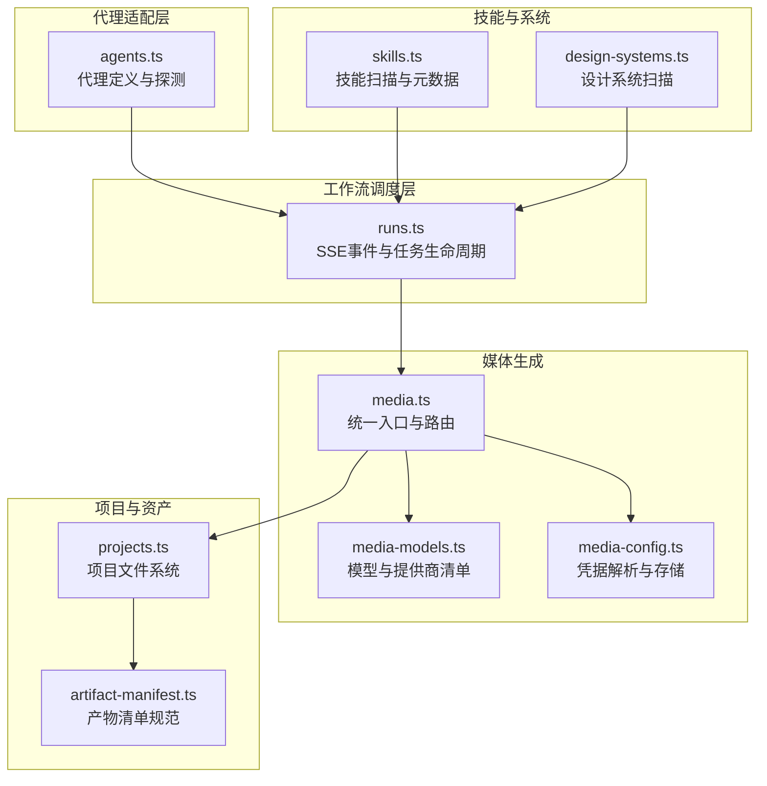
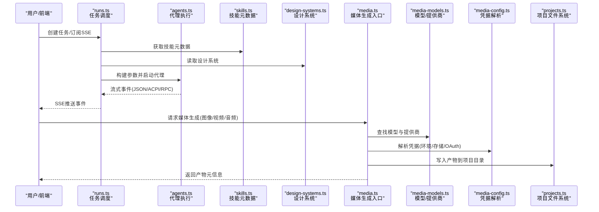
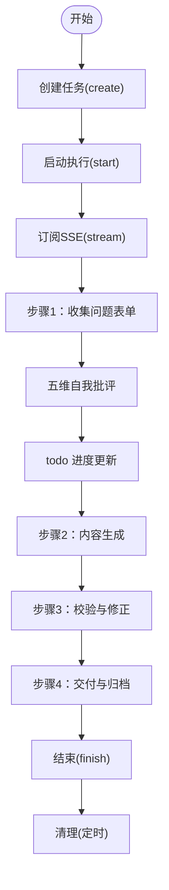
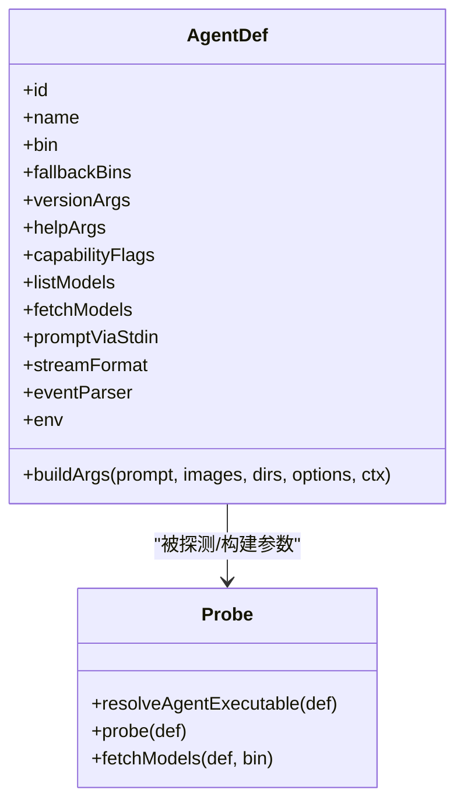
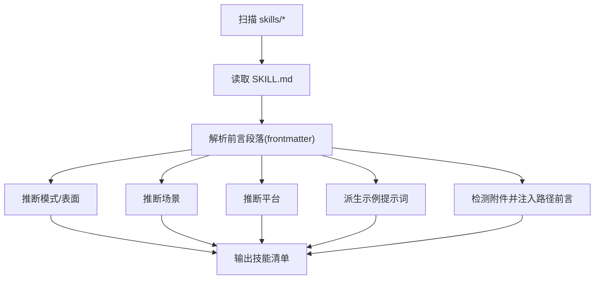
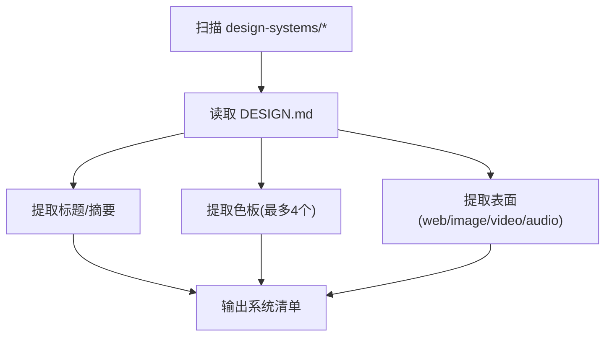
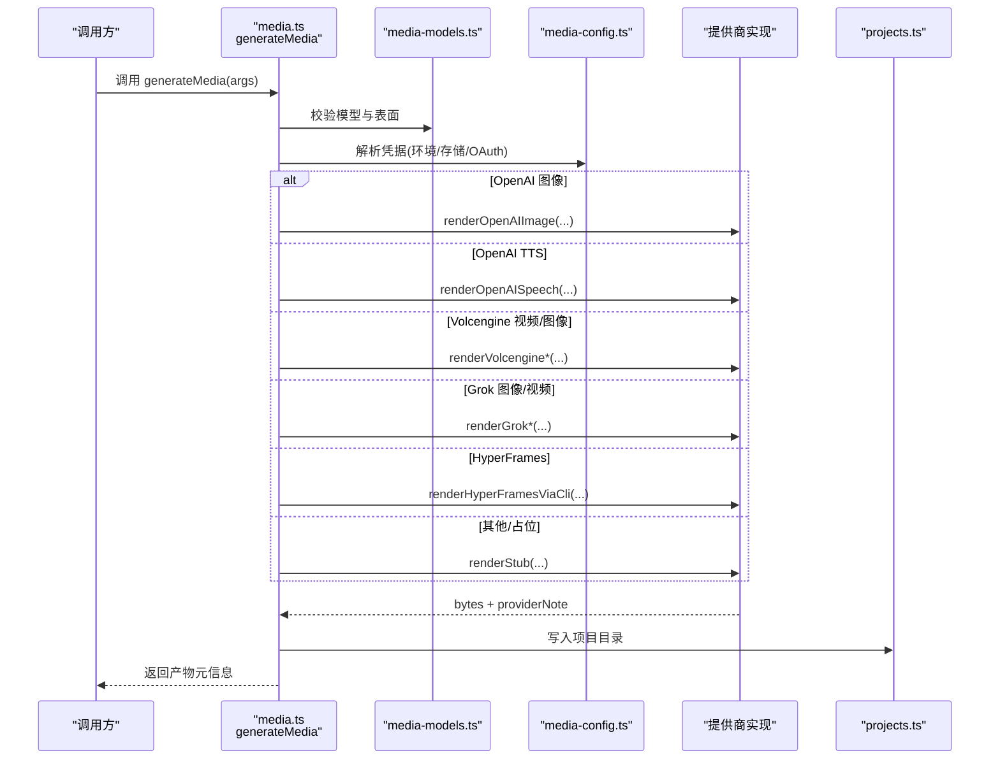
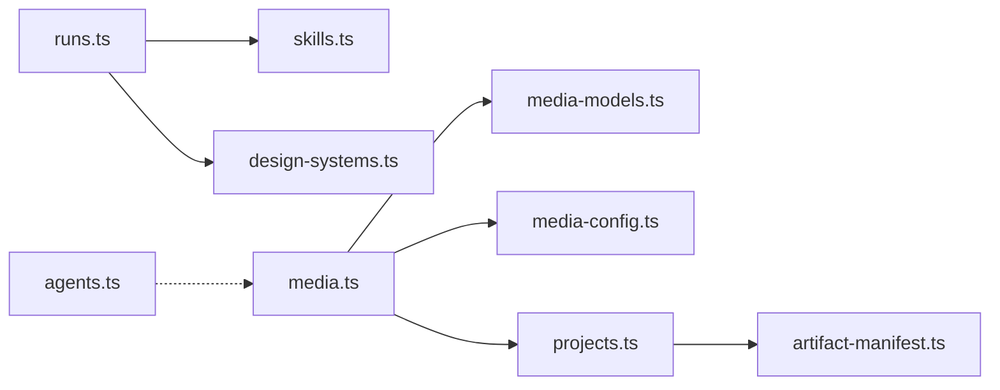

# 核心功能模块

<cite>
**本文引用的文件**
- [apps/daemon/src/skills.ts](file://apps/daemon/src/skills.ts)
- [apps/daemon/src/agents.ts](file://apps/daemon/src/agents.ts)
- [apps/daemon/src/media.ts](file://apps/daemon/src/media.ts)
- [apps/daemon/src/media-models.ts](file://apps/daemon/src/media-models.ts)
- [apps/daemon/src/media-config.ts](file://apps/daemon/src/media-config.ts)
- [apps/daemon/src/design-systems.ts](file://apps/daemon/src/design-systems.ts)
- [apps/daemon/src/runs.ts](file://apps/daemon/src/runs.ts)
- [apps/daemon/src/projects.ts](file://apps/daemon/src/projects.ts)
- [apps/daemon/src/frontmatter.ts](file://apps/daemon/src/frontmatter.ts)
- [apps/daemon/src/artifact-manifest.ts](file://apps/daemon/src/artifact-manifest.ts)
- [skills/open-design-landing/SKILL.md](file://skills/open-design-landing/SKILL.md)
- [design-systems/default/DESIGN.md](file://design-systems/default/DESIGN.md)
- [design-systems/README.md](file://design-systems/README.md)
</cite>

## 目录
1. [引言](#引言)
2. [项目结构](#项目结构)
3. [核心组件](#核心组件)
4. [架构总览](#架构总览)
5. [详细组件分析](#详细组件分析)
6. [依赖分析](#依赖分析)
7. [性能考虑](#性能考虑)
8. [故障排查指南](#故障排查指南)
9. [结论](#结论)
10. [附录](#附录)

## 引言
本文件面向 Open Design 的核心功能模块，系统化梳理以下五大能力：
- 设计工作流引擎：问题表单、五维自我批评、实时 todo 进度
- 代理适配器系统：13 种代理 CLI 支持、流式协议解析
- 技能系统：31 个可扩展的设计技能、场景分类
- 设计系统库：72 个品牌级设计系统、DESIGN.md 标准
- 媒体生成管道：图像、视频、音频生成

文档从实现原理、配置选项、使用模式与模块间集成关系入手，辅以流程图与时序图，帮助读者快速掌握从“需求输入”到“产物交付”的全链路。

## 项目结构
Open Design 的核心运行时位于 apps/daemon，采用“按职责分层 + 模块化技能”的组织方式：
- 代理适配层：apps/daemon/src/agents.ts 统一探测与调用多厂商 CLI，抽象出统一的流式事件模型
- 工作流调度层：apps/daemon/src/runs.ts 提供 SSE 流式事件与任务生命周期管理
- 技能注册与元数据：apps/daemon/src/skills.ts 扫描 skills/* 并解析 SKILL.md 前言段落
- 设计系统注册：apps/daemon/src/design-systems.ts 扫描 design-systems/* 并解析 DESIGN.md
- 媒体生成：apps/daemon/src/media.ts 作为统一入口，路由到各提供商或占位渲染
- 项目文件系统：apps/daemon/src/projects.ts 管理项目目录、归档与清单
- 资产清单：apps/daemon/src/artifact-manifest.ts 规范产物元数据与导出

图表来源
- [apps/daemon/src/agents.ts:119-604](file://apps/daemon/src/agents.ts#L119-L604)
- [apps/daemon/src/runs.ts:6-154](file://apps/daemon/src/runs.ts#L6-L154)
- [apps/daemon/src/skills.ts:41-98](file://apps/daemon/src/skills.ts#L41-L98)
- [apps/daemon/src/design-systems.ts:10-41](file://apps/daemon/src/design-systems.ts#L10-L41)
- [apps/daemon/src/media.ts:210-473](file://apps/daemon/src/media.ts#L210-L473)
- [apps/daemon/src/media-models.ts:11-134](file://apps/daemon/src/media-models.ts#L11-L134)
- [apps/daemon/src/media-config.ts:101-232](file://apps/daemon/src/media-config.ts#L101-L232)
- [apps/daemon/src/projects.ts:26-323](file://apps/daemon/src/projects.ts#L26-L323)
- [apps/daemon/src/artifact-manifest.ts:72-200](file://apps/daemon/src/artifact-manifest.ts#L72-L200)

章节来源
- [apps/daemon/src/agents.ts:119-604](file://apps/daemon/src/agents.ts#L119-L604)
- [apps/daemon/src/runs.ts:6-154](file://apps/daemon/src/runs.ts#L6-L154)
- [apps/daemon/src/skills.ts:41-98](file://apps/daemon/src/skills.ts#L41-L98)
- [apps/daemon/src/design-systems.ts:10-41](file://apps/daemon/src/design-systems.ts#L10-L41)
- [apps/daemon/src/media.ts:210-473](file://apps/daemon/src/media.ts#L210-L473)
- [apps/daemon/src/media-models.ts:11-134](file://apps/daemon/src/media-models.ts#L11-L134)
- [apps/daemon/src/media-config.ts:101-232](file://apps/daemon/src/media-config.ts#L101-L232)
- [apps/daemon/src/projects.ts:26-323](file://apps/daemon/src/projects.ts#L26-L323)
- [apps/daemon/src/artifact-manifest.ts:72-200](file://apps/daemon/src/artifact-manifest.ts#L72-L200)

## 核心组件
- 代理适配器系统：内置 13 种代理定义，支持模型列表探测、权限与能力标志、流式事件解析、环境变量与凭据注入等
- 设计工作流引擎：通过 runs.ts 的 SSE 事件流承载“问题表单收集—五维自我批评—todo 进度”三阶段；结合技能与设计系统注入系统提示词
- 技能系统：扫描 skills/*，解析 SKILL.md 前言段落，推导模式/表面/场景/平台等元信息，支持示例提示词派生与附件路径前言
- 设计系统库：扫描 design-systems/*，解析 DESIGN.md，提取标题、摘要、色板与表面类型，支持分类与预览
- 媒体生成管道：统一入口 media.ts，按模型提供商路由至真实服务或本地占位渲染，支持图像/视频/音频三类表面

章节来源
- [apps/daemon/src/agents.ts:119-604](file://apps/daemon/src/agents.ts#L119-L604)
- [apps/daemon/src/runs.ts:6-154](file://apps/daemon/src/runs.ts#L6-L154)
- [apps/daemon/src/skills.ts:41-98](file://apps/daemon/src/skills.ts#L41-L98)
- [apps/daemon/src/design-systems.ts:10-41](file://apps/daemon/src/design-systems.ts#L10-L41)
- [apps/daemon/src/media.ts:210-473](file://apps/daemon/src/media.ts#L210-L473)

## 架构总览
下图展示从“用户请求/技能触发”到“媒体生成/产物写入”的端到端流程：

图表来源
- [apps/daemon/src/runs.ts:6-154](file://apps/daemon/src/runs.ts#L6-L154)
- [apps/daemon/src/agents.ts:119-604](file://apps/daemon/src/agents.ts#L119-L604)
- [apps/daemon/src/skills.ts:41-98](file://apps/daemon/src/skills.ts#L41-L98)
- [apps/daemon/src/design-systems.ts:10-41](file://apps/daemon/src/design-systems.ts#L10-L41)
- [apps/daemon/src/media.ts:210-473](file://apps/daemon/src/media.ts#L210-L473)
- [apps/daemon/src/media-models.ts:11-134](file://apps/daemon/src/media-models.ts#L11-L134)
- [apps/daemon/src/media-config.ts:220-232](file://apps/daemon/src/media-config.ts#L220-L232)
- [apps/daemon/src/projects.ts:26-323](file://apps/daemon/src/projects.ts#L26-L323)

## 详细组件分析

### 设计工作流引擎（问题表单、五维自我批评、实时 todo 进度）
- 任务生命周期：runs.ts 提供 create/start/stream/cancel/wait/finish/fail 等接口，维护事件队列与客户端集合，支持 Last-Event-ID 断点续拉
- 实时进度：通过 SSE 推送事件，前端可订阅任务 id，按需回放历史事件并接收增量更新
- 自我批评注入：在系统提示词中注入“五维自我批评”模板（例如从技能元数据或设计系统中抽取），由代理在生成过程中进行自检与迭代
- todo 进度：结合技能的步骤清单（如 open-design-landing 的四步流程），在每一步完成后标记状态并通过 SSE 通知前端

图表来源
- [apps/daemon/src/runs.ts:6-154](file://apps/daemon/src/runs.ts#L6-L154)
- [skills/open-design-landing/SKILL.md:162-278](file://skills/open-design-landing/SKILL.md#L162-L278)

章节来源
- [apps/daemon/src/runs.ts:6-154](file://apps/daemon/src/runs.ts#L6-L154)
- [skills/open-design-landing/SKILL.md:162-278](file://skills/open-design-landing/SKILL.md#L162-L278)

### 代理适配器系统（13 种代理 CLI 支持、流式协议解析）
- 代理定义：包含二进制名、版本/帮助参数、能力标志、模型列表探测、构建参数、流格式与事件解析器等
- 能力探测：通过 --help 字符串匹配设置 agentCapabilities，按能力开关拼接参数（如 --include-partial-messages、--add-dir）
- 流式协议：
  - claude-stream-json：解析 Claude Code 的 JSON 事件流
  - acp-json-rpc：Pi/Devin/Hermes/Kiro/Mistral 等 ACP 协议
  - json-event-stream：Gemini/OpenCode/Cursor/Qwen/Copilot 等 JSONL
  - plain：部分 CLI 直接转发原始文本
- 权限与安全：默认启用非交互模式与工作区信任策略，避免 UI 中出现“写/编辑”弹窗

图表来源
- [apps/daemon/src/agents.ts:119-796](file://apps/daemon/src/agents.ts#L119-L796)

章节来源
- [apps/daemon/src/agents.ts:119-796](file://apps/daemon/src/agents.ts#L119-L796)

### 技能系统（31 个可扩展的设计技能、场景分类）
- 技能发现：扫描 skills/* 目录，要求存在 SKILL.md，解析前言段落（name/description/triggers/od.* 等）
- 元信息推导：
  - 模式/表面：从正文/描述中自动推断 image/video/audio/deck/design-system/template/prototype
  - 场景：工程/产品/设计/营销/销售/财务/HR/运营/法务/教育/个人
  - 平台：桌面/移动端（基于描述自动识别）
  - 示例提示词：优先使用 od.example_prompt，否则从 description 的首句截断
- 附件路径前言：当技能包含 assets/references 等侧文件时，为代理提供相对/绝对路径提示，确保在不同工作目录下可访问

图表来源
- [apps/daemon/src/skills.ts:41-98](file://apps/daemon/src/skills.ts#L41-L98)
- [apps/daemon/src/frontmatter.ts:7-137](file://apps/daemon/src/frontmatter.ts#L7-L137)

章节来源
- [apps/daemon/src/skills.ts:41-98](file://apps/daemon/src/skills.ts#L41-L98)
- [apps/daemon/src/frontmatter.ts:7-137](file://apps/daemon/src/frontmatter.ts#L7-L137)
- [skills/open-design-landing/SKILL.md:1-114](file://skills/open-design-landing/SKILL.md#L1-L114)

### 设计系统库（72 个品牌级设计系统、DESIGN.md 标准）
- 设计系统发现：扫描 design-systems/*，要求存在 DESIGN.md，解析标题、摘要、色板与表面
- 分类与预览：支持 Category/Surface 元数据，提取代表性色板用于筛选器预览
- 同步与刷新：README 列举了 70 个产品系统来源与同步方法

图表来源
- [apps/daemon/src/design-systems.ts:10-41](file://apps/daemon/src/design-systems.ts#L10-L41)
- [design-systems/README.md:1-98](file://design-systems/README.md#L1-L98)

章节来源
- [apps/daemon/src/design-systems.ts:10-41](file://apps/daemon/src/design-systems.ts#L10-L41)
- [design-systems/README.md:1-98](file://design-systems/README.md#L1-L98)
- [design-systems/default/DESIGN.md:1-63](file://design-systems/default/DESIGN.md#L1-L63)

### 媒体生成管道（图像、视频、音频生成）
- 统一入口：generateMedia(args) 接收 surface/model/prompt/output 等参数，校验模型与表面匹配、数值约束与项目路径安全
- 提供商路由：根据模型提供商映射到具体实现（OpenAI/Volcengine/Grok/HyperFrames/Minimax/FishAudio 等）
- 凭据解析：优先环境变量，其次本地存储，再退回到 Codex/Hermes OAuth（OpenAI）
- 占位与错误处理：未集成的 (provider,surface) 对返回确定性占位；真实提供商失败时在允许条件下回落到占位，并标注 providerError
- 输出命名：自动输出名包含时间戳与模型片段，必要时替换扩展名以匹配真实返回

图表来源
- [apps/daemon/src/media.ts:210-473](file://apps/daemon/src/media.ts#L210-L473)
- [apps/daemon/src/media-models.ts:11-134](file://apps/daemon/src/media-models.ts#L11-L134)
- [apps/daemon/src/media-config.ts:220-232](file://apps/daemon/src/media-config.ts#L220-L232)
- [apps/daemon/src/projects.ts:26-323](file://apps/daemon/src/projects.ts#L26-L323)

章节来源
- [apps/daemon/src/media.ts:210-473](file://apps/daemon/src/media.ts#L210-L473)
- [apps/daemon/src/media-models.ts:11-134](file://apps/daemon/src/media-models.ts#L11-L134)
- [apps/daemon/src/media-config.ts:220-232](file://apps/daemon/src/media-config.ts#L220-L232)
- [apps/daemon/src/projects.ts:26-323](file://apps/daemon/src/projects.ts#L26-L323)

## 依赖分析
- 组件耦合
  - runs.ts 依赖 skills.ts 与 design-systems.ts 提供系统提示词与上下文
  - media.ts 依赖 media-models.ts 与 media-config.ts 完成模型选择与凭据解析
  - projects.ts 为 media.ts 与前端提供文件系统与归档能力
  - artifact-manifest.ts 与 projects.ts 协同记录产物元数据与导出
- 外部依赖
  - 代理 CLI（Claude/Copilot/Gemini/OpenCode/Cursor/Qwen/Pi/Devin/Hermes/Kimi/Kiro/Vibe 等）通过子进程调用
  - 媒体提供商（OpenAI/Volcengine/Grok/Minimax/FishAudio 等）通过 HTTP/JSON 或本地 CLI 驱动

图表来源
- [apps/daemon/src/runs.ts:6-154](file://apps/daemon/src/runs.ts#L6-L154)
- [apps/daemon/src/skills.ts:41-98](file://apps/daemon/src/skills.ts#L41-L98)
- [apps/daemon/src/design-systems.ts:10-41](file://apps/daemon/src/design-systems.ts#L10-L41)
- [apps/daemon/src/media.ts:210-473](file://apps/daemon/src/media.ts#L210-L473)
- [apps/daemon/src/media-models.ts:11-134](file://apps/daemon/src/media-models.ts#L11-L134)
- [apps/daemon/src/media-config.ts:220-232](file://apps/daemon/src/media-config.ts#L220-L232)
- [apps/daemon/src/projects.ts:26-323](file://apps/daemon/src/projects.ts#L26-L323)
- [apps/daemon/src/artifact-manifest.ts:72-200](file://apps/daemon/src/artifact-manifest.ts#L72-L200)
- [apps/daemon/src/agents.ts:119-604](file://apps/daemon/src/agents.ts#L119-L604)

章节来源
- [apps/daemon/src/runs.ts:6-154](file://apps/daemon/src/runs.ts#L6-L154)
- [apps/daemon/src/skills.ts:41-98](file://apps/daemon/src/skills.ts#L41-L98)
- [apps/daemon/src/design-systems.ts:10-41](file://apps/daemon/src/design-systems.ts#L10-L41)
- [apps/daemon/src/media.ts:210-473](file://apps/daemon/src/media.ts#L210-L473)
- [apps/daemon/src/media-models.ts:11-134](file://apps/daemon/src/media-models.ts#L11-L134)
- [apps/daemon/src/media-config.ts:220-232](file://apps/daemon/src/media-config.ts#L220-L232)
- [apps/daemon/src/projects.ts:26-323](file://apps/daemon/src/projects.ts#L26-L323)
- [apps/daemon/src/artifact-manifest.ts:72-200](file://apps/daemon/src/artifact-manifest.ts#L72-L200)
- [apps/daemon/src/agents.ts:119-604](file://apps/daemon/src/agents.ts#L119-L604)

## 性能考虑
- 代理探测缓存：对 PATH 与工具链目录进行 TTL 缓存，减少重复扫描开销
- 事件流节流：runs.ts 限制最大事件数并滚动丢弃旧事件，避免内存膨胀
- 模型列表异步：对不支持 listModels 的 CLI 使用 fallbackModels，避免阻塞
- 媒体生成约束：对数值参数进行桶式裁剪，防止上游调用超限
- 文件系统安全：projects.ts 对路径进行严格校验，避免越权访问

## 故障排查指南
- 代理不可用
  - 现象：可用性为 false 或能力标志缺失
  - 排查：确认二进制是否在 PATH，帮助字符串是否包含目标标志；检查版本/模型列表探测是否超时
- 流式事件异常
  - 现象：SSE 无事件或事件格式不符
  - 排查：核对 streamFormat/eventParser 是否与代理一致；检查 promptViaStdin 与 stdin 传递
- 媒体生成失败
  - 现象：返回 providerError 或占位回退
  - 排查：检查凭据解析顺序（环境变量 > 存储 > OAuth）；查看 OD_MEDIA_ALLOW_STUBS 设置；确认模型与表面匹配
- 路径安全错误
  - 现象：抛出“路径逃逸”或“文件已存在”
  - 排查：使用 sanitizePath/validateProjectPath 规范化输入；避免绝对路径与 .. 段

章节来源
- [apps/daemon/src/agents.ts:733-796](file://apps/daemon/src/agents.ts#L733-L796)
- [apps/daemon/src/runs.ts:48-88](file://apps/daemon/src/runs.ts#L48-L88)
- [apps/daemon/src/media.ts:405-435](file://apps/daemon/src/media.ts#L405-L435)
- [apps/daemon/src/media-config.ts:220-317](file://apps/daemon/src/media-config.ts#L220-L317)
- [apps/daemon/src/projects.ts:258-265](file://apps/daemon/src/projects.ts#L258-L265)

## 结论
Open Design 的核心模块以“代理适配 + 工作流调度 + 技能与系统 + 媒体生成 + 项目文件系统”为主线，形成高内聚、低耦合的运行时体系。通过统一的流式事件与严格的路径/凭据/清单约束，既保证了跨厂商代理的兼容性，也确保了生成过程的可控与可观测。

## 附录
- 最佳实践
  - 在 runs.ts 中为长耗时任务设置合理的 TTL 与事件上限
  - 在 skills.ts 中为复杂技能提供清晰的 od.example_prompt 与附件路径前言
  - 在 media.ts 中对数值参数进行裁剪并在 UI 层提示警告
  - 在 projects.ts 中使用归档功能导出完整项目树
- 参考文件
  - [skills/open-design-landing/SKILL.md:1-322](file://skills/open-design-landing/SKILL.md#L1-L322)
  - [design-systems/default/DESIGN.md:1-63](file://design-systems/default/DESIGN.md#L1-L63)
  - [design-systems/README.md:1-98](file://design-systems/README.md#L1-L98)