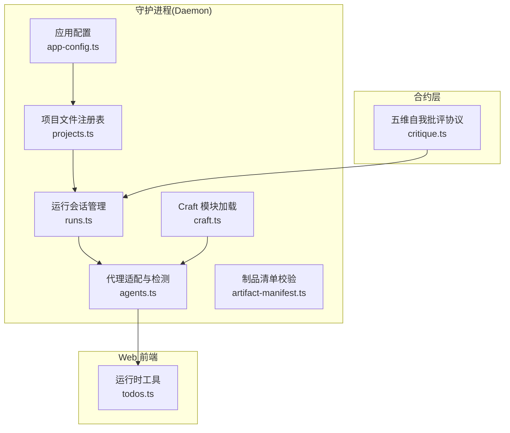
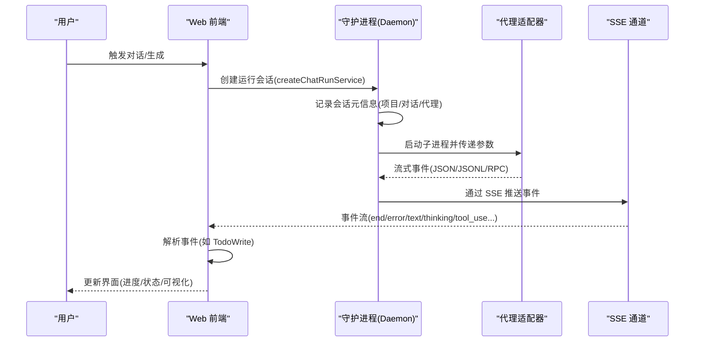
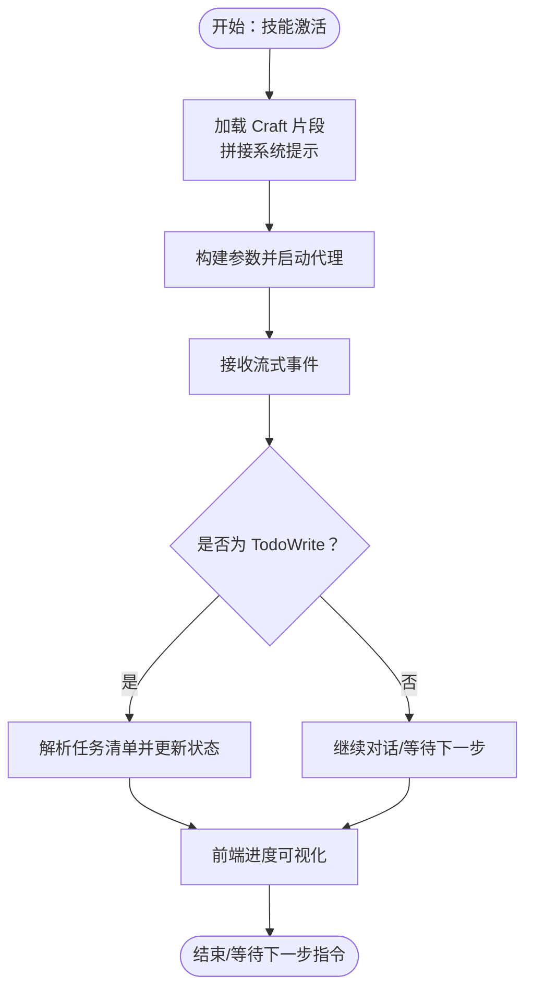
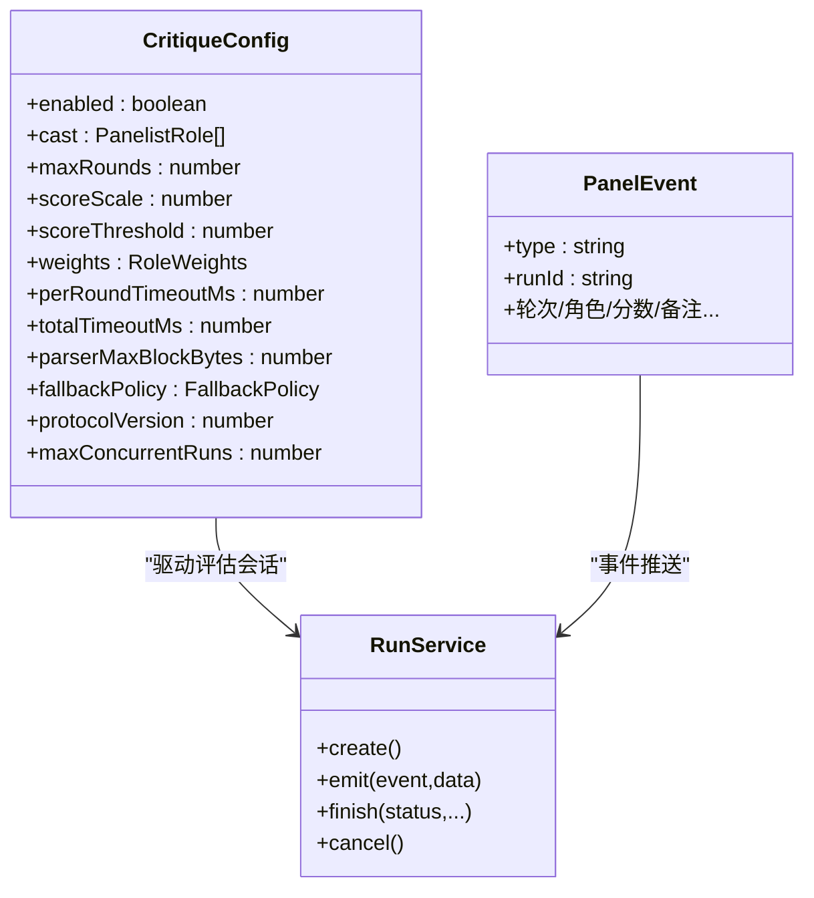
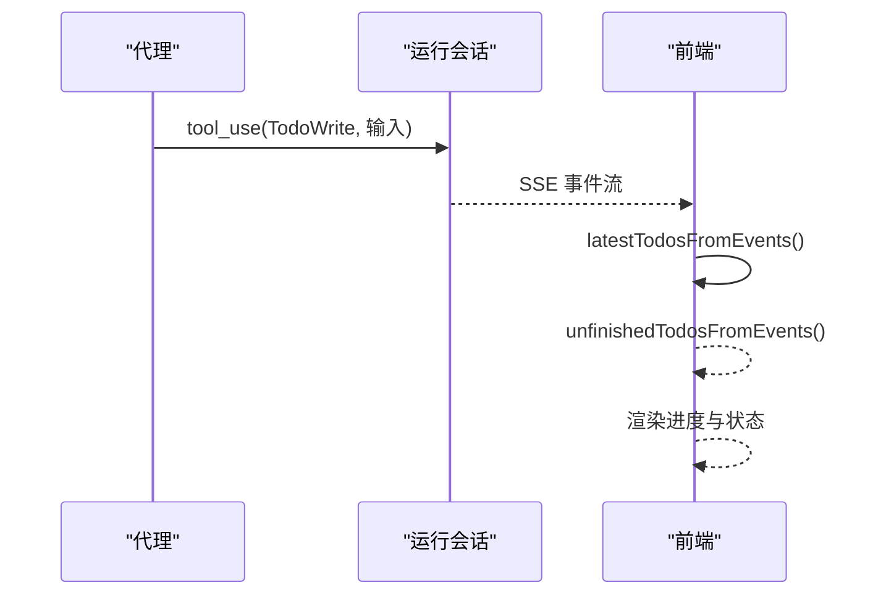
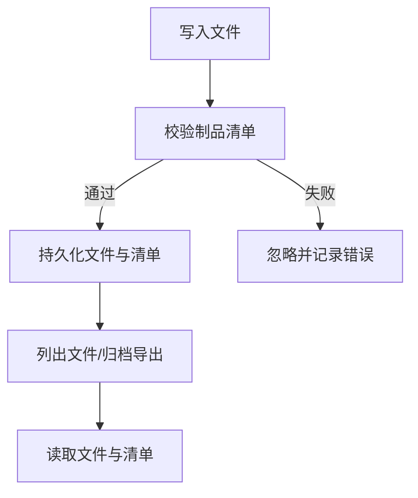
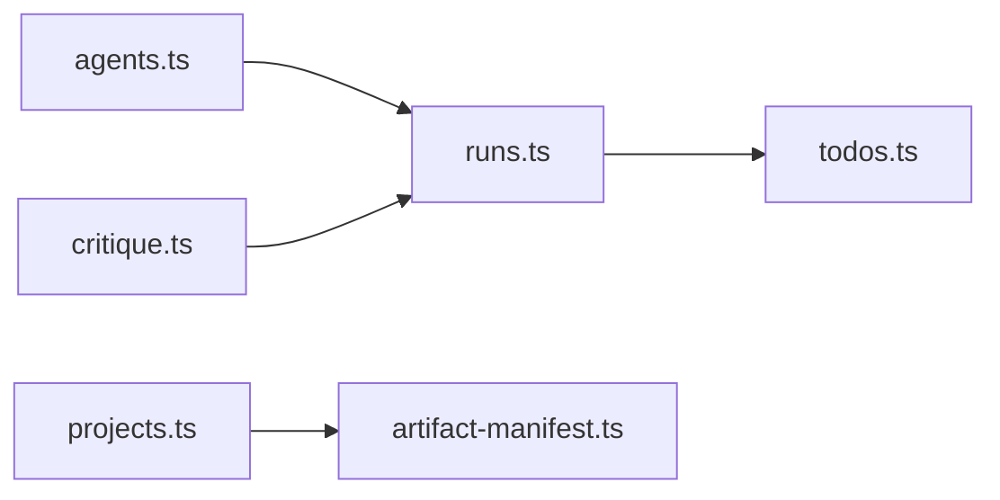

# 设计工作流引擎

<cite>
**本文档引用的文件**
- [apps/daemon/src/app-config.ts](file://apps/daemon/src/app-config.ts)
- [apps/daemon/src/craft.ts](file://apps/daemon/src/craft.ts)
- [apps/daemon/src/projects.ts](file://apps/daemon/src/projects.ts)
- [apps/daemon/src/runs.ts](file://apps/daemon/src/runs.ts)
- [apps/daemon/src/agents.ts](file://apps/daemon/src/agents.ts)
- [apps/daemon/src/artifact-manifest.ts](file://apps/daemon/src/artifact-manifest.ts)
- [apps/web/src/runtime/todos.ts](file://apps/web/src/runtime/todos.ts)
- [packages/contracts/src/critique.ts](file://packages/contracts/src/critique.ts)
</cite>

## 目录
1. [简介](#简介)
2. [项目结构](#项目结构)
3. [核心组件](#核心组件)
4. [架构总览](#架构总览)
5. [详细组件分析](#详细组件分析)
6. [依赖关系分析](#依赖关系分析)
7. [性能考量](#性能考量)
8. [故障排查指南](#故障排查指南)
9. [结论](#结论)
10. [附录](#附录)

## 简介
本设计工作流引擎围绕“问题表单系统”“五维自我批评机制”“实时 todo 进度跟踪系统”三大主题构建，结合对话流程控制、消息解析器、项目状态管理等能力，形成从探索到决策再到执行的闭环。系统通过代理（Agent）适配层统一接入多模型后端，以事件驱动的方式在服务端维护运行会话（Run），并通过 SSE 将状态变化推送给前端；前端负责渲染与交互，同时对代理输出进行解析，生成可追踪的任务清单。

## 项目结构
- 守护进程（Daemon）：提供应用配置、项目文件注册表、运行会话管理、代理检测与适配、制品清单校验等功能。
- Web 前端：提供运行时工具（如 todo 解析）、路由与状态管理、组件与国际化等。
- 合约层（Contracts）：定义五维自我批评协议、权重与阈值规范、事件类型与错误码等。

**图表来源**
- [apps/daemon/src/app-config.ts:1-154](file://apps/daemon/src/app-config.ts#L1-L154)
- [apps/daemon/src/projects.ts:1-395](file://apps/daemon/src/projects.ts#L1-L395)
- [apps/daemon/src/runs.ts:1-155](file://apps/daemon/src/runs.ts#L1-L155)
- [apps/daemon/src/agents.ts:1-884](file://apps/daemon/src/agents.ts#L1-L884)
- [apps/daemon/src/artifact-manifest.ts:1-260](file://apps/daemon/src/artifact-manifest.ts#L1-L260)
- [apps/daemon/src/craft.ts:1-47](file://apps/daemon/src/craft.ts#L1-L47)
- [apps/web/src/runtime/todos.ts:1-47](file://apps/web/src/runtime/todos.ts#L1-L47)
- [packages/contracts/src/critique.ts:1-113](file://packages/contracts/src/critique.ts#L1-L113)

**章节来源**
- [apps/daemon/src/app-config.ts:1-154](file://apps/daemon/src/app-config.ts#L1-L154)
- [apps/daemon/src/projects.ts:1-395](file://apps/daemon/src/projects.ts#L1-L395)
- [apps/daemon/src/runs.ts:1-155](file://apps/daemon/src/runs.ts#L1-L155)
- [apps/daemon/src/agents.ts:1-884](file://apps/daemon/src/agents.ts#L1-L884)
- [apps/daemon/src/artifact-manifest.ts:1-260](file://apps/daemon/src/artifact-manifest.ts#L1-L260)
- [apps/daemon/src/craft.ts:1-47](file://apps/daemon/src/craft.ts#L1-L47)
- [apps/web/src/runtime/todos.ts:1-47](file://apps/web/src/runtime/todos.ts#L1-L47)
- [packages/contracts/src/critique.ts:1-113](file://packages/contracts/src/critique.ts#L1-L113)

## 核心组件
- 应用配置（AppConfig）
  - 负责持久化非敏感偏好（如 onboardingCompleted、agentId、agentModels、skillId、designSystemId），支持并发写入串行化，保证数据一致性。
  - 提供键白名单过滤与值校验，避免注入与越界。
- 项目文件注册表（Projects）
  - 统一管理项目目录下的文件列表、归档导出、读写与删除操作，路径安全校验防止越权访问。
  - 支持为每个文件生成对应的制品清单（artifact manifest），用于渲染与导出。
- 运行会话管理（Runs）
  - 基于内存 Map 维护会话生命周期，支持事件队列、SSE 推送、取消与等待回调。
  - 会话状态包含 queued/running/succeeded/failed/canceled 等终端态，超时清理策略保障资源回收。
- 代理适配与检测（Agents）
  - 统一声明各代理的二进制、参数构建、模型列表、流格式与事件解析器。
  - 自动探测 PATH 可用性、帮助标志与模型列表，缓存能力位，确保 spawn 参数安全。
- 制品清单校验（Artifact Manifest）
  - 对 kind/renderer/exports/status/supportingFiles/title/sourceSkillId/designSystemId/metadata 等字段进行严格校验与清洗，保障跨端一致性。
- Craft 模块加载（Craft）
  - 根据技能声明的 requires 列表拼接 Markdown 片段，作为系统提示的一部分注入对话。
- 实时 todo 进度跟踪（Web Runtime）
  - 解析代理事件中的 TodoWrite 工具调用，提取任务清单并区分未完成项，驱动前端进度可视化。
- 五维自我批评协议（Contracts）
  - 定义面板角色权重、轮次上限、评分尺度与阈值、回退策略、事件类型与失败原因等，支撑评估体系。

**章节来源**
- [apps/daemon/src/app-config.ts:14-97](file://apps/daemon/src/app-config.ts#L14-L97)
- [apps/daemon/src/projects.ts:19-327](file://apps/daemon/src/projects.ts#L19-L327)
- [apps/daemon/src/runs.ts:6-153](file://apps/daemon/src/runs.ts#L6-L153)
- [apps/daemon/src/agents.ts:119-604](file://apps/daemon/src/agents.ts#L119-L604)
- [apps/daemon/src/artifact-manifest.ts:72-200](file://apps/daemon/src/artifact-manifest.ts#L72-L200)
- [apps/daemon/src/craft.ts:21-46](file://apps/daemon/src/craft.ts#L21-L46)
- [apps/web/src/runtime/todos.ts:11-46](file://apps/web/src/runtime/todos.ts#L11-L46)
- [packages/contracts/src/critique.ts:20-112](file://packages/contracts/src/critique.ts#L20-L112)

## 架构总览
下图展示从用户触发到代理执行、事件推送与前端解析的全链路：

**图表来源**
- [apps/daemon/src/runs.ts:6-153](file://apps/daemon/src/runs.ts#L6-L153)
- [apps/daemon/src/agents.ts:119-604](file://apps/daemon/src/agents.ts#L119-L604)
- [apps/web/src/runtime/todos.ts:34-46](file://apps/web/src/runtime/todos.ts#L34-L46)

## 详细组件分析

### 问题表单系统：探索与决策
- 发现阶段（探索性对话）
  - 通过 Craft 加载技能所需的 Markdown 片段，拼接为系统提示，引导代理进行探索性输出。
  - 代理参数构建支持额外允许目录（extraAllowedDirs）与权限绕过模式，确保技能种子与设计系统规范可被读取。
- 方向确定（决策流程）
  - 代理输出经事件解析器标准化，前端根据事件类型（如 thinking/tool_use）更新 UI。
  - 当出现 TodoWrite 工具调用时，前端解析任务清单，进入“待办”状态管理，驱动后续执行与可视化。

**图表来源**
- [apps/daemon/src/craft.ts:21-46](file://apps/daemon/src/craft.ts#L21-L46)
- [apps/daemon/src/agents.ts:157-184](file://apps/daemon/src/agents.ts#L157-L184)
- [apps/web/src/runtime/todos.ts:34-46](file://apps/web/src/runtime/todos.ts#L34-L46)

**章节来源**
- [apps/daemon/src/craft.ts:21-46](file://apps/daemon/src/craft.ts#L21-L46)
- [apps/daemon/src/agents.ts:157-184](file://apps/daemon/src/agents.ts#L157-L184)
- [apps/web/src/runtime/todos.ts:34-46](file://apps/web/src/runtime/todos.ts#L34-L46)

### 五维自我批评机制：评估体系
- 协议与配置
  - 面板角色权重（designer/critic/brand/a11y/copy）与评分尺度、阈值、轮次上限、超时策略、解析器大小限制、并发数等均通过 Zod Schema 校验。
  - 回退策略（ship_best/ship_last/fail）决定在异常或不达标时的处置方式。
- 事件流
  - 包含 run_started、panelist_open/dim/must_fix/close、round_end、ship/degraded/interrupted/failed/parser_warning 等类型，覆盖从开题、维度打分、必须修复、回合结束到最终装船或失败的完整生命周期。
- 与运行会话集成
  - 评估过程由守护进程内的运行会话承载，事件通过 SSE 推送至前端，前端据此更新 UI 并记录最佳轮次与综合得分。

**图表来源**
- [packages/contracts/src/critique.ts:20-112](file://packages/contracts/src/critique.ts#L20-L112)
- [apps/daemon/src/runs.ts:6-153](file://apps/daemon/src/runs.ts#L6-L153)

**章节来源**
- [packages/contracts/src/critique.ts:20-112](file://packages/contracts/src/critique.ts#L20-L112)
- [apps/daemon/src/runs.ts:6-153](file://apps/daemon/src/runs.ts#L6-L153)

### 实时 todo 进度跟踪系统
- 数据模型
  - TodoItem 结构包含 content/status/activeForm 字段；状态枚举为 pending/in_progress/completed。
- 解析与聚合
  - latestTodosFromEvents 从代理事件中逆序查找最近一次 TodoWrite 的输入，解析为 TodoItem 数组。
  - unfinishedTodosFromEvents 过滤出未完成项，便于前端聚焦当前工作。
- 与代理系统的集成
  - 代理通过 tool_use 事件上报 TodoWrite 输入，守护进程将其写入运行事件流；前端订阅并解析，实现无侵入的任务管理。

**图表来源**
- [apps/web/src/runtime/todos.ts:34-46](file://apps/web/src/runtime/todos.ts#L34-L46)
- [apps/daemon/src/runs.ts:48-56](file://apps/daemon/src/runs.ts#L48-L56)

**章节来源**
- [apps/web/src/runtime/todos.ts:5-46](file://apps/web/src/runtime/todos.ts#L5-L46)
- [apps/daemon/src/runs.ts:48-56](file://apps/daemon/src/runs.ts#L48-L56)

### 项目状态管理与制品清单
- 文件与清单
  - 项目文件注册表提供读写、删除、归档导出能力；每个文件可关联一个 artifact manifest，描述 kind/renderer/exports/status/metadata 等。
  - 写入文件时可附带制品清单，守护进程进行严格校验与清洗，确保跨端一致。
- 安全与合规
  - 路径校验与转义防止目录穿越；文件名清洗避免非法字符；MIME/种类分类用于前端预览与编辑器选择。

**图表来源**
- [apps/daemon/src/projects.ts:182-223](file://apps/daemon/src/projects.ts#L182-L223)
- [apps/daemon/src/artifact-manifest.ts:72-200](file://apps/daemon/src/artifact-manifest.ts#L72-L200)

**章节来源**
- [apps/daemon/src/projects.ts:182-223](file://apps/daemon/src/projects.ts#L182-L223)
- [apps/daemon/src/artifact-manifest.ts:72-200](file://apps/daemon/src/artifact-manifest.ts#L72-L200)

## 依赖关系分析
- 组件耦合
  - 运行会话（runs.ts）为事件中枢，被代理适配（agents.ts）与前端（todos.ts）共同消费。
  - 项目注册表（projects.ts）与制品清单（artifact-manifest.ts）强耦合，前者负责存储，后者负责语义约束。
  - 合约层（critique.ts）为评估协议提供类型与默认值，被运行会话间接承载。
- 外部依赖
  - 代理适配依赖系统 PATH 与外部 CLI，参数构建与权限策略需与守护进程环境保持一致。
  - SSE 通道依赖守护进程的事件队列与客户端集合管理。

**图表来源**
- [apps/daemon/src/agents.ts:119-604](file://apps/daemon/src/agents.ts#L119-L604)
- [apps/daemon/src/runs.ts:6-153](file://apps/daemon/src/runs.ts#L6-L153)
- [apps/web/src/runtime/todos.ts:1-47](file://apps/web/src/runtime/todos.ts#L1-L47)
- [apps/daemon/src/projects.ts:1-395](file://apps/daemon/src/projects.ts#L1-L395)
- [apps/daemon/src/artifact-manifest.ts:1-260](file://apps/daemon/src/artifact-manifest.ts#L1-L260)
- [packages/contracts/src/critique.ts:1-113](file://packages/contracts/src/critique.ts#L1-L113)

**章节来源**
- [apps/daemon/src/agents.ts:119-604](file://apps/daemon/src/agents.ts#L119-L604)
- [apps/daemon/src/runs.ts:6-153](file://apps/daemon/src/runs.ts#L6-L153)
- [apps/web/src/runtime/todos.ts:1-47](file://apps/web/src/runtime/todos.ts#L1-L47)
- [apps/daemon/src/projects.ts:1-395](file://apps/daemon/src/projects.ts#L1-L395)
- [apps/daemon/src/artifact-manifest.ts:1-260](file://apps/daemon/src/artifact-manifest.ts#L1-L260)
- [packages/contracts/src/critique.ts:1-113](file://packages/contracts/src/critique.ts#L1-L113)

## 性能考量
- 事件队列与内存占用
  - 运行会话维护固定长度事件缓冲，超出上限会丢弃旧事件，降低内存压力；SSE 推送基于 Last-Event-ID 支持断点续拉。
- 并发写入与锁
  - 应用配置写入采用串行化锁，避免竞态导致的数据丢失或覆盖。
- 模型列表与能力探测
  - 代理能力位缓存与模型列表探测结果缓存，减少重复探测带来的延迟。
- 归档与压缩
  - 项目归档使用 DEFLATE 压缩，级别 6 平衡速度与压缩比。

[本节为通用指导，无需特定文件引用]

## 故障排查指南
- 代理不可用或参数错误
  - 检查代理二进制是否在 PATH 中，确认 capability flags 与模型列表探测是否成功。
  - 若模型 ID 非法，守护进程会拒绝并返回错误；请使用受支持的模型标识。
- 会话无法终止或事件丢失
  - 确认会话状态是否为终端态；若需要取消，调用 cancel 并检查子进程信号。
  - 前端断线重连时，使用 Last-Event-ID 或 after 查询参数定位事件起点。
- 文件写入失败或路径越界
  - 使用项目注册表提供的安全写入接口；避免绝对路径与目录穿越。
- 五维自我批评评估异常
  - 检查配置中的阈值与评分尺度关系；关注 parser_max_block_bytes 与 per_round_timeout 是否合理。
  - 关注 degraded/interrupted/failed 事件类型，定位具体原因（如协议版本不匹配、适配器不支持、超时等）。

**章节来源**
- [apps/daemon/src/agents.ts:733-775](file://apps/daemon/src/agents.ts#L733-L775)
- [apps/daemon/src/runs.ts:124-131](file://apps/daemon/src/runs.ts#L124-L131)
- [apps/daemon/src/projects.ts:258-285](file://apps/daemon/src/projects.ts#L258-L285)
- [packages/contracts/src/critique.ts:62-112](file://packages/contracts/src/critique.ts#L62-L112)

## 结论
本设计工作流引擎通过“问题表单系统”“五维自我批评机制”“实时 todo 进度跟踪系统”的协同，实现了从探索、决策到执行的闭环。守护进程提供稳定可靠的运行时基础设施（会话、代理、项目与清单），前端负责解析与可视化，合约层确保评估协议的可验证性与可扩展性。整体架构具备良好的模块化、可维护性与可移植性，适合在多模型与多技能场景下持续演进。

[本节为总结，无需特定文件引用]

## 附录
- 使用示例（概念性）
  - 在技能激活后，系统自动加载 Craft 片段并启动代理；代理输出包含思考与工具调用；前端解析 TodoWrite，生成任务清单并显示未完成项。
  - 评估阶段按轮次进行维度评分与必须修复项汇总，达到阈值后装船，否则根据回退策略处理。
- 配置选项（概念性）
  - 应用配置：允许键包括 onboardingCompleted、agentId、agentModels、skillId、designSystemId。
  - 五维自我批评：启用开关、角色权重、轮次上限、评分尺度与阈值、超时与并发限制、回退策略、协议版本。
  - 代理参数：模型选择、推理强度、工作区目录、权限模式、输出格式与事件解析器。

[本节为概览，无需特定文件引用]