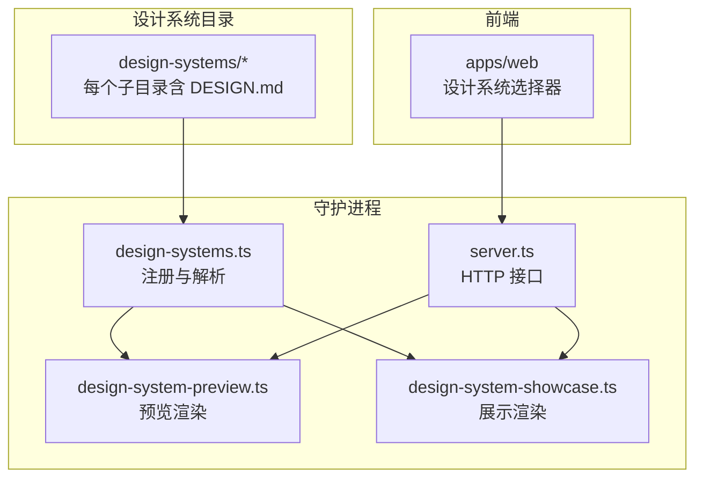
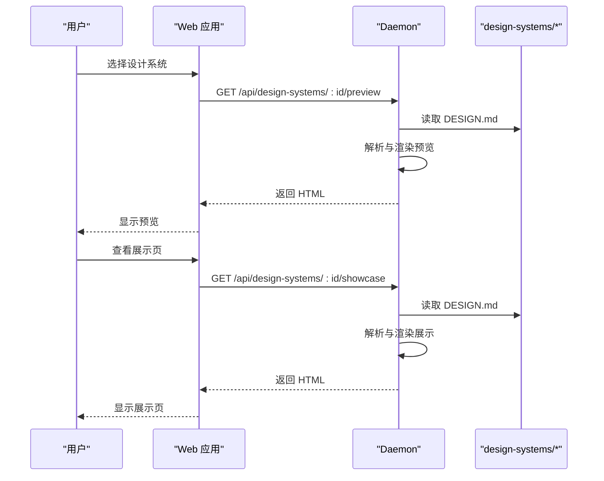
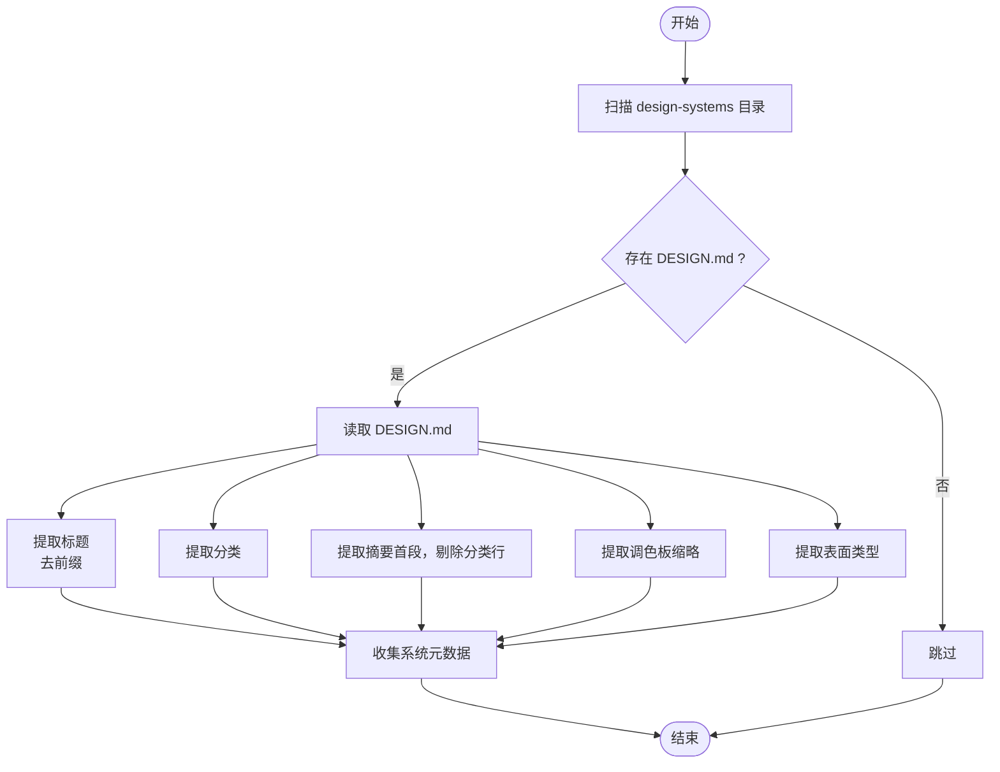
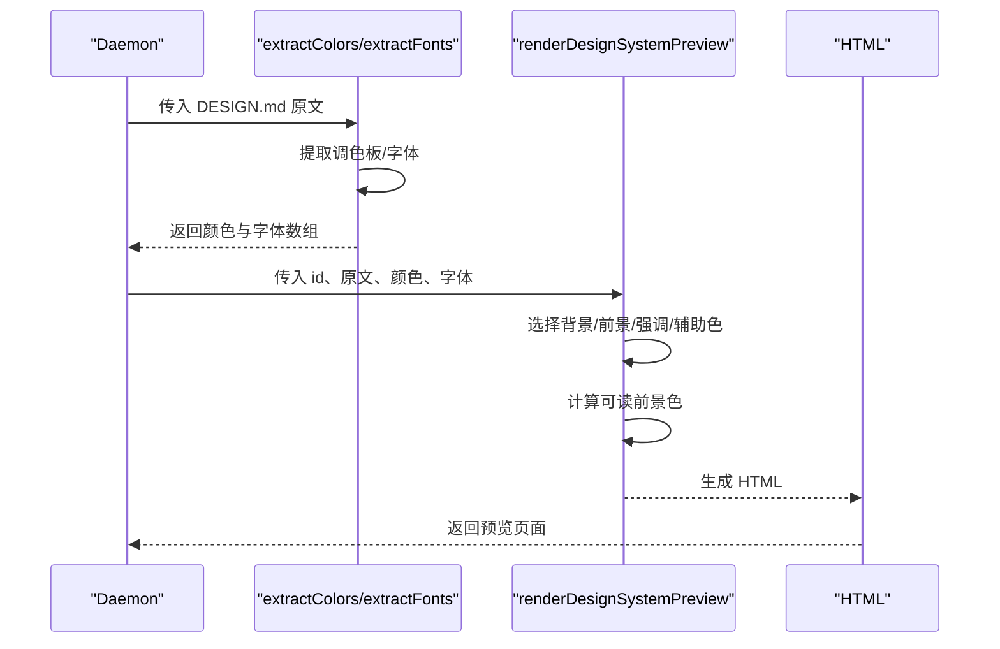
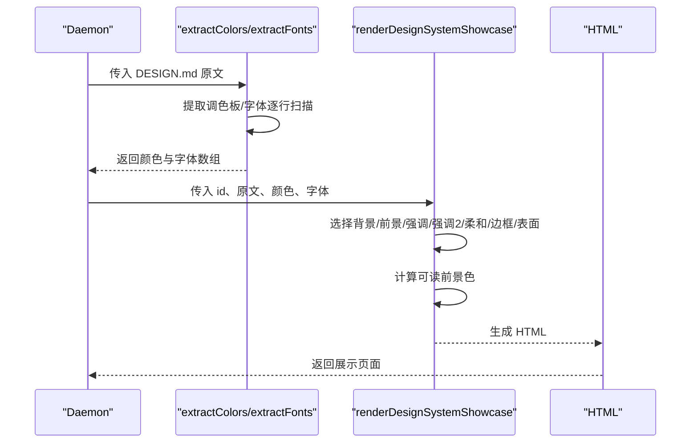
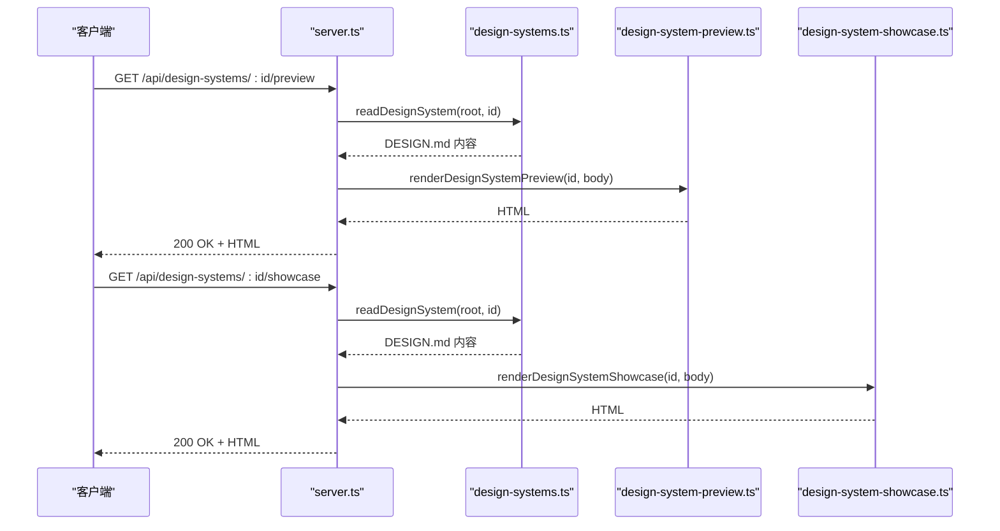
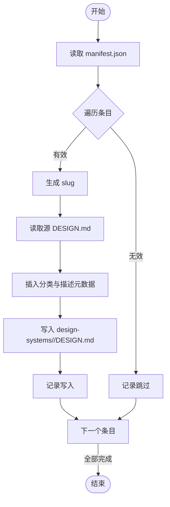
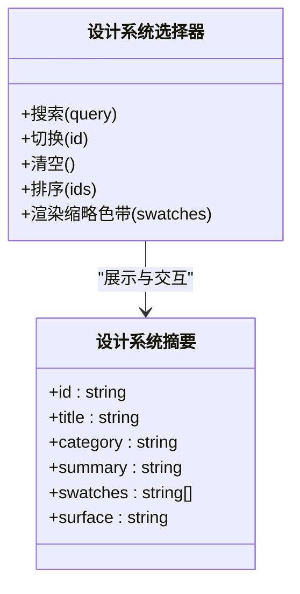
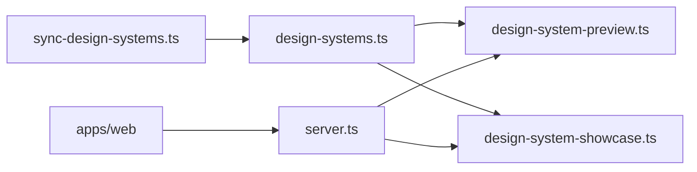

# 设计系统库

<cite>
**本文档引用的文件**
- [design-systems/README.md](file://design-systems/README.md)
- [apps/daemon/src/design-systems.ts](file://apps/daemon/src/design-systems.ts)
- [apps/daemon/src/design-system-preview.ts](file://apps/daemon/src/design-system-preview.ts)
- [apps/daemon/src/design-system-showcase.ts](file://apps/daemon/src/design-system-showcase.ts)
- [scripts/sync-design-systems.ts](file://scripts/sync-design-systems.ts)
- [docs/spec.md](file://docs/spec.md)
- [apps/daemon/src/server.ts](file://apps/daemon/src/server.ts)
- [apps/web/src/components/NewProjectPanel.tsx](file://apps/web/src/components/NewProjectPanel.tsx)
- [design-systems/default/DESIGN.md](file://design-systems/default/DESIGN.md)
- [design-systems/claude/DESIGN.md](file://design-systems/claude/DESIGN.md)
- [design-systems/stripe/DESIGN.md](file://design-systems/stripe/DESIGN.md)
- [docs/examples/DESIGN.sample.md](file://docs/examples/DESIGN.sample.md)
</cite>

## 目录
1. [简介](#简介)
2. [项目结构](#项目结构)
3. [核心组件](#核心组件)
4. [架构总览](#架构总览)
5. [详细组件分析](#详细组件分析)
6. [依赖关系分析](#依赖关系分析)
7. [性能考虑](#性能考虑)
8. [故障排除指南](#故障排除指南)
9. [结论](#结论)
10. [附录](#附录)

## 简介
本设计系统库提供 72 个品牌级设计系统的标准化管理与使用能力，围绕统一的 DESIGN.md 规范构建，支持设计系统的选择、预览、展示与应用。系统通过本地守护进程扫描 design-systems 目录下的 DESIGN.md 文件，解析标题、分类、摘要、调色板与字体信息，为前端界面提供设计系统选择器与可视化预览；同时提供营销风格的落地页展示模板，帮助用户在生成前直观评估设计系统效果。

## 项目结构
- 设计系统目录：design-systems 下包含多个子目录，每个子目录代表一个可独立使用的品牌或产品设计系统，均以 DESIGN.md 作为规范文件。
- 守护进程模块：apps/daemon/src 提供设计系统注册、解析、预览渲染与展示渲染的核心逻辑。
- 同步脚本：scripts/sync-design-systems.ts 从上游包导入品牌设计系统并写入本地 DESIGN.md。
- 文档规范：docs/spec.md 定义了整体产品定位、模块职责与 DESIGN.md 的 9 节结构规范。
- 示例与样例：docs/examples/DESIGN.sample.md 提供 9 节格式参考；design-systems/default/DESIGN.md、design-systems/claude/DESIGN.md、design-systems/stripe/DESIGN.md 展示不同风格的设计系统样例。

**图表来源**
- [apps/daemon/src/design-systems.ts:1-168](file://apps/daemon/src/design-systems.ts#L1-L168)
- [apps/daemon/src/design-system-preview.ts:1-621](file://apps/daemon/src/design-system-preview.ts#L1-L621)
- [apps/daemon/src/design-system-showcase.ts:1-875](file://apps/daemon/src/design-system-showcase.ts#L1-L875)
- [apps/daemon/src/server.ts:2386-2415](file://apps/daemon/src/server.ts#L2386-L2415)

**章节来源**
- [design-systems/README.md:1-98](file://design-systems/README.md#L1-L98)
- [docs/spec.md:1-143](file://docs/spec.md#L1-L143)

## 核心组件
- 设计系统注册与解析（design-systems.ts）
  - 扫描 design-systems 目录，读取每个子目录的 DESIGN.md，提取标题、分类、摘要、调色板与表面类型等元数据。
  - 提供按 ID 读取 DESIGN.md 的接口。
- 预览渲染（design-system-preview.ts）
  - 将 DESIGN.md 解析为 HTML 预览页面，包含调色板、字体示例与基础组件示意，便于在生成前快速审阅。
- 展示渲染（design-system-showcase.ts）
  - 基于 DESIGN.md 生成营销风格的产品落地页，覆盖导航、英雄区、特性网格、工作区预览、定价、客户评价、FAQ、CTA 与页脚等区块。
- HTTP 接口（server.ts）
  - 暴露 /api/design-systems/:id/preview 与 /api/design-systems/:id/showcase 两个端点，按需渲染并返回 HTML。
- 品牌系统同步（sync-design-systems.ts）
  - 从上游包读取品牌 DESIGN.md 列表，自动插入分类与描述元数据后写入本地 design-systems 目录。
- 前端选择器（apps/web 新建项目面板）
  - 展示设计系统列表，支持多选与排序，基于 swatches 渲染缩略色带，提供默认系统标记与空状态提示。

**章节来源**
- [apps/daemon/src/design-systems.ts:1-168](file://apps/daemon/src/design-systems.ts#L1-L168)
- [apps/daemon/src/design-system-preview.ts:1-621](file://apps/daemon/src/design-system-preview.ts#L1-L621)
- [apps/daemon/src/design-system-showcase.ts:1-875](file://apps/daemon/src/design-system-showcase.ts#L1-L875)
- [apps/daemon/src/server.ts:2386-2415](file://apps/daemon/src/server.ts#L2386-L2415)
- [scripts/sync-design-systems.ts:1-155](file://scripts/sync-design-systems.ts#L1-L155)
- [apps/web/src/components/NewProjectPanel.tsx:1235-1398](file://apps/web/src/components/NewProjectPanel.tsx#L1235-L1398)

## 架构总览
系统采用“本地守护进程 + Web 应用”的分层架构：
- Web 应用负责用户交互与设计系统选择器展示；
- 守护进程负责设计系统注册、解析与渲染服务；
- HTTP 接口按需渲染预览与展示页面，避免缓存带来的陈旧内容；
- 品牌系统通过同步脚本批量导入，保持与上游生态一致。

**图表来源**
- [apps/daemon/src/server.ts:2386-2415](file://apps/daemon/src/server.ts#L2386-L2415)
- [apps/daemon/src/design-systems.ts:43-50](file://apps/daemon/src/design-systems.ts#L43-L50)
- [apps/daemon/src/design-system-preview.ts:14-298](file://apps/daemon/src/design-system-preview.ts#L14-L298)
- [apps/daemon/src/design-system-showcase.ts:13-547](file://apps/daemon/src/design-system-showcase.ts#L13-L547)

## 详细组件分析

### 设计系统注册与解析（design-systems.ts）
- 功能要点
  - 列举：遍历 design-systems 目录，过滤出包含 DESIGN.md 的子目录，读取并解析元数据。
  - 元数据提取：标题（去除“Design System Inspired by/for”前缀）、分类（> Category: ...）、摘要（首段，剔除分类行）、调色板缩略（extractSwatches）、表面类型（web/image/video/audio）。
  - 读取：按 ID 读取指定 DESIGN.md 内容。
- 关键算法
  - 提取摘要：定位 H1 后的第一个段落窗口，剔除分类元数据行，截断至 240 字符。
  - 提取分类：匹配 > Category: 行。
  - 提取表面：限定集合 {web,image,video,audio}，默认 web。
  - 提取调色板缩略：通过两种模式识别颜色（粗体名称 + 冒号 + 颜色值；粗体名称 + 括号内的颜色值），按名称与角色优先级挑选背景、前景、强调与辅助色，确保中性色与非中性色区分。
- 错误处理
  - 目录不存在或无法读取时返回空列表；单个 DESIGN.md 读取失败时跳过该系统。

**图表来源**
- [apps/daemon/src/design-systems.ts:10-87](file://apps/daemon/src/design-systems.ts#L10-L87)

**章节来源**
- [apps/daemon/src/design-systems.ts:1-168](file://apps/daemon/src/design-systems.ts#L1-L168)

### 预览渲染（design-system-preview.ts）
- 功能要点
  - 从 DESIGN.md 中抽取调色板与字体，生成固定模板的预览页面，包含调色板网格、字体示例与卡片按钮等基础组件示意。
  - 解析策略宽松，兼容不同风格的 DESIGN.md 格式差异。
- 关键算法
  - 提取摘要：与注册模块一致，定位 H1 后段落窗口。
  - 提取调色板：支持两种格式（列表项 + 冒号 + 颜色；粗体名称 + 括号颜色），清洗名称与十六进制值，去重并限制长度。
  - 提取字体：匹配 Display/Heading、Body/Text、Mono/Code 等标签，保留第一个出现的值。
  - 颜色选取：优先匹配“页面背景/背景/画布/纸张”等关键词，否则回退到白色；前景色优先匹配“标题/前景/墨水/文本”，否则回退到深灰；强调色优先匹配“主品牌/品牌主色/强调/品牌/主色”，否则选择非中性色或首个颜色；辅助色优先匹配“边框/分隔线/规则/次级/柔和”，否则选择中性但不同于背景与前景的颜色。
  - 可读前景：根据背景色亮度计算，保证对比度。
- 输出
  - 返回完整的 HTML 页面，包含样式变量注入与内联 Markdown 渲染结果。

**图表来源**
- [apps/daemon/src/design-system-preview.ts:14-298](file://apps/daemon/src/design-system-preview.ts#L14-L298)
- [apps/daemon/src/design-systems.ts:102-167](file://apps/daemon/src/design-systems.ts#L102-L167)

**章节来源**
- [apps/daemon/src/design-system-preview.ts:1-621](file://apps/daemon/src/design-system-preview.ts#L1-L621)

### 展示渲染（design-system-showcase.ts）
- 功能要点
  - 从 DESIGN.md 中抽取调色板与字体，生成营销风格的落地页模板，覆盖导航、英雄、特性、工作区预览、定价、客户评价、FAQ、CTA 与页脚等区块。
  - 使用 CSS 变量注入颜色与字体，确保与 DESIGN.md 严格一致。
- 关键算法
  - 提取摘要：与预览一致。
  - 提取调色板：支持更复杂的多行与混合格式，逐行扫描，提取粗体名称、第一个十六进制数与冒号后的角色描述，去重并保留更丰富的角色描述。
  - 提取字体：匹配 Display/Heading、Body/Text、Mono/Code 等标签，优先级与预览一致。
  - 颜色选取：与预览类似，但增加对“次要表面/分节分隔/侧栏/表面轻微/卡片表面”等关键词的识别，以及对浅色/深色背景的自动选择与可读前景计算。
- 输出
  - 返回完整的 HTML 页面，包含内联样式与 SVG 图标，用于直接预览与导出。

**图表来源**
- [apps/daemon/src/design-system-showcase.ts:13-547](file://apps/daemon/src/design-system-showcase.ts#L13-L547)
- [apps/daemon/src/design-systems.ts:67-167](file://apps/daemon/src/design-systems.ts#L67-L167)

**章节来源**
- [apps/daemon/src/design-system-showcase.ts:1-875](file://apps/daemon/src/design-system-showcase.ts#L1-L875)

### HTTP 接口（server.ts）
- 端点
  - GET /api/design-systems/:id/preview：按需渲染预览页面。
  - GET /api/design-systems/:id/showcase：按需渲染展示页面。
- 控制流
  - 读取指定 DESIGN.md；
  - 调用对应渲染函数；
  - 返回 HTML 或 404/500 错误。

**图表来源**
- [apps/daemon/src/server.ts:2386-2415](file://apps/daemon/src/server.ts#L2386-L2415)
- [apps/daemon/src/design-systems.ts:43-50](file://apps/daemon/src/design-systems.ts#L43-L50)
- [apps/daemon/src/design-system-preview.ts:14-298](file://apps/daemon/src/design-system-preview.ts#L14-L298)
- [apps/daemon/src/design-system-showcase.ts:13-547](file://apps/daemon/src/design-system-showcase.ts#L13-L547)

**章节来源**
- [apps/daemon/src/server.ts:2386-2415](file://apps/daemon/src/server.ts#L2386-L2415)

### 品牌系统同步（sync-design-systems.ts）
- 功能要点
  - 从上游包的 manifest.json 读取品牌清单，映射品牌到分类，读取对应 DESIGN.md，插入“> Category: ...”与描述元数据，写入本地 design-systems 目录。
- 流程
  - 读取 manifest.json 并校验结构；
  - 遍历条目，生成 slug，读取源文件；
  - 在 H1 后插入分类与描述行；
  - 写入目标目录，统计写入与跳过数量。

**图表来源**
- [scripts/sync-design-systems.ts:79-155](file://scripts/sync-design-systems.ts#L79-L155)

**章节来源**
- [scripts/sync-design-systems.ts:1-155](file://scripts/sync-design-systems.ts#L1-L155)

### 前端设计系统选择器（apps/web 新建项目面板）
- 功能要点
  - 展示所有可用设计系统，支持搜索、多选与排序；
  - 基于 swatches 渲染缩略色带，若无元数据则使用基于标题哈希的确定性色带；
  - 提供“无系统”占位与默认系统标记。
- 交互
  - 点击切换激活状态；
  - 支持清空与重新排序；
  - 标题显示系统名称，副标题显示摘要或分类。

**图表来源**
- [apps/web/src/components/NewProjectPanel.tsx:1235-1398](file://apps/web/src/components/NewProjectPanel.tsx#L1235-L1398)

**章节来源**
- [apps/web/src/components/NewProjectPanel.tsx:1235-1398](file://apps/web/src/components/NewProjectPanel.tsx#L1235-L1398)

## 依赖关系分析
- 组件耦合
  - design-systems.ts 为上游依赖，被 design-system-preview.ts 与 design-system-showcase.ts 复用解析逻辑，减少重复实现。
  - server.ts 仅依赖 design-systems.ts 的读取与渲染函数，保持接口稳定。
  - 前端选择器依赖 server.ts 提供的预览与展示页面，不直接解析 DESIGN.md。
- 外部依赖
  - 上游品牌系统通过 npm 包导入，同步脚本负责版本化更新。
  - Web 应用通过 HTTP 接口消费守护进程提供的渲染结果。

**图表来源**
- [apps/daemon/src/design-systems.ts:1-168](file://apps/daemon/src/design-systems.ts#L1-L168)
- [apps/daemon/src/design-system-preview.ts:1-621](file://apps/daemon/src/design-system-preview.ts#L1-L621)
- [apps/daemon/src/design-system-showcase.ts:1-875](file://apps/daemon/src/design-system-showcase.ts#L1-L875)
- [apps/daemon/src/server.ts:2386-2415](file://apps/daemon/src/server.ts#L2386-L2415)
- [scripts/sync-design-systems.ts:1-155](file://scripts/sync-design-systems.ts#L1-L155)

**章节来源**
- [apps/daemon/src/design-systems.ts:1-168](file://apps/daemon/src/design-systems.ts#L1-L168)
- [apps/daemon/src/server.ts:2386-2415](file://apps/daemon/src/server.ts#L2386-L2415)

## 性能考虑
- 按需渲染
  - 预览与展示页面均为请求时渲染，避免缓存导致的陈旧内容，同时降低内存占用。
- I/O 优化
  - 仅在需要时读取 DESIGN.md，避免不必要的磁盘访问。
- 解析效率
  - 正则匹配与逐行扫描在小到中等规模的 DESIGN.md 文件上开销可控；如未来系统规模扩大，可考虑引入缓存层或增量解析。
- 前端渲染
  - 选择器使用确定性色带作为降级方案，避免额外网络请求。

## 故障排除指南
- 设计系统未出现在选择器中
  - 检查 design-systems/<id>/DESIGN.md 是否存在且可读；
  - 确认文件是否包含有效的 H1 与分类元数据。
- 预览或展示页面为空
  - 确认 DESIGN.md 是否包含可识别的调色板与字体声明；
  - 检查是否存在语法错误或格式不规范。
- 同步脚本报错
  - 确认已下载并解压上游包，manifest.json 结构正确；
  - 检查品牌是否在分类映射表中。
- HTTP 接口 404/500
  - 检查守护进程日志与文件权限；
  - 确认路径与 ID 正确。

**章节来源**
- [apps/daemon/src/design-systems.ts:13-17](file://apps/daemon/src/design-systems.ts#L13-L17)
- [scripts/sync-design-systems.ts:79-100](file://scripts/sync-design-systems.ts#L79-L100)
- [apps/daemon/src/server.ts:2390-2415](file://apps/daemon/src/server.ts#L2390-L2415)

## 结论
本设计系统库通过统一的 DESIGN.md 规范与本地守护进程实现了品牌级设计系统的标准化管理与高效使用。注册解析模块提供稳定的元数据提取，预览与展示渲染模块分别满足“生成前审阅”与“营销落地页”的需求。同步脚本保障品牌系统持续更新，前端选择器提供直观的交互体验。整体架构清晰、扩展性强，适合在团队内推广与维护。

## 附录

### 设计系统标准与扩展方法
- 设计系统标准（DESIGN.md）
  - 9 节结构：视觉主题与氛围、调色板与角色、字体规则、组件样式、布局原则、深度与高程、使用建议、响应式行为、代理提示指南。
  - 元数据：H1 作为标题，> Category: ... 作为分类，摘要为 H1 后首段内容（剔除分类行）。
- 扩展方法
  - 新增设计系统：在 design-systems 目录下新建子目录并放入 DESIGN.md 即可自动注册。
  - 更新品牌系统：运行同步脚本，从上游包拉取最新 DESIGN.md 并写入本地。
  - 自定义渲染：预览与展示渲染逻辑可复用解析模块，便于扩展新的展示模板。

**章节来源**
- [docs/spec.md:40-62](file://docs/spec.md#L40-L62)
- [design-systems/README.md:46-98](file://design-systems/README.md#L46-L98)
- [docs/examples/DESIGN.sample.md:1-65](file://docs/examples/DESIGN.sample.md#L1-L65)

### 质量控制
- 解析健壮性：预览与展示渲染模块均采用宽松正则与回退策略，提升对不同格式 DESIGN.md 的兼容性。
- 对比度保障：可读前景色计算确保在不同背景下满足对比度要求。
- 分类与摘要：统一的元数据提取逻辑保证前端展示一致性。

**章节来源**
- [apps/daemon/src/design-system-preview.ts:383-392](file://apps/daemon/src/design-system-preview.ts#L383-L392)
- [apps/daemon/src/design-system-showcase.ts:101-102](file://apps/daemon/src/design-system-showcase.ts#L101-L102)

### 新设计系统的添加流程
- 手动添加
  - 在 design-systems/<slug> 下创建 DESIGN.md，确保包含 H1 与分类元数据。
  - 重启或刷新守护进程后即可在选择器中看到新系统。
- 自动同步
  - 下载上游包并解压，执行同步脚本，自动写入本地 DESIGN.md 并插入分类与描述。
  - 如需自定义分类映射，可在脚本中调整映射表。

**章节来源**
- [design-systems/README.md:65-84](file://design-systems/README.md#L65-L84)
- [scripts/sync-design-systems.ts:1-155](file://scripts/sync-design-systems.ts#L1-L155)

### 设计系统使用的最佳实践
- 代理提示指南
  - 在 DESIGN.md 中提供示例组件提示与迭代指导，确保代理生成符合系统规范。
- 颜色与字体一致性
  - 严格使用系统内定义的颜色与字体，避免引入外部未声明的值。
- 响应式与无障碍
  - 遵循系统提供的断点与触达目标建议，确保移动端与无障碍体验。

**章节来源**
- [design-systems/default/DESIGN.md:59-63](file://design-systems/default/DESIGN.md#L59-L63)
- [design-systems/claude/DESIGN.md:289-316](file://design-systems/claude/DESIGN.md#L289-L316)
- [design-systems/stripe/DESIGN.md:295-326](file://design-systems/stripe/DESIGN.md#L295-L326)

### 案例研究
- Neutral Modern（默认系统）
  - 特点：中性现代、功能导向，适用于 B2B 工具与仪表盘。
  - 关键元素：背景 #FAFAFA、前景 #111111、强调色 #2F6FEB、无渐变与玻璃拟态。
- Claude（Anthropic）
  - 特点：温暖纸感画布、有机插画、环形阴影、暖色调中性。
  - 关键元素：Parchment #f5f4ed、Terracotta #c96442、Anthropic Serif/ Sans/Mono。
- Stripe
  - 特点：金融风范、深海军蓝标题、紫色品牌锚点、蓝灰多层阴影。
  - 关键元素：sohne-var 字体、深海军 #061b31、Stripe Purple #533afd、多层阴影公式。

**章节来源**
- [design-systems/default/DESIGN.md:1-63](file://design-systems/default/DESIGN.md#L1-L63)
- [design-systems/claude/DESIGN.md:1-316](file://design-systems/claude/DESIGN.md#L1-L316)
- [design-systems/stripe/DESIGN.md:1-326](file://design-systems/stripe/DESIGN.md#L1-L326)