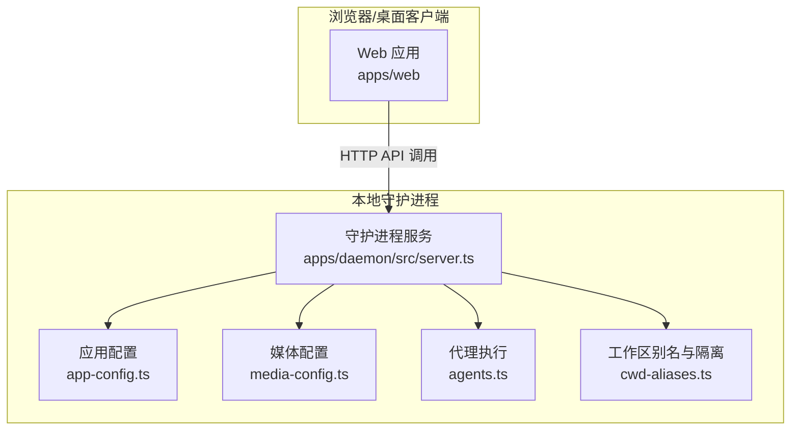
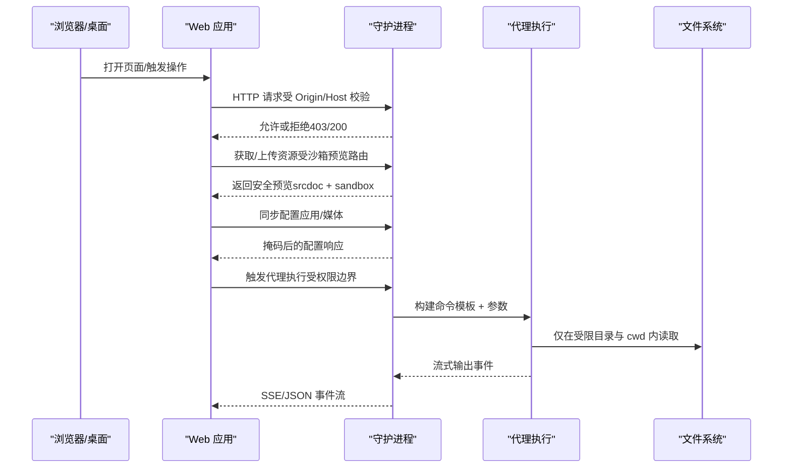
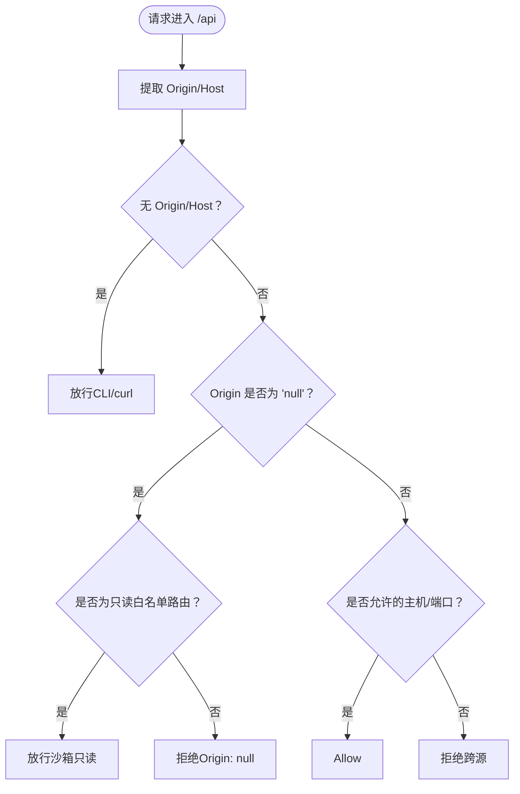
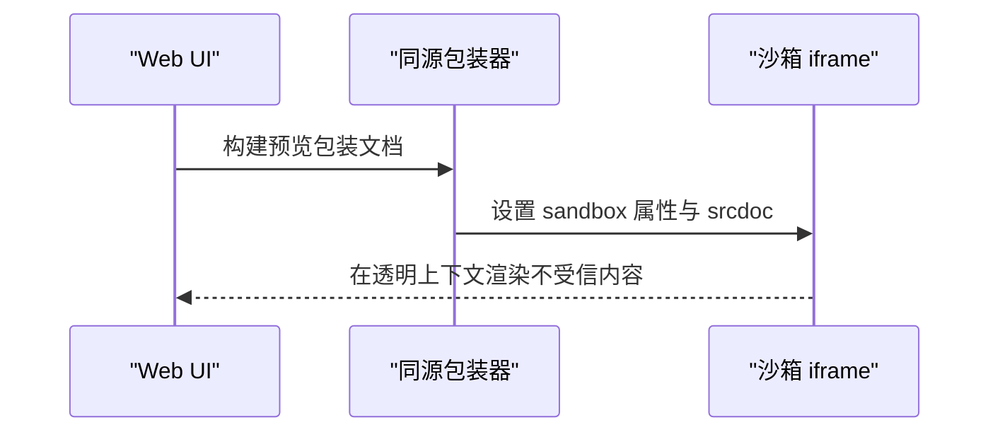
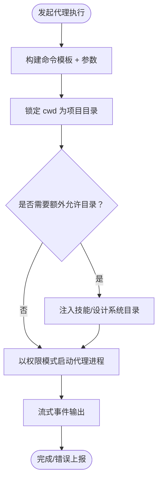
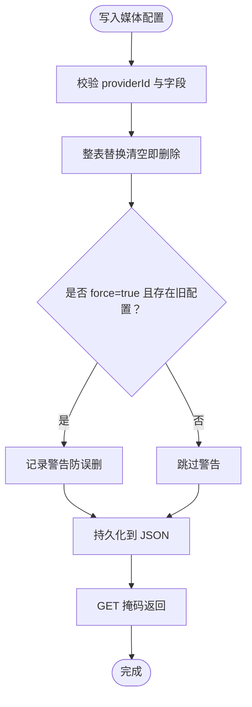
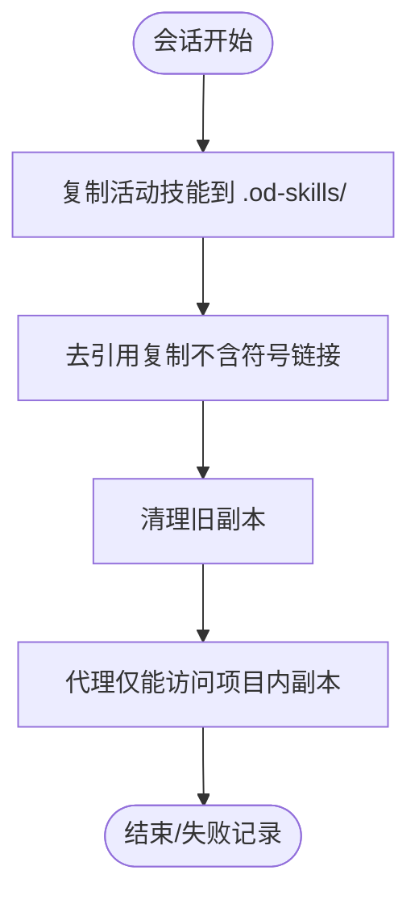
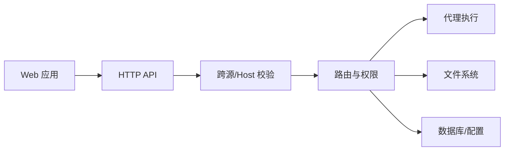

# 安全模型

<cite>
**本文引用的文件**
- [架构边界规范](file://specs/current/architecture-boundaries.md)
- [守护进程服务器](file://apps/daemon/src/server.ts)
- [应用配置管理](file://apps/daemon/src/app-config.ts)
- [媒体配置管理](file://apps/daemon/src/media-config.ts)
- [代理执行适配器](file://apps/daemon/src/agents.ts)
- [工作区别名与路径隔离](file://apps/daemon/src/cwd-aliases.ts)
- [Web 预览沙箱包装器](file://apps/web/src/runtime/exports.ts)
- [Web 预览模态测试（沙箱）](file://apps/web/src/components/PreviewModal.test.tsx)
- [Web Markdown 渲染安全](file://apps/web/src/artifacts/markdown.ts)
- [Web 媒体设置同步](file://apps/web/src/state/config.ts)
- [守护进程应用配置测试（跨源防护）](file://apps/daemon/tests/app-config.test.ts)
- [守护进程跨源验证测试](file://apps/daemon/tests/origin-validation.test.ts)
- [维护性路线图（风险与优化）](file://specs/current/maintainability-roadmap.md)
</cite>

## 目录
1. [引言](#引言)
2. [项目结构](#项目结构)
3. [核心组件](#核心组件)
4. [架构总览](#架构总览)
5. [详细组件分析](#详细组件分析)
6. [依赖关系分析](#依赖关系分析)
7. [性能考量](#性能考量)
8. [故障排查指南](#故障排查指南)
9. [结论](#结论)
10. [附录](#附录)

## 引言
本文件系统化阐述 Open Design 的安全模型，聚焦以下关键攻击面与缓解策略：
- 守护进程 API 的本地访问控制与跨源防护
- 预览渲染的 XSS 防护与沙箱隔离
- 代理执行的权限边界与命令模板化
- 用户密钥的存储策略与最小暴露原则
- 不受信任技能的隔离机制与写入屏障

同时给出威胁模型、安全边界定义、审计要点与不同部署拓扑下的配置建议。

## 项目结构
Open Design 采用“本地优先”的前后端分层架构：
- Web 层（apps/web）：负责 UI、状态与薄 BFF/代理行为，不直接接触本地特权能力
- 守护进程（apps/daemon）：唯一本地能力服务器，负责 .od 状态、SQLite、工作区文件系统、代理 CLI 调用、任务生命周期、日志与产物等
- 共享代码：纯逻辑与类型定义，避免框架/环境特定 API 依赖

图表来源
- [守护进程服务器:1-200](file://apps/daemon/src/server.ts#L1-L200)
- [应用配置管理:1-154](file://apps/daemon/src/app-config.ts#L1-L154)
- [媒体配置管理:1-318](file://apps/daemon/src/media-config.ts#L1-L318)
- [代理执行适配器:1-200](file://apps/daemon/src/agents.ts#L1-L200)
- [工作区别名与路径隔离:1-151](file://apps/daemon/src/cwd-aliases.ts#L1-L151)

章节来源
- [架构边界规范:1-116](file://specs/current/architecture-boundaries.md#L1-L116)

## 核心组件
- 守护进程 API 与本地访问控制：通过 Origin/Host 校验与只读白名单路由，限制跨源访问；对敏感端点拒绝 Origin: null 的非安全场景
- 预览渲染与沙箱：生成预览时使用 Blob 包裹 + iframe sandbox，禁止同源访问，确保不受信内容在透明上下文中运行
- 代理执行权限边界：固定命令模板、参数白/黑名单、cwd 锁定、额外允许目录（如技能/设计系统）显式注入
- 用户密钥存储策略：本地 JSON 文件（可被环境变量覆盖），读取时掩码显示，写入前进行强制校验与保护
- 不受信任技能隔离：将活动技能复制到项目内受控别名目录，禁用符号链接回写，形成写入屏障

章节来源
- [守护进程服务器:786-820](file://apps/daemon/src/server.ts#L786-L820)
- [Web 预览沙箱包装器:169-206](file://apps/web/src/runtime/exports.ts#L169-L206)
- [代理执行适配器:61-70](file://apps/daemon/src/agents.ts#L61-L70)
- [应用配置管理:27-97](file://apps/daemon/src/app-config.ts#L27-L97)
- [媒体配置管理:234-317](file://apps/daemon/src/media-config.ts#L234-L317)
- [工作区别名与路径隔离:9-30](file://apps/daemon/src/cwd-aliases.ts#L9-L30)

## 架构总览
下图展示本地访问控制、预览沙箱、代理执行与配置存储之间的交互关系与安全边界。

图表来源
- [守护进程服务器:786-820](file://apps/daemon/src/server.ts#L786-L820)
- [Web 预览沙箱包装器:169-206](file://apps/web/src/runtime/exports.ts#L169-L206)
- [代理执行适配器:61-70](file://apps/daemon/src/agents.ts#L61-L70)
- [应用配置管理:99-153](file://apps/daemon/src/app-config.ts#L99-L153)
- [媒体配置管理:234-317](file://apps/daemon/src/media-config.ts#L234-L317)

## 详细组件分析

### 守护进程 API 的本地访问控制与跨源防护
- 本地绑定与 Origin 校验：默认仅监听本地地址，Origin/Host 解析遵循严格白名单规则，支持 loopback、显式绑定主机与 OD_WEB_PORT
- 只读白名单路由：对沙箱 iframe（Origin: null）开放有限只读路由，其他路由拒绝 Origin: null
- 非浏览器客户端放行：无 Origin 头（如 curl/CLI）一律放行
- 状态变更端点强化：对 POST/DELETE/非原始文件 GET 等端点拒绝 Origin: null

图表来源
- [守护进程服务器:786-820](file://apps/daemon/src/server.ts#L786-L820)
- [守护进程跨源验证测试:165-298](file://apps/daemon/tests/origin-validation.test.ts#L165-L298)
- [守护进程应用配置测试（跨源防护）:219-260](file://apps/daemon/tests/app-config.test.ts#L219-L260)

章节来源
- [架构边界规范:82-87](file://specs/current/architecture-boundaries.md#L82-L87)
- [守护进程服务器:287-330](file://apps/daemon/src/server.ts#L287-L330)
- [守护进程服务器:786-820](file://apps/daemon/src/server.ts#L786-L820)
- [守护进程跨源验证测试:165-298](file://apps/daemon/tests/origin-validation.test.ts#L165-L298)
- [守护进程应用配置测试（跨源防护）:219-260](file://apps/daemon/tests/app-config.test.ts#L219-L260)

### 预览渲染的 XSS 防护与沙箱隔离
- Blob 包裹 + iframe sandbox：预览文档以 Blob URL 打开，顶层文档为同源包装器，实际内容在 sandbox iframe 中加载，且不授予同源访问
- 模态弹窗与打印：支持可选 allow-modals，但依然保持同源包装器与不授予同源
- Markdown 渲染：保守子集渲染，避免富文本/HTML 块，降低注入风险

图表来源
- [Web 预览沙箱包装器:169-206](file://apps/web/src/runtime/exports.ts#L169-L206)
- [Web 预览模态测试（沙箱）:6-49](file://apps/web/src/components/PreviewModal.test.tsx#L6-L49)
- [Web Markdown 渲染安全:66-74](file://apps/web/src/artifacts/markdown.ts#L66-L74)

章节来源
- [Web 预览沙箱包装器:169-206](file://apps/web/src/runtime/exports.ts#L169-L206)
- [Web 预览模态测试（沙箱）:6-49](file://apps/web/src/components/PreviewModal.test.tsx#L6-L49)
- [Web Markdown 渲染安全:66-74](file://apps/web/src/artifacts/markdown.ts#L66-L74)

### 代理执行的权限边界与命令模板化
- 固定命令模板：代理调用通过受控模板构建 argv，用户输入仅作为参数值注入，不改变命令结构
- cwd 锁定与额外目录：每个任务的 cwd 锁定在项目目录，额外允许目录（技能/设计系统）显式注入，避免越权读取
- 权限模式：部分代理以“绕过权限”模式运行，以保证非交互式自动批准流程可用，同时通过 cwd 与额外目录白名单约束其影响范围
- 环境变量与运行时上下文：仅传递受控运行时键，避免泄露敏感信息

图表来源
- [代理执行适配器:61-70](file://apps/daemon/src/agents.ts#L61-L70)
- [代理执行适配器:157-184](file://apps/daemon/src/agents.ts#L157-L184)
- [工作区别名与路径隔离:9-30](file://apps/daemon/src/cwd-aliases.ts#L9-L30)

章节来源
- [架构边界规范:74-81](file://specs/current/architecture-boundaries.md#L74-L81)
- [代理执行适配器:61-70](file://apps/daemon/src/agents.ts#L61-L70)
- [代理执行适配器:157-184](file://apps/daemon/src/agents.ts#L157-L184)
- [工作区别名与路径隔离:9-30](file://apps/daemon/src/cwd-aliases.ts#L9-L30)

### 用户密钥的存储策略与最小暴露原则
- 存储位置与优先级：支持环境变量覆盖、数据目录隔离与默认工作区目录，避免凭据外泄至不可信位置
- 写入保护：批量替换策略，清空凭据需显式 force=true，否则拒绝并记录警告，防止误删
- 读取掩码：GET 响应掩码显示尾部字符，避免 DOM 泄露；环境变量与 OAuth 优先于本地存储
- 并发一致性：写入序列化，避免竞态导致配置丢失

图表来源
- [媒体配置管理:263-317](file://apps/daemon/src/media-config.ts#L263-L317)
- [媒体配置管理:234-261](file://apps/daemon/src/media-config.ts#L234-L261)
- [应用配置管理:119-153](file://apps/daemon/src/app-config.ts#L119-L153)

章节来源
- [媒体配置管理:1-318](file://apps/daemon/src/media-config.ts#L1-L318)
- [应用配置管理:1-154](file://apps/daemon/src/app-config.ts#L1-L154)
- [Web 媒体设置同步:282-326](file://apps/web/src/state/config.ts#L282-L326)

### 不受信任技能的隔离机制与写入屏障
- 活动技能复制：每次会话将当前技能复制到项目内的受控别名目录（.od-skills/<folder>/），避免符号链接回写真实源
- 写入屏障：复制时去引用（dereference），确保所有条目为常规文件，杜绝写回源文件的风险
- 更新与清理：每轮复制先清理旧副本，确保中间态不会残留，且支持源目录变更时的即时反映

图表来源
- [工作区别名与路径隔离:47-133](file://apps/daemon/src/cwd-aliases.ts#L47-L133)

章节来源
- [工作区别名与路径隔离:9-30](file://apps/daemon/src/cwd-aliases.ts#L9-L30)
- [工作区别名与路径隔离:47-133](file://apps/daemon/src/cwd-aliases.ts#L47-L133)

## 依赖关系分析
- Web 层仅通过 HTTP 与守护进程交互，不直接访问本地能力
- 守护进程内部模块解耦：db/fs/agents/tasks/logs/artifacts 分离，职责清晰
- 跨源防护与 Origin/Host 校验贯穿 API 中间件，确保只读沙箱路由与状态变更端点的差异化处理

图表来源
- [守护进程服务器:786-820](file://apps/daemon/src/server.ts#L786-L820)
- [架构边界规范:13-56](file://specs/current/architecture-boundaries.md#L13-L56)

章节来源
- [架构边界规范:13-56](file://specs/current/architecture-boundaries.md#L13-L56)
- [守护进程服务器:786-820](file://apps/daemon/src/server.ts#L786-L820)

## 性能考量
- 跨源校验与路径解析为轻量 CPU 操作，对整体吞吐影响有限
- 预览沙箱与 Blob 包装在前端完成，避免后端额外编码/压缩成本
- 代理执行的流式输出与 SSE 事件在守护进程中按需解析，避免一次性缓冲大对象
- 建议：在大规模并发下，结合连接池与超时策略，避免僵尸进程与资源泄漏

## 故障排查指南
- 跨源被拒
  - 确认浏览器 Origin/Host 与守护进程绑定主机/端口一致
  - 检查是否为 Origin: null 的非只读路由
  - 参考测试用例中的允许条件与拒绝场景
- 预览无法打开或弹窗空白
  - 检查是否使用了同源包装器 + sandbox iframe
  - 确认未授予 allow-same-origin
- 代理执行失败或权限不足
  - 核对 cwd 与额外允许目录是否正确注入
  - 检查代理能力标志与模型/推理选项是否匹配
- 凭据丢失或被误删
  - 写入需 force=true 才会清空已有配置，否则拒绝并记录警告
  - 环境变量优先级高于本地存储，确认是否被覆盖

章节来源
- [守护进程跨源验证测试:260-298](file://apps/daemon/tests/origin-validation.test.ts#L260-L298)
- [Web 预览沙箱包装器:169-206](file://apps/web/src/runtime/exports.ts#L169-L206)
- [代理执行适配器:61-70](file://apps/daemon/src/agents.ts#L61-L70)
- [媒体配置管理:263-317](file://apps/daemon/src/media-config.ts#L263-L317)

## 结论
Open Design 的安全模型以“本地优先、能力分离、最小暴露”为核心原则：
- 通过严格的本地绑定与跨源校验，将 API 访问限定在可信范围内
- 通过沙箱与 Blob 包裹，将不受信预览渲染与主文档隔离
- 通过命令模板化与 cwd/额外目录白名单，将代理执行限制在受控边界内
- 通过凭据掩码与写入保护，降低密钥泄露与误删风险
- 通过技能复制与去引用策略，建立写入屏障，阻断对源文件的回写

这些设计在不同部署拓扑下均可稳定运行：单机本地、私有网络绑定、以及打包发行场景，均以相同的边界与策略保障安全。

## 附录

### 威胁模型与缓解对照
- 本地 API 跨源攻击：通过 Origin/Host 校验与只读白名单路由缓解
- 预览 XSS/点击劫持：通过沙箱 + 同源包装器缓解
- 代理越权读写：通过 cwd 锁定与额外目录白名单缓解
- 凭据泄露与误删：通过掩码显示与强制清空保护缓解
- 技能源文件污染：通过复制去引用与写入屏障缓解

章节来源
- [守护进程服务器:786-820](file://apps/daemon/src/server.ts#L786-L820)
- [Web 预览沙箱包装器:169-206](file://apps/web/src/runtime/exports.ts#L169-L206)
- [代理执行适配器:61-70](file://apps/daemon/src/agents.ts#L61-L70)
- [媒体配置管理:263-317](file://apps/daemon/src/media-config.ts#L263-L317)
- [工作区别名与路径隔离:47-133](file://apps/daemon/src/cwd-aliases.ts#L47-L133)

### 安全审计要点
- API 层：Origin/Host 校验、只读白名单路由、状态变更端点的跨源策略
- 预览层：沙箱属性、同源包装器、弹窗与打印脚本注入
- 代理层：命令模板、参数过滤、cwd 与额外目录、权限模式
- 配置层：凭据存储位置与优先级、掩码读取、强制清空保护
- 技能层：复制去引用、写入屏障、更新清理

章节来源
- [维护性路线图（风险与优化）:29-48](file://specs/current/maintainability-roadmap.md#L29-L48)
- [守护进程服务器:786-820](file://apps/daemon/src/server.ts#L786-L820)
- [Web 预览沙箱包装器:169-206](file://apps/web/src/runtime/exports.ts#L169-L206)
- [代理执行适配器:61-70](file://apps/daemon/src/agents.ts#L61-L70)
- [应用配置管理:99-153](file://apps/daemon/src/app-config.ts#L99-L153)
- [媒体配置管理:234-317](file://apps/daemon/src/media-config.ts#L234-L317)
- [工作区别名与路径隔离:47-133](file://apps/daemon/src/cwd-aliases.ts#L47-L133)