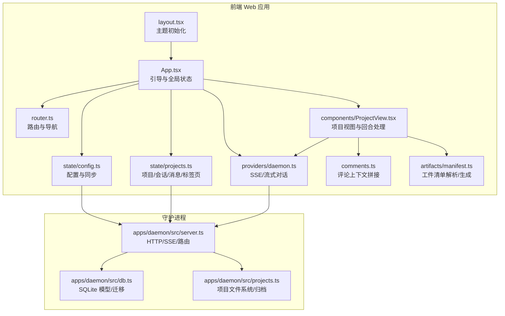
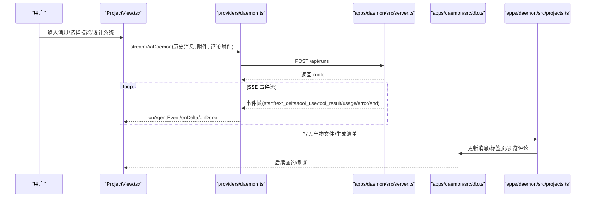
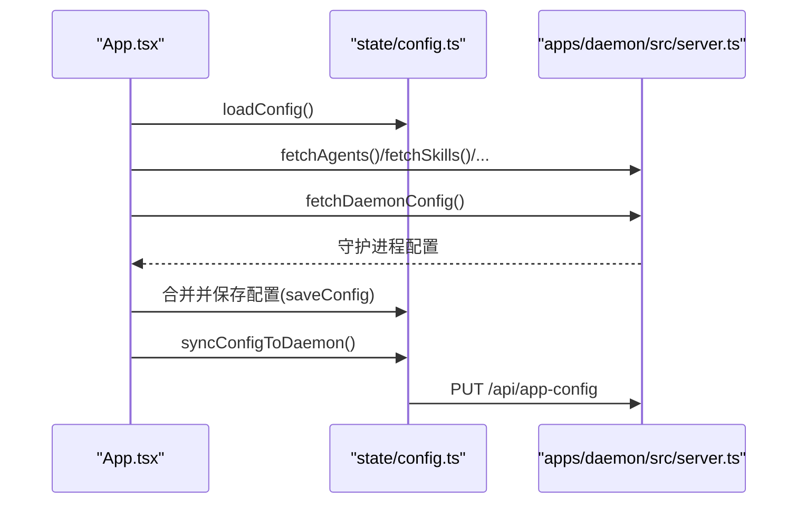
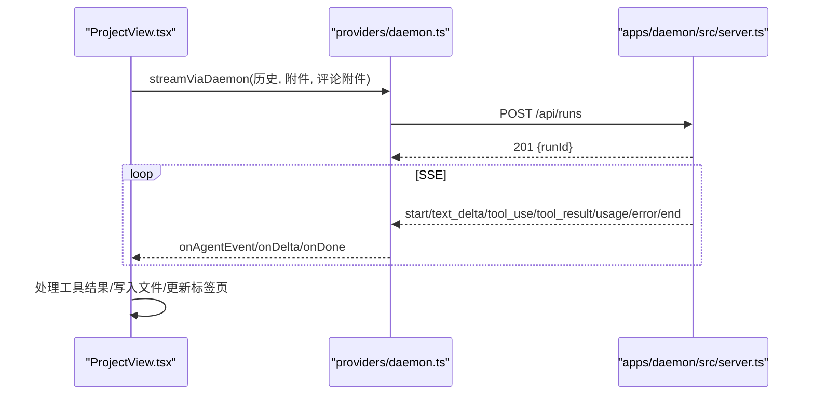
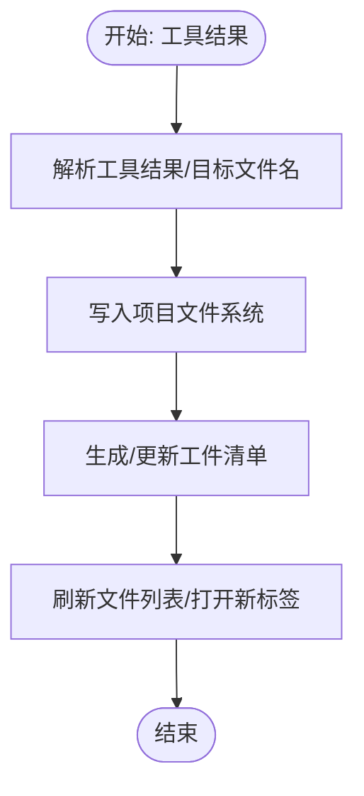
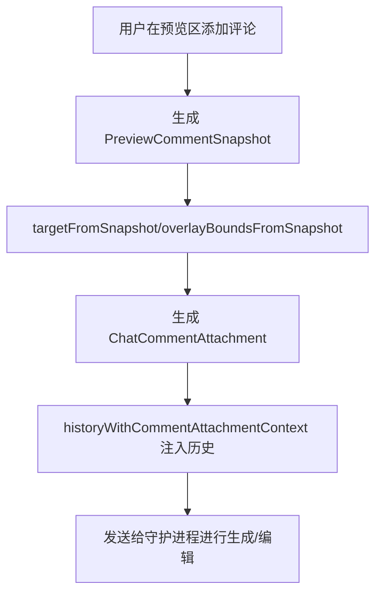
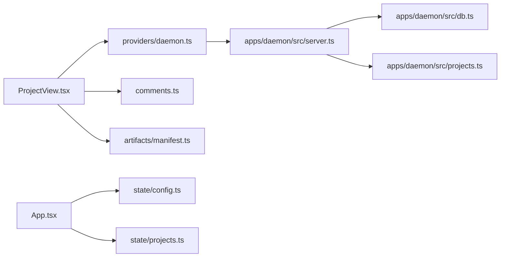

# 数据流与处理

<cite>
**本文引用的文件**   
- [apps/web/app/layout.tsx](file://apps/web/app/layout.tsx)
- [apps/web/src/App.tsx](file://apps/web/src/App.tsx)
- [apps/web/src/router.ts](file://apps/web/src/router.ts)
- [apps/web/src/state/config.ts](file://apps/web/src/state/config.ts)
- [apps/web/src/state/projects.ts](file://apps/web/src/state/projects.ts)
- [apps/web/src/types.ts](file://apps/web/src/types.ts)
- [apps/web/src/providers/daemon.ts](file://apps/web/src/providers/daemon.ts)
- [apps/web/src/comments.ts](file://apps/web/src/comments.ts)
- [apps/web/src/components/ProjectView.tsx](file://apps/web/src/components/ProjectView.tsx)
- [apps/web/src/artifacts/manifest.ts](file://apps/web/src/artifacts/manifest.ts)
- [apps/daemon/src/server.ts](file://apps/daemon/src/server.ts)
- [apps/daemon/src/db.ts](file://apps/daemon/src/db.ts)
- [apps/daemon/src/projects.ts](file://apps/daemon/src/projects.ts)
</cite>

## 目录
1. [引言](#引言)
2. [项目结构](#项目结构)
3. [核心组件](#核心组件)
4. [架构总览](#架构总览)
5. [详细组件分析](#详细组件分析)
6. [依赖关系分析](#依赖关系分析)
7. [性能考量](#性能考量)
8. [故障排查指南](#故障排查指南)
9. [结论](#结论)
10. [附录](#附录)

## 引言
本文件系统性梳理 Open Design 的数据流与处理机制，覆盖从用户输入到最终产物的完整路径：典型设计生成回合、工件树更新、预览渲染、评论编辑流程。重点说明数据在前端应用、运行时提供者与守护进程之间的传递方式、缓存策略、状态同步机制，并给出 API 调用序列、事件流与错误处理流程。同时解释数据持久化策略、版本控制与并发处理机制，帮助开发者与使用者理解端到端的数据流转。

## 项目结构
Open Design 前后端分层清晰：
- 前端 Web 应用（Next.js）负责路由、UI、状态管理与与守护进程交互。
- 守护进程（Express）提供 API、SSE 流、SQLite 持久化、文件系统项目存储与媒体任务队列。
- 类型与契约定义统一于 @open-design/contracts，确保前后端一致的协议。

图表来源
- [apps/web/app/layout.tsx:1-43](file://apps/web/app/layout.tsx#L1-L43)
- [apps/web/src/App.tsx:1-582](file://apps/web/src/App.tsx#L1-L582)
- [apps/web/src/router.ts:1-66](file://apps/web/src/router.ts#L1-L66)
- [apps/web/src/state/config.ts:1-327](file://apps/web/src/state/config.ts#L1-L327)
- [apps/web/src/state/projects.ts:1-305](file://apps/web/src/state/projects.ts#L1-L305)
- [apps/web/src/providers/daemon.ts:1-454](file://apps/web/src/providers/daemon.ts#L1-L454)
- [apps/web/src/comments.ts:1-173](file://apps/web/src/comments.ts#L1-L173)
- [apps/web/src/components/ProjectView.tsx:1-200](file://apps/web/src/components/ProjectView.tsx#L1-L200)
- [apps/web/src/artifacts/manifest.ts:1-184](file://apps/web/src/artifacts/manifest.ts#L1-L184)
- [apps/daemon/src/server.ts:1-800](file://apps/daemon/src/server.ts#L1-L800)
- [apps/daemon/src/db.ts:1-200](file://apps/daemon/src/db.ts#L1-L200)
- [apps/daemon/src/projects.ts:1-200](file://apps/daemon/src/projects.ts#L1-L200)

章节来源
- [apps/web/app/layout.tsx:1-43](file://apps/web/app/layout.tsx#L1-L43)
- [apps/web/src/App.tsx:1-582](file://apps/web/src/App.tsx#L1-L582)
- [apps/web/src/router.ts:1-66](file://apps/web/src/router.ts#L1-L66)
- [apps/web/src/state/config.ts:1-327](file://apps/web/src/state/config.ts#L1-L327)
- [apps/web/src/state/projects.ts:1-305](file://apps/web/src/state/projects.ts#L1-L305)
- [apps/web/src/providers/daemon.ts:1-454](file://apps/web/src/providers/daemon.ts#L1-L454)
- [apps/web/src/comments.ts:1-173](file://apps/web/src/comments.ts#L1-L173)
- [apps/web/src/components/ProjectView.tsx:1-200](file://apps/web/src/components/ProjectView.tsx#L1-L200)
- [apps/web/src/artifacts/manifest.ts:1-184](file://apps/web/src/artifacts/manifest.ts#L1-L184)
- [apps/daemon/src/server.ts:1-800](file://apps/daemon/src/server.ts#L1-L800)
- [apps/daemon/src/db.ts:1-200](file://apps/daemon/src/db.ts#L1-L200)
- [apps/daemon/src/projects.ts:1-200](file://apps/daemon/src/projects.ts#L1-L200)

## 核心组件
- 全局引导与状态
  - App.tsx 负责首次引导、拉取注册表数据、合并守护进程配置、保存本地配置、同步媒体提供者与守护进程配置。
  - router.ts 提供轻量路由与集中导航，保证深链可追踪。
  - state/config.ts 管理本地配置（localStorage）、默认值与迁移、与守护进程配置同步。
  - state/projects.ts 封装项目/模板/会话/消息/标签页的 HTTP 访问，失败软返回。
- 对话与流式处理
  - providers/daemon.ts 实现通过 /api/runs 的 SSE 流式对话，支持重连、事件 ID 续传、取消、状态回调与事件翻译。
  - components/ProjectView.tsx 在项目视图中组织回合、维护消息与预览评论、处理工具调用与文件写入、自动打开文件标签等。
- 工件与清单
  - artifacts/manifest.ts 解析/生成工件清单，支持多种工件类型与导出格式，兼容旧版推断。
- 评论与上下文拼接
  - comments.ts 提供评论快照标准化、附件拼接到聊天内容、历史消息注入评论上下文等。
- 守护进程服务
  - server.ts 提供 SSE/上传/媒体任务/项目文件/数据库访问等 API。
  - db.ts 管理 SQLite 表结构与迁移，涵盖项目、模板、会话、消息、预览评论、标签页与部署。
  - projects.ts 管理项目目录、文件枚举、归档打包、读写文件与清单。

章节来源
- [apps/web/src/App.tsx:1-582](file://apps/web/src/App.tsx#L1-L582)
- [apps/web/src/router.ts:1-66](file://apps/web/src/router.ts#L1-L66)
- [apps/web/src/state/config.ts:1-327](file://apps/web/src/state/config.ts#L1-L327)
- [apps/web/src/state/projects.ts:1-305](file://apps/web/src/state/projects.ts#L1-L305)
- [apps/web/src/providers/daemon.ts:1-454](file://apps/web/src/providers/daemon.ts#L1-L454)
- [apps/web/src/components/ProjectView.tsx:1-200](file://apps/web/src/components/ProjectView.tsx#L1-L200)
- [apps/web/src/artifacts/manifest.ts:1-184](file://apps/web/src/artifacts/manifest.ts#L1-L184)
- [apps/web/src/comments.ts:1-173](file://apps/web/src/comments.ts#L1-L173)
- [apps/daemon/src/server.ts:1-800](file://apps/daemon/src/server.ts#L1-L800)
- [apps/daemon/src/db.ts:1-200](file://apps/daemon/src/db.ts#L1-L200)
- [apps/daemon/src/projects.ts:1-200](file://apps/daemon/src/projects.ts#L1-L200)

## 架构总览
下图展示从用户输入到产物落盘的总体数据流，包括评论上下文注入、SSE 事件翻译、工件清单生成与文件系统写入。

图表来源
- [apps/web/src/components/ProjectView.tsx:1-200](file://apps/web/src/components/ProjectView.tsx#L1-L200)
- [apps/web/src/providers/daemon.ts:87-164](file://apps/web/src/providers/daemon.ts#L87-L164)
- [apps/daemon/src/server.ts:781-800](file://apps/daemon/src/server.ts#L781-L800)
- [apps/daemon/src/db.ts:1-200](file://apps/daemon/src/db.ts#L1-L200)
- [apps/daemon/src/projects.ts:182-200](file://apps/daemon/src/projects.ts#L182-L200)

## 详细组件分析

### 1) 全局引导与配置同步
- 首次启动时，App.tsx 并行拉取守护进程存活状态、代理/技能/设计系统/项目/模板/提示词/版本信息与守护进程配置；随后合并守护进程偏好（优先级更高），设置默认代理/设计系统，保存本地配置并同步至守护进程。
- 配置变更通过 state/config.ts 的 saveConfig 与 syncConfigToDaemon 保持本地与守护进程一致；媒体提供者通过 syncMediaProvidersToDaemon 同步。

图表来源
- [apps/web/src/App.tsx:88-190](file://apps/web/src/App.tsx#L88-L190)
- [apps/web/src/state/config.ts:282-327](file://apps/web/src/state/config.ts#L282-L327)
- [apps/daemon/src/server.ts:781-800](file://apps/daemon/src/server.ts#L781-L800)

章节来源
- [apps/web/src/App.tsx:88-190](file://apps/web/src/App.tsx#L88-L190)
- [apps/web/src/state/config.ts:282-327](file://apps/web/src/state/config.ts#L282-L327)

### 2) 路由与深链
- router.ts 提供 parseRoute/buildPath/navigate/useRoute，集中管理路由变更并通过自定义事件通知订阅者，确保深链可追踪且 UI 能响应 popstate。

章节来源
- [apps/web/src/router.ts:1-66](file://apps/web/src/router.ts#L1-L66)

### 3) 项目与会话生命周期
- App.tsx 在路由变化时加载项目详情，若本地未命中则回退拉取；提供创建/导入/删除/清空待定提示/触碰时间戳等操作，均通过 state/projects.ts 的 HTTP 接口完成。
- ProjectView.tsx 在挂载时加载会话列表，若为空则创建默认会话；切换会话时加载对应消息。

章节来源
- [apps/web/src/App.tsx:220-409](file://apps/web/src/App.tsx#L220-L409)
- [apps/web/src/state/projects.ts:18-305](file://apps/web/src/state/projects.ts#L18-L305)
- [apps/web/src/components/ProjectView.tsx:176-200](file://apps/web/src/components/ProjectView.tsx#L176-L200)

### 4) 设计生成回合（SSE 事件流）
- ProjectView.tsx 通过 providers/daemon.ts 的 streamViaDaemon 发起回合，将历史消息转为单一文本传给守护进程；守护进程以 SSE 返回事件流，前端解析为 UI 事件（文本增量、思考、工具使用/结果、用量、原始日志）。
- 支持重连、事件 ID 续传、显式取消与运行状态回调；失败时附带 stderr 尾声。

图表来源
- [apps/web/src/providers/daemon.ts:87-164](file://apps/web/src/providers/daemon.ts#L87-L164)
- [apps/web/src/providers/daemon.ts:222-378](file://apps/web/src/providers/daemon.ts#L222-L378)
- [apps/daemon/src/server.ts:781-800](file://apps/daemon/src/server.ts#L781-L800)

章节来源
- [apps/web/src/providers/daemon.ts:87-164](file://apps/web/src/providers/daemon.ts#L87-L164)
- [apps/web/src/providers/daemon.ts:222-378](file://apps/web/src/providers/daemon.ts#L222-L378)

### 5) 工件树更新与清单
- 产物写入由守护进程 projects.ts 执行，写入文件后可生成/解析工件清单；ProjectView.tsx 通过保存的工具调用映射与文件列表更新，实现“写入即打开”的体验。
- artifacts/manifest.ts 提供清单创建、序列化、解析与旧版推断，确保不同工件类型与导出格式的兼容。

图表来源
- [apps/web/src/artifacts/manifest.ts:72-184](file://apps/web/src/artifacts/manifest.ts#L72-L184)
- [apps/daemon/src/projects.ts:182-200](file://apps/daemon/src/projects.ts#L182-L200)
- [apps/web/src/components/ProjectView.tsx:150-200](file://apps/web/src/components/ProjectView.tsx#L150-L200)

章节来源
- [apps/web/src/artifacts/manifest.ts:72-184](file://apps/web/src/artifacts/manifest.ts#L72-L184)
- [apps/daemon/src/projects.ts:182-200](file://apps/daemon/src/projects.ts#L182-L200)
- [apps/web/src/components/ProjectView.tsx:150-200](file://apps/web/src/components/ProjectView.tsx#L150-L200)

### 6) 预览渲染与评论编辑
- comments.ts 提供评论快照标准化、附件拼接、历史消息注入评论上下文、附加评论的增删改查辅助函数。
- ProjectView.tsx 在聊天中收集/附加评论，将评论附件注入用户消息，使后续生成更聚焦目标元素。

图表来源
- [apps/web/src/comments.ts:25-103](file://apps/web/src/comments.ts#L25-L103)
- [apps/web/src/comments.ts:136-159](file://apps/web/src/comments.ts#L136-L159)
- [apps/web/src/components/ProjectView.tsx:126-200](file://apps/web/src/components/ProjectView.tsx#L126-L200)

章节来源
- [apps/web/src/comments.ts:25-103](file://apps/web/src/comments.ts#L25-L103)
- [apps/web/src/comments.ts:136-159](file://apps/web/src/comments.ts#L136-L159)
- [apps/web/src/components/ProjectView.tsx:126-200](file://apps/web/src/components/ProjectView.tsx#L126-L200)

### 7) 数据持久化与版本控制
- SQLite 持久化：apps/daemon/src/db.ts 定义项目、模板、会话、消息、预览评论、标签页与部署表，并执行迁移；所有写操作经由 HTTP 接口，确保跨标签页与重启一致性。
- 文件系统：apps/daemon/src/projects.ts 管理项目目录、文件枚举、归档打包、读写文件与清单，严格校验路径防止越权。
- 版本控制：artifacts/manifest.ts 使用版本号与白名单字段，解析时进行严格校验，避免不兼容清单导致渲染异常。

章节来源
- [apps/daemon/src/db.ts:1-200](file://apps/daemon/src/db.ts#L1-L200)
- [apps/daemon/src/projects.ts:32-200](file://apps/daemon/src/projects.ts#L32-L200)
- [apps/web/src/artifacts/manifest.ts:96-145](file://apps/web/src/artifacts/manifest.ts#L96-L145)

### 8) 并发与缓存策略
- 并发：/api/runs 支持多回合并行；ProjectView.tsx 通过 AbortController 管理回合生命周期，避免竞态；守护进程对每个任务维护进度队列与等待者集合，超时回收。
- 缓存：前端对技能/设计系统/模板/提示词等进行一次性拉取并缓存在内存；配置通过 localStorage 缓存并在守护进程不可用时作为后备。

章节来源
- [apps/daemon/src/server.ts:680-725](file://apps/daemon/src/server.ts#L680-L725)
- [apps/web/src/state/config.ts:215-271](file://apps/web/src/state/config.ts#L215-L271)

### 9) 错误处理流程
- SSE 连接失败：providers/daemon.ts 自动重连最多 N 次，若仍失败则回退查询运行状态；错误事件与退出码/信号组合形成最终错误消息。
- HTTP 失败：state/projects.ts 与 state/config.ts 的 HTTP 请求失败时返回空/空数组/空对象，UI 保持可用性。
- 评论附件：normalize 与裁剪逻辑确保上下文安全，避免过长文本影响模型。

章节来源
- [apps/web/src/providers/daemon.ts:251-378](file://apps/web/src/providers/daemon.ts#L251-L378)
- [apps/web/src/state/projects.ts:18-305](file://apps/web/src/state/projects.ts#L18-L305)
- [apps/web/src/comments.ts:161-173](file://apps/web/src/comments.ts#L161-L173)

## 依赖关系分析
- 前端组件依赖 providers/daemon.ts 进行流式对话；依赖 state/projects.ts 与 state/config.ts 进行项目与配置管理；依赖 comments.ts 与 artifacts/manifest.ts 处理评论与工件。
- 守护进程 server.ts 依赖 db.ts 与 projects.ts 提供持久化与文件系统能力；对外暴露统一的 HTTP/SSE 接口。

图表来源
- [apps/web/src/components/ProjectView.tsx:1-200](file://apps/web/src/components/ProjectView.tsx#L1-L200)
- [apps/web/src/providers/daemon.ts:1-454](file://apps/web/src/providers/daemon.ts#L1-L454)
- [apps/web/src/comments.ts:1-173](file://apps/web/src/comments.ts#L1-L173)
- [apps/web/src/artifacts/manifest.ts:1-184](file://apps/web/src/artifacts/manifest.ts#L1-L184)
- [apps/daemon/src/server.ts:1-800](file://apps/daemon/src/server.ts#L1-L800)
- [apps/daemon/src/db.ts:1-200](file://apps/daemon/src/db.ts#L1-L200)
- [apps/daemon/src/projects.ts:1-200](file://apps/daemon/src/projects.ts#L1-L200)
- [apps/web/src/App.tsx:1-582](file://apps/web/src/App.tsx#L1-L582)
- [apps/web/src/state/config.ts:1-327](file://apps/web/src/state/config.ts#L1-L327)
- [apps/web/src/state/projects.ts:1-305](file://apps/web/src/state/projects.ts#L1-L305)

## 性能考量
- SSE 心跳与断线重连：守护进程维持固定心跳间隔，前端在无事件时自动重连，降低长时间无输出的连接中断风险。
- 任务 TTL：媒体任务完成后保留一段时间以便等待者消费，避免频繁重建任务带来的开销。
- 文件系统归档：ZIP 采用默认压缩级别平衡速度与体积，避免过度压缩导致 CPU 占用过高。
- 前端懒加载：模板/技能/设计系统等资源按需拉取，减少首屏压力。

## 故障排查指南
- SSE 连接异常
  - 现象：回合中途断流或无法接收事件。
  - 排查：检查守护进程日志与网络连通性；确认浏览器允许 EventSource；查看 providers/daemon.ts 的重连次数与错误消息。
- 评论上下文无效
  - 现象：生成结果未聚焦目标元素。
  - 排查：确认 comments.ts 的快照标准化与附件拼接是否正确；检查历史消息注入是否包含评论附件。
- 工件清单解析失败
  - 现象：产物无法渲染或导出。
  - 排查：核对 artifacts/manifest.ts 的版本与字段白名单；检查清单文件是否被意外修改。
- 项目文件缺失或权限问题
  - 现象：写入失败或读取不到文件。
  - 排查：确认 projects.ts 的路径校验与权限；检查守护进程工作目录与 OD_DATA_DIR 设置。

章节来源
- [apps/web/src/providers/daemon.ts:251-378](file://apps/web/src/providers/daemon.ts#L251-L378)
- [apps/web/src/comments.ts:25-103](file://apps/web/src/comments.ts#L25-L103)
- [apps/web/src/artifacts/manifest.ts:96-145](file://apps/web/src/artifacts/manifest.ts#L96-L145)
- [apps/daemon/src/projects.ts:19-30](file://apps/daemon/src/projects.ts#L19-L30)

## 结论
Open Design 的数据流以“前端状态 + SSE 事件 + 守护进程持久化”为核心，通过严格的路径校验、清单版本控制与任务 TTL 等机制保障稳定性与性能。评论上下文注入与工件清单解析进一步提升了生成的精确性与可追溯性。建议在生产环境中关注 SSE 心跳与重连策略、文件系统权限与磁盘配额、以及评论附件的长度限制，以获得最佳用户体验。

## 附录
- 关键 API 一览
  - GET /api/projects → 列出项目
  - POST /api/projects → 创建项目
  - GET /api/projects/:id → 获取项目
  - PATCH /api/projects/:id → 更新项目
  - DELETE /api/projects/:id → 删除项目
  - POST /api/projects/:id/conversations → 新建会话
  - GET /api/projects/:id/conversations → 列出会话
  - GET /api/projects/:id/conversations/:cid/messages → 列出消息
  - PUT /api/projects/:id/conversations/:cid/messages/:mid → 保存消息
  - GET /api/projects/:id/tabs → 加载标签页
  - PUT /api/projects/:id/tabs → 保存标签页
  - POST /api/runs → 创建回合
  - GET /api/runs/:id/events → SSE 事件流
  - GET /api/runs/:id → 查询回合状态
  - POST /api/runs/:id/cancel → 取消回合
  - POST /api/artifacts/save → 保存工件
  - PUT /api/app-config → 同步应用配置
  - PUT /api/media/config → 同步媒体提供者配置

章节来源
- [apps/web/src/state/projects.ts:18-305](file://apps/web/src/state/projects.ts#L18-L305)
- [apps/web/src/providers/daemon.ts:133-220](file://apps/web/src/providers/daemon.ts#L133-L220)
- [apps/web/src/providers/daemon.ts:437-454](file://apps/web/src/providers/daemon.ts#L437-L454)
- [apps/web/src/state/config.ts:282-327](file://apps/web/src/state/config.ts#L282-L327)