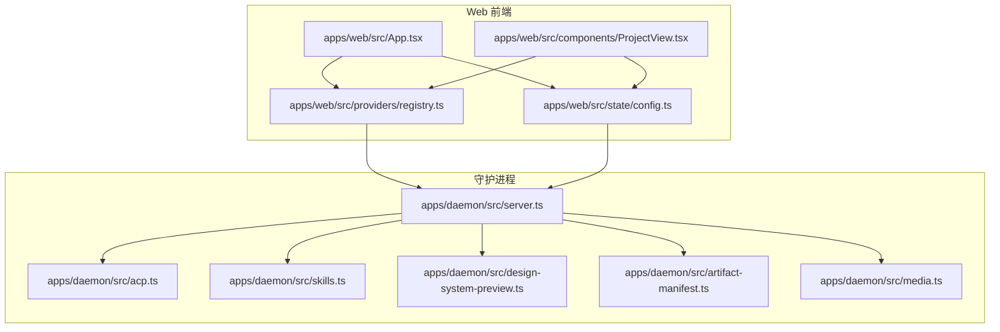
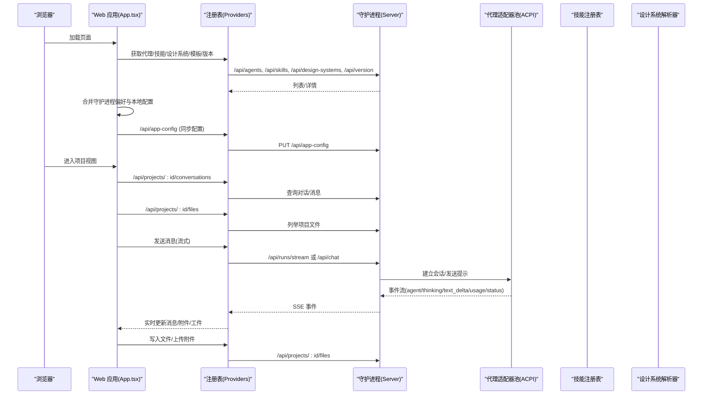
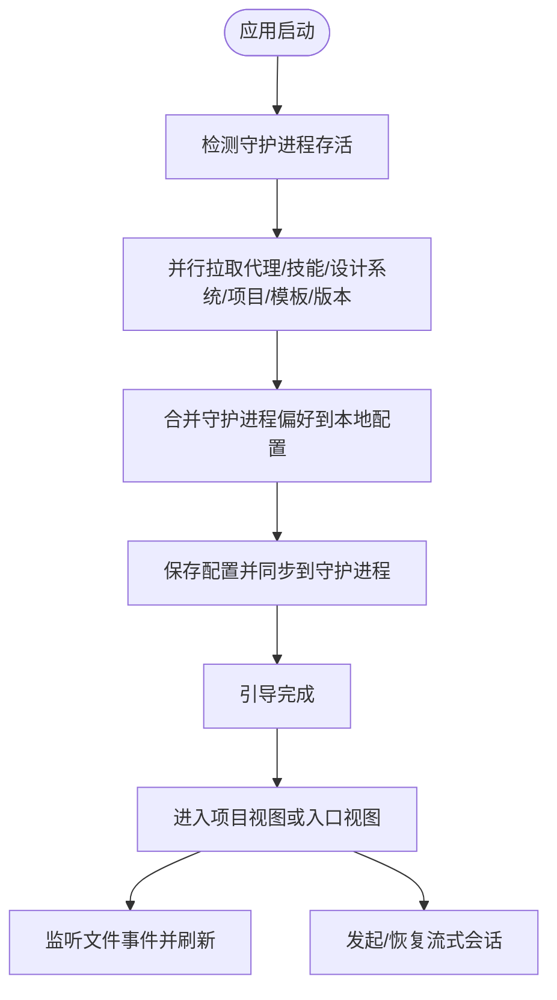
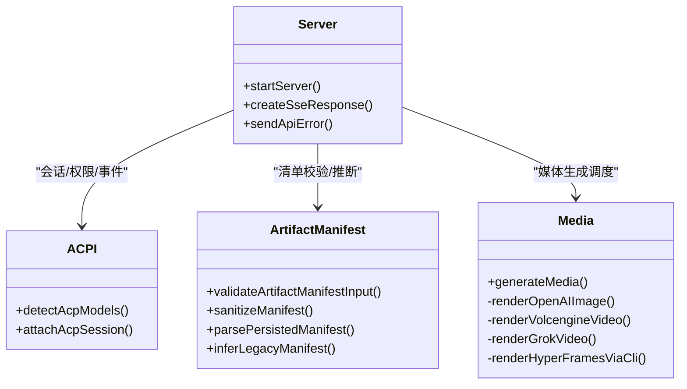
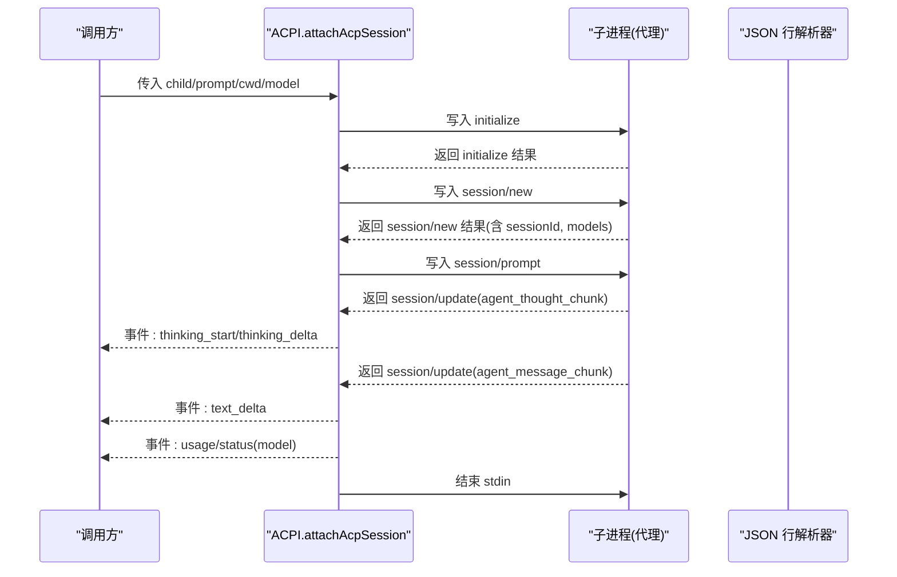
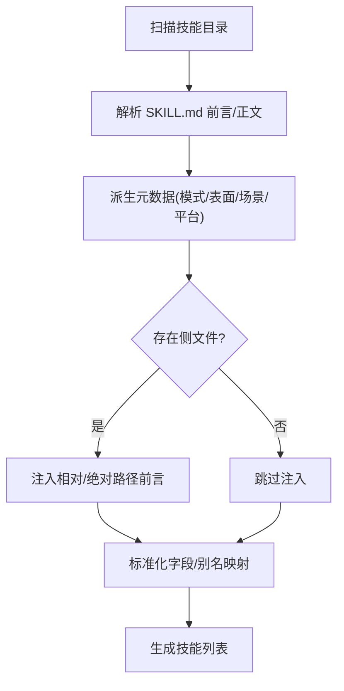
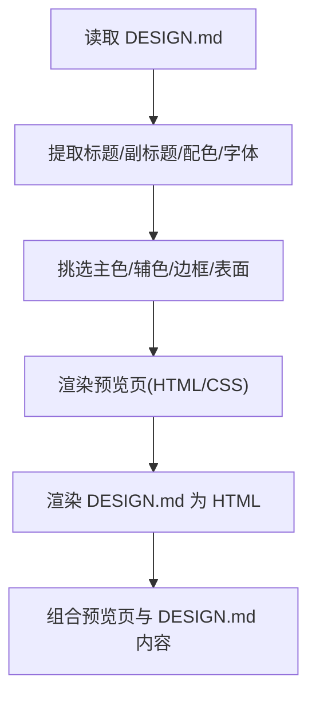
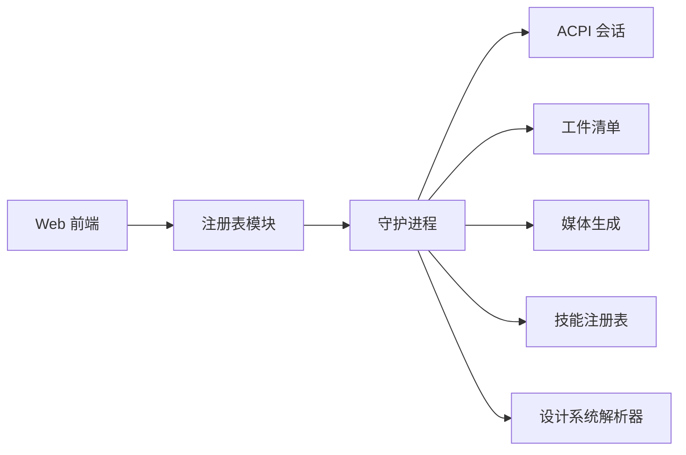

# 核心组件详解

<cite>
**本文档引用的文件**
- [apps/web/src/App.tsx](file://apps/web/src/App.tsx)
- [apps/web/src/state/config.ts](file://apps/web/src/state/config.ts)
- [apps/web/src/providers/registry.ts](file://apps/web/src/providers/registry.ts)
- [apps/web/src/components/ProjectView.tsx](file://apps/web/src/components/ProjectView.tsx)
- [apps/daemon/src/server.ts](file://apps/daemon/src/server.ts)
- [apps/daemon/src/acp.ts](file://apps/daemon/src/acp.ts)
- [apps/daemon/src/skills.ts](file://apps/daemon/src/skills.ts)
- [apps/daemon/src/design-system-preview.ts](file://apps/daemon/src/design-system-preview.ts)
- [apps/daemon/src/artifact-manifest.ts](file://apps/daemon/src/artifact-manifest.ts)
- [apps/daemon/src/media.ts](file://apps/daemon/src/media.ts)
</cite>

## 目录
1. [引言](#引言)
2. [项目结构](#项目结构)
3. [核心组件](#核心组件)
4. [架构总览](#架构总览)
5. [详细组件分析](#详细组件分析)
6. [依赖关系分析](#依赖关系分析)
7. [性能考量](#性能考量)
8. [故障排查指南](#故障排查指南)
9. [结论](#结论)

## 引言
本文件面向 Open Design 的五大核心组件，提供从架构到实现细节的完整技术说明。重点覆盖：
- Web 应用（Next.js 16 + React 18）的架构设计、状态管理与预览渲染机制
- 守护进程的会话管理、代理适配器池与工件存储
- 代理适配器池的检测机制、流式协议解析与能力报告
- 技能注册表的扫描策略、冲突解决与热重载
- 设计系统解析器的格式规范、注入机制与模板变量

目标是帮助开发者快速理解各组件职责、数据流与扩展点，并给出最佳实践与排障建议。

## 项目结构
Open Design 采用多应用分层组织：
- apps/web：基于 Next.js 的前端应用，负责用户界面、状态管理与与守护进程交互
- apps/daemon：Node.js 守护进程，提供 API、代理适配器池、媒体生成、工件清单校验等能力
- 其他目录包含技能、设计系统、提示词模板、桌面端等

图表来源
- [apps/web/src/App.tsx:1-582](file://apps/web/src/App.tsx#L1-L582)
- [apps/web/src/components/ProjectView.tsx:1-800](file://apps/web/src/components/ProjectView.tsx#L1-L800)
- [apps/web/src/state/config.ts:1-327](file://apps/web/src/state/config.ts#L1-L327)
- [apps/web/src/providers/registry.ts:1-682](file://apps/web/src/providers/registry.ts#L1-L682)
- [apps/daemon/src/server.ts:1-800](file://apps/daemon/src/server.ts#L1-L800)
- [apps/daemon/src/acp.ts:1-424](file://apps/daemon/src/acp.ts#L1-L424)
- [apps/daemon/src/skills.ts:1-304](file://apps/daemon/src/skills.ts#L1-L304)
- [apps/daemon/src/design-system-preview.ts:1-621](file://apps/daemon/src/design-system-preview.ts#L1-L621)
- [apps/daemon/src/artifact-manifest.ts:1-260](file://apps/daemon/src/artifact-manifest.ts#L1-L260)
- [apps/daemon/src/media.ts:1-800](file://apps/daemon/src/media.ts#L1-L800)

章节来源
- [apps/web/src/App.tsx:1-582](file://apps/web/src/App.tsx#L1-L582)
- [apps/daemon/src/server.ts:1-800](file://apps/daemon/src/server.ts#L1-L800)

## 核心组件
本节概述五大核心组件及其在系统中的定位与职责。

- Web 应用（Next.js 16 + React 18）
  - 负责路由、主题切换、全局状态（配置）、与守护进程的 API 交互
  - 在启动阶段拉取代理、技能、设计系统、模板、版本信息等，完成“引导”流程
  - 提供项目视图、聊天面板、文件工作区、预览评论等子组件

- 守护进程（Node.js）
  - 提供 REST API 与 SSE 流，承载会话管理、代理适配器池、媒体生成、工件清单校验
  - 管理项目文件、工件清单、设计系统预览、技能注册表等

- 代理适配器池（ACPI/JSON-RPC）
  - 通过 ACP 协议探测可用模型、建立会话、处理权限请求、解析流事件
  - 将代理输出映射为统一的事件流，供前端实时展示

- 技能注册表
  - 扫描本地技能目录，解析 SKILL.md 前言与正文，派生元数据（模式、表面、场景等）
  - 支持别名映射与热重载，确保旧项目 ID 可解析

- 设计系统解析器
  - 解析 DESIGN.md，提取配色、字体、组件约定，生成可预览的展示页
  - 提供轻量 Markdown 渲染与表格支持，保证 DESIGN.md 的丰富表达

章节来源
- [apps/web/src/App.tsx:1-582](file://apps/web/src/App.tsx#L1-L582)
- [apps/web/src/providers/registry.ts:1-682](file://apps/web/src/providers/registry.ts#L1-L682)
- [apps/daemon/src/acp.ts:1-424](file://apps/daemon/src/acp.ts#L1-L424)
- [apps/daemon/src/skills.ts:1-304](file://apps/daemon/src/skills.ts#L1-L304)
- [apps/daemon/src/design-system-preview.ts:1-621](file://apps/daemon/src/design-system-preview.ts#L1-L621)

## 架构总览
下图展示了 Web 前端与守护进程之间的交互路径，以及关键数据流与控制流。

图表来源
- [apps/web/src/App.tsx:1-582](file://apps/web/src/App.tsx#L1-L582)
- [apps/web/src/providers/registry.ts:1-682](file://apps/web/src/providers/registry.ts#L1-L682)
- [apps/daemon/src/server.ts:1-800](file://apps/daemon/src/server.ts#L1-L800)
- [apps/daemon/src/acp.ts:1-424](file://apps/daemon/src/acp.ts#L1-L424)

## 详细组件分析

### Web 应用（Next.js 16 + React 18）
- 启动与引导
  - 检测守护进程存活，批量拉取代理、技能、设计系统、项目、模板、版本信息
  - 合并守护进程偏好（如已选代理、技能、设计系统），写回本地配置并同步至守护进程
  - 首次运行弹出引导设置，完成后标记完成，避免重复弹窗
- 状态管理
  - 使用本地存储保存用户偏好（主题、通知、宠物、媒体提供者等）
  - 通过统一的配置模块进行读写与迁移，确保跨版本兼容
- 预览渲染与文件工作区
  - 项目视图中按需加载对话、消息、预览评论与附件
  - 文件列表变更触发缓存失效与自动刷新，支持多标签页状态持久化
- 与守护进程交互
  - 通过注册表封装 API，统一错误处理与类型约束
  - 支持项目文件上传、文本写入、图像导入、部署配置等

图表来源
- [apps/web/src/App.tsx:1-582](file://apps/web/src/App.tsx#L1-L582)
- [apps/web/src/state/config.ts:1-327](file://apps/web/src/state/config.ts#L1-L327)
- [apps/web/src/providers/registry.ts:1-682](file://apps/web/src/providers/registry.ts#L1-L682)

章节来源
- [apps/web/src/App.tsx:1-582](file://apps/web/src/App.tsx#L1-L582)
- [apps/web/src/state/config.ts:1-327](file://apps/web/src/state/config.ts#L1-L327)
- [apps/web/src/providers/registry.ts:1-682](file://apps/web/src/providers/registry.ts#L1-L682)
- [apps/web/src/components/ProjectView.tsx:1-800](file://apps/web/src/components/ProjectView.tsx#L1-L800)

### 守护进程（会话管理、代理适配器池、工件存储）
- 会话管理与流式协议
  - 提供 SSE 响应构造器，维持心跳，向客户端推送事件
  - 统一错误响应格式，便于前端一致处理
- 代理适配器池（ACPI/JSON-RPC）
  - 通过 ACP 协议探测可用模型、建立会话、处理权限请求
  - 解析代理输出为统一事件（思考片段、文本增量、使用统计、模型选择等）
- 工件存储与清单
  - 校验与清洗工件清单，限制字段长度与类型，确保安全与一致性
  - 支持从文件名推断旧版清单，保持向后兼容
- 媒体生成调度
  - 统一入口分发到不同提供商（OpenAI、火山引擎、Grok、Minimax、FishAudio 等）
  - 对于未集成的组合，按构建开关决定是否返回占位符

图表来源
- [apps/daemon/src/server.ts:1-800](file://apps/daemon/src/server.ts#L1-L800)
- [apps/daemon/src/acp.ts:1-424](file://apps/daemon/src/acp.ts#L1-L424)
- [apps/daemon/src/artifact-manifest.ts:1-260](file://apps/daemon/src/artifact-manifest.ts#L1-L260)
- [apps/daemon/src/media.ts:1-800](file://apps/daemon/src/media.ts#L1-L800)

章节来源
- [apps/daemon/src/server.ts:1-800](file://apps/daemon/src/server.ts#L1-L800)
- [apps/daemon/src/acp.ts:1-424](file://apps/daemon/src/acp.ts#L1-L424)
- [apps/daemon/src/artifact-manifest.ts:1-260](file://apps/daemon/src/artifact-manifest.ts#L1-L260)
- [apps/daemon/src/media.ts:1-800](file://apps/daemon/src/media.ts#L1-L800)

### 代理适配器池（检测机制、流式协议解析、能力报告）
- 检测机制
  - 以 JSON-RPC 初始化协议，发送 initialize 请求，随后 session/new 获取模型列表
  - 通过超时与错误日志聚合，确保失败可诊断
- 流式协议解析
  - 监听 session/update 中的 agent_thought_chunk 与 agent_message_chunk
  - 将增量文本映射为前端事件，同时上报 TTFT、使用统计等指标
- 能力报告
  - 从模型列表中提取可用模型、当前模型、标签等，用于前端选择与展示

图表来源
- [apps/daemon/src/acp.ts:1-424](file://apps/daemon/src/acp.ts#L1-L424)

章节来源
- [apps/daemon/src/acp.ts:1-424](file://apps/daemon/src/acp.ts#L1-L424)

### 技能注册表（扫描策略、冲突解决、热重载）
- 扫描策略
  - 遍历技能目录，查找 SKILL.md，解析前言与正文，派生模式、表面、场景、平台等元数据
  - 支持侧文件（assets/references）的相对路径注入，增强作者指引
- 冲突解决
  - 通过 ID 别名映射，将旧 ID 映射到新 ID，保证历史项目仍可正确组合
- 热重载
  - 列表每次请求均重新扫描，确保新增/修改技能即时生效

图表来源
- [apps/daemon/src/skills.ts:1-304](file://apps/daemon/src/skills.ts#L1-L304)

章节来源
- [apps/daemon/src/skills.ts:1-304](file://apps/daemon/src/skills.ts#L1-L304)

### 设计系统解析器（格式规范、注入机制、模板变量）
- 格式规范
  - 支持多种配色与字体标注形式，提取标题、副标题、配色、字体栈
  - 生成预览页，包含调色板、字体示例与组件卡片
- 注入机制
  - 将 DESIGN.md 渲染为 HTML，保留表格、代码块、引用等结构
- 模板变量
  - 通过 CSS 变量与内联样式，将解析结果注入到固定模板中，形成可预览的展示页

图表来源
- [apps/daemon/src/design-system-preview.ts:1-621](file://apps/daemon/src/design-system-preview.ts#L1-L621)

章节来源
- [apps/daemon/src/design-system-preview.ts:1-621](file://apps/daemon/src/design-system-preview.ts#L1-L621)

## 依赖关系分析
- 组件耦合
  - Web 前端通过注册表模块与守护进程解耦，API 层统一错误处理
  - 守护进程内部模块职责清晰：ACPI 负责代理会话，Media 负责媒体生成，Artifact 负责清单校验
- 外部依赖
  - Express 提供 HTTP/SSE 服务
  - 子进程管理代理适配器，文件系统支撑项目与工件存储
- 循环依赖
  - 当前模块划分避免了循环依赖；若后续扩展，建议通过接口抽象进一步解耦

图表来源
- [apps/web/src/providers/registry.ts:1-682](file://apps/web/src/providers/registry.ts#L1-L682)
- [apps/daemon/src/server.ts:1-800](file://apps/daemon/src/server.ts#L1-L800)
- [apps/daemon/src/acp.ts:1-424](file://apps/daemon/src/acp.ts#L1-L424)
- [apps/daemon/src/artifact-manifest.ts:1-260](file://apps/daemon/src/artifact-manifest.ts#L1-L260)
- [apps/daemon/src/media.ts:1-800](file://apps/daemon/src/media.ts#L1-L800)
- [apps/daemon/src/skills.ts:1-304](file://apps/daemon/src/skills.ts#L1-L304)
- [apps/daemon/src/design-system-preview.ts:1-621](file://apps/daemon/src/design-system-preview.ts#L1-L621)

章节来源
- [apps/web/src/providers/registry.ts:1-682](file://apps/web/src/providers/registry.ts#L1-L682)
- [apps/daemon/src/server.ts:1-800](file://apps/daemon/src/server.ts#L1-L800)

## 性能考量
- 并行引导：前端在启动阶段并行拉取多项资源，缩短首屏时间
- 缓存与刷新：项目文件变更通过时间戳缓存失效，减少不必要的重渲染
- 流式传输：SSE 与增量事件降低延迟，提升交互体验
- 清单校验：严格的清单字段校验与默认值填充，避免无效工件影响渲染
- 媒体生成：对数值参数进行桶式裁剪，防止异常输入导致高额费用

## 故障排查指南
- 守护进程不可达
  - 检查 /api/health 是否返回成功
  - 确认绑定主机与端口策略允许浏览器访问
- 会话流中断
  - 查看 SSE 事件是否持续，确认心跳是否正常
  - 检查代理适配器是否正确初始化与权限请求是否被接受
- 工件清单错误
  - 校验清单字段长度与类型，确认 exports 与 status 合法
  - 若为旧版清单，检查文件名推断逻辑
- 媒体生成失败
  - 确认提供者凭据配置正确
  - 对于未集成的组合，检查构建开关是否允许占位符返回

章节来源
- [apps/web/src/providers/registry.ts:1-682](file://apps/web/src/providers/registry.ts#L1-L682)
- [apps/daemon/src/server.ts:1-800](file://apps/daemon/src/server.ts#L1-L800)
- [apps/daemon/src/artifact-manifest.ts:1-260](file://apps/daemon/src/artifact-manifest.ts#L1-L260)
- [apps/daemon/src/media.ts:1-800](file://apps/daemon/src/media.ts#L1-L800)

## 结论
Open Design 的五大核心组件围绕“前端引导 + 守护进程能力 + 代理适配器池 + 技能注册表 + 设计系统解析器”的架构协同工作。前端通过统一注册表与守护进程交互，守护进程以模块化方式提供会话、媒体、清单与存储能力。代理适配器池通过 ACPI 协议实现统一的流式协议解析与能力报告。技能注册表与设计系统解析器分别承担内容与样式的预览能力。整体设计强调可扩展性、可观测性与安全性，适合在复杂 AI 工作流场景中稳定演进。