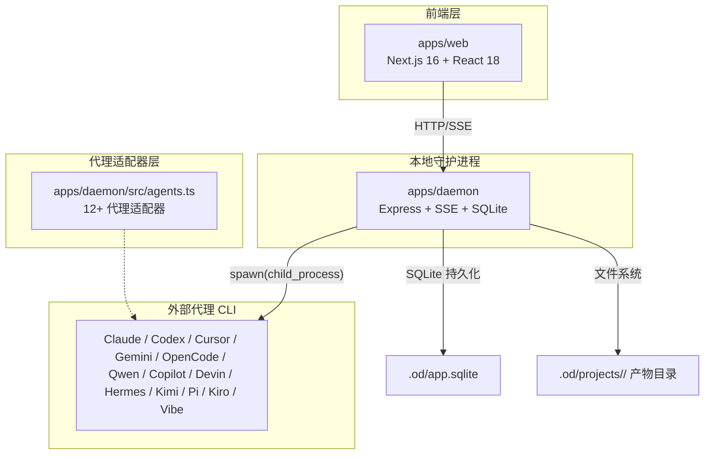
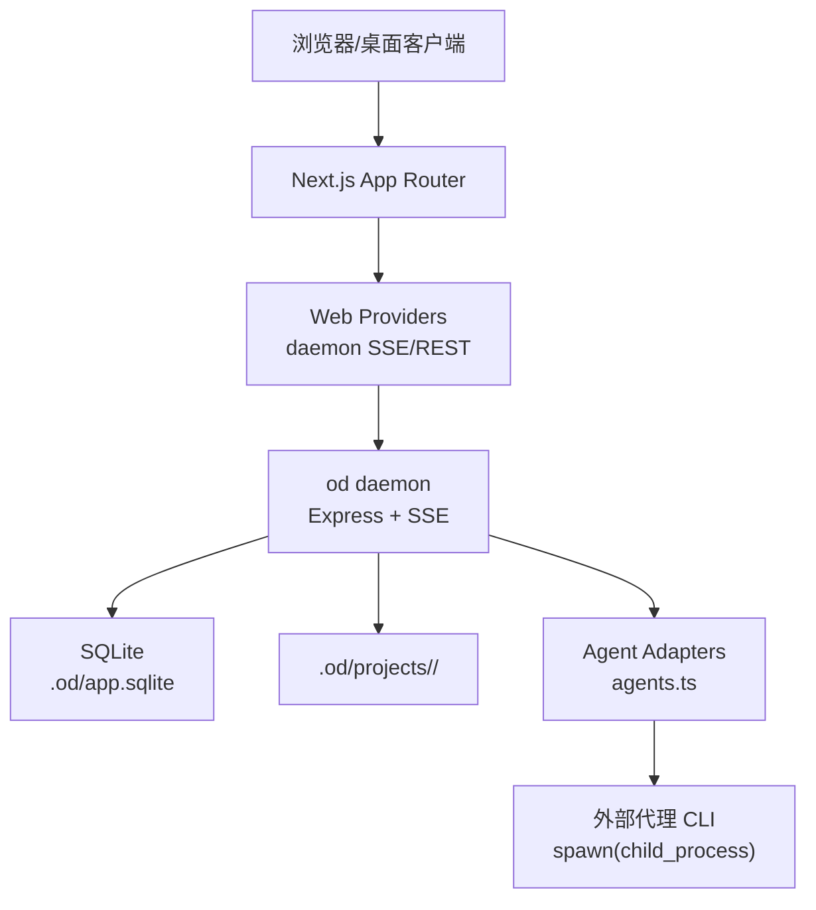
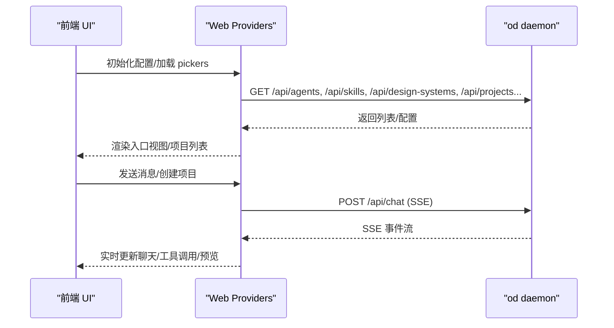
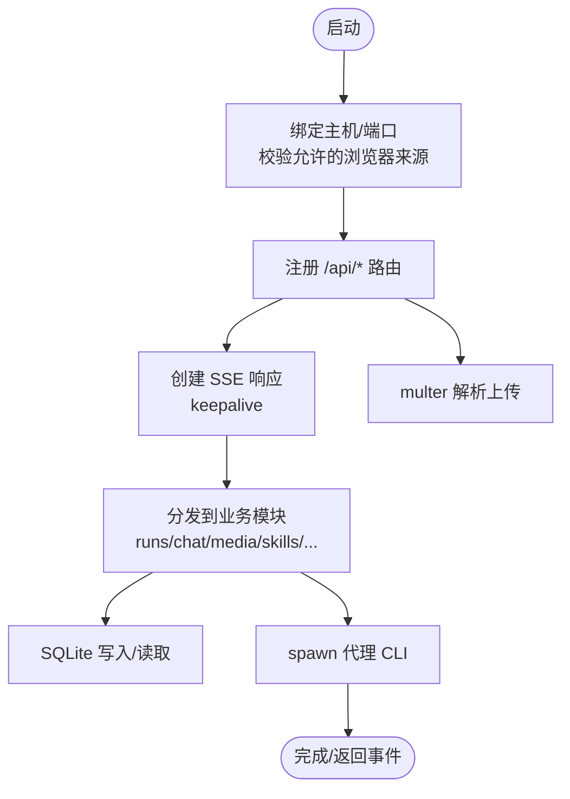
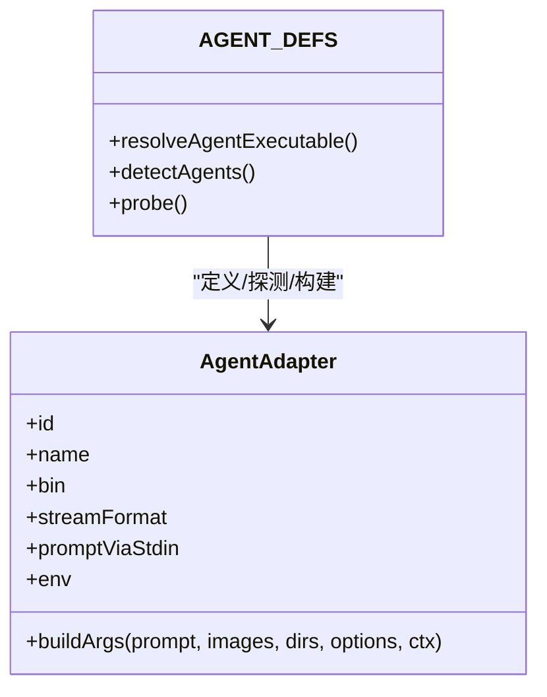
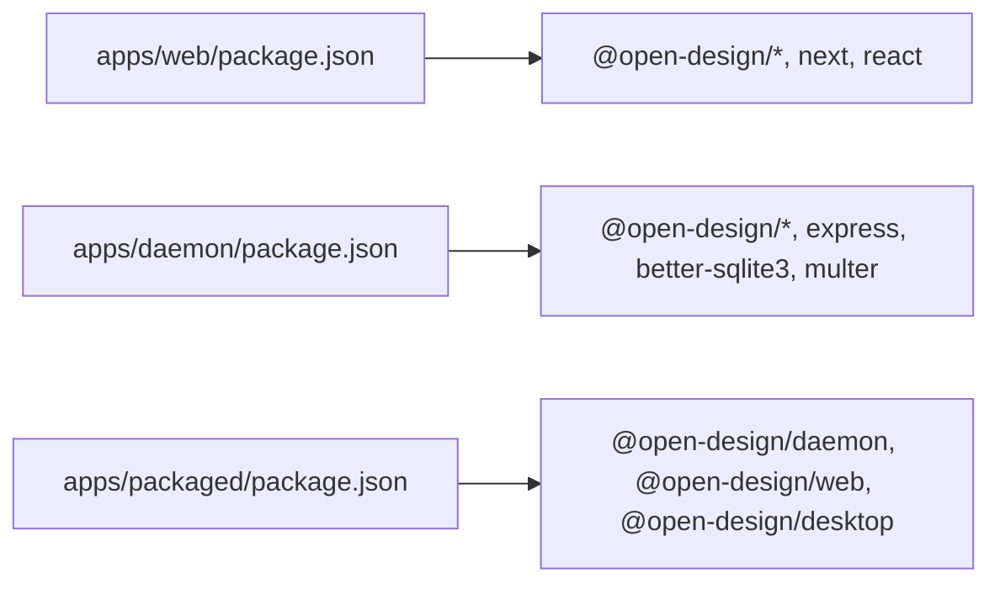

# 系统架构

<cite>
**本文引用的文件**   
- [README.md](file://README.md)
- [docs/architecture.md](file://docs/architecture.md)
- [apps/web/package.json](file://apps/web/package.json)
- [apps/daemon/package.json](file://apps/daemon/package.json)
- [apps/packaged/package.json](file://apps/packaged/package.json)
- [apps/web/src/App.tsx](file://apps/web/src/App.tsx)
- [apps/daemon/src/server.ts](file://apps/daemon/src/server.ts)
- [apps/daemon/src/agents.ts](file://apps/daemon/src/agents.ts)
- [apps/daemon/src/db.ts](file://apps/daemon/src/db.ts)
</cite>

## 目录
1. [引言](#引言)
2. [项目结构](#项目结构)
3. [核心组件](#核心组件)
4. [架构总览](#架构总览)
5. [详细组件分析](#详细组件分析)
6. [依赖关系分析](#依赖关系分析)
7. [性能考量](#性能考量)
8. [故障排查指南](#故障排查指南)
9. [结论](#结论)
10. [附录](#附录)

## 引言
本文件面向 Open Design 的系统架构，围绕四层设计进行深入解析：前端 Web 应用（Next.js 16 + React 18）、本地守护进程（Node.js + Express + SQLite）、代理适配器层、以及外部代理 CLI。文档阐述组件交互模式、数据流向与安全边界，并给出部署拓扑、微服务化取舍、可扩展性与灾难恢复策略。

## 项目结构
Open Design 采用多包工作区（pnpm workspace）组织，核心应用位于 apps/ 下：
- apps/web：Next.js 16 App Router 前端，React 18，提供聊天、文件工作区、预览、设置等界面。
- apps/daemon：Node.js + Express 守护进程，提供 /api/* REST/SSE 接口，管理项目、会话、对话、SQLite 数据库、代理适配器池、媒体生成等。
- apps/packaged：打包壳层（Electron/桌面），承载 sidecar 协议与 IPC。
- packages/*：共享契约、平台与 sidecar 原语。

图示来源
- [apps/web/package.json:1-52](file://apps/web/package.json#L1-L52)
- [apps/daemon/package.json:1-57](file://apps/daemon/package.json#L1-L57)
- [apps/daemon/src/server.ts:781-800](file://apps/daemon/src/server.ts#L781-L800)
- [apps/daemon/src/agents.ts:119-604](file://apps/daemon/src/agents.ts#L119-L604)

章节来源
- [README.md:344-441](file://README.md#L344-L441)
- [docs/architecture.md:14-101](file://docs/architecture.md#L14-L101)

## 核心组件
- 前端 Web 应用（apps/web）
  - Next.js 16 App Router + React 18，提供聊天、文件工作区、预览 iframe、设置、导入等功能。
  - 通过 providers 与 daemon 通信，支持 SSE 流式输出与 REST 调用。
- 本地守护进程（apps/daemon）
  - Express 服务器，监听本地端口（默认 7456），提供 /api/* 路由。
  - 管理项目、会话、对话、模板、预览评论、部署状态等；持久化使用 SQLite。
  - 代理适配器池：统一检测与调度用户 PATH 上的 12+ 代理 CLI，按格式解析流式事件。
- 代理适配器层（apps/daemon/src/agents.ts）
  - 针对不同 CLI 的探测、参数构建、流式解析、能力声明与环境注入。
  - 支持多流式协议：claude-stream-json、copilot-stream-json、json-event-stream、acp-json-rpc、pi-rpc、plain。
- 外部代理 CLI
  - 通过 child_process spawn，以 cwd 指向项目产物目录执行，具备 Read/Write/Bash/WebFetch 权限。
- 数据存储
  - SQLite 表：projects、conversations、messages、preview_comments、tabs、templates、deployments。
  - 产物目录：.od/projects/<id>/，用于真实文件写入与预览渲染。

章节来源
- [apps/web/src/App.tsx:50-190](file://apps/web/src/App.tsx#L50-L190)
- [apps/daemon/src/server.ts:781-800](file://apps/daemon/src/server.ts#L781-L800)
- [apps/daemon/src/agents.ts:119-604](file://apps/daemon/src/agents.ts#L119-L604)
- [apps/daemon/src/db.ts:38-183](file://apps/daemon/src/db.ts#L38-L183)

## 架构总览
Open Design 采用“前端 + 本地守护进程”的分层架构，守护进程作为唯一对外暴露的服务面，负责：
- 会话与任务编排
- 代理适配与流式事件解析
- 产物文件写入与预览渲染
- SQLite 元数据持久化
- BYOK 代理（Anthropic/OpenAI/Azure/Google）的 SSE 归一化与 SSRF 阻断

图示来源
- [docs/architecture.md:64-101](file://docs/architecture.md#L64-L101)
- [apps/web/src/App.tsx:50-190](file://apps/web/src/App.tsx#L50-L190)
- [apps/daemon/src/server.ts:781-800](file://apps/daemon/src/server.ts#L781-L800)
- [apps/daemon/src/agents.ts:119-604](file://apps/daemon/src/agents.ts#L119-L604)

## 详细组件分析

### 组件 A：前端 Web 应用（Next.js 16 + React 18）
- 角色与职责
  - 负责用户交互、路由、状态管理（localStorage + daemon 同步）、设置面板、欢迎引导、宠物 Overlay。
  - 在启动时并行拉取 daemon 的 agents/skills/design-systems/projects/templates/prompt-templates/version/config 等信息。
- 关键交互
  - 通过 providers 与 daemon 建立 SSE 连接，接收流式事件；同时调用 REST 接口进行 CRUD。
  - 支持从 daemon 导入 Claude Design ZIP，恢复项目与入口文件。
- 技术选型理由
  - Next.js App Router 提供 SSR 与静态导出能力，便于 Vercel 部署；SSE 与 REST 并存满足增量输出与常规请求。
  - React 18 提供并发特性，提升交互流畅度。

图示来源
- [apps/web/src/App.tsx:88-190](file://apps/web/src/App.tsx#L88-L190)
- [apps/daemon/src/server.ts:781-800](file://apps/daemon/src/server.ts#L781-L800)

章节来源
- [apps/web/src/App.tsx:50-190](file://apps/web/src/App.tsx#L50-L190)
- [apps/web/package.json:1-52](file://apps/web/package.json#L1-L52)

### 组件 B：本地守护进程（Node.js + Express + SQLite）
- 角色与职责
  - 提供 /api/* REST/SSE 接口；维护项目/会话/对话/模板/评论/标签/部署等元数据；管理代理适配器池；处理文件上传与归档；提供 BYOK 代理 SSE 归一化与 SSRF 阻断。
- 关键流程
  - 启动时绑定本地主机与端口，默认 7456；校验浏览器来源与端口白名单；创建 SSE keepalive；解析 multipart 文件上传；路由到具体业务模块（chat/runs/skills/design-systems/projects/media 等）。
- 数据持久化
  - 使用 SQLite（better-sqlite3）；表结构覆盖项目、会话、消息、预览评论、标签页、模板、部署等；迁移逻辑兼容旧版本字段。

图示来源
- [apps/daemon/src/server.ts:781-800](file://apps/daemon/src/server.ts#L781-L800)
- [apps/daemon/src/db.ts:38-183](file://apps/daemon/src/db.ts#L38-L183)

章节来源
- [apps/daemon/src/server.ts:781-800](file://apps/daemon/src/server.ts#L781-L800)
- [apps/daemon/src/db.ts:38-183](file://apps/daemon/src/db.ts#L38-L183)
- [apps/daemon/package.json:1-57](file://apps/daemon/package.json#L1-L57)

### 组件 C：代理适配器层（agents.ts）
- 角色与职责
  - 统一探测 PATH 上可用的代理 CLI，构建 argv，选择合适的流式解析器，上报能力标志（如 partialMessages、addDir）。
- 适配范围
  - 支持 12+ CLI：Claude Code、Codex、Devon for Terminal、Gemini CLI、OpenCode、Cursor Agent、Qwen Code、GitHub Copilot CLI、Hermes、Kimi CLI、Pi、Kiro CLI、Mistral Vibe CLI。
  - 流式协议：claude-stream-json、copilot-stream-json、json-event-stream（含 per-CLI 解析器）、acp-json-rpc、pi-rpc、plain。
- 安全与健壮性
  - 对 Windows/类 Unix 的长命令行限制进行规避（stdin 或 prompt-file）；严格 cwd 边界；部分 CLI 注入非交互模式与权限绕过开关。

图示来源
- [apps/daemon/src/agents.ts:119-604](file://apps/daemon/src/agents.ts#L119-L604)

章节来源
- [apps/daemon/src/agents.ts:119-604](file://apps/daemon/src/agents.ts#L119-L604)

### 组件 D：外部代理 CLI
- 角色与职责
  - 由守护进程通过 child_process spawn，cwd 指向项目产物目录，具备 Read/Write/Bash/WebFetch 能力。
- 交互模式
  - 通过标准输入传递提示词（避免长 argv 导致的系统限制）；根据适配器选择的 streamFormat 解析事件；部分 CLI 支持工具调用与思考阶段输出。
- 安全边界
  - 代理运行在用户本地，遵循其自身的权限模型（如 Claude Code 的 --permission-mode、Copilot 的 --allow-all-tools、Cursor 的信任/workspace 参数等）。

章节来源
- [apps/daemon/src/agents.ts:119-604](file://apps/daemon/src/agents.ts#L119-L604)
- [README.md:620-642](file://README.md#L620-L642)

## 依赖关系分析
- 包依赖
  - apps/web 依赖 @open-design/contracts、@open-design/platform、@open-design/sidecar、@open-design/sidecar-proto、next、react 等。
  - apps/daemon 依赖 @open-design/contracts、@open-design/platform、@open-design/sidecar、@open-design/sidecar-proto、better-sqlite3、express、multer 等。
  - apps/packaged 依赖 @open-design/daemon、@open-design/web、@open-design/desktop 等。
- 运行时依赖
  - Node.js ~24；pnpm 10.33.x；核心功能在 tools-dev 生命周期内启动 web 与 daemon。

图示来源
- [apps/web/package.json:1-52](file://apps/web/package.json#L1-L52)
- [apps/daemon/package.json:1-57](file://apps/daemon/package.json#L1-L57)
- [apps/packaged/package.json:1-40](file://apps/packaged/package.json#L1-L40)

章节来源
- [apps/web/package.json:1-52](file://apps/web/package.json#L1-L52)
- [apps/daemon/package.json:1-57](file://apps/daemon/package.json#L1-L57)
- [apps/packaged/package.json:1-40](file://apps/packaged/package.json#L1-L40)

## 性能考量
- 启动与探测
  - 守护进程启动 < 500ms；代理检测并行 PATH 探测 < 200ms；首轮生成延迟主要由代理模型决定，OD 开销 < 50ms。
- 预览刷新
  - 产物文件写入触发去抖重载（约 100ms），React 状态丢失可接受。
- 技能索引
  - 冷扫描 ~50 技能 < 100ms，使用 chokidar 监听变更。
- 反向代理注意事项
  - API 路径需保持 SSE 不缓冲；nginx 需禁用 gzip 与启用 proxy_buffering off，避免 ERR_INCOMPLETE_CHUNKED_ENCODING。

章节来源
- [docs/architecture.md:324-340](file://docs/architecture.md#L324-L340)

## 故障排查指南
- 代理不可用或无响应
  - 确认 PATH 上存在对应二进制；查看守护进程日志；检查代理是否支持所需能力标志（如 partialMessages/addDir）。
- SSE 中断或浏览器报错
  - 检查反向代理配置（nginx）是否禁用 gzip 与开启 proxy_buffering off；确认 keepalive 未被中断。
- 文件上传失败
  - 检查 multer 错误码映射：LIMIT_FILE_SIZE/LIMIT_FILE_COUNT/LIMIT_UNEXPECTED_FILE 等；确认上传大小与数量限制。
- SQLite 权限问题
  - 确认 .od 目录可写；OD_DATA_DIR 覆盖路径需可写且与工作区同根。
- BYOK 代理 SSRF 阻断
  - 守护进程对 loopback/link-local/RFC1918 目标进行拒绝；确保上游 baseUrl 正确且不在受限范围。

章节来源
- [apps/daemon/src/server.ts:541-545](file://apps/daemon/src/server.ts#L541-L545)
- [apps/daemon/src/server.ts:248-293](file://apps/daemon/src/server.ts#L248-L293)
- [apps/daemon/src/db.ts:467-484](file://apps/daemon/src/db.ts#L467-L484)

## 结论
Open Design 通过“前端 + 本地守护进程 + 代理适配器 + 外部代理 CLI”的分层架构，实现了本地优先、可部署、可 BYOK 的设计工作流。守护进程承担了会话编排、流式事件解析、文件与元数据持久化、SSRF 阻断等关键职责；前端以 Next.js 提供流畅的交互体验；代理适配器层统一了多厂商 CLI 的差异，保障了可扩展性与安全性。该架构在保证安全边界的同时，提供了良好的性能与可观测性基础。

## 附录

### 部署拓扑与模式
- 本地全量（默认）：浏览器直连本地守护进程（localhost:7456），零配置，无账户。
- Web 在 Vercel + 守护进程在本地：通过隧道（cloudflared）连接，守护进程持有密钥，Vercel 仅托管前端。
- Web 在 Vercel + 直连 API（无守护进程）：浏览器直接调用 BYOK 代理，体验降级（无本地 CLI/文件系统产物）。

章节来源
- [docs/architecture.md:14-62](file://docs/architecture.md#L14-L62)

### 安全边界与防护
- 守护进程 API 默认绑定 localhost；通过 Origin/Host 校验与端口白名单限制跨源访问。
- 预览 iframe 使用 sandbox 且不带 allow-same-origin，防止宿主访问。
- 代理运行在用户机器上，遵循其权限模型；守护进程通过 cwd 限定工作空间。
- BYOK 代理通过 SSRF 检测拒绝 loopback/link-local/RFC1918 目标。

章节来源
- [docs/architecture.md:311-323](file://docs/architecture.md#L311-L323)
- [apps/daemon/src/server.ts:248-293](file://apps/daemon/src/server.ts#L248-L293)