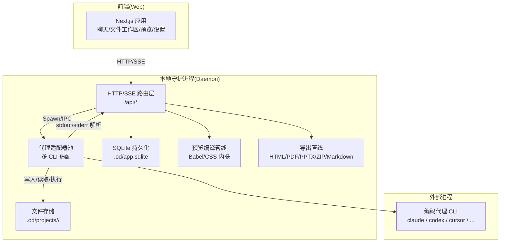
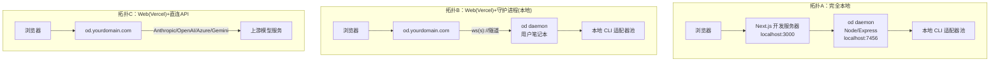
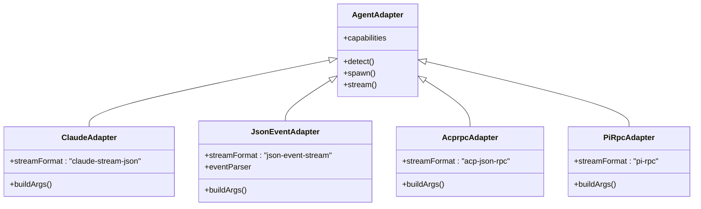
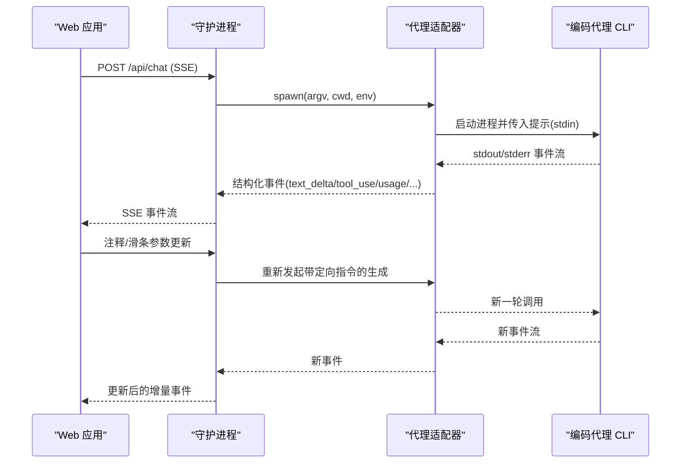
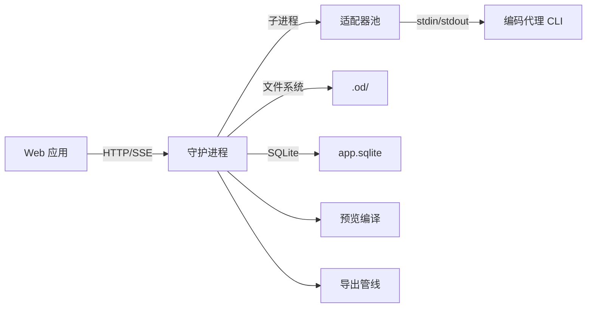

# 组件架构图

<cite>
**本文引用的文件**
- [README.md](file://README.md)
- [docs/architecture.md](file://docs/architecture.md)
- [apps/daemon/src/server.ts](file://apps/daemon/src/server.ts)
- [apps/daemon/src/agents.ts](file://apps/daemon/src/agents.ts)
- [apps/daemon/src/db.ts](file://apps/daemon/src/db.ts)
- [apps/daemon/src/json-event-stream.ts](file://apps/daemon/src/json-event-stream.ts)
- [apps/daemon/src/claude-stream.ts](file://apps/daemon/src/claude-stream.ts)
- [apps/web/src/artifacts/parser.ts](file://apps/web/src/artifacts/parser.ts)
- [apps/packaged/src/index.ts](file://apps/packaged/src/index.ts)
- [apps/web/app/layout.tsx](file://apps/web/app/layout.tsx)
</cite>

## 目录
1. [简介](#简介)
2. [项目结构](#项目结构)
3. [核心组件](#核心组件)
4. [架构总览](#架构总览)
5. [详细组件分析](#详细组件分析)
6. [依赖关系分析](#依赖关系分析)
7. [性能考量](#性能考量)
8. [故障排查指南](#故障排查指南)
9. [结论](#结论)
10. [附录](#附录)

## 简介
本文件面向 Open Design 的组件架构，聚焦 Web 应用、本地守护进程、代理适配器池、文件系统与媒体管线等核心模块，系统性阐述它们之间的关系、数据流与通信协议，并给出进程间通信机制（SSE、HTTP、WebSocket）的实现要点、职责边界、生命周期管理与错误处理策略。文档同时提供多幅架构图与流程图，帮助读者快速建立对系统的整体认知。

## 项目结构
Open Design 采用“Web 前端 + 本地守护进程”的双层架构：前端基于 Next.js 16 App Router；后端以 Node/Express 守护进程提供 REST/SSE 接口、会话与项目管理、代理适配器池、SQLite 数据持久化、预览渲染与导出管线等能力；桌面壳层通过 sidecar 协议提供 IPC 能力，支持自动化测试与桌面集成。

**图表来源**
- [docs/architecture.md](file://docs/architecture.md)
- [apps/daemon/src/server.ts](file://apps/daemon/src/server.ts)
- [apps/daemon/src/agents.ts](file://apps/daemon/src/agents.ts)
- [apps/daemon/src/db.ts](file://apps/daemon/src/db.ts)

**章节来源**
- [README.md](file://README.md)
- [docs/architecture.md](file://docs/architecture.md)

## 核心组件
- Web 应用（Next.js）
  - 负责聊天界面、文件工作区、沙箱预览 iframe、设置与导入等功能。
  - 预览渲染采用 vendored React 18 + Babel，支持 JSX 动态转换与 HTML 内联。
- 本地守护进程（Node/Express）
  - 提供 /api/* REST/SSE 接口，维护会话、索引技能与设计系统、运行预览编译与导出管线。
  - 通过 agent adapter pool 管理多 CLI 适配器实例，复用以降低启动开销。
- 代理适配器池
  - 针对不同 CLI（Claude Code、Codex、Cursor Agent、Gemini、OpenCode、Copilot、Pi、Devin/Hermes/Kimi/Kiro/Vibe 等）定义统一的 argv 构造、stdin 提示传递、stdout/stderr 解析与事件映射。
- 文件系统与数据持久化
  - .od/ 下的 artifacts/ 与 projects/ 存放产物与项目文件；SQLite 记录项目、对话、消息、标签页、模板与部署状态等元数据。
- 预览与导出
  - 预览使用 sandbox iframe + srcdoc；导出支持 HTML 自含、PDF、PPTX、ZIP、Markdown。
- 桌面壳层（可选）
  - 通过 sidecar 协议在命名空间下启动 sidecar，提供 STATUS/EVAL/SCREENSHOT/CONSOLE/CLICK/SHUTDOWN 等 IPC 能力，用于 E2E 自动化。

**章节来源**
- [apps/daemon/src/server.ts](file://apps/daemon/src/server.ts)
- [apps/daemon/src/agents.ts](file://apps/daemon/src/agents.ts)
- [apps/daemon/src/db.ts](file://apps/daemon/src/db.ts)
- [apps/web/src/artifacts/parser.ts](file://apps/web/src/artifacts/parser.ts)
- [apps/packaged/src/index.ts](file://apps/packaged/src/index.ts)

## 架构总览
下图展示了三类部署拓扑：完全本地、Web 在 Vercel + 守护进程在本地、Web 在 Vercel + 直连 API（无守护进程）。三种形态共享 Web 打包，差异在于传输通道启用情况。

**图表来源**
- [docs/architecture.md](file://docs/architecture.md)

**章节来源**
- [docs/architecture.md](file://docs/architecture.md)

## 详细组件分析

### Web 应用（Next.js）
- 角色与职责
  - UI 层：聊天面板、文件树、预览 iframe、滑条/注释覆盖层、国际化与主题。
  - 预览渲染：沙箱 iframe + srcdoc 加载；JSX 通过 vendored React 18 + Babel 动态转换。
  - 评论/注释：点击捕获元素 id，发送注释到守护进程，再由适配器驱动代理进行定向修改。
  - 滑条参数：当代理发出“调整参数”工具调用时，Web 展示实时控件并重发参数化提示，避免额外聊天轮次。
- 生命周期与状态
  - React/Browser 状态与守护进程 API 同步；项目/对话/文件由守护进程 SQLite 管理。
- 错误处理
  - 对于不可解析的预览内容或渲染失败，回退为静态 HTML 或错误提示。

**章节来源**
- [apps/web/app/layout.tsx](file://apps/web/app/layout.tsx)
- [apps/web/src/artifacts/parser.ts](file://apps/web/src/artifacts/parser.ts)
- [docs/architecture.md](file://docs/architecture.md)

### 本地守护进程（od daemon）
- 角色与职责
  - HTTP/SSE 路由层：/api/* REST 接口；聊天流式输出使用 SSE。
  - 会话管理：每个 Web Tab 对应一个会话，保存当前代理、技能、设计系统、活动工件与工具调用。
  - 适配器池：按检测到的 CLI 实例化适配器，跨会话复用，降低冷启动成本。
  - 技能与设计系统：扫描多路径技能与 DESIGN.md，热重载变更。
  - 文件存储：将产物写入磁盘（artifacts/ 与 projects/），不驻留内存。
  - 预览与导出：Babel 转换 JSX、CSS 内联、PDF 导出、PPTX 生成、ZIP 归档、Markdown 输出。
- 进程间通信
  - SSE：/api/chat 使用 Server-Sent Events 流式返回代理事件。
  - HTTP：REST 接口用于配置、项目、文件、模板、导入导出等。
  - WebSocket：在拓扑 B 中通过隧道连接，保持长连接以减少延迟。
- 安全模型
  - 默认绑定 localhost；Preview 使用 sandbox iframe；代理权限由各 CLI 自身控制；BYOK 密钥仅在守护进程或浏览器中存在。

**章节来源**
- [apps/daemon/src/server.ts](file://apps/daemon/src/server.ts)
- [apps/daemon/src/db.ts](file://apps/daemon/src/db.ts)
- [docs/architecture.md](file://docs/architecture.md)

### 代理适配器池
- 适配器接口
  - 检测：PATH 查找 + 配置目录探测，缓存能力标志。
  - 启动：以标准化包装提示 + 技能/设计系统上下文 + 项目工作目录启动 CLI。
  - 流式：解析 stdout/stderr 为结构化事件（JSON Lines 或行级解析）。
  - 能力报告：是否支持多轮、定向编辑、原生技能加载、工具调用等。
- 支持的 CLI 与格式
  - Claude Code：claude-stream-json（含部分消息增量）。
  - Codex：json-event-stream + codex 解析器。
  - Cursor Agent：json-event-stream + cursor-agent 解析器。
  - Gemini：json-event-stream + gemini 解析器。
  - OpenCode：json-event-stream + opencode 解析器。
  - Copilot：copilot-stream-json（JSON 结构化事件）。
  - Pi：pi-rpc（stdio JSON-RPC）。
  - Devin/Hermes/Kimi/Kiro/Vibe：acp-json-rpc（Agent Client Protocol）。
- 提示传递与长度限制
  - 大提示通过 stdin 传递，避免 Windows/Unix 的 argv 长度限制；必要时回退到临时提示文件。
- 模型列表与推理选项
  - 优先从 CLI 自带 list-models 获取；否则使用静态回退列表；部分 CLI 支持推理强度预设。

**图表来源**
- [apps/daemon/src/agents.ts](file://apps/daemon/src/agents.ts)

**章节来源**
- [apps/daemon/src/agents.ts](file://apps/daemon/src/agents.ts)

### 数据流与事件解析
- Claude Code 流解析
  - 支持 stream-json 增量文本/思考/工具输入拼接；最终 assistant 包裹块触发工具使用与文本/思考增量事件。
- JSON 事件流解析（Codex/Cursor/Gemini/OpenCode）
  - 按 CLI 类型识别事件类型，提取文本增量、工具调用、结果、用量统计与耗时等。
- Web 端工件解析
  - 流式解析 <artifact> 标签，产出 artifact:start/chunk/end 与普通文本事件，便于增量预览与增量渲染。

**图表来源**
- [apps/daemon/src/claude-stream.ts](file://apps/daemon/src/claude-stream.ts)
- [apps/daemon/src/json-event-stream.ts](file://apps/daemon/src/json-event-stream.ts)
- [apps/web/src/artifacts/parser.ts](file://apps/web/src/artifacts/parser.ts)

**章节来源**
- [apps/daemon/src/claude-stream.ts](file://apps/daemon/src/claude-stream.ts)
- [apps/daemon/src/json-event-stream.ts](file://apps/daemon/src/json-event-stream.ts)
- [apps/web/src/artifacts/parser.ts](file://apps/web/src/artifacts/parser.ts)

### 文件系统与持久化
- 文件布局
  - .od/：artifacts/（一次性渲染）、projects/<id>/（项目工作区）、app.sqlite（项目/对话/消息/标签页/模板/部署）。
- SQLite 表结构要点
  - projects、templates、conversations、messages、preview_comments、tabs、deployments 等。
- 项目工作区
  - 适配器以项目目录为 cwd，代理具备真实文件系统读写能力，支持 Bash/WebFetch 等工具调用。

**章节来源**
- [apps/daemon/src/db.ts](file://apps/daemon/src/db.ts)
- [README.md](file://README.md)

### 预览渲染与导出
- 预览
  - 沙箱 iframe（sandbox="allow-scripts"，无 allow-same-origin），静态 HTML 通过 srcdoc 加载；JSX 通过 vendored React 18 + Babel 动态转换。
  - 工件文件写入触发去抖重建与 srcdoc 替换。
- 导出
  - HTML（内联 CSS、重写资源为 data: URI）、PDF（puppeteer page.pdf）、PPTX（技能中间 JSON + pptxgenjs）、ZIP（归档 artifacts/<id>/）、Markdown（直接复制或技能定义渲染）。

**章节来源**
- [docs/architecture.md](file://docs/architecture.md)

### 桌面壳层与 IPC（Sidecar）
- 运行时
  - packaged 应用启动 sidecar，应用侧车环境变量与命名空间路径，注册 od:// 协议，发现 Web URL 并注入运行时。
- IPC 能力
  - STATUS/EVAL/SCREENSHOT/CONSOLE/CLICK/SHUTDOWN 等命令通过命名套接字通道下发，支撑 E2E 自动化。

**章节来源**
- [apps/packaged/src/index.ts](file://apps/packaged/src/index.ts)

## 依赖关系分析
- 组件耦合
  - Web 与 Daemon 通过 HTTP/SSE 强耦合；Daemon 与 CLI 通过子进程弱耦合（适配器抽象屏蔽差异）。
  - Daemon 与 SQLite 强耦合（元数据持久化）；与文件系统强耦合（项目产物）。
- 外部依赖
  - Express/child_process/better-sqlite3/iframe sandbox 等。
- 可能的循环依赖
  - 未见直接循环；适配器池作为单例被路由层调用，避免反向依赖。

**图表来源**
- [apps/daemon/src/server.ts](file://apps/daemon/src/server.ts)
- [apps/daemon/src/agents.ts](file://apps/daemon/src/agents.ts)
- [apps/daemon/src/db.ts](file://apps/daemon/src/db.ts)

**章节来源**
- [apps/daemon/src/server.ts](file://apps/daemon/src/server.ts)
- [apps/daemon/src/agents.ts](file://apps/daemon/src/agents.ts)
- [apps/daemon/src/db.ts](file://apps/daemon/src/db.ts)

## 性能考量
- 启动与检测
  - 守护进程启动 < 500ms；适配器并行探测；技能索引冷扫描 < 100ms，热监听 chokidar。
- 首次生成延迟
  - 主要由代理模型时间决定；框架开销 < 50ms。
- 预览刷新
  - 工件文件写入去抖 100ms 后重建 iframe。
- 传输与缓冲
  - SSE 设置 Cache-Control: no-cache, no-transform；X-Accel-Buffering: no；nginx 需关闭 proxy_buffering 与 gzip，避免分块传输中断。

**章节来源**
- [docs/architecture.md](file://docs/architecture.md)

## 故障排查指南
- SSE 分块传输问题
  - 症状：nginx 上出现 net::ERR_INCOMPLETE_CHUNKED_ENCODING。
  - 处理：禁用 gzip 与 proxy_buffering，延长 proxy_read_timeout/proxy_send_timeout。
- 跨域与 Origin/Host 校验
  - 守护进程对 Origin/Host 进行白名单校验，确保 loopback/本地网络主机访问；非允许来源请求被拒绝。
- 上传与文件名处理
  - multer 限制与错误码映射；UTF-8 原始文件名解码与安全清洗；超限报错明确。
- 代理适配器
  - 若某 CLI 不可用，检查 PATH 与版本/帮助输出探测；查看能力标志与模型列表拉取是否成功。
- 预览异常
  - 沙箱 iframe 无法加载：确认 srcdoc 内容与资源内联；JSX 渲染需 vendored React/Babel 正常注入。
- 导出失败
  - PDF/PPTX/ZIP/Markdown 导出依赖 puppeteer/第三方库；检查依赖安装与资源路径。

**章节来源**
- [apps/daemon/src/server.ts](file://apps/daemon/src/server.ts)
- [apps/daemon/src/json-event-stream.ts](file://apps/daemon/src/json-event-stream.ts)
- [apps/daemon/src/claude-stream.ts](file://apps/daemon/src/claude-stream.ts)

## 结论
Open Design 通过“Web + 守护进程 + 适配器池 + 文件系统 + SQLite”的清晰分层，实现了本地优先、可部署、可扩展的设计工作流。SSE/HTTP/WebSocket 的组合满足了从本地到云端的多种拓扑需求；适配器池抽象屏蔽了多 CLI 的差异；预览与导出管线保证了产物质量与交付多样性。建议在生产环境中严格遵循安全边界（localhost 绑定、沙箱预览、代理权限模型），并针对传输层做合理的 nginx 配置以保障 SSE 流式稳定性。

## 附录
- 关键文件定位
  - 守护进程入口与路由：apps/daemon/src/server.ts
  - 适配器定义与探测：apps/daemon/src/agents.ts
  - SQLite 模式与迁移：apps/daemon/src/db.ts
  - SSE 响应与心跳：apps/daemon/src/server.ts（createSseResponse）
  - JSON 事件流解析（多 CLI）：apps/daemon/src/json-event-stream.ts
  - Claude Code 事件流解析：apps/daemon/src/claude-stream.ts
  - Web 工件流式解析：apps/web/src/artifacts/parser.ts
  - 桌面侧车运行：apps/packaged/src/index.ts
  - Web 应用根布局：apps/web/app/layout.tsx
- 相关文档
  - 架构总览与部署拓扑：docs/architecture.md
  - 仓库总览与组件清单：README.md